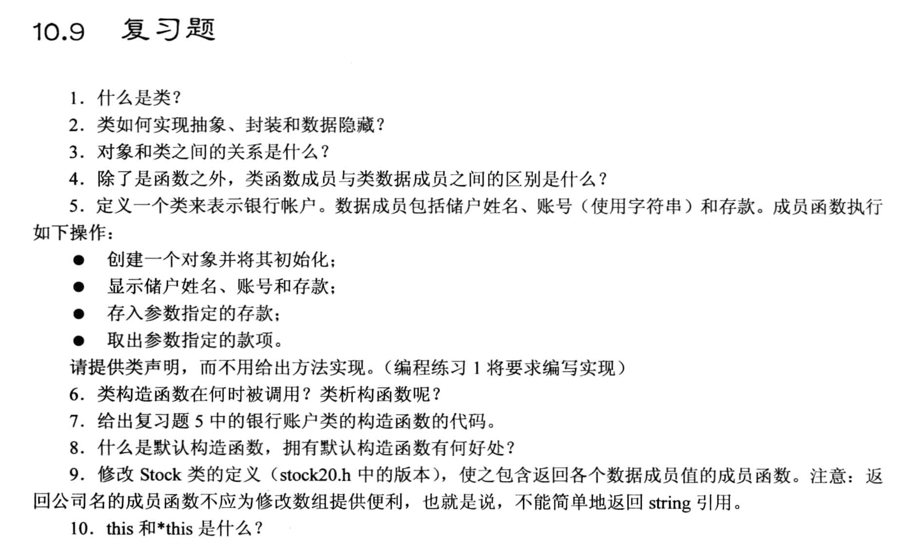

# 复习题


## 1
类是用户自定义的一种数据类型, 它包含了数据和函数, 用来描述一类对象的行为和状态. 数据一般放在 private 部分, 函数一般放在 public 部分, private 里面的数据一般需要通过public定义的函数去访问(赋值/修改等).

## 2
- 类的抽象: 指统一的数据类型和相关的操作, 例如: int 类型的数据和相关的操作(加减乘除等).
- 类的封装: 指将数据和操作封装在一起, 例如: int 类型的数据和相关的操作(加减乘除等)封装在一起, 通过 int 类型的变量去访问. 
    - 把数据的操作都放在接口函数里, 使用这个类的人只需要知道这个接口函数能用, 并且这个接口函数只完成某种功能, 不需要知道具体的实现细节, 这种就叫做封装.
- 数据隐藏: 指将数据隐藏在类的内部(private里定义变量), 只能通过类的接口(函数)去访问(public部分中定义的函数), 不能直接访问.

## 3
- 类与对象之间的关系等同于标准类型与变量之间的关系
  - 如`int a;`, int 就是一个类, a 就是一个对象.
- 对象是类的实例, 类是对象的抽象.

## 4
类函数成员一般定义在 public 部分, 而 类的数据成员一般定义在 private 部分.

## 5
- `r5.h`文件:
```cpp
class BankAccount 
{
    private:
        char name[50];
        char accountNumber[50];
        double balance;
    
    public:
        BankAccount(const char *client, const char *num, double bal = 0.0);          // 构造函数: 初始化
        void show(void) const;       // 显示
        void deposit(double cash);   // 存款
        void withdraw(double cash);  // 取款
};

```

## 6
调用构造函数的场景:
1. 创建对象
2. 显式地使用类的构造函数

调用析构函数的场景(自动调用的, 不需要人为操作):
1. 对象生命周期结束
2. 程序结束

## 7
```cpp
#include <cstring>

class BankAccount 
{
    private:
        char name[50];
        char accountNumber[50];
        double balance;
    
    public:
        BankAccount(const char *client, const char *num, double bal = 0.0);          // 构造函数: 初始化
        void show(void) const;       // 显示
        void deposit(double cash);   // 存款
        void withdraw(double cash);  // 取款
};

BankAccount::BankAccount(const char *client, const char *num, double bal)
{
    strncpy(name, client, 49);      // 限制长度(截断)
    name[49] = '\0';                // 手动结束字符串   
    strncpy(accountNumber, num, 49); // 限制长度(截断)
    accountNumber[49] = '\0';        // 手动结束字符串 
    balance = bal;
}
```

## 8
默认构造函数: 
- 不带参数的构造函数, 例如: `BankAccount(void);`
- 所有参数都有默认值的构造函数, 例如: `BankAccount(const char *client = "no name", const char *num = "no number", double bal = 0.0);`

好处:
- 声明一个对象时不需要显式进行初始化, 本质上也没有为对象进行初始化.

## 9
```cpp
/*
    类的声明
*/
#ifndef __STOCH_10_H__
#define __STOCH_10_H__

#include <string>

class Stock
{
    private:  // 私有部分, 只有public里面的成员才能访问这部分内容(一般private的成员都是通过 public 间接访问的)
        std::string company;    // 公司名
        long shares;            // 股票数量
        double share_val;       // 股票单价
        double total_val;       // 股票总价值

        // 计算总资产
        void setTotal() 
        {
            total_val = shares * share_val;
        }

    public:   // 公有部分, 任何代码都可以直接访问
        Stock(const std::string &co, long n, double price);  // 原来的 acquire 函数改写为自定义的构造函数
        ~Stock();  // 声明一个析构函数 (第一种写法)

        void buy(long num, double price);
        void sell(long num, double price);
        void update(double price);
        void show() const;  // 增加 const 关键词, 将show函数定义为 "const 成员函数" 
        const Stock& topval(const Stock &s) const;

        // 新增4个函数, 返回各个成员的值, 并且不修改任何成员变量
        const std::string & company_name() const { return company; }
        const long & num_shares() const {return shares; }
        const double & share_value() const { return share_val; }
        const double & value_total() const { return total_val; }

};  // 别忘记分号, 这和结构体的语法是相同的

#endif // __STOCH_00_H__
```

## 10
this 指针: 类方法中的一个隐藏参数, `指向调用该方法的对象`, 表示当前对象在内存中的地址.

*this: 取出当前对象本身.
