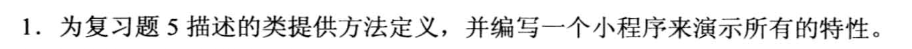
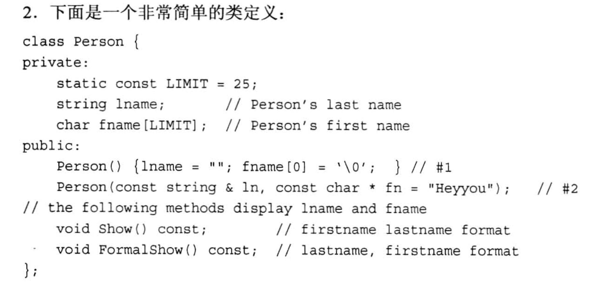
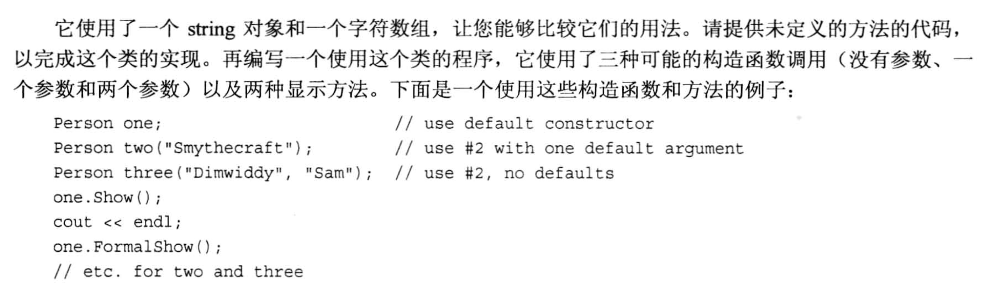
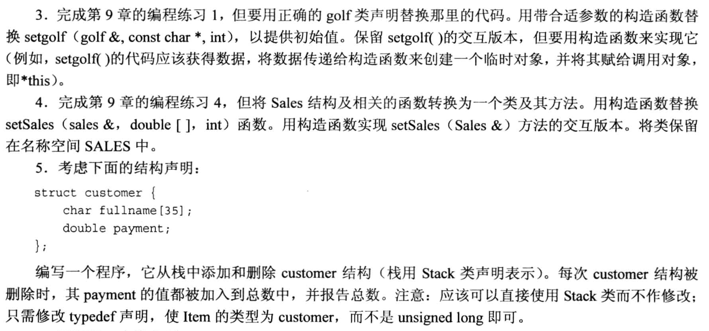
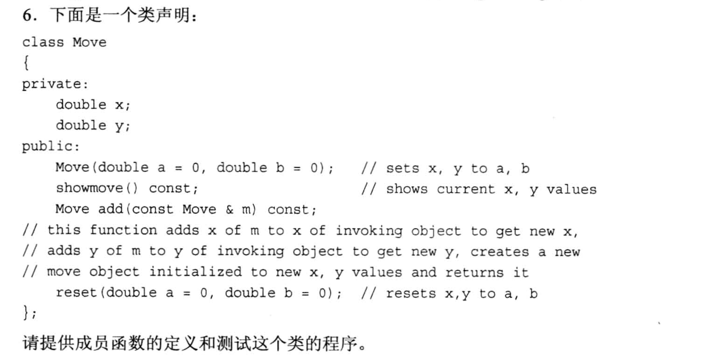
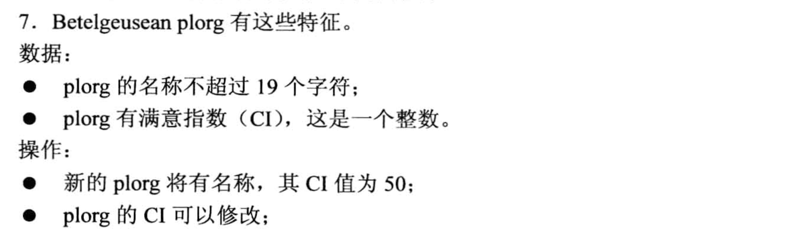
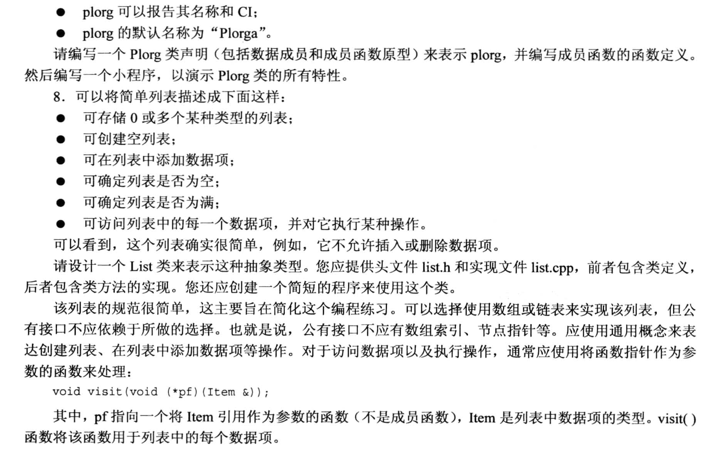

# 题目








## 1
- `p1.h`文件:

```cpp
#ifndef __P1_H__
#define __P1_H__

#include <string>
#include <iostream>
using namespace std;

class BankAccount 
{
    private:
        string name;
        string accountNumber;
        double balance;
    
    public:
        BankAccount(string client, string num, double bal = 0.0);          // 构造函数: 初始化
        void show(void) const;       // 显示
        void deposit(double cash);   // 存款
        void withdraw(double cash);  // 取款
};

#endif // __P1_H__
```

- `p1.cpp`文件:

```cpp
#include "p1.h"

BankAccount::BankAccount(string client, string num, double bal)
{
    name = client;
    accountNumber = num;
    balance = bal;
}

void BankAccount::show(void) const       // 显示
{
    cout << "The Account Information: " << endl;
    cout << "Name: " << name << endl;
    cout << "Account: " << accountNumber << endl;
    cout << "Balance: " << balance << endl;
}

void BankAccount::deposit(double cash)
{
    balance += cash;
}

void BankAccount::withdraw(double cash)
{
    balance -= cash;
}
```

- `main.cpp`文件:

```cpp
#include <iostream>
#include "p1.h"

int main(void)
{
    BankAccount n1("Rick", "0001", 1000);
    n1.show();
    cout << "-------" << endl;

    n1.deposit(500);
    cout << "After deposit: "<< endl;
    n1.show();
    cout << "-------" << endl;

    n1.withdraw(800);
    cout << "After widthdraw: "<< endl;
    n1.show();

    return 0;
}
```


## 2
- p2.h文件:

```cpp
#ifndef __P2_H__
#define __P2_H__

#include <cstring>
#include <iostream>
#include <string>

using namespace std;

class Person
{
    private:
        static const int LIMIT = 25;        // 用 static 定义常量
        string lname;
        char fname[LIMIT];

    public:
        Person() {lname = ""; fname[0] = '\0';} // 默认构造函数, 放在这里会自动变成内联函数(inline)
        Person( const string &ln, const char *fn = "Heyyou");   // 自定义的构造函数
        void show() const;
        void FormalShow() const;
};

#endif
```

- p2.cpp文件:

```cpp
#include "p2.h"

Person::Person(const string & ln, const char *fn)
{
    lname = ln;
    strcpy(fname, fn);
}

void Person::show() const
{
    if(lname == "" && fname[0] == '\0')
        cout << "No Name!" << endl;
    else
        cout << "Person name: " << fname << " " << lname << endl;
}

void Person::FormalShow() const 
{
    if(lname == "" && fname[0] == '\0')
        cout << "No Name!" << endl;
    else
        cout << "Person Name: " << lname << ", " << fname << endl;
}
```

- main.cpp文件:

```cpp
#include "p2.h"
#include <iostream>

int main(void)
{
    Person one;     // 使用默认构造
    Person two("Rick"); // 只提供Last name
    Person three("Michael", "Jackson");

    one.show();
    one.FormalShow();

    cout << "-----" << endl;
    two.show();
    two.FormalShow();

    cout << "-----" << endl;
    three.show();
    three.FormalShow();

    return 0;
}
```

## 3
- 头文件 `golf.h`
```cpp
#ifndef __GOLF_H__
#define __GOLF_H__

#include <iostream>
#include <cstring>

using namespace std;

const int Len = 40;

/*
struct golf
{
    char fullname[Len];
    int handicap;
};

void setgolf(golf & g, const char * name, int hc);

int setgolf(golf & g);

void handicap(golf & g, int hc);

void showgolf(const golf &g);
*/

// 改用类来实现 golf
class golf
{
    private:
        char fullname[Len];
        int handicap;

    public:
        golf();     // 改写 int setgolf(golf & g);
        golf(const char * name, int hc);  // 改写 void setgolf(golf & g, const char * name, int hc);
        void setHandicap(int hc);
        void showgolf() const;
};

#endif
```

- 源文件 `golf.cpp`
```cpp
#include "golf.h"

golf::golf()
{
    cout << "The fullname is: ";
    cin.getline(fullname, Len);       // 捕获一整行

    cout << "The handicap is: ";
    cin >> handicap;
    cin.get();              // 清除缓冲区里的回车
}

golf::golf(const char *name, int hc)
{
    strcpy(fullname, name);   // 字符串拷贝
    handicap = hc;
}

void golf::setHandicap(int hc)
{
    handicap = hc;
}

void golf::showgolf() const
{
    cout << "The fullname is: " << fullname << endl;
    cout << "The Handicap is: " << handicap << endl;
}

```

- main.cpp文件
```cpp
#include <iostream>
#include "golf.h"

using namespace std;

int main(void)
{
    golf p1("Rick", 100);  // 自定义构造
    golf p2;                // 默认构造

    cout << endl;
    cout << "Now Show Two person...\n";

    p1. showgolf();
    cout << "-------" << endl;
    p2.showgolf();
    return 0;
}
```

## 4
- 头文件`p4.h`
```cpp
#ifndef __P4_H__
#define __P4_H__

#include <iostream>

namespace SALES
{
    const int QUARTERS = 4;

    class Sales
    {
        private:
            double sales[QUARTERS];
            double average;
            double max;
            double min;
        public:
            Sales();
            Sales(const double arr[], int n);
            void showSales() const;
    };
}

#endif // __P4_H__
```

- 源文件`p4.cpp`
```cpp
#include "p4.h"

using namespace std;

namespace SALES
{
    Sales::Sales(const double arr[], int n)     // n >= 4时, 只输入4个; n < 4时, 没输入的补零
    {
        double total = 0.0;
        int i = 0;

        // 赋值 & 算平均值
        for(i = 0; i < n && i < 4; i++){                   // 多于4个也还是输入4个
            sales[i] = arr[i];
            total += sales[i];
        }
        average = total / i;

        // 计算最大最小值
        max = sales[0];
        min = sales[0];
        for (int k = 1; k < i; k++){
            max = (max > sales[k]) ? max : sales[k];
            min = (min < sales[k]) ? min : sales[k];
        }

        // 异常处理
        if(n < 4){      // 输入的n不足4个, 则需要补零, 补足4个
            for(int k = n; k < 4; k++){
                sales[k] = 0;
            }
        }
    }

    Sales::Sales()
    {
        double total = 0.0;
        int i = 0;

        cout << "Enter 4 sales quarters:  " << endl;
        for (i = 0; i < QUARTERS; i++){     // 常量的声明放在头文件中.
            cout << "#" << i+1 << ": " << endl;
            cin >> sales[i];
            total += sales[i];

            if (i == 0){
                max = sales[i];
                min = sales[i];
            }
            else{
                max = (max > sales[i]) ? max : sales[i];
                min = (min < sales[i]) ? min : sales[i];
            }
        }
        average = total / QUARTERS;
    }

    void Sales::showSales() const
    {
        cout << "Sales of 4 QUARTERS: " << endl;
        for(int i = 0; i < QUARTERS; i++){
            cout << sales[i] << endl;
        }
        cout << "Average: " << average << endl;
        cout << "Max: " << max << endl;
        cout << "Min: " << min << endl;
    }
}
```

- main.cpp文件
```cpp
#include "p4.h"
using namespace std;
using namespace SALES;

int main(void)
{
    double arr[4] = {11.1, 22.2, 33.3, 44.4};

    Sales s1(arr, QUARTERS);
    Sales s2;           // 使用默认构造, 这里定义为交互式的方式输入

    cout << endl;

    cout << "Now show two info: " << endl;
    s1.showSales();
    cout << "--------\n";
    s2.showSales();
    return 0;
}
```

## 5
- 头文件`stack.h`
```cpp
#ifndef __STACK_H__
#define __STACK_H__

struct customer
{
    char fullname[35];
    double payment;
};

typedef customer Item;  // 通过typedef来实现简单的数据类型管理, 要修改数据类型时只要修改这里即可

class Stack
{
    private:
        enum{MAX = 10};     // 用枚举类型来实现常量
        Item items[MAX];    // Item 是一个类型别名, 用来实现统一更换数据类型
        int top;            // 栈顶指针
    public:
        Stack();            // 构造函数
        bool isEmpty() const;  // 栈是否为空 [const 成员函数, 不修改内部的数据]
        bool isFull() const;    // 栈是否满 [const 成员函数, 不修改内部的数据]
        bool push(Item &item);  // 入栈
        bool pop(Item &item);   // 出栈
};

#endif
```

- 源文件`stack.cpp`
```cpp
#include "stack.h"

Stack::Stack()
{
    top = 0;    // 初始化栈顶指针, 栈顶指针永远指向栈的 "下一个元素位置"
}

bool Stack::isEmpty() const
{
    return 0 == top;  // 如果为0则表明当前栈为空
}

bool Stack::isFull() const 
{
    return top == MAX;
}

bool Stack::push(Item &item)
{
    if(top < MAX){
        // items[top] = item;  // top 指向栈的"下一个元素"的位置, 因此top这个位置是可以直接存入数据的
        // top++;      // 也可以写成 items[top++] = item;

        items[top++] = item;
        return true;
    }
    else{
        return false;
    }
}

bool Stack::pop(Item &item)
{
    if(top > 0){
        // top--;      // 把top移动到栈里最顶端的元素位置
        // item = items[top];  // 取最顶端的元素赋值到item, 作为返回值, 此时top指向的位置依旧是"栈的下一个元素位置"
        // // 上面两行也可以直接写为: item = items[--top];

        item = items[--top];
        return true;
    }
    else{
        return false;
    }
}

```

- stacker.cpp文件
```cpp
#include <iostream>
#include <cctype>       // 为了使用 toupper()
#include "stack.h"

using namespace std;

int main(void)
{
    char ch;
    customer cust;
    double sum = 0.0;

    Stack st;               // 实例化一个 "栈" 对象

    cout << "Please Enter A to push to stack, \n"
        << "P to pop from stack, \n"
        << "Q to quit." << endl;

    // 判断输入是否合法, 并且判断是否对栈进行操作
    while(cin >> ch && toupper(ch) != 'Q'){
        while(cin.get() != '\n'){        // 处理缓冲区里的回车
            continue;
        }
        switch(ch)        
        {
            case 'A':
            case 'a':
                cout << "Enter a customer's fullname you want to push to stack...\n";
                cin.getline(cust.fullname, 35);
                cout << "Enter a customer's payment you want to push to stack...\n";
                cin >> cust.payment;

                if(st.isFull()){
                    cout << "stack already full!!" << endl;
                }
                else{
                    st.push(cust);
                }
                break;
            case 'P':
            case 'p':
                if(st.isEmpty()){
                    cout << "Stack is Empty!" << endl;
                }
                else{
                    st.pop(cust);
                    sum += cust.payment;
                    cout << cust.fullname << " is poped!" << endl;
                    cout << cust.payment << " is poped!" << endl;
                    cout << "Sum Payment = " << sum << endl;
                }
                break;
        }

        // 提示输入下一组数据
        cout << "Please Enter A to push to stack, \n"
        << "P to pop from stack, \n"
        << "Q to quit." << endl;
    }
    return 0;
}
```

## 6
- 头文件`p6.h`
```cpp
#ifndef __P6_H__
#define __P6_H__
#include <iostream>

using namespace std;

class Move
{
    private:
        double x;
        double y;

    public:
        Move(double a = 0, double b = 0);
        void showmove() const;
        Move add(const Move &m);
        void reset(double a = 0, double b = 0);

};
#endif
```


- 源文件`p6.cpp`
```cpp
#include "p6.h"

Move::Move(double a, double b)
{
    x = a;
    y = b;
}

void Move::showmove() const 
{
    cout << "x = " << x << ", y = " << y << endl;
}

Move Move::add(const Move &m)
{
    Move temp;
    temp.x = x + m.x;
    temp.y = y + m.y;
    return temp;
}

void Move::reset(double a, double b)
{
    x = a;
    y = b;
}
```

- main.cpp文件
```cpp
#include "p6.h"
#include <iostream>

using namespace std;

int main(void)
{
    Move m1(11.1, 22.2);
    Move m2(10.0, 20.0);
    double x, y;
    m1.showmove();
    m2.showmove();

    cout << "Enter new x and y: ";
    cin >> x >> y;
    m1.reset(x, y);
    m1.showmove();

    Move m3 = m1.add(m2);
    cout << "Show m3..." << endl;
    m3.showmove();
    return 0;
}
```

## 7

- 头文件`p7.h`
```cpp
#ifndef __P7_H__
#define __P7_H__

#include <iostream>
#include <cstring>

using namespace std;

class plorg
{
    private:
        static const int SIZE = 19;
        char name[SIZE];
        int CI;
    
    public:
        plorg(const char str[] = "Plorga", int ci = 50);
        void reset(int ci);
        void show() const;
};
#endif
```

- 源文件`p7.cpp`
```cpp
#include "p7.h"

plorg::plorg(const char str[], int ci)
{
    strcpy(name, str);
    CI = ci;
}

void plorg::reset(int ci)
{
    CI = ci;
}

void plorg::show() const
{
    cout << "Name: " << name << endl;
    cout << "CI: " << CI << endl;
}
```

- main.cpp文件
```cpp
#include <iostream>
#include "p7.h"

using namespace std;

int main(void)
{
    plorg p1;       // 默认构造
    p1.show();

    p1.reset(100);
    p1.show();

    return 0;
}
```

## 8
- 头文件`list.h`
```cpp
#ifndef __LIST_H__
#define __LIST_H__
#include <iostream>
using namespace std;

typedef int Item;  // 通过typedef来实现简单的数据类型管理, 要修改数据类型时只要修改这里即可

void visit_item(Item &item);

class List
{
    private:
        enum{MAX = 10};     // 用枚举类型来实现常量
        Item items[MAX];    // Item 是一个类型别名, 用来实现统一更换数据类型
        int top;            // 列表头指针, 用栈的方式实现
    public:
        List();            // 构造函数
        bool isEmpty() const;   // 列表是否为空 [const 成员函数, 不修改内部的数据]
        bool isFull() const;    // 列表是否满 [const 成员函数, 不修改内部的数据]
        bool add(Item &item);   // 添加元素
        void visit(void (*pf)(Item &));     // 注意这里是 "函数指针" !!
};

#endif
```

- 源文件`list.cpp`
```cpp
#include "list.h"

List::List()
{
    top = 0;    // 初始化列表头指针, 栈顶指针永远指向栈的 "下一个元素位置"
}

bool List::isEmpty() const
{
    return 0 == top;  // 如果为0则表明当前栈为空
}

bool List::isFull() const 
{
    return top == MAX;
}

bool List::add(Item &item)
{
    if(top < MAX){
        items[top++] = item;
        return true;
    }
    else{
        return false;
    }
}

// 访问列表中的每一项数据, 注意传入的是一个 函数指针 pf!
void List::visit(void (*pf)(Item &))
{
    for(int i = 0; i < top; i++){
        pf(items[i]);
    }
}

void visit_item(Item &item)
{
    cout << "Item = " << item << endl;
}
```

- main.cpp 文件
```cpp
#include <iostream>
#include "list.h"

using namespace std;

int main(void)
{
    List list;
    Item num;
    for(int i = 0; i < 5; i++){
        cout << "Please enter a number: ";
        cin >> num;
        list.add(num);
    }
    list.visit(visit_item);
}
```