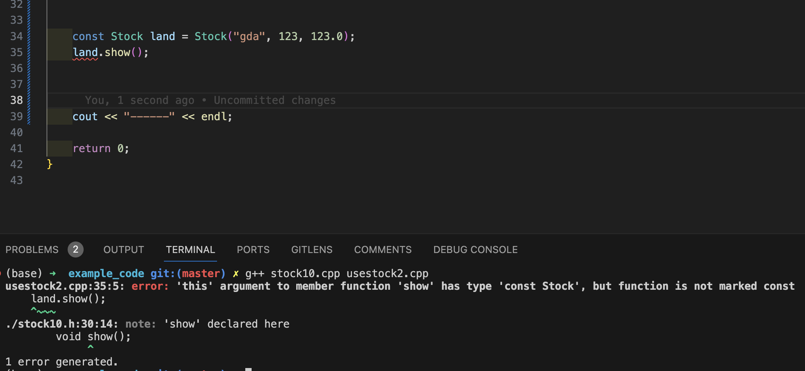

# 对象和类
C++是面向对象(`OOP`)的语言, 它最重要特性有:
1. 抽象
2. 封装和数据隐藏
3. 多态
4. 继承
5. 代码的可重用性

## 类
类是一种`将抽象转换为用户定义类型的C++工具`, 它将`数据表示`和`操纵数据的方法`组合成一个整洁的包.

### 类的声明
1. 类的声明 (**放在头文件**): 需要包含数据成员, 成员函数(也就是`方法, method`)描述的公有接口(public interface)
2. 类方法的实现(**放在cpp文件**): 成员函数的具体实现代码.

- 对于类的名字, 有些习惯是把类名称的**首字母大写**.

类的声明例子`stock00.h`
```cpp
/*
    类的声明
*/
#ifndef __STOCH_00_H__
#define __STOCH_00_H__

#include <string>

class Stock
{
    private:  // 私有部分, 只有public里面的成员才能访问这部分内容(一般private的成员都是通过 public 间接访问的)
        std::string company;    // 公司名
        long shares;            // 股票数量
        double share_val;       // 股票单价
        double total_val;       // 股票总价值

        void setTotal(double &total_val) 
        {
            total_val = shares * share_val;
        }

    public:   // 公有部分, 任何代码都可以直接访问
        void acquire(const std::string &co, long n, double price);
        void buy(long num, double price);
        double sell(long num, double price);
        void update(double price);
        void show();


};  // 别忘记分号, 这和结构体的语法是相同的

#endif // __STOCH_00_H__
```
- private里面的setTotal函数在实例中是没办法直接访问的, 程序要在使用这个类的时候**只能直接使用public里面的部分**.
  - 要访问/改变 private 里面的成员, 只能通过 public 提供的函数接口 或者 使用`友元函数`(涉及到类的继承, 后面才讲到).
  - 一般来说, `类的数据部分通常都放在private里面`, 组成`类的接口部分一般放在public部分`.
  - 类的成员中, 如果不指明 public, 默认情况下都是`private`, 但是一般建议显示地写出来, 增加可读性.


注意:
- 在`类声明`中`定义的函数`, 会`自动转换为内联函数`! 比例上面例子中的`setTotal()`函数, 比较短, 符合内联函数的要求.
  - **只要把函数的具体定义给写到类的声明中, 这个函数就会被转换成内联函数**.
  - 如果希望"不写在类声明里的函数"也成为内联函数, 则可以通过`inline`关键字的方式将这个函数转成内联函数 (跟普通的内联函数定义方法是一样的).

### 类和结构体的异同
类其实是结构体的扩展, 他们的区别是:
- `结构体的默认访问类型是 public`, 而`类默认是 private`.
- C++中通常**使用类来实现类描述**, 而把**结构体限制为只表示存粹的数据对象**(普通老式数据, Plain Old Data, POD)
  - 简单来说就是: 只有数据 --> 用结构体; 有数据也有(方法)函数 --> 用类


### 类的成员函数实现
类的成员函数实现跟普通函数的实现对比, 主要有以下两个不同:
1. 定义成员函数时, 需要使用作用域解析运算符(`::`)来标识函数所属的类
2. 类方法`可以访问类的private组件`, 比如定义在 private 里面的变量等等.

类的成员函数实现例子`stock00.cpp`:
```cpp
/*
    类的成员函数实现
*/
#include <iostream>
#include "stock00.h"

void Stock::acquire(const std::string &co, long n, double price)
{
    company = co;       // 直接就访问到了private里的变量
    if(n < 0){
        std::cout << "Number of shares can't be negative! " << company << " shares set to be 0!" << std::endl;
        shares = 0;
    }
    else{
        shares = n;
    }

    share_val = price;
    setTotal();     // 直接调用了 private 里的函数
}

void Stock::buy(long num, double price)
{
    if(num < 0){
        std::cout << "Number of shares can't be negative! Transaction aborted!" << std::endl;
    }
    else{
        shares += num;      // 买入股票, 持有数量增加 num
        share_val = price;
        setTotal();
    }
}

void Stock::sell(long num, double price)
{
    if(num < 0){
        std::cout << "Number of shares can't be negative! Transaction aborted!" << std::endl;
    }
    else if(num > shares){
        std::cout << "You can't sell more than you have! Transaction is aborted!" << std::endl;
    }
    else{
        shares -= num;
        share_val = price;
        setTotal();
    }
}

void Stock::update(double price)
{
    share_val = price;
    setTotal();
}

void Stock::show()
{
    using namespace std;
    cout << "Company: " << company << endl;
    cout << "Shares: " << shares << endl;
    cout << "Share price" << share_val << endl;
    cout << "Total worth: " << total_val << endl;
}
```

### 类的使用
前面定义的 "Stock"类 的使用`usestock.cpp`:
```cpp
#include <iostream>
#include "stock00.h"
using namespace std;

int main(void)
{
    Stock fluffy_the_cat;  // 实例化了一个stock的对象
    fluffy_the_cat.acquire("NanoSmart", 20, 12.5);      // 买入一支股票
    fluffy_the_cat.show();                              // 显示结果

    cout << "-------" << endl;
    fluffy_the_cat.buy(15, 18.125);
    fluffy_the_cat.show();

    cout << "-------" << endl;
    fluffy_the_cat.sell(400, 20);
    fluffy_the_cat.show();

    cout << "-------" << endl;
    fluffy_the_cat.buy(300000, 40.125);
    fluffy_the_cat.show();

    cout << "-------" << endl;
    fluffy_the_cat.sell(300000, 0.125);
    fluffy_the_cat.show();

    return 0;
}
```

### 小结
1. 类的声明, 常见的情况是分为`private`和`public`两个部分(protect后面再讨论)
   - 对于`private`: 
     - 把数据放在这部分, 可以确保数据的完整性, 这个操作实现了`数据隐藏`.
     - private 里面的所有内容都可以通过`public定义的内容`**直接访问**.
   - 对于`public`:
     - 类进行实例化出一个对象后, 该对象能够直接访问的部分只有public, 如果希望这个对象能直接操作private里面的数据, 则需要使用public里面**事先定义好的函数间接地访问**.
2. 在**类的声明**里, 如果对**某个函数直接写了具体实现**, 则这个函数会被`自动转换为内联函数`
   - 如果希望**类的具体实现部**分的某个函数也成为内联函数, 则需要使用关联词`inline`.

3. 类的定义部分:
   - 函数名字的前面都需要使用作用域解析运算符(`::`)来表明这个函数属于哪个类.


## 类的构造函数和析构函数
### 构造函数
联想结构体, 我们可以发现结构体的初始化一般可以写成:
```cpp
struct abc
{
    int a;
    int b;
    int c;
};

abc test1 = {1, 2, 3};      // 结构体的初始化
```
但是对于类来说, 我们通常希望对数据部分进行保护(将数据定义在private里面), 此时我们就不能在初始化对象的时候像结构体那样初始化这些数据, 于是我们需要一种方式来初始化那些private里面的数据变量 --> 使用**类的构造函数**.
- 构造函数的任务就是`用来完成类的数据初始化`.

#### 定义构造函数
类的构造函数有以下特点:
1. 函数名字就是类的名字
2. 函数没有返回值, 也`不写 void`.


构造函数需要注意:
1. 类的构造函数的`参数列表不要出现与数据成员同名的变量`, 这会产生混乱.
   1. 方法1: 在变量名字前面加前缀`m_`, 如`m_company`.
   2. 方法2: 在变量名字后面加后缀`_`, 如`company_`.
2. 使用构造函数分为`显式使用`和`隐式使用` (看例子)
3. 默认构造函数: 如果在创建对象时没有显式地提供初始值, 则会调用默认构造函数.
   1. 默认构造函数什么都不干, 不会初始化任何成员变量.
   2. 当且仅当没有自定义构造函数时, 编译器才会提供默认构造函数.
      - 也就是说, 如果我们定义了一个构造函数, 此时如果想要再使用默认构造函数, 就需要自己写一个什么都不干的构造函数作为默认构造函数...
        - 也可以提供一个带默认值的构造函数, 但是`默认构造函数只能有一个`.
        ```cpp
        class Stock
        {
            public: 
                Stock(const std::string &co = "Error", long n = 0, double price = 0.0)
                {
                    company = co;
                    if(n < 0){
                        std::cout << "Number of shares can't be negative! " << company << " shares set to be 0!" << std::endl;
                        shares = 0;
                    }
                    else{
                        shares = n;
                    }
                    share_val = price;
                    setTotal();
                }
            private:
                std::string company;
                long share;
                double share_val;
                double total_val;
                void setTotal() {total_val = shares * share_val;}
        }
        ```

(完整)代码例子:
头文件`stock10.h`:
```cpp
/*
    类的声明
*/
#ifndef __STOCH_10_H__
#define __STOCH_10_H__

#include <string>

class Stock
{
    private:  // 私有部分, 只有public里面的成员才能访问这部分内容(一般private的成员都是通过 public 间接访问的)
        std::string company;    // 公司名
        long shares;            // 股票数量
        double share_val;       // 股票单价
        double total_val;       // 股票总价值

        // 计算总资产
        void setTotal() 
        {
            total_val = shares * share_val;
        }

    public:   // 公有部分, 任何代码都可以直接访问
        //Stock(const std::string &co, long n, double price);  // 原来的 acquire 函数改写为自定义的构造函数
        Stock(const std::string &co = "Error", long n = 0, double price = 0.0); // 测试第一种默认构造函数
        // Stock(); // 测试第二种默认构造函数

        void buy(long num, double price);
        void sell(long num, double price);
        void update(double price);
        void show();


};  // 别忘记分号, 这和结构体的语法是相同的

#endif // __STOCH_10_H__
```

cpp文件`stock10.cpp`:
```cpp
/*
    类的成员函数实现
*/
#include <iostream>
#include "stock10.h"

Stock::Stock(const std::string &co, long n, double price)
{
    company = co;       // 直接就访问到了private里的变量
    if(n < 0){
        std::cout << "Number of shares can't be negative! " << company << " shares set to be 0!" << std::endl;
        shares = 0;
    }
    else{
        shares = n;
    }

    share_val = price;
    setTotal();     // 直接调用了 private 里的函数
}

// 测试第二种默认构造函数
// Stock::Stock()
// {
//     company = "no name";
//     shares = 0;
//     share_val = 0.0;
//     total_val = 0.0;
// }

void Stock::buy(long num, double price)
{
    if(num < 0){
        std::cout << "Number of shares can't be negative! Transaction aborted!" << std::endl;
    }
    else{
        shares += num;      // 买入股票, 持有数量增加 num
        share_val = price;
        setTotal();
    }
}

void Stock::sell(long num, double price)
{
    if(num < 0){
        std::cout << "Number of shares can't be negative! Transaction aborted!" << std::endl;
    }
    else if(num > shares){
        std::cout << "You can't sell more than you have! Transaction is aborted!" << std::endl;
    }
    else{
        shares -= num;
        share_val = price;
        setTotal();
    }
}

void Stock::update(double price)
{
    share_val = price;
    setTotal();
}

void Stock::show()
{
    using namespace std;
    cout << "Company: " << company << endl;
    cout << "Shares: " << shares << endl;
    cout << "Share price: " << share_val << endl;
    cout << "Total worth: " << total_val << endl;
}
```

主函数文件`usestock2.cpp`:
```cpp
#include <iostream>
#include "stock10.h"
using namespace std;

int main(void)
{
    // method 1: 隐式调用构造函数
    Stock stock1("NanoSmart", 12, 20.0);
    stock1.show();

    cout << "------" << endl;

    // method 2: 显式地使用构造函数
    Stock stock2 = Stock("Boffo Object", 250, 1.25);
    stock2.show();

    // 测试默认构造函数(两种默认构造函数都用这个方式测)
    cout << "\nTesting default construction...." << endl;
    Stock stock3;
    stock3.show();

    return 0;
}
```

注意区分容易混淆的代码:
```cpp
Stock first("Concreate Conglometer");  // 调用自定义的构造函数
Stock second();     // 这是在声明一个函数, 函数名叫 second, 它没有传入的参数, 函数的返回值是一个 Stock 类型.
Stock third;        // 调用Stock的默认构造函数
```

### 析构函数
析构函数用来完成`清理`工作:
- 比如构造函数使用了 `new 来分配内存`, 这时候就需要使用析构函数来 `delete 这些变量`
- 如果构造函数里没有使用new 分配内存, 则析构函数也不需要进行delete, 此时应该使用默认的析构函数, 它什么也不干, 就像默认构造函数一样.

析构函数的特点:
1. 函数名字前面有`~`号, 如`Stock::~Stock()`.
2. 函数`没有返回值`, 也`不写void`.
3. `析构函数没有参数`.
4. 析构函数的调用是`自动`的:
   1. 如果创建的是`静态存储`类对象(加static, 或者全局), 则析构函数将在**程序结束**时自动调用.
   2. 如果创建的是`自动存储`类对象(平时常用的局部变量那种方式), 则析构函数将在**程序执行完代码块**时自动调用.
   3. 如果对象是通过`new创建`的, 则`析构函数将驻留在 "栈内存" 或自由存储区中`, 当**使用delete来释放内存时, 析构函数就会自动调用**.
      1. 在析构时, 如果有多个对象, 我们将看到最先创建的对象是最后被析构的, 而最后创建的对象是第一个被析构的, 原因就是对象都被放在**栈内存**中.
   4. 程序可以创建`临时对象`来完成特定的操作, 此时, 程序将在**结束使用该对象**时自动调用析构函数.
5. 如果没有定义析构函数, 编译器将`隐式地定义一个默认析构函数`.


代码例子(修改了上面的stock类代码)
头文件`stock.h`
```cpp
/*
    类的声明
*/
#ifndef __STOCH_10_H__
#define __STOCH_10_H__

#include <string>

class Stock
{
    private:  // 私有部分, 只有public里面的成员才能访问这部分内容(一般private的成员都是通过 public 间接访问的)
        std::string company;    // 公司名
        long shares;            // 股票数量
        double share_val;       // 股票单价
        double total_val;       // 股票总价值

        // 计算总资产
        void setTotal() 
        {
            total_val = shares * share_val;
        }

    public:   // 公有部分, 任何代码都可以直接访问
        Stock(const std::string &co, long n, double price);  // 原来的 acquire 函数改写为自定义的构造函数
        ~Stock();  // 声明一个析构函数 (第一种写法)

        void buy(long num, double price);
        void sell(long num, double price);
        void update(double price);
        void show();


};  // 别忘记分号, 这和结构体的语法是相同的

#endif // __STOCH_10_H__
```

cpp文件`stock10.cpp`
```cpp
/*
    类的成员函数实现
*/
#include <iostream>
#include "stock10.h"

Stock::Stock(const std::string &co, long n, double price)
{
    company = co;       // 直接就访问到了private里的变量
    if(n < 0){
        std::cout << "Number of shares can't be negative! " << company << " shares set to be 0!" << std::endl;
        shares = 0;
    }
    else{
        shares = n;
    }

    share_val = price;
    setTotal();     // 直接调用了 private 里的函数
}

// 定义一个析构函数
Stock::~Stock()
{
    std::cout << "Bye! " << company << std::endl;
}

void Stock::buy(long num, double price)
{
    if(num < 0){
        std::cout << "Number of shares can't be negative! Transaction aborted!" << std::endl;
    }
    else{
        shares += num;      // 买入股票, 持有数量增加 num
        share_val = price;
        setTotal();
    }
}

void Stock::sell(long num, double price)
{
    if(num < 0){
        std::cout << "Number of shares can't be negative! Transaction aborted!" << std::endl;
    }
    else if(num > shares){
        std::cout << "You can't sell more than you have! Transaction is aborted!" << std::endl;
    }
    else{
        shares -= num;
        share_val = price;
        setTotal();
    }
}

void Stock::update(double price)
{
    share_val = price;
    setTotal();
}

void Stock::show()
{
    using namespace std;
    cout << "Company: " << company << endl;
    cout << "Shares: " << shares << endl;
    cout << "Share price: " << share_val << endl;
    cout << "Total worth: " << total_val << endl;
}
```

主函数`usestock2.cpp`
```cpp
#include <iostream>
#include "stock10.h"

int main(void)
{
    using namespace std;
    // method 1: 隐式调用构造函数
    Stock stock1("NanoSmart", 12, 20.0);
    stock1.show();

    cout << "------" << endl;

    // method 2: 显式地使用构造函数
    Stock stock2 = Stock("Boffo Object", 250, 1.25);    // 这是一个初始化操作, 效率比下面的stock1赋值操作高, 因为这里没有创建临时对象!
    stock2.show();

    cout << "------" << endl;

    cout << "Assigning stock1 to stock2: \n";
    stock2 = stock1;        // 类的对象之间可以直接对拷!!!!
    cout << "Listing stock1 and stock2: \n";
    stock1.show();

    cout << "------" << endl;

    cout << "Using a constructor to reset an object: \n";
    stock1 = Stock("Nifty Foods", 10,  50.0);       // 这是一个赋值操作. 这里相当于临时创建了一个对象, 然后对拷, 从输出中可以观察到这里调用了一次析构函数
    cout << "Revised Stock1:\n";
    stock1.show();
    cout << "Done!" << endl;

    cout << "------" << endl;

    return 0;
}
```

注意区分这里的代码:
```cpp
Stock stock2 = Stock("Boffo Object", 250, 1.25);    // 这是一个初始化操作, 效率比下面的stock1赋值操作高, 因为这里没有创建临时对象!

stock1 = Stock("Nifty Foods", 10,  50.0);       // 这是一个赋值操作. 这里相当于临时创建了一个对象, 然后对拷, 从输出中可以观察到这里调用了一次析构函数
```
- 初始化语句这里, stock2前面有 "类型" 名, 表明这是一句声明变量&初始化变量的语句.
- 赋值语句这里, stock1是已经声明过的变量, 这时候其实是`赋值`语句.


### const 成员函数
先看一个测试代码:
```cpp
    // 假设Stock类型已经按照前面的例子定义好了, 下面是直接使用
    const Stock land = Stock("gda", 123, 123.0);
    land.show();
```
代码输出:


- 这里的`land.show()`会报错, 主要是因为 `show()` 函数中**没有对私有成员做任何const的保护**, 以前我们主要是针对传入的参数加const做保护, 这里的show没有任何可以保证私有成员不被修改的语句.
  - 解决办法是将函数声明和实现的末尾将他`定义为 const 成员函数`, 即写为`void show() const;`
  - 因此, 如果函数中不希望对任何成员做修改时, 我们就应该在`函数声明和函数的实现的末尾`加上`const`关键词.

修改的位置为:
```cpp
    // 成员函数声明部分: 
    void show() const;  // 增加 const 关键词, 将show函数定义为 "const 成员函数" 

    // 成员函数实现部分:
    void Stock::show() const // 增加const 关键词, 定义为"const 成员函数"
    {
        using namespace std;
        cout << "Company: " << company << endl;
        cout << "Shares: " << shares << endl;
        cout << "Share price: " << share_val << endl;
        cout << "Total worth: " << total_val << endl;
    }

    // 调用部分(没变):
    cout << "\nTesting const function...";
    const Stock land = Stock("gda", 123, 123.0);    // 当创建的对象被 const 修饰时, 该对象调用的成员函数就必须是"const成员函数"
    land.show();        // 此时show函数是一个 const 成员函数
```


## this 指针
- 使用场景:
  - 有时候方法可能涉及到两个对象, 此时就需要使用`this`指针.

- 例子: 
  - 按照前面的股票例子, 如果我们需要使用某个方法, 这个方法会比较当前对象和另一个对象的价格, 找到价格最高的那一支股票, 此时, 该方法就会涉及到两个对象.

  - 如果没有this指针, 一般的思路是将第二个对象作为参数传入, 然后在方法中进行比较, 如: 
    ```cpp
    const stock & topval(const stock & s) const;

    /*
        1. 传入参数加 const, 表明这个参数不会被修改, 而函数右侧的 const 表明这个函数不会修改任何成员变量(const 成员函数), 最后返回的对象也是 const 对象.
        2. 此时, 传入的对象称为 "显式访问的对象", 而调用方法的对象称为 "隐式访问的对象"
    */
    ```

  - 与此同时, 我们也会发现如下问题:
    ```cpp
    const stock & topval(const stock & s) const
    {
        if(s.total_val > total_val){
            return s;
        }
        else{
            return ????; // 这里应该返回什么呢??
        }
    }
    ```
    - 这种情况下, 我们如果要返回隐式访问的对象, 则需要使用`*this`来返回隐式访问的对象.
      - `*this`表示取出整个调用对象.
      - 这个函数的最右侧是`const`, 说明**this指针指向的对象是const对象**, 此时我们在这个方法中将无法使用this指针修改对象的值.

一般来说, **所有类方法**都有一个`this`指针.
`this指针`都`指向调用这个成员函数的对象`
- 比如 `stock1.top_val()`, this指针指向 stock1这个对象; `stock2.top_val()`, this指针指向 stock2这个对象.
- 每个成员函数(包括`构造函数`和`析构函数`)也有 this 指针.

修改后的例子为:
- 头文件`stock20.h`
```cpp
/*
    类的声明
*/
#ifndef __STOCH_10_H__
#define __STOCH_10_H__

#include <string>

class Stock
{
    private:  // 私有部分, 只有public里面的成员才能访问这部分内容(一般private的成员都是通过 public 间接访问的)
        std::string company;    // 公司名
        long shares;            // 股票数量
        double share_val;       // 股票单价
        double total_val;       // 股票总价值

        // 计算总资产
        void setTotal() 
        {
            total_val = shares * share_val;
        }

    public:   // 公有部分, 任何代码都可以直接访问
        Stock(const std::string &co, long n, double price);  // 原来的 acquire 函数改写为自定义的构造函数
        ~Stock();  // 声明一个析构函数 (第一种写法)

        void buy(long num, double price);
        void sell(long num, double price);
        void update(double price);
        void show() const;  // 增加 const 关键词, 将show函数定义为 "const 成员函数" 
        const Stock topval(const Stock &s) const;


};  // 别忘记分号, 这和结构体的语法是相同的

#endif // __STOCH_00_H__
```

- cpp文件`stock20.cpp`
```cpp
/*
    类的成员函数实现
*/
#include <iostream>
#include "stock20.h"

Stock::Stock(const std::string &co, long n, double price)
{
    company = co;       // 直接就访问到了private里的变量
    if(n < 0){
        std::cout << "Number of shares can't be negative! " << company << " shares set to be 0!" << std::endl;
        shares = 0;
    }
    else{
        shares = n;
    }

    share_val = price;
    setTotal();     // 直接调用了 private 里的函数
}

// 定义一个析构函数
Stock::~Stock()
{
    //std::cout << "Bye! " << company << std::endl;
}

void Stock::buy(long num, double price)
{
    if(num < 0){
        std::cout << "Number of shares can't be negative! Transaction aborted!" << std::endl;
    }
    else{
        shares += num;      // 买入股票, 持有数量增加 num
        share_val = price;
        setTotal();
    }
}

void Stock::sell(long num, double price)
{
    if(num < 0){
        std::cout << "Number of shares can't be negative! Transaction aborted!" << std::endl;
    }
    else if(num > shares){
        std::cout << "You can't sell more than you have! Transaction is aborted!" << std::endl;
    }
    else{
        shares -= num;
        share_val = price;
        setTotal();
    }
}

void Stock::update(double price)
{
    share_val = price;
    setTotal();
}

void Stock::show() const // 增加const 关键词, 定义为"const 成员函数"
{
    using namespace std;
    cout << "Company: " << company << endl;
    cout << "Shares: " << shares << endl;
    cout << "Share price: " << share_val << endl;
    cout << "Total worth: " << total_val << endl;
}

const Stock Stock::topval(const Stock &s) const 
{
    if(s.total_val > total_val){    // total_val 等价于 this->total_val
        return s;
    }
    else{
        return (*this);
    }
}
```

- 主函数`usestock2.cpp`:
```cpp
#include <iostream>
#include "stock20.h"

int main(void)
{
    using namespace std;
    // method 1: 隐式调用构造函数
    Stock stock1("NanoSmart", 12, 20.0);
    stock1.show();
    cout << "------" << endl;

    // method 2: 显式地使用构造函数
    Stock stock2 = Stock("Boffo Object", 250, 1.25);    // 这是一个初始化操作, 效率比下面的stock1赋值操作高, 因为这里没有创建临时对象!
    stock2.show();
    cout << "------" << endl;

    // 比较两支股票
    Stock top = stock1.topval(stock2);
    cout << "Now show the top val: " << endl;
    top.show();

    return 0;
}
```


