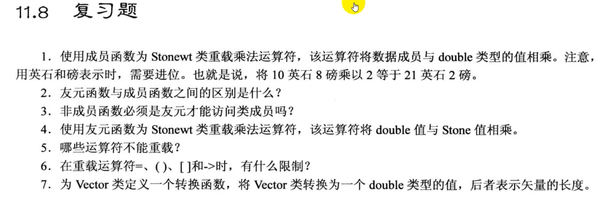

# 题目


# 1. 
- 头文件: `stonewt.h`
```cpp
#ifndef __STONEWT_H__
#define __STONEWT_H__

#include <iostream>

using namespace std;

class Stonewt       // 描述英石
{
    private:
        enum {Lbs_per_stn = 14};        // 也可以定义为 static
        int stone;
        double pds_left;
        double pounds;

    public:
        Stonewt(double lbs);
        Stonewt(int stn, double lbs);
        Stonewt();

        void show_lbs() const;
        void show_stone() const;
        Stonewt operator *(double mul);
};

#endif //!__STONEWT_H__
```

- 源文件: `stonewt.cpp`
```cpp
#include "stonewt.h"

Stonewt::Stonewt(double lbs)
{
    stone = static_cast<int>(lbs) / Lbs_per_stn;  // 强制类型转换也可以写为 (int)lbs
    pds_left = (int)lbs % Lbs_per_stn + lbs - (int)lbs;  // 整数部分 + 小数部分
    pounds = lbs;
}

Stonewt::Stonewt(int stn, double lbs)
{
    stone = stn;
    pds_left = lbs;
    pounds = stn * Lbs_per_stn + lbs;
}

Stonewt::Stonewt()
{
    stone = pds_left = pounds = 0;
}

void Stonewt::show_lbs() const
{
    cout << pounds << " pounds." << endl;
}

void Stonewt::show_stone() const 
{
    cout << stone << " stone, " << pds_left << " pounds." << endl;
}

Stonewt Stonewt::operator*(double mult)
{
    return Stonewt(pounds * mult);
}
```
- 源文件: `stone.cpp`

```cpp
#include <iostream>
#include "stonewt.h"

using namespace std;

int main(void)
{
    Stonewt taft(10, 8);       // 调用 Stonewt(double) 构造函数

    taft = taft * 2.0;          // 调用 Stonewt operator*(double) 函数
    taft.show_lbs();
    taft.show_stone();
    return 0;
}

```

# 2.

- 成员函数能访问所有的数据成员, 它是`类的一部分`
- 友元函数也能访问所有的数据成员, 但它**不是**`类的一部分`

# 3.
- 只有成员变量放在`private`里面时, 非成员函数才无法访问这些成员变量, 但如果成员变量放在`public`里面, 非成员函数也可以访问这些成员变量 (所以不一定需要限定为友元函数)
  - 友元函数则`既可以访问 public 的 成员变量 也可以访问 private 的 成员变量`

# 4.

- 头文件: `stonewt.h`
```cpp
#ifndef __STONEWT_H__
#define __STONEWT_H__

#include <iostream>

using namespace std;

class Stonewt       // 描述英石
{
    private:
        enum {Lbs_per_stn = 14};        // 也可以定义为 static
        int stone;
        double pds_left;
        double pounds;

    public:
        Stonewt(double lbs);
        Stonewt(int stn, double lbs);
        Stonewt();

        void show_lbs() const;
        void show_stone() const;
        friend Stonewt operator *(double mul, const Stonewt &s);

};

#endif //!__STONEWT_H__
```

- 源文件: `stonewt.cpp`
```cpp
#include "stonewt.h"

Stonewt::Stonewt(double lbs)
{
    stone = static_cast<int>(lbs) / Lbs_per_stn;  // 强制类型转换也可以写为 (int)lbs
    pds_left = (int)lbs % Lbs_per_stn + lbs - (int)lbs;  // 整数部分 + 小数部分
    pounds = lbs;
}

Stonewt::Stonewt(int stn, double lbs)
{
    stone = stn;
    pds_left = lbs;
    pounds = stn * Lbs_per_stn + lbs;
}

Stonewt::Stonewt()
{
    stone = pds_left = pounds = 0;
}

void Stonewt::show_lbs() const
{
    cout << pounds << " pounds." << endl;
}

void Stonewt::show_stone() const 
{
    cout << stone << " stone, " << pds_left << " pounds." << endl;
}

Stonewt operator*(double mult, const Stonewt &s)
{
    return Stonewt(s.pounds * mult);
}

```
- 源文件: `stone.cpp`

```cpp
#include <iostream>
#include "stonewt.h"

using namespace std;

int main(void)
{
    Stonewt taft(10, 8);       // 调用 Stonewt(double) 构造函数

    taft = 2.0 * taft;          // 乘法的顺序也要按照顺序来写
    taft.show_lbs();
    taft.show_stone();
    return 0;
}
```


# 5.
```txt
重载规则
1. 重载时, 至少有一个参数是用户自定义类型
2. 不能改变原有运算符的优先级, 运算逻辑或操作数个数
3. 不能创建新的运算符

不能重载的运算符有:
    sizeof
    .
    .*
    ::
    ?:
    typeid
    const_cast
    dynamic_cast
    reinterpret_cast
    static_cast 
```

# 6.
```txt
=, (), [], -> 运算符必须重载为 成员函数

// 原因是这些运算符是存在一个 "默认的重载", 如果我们定义为 "非成员函数", 就会构成"二义性", 编译器直接报错.
// 如果定义为 成员函数, 那么默认的重载就会被覆盖, 也就不会构成二义性了
```

# 7.
```txt
限制:
    1. 转换函数必须是成员函数
    2. 转换函数不能指定返回类型
    3. 转换函数不能有参数
```

在 vector 类的头文件里加上一个转换函数的定义即可.
```cpp
// (复习题)定义一个转换函数
operator double()
{
    return mag;
}
```