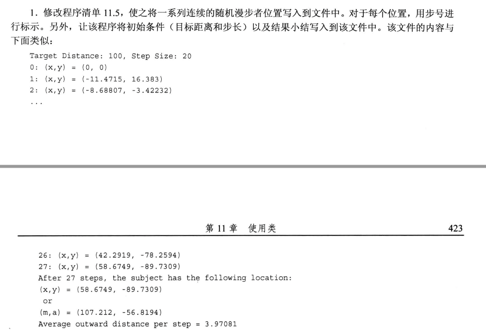
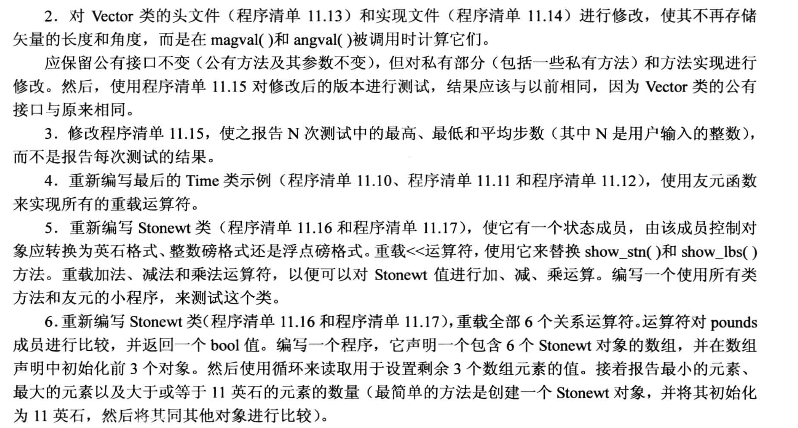
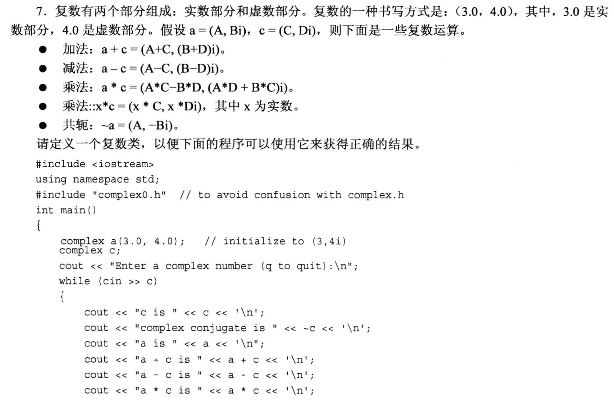
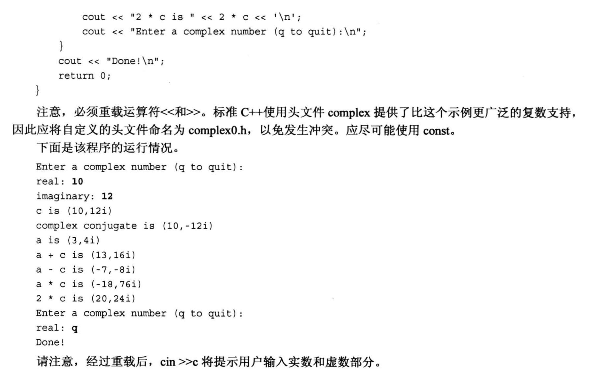

# 题目






# 1.
```cpp
/*
    使用Vector类来处理 "随机漫步" 问题.
*/
#include <iostream>
#include <cstdlib>
#include <ctime>        // 访问时间
#include <fstream>      // 用来进行文件IO
#include "vector.h"


using namespace std;
using namespace VECTOR;     // 使用命名空间 VECTOR

int main(void)
{
    double target = 0.0;    // 目标距离
    double dStep = 0.0;     // 步长(数值)
    double direction = 0.0; // 存放走的方向(角度)

    srand(time(NULL));      // 设定随机数的种子岁时间改变而改变

    Vector result(0, 0, Vector::RECT);
    Vector step;            // 移动步长(向量)

    unsigned long steps;    // 统计一共走多少步 

    ofstream fout;         // 用来创建, 打开文本文档
    fout.open("randwalk.tx");

    cout << "Enter target distance(q to quit): ";
    while (cin >> target)
    {
        cout << "Enter the step length: ";
        if(!(cin >> dStep)) // 如果输入的 dStep 为0就直接退出
            break;

        fout << "Target Distance: " << target << ", step size: " <<  dStep;

        while( result.magval() < target){
            fout << steps << ": (x, y) = " << result << endl;    // 这里 result 的输出使用了运算符重载, 重载函数中我们返回的是 ostream, 它其实已经包含了 fstream 的输出流, 故这里可以直接使用
            // 生成一个0~359度之间的随机数
            direction = rand() % 360;                    // 随机数的种子用srand设定
            step.reset(dStep, direction, Vector::POL);   // 按极坐标设定本次随机运动的方向
            result = result + step;                      // 走完之后更新状态, 这里使用了重载的加法
            steps++;                                     // 更新走的步数
        }

        cout << "After " << steps << " steps, the object has the following location.\n";
        cout << result;             // 使用重载输出

        fout << "After " << steps << " steps, the object has the following location.\n";
        fout << result;             // 使用重载输出, 记录到文件中.

        // 显示极坐标系下的状态
        result.polar_mode();        // 修改坐标状态
        cout << result;
        fout << result;             // 写入了文件中

        fout << "Average outward distance per step = " << result.magval() / steps << endl;
        cout << endl;

        // 为下一轮随机漫步初始化
        steps = 0;
        result.reset(0.0, 0.0, Vector::RECT);

        cout << "Enter target distance(q to quit): ";
    }

    cout << "Bye!" << endl;
    return 0;
}
```

# 2.
修改后的头文件 `vector.h`
```cpp
#ifndef __VECTOR_H__
#define __VECTOR_H__

#include <iostream>

using namespace std;

namespace VECTOR
{
    class Vector 
    {
        public:
            enum Mode{RECT, POL};   // 直角坐标, 极坐标

        private:
            double x;
            double y;
            Mode mode;      // 相当于一个标志位的作用, 但它是枚举类型
            void set_x(double mag, double ang);     // 删除了原来的mag和ang成员变量, 这里就需要直接提供
            void set_y(double mag, double ang);
        
        public:
            Vector();
            Vector(double n1, double n2, Mode form = RECT);
            void reset(double n1, double n2, Mode form = RECT);

            // xval, yval(), magval(), angval() 在这里定义, 编译时会自动变成内联函数
            double xval() const
            {
                return x;
            }
            double yval() const
            {
                return y;
            }
            double magval() const;
            double angval() const;

            void polar_mode();
            void rect_mode();

            Vector operator+(const Vector &b) const;    // 重载加法: 做加法
            Vector operator-(const Vector &b) const;    // 重载减法: 做减法
            Vector operator-() const;                   // 重载减法: 取负值
            Vector operator*(double n) const;           // 放大一定倍数

            friend Vector operator*(double n, const Vector &a); // 友元函数, 实现乘法的交换律
            friend ostream & operator<<(ostream &os, const Vector &v);      // 显示函数
    };

}       // 注意不用写分号

#endif //!__VECTOR_H__
```
修改后的源文件 `vector.cpp`
```cpp
#include "vector.h"
#include <cmath>

namespace VECTOR
{
    const double Rad_to_deg = 45 / atan(1.0);    // 弧度转角度: 1弧度转化为多少角度

    Vector::Vector()   // 构造函数
    {
        x = y = 0.0;
        mode = RECT;
    }

    Vector::Vector(double n1, double n2, Mode form)
    {
        mode = form;
        if(form == RECT){   // 直角坐标系
            x = n1;
            y = n2;
        }
        else if(form == POL){   // 极坐标
            set_x(n1, n2 / Rad_to_deg); // 这里弧度制转了角度制
            set_y(n1, n2 / Rad_to_deg);
        }
        else{
            cout << "Construction Error!!!" << endl;
            // 恢复默认值
            x = y = 0.0;
            mode = RECT;
        }
    }


    void Vector::set_x(double mag, double ang)
    {
        x = mag * cos(ang);
    }

    void Vector::set_y(double mag, double ang)
    {
        y = mag * sin(ang);
    }

    void Vector::reset(double n1, double n2, Mode form)
    {
        mode = form;
        if(form == RECT){
            x = n1;
            y = n2;
        }
        else if(form == POL){   
            set_x(n1, n2 / Rad_to_deg); // 这里弧度制转了角度制
            set_y(n1, n2 / Rad_to_deg);
        }
        else{
            cout << "Reset Error!!!" << endl;
            // 恢复默认值
            x = y = 0.0;
            mode = RECT;
        }
    }

    double Vector::magval() const
    {
        return sqrt(x * x + y * y);
    }

    double Vector::angval() const
    {
        if(x == 0.0 || y == 0.0){
            return 0.0;
        }
        else{
            return atan2(y, x);     // 注意返回的是 "弧度制"
        }
    }

    void Vector::polar_mode()
    {
        mode = POL;
    }

    void Vector::rect_mode()
    {
        mode = RECT;
    }

    Vector Vector::operator+(const Vector &b) const
    { 
        return Vector(x + b.x, y + b.y);
    }

    Vector Vector::operator-() const        // 取反
    {
        return Vector(-x, -y);
    }

    Vector Vector::operator-(const Vector &b) const
    {
        return Vector(x-b.x, y-b.y);
    }

    Vector Vector::operator*(double n) const
    {
        return Vector(x*n, y*n);
    }

    Vector operator*(double n, const Vector &a)
    {
        // return Vector(n*a.x, n*a.y);
        return a * n;       // 偷懒写法: 使用上面重载的乘法, 注意是a的成员函数
    }

    ostream & operator<<(ostream &os, const Vector &v)
    {
        if(v.mode == Vector::RECT)     // POL 是 Vector类 里定义的枚举量, 并且在public里
        {
            os << "x, y = " << v.x << ", " << v.y << endl;
        }
        else if(v.mode == Vector::POL)
        {
            os << "mag, ang = " << v.magval() << ", " << v.angval() << endl;
        }
        else{
            os << "Invalid mode!" << endl; 
        }
        return os;
    }
}
```

# 3.
修改后的主程序文件`main.cpp`
```cpp
/*
    使用Vector类来处理 "随机漫步" 问题.
*/
#include <iostream>
#include <cstdlib>
#include <ctime>        // 访问时间
#include "vector.h"

using namespace std;
using namespace VECTOR;     // 使用命名空间 VECTOR

int main(void)
{
    double target = 0.0;    // 目标距离
    double dStep = 0.0;     // 步长(数值)
    double direction = 0.0; // 存放走的方向(角度)

    srand(time(NULL));      // 设定随机数的种子岁时间改变而改变

    Vector result(0, 0, Vector::RECT);
    Vector step;            // 移动步长(向量)

    unsigned long steps = 0;    // 统计一共走多少步 
    unsigned int N;
    unsigned int max_step = 0;
    unsigned int min_step = 0;
    unsigned int sum_step = 0;

    cout << "How many times do you want to try: ";
    cin >> N;

    cout << "Enter the target distance: ";
    cin >> target;

    cout << "Enter the step lenth: ";
    cin >> dStep;

    for(int i = 0; i < N; i++){
        while(result.magval() < target){
            // 生成一个0~359度之间的随机数
            direction = rand() % 360;                    // 随机数的种子用srand设定
            step.reset(dStep, direction, Vector::POL);   // 按极坐标设定本次随机运动的方向
            result = result + step;                      // 走完之后更新状态, 这里使用了重载的加法
            steps++;                                     // 更新走的步数
        }

        max_step = (max_step > steps) ? max_step : steps;
        if (min_step == 0){  // 防止第一次运行时 min_step 不进行更新
            min_step = max_step;
        }
        min_step = (min_step < steps) ? min_step : steps;
        sum_step += steps;

        // 为下一轮随机漫步初始化
        steps = 0;
        result.reset(0.0, 0.0, Vector::RECT);
    }

    cout << "The Max_step steps is: " << max_step << endl;
    cout << "The Min steps is: " << min_step << endl;
    cout << "The average steps is: " << (double) sum_step / N << endl;

    cout << "Bye!" << endl;
    return 0;
}
```

# 4. 
- 使用友元函数实现运算符的重载

修改后的`mytimer4.h`
```cpp
#ifndef __MYTIMER4_H__
#define __MYTIMER4_H__

#include <iostream>

using namespace std;

class Time
{
    private:
        int hours;
        int minute;

    public:
        Time();
        Time(int h, int m = 0);
        void AddMin(int m);
        void AddHr(int h);
        void Reset(int h = 0, int m = 0);

        // Time operator+(const Time &t) const;
        // Time operator-(const Time &t) const;
        // Time operator*(double mult) const;

        // 运算符重载改成友元函数
        friend Time operator +(const Time &s, const Time &t);
        friend Time operator -(const Time &s, const Time &t);
        friend Time operator *(const Time &s, double mult);
        friend Time operator*(double mult, const Time &t);

        // void show() const;

        friend ostream & operator<< (ostream &os, const Time &t);     // 声明友元函数重载
};

// Time operator*(double m, const Time &t);  定义了友元函数, 这里就不需要声明了

#endif
```

修改后的`mytimer4.cpp`
```cpp
#include "mytimer4.h"

Time::Time()
{
    hours = minute = 0;
}

Time::Time(int h, int m)
{
    hours = h;
    minute = m;
}

void Time::AddMin(int m)
{
    minute += m;                // step1: 更新分钟数
    hours += minute / 60;       // step2: 进位
    minute %= 60;               // step3: 进位后刷新分钟数.
}

void Time::AddHr(int h)
{
    hours += h;
}

void Time::Reset(int h, int m)
{
    hours = h;
    minute = m;
}

Time operator+(const Time &s, const Time &t)
{
    Time sum;
    sum.minute = s.minute + t.minute;
    sum.hours = s.hours + t.hours;

    // 考虑进位
    sum.hours += sum.minute / 60;
    sum.minute %= 60;
    return sum;
}

Time operator*(const Time &s, double mult)
{
    Time res;
    long totalMinute = s.hours * mult * 60 + s.minute * mult;
    res.hours = totalMinute / 60;
    res.minute = totalMinute % 60;
    return res;
}

Time operator-(const Time &s, const Time &t)
{
    Time diff;
    int tol1, tol2;
    tol1 = s.hours * 60 + s.minute;
    tol2 = t.hours * 60 + t.minute;
    diff.hours = (tol1 - tol2) / 60;
    diff.minute = (tol1 - tol2) % 60;
    return diff;
}

// void Time::show() const
// {
//     cout << "Hours = " << hours << ", Minutes = " << minute << endl;
// }

// 友元函数的实现
Time operator*(double mult, const Time &t)
{
    Time res;
    long totalMinute = t.hours * mult * 60 + t.minute * mult;   // 因为是友元函数, 现在可以直接访问t里面的私有成员了
    res.hours = totalMinute / 60;
    res.minute = totalMinute % 60;
    return res;
}

ostream & operator<<(ostream &os, const Time &t)
{
    os << t.hours << " hours, " << t.minute << " minutes." << endl;
    return os;
}
```

# 5.
头文件 `stonewt.h`
```cpp
#ifndef __STONEWT_H__
#define __STONEWT_H__

#include <iostream>

using namespace std;

class Stonewt       // 描述英石
{
    public:
        enum Type{STONE, POUNDS, FLOATPOUNDS};
    private:
        enum {Lbs_per_stn = 14};        // 也可以定义为 static
        int stone;
        double pds_left;
        double pounds;
        double type;

    public:
        Stonewt(double lbs);
        Stonewt(int stn, double lbs);
        Stonewt();

        void Set_type(Type m);       // 用来设置显示的类型
        Stonewt operator+(const Stonewt &s) const;
        Stonewt operator-(const Stonewt &s) const;
        Stonewt operator*(double n) const;

        friend ostream & operator<<(ostream &os, const Stonewt &s); // 友元函数, 方便访问成员变量
};

#endif //!__STONEWT_H__
```

- 源文件 `stonewt.cpp`
```cpp
#include "stonewt.h"

Stonewt::Stonewt(double lbs)
{
    stone = static_cast<int>(lbs) / Lbs_per_stn;  // 强制类型转换也可以写为 (int)lbs
    pds_left = (int)lbs % Lbs_per_stn + lbs - (int)lbs;  // 整数部分 + 小数部分
    pounds = lbs;
}

Stonewt::Stonewt(int stn, double lbs)
{
    stone = stn;
    pds_left = lbs;
    pounds = stn * Lbs_per_stn + lbs;
}

Stonewt::Stonewt()
{
    stone = pds_left = pounds = 0;
}

void Stonewt::Set_type(Type m)
{
    type = m;
}

Stonewt Stonewt::operator+(const Stonewt &s) const
{
    return Stonewt(pounds + s.pounds);
}

Stonewt Stonewt::operator-(const Stonewt &s) const
{
    return Stonewt(pounds - s.pounds);
}

Stonewt Stonewt::operator*(double n) const
{
    return Stonewt(pounds * n);
}

ostream & operator<<(ostream &os, const Stonewt &s)
{
    if(s.type == Stonewt::STONE){
        os << s.stone << " stone, " << s.pds_left << " pounds.\n";
    }
    else if (s.type == Stonewt::POUNDS){
        os << static_cast<int>(s.pounds) << " pounds.\n";       // 输出磅数(int类型)
    }
    else if(s.type == Stonewt::FLOATPOUNDS){
        os << s.pounds << " pounds.\n";
    }
    else{
        os << "Invalid type!\n";
    }
    return os;
}
```

- 主程序文件 `main.cpp`
```cpp
#include <iostream>
#include "stonewt.h"

using namespace std;

int main(void)
{
    // 下面这行代码将触发 "类的自动类型转换"
    Stonewt incognito = 275;
    Stonewt wolfe(285.7);
    Stonewt taft(21, 8);

    incognito.Set_type(Stonewt::POUNDS);
    cout << incognito;

    wolfe.Set_type(Stonewt::FLOATPOUNDS);
    cout << wolfe;

    taft.Set_type(Stonewt::STONE);
    cout << taft;

    cout << "-------- testing operator ------" << endl;
    taft = incognito + wolfe;
    taft.Set_type(Stonewt::STONE);
    cout << "taft = " << taft;

    taft = wolfe - incognito;
    taft.Set_type(Stonewt::FLOATPOUNDS);
    cout << "taft = " << taft;

    incognito = incognito * 2;
    incognito.Set_type(Stonewt::POUNDS);
    cout << "incognito = " << incognito;
    return 0;
}
```
