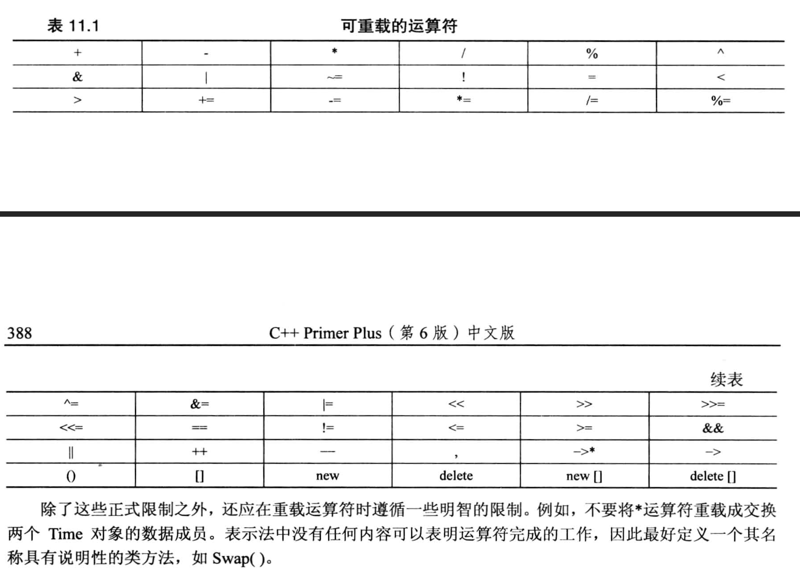

# 11.1 运算符重载
常见的就是 * 号, 它既可以表示乘法, 也可以表示"地址中的内容".
- 编译器通过`操作数的个数`, `操作数的类型`来区分运算符使用哪一种实现.


语法格式:
```cpp
    operatorOP(形参表) {        // 注意是 "operator" + "OP", OP为具体需要重载的运算符
        // 函数体
    }

    // 比如 operator*(参数列表)  // 这里是重载了 * 号
```
- OP必须是**C++已有的运算符**, 不能自定义.

代码例子:
- 头文件`mytimer1.h`
```cpp
#ifndef __MYTIMER0_H__
#define __MYTIMER0_H__

#include <iostream>

using namespace std;

class Time
{
    private:
        int hours;
        int minute;

    public:
        Time();
        Time(int h, int m = 0);
        void AddMin(int m);
        void AddHr(int h);
        void Reset(int h = 0, int m = 0);

        // Time Sum(const Time &t) const;   // 替换为运算符重载
        Time operator+(const Time &t) const;

        void show() const;
};

#endif
```

- 源文件`mytimer1.cpp`
```cpp
#include "mytimer1.h"

Time::Time()
{
    hours = minute = 0;
}

Time::Time(int h, int m)
{
    hours = h;
    minute = m;
}

void Time::AddMin(int m)
{
    minute += m;                // step1: 更新分钟数
    hours += minute / 60;       // step2: 进位
    minute %= 60;               // step3: 进位后刷新分钟数.
}

void Time::AddHr(int h)
{
    hours += h;
}

void Time::Reset(int h, int m)
{
    hours = h;
    minute = m;
}

// Time Time::Sum(const Time &t) const
// {
//     Time sum;
//     sum.minute = minute + t.minute;
//     sum.hours = hours + t.hours;

//     // 考虑进位
//     sum.hours += sum.minute / 60;
//     sum.minute %= 60;
//     return sum;
// }

Time Time::operator+(const Time &t) const
{
    Time sum;
    sum.minute = minute + t.minute;
    sum.hours = hours + t.hours;

    // 考虑进位
    sum.hours += sum.minute / 60;
    sum.minute %= 60;
    return sum;
}

void Time::show() const
{
    cout << "Hours = " << hours << ", Minutes = " << minute << endl;
}
```

- 源文件`useTimer1.cpp`
```cpp
#include <iostream>
#include "mytimer1.h"
using namespace std;

int main(void)
{
    Time coding(2, 40);
    Time fixing(5, 55);
    Time total;

    cout << "coding time:\n";
    coding.show();

    cout << "fixing time:\n";
    fixing.show();

    // total = coding.Sum(fixing);
    total = coding + fixing;        // 使用运算符重载
    cout << "Total time:\n";
    total.show();

    // 运算符重载的使用方式也可以写为下面的语句(当做成员函数来使用)
    Time Planning = coding.operator+(fixing);
    cout << "Planning time:\n";
    Planning.show();

    return 0;
}
```

## 运算符重载的限制
- `不能创建新的运算符`
- 运算符的操作数必须`至少有一个操作数是用户自定义的类型`.
- 使用运算符时`不能违反运算符原来的句法规则`.
  - 如: 求模运算符(%), 它是一个双目运算符, 有两个操作数, 我们不能改变它的操作数个数.
- 不能修改运算符的`优先级`和`结合性`.
- 不能重载以下运算符
  - sizeof
  - . (成员运算符)
  - .*(成员指针运算符)
  - :: (域运算符)
  - ?: (条件运算符)
  - typeid (类型识别运算符, 一个RTTI运算符)
  - const_cast (强制类型转换运算符)
  - dynamic_cast (强制类型转换运算符)
  - reinterpret_cast (强制类型转换运算符)
  - static_cast (强制类型转换运算符)
- 以下运算符只能通过`(类的)成员函数`进行重载
    ```txt
    =       赋值运算符
    ()      函数调用运算符
    []      下标运算符
    ->      通过指针访问类成员的运算符
    ```
    - 根本原因是: 上面这几个运算符 与 类的构造函数会产生**匹配歧义**(看下面的几个代码例子)

### 代码例子

代码例子 -- 非成员函数与成员函数的运算符重载
```cpp
#include <iostream>

using namespace std;

class Num
{
    private:
    public:    // 为了使得 重载非成员运算符的方式能顺利访问n, 把n设置为public
        int n;
    public:
        Num();
        Num(int m);
        // Num operator+(const Num &t) const;      // 成员函数的运算符重载
        void show() const;
};

Num::Num()
{
    n = 0;
}

Num::Num(int m)
{
    n = m;
}

// 成员函数的运算符重载
// Num Num::operator+(const Num &t) const
// {
//     Num temp;
//     temp.n = n + t.n;
//     return temp;
// }


// 非成员运算符的重载方式
Num operator+(const Num &m, const Num &l)
{
    Num temp;
    temp.n = m.n + l.n;     // 要注意 n 是否为 Num 里的公有变量
    return temp;
}


void Num::show() const
{
    cout << "n = " << n << endl;
}

int main(void)
{
    Num a(10);
    a.show();

    Num b(20);
    b.show();

    // 测试成员函数 & 非成员函数的运算符重载方式
    Num c = a + b;
    c.show();

    return 0;
}
```

代码例子 -- 赋值运算符`=`的重载
- 没有进行赋值运算符的重载时:
    ```cpp
    #include <iostream>
    using namespace std;

    class Num
    {
        private:
            int n;
        public:
            Num();
            Num(int m);

    };

    Num::Num()
    {
        n = 0;
        cout << "Hello World!" << endl;
    }

    Num::Num(int m)
    {
        n = m;
        cout << "Good Morning." << endl;
    }


    int main(void)
    {
        Num a;

        // 触发自定义构造函数 Num::Num(int m)
        //   这是因为 "当一个类的声明中没有重载赋值运算符(=)时, 编译器会自动调用与右侧变量具有相同类型的类的构造函数", 此时的赋值运算符的具体功能是由编译器提供的, 本质上是编译器提供了一个默认的运算符重载.
        //   即: 在 Num 中我们没有重载 = 号, 而下面的赋值语句右侧是10, 是int类型, 恰好构造函数 Num(int m) 的输入参数是int类型, 于是直接调用了它.
        a = 10;     // 此语句等价于 a(10)

        return 0;
    }
    ```
    - 当一个类的声明中没有重载赋值运算符(=)时, **编译器会自动调用与右侧变量具有相同类型的类的构造函数**.

- 在类的成员函数中进行赋值运算符的重载时:
    ```cpp
    #include <iostream>
    using namespace std;

    class Num
    {
        private:
            int n;
        public:
            Num();
            Num(int m);
            void operator=(int l);      // 重载赋值运算符
    };

    Num::Num()
    {
        n = 0;
        cout << "Hello World!" << endl;
    }

    Num::Num(int m)
    {
        n = m;
        cout << "Good Morning." << endl;
    }

    void Num::operator=(int l)
    {
        n = l;
        cout << "I love you Rick." << endl;
    }

    int main(void)
    {
        Num a;

        //////// 测试没有进行赋值运算符重载的情况(需要注释掉上面的 operater+(int l) ) ////////
        /// 触发自定义构造函数 Num::Num(int m)
        ///   这是因为 "当一个类的声明中没有重载赋值运算符(=)时, 编译器会自动调用与右侧变量具有相同类型的类的构造函数", 此时的赋值运算符的具体功能是由编译器提供的, 本质上是编译器提供了一个默认的运算符重载.
        ///   即: 在 Num 中我们没有重载 = 号, 而下面的赋值语句右侧是10, 是int类型, 恰好构造函数 Num(int m) 的输入参数是int类型, 于是直接调用了它.
        // a = 10;     // 此语句等价于 a(10)

        //////// 测试重载后的赋值运算符 /////////
        a = 10;
        return 0;
    }
    ```
    - 这个例子说明的是:
      - 赋值运算符只能在类的成员函数中重载的根本原因在于 `赋值运算符会默认跟类的构造函数关联起来`, 如果不在类的成员函数中进行重载, 就会**引发匹配规则的歧义**, 编译器不知道应该调用重载的赋值运算符还是类的构造函数.

下图的运算符大多数都**可以通过成员或非成员函数进行重载**:



## 其他运算符重载
重载`-`, `*` 例子:
- 头文件`mytimer2.h`
```cpp
#ifndef __MYTIMER0_H__
#define __MYTIMER0_H__

#include <iostream>

using namespace std;

class Time
{
    private:
        int hours;
        int minute;

    public:
        Time();
        Time(int h, int m = 0);
        void AddMin(int m);
        void AddHr(int h);
        void Reset(int h = 0, int m = 0);

        Time operator+(const Time &t) const;
        Time operator-(const Time &t) const;
        Time operator*(double mult) const;

        void show() const;
};

#endif
```
- 源文件`mytimer2.cpp`
```cpp
#include "mytimer2.h"

Time::Time()
{
    hours = minute = 0;
}

Time::Time(int h, int m)
{
    hours = h;
    minute = m;
}

void Time::AddMin(int m)
{
    minute += m;                // step1: 更新分钟数
    hours += minute / 60;       // step2: 进位
    minute %= 60;               // step3: 进位后刷新分钟数.
}

void Time::AddHr(int h)
{
    hours += h;
}

void Time::Reset(int h, int m)
{
    hours = h;
    minute = m;
}

Time Time::operator+(const Time &t) const
{
    Time sum;
    sum.minute = minute + t.minute;
    sum.hours = hours + t.hours;

    // 考虑进位
    sum.hours += sum.minute / 60;
    sum.minute %= 60;
    return sum;
}

Time Time::operator*(double mult) const
{
    Time res;
    long totalMinute = hours * mult * 60 + minute * mult;
    res.hours = totalMinute / 60;
    res.minute = totalMinute % 60;
    return res;
}

Time Time::operator-(const Time &t) const
{
    Time diff;
    int tol1, tol2;
    tol1 = hours * 60 + minute;
    tol2 = t.hours * 60 + t.minute;
    diff.hours = (tol1 - tol2) / 60;
    diff.minute = (tol1 - tol2) % 60;
    return diff;
}

void Time::show() const
{
    cout << "Hours = " << hours << ", Minutes = " << minute << endl;
}

```
- 源文件`useTimer2.cpp`
```cpp
#include <iostream>
#include "mytimer2.h"
using namespace std;

int main(void)
{
    Time coding(4, 35);
    Time fixing(2, 47);
    Time total;

    cout << "coding time:\n";
    coding.show();

    cout << "fixing time:\n";
    fixing.show();

    total = coding + fixing;        // 使用运算符重载
    cout << "Total time:\n";
    total.show();

    Time diff = coding - fixing;
    diff.show();

    Time adjusted = coding * 1.5;
    adjusted.show();

    return 0;
}
```
  - 在这个例子中, 我们重载的乘法有个**缺点**: 
    - 我们必须把数值放在右侧, 不能把Time对象放在右侧, 因为乘法操作符的重载是 coding 对象里的成员函数.
  - 解决办法:
    - 写成非成员函数的运算符重载
    ```cpp
    // 用投机取巧的办法

    // 头文件中添加声明:
    Time operator*(double m, const Time &t);

    // cpp中添加函数实现:
    Time operator*(double mult, const Time &t)
    {
        return t * mult;        // 用这个方式可以避免去访问私有成员变量, 但没有从根本上解决问题, 根本解法是使用友元函数
    }
    ```

### 友元函数
友元函数是一种特殊的**非成员函数**, 它可以访问类的`私有成员变量`.
- 语法: 在类的声明中声明友元函数, 并在函数前面增加关键词`friend`
    ```cpp
    friend Time operator*(double mult, const Time &t); // 注意虽然放在了类的声明里, 它并不是类的成员函数
    ```

- 特点:
  - **不是类的成员函数**, **不能直接使用成员运算符来调用**.
  - **具有成员函数相同的访问权限**, 即可以直接访问私有成员变量

- 编写友元函数定义时需注意:
  - 不要加类名的限定符(如`Time::`), 因为它不是类的成员函数.
  - 不要加关键词 `friend`

用友元函数重写上面的例子:
- 头文件`mytimer3.h`
```cpp
#ifndef __MYTIMER0_H__
#define __MYTIMER0_H__
#include <iostream>
using namespace std;
class Time
{
    private:
        int hours;
        int minute;

    public:
        Time();
        Time(int h, int m = 0);
        void AddMin(int m);
        void AddHr(int h);
        void Reset(int h = 0, int m = 0);

        Time operator+(const Time &t) const;
        Time operator-(const Time &t) const;
        Time operator*(double mult) const;

        // 声明友元函数
        friend Time operator*(double mult, const Time &t);

        void show() const;
};

// Time operator*(double m, const Time &t);  定义了友元函数, 这里就不需要声明了

#endif
```

- 源文件`mytimer3.cpp`
```cpp
#include "mytimer3.h"

Time::Time()
{
    hours = minute = 0;
}

Time::Time(int h, int m)
{
    hours = h;
    minute = m;
}

void Time::AddMin(int m)
{
    minute += m;                // step1: 更新分钟数
    hours += minute / 60;       // step2: 进位
    minute %= 60;               // step3: 进位后刷新分钟数.
}

void Time::AddHr(int h)
{
    hours += h;
}

void Time::Reset(int h, int m)
{
    hours = h;
    minute = m;
}

Time Time::operator+(const Time &t) const
{
    Time sum;
    sum.minute = minute + t.minute;
    sum.hours = hours + t.hours;

    // 考虑进位
    sum.hours += sum.minute / 60;
    sum.minute %= 60;
    return sum;
}

Time Time::operator*(double mult) const
{
    Time res;
    long totalMinute = hours * mult * 60 + minute * mult;
    res.hours = totalMinute / 60;
    res.minute = totalMinute % 60;
    return res;
}

Time Time::operator-(const Time &t) const
{
    Time diff;
    int tol1, tol2;
    tol1 = hours * 60 + minute;
    tol2 = t.hours * 60 + t.minute;
    diff.hours = (tol1 - tol2) / 60;
    diff.minute = (tol1 - tol2) % 60;
    return diff;
}

void Time::show() const
{
    cout << "Hours = " << hours << ", Minutes = " << minute << endl;
}

// 友元函数的实现
Time operator*(double mult, const Time &t)
{
    Time res;
    long totalMinute = t.hours * mult * 60 + t.minute * mult;   // 因为是友元函数, 现在可以直接访问t里面的私有成员了
    res.hours = totalMinute / 60;
    res.minute = totalMinute % 60;
    return res;
}
```

- 源文件`useTimer3.cpp`
```cpp
#include <iostream>
#include "mytimer3.h"
using namespace std;

int main(void)
{
    Time coding(4, 35);
    Time fixing(2, 47);
    Time total;

    cout << "coding time:\n";
    coding.show();

    cout << "fixing time:\n";
    fixing.show();

    total = coding + fixing;        // 使用运算符重载
    cout << "Total time:\n";
    total.show();

    Time diff = coding - fixing;
    diff.show();

    Time adjusted = coding * 1.5;       // 成员函数的运算符重载
    adjusted.show();

    // 使用友元函数与普通函数的调用没什么不同
    adjusted = 1.5 * coding;            // 非成员函数的运算符重载
    adjusted.show();

    return 0;
}
```

### 常用的友元: 重载 << 运算符
参考官方案例: cout 输出的时使用的 << 运算符.
- 在使用 cout 输出时, 我们一般将cout放在左侧, 输出的内容放在右侧, 如:
    ```cpp
    cout << "Hello World!" << endl;
    ```
    - 那我们是否可以将前面例子中的 Time 类型的对象(假设叫trip)也直接使用 cout 输出这个对象记录的时间呢?  -- 用 cout 替代前面的 shou() 成员函数
        ```cpp
        Time trip(2, 40);
        cout << trip;  // 这可以实现吗? (sure)
        ```
      - 如果要实现 `cout << trip`, 我们就需要重载 `<<` 运算符, 并将重载函数里的函数体设置为输出 trip 的私有数据.
- 如果我们将 `<<` 重载为某个类的成员函数(比如上面例子中的`Time`类), 那么在使用这个运算符时, 就需要把 Time 类型的对象放在右侧, 如:
    ```cpp
    Time t;
    t << cout;      // 虽然能输出, 但是不符合我们使用 cout 的习惯
    ```
    - 为了符合我们的使用习惯, 我们需要将 `<<` 运算符重载为非成员函数类型, 并将这个重载函数设置为Time类型的**友元函数**以确保能顺利访问私有数据成员, 并且将 cout 放在左侧, Time 对象放在右侧.
        ```cpp
        class Time
        {
            public: 
            // 在 Time 类型的 public 中声明友元函数
            friend void & operator<<(ostream & os, const Time t);
        }

        // 在类的外面定义友元函数
        void operator<<(ostream & os, const Time t);
        {
            os << t.hours << " hours, " << t.minute << " minutes";
        }

        /* 
            // 当遇到语句 cout << trip 时, 就会有如下输出
            4 hours, 35 minutes
        */
        ```

- 但是这种写法仍然存在缺陷: 由于函数没有返回, 我们无法像 cout 一样连续输出, 如: `cout << "123" << "456";`
  - 因此, 我们可以修改函数的返回值为 `ostream 类型的引用`
    ```cpp
    class Time
    {
        public: 
        friend ostream & operator<<(ostream & os, const Time t);
    }

    // 在类的外面定义友元函数
    ostream & operator<<(ostream & os, const Time t);
    {
        os << t.hours << " hours, " << t.minute << " minutes";
        return os;      // 返回 入参os
    }

    /*
        // 使用时:
        cout << trip;  // 解析为 operator<<(cout, trip);

        cout << "Trip time: " << trip << " (Tuesday)\n"; // 能正常运行
    */
    ```

完整例子:
- 头文件`mytimer4.h`
```cpp
#ifndef __MYTIMER4_H__
#define __MYTIMER4_H__

#include <iostream>

using namespace std;

class Time
{
    private:
        int hours;
        int minute;

    public:
        Time();
        Time(int h, int m = 0);
        void AddMin(int m);
        void AddHr(int h);
        void Reset(int h = 0, int m = 0);

        Time operator+(const Time &t) const;
        Time operator-(const Time &t) const;
        Time operator*(double mult) const;

        // 声明友元函数
        friend Time operator*(double mult, const Time &t);

        // void show() const;

        friend ostream & operator<< (ostream &os, const Time &t);     // 声明友元函数重载
};

// Time operator*(double m, const Time &t);  定义了友元函数, 这里就不需要声明了

#endif
```

- 源文件`mytimer4.cpp`
```cpp
#include "mytimer4.h"

Time::Time()
{
    hours = minute = 0;
}

Time::Time(int h, int m)
{
    hours = h;
    minute = m;
}

void Time::AddMin(int m)
{
    minute += m;                // step1: 更新分钟数
    hours += minute / 60;       // step2: 进位
    minute %= 60;               // step3: 进位后刷新分钟数.
}

void Time::AddHr(int h)
{
    hours += h;
}

void Time::Reset(int h, int m)
{
    hours = h;
    minute = m;
}

Time Time::operator+(const Time &t) const
{
    Time sum;
    sum.minute = minute + t.minute;
    sum.hours = hours + t.hours;

    // 考虑进位
    sum.hours += sum.minute / 60;
    sum.minute %= 60;
    return sum;
}

Time Time::operator*(double mult) const
{
    Time res;
    long totalMinute = hours * mult * 60 + minute * mult;
    res.hours = totalMinute / 60;
    res.minute = totalMinute % 60;
    return res;
}

Time Time::operator-(const Time &t) const
{
    Time diff;
    int tol1, tol2;
    tol1 = hours * 60 + minute;
    tol2 = t.hours * 60 + t.minute;
    diff.hours = (tol1 - tol2) / 60;
    diff.minute = (tol1 - tol2) % 60;
    return diff;
}

// void Time::show() const
// {
//     cout << "Hours = " << hours << ", Minutes = " << minute << endl;
// }

// 友元函数的实现
Time operator*(double mult, const Time &t)
{
    Time res;
    long totalMinute = t.hours * mult * 60 + t.minute * mult;   // 因为是友元函数, 现在可以直接访问t里面的私有成员了
    res.hours = totalMinute / 60;
    res.minute = totalMinute % 60;
    return res;
}

ostream & operator<<(ostream &os, const Time &t)
{
    os << t.hours << " hours, " << t.minute << " minutes." << endl;
    return os;
}
```

- 源文件`useTimer4.cpp`
```cpp
#include <iostream>
#include "mytimer4.h"
using namespace std;

int main(void)
{
    Time coding(4, 35);
    Time fixing(2, 47);
    Time total;

    cout << "coding time:\n";
    // coding.show();
    cout << coding;

    cout << "fixing time:\n";
    // fixing.show();
    cout << fixing;

    total = coding + fixing;        // 使用运算符重载
    cout << "Total time:\n";
    // total.show();
    cout << total;

    Time diff = coding - fixing;
    // diff.show();
    cout << diff;

    Time adjusted = coding * 1.5;       // 成员函数的运算符重载
    // adjusted.show();
    cout << adjusted;

    adjusted = 1.5 * coding;            // 非成员函数的运算符重载
    // adjusted.show();
    cout << adjusted;

    cout << "******************" << endl;
    cout << coding << fixing;       // 连续输出, 使用友元函数
    return 0;
}
```

### 重载运算符: 作为成员函数还有非成员函数?
- 主要思想: 对于运算符重载, 只要是**非成员函数**, 就`重载成友元函数`!
- 关于重载函数的参数:
  - 如果是成员函数, 它必定有一个隐藏的参数 `this`, 我们在参数列表中只需要写其他的操作对象即可(如果是单目运算符, 就不需要写参数列表了).
  - 如果是非成员函数(友元函数), 则需要把所有的操作对象都写完, 并且**从左到右的顺序就是操作符使用时的顺序**, 这个不能搞错.
- 成员函数和非成员函数只能选择其中一种, 只不过对于某些运算符来说(前面提到的4个)只能使用成员函数才能重载, 如果没有特殊限制, 这两种实现方式并没有什么区别, 看情况进行设计即可.


### 重载练习 -- 一个矢量类处理随机漫步问题

- 头文件 `vector.h`
```cpp
#ifndef __VECTOR_H__
#define __VECTOR_H__

#include <iostream>

using namespace std;

namespace VECTOR
{
    class Vector 
    {
        public:
            enum Mode{RECT, POL};   // 直角坐标, 极坐标

        private:
            double x;
            double y;
            double mag;     // 幅值
            double ang;     // 角度(这里使用的是弧度制)
            Mode mode;      // 相当于一个标志位的作用, 但它是枚举类型
            void set_mag();
            void set_ang();
            void set_x();
            void set_y();
        
        public:
            Vector();
            Vector(double n1, double n2, Mode form = RECT);
            void reset(double n1, double n2, Mode form = RECT);

            // xval, yval(), magval(), angval() 在这里定义, 编译时会自动变成内联函数
            double xval() const
            {
                return x;
            }
            double yval() const
            {
                return y;
            }
            double magval() const 
            {
                return mag;
            }
            double angval() const
            {
                return ang;
            }

            void polar_mode();
            void rect_mode();

            Vector operator+(const Vector &b) const;    // 重载加法: 做加法
            Vector operator-(const Vector &b) const;    // 重载减法: 做减法
            Vector operator-() const;                   // 重载减法: 取负值
            Vector operator*(double n) const;           // 放大一定倍数

            friend Vector operator*(double n, const Vector &a); // 友元函数, 实现乘法的交换律
            friend ostream & operator<<(ostream &os, const Vector &v);      // 显示函数
    };

}       // 注意不用写分号

#endif //!__VECTOR_H__
```

- 源文件 `vector.cpp`
```cpp
#include "vector.h"
#include <cmath>

namespace VECTOR
{
    const double Rad_to_deg = 45 / atan(1.0);    // 弧度转角度: 1弧度转化为多少角度

    Vector::Vector()   // 构造函数
    {
        x = y = ang = mag = 0.0;
        mode = RECT;
    }

    Vector::Vector(double n1, double n2, Mode form)
    {
        mode = form;
        if(form == RECT){
            x = n1;
            y = n2;
            set_mag();
            set_ang();
        }
        else if(form == POL){
            mag = n1;
            ang = n2 / Rad_to_deg;      // 这里弧度制转了角度制
            set_x();
            set_y();
        }
        else{
            cout << "Construction Error!!!" << endl;
            // 恢复默认值
            x = y = mag = ang = 0;
            mode = RECT;
        }
    }

    void Vector::set_mag()
    {
        mag  = sqrt(x*x + y*y);
    }

    void Vector::set_ang()
    {
        if(x == 0.0 && y == 0.0){
            ang = 0.0;
        }
        else{
            ang = atan2(y,x);  // API返回的是[弧度制]的角度
        }
    }

    void Vector::set_x()
    {
        x = mag * cos(ang);
    }

    void Vector::set_y()
    {
        y = mag * sin(ang);
    }

    void Vector::reset(double n1, double n2, Mode form)
    {
        mode = form;
        if(form == RECT){
            x = n1;
            y = n2;
            set_mag();
            set_ang();
        }
        else if(form == POL){
            mag = n1;
            ang = n2 / Rad_to_deg;      // 这里弧度制转了角度制
            set_x();
            set_y();
        }
        else{
            cout << "Reset Error!!!" << endl;
            // 恢复默认值
            x = y = mag = ang = 0;
            mode = RECT;
        }
    }

    void Vector::polar_mode()
    {
        mode = POL;
    }

    void Vector::rect_mode()
    {
        mode = RECT;
    }

    Vector Vector::operator+(const Vector &b) const
    { 
        return Vector(x + b.x, y + b.y);    // 直接使用构造函数
    }

    Vector Vector::operator-() const        // 取反
    {
        return Vector(-x, -y);              // 直接使用构造函数
    }

    Vector Vector::operator-(const Vector &b) const
    {
        return Vector(x-b.x, y-b.y);        // 直接使用构造函数
    }

    Vector Vector::operator*(double n) const
    {
        return Vector(x*n, y*n);            // 直接使用构造函数
    }

    Vector operator*(double n, const Vector &a)
    {
        // return Vector(n*a.x, n*a.y);
        return a * n;       // 偷懒写法: 使用上面重载的乘法, 注意是a的成员函数
    }

    ostream & operator<<(ostream &os, const Vector &v)
    {
        if(v.mode == Vector::RECT)     // POL 是 Vector类 里定义的枚举量, 并且在public里
        {
            os << "x, y = " << v.x << ", " << v.y << endl;
        }
        else if(v.mode == Vector::POL)
        {
            os << "mag, ang = " << v.mag << ", " << v.ang << endl;
        }
        else{
            os << "Invalid mode!" << endl; 
        }
        return os;
    }
}
```
- 如果一个成员函数会返回一个`新的对象`, 那么我们应该尽可能考虑使用`类的构造函数`(哪怕是需要定义一个构造函数的重载).


- 源文件 `main.cpp`
  - 这里是使用`Vector`来模拟`随机漫步问题`.
```cpp
/*
    使用Vector类来处理 "随机漫步" 问题.
*/
#include <iostream>
#include <cstdlib>
#include <ctime>        // 访问时间
#include "vector.h"

using namespace std;
using namespace VECTOR;     // 使用命名空间 VECTOR

int main(void)
{
    double target = 0.0;    // 目标距离
    double dStep = 0.0;     // 步长(数值)
    double direction = 0.0; // 存放走的方向(角度)

    srand(time(NULL));      // 设定随机数的种子岁时间改变而改变

    Vector result(0, 0, Vector::RECT);
    Vector step;            // 移动步长(向量)

    unsigned long steps;    // 统计一共走多少步 

    cout << "Enter target distance(q to quit): ";
    while (cin >> target)
    {
        cout << "Enter the step length: ";
        if(!(cin >> dStep)) // 如果输入的 dStep 为0就直接退出
            break;

        while( result.magval() < target){
            // 生成一个0~359度之间的随机数
            direction = rand() % 360;                    // 随机数的种子用srand设定
            step.reset(dStep, direction, Vector::POL);   // 按极坐标设定本次随机运动的方向
            result = result + step;                      // 走完之后更新状态, 这里使用了重载的加法
            steps++;                                     // 更新走的步数
        }

        cout << "After " << steps << " steps, the object has the following location.\n";
        cout << result;             // 使用重载输出

        // 显示极坐标系下的状态
        result.polar_mode();        // 修改坐标状态
        cout << result;

        cout << endl;

        // 为下一轮随机漫步初始化
        steps = 0;
        result.reset(0.0, 0.0, Vector::RECT);

        cout << "Enter target distance(q to quit): ";
    }

    cout << "Bye!" << endl;
    return 0;
}

```

## 类的自动转换和强制类型转换
例子 -- 类的自动类型转换
- 头文件 `stonewt.h`
```cpp
#ifndef __STONEWT_H__
#define __STONEWT_H__

#include <iostream>

using namespace std;

class Stonewt       // 描述英石
{
    private:
        enum {Lbs_per_stn = 14};        // 也可以定义为 static
        int stone;
        double pds_left;
        double pounds;

    public:
        Stonewt(double lbs);
        Stonewt(int stn, double lbs);
        Stonewt();

        void show_lbs() const;
        void show_stone() const;
};

#endif //!__STONEWT_H__
```

- 源文件 `stonewt.cpp`
```cpp
#include "stonewt.h"

Stonewt::Stonewt(double lbs)
{
    stone = static_cast<int>(lbs) / Lbs_per_stn;  // 强制类型转换也可以写为 (int)lbs
    pds_left = (int)lbs % Lbs_per_stn + lbs - (int)lbs;  // 整数部分 + 小数部分
    pounds = lbs;
}

Stonewt::Stonewt(int stn, double lbs)
{
    stone = stn;
    pds_left = lbs;
    pounds = stn * Lbs_per_stn + lbs;
}

Stonewt::Stonewt()
{
    stone = pds_left = pounds = 0;
}

void Stonewt::show_lbs() const
{
    cout << pounds << " pounds." << endl;
}

void Stonewt::show_stone() const 
{
    cout << stone << " stone, " << pds_left << " pounds." << endl;
}
```

- 源文件 `.cpp`
```cpp
#include <iostream>
#include "stonewt.h"

using namespace std;

int main(void)
{
    // 下面这行代码将触发 "类的自动类型转换"
    Stonewt incognito = 275;    // 触发构造函数来初始化对象(先用构造函数创建一个临时对象, 然后通过"隐式"的逐成员赋值的方式完成赋值.)
                                // 等价于: Stonewt incognito(275);
                                // 也等价于: Stonewt incognito = Stonewt(275);

    Stonewt wolfe(285.7);       // 调用 Stonewt(double) 构造函数
    Stonewt taft(21, 8);

    incognito.show_stone();
    wolfe.show_stone();
    taft.show_lbs();

    cout << "----------------------------" << endl;
    incognito = 276.8;      // 再次触发自动类型转换
    taft = 325;
    wolfe = 111;
    incognito.show_stone();
    wolfe.show_stone();
    taft.show_lbs();

    return 0;
}
```
- 虽然自动类型转换看上去很方便, 但是有时候容易触发`意外的转换`
  - 关闭自动类型转换的特性 -- 在声明构造函数时加上关键词`explicit`即可
  ```cpp
    // 在声明构造函数时加上关键词 explicit
    explicit Stonewt(double lbs);   // 这样就不允许单个数字的自动类型转换了
  ```

### 转换函数
上面一个例子讲解的是`将一个int数值通过隐式调用构造函数的方式转换为匹配的对象`, 这是类的自动转换. 如果我们现在需要将一个类的对象反过来转换会一个数值, 那么就需要使用`转换函数`.
  -  类的构造函数: 用于从某种类型转换到类类型(class type)的转换
  -  类的转换函数: 用于从类类型(class type)转换到其他类型, 它是一种`特殊的C++运算符函数`

- 定义转换函数的方法
```cpp
    operator typeName();   // typeName 是要转换的类型, 例如: double, int, char 等等

    // 如:  operator double();
```
  - 转换函数必须是类方法 --> 必须是`类的成员函数`
  - 转换函数不能指定返回值类型  --> typeName 本身就相当于指定了返回类型
  - 转换函数不能有参数  --> 转换函数是通过对象调用的, 这个函数的输入其实是对象本身, 可以理解转换函数的输入参数是`类似this指针`的东西, 它是隐藏参数.

- 如果已经定义好了转换函数(这是`用户自定义`的), 则可以按照下面的方式来使用它
    ```cpp
    Stonewt wolf(285.7);            // 利用构造函数初始化了一个对象
    double host = double(wolf);     // 使用方法一
    double thinker = (double) wolf; //  使用方法二

    // 甚至还可以使用下面的写法, 让编译器自动完成
    Stonewt wells(20, 3);
    double star = wells;            // 自动调用转换函数
    ```
  - 如果我们让编译器自动调用转换函数, 则编译器的行为是:
    - 首先检查`=号`左右两侧的类型是否相同, 如果不同, 则去看看右侧类型是否`定义了与左侧类型匹配的转换函数`, 如果没有找到转换函数的定义, 就直接报错; 如果找到了, 就调用该函数进行转换.

代码示例:
- 头文件`stonewt1.h`
    ```cpp
    #ifndef __STONEWT1_H__
    #define __STONEWT1_H__

    #include <iostream>

    using namespace std;

    class Stonewt       // 描述英石
    {
        private:
            enum {Lbs_per_stn = 14};        // 也可以定义为 static
            int stone;
            double pds_left;
            double pounds;

        public:
            Stonewt(double lbs);
            Stonewt(int stn, double lbs);
            Stonewt();

            void show_lbs() const;
            void show_stone() const;

            operator double() const;
            operator int() const;
    };

    #endif //!__STONEWT1_H__
    ```

- 源文件`stonewt1.cpp`
    ```cpp
    #include "stonewt1.h"

    Stonewt::Stonewt(double lbs)
    {
        stone = static_cast<int>(lbs) / Lbs_per_stn;  // 强制类型转换也可以写为 (int)lbs
        pds_left = (int)lbs % Lbs_per_stn + lbs - (int)lbs;  // 整数部分 + 小数部分
        pounds = lbs;
    }

    Stonewt::Stonewt(int stn, double lbs)
    {
        stone = stn;
        pds_left = lbs;
        pounds = stn * Lbs_per_stn + lbs;
    }

    Stonewt::Stonewt()
    {
        stone = pds_left = pounds = 0;
    }

    void Stonewt::show_lbs() const
    {
        cout << pounds << " pounds." << endl;
    }

    void Stonewt::show_stone() const 
    {
        cout << stone << " stone, " << pds_left << " pounds." << endl;
    }

    Stonewt::operator double() const
    {
        return pounds;
    }

    Stonewt::operator int() const
    {
        return static_cast<int>(pounds + 0.5);       // 简单的四舍五入方法: 加0.5, 然后直接丢弃小数部分
    }
    ````

- 源文件`stone1.cpp`
    ```cpp
    #include <iostream>
    #include "stonewt1.h"

    using namespace std;

    int main(void)
    {
        Stonewt poppings(9, 2.8);
        double p_wt = poppings;     // 触发隐式调用: 左侧是double类型, 右侧是类的对象, 编译器自动寻找转换函数
        cout << "poppings = " << p_wt << " pounds." << endl;

        int weight = poppings;      // 触发隐式调用
        cout << "poppings = " << weight << " pounds." << endl;

        cout << "poppings = " << int(poppings) << " pounds." << endl;       // 显式转换
        cout << "poppings = " << double(poppings) << " pounds." << endl;

        /*
            cout << "poppings = " << poppings << " pounds." << endl;     
                这种写法会触发"二义性问题":
                    1. 因为成员函数中存在两个转换函数, 而我们没有指定使用哪个类型的转换函数
                    2. 如果成员函数中只定义了一种转换函数, 此时就没有二义性问题了
        */
        return 0;
    }
    ```

转换函数的缺陷:
- 在使用隐式转换时, 有时候不希望它执行转换的时候也可能触发自动转换
    ```cpp
    int ar[20];         // 定义了一个数组
    .......  // 其他代码

    Stonewt temp(14,4); // 初始化了一个对象

    ...... // 其他代码

    int Temp = 1;

    // 下面这行代码不会报错, 但是运行的结果确不是我们想要的
    cout << ar[temp] << "!\n";   // 如果犯迷糊, 把Temp写成了temp, 由于数组索引必须是int类型, 此时 Stonewt的对象temp就会触发自动转换, 变成int类型, 从而导致程序出错. 
    ```

- 为了避免这种情况, 可以在定义定义的时候加上关键词`explicit` --> `explicit operator typeName() const;`
    ```cpp
    explicit operator int() const;
    explicit operator double() const;

    // 又或者用成员函数把它包起来, 从而避免隐式转换
    int asInt() const
    {
        return static_cast<int>(pounds + 0.5);
    }
    ```
  - 这样就可以避免上面的问题了, 如果我们需要使用转换函数, 就必须显式的调用它, 不能隐式调用.
  - 应该`小心隐式转换的使用` !!!!


