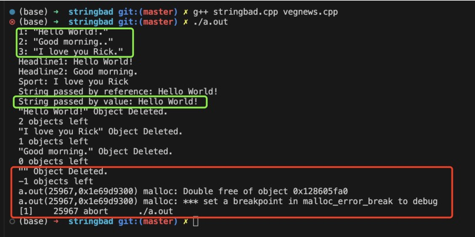
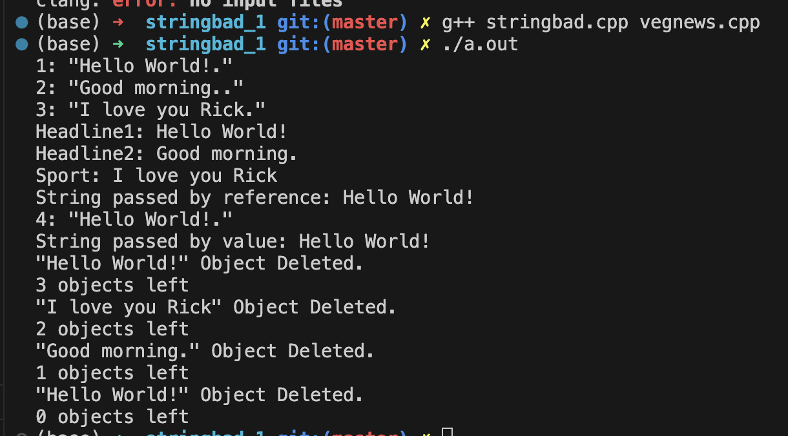

# 类和动态内存分配

## 代码例子 -- StringBad 类
- 头文件 `stringbad.h`
```cpp
#ifndef __STRINGBAD_H__
#define __STRINGBAD_H__

#include <iostream>
using namespace std;

class StringBad
{
    private:
        char *str;              // 存放的不是字符串, 而是字符串所在的地址!
        int len;

        static int num_strings; // 静态变量, 它不专属于任意一个对象, 而是所有对象共享的
                                /* 它只会被初始化一次(需要额外写一个初始化), 所有定义的对象都共享这个成员变量, 这种变量常用于统计这个类一共有多少个对象 */

    public:
        StringBad(const char *s);
        StringBad();
        ~StringBad();           // 一般在动态分配内存的场景下, 会把delete语句写在这里

        friend ostream & operator<<(ostream &os, const StringBad &st);
};

#endif //!__STRINGBAD_H__
```
- 源文件 `stringbad.cpp`
```cpp
#include "stringbad.h"
#include <cstring>      // 调用统计字符串长度的函数strlen

/* 首先处理一下静态变量 num_string:
    1. 这个变量的初始化 **不可以** 放在"构造函数"或"类的声明的任意位置", 因为这个变量不专属于任意一个对象, 它是共享的
    2. 静态变量是独立于对象存储的, 它于类的对象在内存中的存放区域不一样.
    3. 这种变量的初始化一般不要放在头文件中, 因为头文件可能会被个位置include, 导致初始化语句有多条, 一般只放在 定义类方法的cpp 文件中
    4. 初始化该变量时, 不需要再写 static, 需要使用作用域运算符::来指定它所属的类
*/
int StringBad::num_strings = 0;     

StringBad::StringBad(const char *s)
{
    len = strlen(s);
    str = new char[len + 1];        // new 了一块内存用于存放传入的字符串, 不然跑完这个函数之后, s里的东西就会被系统删掉
    strcpy(str, s);                 // 把s的内存拷贝到开辟的内存空间中
    num_strings++;
    cout << num_strings << ": \"" << str << ".\"" << endl;
}

StringBad::StringBad()
{
    len = 4;
    str = new char[4];
    strcpy(str, "C++");
    num_strings++;
    cout << num_strings << ": \"" << str << ".\"" << endl;
}

StringBad::~StringBad()
{
    cout << "\"" << str << "\" Object Deleted." << endl;
    num_strings--;
    cout << num_strings << " objects left" << endl;
    delete[] str;       // 别漏了 [], 因为是字符数组!
} 

ostream & operator<<(ostream &os, const StringBad &st)
{
    os << st.str;
    return os;
}
```

- 主函数 `vegnews.cpp`
```cpp
#include <iostream>
#include "stringbad.h"

void callme1(StringBad &rsb);       // 按引用传递
void callme2(StringBad rsb);        // 按值传递


int main(void)
{
    StringBad headline1("Hello World!");
    StringBad headline2("Good morning.");
    StringBad sport("I love you Rick");

    cout << "Headline1: " << headline1 << endl; 
    cout << "Headline2: " << headline2 << endl; 
    cout << "Sport: " << sport << endl; 

    callme1(headline1);     // 一切正常
    callme2(headline2);   // 调用按值传递的函数报错了
    return 0;
}

void callme1(StringBad &rsb)    // 按引用传递
{
    cout << "String passed by reference: " << rsb << endl;
}
void callme2(StringBad rsb)     // 按值传递
{
    cout << "String passed by value: " << rsb << endl;
}
```

程序输出如下:

- 报错原因分析
    ```txt
    1. 首先, 我们在主函数中定义了三个对象, 触发了三次构造函数, 此时会使用 new 动态开辟内存空间.
    2. 然后, 在调用callme2函数时, 会触发一次由编译器自动生成的 `拷贝构造函数` , 用于把headline1对象拷贝到rsb对象中, 此时 没有使用 new !!!!

        此时一共触发了4次构造函数, 拷贝构造函数也是构造函数.

    3. main函数结束时, 开始进行析构, 会调用4次次析构函数, 释放三次new出来的内存空间, 但是由于rsb对象没有使用 new, 所以执行到析构函数的 delete 语句时程序出错.
    ```
    - 关于`拷贝构造函数`:
      - 在我们调用 `callme2` 函数时, 进行的是按值传递, 此时 headline1 相当于执行了` StringBad rsb = headline1; ` 这样的语句, 它等价于`StringBad rsb = StringBad(headline1)`, 而这行代码对应的函数原型是 `StringBad(const StringBad &rsb);`, 也就是拷贝构造函数.
        - 如果我们没有自定义拷贝构造函数, 编译器会自动提供一个默认的.


### C++ 在类中自动提供的成员函数
如果我们在定义类的时候没有自定义下面的成员函数, 则编译器会默认提供一个.
1. 默认构造函数
2. 默认析构函数
3. 复制构造函数
4. 赋值运算符
5. 地址运算符


对于拷贝构造函数/复制构造函数:
- 在程序生成副本时就会调用, 如:
  - 函数按值传递
  - 函数 return (返回类的对象时)

因此, 对于前面的例子, 我们只需要自定义一个拷贝构造函数就可以解决这个bug
```cpp
    // 在头文件的类声明中增加拷贝构造函数的声明
    StringBad(const StringBad &st);       // 复制构造函数

    // 在定义中增加拷贝构造函数的定义
    StringBad::StringBad(const StringBad &st)
    {
        len = st.len;
        str = new char[len + 1];        // new 了一块内存用于存放传入的字符串
        strcpy(str, st.str);            // 把st的内容拷贝一份
        num_strings++;
        cout << num_strings << ": \"" << str << ".\"" << endl;
    }
```
此时, 程序运行正常, 输出如下(有4次构造, 4次析构):


还有一个需要注意的是, 在不同的编译环境下, 触发析构错误的原因可能有两种:
- 一种是前面提到的`复制构造函数/拷贝构造函数`的问题
- 另一种则是由于`赋值运算符(=)`造成的
    ```txt
    前面提到, 在调用 callme2 函数时, 按值传递在传参的过程中会触发一次拷贝构造函数, 相当于执行语句:
        StringBad rsb = headline1;

        在不同的编译环境中, 这可能存在两种情况, 第一种是:
            StringBad rsb;      // 1. 先定义一个对象
            rsb = headline1;    // 2. 然后再赋值, 此时触发默认的  赋值运算符函数
        
        第二种则是前面提到的
            StringBad rsb = StringBad( headline1 );     // 直接触发拷贝构造函数
    ```
- 因此, 安全的做法是;
  - 既要`自定义拷贝构造函数`, 也要`自定义赋值运算符函数`.

  - 代码例子 -- 补充自定义的赋值运算符函数
    ```cpp
    // 重载赋值运算符, 由于赋值运算符本身要求左侧是类的对象, 所以可以不定义成友元函数
    StringBad & operator=(const StringBad &st);


    StringBad & StringBad::operator=(const StringBad &st)
    {
        if (&st == this){       // 如果是 自己 赋值给 自己, 则不需要执行任何操作
            return *this;
        }
        delete [] str; // 因为要把临时的对象赋值给原有对象, 而且原来的对象是new出来, 故需要先删除原对象, 防止内存泄露
        len = st.len;
        str = new char[len + 1];    // 重新开辟地址, 用来存储st对象里的内容
        strcpy(str, st.str);
        return *this;       // 返回当前对象本身
    }
    ```

### 改进后的 String 类
- 头文件 `string.h`
```cpp
#ifndef __STRING_H__
#define __STRING_H__

#include <iostream>
using namespace std;

class String
{
    private:
        char *str;              // 存放的不是字符串, 而是字符串所在的地址!
        int len;

        static int num_strings; // 静态变量, 它不专属于任意一个对象, 而是所有对象共享的
                                /* 它只会被初始化一次(需要额外写一个初始化), 所有定义的对象都共享这个成员变量, 这种变量常用于统计这个类一共有多少个对象 */
        static const int CINLIMIT = 80;     // 限制输入字符的最大值

    public:
        String(const char *s);
        String();
        String(const String &st);       // 复制构造函数
        ~String();           // 一般在动态分配内存的场景下, 会把delete语句写在这里

        int length() const
        {
            return len;
        }

        // 重载赋值运算符, 由于赋值运算符本身要求左侧是类的对象, 所以可以不定义成友元函数
        String & operator=(const String &st);
        String & operator=(const char *st);       // 直接传入一个字符串

        char & operator[](int i);                       // 重载索引运算
        const char & operator[](int i) const;

        friend bool operator<(const String &str1, const String &str2);
        friend bool operator>(const String &str1, const String &str2);
        friend bool operator==(const String &str1, const String &str2);

        friend ostream & operator<<(ostream &os, const String &st);
        friend istream & operator>>(istream &is, String &st);

        static int HowMany();       // 静态函数, 不属于任何一个对象, 它用来返回对象的个数
};

#endif //!__STRING_H__
```

- 源文件 `string.cpp`
```cpp
#include "string.h"
#include <cstring>      // 调用统计字符串长度的函数strlen

/* 首先处理一下静态变量 num_string:
    1. 这个变量的初始化 **不可以** 放在"构造函数"或"类的声明的任意位置", 因为这个变量不专属于任意一个对象, 它是共享的
    2. 静态变量是独立于对象存储的, 它于类的对象在内存中的存放区域不一样.
    3. 这种变量的初始化一般不要放在头文件中, 因为头文件可能会被个位置include, 导致初始化语句有多条, 一般只放在 定义类方法的cpp 文件中
    4. 初始化该变量时, 不需要再写 static, 需要使用作用域运算符::来指定它所属的类
*/
int String::num_strings = 0;     

int String::HowMany()           // 静态函数
{
    return num_strings;
}

String::String(const char *s)
{
    len = strlen(s);
    str = new char[len + 1];        // new 了一块内存用于存放传入的字符串, 不然跑完这个函数之后, s里的东西就会被系统删掉
    strcpy(str, s);                 // 把s的内存拷贝到开辟的内存空间中
    num_strings++;
}

String::String()
{
    len = 0;
    str = new char[1];
    str[0] = '\0';
    num_strings++;
}

String::String(const String &st)
{
    len = st.len;
    str = new char[len + 1];        // new 了一块内存用于存放传入的字符串
    strcpy(str, st.str);            // 把st的内容拷贝一份
    num_strings++;
}

String::~String()
{
    num_strings--;
    delete[] str;       // 别漏了 [], 因为是字符数组!
} 

String & String::operator=(const String &st)
{
    if (&st == this){       // 如果是 自己 赋值给 自己, 则不需要执行任何操作
        return *this;
    }
    delete [] str; // 因为要把临时的对象赋值给原有对象, 而且原来的对象是new出来, 故需要先删除原对象, 防止内存泄露
    len = st.len;
    str = new char[len + 1];    // 重新开辟地址, 用来存储st对象里的内容
    strcpy(str, st.str);
    return *this;       // 返回当前对象本身
}

String & String::operator=(const char *st)
{
    delete [] str; // 因为要把临时的对象赋值给原有对象, 而且原来的对象是new出来, 故需要先删除原对象, 防止内存泄露
    len = strlen(st);
    str = new char[len + 1];    // 重新开辟地址, 用来存储st对象里的内容
    strcpy(str, st);
    return *this;       // 返回当前对象本身
}

char & String::operator[](int i)        // 这里没有const
{
    return str[i];
}

const char & String::operator[](int i) const    // 这里加了const, 表示不能修改任何东西
{
    return str[i];
}

bool operator<(const String &str1, const String &str2)
{
    return (strcmp(str1.str, str2.str) < 0);
}

bool operator>(const String &str1, const String &str2)
{
    return str1 < str2;     // 使用了上面定义的运算符重载
}

bool operator==(const String &str1, const String &str2)
{
    return (strcmp(str1.str, str2.str) == 0);
}

ostream &operator<<(ostream &os, const String &st)
{
    os << st.str;
    return os;
}

istream & operator>>(istream &is, String &st)
{
    char temp[String::CINLIMIT];
    is.get(temp, String::CINLIMIT); // 先捕获字符, 再拷贝到对象里
    if(is){
        st = temp;      // 调用前面重载的赋值运算符 (到这里只会捕获 String::CINLIMIT 个字符, 超出部分仍留在缓冲区)
    }
    while (is && is.get()!='\n')   // 如果输入的内容太长, 则需要清空缓存 
        continue;
    return is;
}
```

- 主函数 `saystrings.cpp`
```cpp
#include <iostream>
#include "string.h"

const int MAXLENGTH = 81;

int main(void)
{
    String name;
    cout << "Hi, what is your name? " << endl;
    cin >> name;        // 调用了重载的输入运算符
    cout << name << ", please enter a string." << endl;
    
    // 输入内容, 赋值到新的对象
    String saystrings;
    char temp[MAXLENGTH];
    cin.get(temp, MAXLENGTH);
    while(cin && cin.get() != '\n') // 超出指定长度范围时清空缓冲区
        continue;
    saystrings = temp;              // 调用了重载的赋值运算符

    cout << "Here is your sayings: " << endl;
    cout << saystrings[0] << ": " << saystrings << endl;    // 调用了重载的输出运算符

    // 测试长度比较函数
    String str = "Hello World!"; 
    if(saystrings.length() < str.length())
        cout << "str is longer." << endl;
    else
        cout << "saystrings is longer." << endl;
    
    if(saystrings < str)        // 调用重载的比较运算符, 内部使用的是 strcmp(), 它会一个个字符比较, 如果第一个字符已经有比较结果, 则不会继续进行比较
        cout << "saystrings's first letter is smaller than str's." << endl;
    else
        cout << "saystrings's first letter is bigger than str's." << endl;

    // 测试静态函数, 打印一共有多少个对象
    cout << "This program used " << String::HowMany() << " objects." << endl;

    return 0;
}
```


## 在构造函数中使用new应该注意的问题
- 如果在构造函数中使用了new, 则应在析构函数中要有对应的delete.
  - new 对应于 delete
  - new [] 对应于 delte []
    - 开辟变量就释放变量, 开辟数组就释放数组
  - delete 运算符`可以用于空指针`
    ```cpp
    // 以下用法都不会报错
    delete NULL;

    char * temp = 0;        // 传统C++中, 0可以表示空指针
    delete temp;

    delete nullptr;
    ```

- 对于空指针
  - C语言中常用`NULL`表示空指针
  - 传统的 C++ 常用 `0` 表示空指针
  - C++11 中可以使用 `nullptr` 表示空指针

- 包含类成员的类的逐成员复制
    ```cpp
    class Magazine
    {
        private:
            String title;           // 自定义的String类 (假设是前面例子中定义的的String类, 它包含了复制构造以及赋值运算符重载)
            string publisher;       // 标准库的string类
    };
    ```
    - 如果我们在定义一个新的类中包含了其他数据类型, 而这些类型中也已经存在`赋值运算符重载`和`复制构造函数`, 则此时新的类型中可以不针对这些数据类型特地写一个复制构造或者赋值运算符重载, 因为在编译器提供的默认构造函数中就会自动调用这些类型里的复制构造函数和赋值运算符重载.
      - 简单来说, Magazine的对象进行复制时, String类 和 string类 里面的复制构造函数和赋值运算符就会自动调用, 而不需要在意是不是进行了 new 和 delete.
    - 如果需要针对其他数据成员定义复制构造函数, 这种情况比较复杂, 在十三章中进行讲解.


## 有关返回对象的说明
一共分为4种情况:
- 返回**对象**
- 返回**对象的引用**
- 返回**const对象**
- 返回**const对象的引用**

### 返回const对象的引用 与 返回对象
```cpp
// 返回对象
Vector Max(const Vector & v1, const Vector &v2)
{
    if(v1.magval() > v2.magval())
        return v1;
    else
        return v2;
}

// 返回const对象的引用
const Vector & Max(const Vector & v1, const Vector &v2)
{
    if(v1.magval() > v2.magval())
        return v1;
    else
        return v2;
}
```
- 如果直接**返回对象**, 则会触发`复制构造函数`, 会产生临时对象, 临时对象会在函数结束时被销毁, 造成内存浪费.
- 如果**返回const对象的引用**, 则不会出发复制, 效率更高.
  - 但是要注意返回的那个`对象不能在函数结束后被销毁`, 否则就会出问题.
  - 返回的对象类型需要是`const`, 否则会不匹配, 报错.
  - 由于是const修饰的对象, 它是不可更改的, 这个需要注意.

### 返回对象的引用(非const)
```cpp
// operator=() 的返回值需要用于连续赋值, 因此这时候应返回非const的引用, 如
String s1("good stuff");
String s2, s3;
s3 = s2 = s1;

// operator<<() 返回值用于串接输出, 也应该使用非const的引用
String s1("good stuff");
cout << s1 << "is comming." << endl;
```
- 对于`ostream`类来说:
  - 它里面`没有公有的复制构造函数`, 因此`必须返回对象的引用`.


### 返回对象
- 如果需要返回的局部变量, 则不能返回对象的引用, 因为局部变量在函数结束时就会自动触发析构函数, 于是返回出来的引用就不知道指到哪里去了. 此时应该使用`返回对象`的方式.
  - 这种情况常见于`算术运算符`中, 因此, 但凡重载了算术运算符, 一般情况下都使用`返回对象`的方式.

### 返回const对象
例子:
```cpp
// 如果没有使用返回const对象的方式, 如 Vector::operator+();
// 那么下面的三种写法都是正确的:
net - force1 + force2;      // 写法1: 正常使用加法运算符
force1 + force2 = net;      // 写法2: 做完加法之后, 运算符返回的内容存放在一个临时变量中, 然后临时变脸被net刷新
cout << (force1 + force2 = net).magval() << endl; // 写法3: 临时变量的内容被输出, 然后临时变量被销毁
```
- 后面两种写法虽然没有什么意义, 但它是符合语法规则的.
  - 第二种写法可能是把 `force1 + force2 == net` 给写错了造成的, 但是编译器不会报错, 因为它是符合语法规则的.
  - 要禁止出现这样的写法, 只需要将返回的对象设置为const即可, 即使用`返回const对象`的方式.

小结:
1. 如果要返回**局部变量**, 则应该使用`返回对象`的方式.
2. 如果需要返回一个**没有公有复制构造函数的类**(如 ostream), 则应使用`返回对象引用`的方式.
3. 如果既可以返回对象, 也可以返回对象的引用, 则`优先使用返回对象的引用`的方式, 因为它效率更高.

