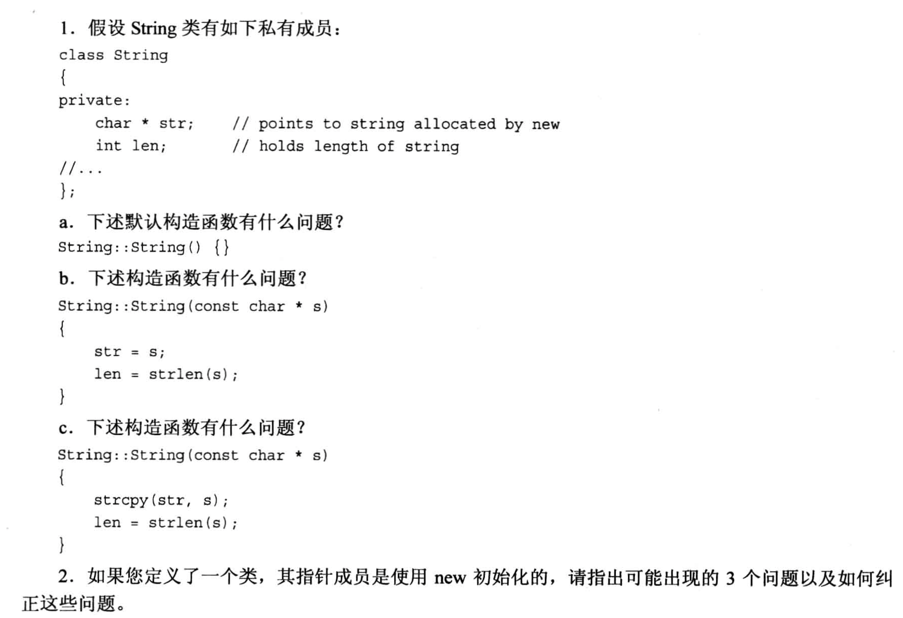
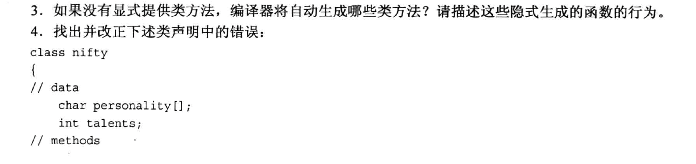
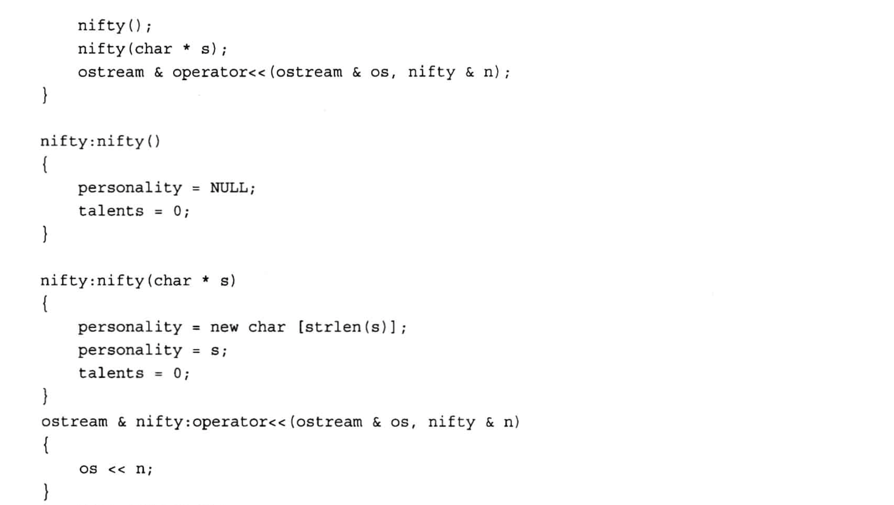
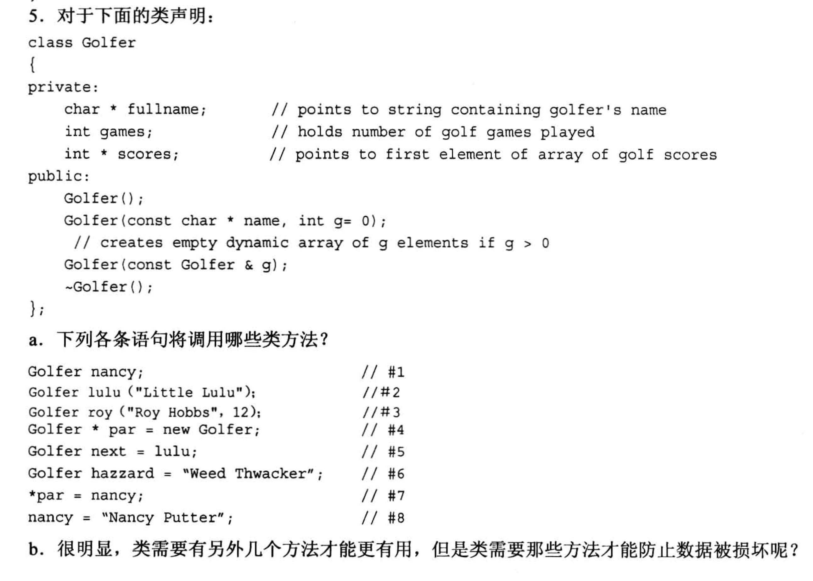

# 题目






# 1.
```txt
a. 默认构造函数中没有对任何数据成员进行初始化, str可以初始化为一个空指针(或new一个空间), len可以初始化为0

b. 字符串的长度应该加1, 因为字符串的长度需要包括'\0'; 然后拷贝数据

c. 需要new一个空间, 用力存放字符串, 并且将len设置为字符串的长度+1

针对b和c两个小问, 修改后的构造函数如下:

String::String(const char *s)
{
    len = strlen(s) + 1;
    str = new char[len];
    strcpy(str, s);
}
```

# 2.
```txt
需要注意的问题有:
1. 需要在析构函数中写对应的delete语句
2. 需要自定义一个复制构造函数, 实现类的对象的拷贝
3. 重载赋值运算符
```

# 3.
```txt
编译器默认提供:
1. 默认构造函数
2. 拷贝构造函数
3. 析构函数
4. 赋值运算符
5. 地址运算符
```
- 地址运算符返回的是`this`的地址.

# 4.
```txt
1. 对数据成员加 private, 如果不加, 默认都是 private, 但是写上会更加清晰

2. 公开的成员函数应该使用 public 进行声明

3. 运算符重载的函数声明位置, 这里定义为"类的成员函数", 这种写法是错的, 因为如果重载为类的成员函数, 右侧必须是类的对象, 左侧是其他操作数, 而这里左侧并不是类的对象, 而是ostream类型的对象, 所以应该定义为 "友元函数", 并且把 nifty 对象加const修饰

4. 在构造函数的声明位置, char *s 不应该被修改, 所以应该加一个const

5. 因为构造函数中使用了new, 所以必须定义析构函数

```

修改后的代码为:
```cpp
class nifty
{
    private:
        char *personality;
        int talents;
    public:
        nifty();
        nifty(const char *s);

        ~nifty()
        {
            delete personality;
        }

        friend ostream & operator<<(ostream &os, const nifth &n);
};

nifty::nifty()
{
    personality = nullptr;
    talents = 0;
}

nifty::nifth(const char *s)
{
    personality = new char[strlen(s) + 1];  // 补上空字符的位置
    strcpy(personality, s);
    talents = 0;
}

ostream & operator<<(ostream &os, const nifty &n)
{
    os << n.personality << std::endl;
    os << n.talents << std::endl;
    return os;
}
```

# 5.
```txt
a.
    #1: 调用默认构造
    #2: 自定义构造
    #3: 自动以构造
    #4: 默认构造
    #5: 拷贝构造/复制构造
    #6: 自定义构造
    #7: 不会调用构造函数, 会使用默认提供的赋值运算符
    #8: 自定义构造 & 默认的赋值运算符

b.
    增加一个赋值运算符重载函数即可.
```

