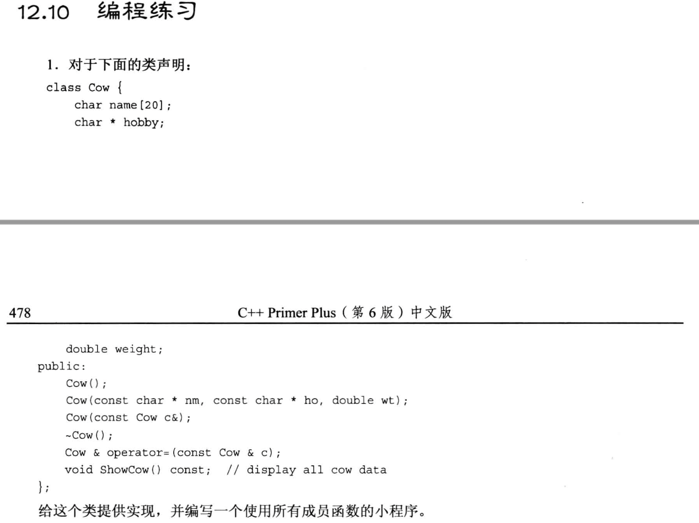
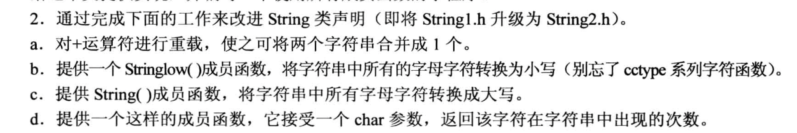
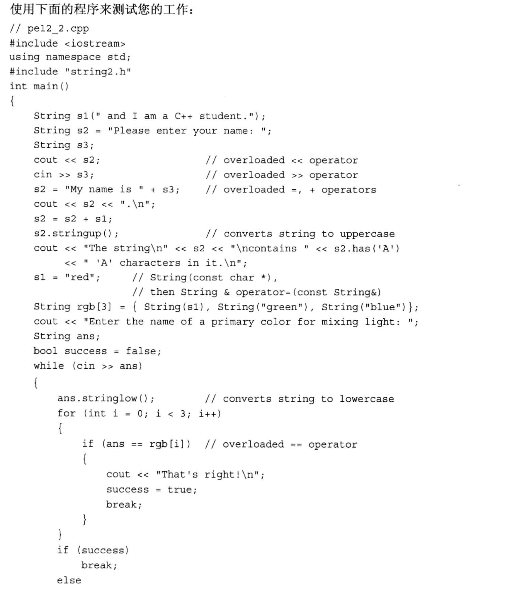
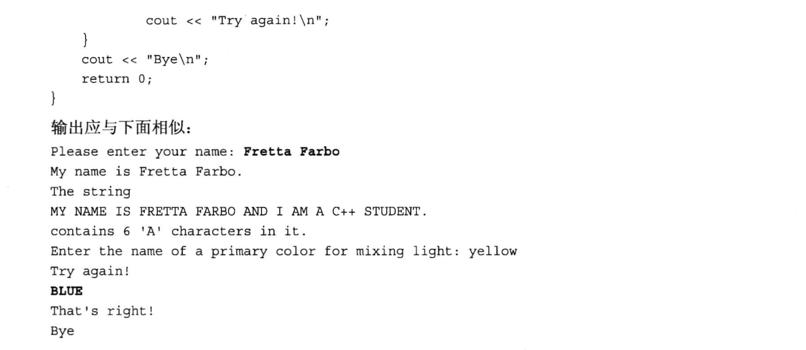
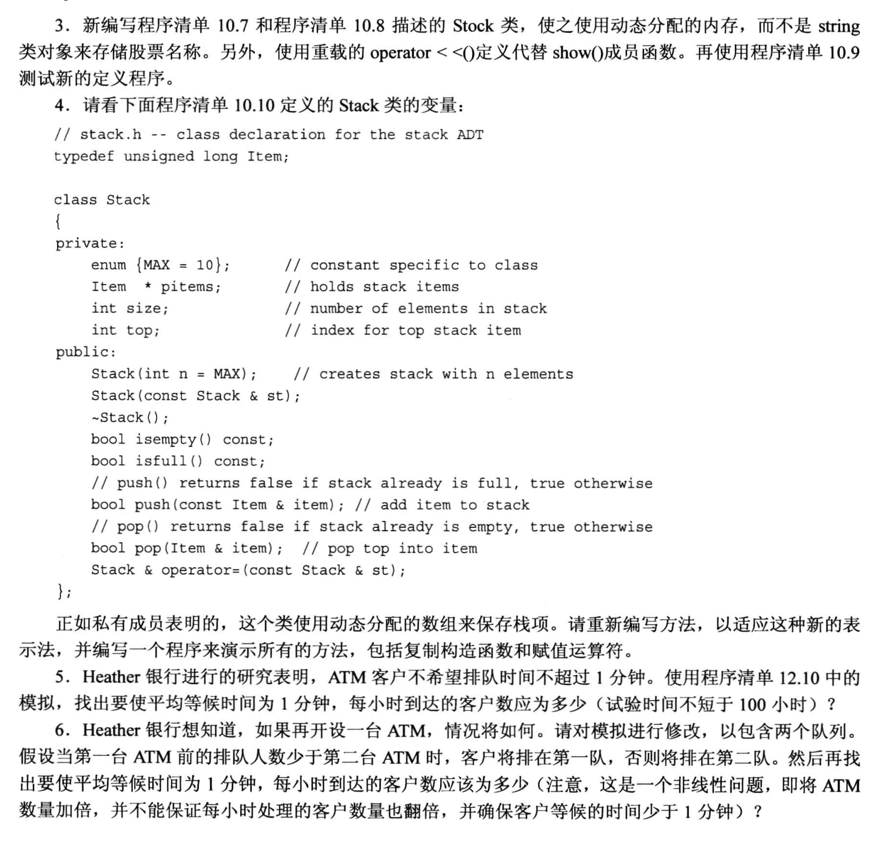
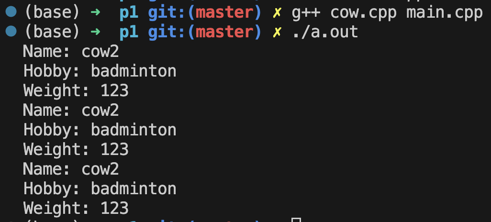
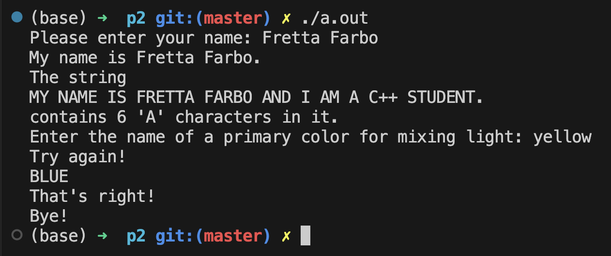
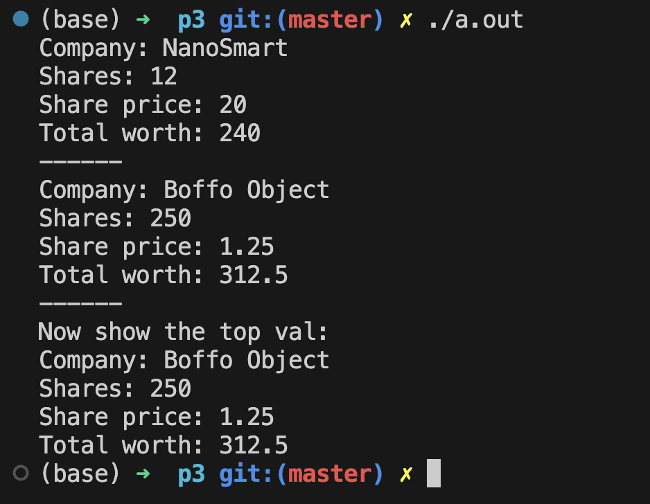

# 题目







# 1.
头文件 `cow.h`
```cpp
#ifndef __COW_H__
#define __COW_H__

#include <iostream>

using namespace std;

class Cow
{
    private:
        char name[20];
        char * hobby;
        double weight;
    public:
        Cow();
        Cow(const char * nm, const char * ho, double wt);
        Cow(const Cow &c);
        ~Cow();
        Cow & operator=(const Cow &c);
        void ShowCow() const;
};

#endif //!__COW_H__
```

- `cow.cpp`
```cpp
#include "cow.h"
#include <cstring>      // 使用 strncpy, 指定拷贝长度

Cow::Cow()
{
    name[0] = '\0';
    hobby = nullptr;
    weight = 0.0;
}

Cow::Cow(const char *nm, const char * ho, double wt)
{
    // name 用的是浅拷贝, 只拷贝了内容, 没有新增空间
    strncpy(name, nm, 20);
    if(strlen(nm) >= 20){
        name[19] = '\0';        // 如果nm里面的字符串长度 >= 20, 则name的最后一个字符改为空字符
    }

    // hobby 使用深拷贝, 不仅拷贝内容, 还要新开辟空间
    hobby = new char [strlen(ho) + 1];  // 动态开辟空间
    strcpy(hobby, ho);

    weight = wt;
}

Cow::Cow(const Cow &c)
{
    strcpy(name, c.name);
    hobby = new char[strlen(c.hobby)+1];
    strcpy(hobby, c.hobby);
    weight = c.weight;
}

Cow::~Cow()
{
    delete [] hobby;
}

Cow & Cow::operator=(const Cow &c)
{
    // step1: 防止自己拷贝给自己
    if(this == &c){
        return *this;
    }

    // step2: 如果需要赋值, 则首先释放掉涉及动态开辟内存的数据成员, 然后重新开辟空间&拷贝数据
    delete [] hobby;
    hobby = new char[strlen(c.hobby)+1];
    strcpy(hobby, c.hobby);

    // step3: 处理其他常规数据成员
    strcpy(name, c.name);
    weight = c.weight;

    // step4: 返回当前对象的内容, 注意不是返回this指针
    return *this;
}

void Cow::ShowCow() const
{
    cout << "Name: " << name << endl;
    cout << "Hobby: " << hobby << endl; 
    cout << "Weight: " << weight << endl; 
}
```

- `main.cpp`
```cpp
#include "cow.h"
#include <iostream>
using namespace std;

int main(void)
{
    Cow cow1;           // 默认构造
    Cow cow2("cow2", "badminton", 123); // 自定义构造
    Cow cow3(cow2);     // 复制构造
    cow1 = cow2;        // 重载的赋值运算符

    cow1.ShowCow();
    cow2.ShowCow();
    cow3.ShowCow();

    return 0;
}
```

- 输出:



# 2.
- 头文件 `string2.h`
```cpp
#ifndef __STRING2_H__
#define __STRING2_H__

#include <iostream>
using namespace std;

class String
{
    private:
        char *str;              // 存放的不是字符串, 而是字符串所在的地址!
        int len;

        static int num_strings; // 静态变量, 它不专属于任意一个对象, 而是所有对象共享的
                                /* 它只会被初始化一次(需要额外写一个初始化), 所有定义的对象都共享这个成员变量, 这种变量常用于统计这个类一共有多少个对象 */
        static const int CINLIMIT = 80;     // 限制输入字符的最大值

    public:
        String(const char *s);
        String();
        String(const String &st);       // 复制构造函数
        ~String();           // 一般在动态分配内存的场景下, 会把delete语句写在这里

        int length() const
        {
            return len;
        }

        // 重载赋值运算符, 由于赋值运算符本身要求左侧是类的对象, 所以可以不定义成友元函数
        String & operator=(const String &st);
        String & operator=(const char *st);       // 直接传入一个字符串

        char & operator[](int i);                       // 重载索引运算
        const char & operator[](int i) const;

        friend bool operator<(const String &str1, const String &str2);
        friend bool operator>(const String &str1, const String &str2);
        friend bool operator==(const String &str1, const String &str2);

        friend ostream & operator<<(ostream &os, const String &st);
        friend istream & operator>>(istream &is, String &st);

        static int HowMany();       // 静态函数, 不属于任何一个对象, 它用来返回对象的个数

    // 编程题2新增的成员函数(5个):
    public:
        friend String operator+(const char *s, const String &st);     // 用char *s 表示一个字符串
        String operator+(const String &st);
        void stringlow();
        void stringup();
        int has(char c) const;
};

#endif //!__STRING2_H__
```

- `string2.cpp`
```cpp
#include "string2.h"
#include <cstring>      // 调用统计字符串长度的函数strlen
#include <cctype>       // 调用大小写转换函数

/* 首先处理一下静态变量 num_string:
    1. 这个变量的初始化 **不可以** 放在"构造函数"或"类的声明的任意位置", 因为这个变量不专属于任意一个对象, 它是共享的
    2. 静态变量是独立于对象存储的, 它于类的对象在内存中的存放区域不一样.
    3. 这种变量的初始化一般不要放在头文件中, 因为头文件可能会被个位置include, 导致初始化语句有多条, 一般只放在 定义类方法的cpp 文件中
    4. 初始化该变量时, 不需要再写 static, 需要使用作用域运算符::来指定它所属的类
*/
int String::num_strings = 0;     

int String::HowMany()           // 静态函数
{
    return num_strings;
}

String::String(const char *s)
{
    len = strlen(s);
    str = new char[len + 1];        // new 了一块内存用于存放传入的字符串, 不然跑完这个函数之后, s里的东西就会被系统删掉
    strcpy(str, s);                 // 把s的内存拷贝到开辟的内存空间中
    num_strings++;
}

String::String()
{
    len = 0;
    str = new char[1];
    str[0] = '\0';
    num_strings++;
}

String::String(const String &st)
{
    len = st.len;
    str = new char[len + 1];        // new 了一块内存用于存放传入的字符串
    strcpy(str, st.str);            // 把st的内容拷贝一份
    num_strings++;
}

String::~String()
{
    num_strings--;
    delete[] str;       // 别漏了 [], 因为是字符数组!
} 

String & String::operator=(const String &st)
{
    if (&st == this){       // 如果是 自己 赋值给 自己, 则不需要执行任何操作
        return *this;
    }
    delete [] str; // 因为要把临时的对象赋值给原有对象, 而且原来的对象是new出来, 故需要先删除原对象, 防止内存泄露
    len = st.len;
    str = new char[len + 1];    // 重新开辟地址, 用来存储st对象里的内容
    strcpy(str, st.str);
    return *this;       // 返回当前对象本身
}

String & String::operator=(const char *st)
{
    delete [] str; // 因为要把临时的对象赋值给原有对象, 而且原来的对象是new出来, 故需要先删除原对象, 防止内存泄露
    len = strlen(st);
    str = new char[len + 1];    // 重新开辟地址, 用来存储st对象里的内容
    strcpy(str, st);
    return *this;       // 返回当前对象本身
}

char & String::operator[](int i)        // 这里没有const
{
    return str[i];
}

const char & String::operator[](int i) const    // 这里加了const, 表示不能修改任何东西
{
    return str[i];
}

bool operator<(const String &str1, const String &str2)
{
    return (strcmp(str1.str, str2.str) < 0);
}

bool operator>(const String &str1, const String &str2)
{
    return str1 < str2;     // 使用了上面定义的运算符重载
}

bool operator==(const String &str1, const String &str2)
{
    return (strcmp(str1.str, str2.str) == 0);
}

ostream &operator<<(ostream &os, const String &st)
{
    os << st.str;
    return os;
}

istream & operator>>(istream &is, String &st)
{
    char temp[String::CINLIMIT];
    is.get(temp, String::CINLIMIT); // 先捕获字符, 再拷贝到对象里
    if(is){
        st = temp;      // 调用前面重载的赋值运算符 (到这里只会捕获 String::CINLIMIT 个字符, 超出部分仍留在缓冲区)
    }
    while (is && is.get()!='\n')   // 如果输入的内容太长, 则需要清空缓存 
        continue;
    return is;
}


// 编程题2新增的5个函数
String operator+(const char *s, const String &st)
{
    String temp;

    temp.len = strlen(s) + st.len;
    temp.str = new char[temp.len + 1];
    strcpy(temp.str, s);            // s位于操作符左侧, 所以先拷贝s的内容
    strcat(temp.str, st.str);       // 用 strcat 进行追加写

    return temp;
}

String String::operator+(const String &st)
{
    String temp;

    temp.len = len + st.len;
    temp.str = new char[temp.len + 1];
    strcpy(temp.str, str);          // 此时当前对象在操作符左侧, 所以先拷贝str
    strcat(temp.str, st.str);       // 用 strcat 追加写

    return temp;
}

void String::stringlow()
{
    for (int i = 0; i < len; i++){
        str[i] = tolower(str[i]);
    }
}

void String::stringup()
{
    for (int i = 0; i < len; i++){
        str[i] = toupper(str[i]);
    }
}

int String::has(char c) const
{
    int count = 0;
    for (int i = 0; i < len; i++){
        if(str[i] == c)
        {
            count++;
        }
    }

    return count;
}
```

- `main.cpp`
```cpp
#include <iostream>
#include "string2.h"
using namespace std;

int main(void)
{
    String s1(" and I am a C++ student.");
    String s2 = "Please enter your name: ";
    String s3;

    cout << s2;
    cin >> s3;

    s2 = "My name is " + s3;
    cout << s2 << ".\n";

    s2 = s2 + s1;
    s2.stringup();
    cout << "The string \n" << s2 << "\ncontains " << s2.has('A')
        << " 'A' characters in it.\n";
    
    s1 = "red";

    String rgb[3] = {String(s1), String("green"), String("blue")};
    cout << "Enter the name of a primary color for mixing light: ";
    String ans;
    bool success  = false;
    while (cin >> ans){
        ans.stringlow();
        for (int i = 0; i < 3; i++){
            if (ans == rgb[i]){
                cout << "That's right!\n";
                success = true;
                break;
            }
        }

        if (success)
            break;
        else{
            cout << "Try again!\n";
        }
    }

    cout << "Bye!" << endl;
    return 0;
}
```

输出:


# 3.
- 头文件 `stack20.h`
```cpp
/*
    类的声明
*/
#ifndef __STOCH_20_H__
#define __STOCH_20_H__

#include <iostream>
using namespace std;

class Stock
{
    private:  // 私有部分, 只有public里面的成员才能访问这部分内容(一般private的成员都是通过 public 间接访问的)
        char * company;                                                 // 公司名, 从string对象改成指针
        long shares;            // 股票数量
        double share_val;       // 股票单价
        double total_val;       // 股票总价值

        // 计算总资产
        void setTotal() 
        {
            total_val = shares * share_val;
        }

    public:   // 公有部分, 任何代码都可以直接访问
        Stock();
        Stock(const char * co, long n, double price);                   // string类对象改成指针
        ~Stock();  // 声明一个析构函数 (第一种写法)
        void buy(long num, double price);
        void sell(long num, double price);
        void update(double price);
        const Stock& topval(const Stock &s) const;

    // 编程题3新增的函数
    public:
        friend ostream & operator<<(ostream &os, const Stock &s);       // show函数改成重载运算符的方式


};  // 别忘记分号, 这和结构体的语法是相同的

#endif // __STOCH_20_H__
```

- `stack20.cpp`
```cpp
/*
    类的成员函数实现
*/
#include <iostream>
#include <cstring>
#include "stock20.h"

using namespace std;

Stock::Stock()
{
    company = nullptr;
    shares = 0;
    share_val = total_val = 0.0;
}

Stock::Stock(const char *co, long n, double price)
{
    company = new char[strlen(co) +1];
    strcpy(company, co);

    if(n < 0){
        std::cout << "Number of shares can't be negative! " << company << " shares set to be 0!" << std::endl;
        shares = 0;
    }
    else{
        shares = n;
    }

    share_val = price;
    setTotal();     // 直接调用了 private 里的函数
}

// 定义一个析构函数
Stock::~Stock()
{
    delete[] company;
}

void Stock::buy(long num, double price)
{
    if(num < 0){
        std::cout << "Number of shares can't be negative! Transaction aborted!" << std::endl;
    }
    else{
        shares += num;      // 买入股票, 持有数量增加 num
        share_val = price;
        setTotal();
    }
}

void Stock::sell(long num, double price)
{
    if(num < 0){
        std::cout << "Number of shares can't be negative! Transaction aborted!" << std::endl;
    }
    else if(num > shares){
        std::cout << "You can't sell more than you have! Transaction is aborted!" << std::endl;
    }
    else{
        shares -= num;
        share_val = price;
        setTotal();
    }
}

void Stock::update(double price)
{
    share_val = price;
    setTotal();
}

ostream & operator<<(ostream &os, const Stock &s)       // show函数改成运算符重载
{
    os << "Company: " << s.company << endl;
    os << "Shares: " << s.shares << endl;
    os << "Share price: " << s.share_val << endl;
    os << "Total worth: " << s.total_val << endl;
    return os;
}

const Stock& Stock::topval(const Stock &s) const 
{
    if(s.total_val > total_val){    // total_val 等价于 this->total_val
        return s;
    }
    else{
        return (*this);
    }
}
```

- 主函数文件`userstock20.cpp`
```cpp
#include <iostream>
#include "stock20.h"

int main(void)
{
    using namespace std;
    // method 1: 隐式调用构造函数
    Stock stock1("NanoSmart", 12, 20.0);
    cout << stock1;
    cout << "------" << endl;

    // method 2: 显式地使用构造函数
    Stock stock2 = Stock("Boffo Object", 250, 1.25);    // 这是一个初始化操作, 效率比下面的stock1赋值操作高, 因为这里没有创建临时对象!
    cout << stock2;
    cout << "------" << endl;

    // 比较两支股票
    // Stock top = stock1.topval(stock2);          // 这里会触发复制构造函数, 由于我们没有没有定义复制构造函数, 编译器提供的复制构造也不会行进new, 因此析构会出问题
    const Stock *top = &stock1.topval(stock2);     // 改成对象指针的话, 这里就不会触发复制构造了(注意没有new, 所以不会触发构造), 根据返回值类型, 我们还需要加const
    cout << "Now show the top val: " << endl;
    cout << *top;

    return 0;
}
```
程序输出:



