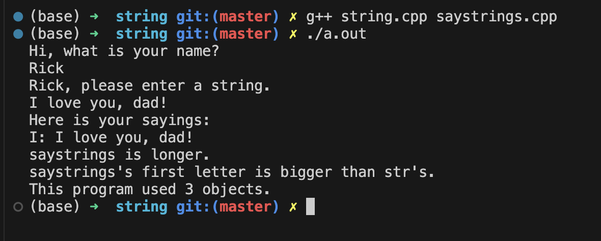

# 类和动态内存分配

## 代码例子 -- StringBad 类
- 头文件 `stringbad.h`
```cpp
#ifndef __STRINGBAD_H__
#define __STRINGBAD_H__

#include <iostream>
using namespace std;

class StringBad
{
    private:
        char *str;              // 存放的不是字符串, 而是字符串所在的地址!
        int len;

        static int num_strings; // 静态变量, 它不专属于任意一个对象, 而是所有对象共享的
                                /* 它只会被初始化一次(需要额外写一个初始化), 所有定义的对象都共享这个成员变量, 这种变量常用于统计这个类一共有多少个对象 */

    public:
        StringBad(const char *s);
        StringBad();
        ~StringBad();           // 一般在动态分配内存的场景下, 会把delete语句写在这里

        friend ostream & operator<<(ostream &os, const StringBad &st);
};

#endif //!__STRINGBAD_H__
```
- 源文件 `stringbad.cpp`
```cpp
#include "stringbad.h"
#include <cstring>      // 调用统计字符串长度的函数strlen

/* 首先处理一下静态变量 num_string:
    1. 这个变量的初始化 **不可以** 放在"构造函数"或"类的声明的任意位置", 因为这个变量不专属于任意一个对象, 它是共享的
    2. 静态变量是独立于对象存储的, 它于类的对象在内存中的存放区域不一样.
    3. 这种变量的初始化一般不要放在头文件中, 因为头文件可能会被个位置include, 导致初始化语句有多条, 一般只放在 定义类方法的cpp 文件中
    4. 初始化该变量时, 不需要再写 static, 需要使用作用域运算符::来指定它所属的类
*/
int StringBad::num_strings = 0;     

StringBad::StringBad(const char *s)
{
    len = strlen(s);
    str = new char[len + 1];        // new 了一块内存用于存放传入的字符串, 不然跑完这个函数之后, s里的东西就会被系统删掉
    strcpy(str, s);                 // 把s的内存拷贝到开辟的内存空间中
    num_strings++;
    cout << num_strings << ": \"" << str << ".\"" << endl;
}

StringBad::StringBad()
{
    len = 4;
    str = new char[4];
    strcpy(str, "C++");
    num_strings++;
    cout << num_strings << ": \"" << str << ".\"" << endl;
}

StringBad::~StringBad()
{
    cout << "\"" << str << "\" Object Deleted." << endl;
    num_strings--;
    cout << num_strings << " objects left" << endl;
    delete[] str;       // 别漏了 [], 因为是字符数组!
} 

ostream & operator<<(ostream &os, const StringBad &st)
{
    os << st.str;
    return os;
}
```

- 主函数 `vegnews.cpp`
```cpp
#include <iostream>
#include "stringbad.h"

void callme1(StringBad &rsb);       // 按引用传递
void callme2(StringBad rsb);        // 按值传递


int main(void)
{
    StringBad headline1("Hello World!");
    StringBad headline2("Good morning.");
    StringBad sport("I love you Rick");

    cout << "Headline1: " << headline1 << endl; 
    cout << "Headline2: " << headline2 << endl; 
    cout << "Sport: " << sport << endl; 

    callme1(headline1);     // 一切正常
    callme2(headline2);   // 调用按值传递的函数报错了
    return 0;
}

void callme1(StringBad &rsb)    // 按引用传递
{
    cout << "String passed by reference: " << rsb << endl;
}
void callme2(StringBad rsb)     // 按值传递
{
    cout << "String passed by value: " << rsb << endl;
}
```

程序输出如下:

- 报错原因分析
    ```txt
    1. 首先, 我们在主函数中定义了三个对象, 触发了三次构造函数, 此时会使用 new 动态开辟内存空间.
    2. 然后, 在调用callme2函数时, 会触发一次由编译器自动生成的 `拷贝构造函数` , 用于把headline1对象拷贝到rsb对象中, 此时 没有使用 new !!!!

        此时一共触发了4次构造函数, 拷贝构造函数也是构造函数.

    3. main函数结束时, 开始进行析构, 会调用4次次析构函数, 释放三次new出来的内存空间, 但是由于rsb对象没有使用 new, 所以执行到析构函数的 delete 语句时程序出错.
    ```
    - 关于`拷贝构造函数`:
      - 在我们调用 `callme2` 函数时, 进行的是按值传递, 此时 headline1 相当于执行了` StringBad rsb = headline1; ` 这样的语句, 它等价于`StringBad rsb = StringBad(headline1)`, 而这行代码对应的函数原型是 `StringBad(const StringBad &rsb);`, 也就是拷贝构造函数.
        - 如果我们没有自定义拷贝构造函数, 编译器会自动提供一个默认的.


### C++ 在类中自动提供的成员函数
如果我们在定义类的时候没有自定义下面的成员函数, 则编译器会默认提供一个.
1. 默认构造函数
2. 默认析构函数
3. 复制构造函数
4. 赋值运算符
5. 地址运算符


对于拷贝构造函数/复制构造函数:
- 在程序生成副本时就会调用, 如:
  - 函数按值传递
  - 函数 return (返回类的对象时)

因此, 对于前面的例子, 我们只需要自定义一个拷贝构造函数就可以解决这个bug
```cpp
    // 在头文件的类声明中增加拷贝构造函数的声明
    StringBad(const StringBad &st);       // 复制构造函数

    // 在定义中增加拷贝构造函数的定义
    StringBad::StringBad(const StringBad &st)
    {
        len = st.len;
        str = new char[len + 1];        // new 了一块内存用于存放传入的字符串
        strcpy(str, st.str);            // 把st的内容拷贝一份
        num_strings++;
        cout << num_strings << ": \"" << str << ".\"" << endl;
    }
```
此时, 程序运行正常, 输出如下(有4次构造, 4次析构):


还有一个需要注意的是, 在不同的编译环境下, 触发析构错误的原因可能有两种:
- 一种是前面提到的`复制构造函数/拷贝构造函数`的问题
- 另一种则是由于`赋值运算符(=)`造成的
    ```txt
    前面提到, 在调用 callme2 函数时, 按值传递在传参的过程中会触发一次拷贝构造函数, 相当于执行语句:
        StringBad rsb = headline1;

        在不同的编译环境中, 这可能存在两种情况, 第一种是:
            StringBad rsb;      // 1. 先定义一个对象
            rsb = headline1;    // 2. 然后再赋值, 此时触发默认的  赋值运算符函数
        
        第二种则是前面提到的
            StringBad rsb = StringBad( headline1 );     // 直接触发拷贝构造函数
    ```
- 因此, 安全的做法是;
  - 既要`自定义拷贝构造函数`, 也要`自定义赋值运算符函数`.

  - 代码例子 -- 补充自定义的赋值运算符函数
    ```cpp
    // 重载赋值运算符, 由于赋值运算符本身要求左侧是类的对象, 所以可以不定义成友元函数
    StringBad & operator=(const StringBad &st);


    StringBad & StringBad::operator=(const StringBad &st)
    {
        if (&st == this){       // 如果是 自己 赋值给 自己, 则不需要执行任何操作
            return *this;
        }
        delete [] str; // 因为要把临时的对象赋值给原有对象, 而且原来的对象是new出来, 故需要先删除原对象, 防止内存泄露
        len = st.len;
        str = new char[len + 1];    // 重新开辟地址, 用来存储st对象里的内容
        strcpy(str, st.str);
        return *this;       // 返回当前对象本身
    }
    ```

### 改进后的 String 类
- 头文件 `string.h`
```cpp
#ifndef __STRING_H__
#define __STRING_H__

#include <iostream>
using namespace std;

class String
{
    private:
        char *str;              // 存放的不是字符串, 而是字符串所在的地址!
        int len;

        static int num_strings; // 静态变量, 它不专属于任意一个对象, 而是所有对象共享的
                                /* 它只会被初始化一次(需要额外写一个初始化), 所有定义的对象都共享这个成员变量, 这种变量常用于统计这个类一共有多少个对象 */
        static const int CINLIMIT = 80;     // 限制输入字符的最大值

    public:
        String(const char *s);
        String();
        String(const String &st);       // 复制构造函数
        ~String();           // 一般在动态分配内存的场景下, 会把delete语句写在这里

        int length() const
        {
            return len;
        }

        // 重载赋值运算符, 由于赋值运算符本身要求左侧是类的对象, 所以可以不定义成友元函数
        String & operator=(const String &st);
        String & operator=(const char *st);       // 直接传入一个字符串

        char & operator[](int i);                       // 重载索引运算
        const char & operator[](int i) const;

        friend bool operator<(const String &str1, const String &str2);
        friend bool operator>(const String &str1, const String &str2);
        friend bool operator==(const String &str1, const String &str2);

        friend ostream & operator<<(ostream &os, const String &st);
        friend istream & operator>>(istream &is, String &st);

        static int HowMany();       // 静态函数, 不属于任何一个对象, 它用来返回对象的个数
};

#endif //!__STRING_H__
```

- 源文件 `string.cpp`
```cpp
#include "string.h"
#include <cstring>      // 调用统计字符串长度的函数strlen

/* 首先处理一下静态变量 num_string:
    1. 这个变量的初始化 **不可以** 放在"构造函数"或"类的声明的任意位置", 因为这个变量不专属于任意一个对象, 它是共享的
    2. 静态变量是独立于对象存储的, 它于类的对象在内存中的存放区域不一样.
    3. 这种变量的初始化一般不要放在头文件中, 因为头文件可能会被个位置include, 导致初始化语句有多条, 一般只放在 定义类方法的cpp 文件中
    4. 初始化该变量时, 不需要再写 static, 需要使用作用域运算符::来指定它所属的类
*/
int String::num_strings = 0;     

int String::HowMany()           // 静态函数
{
    return num_strings;
}

String::String(const char *s)
{
    len = strlen(s);
    str = new char[len + 1];        // new 了一块内存用于存放传入的字符串, 不然跑完这个函数之后, s里的东西就会被系统删掉
    strcpy(str, s);                 // 把s的内存拷贝到开辟的内存空间中
    num_strings++;
}

String::String()
{
    len = 0;
    str = new char[1];
    str[0] = '\0';
    num_strings++;
}

String::String(const String &st)
{
    len = st.len;
    str = new char[len + 1];        // new 了一块内存用于存放传入的字符串
    strcpy(str, st.str);            // 把st的内容拷贝一份
    num_strings++;
}

String::~String()
{
    num_strings--;
    delete[] str;       // 别漏了 [], 因为是字符数组!
} 

String & String::operator=(const String &st)
{
    if (&st == this){       // 如果是 自己 赋值给 自己, 则不需要执行任何操作
        return *this;
    }
    delete [] str; // 因为要把临时的对象赋值给原有对象, 而且原来的对象是new出来, 故需要先删除原对象, 防止内存泄露
    len = st.len;
    str = new char[len + 1];    // 重新开辟地址, 用来存储st对象里的内容
    strcpy(str, st.str);
    return *this;       // 返回当前对象本身
}

String & String::operator=(const char *st)
{
    delete [] str; // 因为要把临时的对象赋值给原有对象, 而且原来的对象是new出来, 故需要先删除原对象, 防止内存泄露
    len = strlen(st);
    str = new char[len + 1];    // 重新开辟地址, 用来存储st对象里的内容
    strcpy(str, st);
    return *this;       // 返回当前对象本身
}

char & String::operator[](int i)        // 这里没有const
{
    return str[i];
}

const char & String::operator[](int i) const    // 这里加了const, 表示不能修改任何东西
{
    return str[i];
}

bool operator<(const String &str1, const String &str2)
{
    return (strcmp(str1.str, str2.str) < 0);
}

bool operator>(const String &str1, const String &str2)
{
    return str1 < str2;     // 使用了上面定义的运算符重载
}

bool operator==(const String &str1, const String &str2)
{
    return (strcmp(str1.str, str2.str) == 0);
}

ostream &operator<<(ostream &os, const String &st)
{
    os << st.str;
    return os;
}

istream & operator>>(istream &is, String &st)
{
    char temp[String::CINLIMIT];
    is.get(temp, String::CINLIMIT); // 先捕获字符, 再拷贝到对象里
    if(is){
        st = temp;      // 调用前面重载的赋值运算符 (到这里只会捕获 String::CINLIMIT 个字符, 超出部分仍留在缓冲区)
    }
    while (is && is.get()!='\n')   // 如果输入的内容太长, 则需要清空缓存 
        continue;
    return is;
}
```

- 主函数 `saystrings.cpp`
```cpp
#include <iostream>
#include "string.h"

const int MAXLENGTH = 81;

int main(void)
{
    String name;
    cout << "Hi, what is your name? " << endl;
    cin >> name;        // 调用了重载的输入运算符
    cout << name << ", please enter a string." << endl;
    
    // 输入内容, 赋值到新的对象
    String saystrings;
    char temp[MAXLENGTH];
    cin.get(temp, MAXLENGTH);
    while(cin && cin.get() != '\n') // 超出指定长度范围时清空缓冲区
        continue;
    saystrings = temp;              // 调用了重载的赋值运算符

    cout << "Here is your sayings: " << endl;
    cout << saystrings[0] << ": " << saystrings << endl;    // 调用了重载的输出运算符

    // 测试长度比较函数
    String str = "Hello World!"; 
    if(saystrings.length() < str.length())
        cout << "str is longer." << endl;
    else
        cout << "saystrings is longer." << endl;
    
    if(saystrings < str)        // 调用重载的比较运算符, 内部使用的是 strcmp(), 它会一个个字符比较, 如果第一个字符已经有比较结果, 则不会继续进行比较
        cout << "saystrings's first letter is smaller than str's." << endl;
    else
        cout << "saystrings's first letter is bigger than str's." << endl;

    // 测试静态函数, 打印一共有多少个对象
    cout << "This program used " << String::HowMany() << " objects." << endl;

    return 0;
}
```




## 在构造函数中使用new应该注意的问题
- 如果在构造函数中使用了new, 则应在析构函数中要有对应的delete.
  - new 对应于 delete
  - new [] 对应于 delte []
    - 开辟变量就释放变量, 开辟数组就释放数组
  - delete 运算符`可以用于空指针`
    ```cpp
    // 以下用法都不会报错
    delete NULL;

    char * temp = 0;        // 传统C++中, 0可以表示空指针
    delete temp;

    delete nullptr;
    ```

- 对于空指针
  - C语言中常用`NULL`表示空指针
  - 传统的 C++ 常用 `0` 表示空指针
  - C++11 中可以使用 `nullptr` 表示空指针

- 包含类成员的类的逐成员复制
    ```cpp
    class Magazine
    {
        private:
            String title;           // 自定义的String类 (假设是前面例子中定义的的String类, 它包含了复制构造以及赋值运算符重载)
            string publisher;       // 标准库的string类
    };
    ```
    - 如果我们在定义一个新的类中包含了其他数据类型, 而这些类型中也已经存在`赋值运算符重载`和`复制构造函数`, 则此时新的类型中可以不针对这些数据类型特地写一个复制构造或者赋值运算符重载, 因为在编译器提供的默认构造函数中就会自动调用这些类型里的复制构造函数和赋值运算符重载.
      - 简单来说, Magazine的对象进行复制时, String类 和 string类 里面的复制构造函数和赋值运算符就会自动调用, 而不需要在意是不是进行了 new 和 delete.
    - 如果需要针对其他数据成员定义复制构造函数, 这种情况比较复杂, 在十三章中进行讲解.


## 有关返回对象的说明
一共分为4种情况:
- 返回**对象**
- 返回**对象的引用**
- 返回**const对象**
- 返回**const对象的引用**

### 返回const对象的引用 与 返回对象
```cpp
// 返回对象
Vector Max(const Vector & v1, const Vector &v2)
{
    if(v1.magval() > v2.magval())
        return v1;
    else
        return v2;
}

// 返回const对象的引用
const Vector & Max(const Vector & v1, const Vector &v2)
{
    if(v1.magval() > v2.magval())
        return v1;
    else
        return v2;
}
```
- 如果直接**返回对象**, 则会触发`复制构造函数`, 会产生临时对象, 临时对象会在函数结束时被销毁, 造成内存浪费.
- 如果**返回const对象的引用**, 则不会出发复制, 效率更高.
  - 但是要注意返回的那个`对象不能在函数结束后被销毁`, 否则就会出问题.
  - 返回的对象类型需要是`const`, 否则会不匹配, 报错.
  - 由于是const修饰的对象, 它是不可更改的, 这个需要注意.

### 返回对象的引用(非const)
```cpp
// operator=() 的返回值需要用于连续赋值, 因此这时候应返回非const的引用, 如
String s1("good stuff");
String s2, s3;
s3 = s2 = s1;

// operator<<() 返回值用于串接输出, 也应该使用非const的引用
String s1("good stuff");
cout << s1 << "is comming." << endl;
```
- 对于`ostream`类来说:
  - 它里面`没有公有的复制构造函数`, 因此`必须返回对象的引用`.


### 返回对象
- 如果需要返回的局部变量, 则不能返回对象的引用, 因为局部变量在函数结束时就会自动触发析构函数, 于是返回出来的引用就不知道指到哪里去了. 此时应该使用`返回对象`的方式.
  - 这种情况常见于`算术运算符`中, 因此, 但凡重载了算术运算符, 一般情况下都使用`返回对象`的方式.

### 返回const对象
例子:
```cpp
// 如果没有使用返回const对象的方式, 如 Vector::operator+();
// 那么下面的三种写法都是正确的:
net - force1 + force2;      // 写法1: 正常使用加法运算符
force1 + force2 = net;      // 写法2: 做完加法之后, 运算符返回的内容存放在一个临时变量中, 然后临时变脸被net刷新
cout << (force1 + force2 = net).magval() << endl; // 写法3: 临时变量的内容被输出, 然后临时变量被销毁
```
- 后面两种写法虽然没有什么意义, 但它是符合语法规则的.
  - 第二种写法可能是把 `force1 + force2 == net` 给写错了造成的, 但是编译器不会报错, 因为它是符合语法规则的.
  - 要禁止出现这样的写法, 只需要将返回的对象设置为const即可, 即使用`返回const对象`的方式.

小结:
1. 如果要返回**局部变量**, 则应该使用`返回对象`的方式.
2. 如果需要返回一个**没有公有复制构造函数的类**(如 ostream), 则应使用`返回对象引用`的方式.
3. 如果既可以返回对象, 也可以返回对象的引用, 则`优先使用返回对象的引用`的方式, 因为它效率更高.

## 指向对象的指针
使用方法
```cpp
String sayings[10];     // 声明一个对象数组 sayings
int choice = 0;         // 用来索引对象数组的元素

// method 1: 直接新建一个对象指针, 不进行初始化
String * glamour;   // 假设之前已经定义了String类, 可以创建一个对象指针

// method 2: 直接创建一个对象指针并指向已有对象
String * first = &sayings[0];       // 从对象数组中取一个对象, 再取它的地址赋值给 对象指针first

// mothod 3: 使用 new 创建一个对象指针, 使用拷贝构造
String * favorite = new String(sayings[choice]);    // 1. 使用new创建对象指针时创建了一个新的对象 使用; 2. 把sayings[choice]的内容拷贝到新对象中, 使用了拷贝构造函数

// mothod 4: 使用 new 创建一个对象指针, 使用默认构造
String * gleep = new String;    // 在 `new String`部分会触发构造函数, 这里是调用了默认构造函数

// method 5: 使用 new 创建一个对象指针, 使用自定义构造函数
String * glop = new String("My My My");   // 调用了自定义的构造函数


```
需要注意的知识点:
- 使用`new`创建对象指针时, 会`触发这个类的构造函`数来创建新的对象!
  - 具体使用什么构造函数就看给什么参数了


### 使用new运算符时的过程分析
构造过程:

1. 开辟内存空间
   - 开辟空间, 放置类的对象, 这个步骤开辟的空间可能不是完整的, 更多情况下可能只够存放指针或者基本数据类型的空间
     - 例如上面的String类, 这里创建了一个**只能存放指针地址的空间**给`str`用, 然后创建一个i**nt类型的空间**给`len`用. 这个例子中new开辟的空间地址是2000
2. 调用相应的构造函数
   - 根据不同的参数输入触发不同的构造函数(默认构造, 自定义构造, 拷贝构造)
     - 如果构造函数里也有new, 此时一般开辟的是存放具体数据量的空间
       - 如上面的String类的构造函数里, new运算符开辟了一个地址为 2400的空间
3. 创建一个指针, 指向这个对象
   - 这里创建的指针属于另一个内存空间, 它只能放得下一个内存地址
4. 把new得到的内存地址放入对象指针中
   - 实际放入的是步骤一得到的内存地址.

析构过程

- 上图的代码例子中, 同普通创建对象的方式创建了一个"全局"的对象 nice, 然后在main函数中使用 new 动态创建了一个对象指针 pt, 然后花括号里面也创建了一个"局部"的对象 up, 在析构时, 执行的步骤为:
  1. 花括号的代码段执行完后, 里面的对象up先被析构, 此时会**自动执行** `up的析构函数`
  2. 然后遇到 `delete pt`, 此时会执行 `pt所指向的对象的析构函数`. (相当于**手动标识了**析构的执行)
  3. 在程序运行结束后, 会**自动执行**执行 `对象nice的析构函数` 

- 需要注意, 通过 new 运算动态创建的对象指针, 只有在使用`delete`删除对象指针的时候才会触发相应的析构函数, 而不是程序运行结束时自动触发析构!


### 定位new的使用
代码例子:
```cpp
#include <iostream>
#include <string>
#include <new>      // 要使用定位new运算一定要引入这个头文件

using namespace std;

const int BUF = 512;

class JustTesting
{
    private:
        string words;
        int number;
    public:
        JustTesting(const string &s = "Just Testing", int n = 0)      // 默认构造
        {
            words = s;
            number = n;
            cout << words << " constructed." << endl;
        }
        ~JustTesting()
        {
            cout << words << " Destroyed\n";
        }

        void show() const
        {
            cout << words << ", " << number << endl;
        }
};


int main(void)
{
    char * buffer = new char[BUF];
    JustTesting *pc1, *pc2;

    pc1 = new(buffer) JustTesting;      // 使用定位new的方式创建对象, 此时使用的是默认构造
                                        // 注意定位new不能delete
    pc2 = new JustTesting("Heap1", 20);           // 触发默认构造

    // 打印在内存中的地址
    cout << "buffer: " << (void *) buffer << endl;    // 如果不进行强制类型转换的话, 这里会直接输出buffer里的内容
    cout << "heap: " << pc2 << endl;

    cout << pc1 << ": ";
    pc1->show();
    cout << pc2 << ": ";
    pc2->show();

    JustTesting *pc3, *pc4;
    pc3 = new(buffer) JustTesting("Bad Idea", 6);  // 在没有清空buffer的前提下继续往里塞东西
    pc4 = new JustTesting("Heap2", 10);
    // 打印在内存中的地址
    cout << pc3 << ": ";
    pc3->show();
    cout << pc4 << ": ";
    pc4->show();

    // 注意: 前面所有的对象都没有自动触发析构, 需要使用delete才行, 但是 定位new 不应该用 delete!!!
    delete pc2;
    delete pc4;

    // delete pc1;     // 这里的pc1虽然是定位new, 但是从打印地址的输出信息可以看到, 这行代码本质上等价于 delete [] buffer, 但此时会触发析构哦!
    // delete pc3;     // 如果执行上一句pc1后, 由于pc3使用的是定位new, 内容也放在buffer变量对应的内存空间中, 所以到这里就没有内存可以释放了, 于是报错.

    delete [] buffer;       // 使用定位new对应的变量应该释放最原始的内存空间对应的变量, 也就是这里的buffer, 而不是释放 pc1 和 pc3
                            // 此时不会触发 pc1 和 pc3 的析构函数!

    return 0;
}
```

- 不难发现, 在上图的输出中, 我们找不到 pc1 和 pc3 对应的析构函数输出, 这是因为我们`没有显式地宣布pc1和pc3的死亡`, 因此析构函数不会被触发, 解决办法是`手动调用析构函数`, 这是**为数不多的需要显式调用析构的函数的场景**.
    ```cpp
    // --- 修改后的析构(按照后进先出的顺序去析构, 因为后面创建的对象可能使用了前面对象的资源) -----
    delete pc2;
    delete pc4;
    pc1 -> ~JustTesting();
    pc3 -> ~JustTesting();
    delete [] buffer;
    ```
- 此时, 如果执行前面的代码, 则会得到如下输出:

  - 我们会发现属于PC3的内容 "Bad Idea Destroyed" 打印了两次, 这说明上面的代码在创建pc3的时候的写法`pc3 = new(buffer) JustTesting("Bad Idea", 6);` 会覆盖掉前面写入的内容, 这是需要注意的!
    - 正确写法应该是`pc3 = new(buffer + sizeof(JustTesting)) JustTesting("Bad Idea", 6);`, **通过指针偏移来避免覆盖**.
    - 此时的输出为:
        


## 用链表模拟队列(queue)
- 队列的特点:
  - 先进先出
  - 一端进, 另一端出
- 这里选择使用`链表`的思想来实现
  - 链表在内存中`不是连续分布`的
  - 链表分为: 单向链表, 双向链表, 循环链表.  (模拟队列使用单向链表即可)

代码例子:
- 头文件 `queue.h`
```cpp
/*
    用链表来模拟队列(银行排队的队列)
*/
#ifndef __QUEUE_H__
#define __QUEUE_H__

#include <iostream>

using namespace std;

class Customer
{
    private:
        long arrive;            // 开始操作ATM的时间(单位:秒)
        int processtime;        // 操作ATM机的总时间

    public:
        Customer(){arrive = processtime = 0; }
        void set(long when);                    // 设置开始操作ATM的时间
        long when() const {return arrive;}      // 用来查询开始操作ATM的时间
        int ptime() const{return processtime;}  // 用来查询操作ATM的总时间
};

typedef Customer Item;     // 用来统一改变链表节点的数据类型, 这里用自定义的类型作为链表节点数据类型

class Queue
{
    private:
        enum{Q_SIZE = 10};      // 通过枚举来定义常量, 此时枚举类型是匿名的
        struct Node{Item item; Node *next;};  // 注意next指针是一个结构体指针
        Node *front;      // 头结点
        Node *rear;       // 尾结点
        int items;        // 记录队列中有多少个节点
        const int qsize;        // 队列最大长度(不希望被修改)

    public:
        Queue(int qs = Q_SIZE);
        ~Queue();
        bool isEmpty() const;
        bool isFull() const;
        int queueCount() const;
        bool enqueue(const Item &item); // 入队列
        bool dequere(Item &item);       // 出队列, 出队列的节点要赋值给 item, 所以不加const

};

#endif //!__QUEUE_H__
```

- 源文件 `queue.cpp`
```cpp
#include "queue.h"
#include <cstdlib>      // 为了使用rand函数而引入

Queue::Queue(int qs) : qsize(qs)        // 这是 "成员初始化列表" 的赋值方式, 专门用于 const 变量在构造过程中进行初始化
{
    front = rear = nullptr; // 头,尾结点指针
    items = 0;      // 记录节点个数
    // qsize = qs;     // 链表的总长度(由于定义成const类型, 这里不能再次赋值了)
}

// 当队列使用完之后, 如果仍有元素没有出队, 则需要靠析构函数进行内存释放
Queue::~Queue()
{
    while(front != nullptr){
        Node * temp = front;     // 1. 取出即将释放的节点
        front = front->next;     // 2. 移动链表头到下一个位置, 防止丢失链表
        delete temp;             // 3. 释放节点
    }
}

bool Queue::isEmpty() const
{
    return items == 0;
}

bool Queue::isFull() const
{
    return items == qsize; 
}

int Queue::queueCount() const
{
    return qsize;
}

// 入队操作是在链表尾部增加节点
bool Queue::enqueue(const Item &item)
{
    // 入队需要先判断是否为满
    if(isFull())
    {
        return false;
    }

    // 队列没有满的前提下才新增节点
    Node *add = new Node;   // 动态开辟新节点
    add->item = item;       // 新节点的数据赋值
    add->next = nullptr;    // 新增节点后面应该为空
    items++;

    if(front == nullptr){
        front = add;    // 如果一开始链表为空, 则直接把头结点设置为当前新增的节点
    }
    else{                   // 原链表本身不为空链表时, 只需要更新尾结点
        rear->next = add;   // 注意: 把原来链表的尾结点的next指向当前新增的节点, 没进行这个操作之前, rear的next节点是 nullptr
    }
    rear = add;             // 这个操作才是把原来的尾结点移动到新增节点上

    return true;
}

bool Queue::dequere(Item &item)
{
    if(isEmpty())
        return false;
    
    item = front->item;  // 队列是"先入先出", 故取头节点 (此处执行了一次拷贝)

    // 开始删节点, 更新头结点
    items--;             // 1. 更新链表数量
    Node *temp = front;  // 2. 保留原来的头结点, 用于释放内存
    front = front->next; // 3. 把当前的头结点移动到下一个位置
    delete temp;         // 4. 删除原来不要的节点

    // 更新尾结点
    if (items == 0){
        rear = nullptr;
    }

    return true;
}

void Customer::set(long when)
{
    arrive = when;
    processtime = rand() % 3 + 1;       // 这里只是模拟, 所以真正的操作时间是个随机值(限制在3分钟以内).
}
```

- 主函数 `bank.cpp`
```cpp
#include <iostream>
#include "queue.h"

using namespace std;

int main(void)
{
    int qs;
    Item temp;      // 对应为 Customer 类的对象
    long i = 0;
    int customers = 0;

    cout << "Enter maximum size of queue: ";
    cin >> qs;

    Queue line(qs);     // 初始化一个队列

    // 往队列填充内容
    while(!line.isFull())
    {
        temp.set(i++);      // 先使用i, 再对i增加
        line.enqueue(temp);
        customers++;
    }
    cout << "Customers: " << customers << endl;

    // 出队列
    while(!line.isEmpty())
    {
        line.dequere(temp);
        customers--;
    }
    cout << "Now Customers: " << customers << endl;

    return 0;
}
```


### 成员初始化列表
成员初始化列表的用法:
```cpp
// --- 例子1 ----
// 如果 Classy是一个类, mem1, mem2, mem3 都是这个类的数据成员, 则在<构造函数>的定义中可以使用下面的语法初始化数据成员
classy::classy(int n, int m) : mem1(n), mem2(0), mem3(n*m + 2)
{
    // ...
}

// ------ 例子2 ----
class Agency{...};

class Agenct
{
    private:
        Agency & belong; // 引用数据类型

    // ...
};

Agent::Agent(Agency & a) : belong(a)    // 引用数据类型要使用成员初始化列表
{
    // ...
}
```
1. 只能用于构造函数
2. **必须**用这种初始化方法来初始化`非静态的const数据成员`
   - 静态数据成员(`static`修饰的数据成员) 是独立存放的, 它并不在构造函数里初始化
3. **必须**用这种格式来初始化`引用数据成员`
   - 因为引用数据类型在声明时就要初始化, 且不能再改变(与const类型一样), 因此只能在构造函数中使用成员初始化列表来初始化
4. 初始化的顺序与他们在类声明中的顺序要一致

`非静态const数据成员`和`引用数据成员`使用成员初始化列表的理由是:
- 在执行构造函数阶段, 编译器是检查一遍类声明中的数据成员, 并在内存中开辟相应的内存空间, 在开辟的过程中, 如果有非静态的const数据成员或引用数据成员, **如果在类的声明中有写他们的初始化, 那么此时开辟完内存空间的同时就会把初始化的值填写到内存里**.
- 在`开辟完空间之后就相当于结束了初始化环节`, 编译器此时才会执行构造函数的函数体语句, 此时, 函数体里的所有语句都被识别为`赋值语句`, 而非const类型和引用数据类型是**不允许二次赋值**的, 故构造函数的函数体内部**不可以写这两种数据的"初始化"语句**.
- 但很多情况下, 我们需要通过构造阶段给这两种数据成员初始化为不同数值(而不是在类的声明中直接统一写死), 此时就需要使用`成员初始化列表`才能实现.


