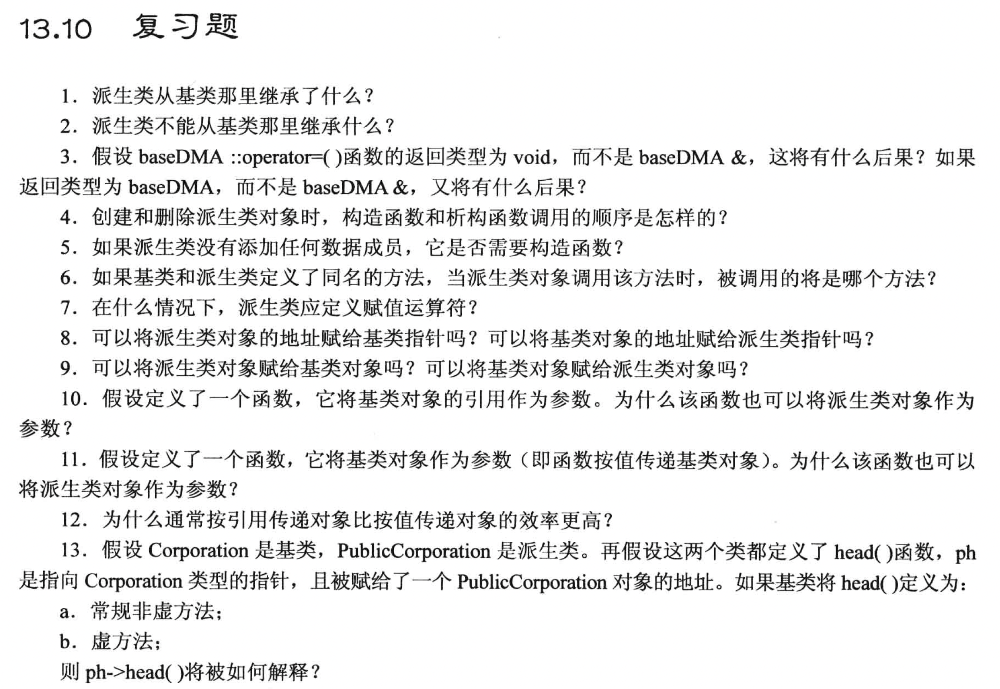
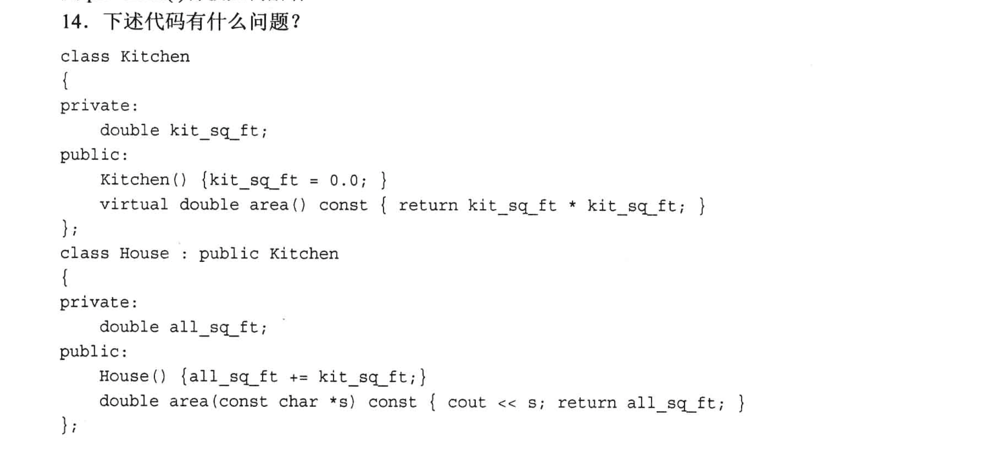

# 题目

# 1. 
派生类从基类中继承了:
1. 所有数据成员
   - 有些数据成员只是访问控制权限不同, 导致可能无法直接访问
     - 公有成员和保护成员可以被派生类直接访问, 私有成员不可以
2. 大部分成员函数

# 2.
派生类不能继承的有:
1. 构造函数, 析构函数
2. 友元函数(不属于类的成员函数)
3. 赋值运算符

# 3.
- 返回为`void`:
  - 返回值为void本质上是可以的, 但是它不能连续赋值
    - 如: `a = b = c = 0;` 这种形式是不可以的
- 返回为`baseDMA &`
  - 正常使用推荐是这样写, 此时可以连续赋值
    - 如: `a = b = c = 0;` 这种形式是可以的
- 返回为`baseDMA`
  - 会触发拷贝构造来创建一个临时对象, 能用, 但是消耗资源 

# 4.
- 创建时:
  - 先创建基类对象, 再创建派生类对象.
    - 基类对象是通过构造函数的`初始化列表`来创建的, 如果没有手动写, 则会调用基类的默认构造函数
- 析构时:
  - 先析构派生类对象, 再析构基类对象
    - 注意一定要使用虚函数!! 否则整个过程只会触发基类的析构函数, 而不会触发派生类的析构函数.

# 5.
每一个类都是需要构造函数的, 如果没有自定义, 编译器也会自动生成一个默认的构造函数.

# 6.
如果派生类中重新定义了基类的方法(成员函数), 则在派生类对象中调用同名函数时, 会直接使用派生类的方法, 此时基类的同名方法已经被隐藏.
- 此时可以用**作用域解析符**来调用基类的方法
  - 如: `baseDMA::View();`

# 7.
在派生类中, 如果使用了 `new` 来分配成员变量的存储空间, 此时就需要重新定义赋值运算符, 同时也需要重新定义拷贝构造函数.
- 主要目的是进行数据的`深度拷贝`, 比如`strcpy()`这种操作.

# 8.
- 可以直接将派生类对象的地址赋值给基类指针(依据是 is-a 规则).
- 只有经过转换函数(在派生类中定义了类型`转换函数`)才可以将基类地址赋值给派生类指针 (但是**非常不推荐, 不安全**!)

# 9.
- 可以直接将派生类对象赋值给基类对象(依据是 is-a 规则).
  - 走的是基类的赋值运算符来实现的, 此时派生类特有的数据成员并不会被复制.
- 答案是`也许`, 也就是下面的方法中有一种被实现了:
  1. 在派生类中定义了类型`转换函数`
  2. 特地重载了一份赋值运算符, 它专门处理基类对象赋值给派生类指针的情况.

# 10.
可以.
- 可以将派生对象`当做`基类对象使用.

# 11.
因为按值传递的时候, 触发了基类的复制构造函数, 此时派生类的对象作为`基类复制构造函数的入参`.

# 12.
按引用传递没有拷贝的过程(传递的是对象本身), 但是按值传递会进行拷贝.

# 13.
- 常规非虚方法 (按照指针本身的类型来调用)
  - 调用**基类**的 head()
- 虚方法 (按指针/引用指向的对象来调用)
  - 调用**派生类**的 head()

# 14.
1. 派生类的构造函数中, 基类的成员kit_sq_ft是不能直接访问的, 要用过基类的方法才能调用.
2. (不一定是错误) 派生类中重新定义了虚函数 area(), 会导致**基类**的同名函数被隐藏, 除非使用作用域解析符来调用
   1. 此时函数的特征标是不一样的, 因此**这不是重载虚函数**, 而是**重新定义**了这个(虚)函数.

