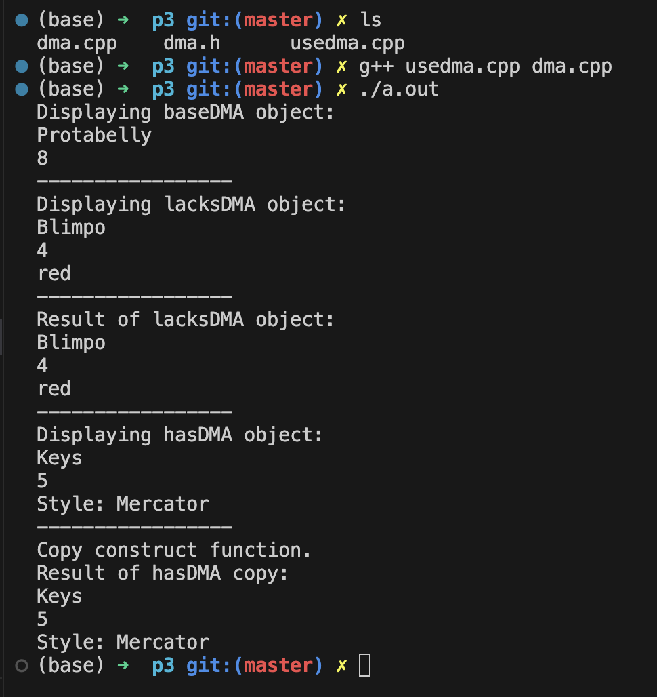
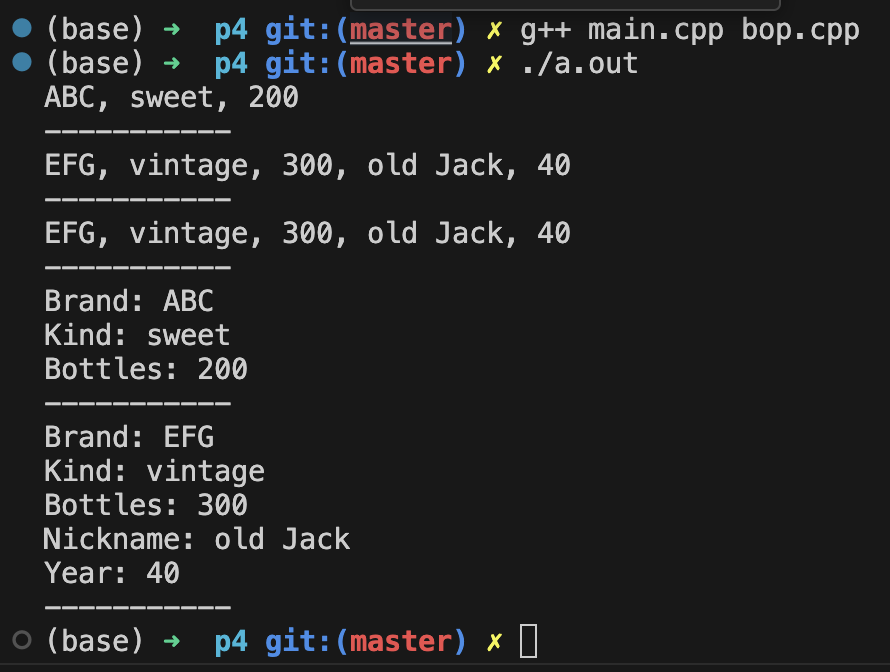

# 题目


# 1.
- `classic.h`

```cpp
#ifndef __CLASSIC_H__
#define __CLASSIC_H__

#include <iostream>
using namespace std;

class Cd
{
    private:
        char performers[50];
        char label[20];
        int selections;
        double playtime;
    public:
        // 构造函数不能是虚函数
        Cd(const char * s1, const char * s2, int n, double x);      // 普通构造
        Cd(const Cd & d);                                           // 拷贝构造
        Cd();                                                       // 默认构造
        virtual ~Cd(){};
        virtual void Report() const;
        Cd & operator=(const Cd &d);                    // 赋值运算符不能是虚函数(它左侧的对象随着类类型的不同而不同, 没必要定义成虚函数)
};

class Classic : public Cd
{
    private:
        char works[50];
    public:
        Classic();
        Classic(const Classic &c);
        Classic(const char *s1, const char *s2, const char *s3, int n, double x);
        ~Classic(){}
        virtual void Report();
        Classic &operator=(const Classic &c);
};

#endif //!__CLASSIC_H__
```

- `classic.cpp`

```cpp
#include "classic.h"
#include <cstring>

Cd::Cd(const char * s1, const char * s2, int n, double x)
{
    strncpy(performers, s1, 50);
    if(strlen(s1) >= 50){
        performers[49] = '\0';
    }
    else{
        performers[strlen(s1)] = '\0';      // 由于strcpy不拷贝'\0', 所以当s1长度不及50时, 需要手动补一个'\0'
    }

    strncpy(label, s2, 20);
    if(strlen(s2) >= 20){
        label[19] = '\0';
    }
    else{
        label[strlen(s2)] = '\0';      // 由于strcpy不拷贝'\0', 所以当s2长度不及20时, 需要手动补一个'\0'
    }

    selections = n;
    playtime = x;
}

Cd::Cd(const Cd &d)
{
    strcpy(performers, d.performers);
    strcpy(label, d.label);
    selections = d.selections;
    playtime = d.playtime;
}

Cd::Cd()
{
    performers[0] = '\0';
    label[0] = '\0';
    selections = 0;
    playtime = 0.0;
}

void Cd::Report() const
{
    cout << "Performers: " << performers << endl;
    cout << "Label: " << label << endl;
    cout << "Selections: " << selections << endl;
    cout << "Playtime: " << playtime << endl;
}

Cd & Cd::operator=(const Cd &d)
{
    if (this == &d){
        return *this;
    }

    strcpy(performers, d.performers);
    strcpy(label, d.label);
    selections = d.selections;
    playtime = d.playtime;

    return *this;
}

Classic::Classic() : Cd()
{
    works[0] = '0';
}

Classic::Classic(const Classic &c) : Cd(c)
{
    strcpy(works, c.works);
}

Classic::Classic(const char *s1, const char *s2, const char *s3, int n, double x) : Cd(s2, s3, n, x)
{
    strncpy(works, s1, 50);
    if(strlen(s1) >= 50){
        works[49] = '\0';
    }
    else{
        works[strlen(s1)] = '\0';      // 由于strcpy不拷贝'\0', 所以当s1长度不及50时, 需要手动补一个'\0'
    }
}

void Classic::Report()
{
    Cd::Report();
    cout << "Works: " << works << endl;
}

Classic & Classic::operator=(const Classic &c)
{
    if(this == &c){
        return *this;
    }

    Cd::operator=(c); // 基类先拷贝一份
    strcpy(works, c.works);

    return *this;
}
```

- `main.cpp`

```cpp
#include <iostream>
#include "classic.h"
using namespace std;

void Bravo(const Cd & disk);

int main(void)
{
    Cd c1("Beatles", "capitol", 14, 35.5);
    Classic c2 = Classic("Piano Sonata in B flat, Fantasia in C", "Alfred Brendel", "Philips", 2, 57.17);

    Cd *pcd = &c1;

    cout << "Using object directly:\n";
    c1.Report();        // 基类
    c2.Report();        // 派生类

    cout << "------------" << endl;

    cout << "Using type cd * pointer to objects:\n";
    pcd->Report();      // 基类
    pcd = &c2;
    pcd->Report();      // 派生类

    cout << "------------" << endl;

    Bravo(c2);          // 派生类

    cout << "------------" << endl;

    cout << "Testing assignment: \n";
    Classic copy;
    copy = c2;          // 验证派生类的赋值运算符
    copy.Report();

    return 0;
} 

void Bravo(const Cd &disk)
{
    disk.Report();
}
```

# 2.

- `classic.h`
```cpp
#ifndef __CLASSIC_H__
#define __CLASSIC_H__

#include <iostream>
using namespace std;

// 基类
class Cd
{
    private:
        char * performers;
        char * label;
        int selections;
        double playtime;
    public:
        // 构造函数不能是虚函数
        Cd(const char * s1, const char * s2, int n, double x);      // 普通构造
        Cd(const Cd & d);                                           // 拷贝构造
        Cd();                                                       // 默认构造
        virtual ~Cd();
        virtual void Report() const;
        Cd & operator=(const Cd &d);                    // 赋值运算符不能是虚函数(它左侧的对象随着类类型的不同而不同, 没必要定义成虚函数)
};

// 派生类
class Classic : public Cd
{
    private:
        char * works;
    public:
        Classic();
        Classic(const Classic &c);
        Classic(const char *s1, const char *s2, const char *s3, int n, double x);
        ~Classic();
        virtual void Report();
        Classic &operator=(const Classic &c);
};

#endif //!__CLASSIC_H__
```

- `classic.cpp`

```cpp
#include "classic.h"
#include <cstring>

// 基类
Cd::Cd(const char * s1, const char * s2, int n, double x)
{
    performers = new char[strlen(s1) + 1];
    strcpy(performers, s1);

    label = new char[strlen(s2) + 1];
    strcpy(label, s1);

    selections = n;
    playtime = x;
}

Cd::Cd(const Cd &d)
{
    performers = new char[strlen(d.performers) +1];
    strcpy(performers, d.performers);

    label = new char[strlen(d.label) +1];
    strcpy(label, d.label);

    selections = d.selections;
    playtime = d.playtime;
}

Cd::Cd()
{
    performers = nullptr;
    label = nullptr;
    selections = 0;
    playtime = 0.0;
}

Cd::~Cd()
{
    delete [] performers;
    delete [] label;
}

void Cd::Report() const
{
    cout << "Performers: " << performers << endl;
    cout << "Label: " << label << endl;
    cout << "Selections: " << selections << endl;
    cout << "Playtime: " << playtime << endl;
}

Cd & Cd::operator=(const Cd &d)
{
    if (this == &d){
        return *this;
    }

    delete [] performers;
    delete [] label;

    performers = new char[strlen(d.performers) +1];
    label = new char[strlen(d.label) +1];

    strcpy(performers, d.performers);
    strcpy(label, d.label);
    selections = d.selections;
    playtime = d.playtime;

    return *this;
}

// 派生类
Classic::Classic() : Cd()
{
    works = nullptr;
}

Classic::Classic(const Classic &c) : Cd(c)
{
    works = new char[strlen(c.works) +1];
    strcpy(works, c.works);
}

Classic::Classic(const char *s1, const char *s2, const char *s3, int n, double x) : Cd(s2, s3, n, x)
{
    works = new char[strlen(s1) +1];
    strcpy(works, s1);
}

Classic::~Classic()
{
    delete [] works;
}

void Classic::Report()
{
    Cd::Report();
    cout << "Works: " << works << endl;
}

// PDF的 518页 有例题
Classic & Classic::operator=(const Classic &c)
{
    // step1:
    if(this == &c){
        return *this;
    }

    // step2: 调用基类的赋值运算符, 完成基类的赋值
    Cd::operator=(c);

    // step3:
    delete [] works;

    // Step4:
    works = new char[strlen(c.works) +1];

    // step5:
    strcpy(works, c.works);

    return *this;
}
```

# 3.
- `dma.h`

```cpp
#ifndef __DMA_H__
#define __DMA_H__

#include <iostream>
using namespace std;

// 重新定义一个基类
class ABC
{
    private:
        char *label;
        int rating;
    public:
        ABC(const char *l = "null", int r = 0);     // 默认构造
        virtual ~ABC();                             // 基类就应该写一个虚析构函数
        
        ABC(const ABC &rs);
        ABC & operator=(const ABC &rs);             // 有复制构造函数就一定要重载赋值运算符
        
        friend ostream & operator<<(ostream &os, const ABC &rs);        // 输出

        // 新增一个虚方法
        virtual void View() const;
};

class baseDMA : public ABC          // 继承ABC类
{
    // 没有数据成员了(基类已经包含)

    public:
        baseDMA(const char *l = "null", int r = 0);     // 默认构造
        // 析构函数使用默认的就行, 因为没有new操作
        baseDMA(const baseDMA &rs);
        // 由于baseDMA 没有自己专属的数据成员, 可以使用默认的赋值运算符
        // 由于baseDMA 没有自己专属的数据成员, 不需要再重载输出了, 直接用基类的就行
        virtual void View() const;
};

// 不带new的派生类
class lacksDMA : public ABC
{
    private:
        enum {COL_LEN = 40};
        char color[COL_LEN];        // 这里已经分配好内存了. 没有动态分配内存, 可以不写当前派生类的析构函数
    public:
        lacksDMA(const char *l = "null", int r = 0, const char *c = "blank");
        lacksDMA(const ABC &rs, const char *c = "blank");
        // 注: 由于派生类中没有使用new为成员变量分配空间, 所以派生类可以不写复制构造函数; 同样也不需要重载赋值运算符
        friend  ostream & operator<<(ostream &os, const lacksDMA &rs);
        virtual void View() const;
}; 

// 带new的派生类
class hasDMA : public ABC
{
    private:
        char * style;
    public:
    hasDMA(const char *l = "null", int r = 0, const char *s = "null");
    hasDMA(const ABC &rs, const char *s);
    hasDMA(const hasDMA &hs);       // 复制构造函数
    virtual ~hasDMA();      // 由于这个派生类的数据成员是用了 new, 所以一定要自定义析构函数

    hasDMA & operator=(const hasDMA &hs);   // 重写了复制构造函数, 就一定要重写赋值运算符
    friend ostream & operator<<(ostream &os, const hasDMA &rs);
    virtual void View() const;
};

#endif //!__DMA_H__
```

- `dma.cpp`

```cpp
#include "dma.h"
#include <cstring>      // strcpy 和 strlen 需要用到

ABC::ABC(const char *l, int r)
{
    label = new char[strlen(l) +1];
    std::strcpy(label,l);
    rating = r;
}

ABC::ABC(const ABC &rs)
{
    label = new char [strlen(rs.label) + 1];
    std::strcpy(label, rs.label);

    rating = rs.rating;
}

ABC::~ABC()
{
    delete [] label;
}

ABC & ABC::operator=(const ABC &rs)
{
    /*
        赋值运算符一共包含4步:
        1. 查看当前对象是否为自己本身
        2. 释放自身对象
        3. 开辟内存空间
        4. 拷贝数据
    */

    // step1:
    if (this == &rs){
        return *this;
    }

    // step2:
    delete [] label;

    // step3:
    label = new char[strlen(rs.label) + 1]; // +1 为空字符 '\0'

    // step4:
    std::strcpy(label, rs.label);
    rating = rs.rating;

    return *this;
}

ostream & operator<<(ostream &os, const ABC & rs)
{
    os << rs.label << endl;
    os << rs.rating << endl;
    return os;
}

void ABC::View() const
{
    cout  << label << endl;
    cout  << rating << endl;
}


// 派生类1
baseDMA::baseDMA(const char *l, int r) : ABC(l, r)
{}

baseDMA::baseDMA(const baseDMA &rs) : ABC(rs)
{
}

void baseDMA::View() const
{
    ABC::View();
}

// 派生类2
lacksDMA::lacksDMA(const char *l, int r, const char *c) : ABC(l, r)
{
    strncpy(color, c, COL_LEN -1);      // 别忘记-1, 留给 '\0'
    color[COL_LEN -1] = '\0';
}

lacksDMA::lacksDMA(const ABC &rs, const char *c) : ABC(rs)
{
    strncpy(color, c, COL_LEN -1);      // 别忘记-1, 留给 '\0'
    color[COL_LEN -1] = '\0';
}

ostream & operator<<(ostream &os, const lacksDMA &ls)       // 派生类友元函数 调用 基类友元函数
{
    // 由于派生类无法直接访问基类的数据成员, 这里巧妙地是用了基类重载的输出运算符
    os << (const ABC &)ls;   // 把派生类强制类型转换成基类, 注意还是 const 并且是 引用!!
    os << ls.color << endl;
    return os;
}

void lacksDMA::View() const
{
    ABC::View();
    cout << color << endl;
}


// 派生类3
// 使用了 new 的派生类 hasDMA
hasDMA::hasDMA(const char *l, int r, const char *s) : ABC(l,r)
{
    style = new char[strlen(s) +1];
    strcpy(style, s);
}

hasDMA::hasDMA(const ABC &rs, const char *s) : ABC(rs)
{
    style = new char[strlen(s) +1];
    strcpy(style, s);
}

hasDMA::hasDMA(const hasDMA &hs) : ABC(hs)          // 利用基类可以兼容派生类的规则, 这里会触发基类的复制构造函数
{
    cout << "Copy construct function." << endl;
    style = new char[strlen(hs.style) + 1];
    strcpy(style, hs.style);
}

hasDMA::~hasDMA()
{
    delete [] style;
}

hasDMA & hasDMA::operator=(const hasDMA &hs)
{
    // 赋值运算符重载一共4步: 1. 检查是否为当前对象; 2. 释放此前new的空间; 3. 开辟新的空间; 4.拷贝数据
    // step1
    if (this == &hs){
        return *this;
    }

    // step2
    ABC::operator=(hs);     // 这里面会包含基类new出来的对象的释放, 拷贝等步骤
    /*
    使用重载运算符有两种方法: 
        1. 运算符表示法;
        2. 函数表示法
        注意: 
            这里只能使用函数表示法, 因为运算符表示法没办法指定是基类的还是派生类的运算符.
            在调用基类重载的赋值运算符过程中, 在重载函数内部, 隐藏的参数this会指向当前需要拷贝数据的对象, 因此我们可以不用接它的返回值.
                形象地说: n1 = n2 这个语句中, =号被替换为 baseDMA::operator=, 而 n1 是在operator=这个函数里面用 this 来替换的
    */
    delete [] style;

    // step3
    style = new char[strlen(hs.style) + 1];

    // step4
    strcpy(style, hs.style);

    return *this;
}

ostream & operator<<(ostream &os, const hasDMA &rs)
{
    os << (const ABC &) rs;   // 先转基类, 然后触发基类的重载运算符
    os << "Style: " << rs.style << endl;
    return os;
}

void hasDMA::View() const
{
    ABC::View();
    cout << style << endl;
}
```

测试代码没改, 不贴了.

输出为:



# 4.

- `bop.h`
```cpp
#ifndef __BOP_H__
#define __BOP_H__

#include <iostream>

using namespace std;

class Port
{
    private:
        char * brand;
        char style[20];
        int bottles;
    public:
        Port(const char * br = "none", const char * st = "none", int b = 0);
        Port(const Port &p);
        virtual ~Port(){ delete [] brand; }
        Port & operator=(const Port &p);
        Port & operator+=(int b);
        Port & operator-=(int b);
        int BottleCount() const {return bottles;}
        virtual void Show() const;
        friend ostream & operator<<(ostream &os, const Port &p);
};

class VintagePort :  public Port
{
    private: 
        char * nickname;
        int year;
    public:
        VintagePort();
        VintagePort(const char * br, const char * st, int b, const char * nn, int y);
        VintagePort(const VintagePort &vp);
        ~VintagePort() {delete [] nickname; }
        VintagePort & operator=(const VintagePort &vp);
        void Show() const;
        friend ostream & operator<<(ostream &os, const VintagePort &vp);
};

#endif //!__BOP_H__
```

- `bop.cpp`

```cpp
#include "bop.h"
#include <cstring>

Port::Port(const char * br, const char * st, int b)
{
    brand = new char[strlen(br) + 1];
    strcpy(brand, br);
    
    // 判断输入字符是否过长
    strncpy(style, st, 20);
    if (strlen(st) >= 20){
        style[19] = '\0';
    }
    else{
        style[strlen(st)] = '\0';
    }

    bottles = b;
}

Port::Port(const Port &p)
{
    brand = new char[strlen(p.brand) + 1];
    strcpy(brand, p.brand);
    strcpy(style, p.style);
    bottles = p.bottles;
}

Port & Port::operator=(const Port &p)
{
    if (this == &p){
        return *this;
    }

    delete [] brand;

    brand = new char[strlen(p.brand) +1];
    strcpy(brand, p.brand);

    strcpy(style, p.style);
    bottles = p.bottles;

    return *this;
}

Port & Port::operator+=(int b)
{
    bottles += b;
    return *this;
}

Port & Port::operator-=(int b)
{
    // 这里没考虑是否不能减的情况
    bottles -= b;
    return *this;
}

void Port::Show() const
{
    cout << "Brand: " << brand << endl;
    cout << "Kind: " << style << endl;
    cout << "Bottles: " << bottles << endl;
}

ostream & operator<<(ostream &os, const Port &p)
{
    os << p.brand << ", " << p.style << ", " << p.bottles;
    return os;
}


// 派生类
VintagePort::VintagePort() : Port()
{
    nickname = nullptr;
    year = 0;
}
VintagePort::VintagePort(const char * br, const char * st, int b, const char * nn, int y) : Port(br, st, b)
{
    nickname = new char[strlen(nn)+1];
    strcpy(nickname, nn);
    year = y;
}

VintagePort::VintagePort(const VintagePort &vp) : Port(vp)
{
    nickname = new char[strlen(vp.nickname)+1];
    strcpy(nickname, vp.nickname);
    year = vp.year;
}

VintagePort & VintagePort::operator=(const VintagePort &vp)
{
    if (this == &vp){
        return *this;
    }

    Port::operator=(vp);

    delete [] nickname;
    nickname = new char[strlen(vp.nickname) +1];
    strcpy(nickname, vp.nickname);

    year = vp.year;

    return *this;
}

void VintagePort::Show() const
{
    Port::Show();
    cout << "Nickname: " << nickname << endl;
    cout << "Year: " << year << endl;
}

ostream & operator<<(ostream &os, const VintagePort &vp)
{
    os << (const Port &) vp;
    os << ", " << vp.nickname << ", " << vp.year;
    return os;
} 
```

- `main.cpp`

```cpp
#include "bop.h"
#include <iostream>

using namespace std;

int main(void)
{
    Port port1("ABC", "sweet", 200);
    cout << port1 << endl;
    cout << "-----------" << endl;

    VintagePort vp("EFG", "vintage", 300, "old Jack", 40);
    cout << vp << endl;
    cout << "-----------" << endl;

    VintagePort vp2(vp);
    cout << vp2 << endl;
    cout << "-----------" << endl;

    Port * p_port;
    p_port = &port1;
    p_port->Show();     // 基类show
    cout << "-----------" << endl;

    p_port = &vp;
    p_port->Show();     // 派生类show
    cout << "-----------" << endl;

    return 0;
}
```

输出:



- 没有重新定义的:
  - BottleCount()
    - 直接继承即可
- 重新定义的:
  - Show()
    - 因为是虚函数, 调用时需要执行不同的动作
- 对于`operator=()`
  - 输入的类类型不一致, 所以派生类需要重新定义, 我们这里希望派生类重新定义这个函数. 
  - 这里可以定义为虚函数, 但是没有必要(**因为绝大部分情况下, 使用赋值运算符时都没涉及指针/引用**).
- 对于`operator<<()`
  - 它是友元函数, 不可继承, 并且虚函数必须是成员函数!

