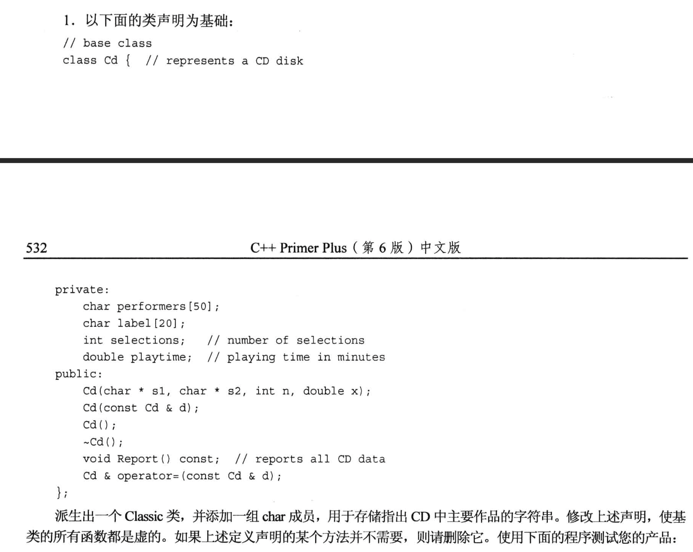
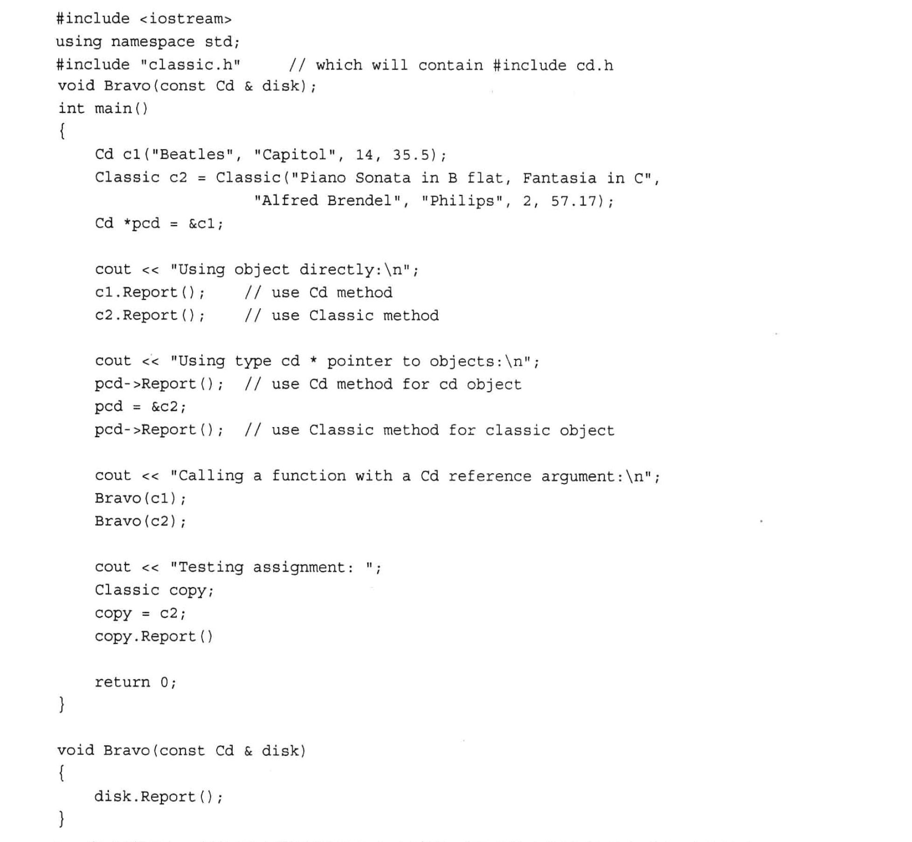
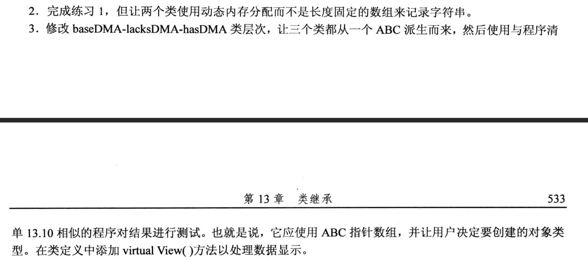
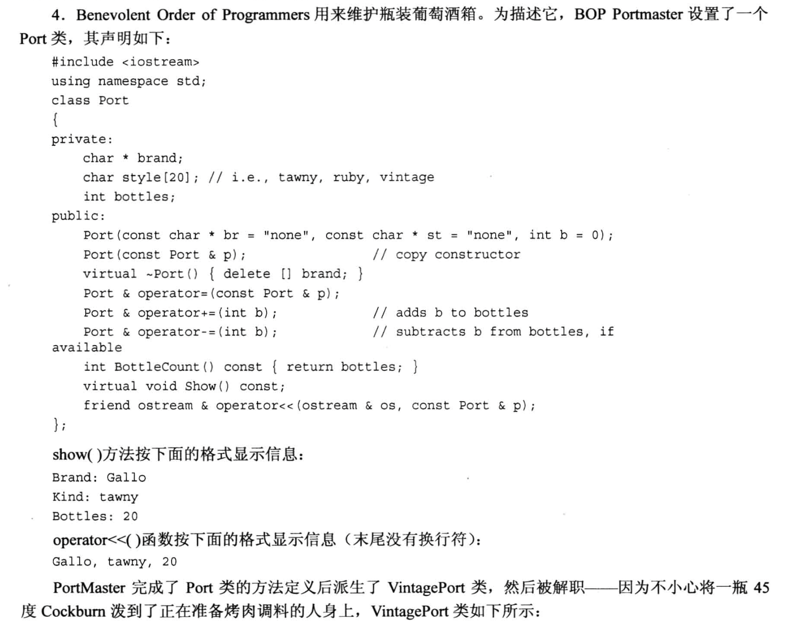
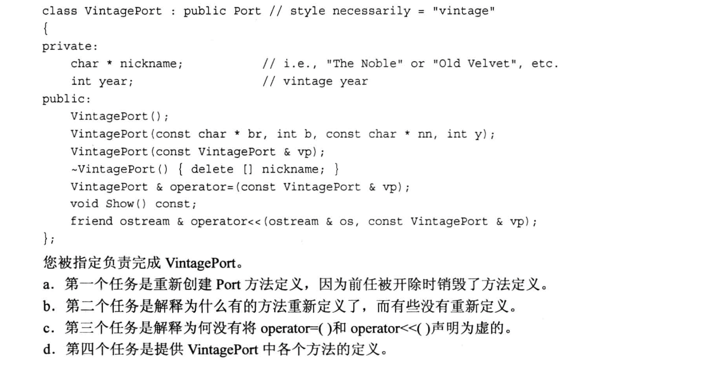

# 题目







# 1.
- `classic.h`

```cpp
#ifndef __CLASSIC_H__
#define __CLASSIC_H__

#include <iostream>
using namespace std;

class Cd
{
    private:
        char performers[50];
        char label[20];
        int selections;
        double playtime;
    public:
        // 构造函数不能是虚函数
        Cd(const char * s1, const char * s2, int n, double x);      // 普通构造
        Cd(const Cd & d);                                           // 拷贝构造
        Cd();                                                       // 默认构造
        virtual ~Cd(){};
        virtual void Report() const;
        Cd & operator=(const Cd &d);                    // 赋值运算符不能是虚函数(它左侧的对象随着类类型的不同而不同, 没必要定义成虚函数)
};

class Classic : public Cd
{
    private:
        char works[50];
    public:
        Classic();
        Classic(const Classic &c);
        Classic(const char *s1, const char *s2, const char *s3, int n, double x);
        ~Classic(){}
        virtual void Report();
        Classic &operator=(const Classic &c);
};

#endif //!__CLASSIC_H__
```

- `classic.cpp`

```cpp
#include "classic.h"
#include <cstring>

Cd::Cd(const char * s1, const char * s2, int n, double x)
{
    strncpy(performers, s1, 50);
    if(strlen(s1) >= 50){
        performers[49] = '\0';
    }
    else{
        performers[strlen(s1)] = '\0';      // 由于strcpy不拷贝'\0', 所以当s1长度不及50时, 需要手动补一个'\0'
    }

    strncpy(label, s2, 20);
    if(strlen(s2) >= 20){
        label[19] = '\0';
    }
    else{
        label[strlen(s2)] = '\0';      // 由于strcpy不拷贝'\0', 所以当s2长度不及20时, 需要手动补一个'\0'
    }

    selections = n;
    playtime = x;
}

Cd::Cd(const Cd &d)
{
    strcpy(performers, d.performers);
    strcpy(label, d.label);
    selections = d.selections;
    playtime = d.playtime;
}

Cd::Cd()
{
    performers[0] = '\0';
    label[0] = '\0';
    selections = 0;
    playtime = 0.0;
}

void Cd::Report() const
{
    cout << "Performers: " << performers << endl;
    cout << "Label: " << label << endl;
    cout << "Selections: " << selections << endl;
    cout << "Playtime: " << playtime << endl;
}

Cd & Cd::operator=(const Cd &d)
{
    if (this == &d){
        return *this;
    }

    strcpy(performers, d.performers);
    strcpy(label, d.label);
    selections = d.selections;
    playtime = d.playtime;

    return *this;
}

Classic::Classic() : Cd()
{
    works[0] = '0';
}

Classic::Classic(const Classic &c) : Cd(c)
{
    strcpy(works, c.works);
}

Classic::Classic(const char *s1, const char *s2, const char *s3, int n, double x) : Cd(s2, s3, n, x)
{
    strncpy(works, s1, 50);
    if(strlen(s1) >= 50){
        works[49] = '\0';
    }
    else{
        works[strlen(s1)] = '\0';      // 由于strcpy不拷贝'\0', 所以当s1长度不及50时, 需要手动补一个'\0'
    }
}

void Classic::Report()
{
    Cd::Report();
    cout << "Works: " << works << endl;
}

Classic & Classic::operator=(const Classic &c)
{
    if(this == &c){
        return *this;
    }

    Cd::operator=(c); // 基类先拷贝一份
    strcpy(works, c.works);

    return *this;
}
```

- `main.cpp`

```cpp
#include <iostream>
#include "classic.h"
using namespace std;

void Bravo(const Cd & disk);

int main(void)
{
    Cd c1("Beatles", "capitol", 14, 35.5);
    Classic c2 = Classic("Piano Sonata in B flat, Fantasia in C", "Alfred Brendel", "Philips", 2, 57.17);

    Cd *pcd = &c1;

    cout << "Using object directly:\n";
    c1.Report();        // 基类
    c2.Report();        // 派生类

    cout << "------------" << endl;

    cout << "Using type cd * pointer to objects:\n";
    pcd->Report();      // 基类
    pcd = &c2;
    pcd->Report();      // 派生类

    cout << "------------" << endl;

    Bravo(c2);          // 派生类

    cout << "------------" << endl;

    cout << "Testing assignment: \n";
    Classic copy;
    copy = c2;          // 验证派生类的赋值运算符
    copy.Report();

    return 0;
} 

void Bravo(const Cd &disk)
{
    disk.Report();
}
```

# 2.

- `classic.h`
```cpp
#ifndef __CLASSIC_H__
#define __CLASSIC_H__

#include <iostream>
using namespace std;

// 基类
class Cd
{
    private:
        char * performers;
        char * label;
        int selections;
        double playtime;
    public:
        // 构造函数不能是虚函数
        Cd(const char * s1, const char * s2, int n, double x);      // 普通构造
        Cd(const Cd & d);                                           // 拷贝构造
        Cd();                                                       // 默认构造
        virtual ~Cd();
        virtual void Report() const;
        Cd & operator=(const Cd &d);                    // 赋值运算符不能是虚函数(它左侧的对象随着类类型的不同而不同, 没必要定义成虚函数)
};

// 派生类
class Classic : public Cd
{
    private:
        char * works;
    public:
        Classic();
        Classic(const Classic &c);
        Classic(const char *s1, const char *s2, const char *s3, int n, double x);
        ~Classic();
        virtual void Report();
        Classic &operator=(const Classic &c);
};

#endif //!__CLASSIC_H__
```

- `classic.cpp`

```cpp
#include "classic.h"
#include <cstring>

// 基类
Cd::Cd(const char * s1, const char * s2, int n, double x)
{
    performers = new char[strlen(s1) + 1];
    strcpy(performers, s1);

    label = new char[strlen(s2) + 1];
    strcpy(label, s1);

    selections = n;
    playtime = x;
}

Cd::Cd(const Cd &d)
{
    performers = new char[strlen(d.performers) +1];
    strcpy(performers, d.performers);

    label = new char[strlen(d.label) +1];
    strcpy(label, d.label);

    selections = d.selections;
    playtime = d.playtime;
}

Cd::Cd()
{
    performers = nullptr;
    label = nullptr;
    selections = 0;
    playtime = 0.0;
}

Cd::~Cd()
{
    delete [] performers;
    delete [] label;
}

void Cd::Report() const
{
    cout << "Performers: " << performers << endl;
    cout << "Label: " << label << endl;
    cout << "Selections: " << selections << endl;
    cout << "Playtime: " << playtime << endl;
}

Cd & Cd::operator=(const Cd &d)
{
    if (this == &d){
        return *this;
    }

    delete [] performers;
    delete [] label;

    performers = new char[strlen(d.performers) +1];
    label = new char[strlen(d.label) +1];

    strcpy(performers, d.performers);
    strcpy(label, d.label);
    selections = d.selections;
    playtime = d.playtime;

    return *this;
}

// 派生类
Classic::Classic() : Cd()
{
    works = nullptr;
}

Classic::Classic(const Classic &c) : Cd(c)
{
    works = new char[strlen(c.works) +1];
    strcpy(works, c.works);
}

Classic::Classic(const char *s1, const char *s2, const char *s3, int n, double x) : Cd(s2, s3, n, x)
{
    works = new char[strlen(s1) +1];
    strcpy(works, s1);
}

Classic::~Classic()
{
    delete [] works;
}

void Classic::Report()
{
    Cd::Report();
    cout << "Works: " << works << endl;
}

// PDF的 518页 有例题
Classic & Classic::operator=(const Classic &c)
{
    // step1:
    if(this == &c){
        return *this;
    }

    // step2: 调用基类的赋值运算符, 完成基类的赋值
    Cd::operator=(c);

    // step3:
    delete [] works;

    // Step4:
    works = new char[strlen(c.works) +1];

    // step5:
    strcpy(works, c.works);

    return *this;
}
```
