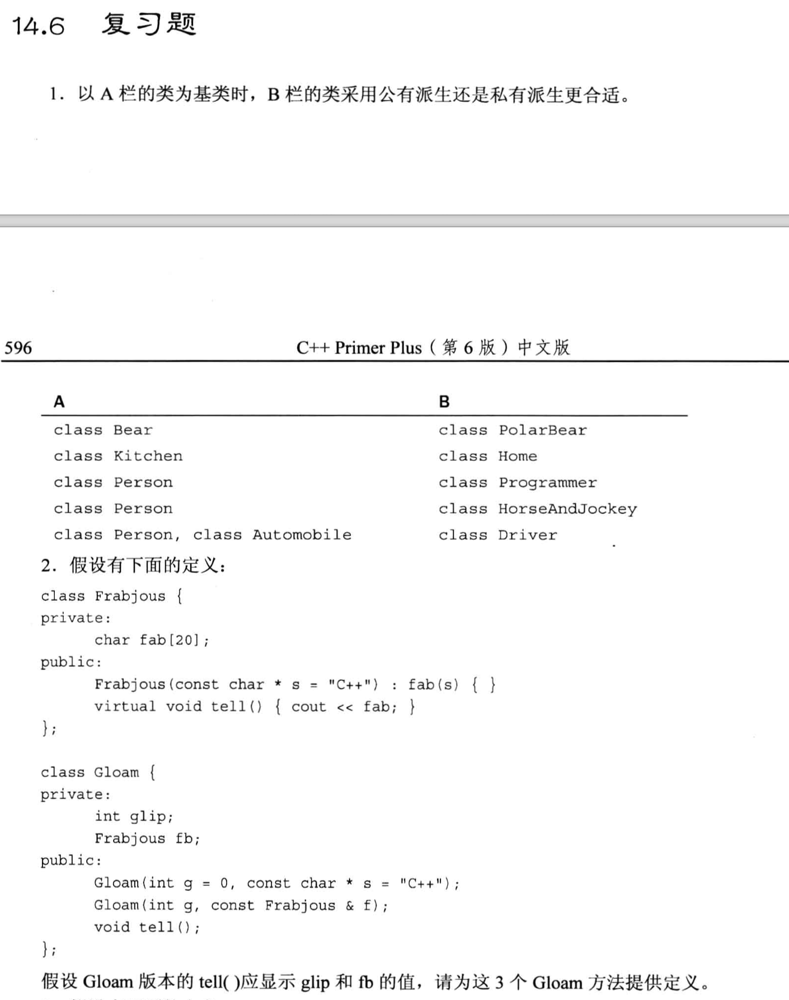
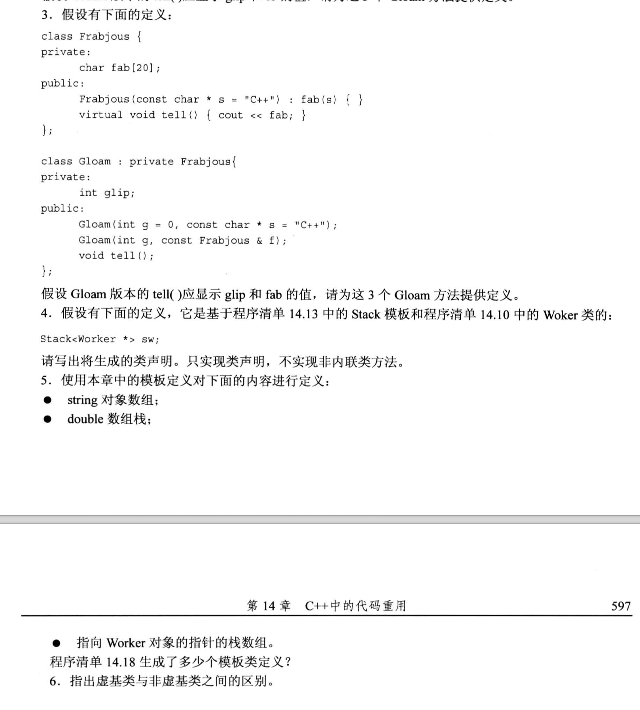

# 题目




# 1.
- 使用`公有派生`的规则是: 基类中的**所有东西都适用**于派生类时, 适合用公有派生.
  - 基类包含了派生类

- 使用`私有派生`的规则是: 派生类**只适合继承一部分**基类的接口, 适合用私有派生.
  - 基类是派生类的特殊情况

```txt
class Bear     公有派生     class PolarBear             (PolarBear继承了Bear的所有东西)
class Kitchen  私有派生     class Home                  (home只继承一部分kitchen的接口)
class person   公有派生     class programmer            (programmer继承了person的所有东西)
class person   私有派生     class HorseAndJockey        (Person这个类的接口 并不完全适用于 马和驯马师这个派生类)
class Person (使用公有派生), class Automobile (使用私有派生)  class  Driver  (Driver继承了Person的所有东西, 但是只继承了Automobile的一部分接口)
```

# 2.
```cpp
#include <cstring>
#include <iostream>

using namespace std;

class Frabjous
{
    private:
        char fab[20];
    public:
        Frabjous(const char *s = "C++")
        {
            strncpy(fab, s, 19);
            fab[19] = '\0';
        }
        virtual void tell() {cout << fab << endl;}

};

class Gloam
{
    private:
        int glip;
        Frabjous fb;
    public:
        Gloam(int g = 0, const char *s = "C++");
        Gloam(int g, const Frabjous &f);
        void tell();
};

Gloam::Gloam(int g, const char *s) : glip(g), fb(s)
{}

Gloam::Gloam(int g, const Frabjous &f): glip(g), fb(f)
{}

void Gloam::tell()
{
    cout << glip << endl;
    fb.tell();
}

int main(void)
{
    Gloam a(123, "Test C++");
    a.tell();
    return 0;
}
```

# 3.
```cpp
#include <cstring>
#include <iostream>

using namespace std;

class Frabjous
{
    private:
        char fab[20];
    public:
        Frabjous(const char *s = "C++")
        {
            strncpy(fab, s, 19);
            fab[19] = '\0';
        }
        virtual void tell() {cout << fab << endl;}
};

class Gloam : private Frabjous
{
    private:
        int glip;
    public:
        Gloam(int g = 0, const char *s = "C++");
        Gloam(int g, const Frabjous &f);
        void tell();
};

// 考察私有继承
Gloam::Gloam(int g, const char *s) : glip(g), Frabjous(s)           // 1. 必须使用成员初始化列表; 2. 使用基类类名来调用私有基类的构造函数, 从而实现成员初始化
{}

Gloam::Gloam(int g, const Frabjous &f): glip(g), Frabjous(f)
{}

void Gloam::tell()
{
    cout << glip << endl;
    Frabjous::tell();           // 用基类类名来调用私有基类的接口
}

int main(void)
{
    Gloam a(123, "Test C++");
    a.tell();
    return 0;
}
```

# 4.
```cpp
 // 把原来的 Type 换成 Worker* 即可
class Stack<Worker *>
{
    private:
        enum {MAX = 10};
        Worker * items[MAX];
        int top;
    public:
        Stack();
        bool isEmpty(){return false;}
        bool isFull(){return false;}
        bool push(const Worker * &item){return false;}
        bool pop(Worker * &item){return false;}
};
```

# 5.
- 考察类模板的使用 (类型参数 和 非类型参数)
```cpp
// 假设已经有类模板 ArrayTP
ArrayTP<string, 10> aa;  // string数组, 每个数组里有10个元素, 每个元素都是string类型

Stack<ArraTP<double, 10>> stack_arr_aa;       
/*
    思考步骤:
    1) 先定义栈, 使用Stack模板类来完成:  Stack<> stack_arr_aa
    2) 再定义栈里面存放什么类型的东西, 这里要存放double类型的数组, 此时数组又可以使用 ArraTP 这个模板, 故写成: 
        Stack<ArraTP<double, 10>> stack_arr_aa;
*/

ArrayTP<Stack<Worker *>, 10> arr_stk_ptr;
/*
    思路:
        题目要求定义"指针的栈数组", 我们一般**倒着**分析, 先确认它是数组, 再确认它是栈(数组里的每一个元素都是栈), 然后再考虑Worker对象指针属性(栈里面存放的都是 Worker 对象的指针). 
        1) 所以第一步写出:
            ArrayTP<, 10> arr_stk_ptr;

        2) 由于数组里的每个元素都是栈, 所以进一步写成:  
            ArrayTP<Stack<>, 10> arr_stk_ptr;

        3) 栈里面是 Worker 对象的指针:
            ArrayTP<Stack<Worker *>, 10> arr_stk_ptr;
*/


// 程序 14.18 一共实例化了以下4个模板类:
ArrayTP<int, 10> 
ArrayTP<double, 10>
ArrayTP<int, 5>
ArrayTP<ArrayTP<int, 5>, 10>        // 二维数组
```

# 6.
虚基类与非虚基类:
- 虚基类: 用在`多重继承`的场景, 虚基类使得在多重继承时**只继承一个基类对象**.
  - 一般用在 多重继承的**基类具有共同祖先** 的场景.
    - 祖先A派生成了B和C, 然后 B和C 一起派生了D, D就需要**虚基类**来解决 祖先基类的副本冲突 的问题.
      - B会提供一个A的副本, C也会提供一个A的副本, 如果不使用虚基类的集成方式, 则D会同时得到两个A的副本, 但是这两个副本都是匿名的, 没有名字, 此时编译器就无法区分它们, 进而触发二义性冲突.

- 非虚基类: 如果是单一继承, 使用非虚基类即可. 
  - 如果是多重继承, 且基类没有共同祖先, 则也可以使用非虚基类.
    - 但如果基类有共同祖先, 此时使用非虚基类会产生祖先基类的副本数据冲突(或者叫二义性).


