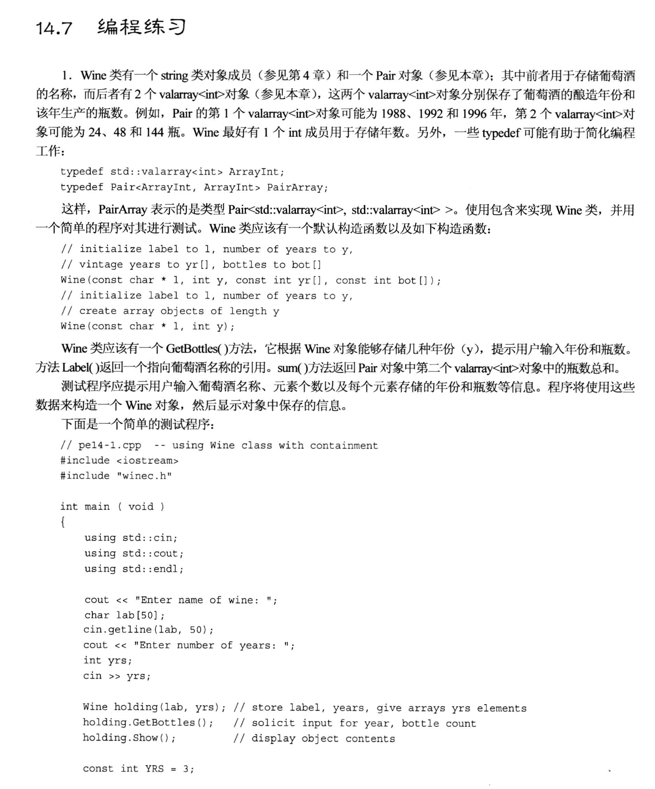
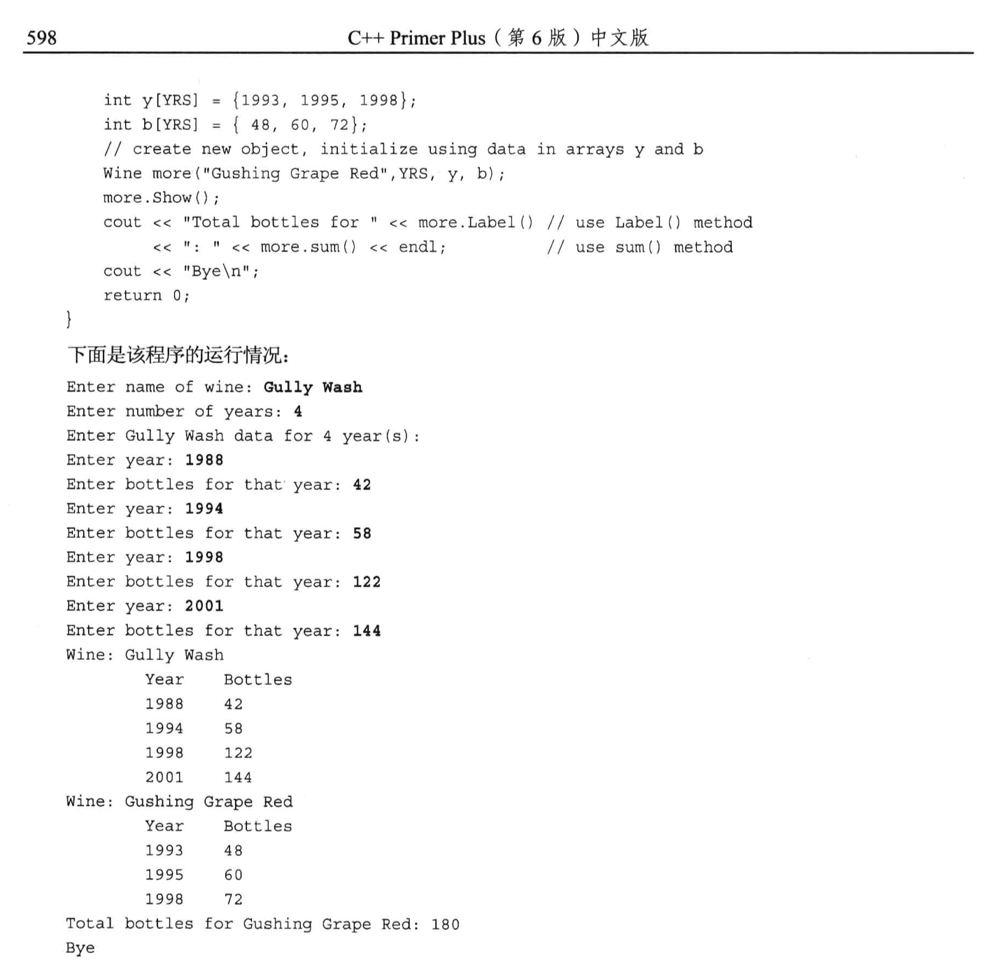
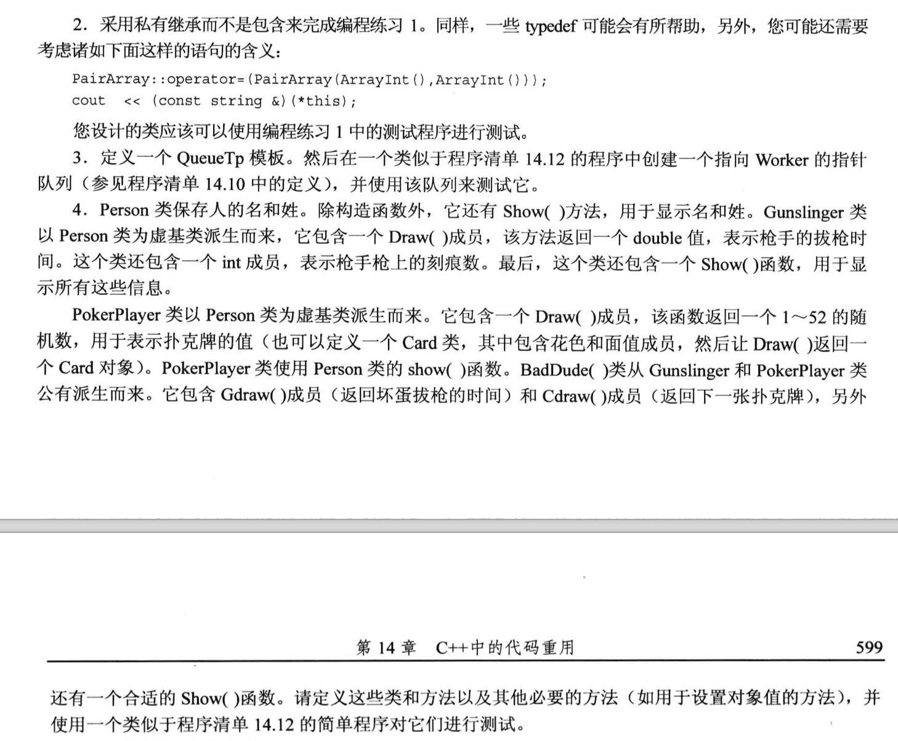
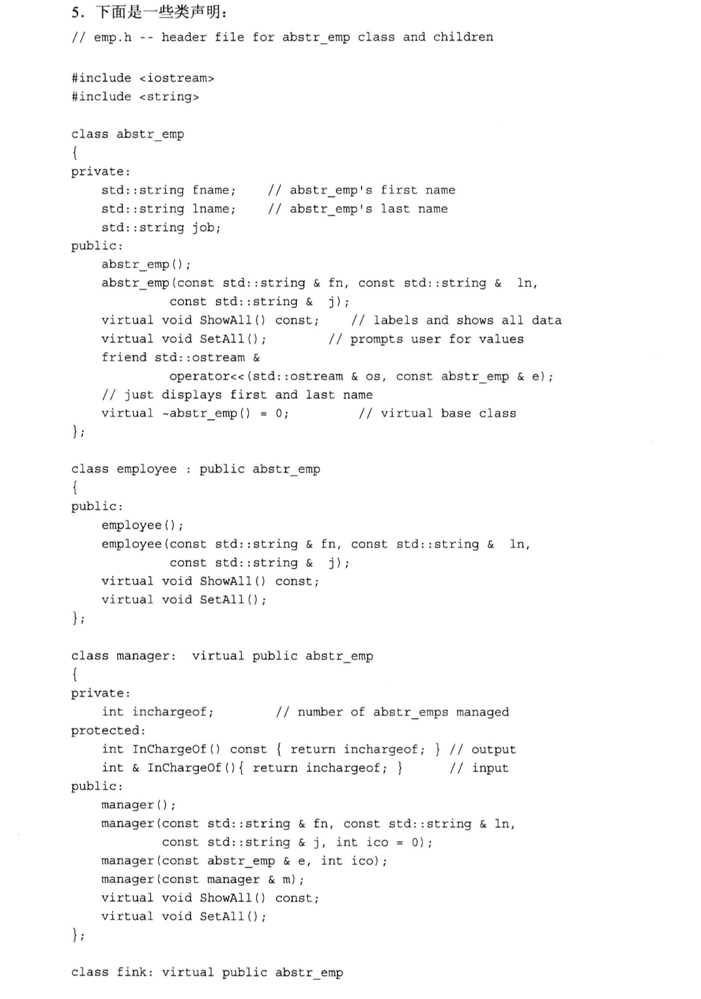
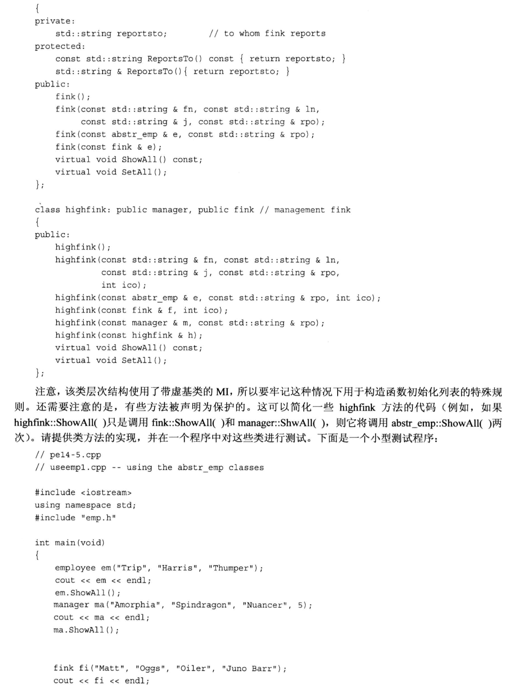
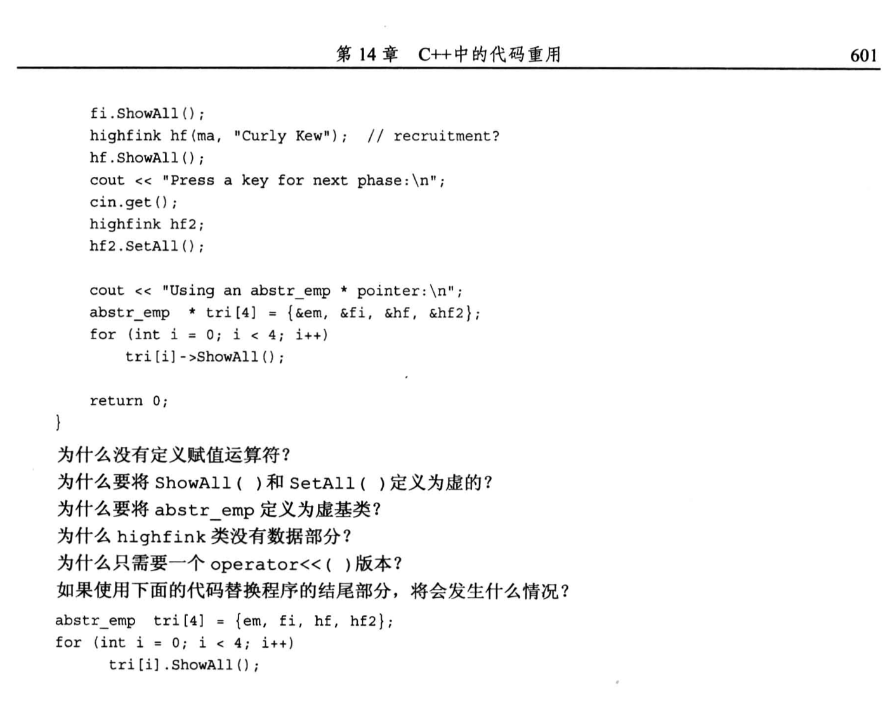
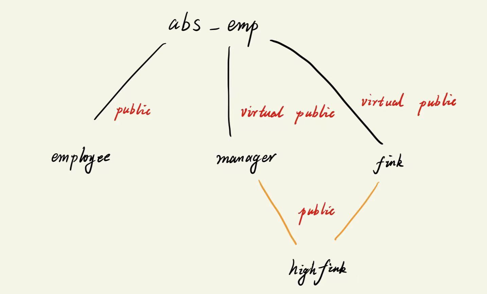

# 题目







# 1.
头文件`winec.h`
```cpp
#ifndef __WINEC_H__
#define __WINEC_H__

#include <iostream>
#include <string>
#include <valarray>

using namespace std;

template <class T1, class T2> class Pair;       // 声明一下, 为了让 typedef 能识别 Pair
typedef valarray<int> ArrInt;
typedef Pair< ArrInt, ArrInt > PairArray;

// Pair模板类
template <class T1, class T2>
class Pair
{
    private:
        T1 a;
        T2 b;
    public:
        Pair(const T1 &aval, const T2 &bval) : a(aval), b(bval){}
        T1 & first();
        T2 & second();
        T1 first() const{return a;}
        T2 second() const{return b;}
};

template <class T1, class T2>
T1 & Pair<T1, T2>::first()
{
    return a;
}

template <class T1, class T2>
T2 & Pair<T1, T2>::second()
{
    return b;
}

// 酒 类
class Wine
{
    private:
        string label;
        // Pair<valarray<int>, valarray<int> > info;   // 第一个数组存放年份, 第二个是酒的数量
        // Pair< ArrInt, ArrInt > info;      
        PairArray info;                                 // 用 typedef 简化名字
        int year;
    public:
        Wine(const char *l, int y, const int yr[], const int bot[]);
        Wine(const char *l, int y);
        void GetBottles();      // 用于录入信息
        const string & Label() const;
        int sum() const;
        void Show() const;
};

#endif //!__WINEC_H__
```

源文件`winec.cpp`
```cpp
#include "winec.h"

/*
    在成员初始化列表中, 我们使用 valarray 的构造函数来完成类型转换:
        valarray<类型> 变量名字(数组名, 数组元素个数)
        valarray<类型> 变量名字(数组元素初始化的默认值, 数组元素个数)

        在代码中, 我们使用了typdef改名, 所以下面的 ArrInt(yr, y) 就是在使用 valarray 的构造函数
*/
Wine::Wine(const char *l, int y, const int yr[], const int bot[]) : label(l), year(y), info(ArrInt(yr, y), ArrInt(bot, y))
{
}

Wine::Wine(const char *l, int y) : label(l), year(y), info(ArrInt(0, 0), ArrInt(0, 0))      // ArrInt(0, 0) 表示数组中所有元素都是初始化为0, 然后数组内部设置为没有元素
{
}

void Wine::GetBottles()
{
    cout << "Enter " << label << " data for " << year << endl;
    for (int i = 0; i < year; i++){
        cout << "Enter year: ";
        cin >> info.first()[i];
        cout << "Enter bottles for that year: ";
        cin >> info.second()[i];
    }
}

const string & Wine::Label() const
{
    return label;
}

int Wine::sum() const
{
    return info.second().sum();     // 使用 valarray<int> 类型提供的sum方法
}

void Wine::Show() const
{
    cout << "Wine: " << label << endl;
    cout << "\t\t" << "Year\t\tBottles" << endl;
    for (int i = 0; i < year; i++){
        cout << "\t\t" << info.first()[i] << "\t\t" << info.second()[i] << endl;
    }
}
```

测试文件`p1.cpp`
```cpp
#include <iostream>
#include "winec.h"

using namespace std;

int main(void)
{
	cout << "Enter name of wine: ";
	char lab[50];
	cin.getline(lab, 50);
	cout << "Enter number of years: ";
	int yrs;
	cin >> yrs;

	Wine holding(lab, yrs);
	holding.GetBottles();
	holding.Show();

	const int YRS = 3;
	int y[YRS] = {1993, 1995, 1998};
	int b[YRS] = {48, 60, 72};

	Wine more("Gushing Grape Red", YRS, y, b);
	more.Show();

	cout << "Total bottles for " << more.Label()
        << ": " << more.sum() << endl;

	cout << "Bye\n";

	return 0;
}
```

# 2.
- 头文件`winec.h`
```cpp
#ifndef __WINEC_H__
#define __WINEC_H__

#include <iostream>
#include <string>
#include <valarray>

using namespace std;

template <class T1, class T2> class Pair;       // 声明一下, 为了让 typedef 能识别 Pair
typedef valarray<int> ArrInt;
typedef Pair< ArrInt, ArrInt > PairArray;

// Pair模板类
template <class T1, class T2>
class Pair
{
    private:
        T1 a;
        T2 b;
    public:
        Pair(const T1 &aval, const T2 &bval) : a(aval), b(bval){}
        T1 & first();
        T2 & second();
        T1 first() const{return a;}
        T2 second() const{return b;}
};

template <class T1, class T2>
T1 & Pair<T1, T2>::first()
{
    return a;
}

template <class T1, class T2>
T2 & Pair<T1, T2>::second()
{
    return b;
}

// 酒 类
class Wine : private string, private PairArray
{
    private:
        // string label;            // 私有继承之后, 将自动获得一个匿名的 string 对象, 因此这里可以不写label了
        // PairArray info;          // 同理, 可以不写info了, 它是一个匿名的 PairArray 对象
        int year;
    public:
        Wine(const char *l, int y, const int yr[], const int bot[]);
        Wine(const char *l, int y);
        void GetBottles();      // 用于录入信息
        const string & Label() const;
        int sum() const;
        void Show() const;
};

#endif //!__WINEC_H__
```

- 源文件`winec.cpp`
```cpp
#include "winec.h"

/*
    在成员初始化列表中, 我们使用 valarray 的构造函数来完成类型转换:
        valarray<类型> 变量名字(数组名, 数组元素个数)
        valarray<类型> 变量名字(数组元素初始化的默认值, 数组元素个数)

        在代码中, 我们使用了私有继承, 所以这里就需要使用类名(而不是成员名)来获得基类的对象
*/
Wine::Wine(const char *l, int y, const int yr[], const int bot[]) : string(l), year(y), PairArray(ArrInt(yr, y), ArrInt(bot, y))
{
}

Wine::Wine(const char *l, int y) : string(l), year(y), PairArray(ArrInt(0, y), ArrInt(0, y))      // ArrInt(0, 0) 表示数组中所有元素都是初始化为0, 然后数组内部设置为没有元素
{
}

void Wine::GetBottles()
{
    cout << "Enter " << (const string &)*this << " data for " << year << endl;      // 用(const string &)*this 替代了 label, 通过强制类型转换可以获得基类的匿名对象
    for (int i = 0; i < year; i++){
        cout << "Enter year: ";
        cin >> PairArray::first()[i];       // 通过类名 + 作用域解析运算符 来调用基类的方法
        cout << "Enter bottles for that year: ";
        cin >> PairArray::second()[i];
    }
}

const string & Wine::Label() const
{
    return (const string &)*this;
}

int Wine::sum() const
{
    return PairArray::second().sum();     // // 通过类名 + 作用域解析运算符 来调用基类的方法, 并且使用 valarray<int> 类型提供的sum方法
}

void Wine::Show() const
{
    cout << "Wine: " << (const string &) *this << endl;         // 用(const string &)*this 替代了 label, 通过强制类型转换可以获得基类的匿名对象
    cout << "\t\t" << "Year\t\tBottles" << endl;
    for (int i = 0; i < year; i++){
        cout << "\t\t" << PairArray::first()[i] << "\t\t" << PairArray::second()[i] << endl;  // 通过类名 + 作用域解析运算符 来调用基类的方法
    }
}
```

- 测试文件`p2.cpp`
```cpp
#include <iostream>
#include "winec.h"

using namespace std;

int main(void)
{
	cout << "Enter name of wine: ";
	char lab[50];
	cin.getline(lab, 50);
	cout << "Enter number of years: ";
	int yrs;
	cin >> yrs;

	Wine holding(lab, yrs);
	holding.GetBottles();
	holding.Show();

	const int YRS = 3;
	int y[YRS] = {1993, 1995, 1998};
	int b[YRS] = {48, 60, 72};

	Wine more("Gushing Grape Red", YRS, y, b);
	more.Show();

	cout << "Total bottles for " << more.Label()
        << ": " << more.sum() << endl;

	cout << "Bye\n";

	return 0;
}
```


# 3.
任务: 
1. 创建队列模板类
2. 队列里面存放**Worker类的对象的指针**

- 头文件`queue.h`
```cpp
#ifndef __QUEUE_H__
#define __QUEUE_H__

#include <iostream>
#include <string>

using namespace std;

class Worker
{
    private:
        string fullname;
        long id;
    public:
        Worker() : fullname("none one"), id(0){}
        Worker(const string &s, long n) : fullname(s), id(n){}
        ~Worker(){}
        void Set();
        void Show() const;
};

template <typename T>
class Queue
{
    private:
        enum{Q_SIZE = 10};      // 通过枚举来定义常量, 此时枚举类型是匿名的
        struct Node{T item; Node *next;};  // 注意next指针是一个结构体指针
        Node *front;      // 头结点
        Node *rear;       // 尾结点
        int items;        // 记录队列中有多少个节点
        const int qsize;        // 队列最大长度(不希望被修改)

    public:
        Queue(int qs = Q_SIZE);
        ~Queue();
        bool isEmpty() const;
        bool isFull() const;
        int queueCount() const;
        bool enqueue(const T &item); // 入队列
        bool dequere(T &item);       // 出队列, 出队列的节点要赋值给 item, 所以不加const

};

template<class T>
Queue<T>::Queue(int qs) : qsize(qs)        // 这是 "成员初始化列表" 的赋值方式, 专门用于 const 变量在构造过程中进行初始化
{
    front = rear = nullptr; // 头,尾结点指针
    items = 0;      // 记录节点个数
}

// 当队列使用完之后, 如果仍有元素没有出队, 则需要靠析构函数进行内存释放
template<class T>
Queue<T>::~Queue()
{
    while(front != nullptr){
        Node * temp = front;     // 1. 取出即将释放的节点
        front = front->next;     // 2. 移动链表头到下一个位置, 防止丢失链表
        delete temp;             // 3. 释放节点
    }
}

template<class T>
bool Queue<T>::isEmpty() const
{
    return items == 0;
}

template<class T>
bool Queue<T>::isFull() const
{
    return items == qsize; 
}

template<class T>
int Queue<T>::queueCount() const
{
    return items;
}

// 入队操作是在链表尾部增加节点
template<class T>
bool Queue<T>::enqueue(const T &item)
{
    // 入队需要先判断是否为满
    if(isFull())
    {
        return false;
    }

    // 队列没有满的前提下才新增节点
    Node *add = new Node;   // 动态开辟新节点
    add->item = item;       // 新节点的数据赋值
    add->next = nullptr;    // 新增节点后面应该为空
    items++;

    if(front == nullptr){
        front = add;    // 如果一开始链表为空, 则直接把头结点设置为当前新增的节点
    }
    else{                   // 原链表本身不为空链表时, 只需要更新尾结点
        rear->next = add;   // 注意: 把原来链表的尾结点的next指向当前新增的节点, 没进行这个操作之前, rear的next节点是 nullptr
    }
    rear = add;             // 这个操作才是把原来的尾结点移动到新增节点上

    return true;
}

template<class T>
bool Queue<T>::dequere(T &item)
{
    if(isEmpty())
        return false;
    
    item = front->item;  // 队列是"先入先出", 故取头节点 (此处执行了一次拷贝)

    // 开始删节点, 更新头结点
    items--;             // 1. 更新链表数量
    Node *temp = front;  // 2. 保留原来的头结点, 用于释放内存
    front = front->next; // 3. 把当前的头结点移动到下一个位置
    delete temp;         // 4. 删除原来不要的节点

    // 更新尾结点
    if (items == 0){
        rear = nullptr;
    }

    return true;
}

#endif //!__QUEUE_H__
```

- 源文件`worker.cpp`
```cpp
#include "queue.h"

void Worker::Set()
{
    cout << "Enter worker's full name: " ;
    getline(cin, fullname);
    cout << "Enter worker's ID: ";
    cin >> id;
    while(cin.get()!= '\n');        // 但凡字符串和数字交替输入, 就要写这个语句, 清掉缓冲区的回车
}

void Worker::Show() const
{
    cout << "Name: " << fullname << endl;
    cout << "Employee ID: " << id << endl;
}
```

- 测试文件`p3.cpp`
```cpp
#include <iostream>

#include "queue.h"

using namespace std;

int main(void)
{
    Queue<Worker *> wk(3);         // 队列里存放的是 Worker 类对象的指针

    Worker w1;
    w1.Set();
    w1.Show();
    wk.enqueue(&w1);                // 把Worker类对象的地址入队列

    cout << "Now Queue has: " << wk.queueCount() << " items" << endl;   // 显式当前队列中有多少元素

    Worker w2;
    w1.Set();
    w1.Show();
    wk.enqueue(&w2);                // 把Worker类对象的地址入队列
    cout << "Now Queue has: " << wk.queueCount() << " items" << endl;   // 显式当前队列中有多少元素

    Worker w3;
    w1.Set();
    w1.Show();
    wk.enqueue(&w3);                // 把Worker类对象的地址入队列
    cout << "Now Queue has: " << wk.queueCount() << " items" << endl;   // 显式当前队列中有多少元素

    return 0;
}
```

# 4.
考察虚基类, 多重继承. (中文版书中 Page 556)
参考 Singer 类的继承关系图, 以及 Singer 类的定义, 以及 Singer 类的派生类 SingerWaiter 的定义, 以及 SingerWaiter 类的派生类 SingerWaiterPlus 的定义. (示例代码的worker, worker1文件夹)

# 5.
考察纯虚函数, 抽象类, 多重继承(虚基类). (中文版书中 Page 509)
- 有纯虚函数的类一定是抽象类. 它仅仅是一个框架, 不能用于创建对象, 它只能做`基类`.
  - `virtual 函数名() = 0;` 等于0这个写法标志这这个成员函数是一个纯虚函数. 

## 代码实现部分


- 头文件`emp.h`
```cpp
#ifndef __EMP_H__
#define __EMP_H__

#include <iostream>
#include <string>

using namespace std;

class abstr_emp
{
	private:
        string fname;
        string lname;
        string job;
    public: 
        abstr_emp();
        abstr_emp(const string &fn, const string &ln, const string &j);
        virtual void ShowAll() const;
        virtual void SetAll();
        friend ostream &operator<<(std::ostream &os, const abstr_emp &e);
        virtual ~abstr_emp() = 0;   		
};

class employee : public abstr_emp
{
	public:
        employee();
        employee(const string &fn, const string &ln, const string &j);
        virtual void ShowAll() const;
        virtual void SetAll();
};

class manager : virtual public abstr_emp
{
	private:
        int inchargeof;
	protected:
        int InChargeOf() const{return inchargeof;}
        int &InChargeOf(){return inchargeof;}
	public:
        manager();
        manager(const string &fn, const string &ln, const string &j, int ico = 0);
        manager(const abstr_emp &e, int ico);
        manager(const manager &m);
        virtual void ShowAll() const;
        virtual void SetAll();
};

class fink : virtual public abstr_emp
{
	private:
        string reportsto;
	protected:
        const string ReportsTo() const{return reportsto;}
        string &ReportsTo(){return reportsto;}
	public:
        fink();
        fink(const string &fn, const string &ln, const string &j, const string &rpo);
        fink(const abstr_emp &e, const string &rpo);
        fink(const fink &e);
        virtual void ShowAll() const;
        virtual void SetAll();
};

class highfink : public manager, public fink 
{
	public:
        highfink();
        highfink(const string &fn, const string &ln, const string &j, const string &rpo, int ico);
        highfink(const abstr_emp &e, const string &rpo, int ico);
        highfink(const fink &f, int ico);
        highfink(manager &m, const string &rpo);
        highfink(const highfink &h);
        virtual void ShowAll() const;
        virtual void SetAll();
};

#endif
```

- 源文件`emp.cpp`
```cpp
#include "emp.h"

abstr_emp::abstr_emp() : fname("none"), lname("none"), job("none")
{
}

abstr_emp::abstr_emp(const string &fn, const string &ln, const string &j) : fname(fn), lname(ln), job(j)
{
}

abstr_emp::~abstr_emp()
{
}

void abstr_emp::ShowAll() const 
{
	cout << "fname: " << fname << endl;
    cout << "lname: " << lname << endl;
    cout << "job: " << job << endl;
}

void abstr_emp::SetAll() 
{
    cout << "Enter the first name: ";
	getline(cin, fname);
	cout << "Enter the last name: ";
    getline(cin, lname);
	cout << "Enter the job: ";
	getline(cin, job);
}

ostream  &operator<<(ostream &os, const abstr_emp &e) 
{
    os << "fname: " << e.fname << endl;
    os << "lname: " << e.lname << endl;
    os << "job: " << e.job << endl;
    return os;
}

employee::employee() : abstr_emp()
{
}

employee::employee(const string &fn, const string &ln, const string &j) : abstr_emp(fn, ln, j) 
{
}

void employee::ShowAll() const 
{
	abstr_emp::ShowAll();
}

void employee::SetAll() 
{
    abstr_emp::SetAll();
}

manager::manager() : abstr_emp(), inchargeof(0)
{
}

manager::manager(const string &fn, const string &ln, const string &j, int ico) : abstr_emp(fn, ln, j), inchargeof(ico)
{
}

manager::manager(const abstr_emp &e, int ico) : abstr_emp(e), inchargeof(ico) 
{
}

manager::manager(const manager &m) : abstr_emp(m)
{
    inchargeof = m.inchargeof;
}

void manager::ShowAll() const 
{
    abstr_emp::ShowAll();
    cout << "ico: " << inchargeof << endl;
}

void manager::SetAll() 
{
    abstr_emp::SetAll();
    cout << "ico: "; cin >> inchargeof;
}

fink::fink() : abstr_emp(), reportsto("none")
{
}

fink::fink(const string &fn, const string &ln, const string &j, const string &rpo) : abstr_emp(fn, ln, j), reportsto(rpo)
{
}

fink::fink(const abstr_emp &e, const string &rpo) : abstr_emp(e), reportsto(rpo)
{
}

fink::fink(const fink &e) : abstr_emp(e)
{
	reportsto = e.reportsto;
}

void fink::ShowAll() const 
{
    abstr_emp::ShowAll();
    cout << "reportsto: " << reportsto << endl;
}

void fink::SetAll() 
{
    abstr_emp::SetAll();
    cout << "reportsto: "; cin >> reportsto;
}

highfink::highfink() : abstr_emp(), manager(), fink()
{
}

highfink::highfink(const string &fn, const string &ln, const string &j, const string &rpo, int ico) : abstr_emp(fn, ln, j), manager(fn, ln, j, ico), fink(fn, ln, j, rpo)
{
}

highfink::highfink(const abstr_emp &e, const string &rpo, int ico) : abstr_emp(e), manager(e, ico), fink(e, rpo)
{
}

highfink::highfink(const fink &f, int ico) : abstr_emp(f), manager(f, ico), fink(f)
{
}

highfink::highfink(manager &m, const string &rpo) : abstr_emp(m), manager(m), fink(m, rpo)
{
}

highfink::highfink(const highfink &h) : abstr_emp(h), manager(h), fink(h)
{
}

void highfink::ShowAll() const 
{
    fink::ShowAll();
    manager::ShowAll();
}

void highfink::SetAll() 
{
    manager::SetAll();
    fink::SetAll();
}
```

- 测试文件`p5.cpp`
```cpp
#include <iostream>
#include "emp.h"

using namespace std;

int main(void) 
{
    employee em("Trip", "Harris", "Thumper");
    cout << em << endl;
    em.ShowAll();
    manager ma("Amorphia", "Spindragon", "Nuancer", 5);
    cout << ma << endl;

    fink fi("Matt", "Oggs", "Oiler", "Junobarr");
    cout << fi << endl;
    fi.ShowAll();
    highfink hf(ma, "Curly Kew");
    hf.ShowAll();

    cout << "Press a key for next phase:" << endl;
    cin.get();	
    highfink hf2;
    hf2.SetAll();

    cout << "Using an abstr_emp * pointer: " << endl;
    abstr_emp * tri[4] = {&em, &fi, &hf, &hf2};
    for (int i = 0; i < 4; i++)
        tri[i] -> ShowAll();
    return 0;
}
```

## 额外问题部分
- 为什么没有定义赋值运算符
  - 编译器会提供默认的赋值运算符的重载函数, 也可以自己定义.
  - 第十二章(12.5)中的例子讲过, 当需要**使用动态内存分配(new运算符和delete)成员变量的内存空间**时, 就一定要重载赋值运算符. 如果没有使用new和delete, 则可以使用默认的赋值运算符.
  - 在这里, 类的成员是 string类型, 它内部已经重载过赋值运算符, 我们直接使用就可以, 因此不需要自己定义.


- 为什么要将ShowAll() 和 SetAll() 定义为虚的
  - 定义虚函数的原因是让派生类自行更改这两个函数的实现, 以适应派生类的特点. 
    - 当使用抽象基类指针来调用这两个函数式, 如果以虚函数的形式来定义, 则编译器会**根据指针所指向的对象的类型**调用相应的派生类的成员函数.
    - 如果不定义成虚函数, 此时编译器**只会根据指针的类型来调用成员函数**(在代码中只会调用 abstr_emp 的 ShowAll 和 SetAll), 这样就无法实现我们预期的效果.


- 为什么要将 abstr_emp 定义为虚基类
    
  - 如果不定义成虚基类, 此时派生类 highfink 中就会存在多个 abs_emp 的副本(manager 提供一份, fink 也提供一份), 既占用空间, 也容易出现二义性冲突. 而定义成虚基类时, highfink 就只会拥有一份 abs_emp 的副本, 既不会占用空间, 也不会出现二义性冲突.


- 为什么 highfink 类没有数据部分
  - highfink 已经继承了manager 和 fink 的数据部分(已经够用了), 因此不需要再定义数据部分了.


- 为什么只需要一个 operator<<() 版本
  - 在 abs_emp 中, 将 `operator<<()` 定义为**友元函数**, 要注意友元函数并**不是成员函数**, 而且友元函数**不会被继承**. 同时, 在派生类中使用的是 ShowAll 的方式进行输出, 没必要再重载输出运算符, 所以只需要在 abs_emp 中定义一个 `operator<<()` 版本就可以了.


- 如果使用下面的代码替换程序的结尾部分, 将会发生什么情况?
    ```cpp
    abstr_emp tri[4] = {em, fi, hf, hf2};       // 编译报错, 抽象基类是不能创建对象的
    for (int i = 0; i < 4; i++){
        tri[i].ShowAll();
    }
    ```
    - 直接编译就报错了, 因为 abstr_emp 是抽象基类, 不能创建对象.
