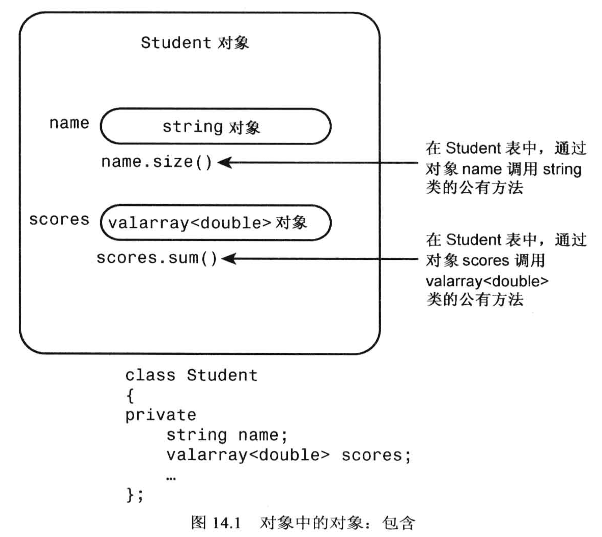
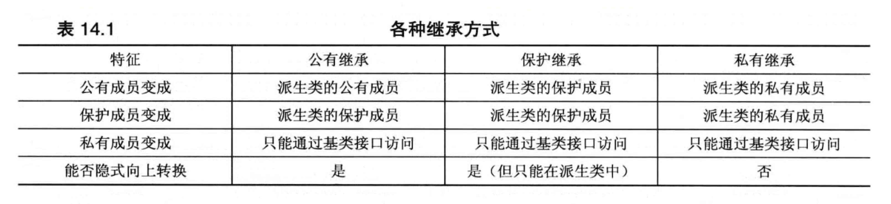
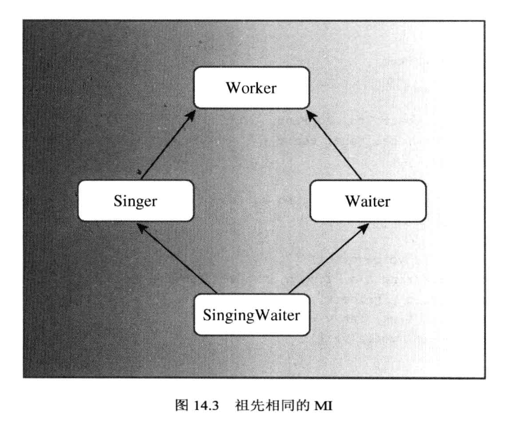
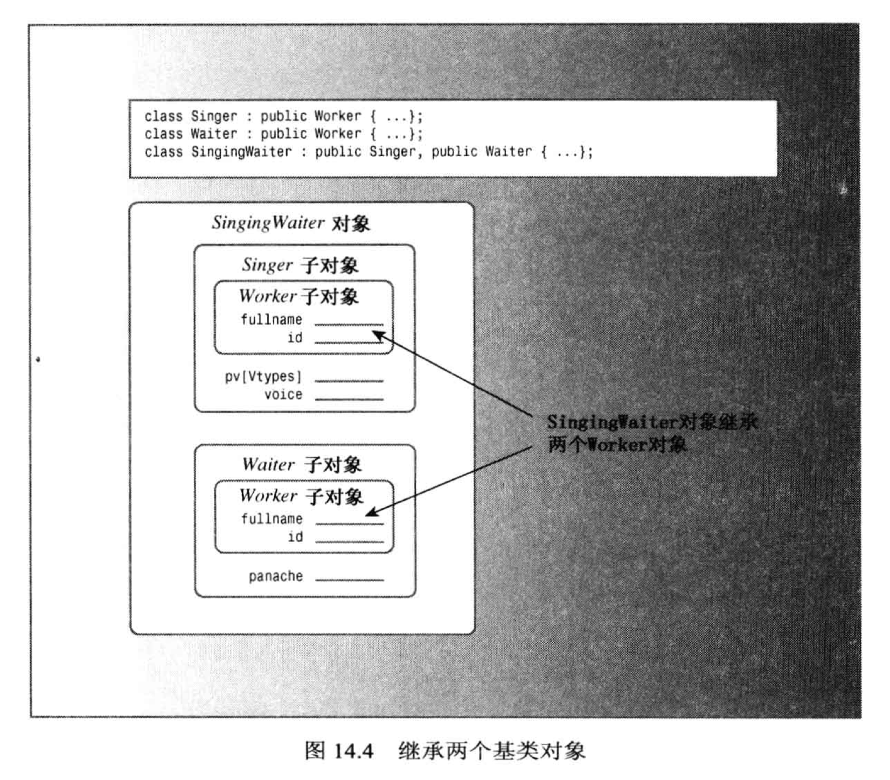
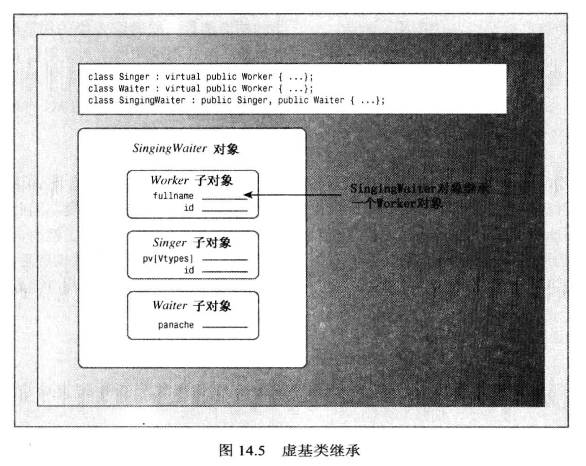
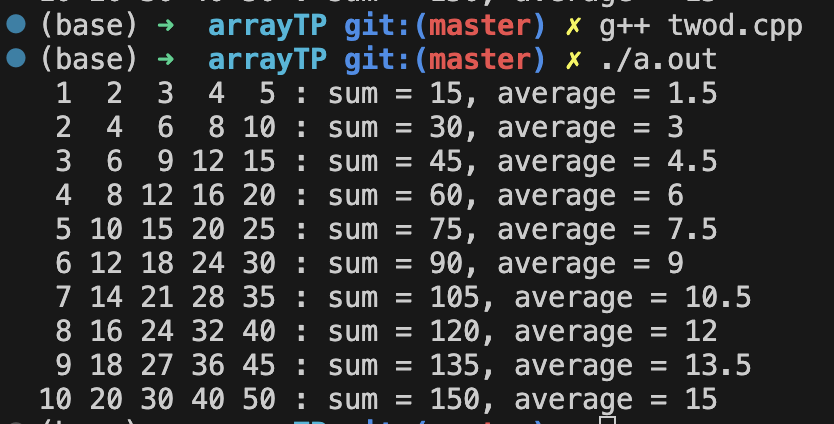
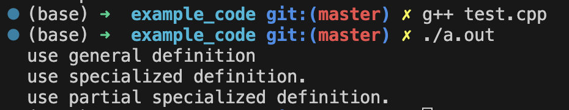
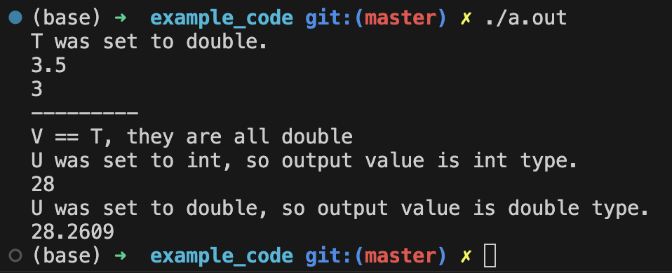

# C++ 代码重用

## 包含对象成员的类
设计类时, 类的数据成员是`其他类的对象`.
### valarraly 模板类
可以把它理解为一个数组模板. 使用时需要包含头文件`valarray`, 即:
```
#include <valarray>
```

- 可以创建长度为零的空数组
  - `valarray<int> a;`
- 也可以创建指定长度的数组
  - `valaaray<int> v1 = {20, 30, 40, 50};`, 使用**初始化列表**的方式创建数组
  - `valarray<int> a(10);`, 创建一个数组, 一共有10个元素, 但是元素都没有初始化
  - `valarray<int> a(10, 8);`, 创建一个数组, 一共有8个元素, 每个元素的数值都是10
- 创建数组时, 还可以把**常规数组**作为参数, 用来初始化新数组
  ```cpp
    double gpa = {3.1, 3.5, 3.8, 2.9, 3.3};
    valarray<double> v1(gpa, 4);
    /*
        v1 数组只能容纳4个元素, 此时会将 gpa 数组的前四个元素复制到 v1 数组中
    */
  ```

### has-a 关系
如果一个类包含另一个类的对象, 就称为**has-a**关系. 例如:
```cpp
#include <string>
#include <valarray>

using namespace std;

class Student
{
    private:
        string name;                // 包含了string类型的对象, 此时 类型Student 和 string 之间是 has-a 关系.
        valarray<double> scores;    // 此时 类型Student 和 valarray 之间是 has-a 关系.
};
```
- has-a 关系有个特性, 这个student类包含了 string类 和 valarray类 的成员对象的实现, 但**没有继承这两个类的接口**. 
  - 此时, Student里面的 name 和 scores 这两个对象可以分别调用它们本身所属的类的方法.
  - 这说明 Student 类里面**间接地**获得了 string类 和 valarray类 的方法的使用权限, 虽然使用时需要用 name 和 scores 这两个对象.
    


代码例子:
- `studentc.h`
```cpp
#ifndef __STUDENTC_H__
#define __STUDENTC_H__

#include <iostream>
#include <string>
#include <valarray>

using namespace std;

class Student
{
    private:
        typedef valarray<double> ArrayDb;       // 使用别名, 方便简写, 此时只能在类内部使用这个别名
        string name;
        ArrayDb scores;         // 等价于 valarray<double> scores;
    public:
        Student() : name("Null Student"), scores(){}

        // 转换函数(同时也是构造函数): string类型 转换为 Student类型
        explicit Student(const string &s) : name(s), scores(){}      // 注意是显式转换(此时不允许隐式转换), 加了关键字 explicit
        explicit Student(int n) : name("Nully"), scores(n){}         // 这里也是不允许隐式转换
        
        Student(const string &s, int n) : name(s), scores(n){}
        Student(const string &s, const ArrayDb &a ) : name(s), scores(a){}      // score 部分对应的是 valarray(valarray对象) 的使用方式
        Student(const string &s, const double *pd, int n) : name(s), scores(pd, n){}  // score 部分对应的是 valarray(double数组, 数组长度) 的使用方式

        ~Student(){}

        double Average() const;
        const string & Name() const;
        double & operator[](int n);   // 注意返回的是引用类型, 返回的是"左值"(可写/修改), 此时才可以写成 stu[0] = 100, 此时的 stu[0] 是可读可写的
        double operator[](int n) const;  // 如果把返回值写"非引用"的形式, 那么调用[]运算符得到的对象是"右值", 它是"只读"的, 合法的使用只能是 a = stu[0], 因为 stu[0] 是右值(只读, 不可修改)

        friend istream & operator>>(istream &is, Student &stu); // 用于捕获输入时中间有空格的情况
        friend istream & getline(istream &is, Student &stu);    // 重载捕获一整行的输入情况
        friend ostream & operator<<(ostream &os, const Student &stu);
};

#endif //!__STUDENTC_H__
```

- `studentc.cpp`
```cpp
#include "studentc.h"

double Student::Average() const
{
    if (scores.size() > 0){
        return scores.sum() / scores.size();
    }
    else{
        return 0.0;
    }
}

const string &Student::Name() const
{
    return name;
}

// 这个函数返回的是可操作的左值
double & Student::operator[](int n)     // 注意返回的是引用
{
    return scores[n];
}

// 这个函数返回的是"不可写"的右值
double Student::operator[](int n) const // 按值返回, 不是引用
{
    return scores[n];
}

istream & operator>>(istream &is, Student &stu)
{
    is >> stu.name;
    return is;
}

istream & getline(istream &is, Student &stu)        // 重载了getline函数
{
    getline(is, stu.name);          // 这里调用的是原生的 getline 函数, 对应的函数声明是 getline(istream &, string &)
    return is;
}

ostream & operator<<(ostream &os, const Student &stu)
{
    os << "Scores for " << stu.name << ": " << endl;

    int limit = stu.scores.size();  // 获取科目的数量
    if (limit > 0)
    {
        int i = 0;
        for (i = 0; i < limit; i++){
            os << stu.scores[i] << " ";

            // 每显示5门成绩就换行
            if (i % 5 == 4){        // 因为索引从0开始, 所以当余数为4时, 说明当前刚好显示了5门成绩
                os << endl;
            }
        }

        // 如果课程数量不是5的整数倍, 则需要额外换行一次
        if (i % 5 != 0){
            os << endl;
        }
    }
    else{
        os << "Empty array!" << endl;
    }
    return os;
}
```

- `useStudentc.cpp`
```cpp
#include <iostream>
#include "studentc.h"

using namespace std;

const int pupils = 3;
const int quizzes =5;

void set(Student &sa, int n);

int main(void)
{
    Student ada[pupils] = {Student(quizzes), Student(quizzes), Student(quizzes)};
    int i = 0;;

    // 录入信息
    for (i = 0; i < pupils; i++){
        set(ada[i], quizzes);       // 这里的 ada[i] 访问的是 "不同的Student对象"
    }
    cout << " -------- " << endl;

    // 输出
    cout << "Student List: " << endl;
    for (i = 0; i < pupils; i++){
        cout << ada[i].Name() << endl;
    }
    cout << " -------- " << endl;

    cout << "Result List: " << endl;
    for (i = 0; i < pupils; i++){
        cout << ada[i];             // 使用友元函数 operator<<()
        cout << "Average: " << ada[i].Average() << endl;
    }

    return 0;
}

void set(Student &sa, int n)
{
    cout << "Please enter the student's name: " << endl;
    getline(cin, sa);
    cout << "Please enter " << n << " quizzes scores: " << endl;
    for (int i = 0; i < n; i++){
        cin >> sa[i];           // 这里的 sa[i] 访问的是 Student对象里的[]重载运算符, 填充的是对象里面的 scores 数组
    }

    // 每当输入数字之后, 缓冲区都会存在一个多余的回车, 记得干掉.
    while(cin.get() != '\n');
}
```

## 私有继承
回顾公有继承:
- 基类的所有 public 方法都自动变成派生类的 public 方法
- 基类的 public 成员自动变成派生类的 public 成员 (虽然这种case非常少见, 数据基本都是private)

对于`私有继承`来说:
在声明派生类时, 如果使用关键词`private`来继承基类, 此时就是私有继承.
- 此时的基类称为`私有基类`, 派生类称为`私有派生类`

私有继承的特点:
- 基类的所有 **public** 方法都会变成 派生类的 **private** 方法.
  - 基类中本来属于 private 的部分仍旧只能使用**基类的public接口进行访问**, 派生类依然不能直接访问它们.
- 基类中的**public 成员**和**protected 成员** 会变成派生类的 **private成员**
  - 此时**派生类的成员函数可以访问它们**, 但是在派生类之外不能访问, 即使是派生类的对象也不能直接访问(这与前面讲过的类的基本知识一致)
    - 注意: **友元函数不属于类的成员函数**, 因此友元函数并不属于派生类的**内部**, 故`友元函数不能直接使用私有基类的方法`!! 但可以想办法通过`强制类型转换`的方式将派生类转成基类, 然后间接地进行访问.
- 私有派生类将**继承私有基类的实现**.
  - 比如说: Student 是 string 的 私有派生类 (这时候string就是私有基类了), 此时, Student将包含一个**string的对象**(也被称为string的实现/string类组件), 也就是说, 在Student类里面起码会自带一个string对象可以存储数据, 只不过这个对象是`无名对象`, 这种对象需要通过基类的方法才能访问.
    - 这个无名对象也可以理解为像 this指针 那样的隐式对象成员.


代码例子 -- 用私有继承的方式重写前面的 Student类:
- 区别有:
  - 使用了多重继承(multiple inheritance, MI), 同时继承了 string 和 valarray<double> 类, 而且是私有继承
  - 由于是私有继承, Student会分别从 string 和 valarray<double> 中各继承到一个`无名对象`, 因此 Student类中不再包含数据成员 name 和 scores
    - 由于没有存储数据的成员名字, 所以在构造函数中初始化继承过来的无名对象时, 需要直接使用 **基类的构造函数** 来完成无名对象的初始化.
    - 在调用string 和 valarray<double> 里面的公有方法时, 由于没有了对象的名字, 这里直接使用`类名::方法名()`就相当于是通过对象来调用了相应的方法.
    - string, valarray 和 Student 之间是继承关系, 因此为了获得继承而来的隐式对象, 我们可以通过`强制类型转换的方式`来完成.
      - 将当前对象转换为基类对象: `(string &)*this;`, `(valarray<double> &)*this;`
      - 将Student类的对象转换为基类对象: `(string &)stu;`, `(valarray<double> &)stu;`
  - 新增函数 `arr_out`, 因为友元函数无法访问私有基类的方法, 所以把这部分代码搬到私有派生类的 arr_out 函数中, 此时友元函数借助派生类的函数去间接访问私有基类的方法即可.


- 修改后的`studentc.h`
```cpp
#ifndef __STUDENTC_H__
#define __STUDENTC_H__

#include <iostream>
#include <string>
#include <valarray>

using namespace std;

class Student : private string, private valarray<double>    // 私有继承了两个类 (多重继承, multiple inheritance, MI)
{
    private:
        typedef valarray<double> ArrayDb;       // 使用别名, 方便简写, 此时只能在类内部使用这个别名
        ostream & arr_out(ostream &os) const;      // 用来替代非私有继承时写过的输出运算符重载函数

    public:
        Student() : string("Null Student"), ArrayDb(){}

        // 转换函数(同时也是构造函数): string类型 转换为 Student类型
        explicit Student(const string &s) : string(s), ArrayDb(){}      // 注意是显式转换(此时不允许隐式转换), 加了关键字 explicit
        explicit Student(int n) : string("Nully"), ArrayDb(n){}         // 这里也是不允许隐式转换
        
        Student(const string &s, int n) : string(s), ArrayDb(n){}
        Student(const string &s, const ArrayDb &a ) : string(s), ArrayDb(a){}      // score 部分对应的是 valarray(valarray对象) 的使用方式
        Student(const string &s, const double *pd, int n) : string(s), ArrayDb(pd, n){}  // score 部分对应的是 valarray(double数组, 数组长度) 的使用方式

        ~Student(){}

        double Average() const;
        const string & Name() const;
        double & operator[](int n);   // 注意返回的是引用类型, 返回的是"左值"(可写/修改), 此时才可以写成 stu[0] = 100, 此时的 stu[0] 是可读可写的
        double operator[](int n) const;  // 如果把返回值写"非引用"的形式, 那么调用[]运算符得到的对象是"右值", 它是"只读"的, 合法的使用只能是 a = stu[0], 因为 stu[0] 是右值(只读, 不可修改)

        friend istream & operator>>(istream &is, Student &stu); // 用于捕获输入时中间有空格的情况
        friend istream & getline(istream &is, Student &stu);    // 重载捕获一整行的输入情况
        friend ostream & operator<<(ostream &os, const Student &stu);
};

#endif //!__STUDENTC_H__
```

- 修改后的`studentc.cpp`

```cpp
#include "studentc.h"

double Student::Average() const
{
    // if (scores.size() > 0){
    //     return scores.sum() / scores.size();
    // }
    // else{
    //     return 0.0;
    // }

    if (ArrayDb::size() > 0){
        return ArrayDb::sum() / ArrayDb::size();
    }
    else{
        return 0.0;
    }
}

const string & Student::Name() const
{
    return (const string &)(*this);     // 通过强制类型转换的方式获得从string继承而来的隐式对象
}

// 这个函数返回的是可操作的左值
double & Student::operator[](int n)     // 注意返回的是引用
{
    return ArrayDb::operator[](n);      // scores[n] 本质上就是在调用基类重载的运算符[], 因此这里直接使用 "类名::" 的方式替换
}

// 这个函数返回的是"不可写"的右值
double Student::operator[](int n) const // 按值返回, 不是引用
{
    return ArrayDb::operator[](n);      // 理由同上
}

// 友元函数 (注意它不属于成员函数, 不能直接使用私有基类的方法!)
istream & operator>>(istream &is, Student &stu)
{
    is >> (string &)stu;                // 强制类型转换之后, 得到的string类型的引用本质上等价于 此前的 name 成员
    return is;
}

istream & getline(istream &is, Student &stu)        // 重载了getline函数
{
    getline(is, (string &)stu);          // 这里调用的是原生的 getline 函数, 对应的函数声明是 getline(istream &, string &)
    return is;
}

// 友元函数
ostream & operator<<(ostream &os, const Student &stu)
{
    os << "Scores for " << (const string &)stu << ": " << endl;

    // 原来写在这里的代码由于不能访问私有基类的方法, 所以把这部分代码写到了派生类的 arr_out 函数中, 此时就能间接访问了(曲线救国)
    stu.arr_out(os);

    return os;
}

ostream & Student::arr_out (ostream &os) const
{
    int limit = ArrayDb::size();  // 获取科目的数量
    if (limit > 0)
    {
        int i = 0;
        for (i = 0; i < limit; i++){
            os << ArrayDb::operator[](i) << " ";

            // 每显示5门成绩就换行
            if (i % 5 == 4){        // 因为索引从0开始, 所以当余数为4时, 说明当前刚好显示了5门成绩
                os << endl;
            }
        }

        // 如果课程数量不是5的整数倍, 则需要额外换行一次
        if (i % 5 != 0){
            os << endl;
        }
    }
    else{
        os << "Empty array!" << endl;
    }

    return os;
}
```

### 使用私有继承还是"包含"(has-a)
1. "包含"的写法更易于理解
2. 继承容易引起很多问题, 尤其从多个基类继承时, 如果两个基类包含了同名的方法就比较麻烦了.
3. "包含"可以包括多个独立的子对象(如多个string对象), 但是**私有继承只能包含一个继承过来的无名对象**(由于没有名字, 肯定只能有1个咯)


但是:
1. 私有继承提供的特性更多
  - 如果基类中有 protected 成员(数据或者成员函数), 此时在派生类中是可以使用的, 而在继承层次结构之外是不可用的(友元函数不能用他们)
    - 对比"包含" 的情况, 我们是无法通过对象来访问这些 protected 成员的. (因为不是继承关系)
2. 私有继承可以重新定义虚函数, 但是"包含"的方式不行.
  - 重新定义的虚函数只能在类中访问, 因为它将是私有成员而不是公有的.


小结: 
- 应使用"包含"来建立`has-a`关系.
- 如果新类`需要访问原有类的保护成员`, 或者`需要重新定义虚函数`, 则应使用私有继承.
  - 实际开发的使用场景是:
  ```txt
  假设业务代码中有一个屎山类, 这个类写得很垃圾, 但目前得维护它, 并且不敢随便删除或修改它原有方法. 

  如果客户要求我们提供一个类给他们进行二次开发, 为了安全, 我们不希望后续的任何客户触碰到这堆屎山, 怎么办呢? 

  此时, 就可以使用私有继承来新建一个 "基类", 这时候就只有这个基类的**内部**才可以访问那些垃圾屎山代码, 而客户那边通过继承这个基类的任何操作就都不能访问了.

  在这个过程中, 由于新的基类是走的继承的模式来获取屎山里面的所有方法, 它本身并没有发生任何改动, 因此这种操作是很安全的.
  ```

## 保护继承
在继承时使用`protected`关键字的继承方式.
- 使用保护继承时, 积累的 **公有成员**和**保护成员**都将成为派生类的`保护成员`. 
- 和私有继承一样, 基类的(公有&保护)接口在派生类内部可以访问, 在继承层级结构之外不可访问.
  - 私有继承和保护继承的区别是:
  ```cpp
  class L1
  {};

  class L2 : private L1
  {};

  class L3 : private L2
  {}; 

  // 此时, L3 将无法访问 L1 的任何方法, 因为在 L2 这一层已经把 L1 的所有方法变成私有的.

  class V1
  {};

  class V2 : protected V1
  {};

  class V3 : protected V2
  {};

  // 此时 V3 还能访问到 V1 的方法, 因为 V2 这一层仅仅是把V1的方法变成 protected, 到 V3 的时候仍然是可见的.
  ```


## 继承方式特性表

- 隐式向上转换(implicit upcasting)表示`无需进行显式转换就可以将基类指针/引用指向派生类对象`.

## 用using重新定义访问权限
如果想要在**派生类之外**使用基类的方法, 一般有两种方式:
1. 在派生类中定义一个**使用所需基类方法的函数**, 然后在派生类外面调用这个函数. (前面私有继承的studentc的例子使用的就是这种办法)
2. 使用 using 语句声明
   - 在派生类中, 将私有基类的特定方法用using语句声明为**public**的一部分, 此时, 派生类对象就可以直接使用声明过的私有基类方法了.


代码例子 -- 修改Student类的私有继承版本:
- `studentc.h`
```cpp
#ifndef __STUDENTC_H__
#define __STUDENTC_H__

#include <iostream>
#include <string>
#include <valarray>

using namespace std;

class Student : private string, private valarray<double>    // 私有继承了两个类 (多重继承, multiple inheritance, MI)
{
    private:
        typedef valarray<double> ArrayDb;       // 使用别名, 方便简写, 此时只能在类内部使用这个别名
        ostream & arr_out(ostream &os) const;      // 用来替代非私有继承时写过的输出运算符重载函数

    public:
        Student() : string("Null Student"), ArrayDb(){}

        // 转换函数(同时也是构造函数): string类型 转换为 Student类型
        explicit Student(const string &s) : string(s), ArrayDb(){}      // 注意是显式转换(此时不允许隐式转换), 加了关键字 explicit
        explicit Student(int n) : string("Nully"), ArrayDb(n){}         // 这里也是不允许隐式转换
        
        Student(const string &s, int n) : string(s), ArrayDb(n){}
        Student(const string &s, const ArrayDb &a ) : string(s), ArrayDb(a){}      // score 部分对应的是 valarray(valarray对象) 的使用方式
        Student(const string &s, const double *pd, int n) : string(s), ArrayDb(pd, n){}  // score 部分对应的是 valarray(double数组, 数组长度) 的使用方式

        ~Student(){}

        double Average() const;
        const string & Name() const;
        double & operator[](int n);   // 注意返回的是引用类型, 返回的是"左值"(可写/修改), 此时才可以写成 stu[0] = 100, 此时的 stu[0] 是可读可写的
        double operator[](int n) const;  // 如果把返回值写"非引用"的形式, 那么调用[]运算符得到的对象是"右值", 它是"只读"的, 合法的使用只能是 a = stu[0], 因为 stu[0] 是右值(只读, 不可修改)

        friend istream & operator>>(istream &is, Student &stu); // 用于捕获输入时中间有空格的情况
        friend istream & getline(istream &is, Student &stu);    // 重载捕获一整行的输入情况
        friend ostream & operator<<(ostream &os, const Student &stu);

    public:
        // 使友元函数能调用 私有基类方法 的 "解决方案2": 用 using 声明
        using valarray<double>::size;
        using valarray<double>::operator[];
};

#endif //!__STUDENTC_H__
```
  - 代码中最后的public部分用using声明的两个方法就是这里提到的主要知识点
    - 需要注意, **声明方法时不要加圆括号**`()`!!!

- `studentc.cpp`
```cpp
#include "studentc.h"

double Student::Average() const
{
    // if (scores.size() > 0){
    //     return scores.sum() / scores.size();
    // }
    // else{
    //     return 0.0;
    // }

    if (ArrayDb::size() > 0){
        return ArrayDb::sum() / ArrayDb::size();
    }
    else{
        return 0.0;
    }
}

const string & Student::Name() const
{
    return (const string &)(*this);     // 通过强制类型转换的方式获得从string继承而来的隐式对象
}

// 这个函数返回的是可操作的左值
double & Student::operator[](int n)     // 注意返回的是引用
{
    return ArrayDb::operator[](n);      // scores[n] 本质上就是在调用基类重载的运算符[], 因此这里直接使用 "类名::" 的方式替换
}

// 这个函数返回的是"不可写"的右值
double Student::operator[](int n) const // 按值返回, 不是引用
{
    return ArrayDb::operator[](n);      // 理由同上
}

// 友元函数 (注意它不属于成员函数, 不能直接使用私有基类的方法!)
istream & operator>>(istream &is, Student &stu)
{
    is >> (string &)stu;                // 强制类型转换之后, 得到的string类型的引用本质上等价于 此前的 name 成员
    return is;
}

istream & getline(istream &is, Student &stu)        // 重载了getline函数
{
    getline(is, (string &)stu);          // 这里调用的是原生的 getline 函数, 对应的函数声明是 getline(istream &, string &)
    return is;
}

// 友元函数
ostream & operator<<(ostream &os, const Student &stu)
{
    os << "Scores for " << (const string &)stu << ": " << endl;

    // ---- 方案1 ----
    // 原来写在这里的代码由于不能访问私有基类的方法, 所以把这部分代码写到了派生类的 arr_out 函数中, 此时就能间接访问了(曲线救国)
    // stu.arr_out(os);
    // -------------

    // ---- 方案2 ----
    int i = 0;
    int limit = stu.size();     // 用 using 声明为 public方法 之后就能使用私有基类的 size方法
    if (limit > 0){
        for (i = 0; i < limit; i++){
            os << stu.operator[](i) << " ";   // 用 using 声明为 public方法 之后就能使用私有基类的[]运算符

            // 每显示5门成绩就换行
            if (i % 5 == 4){        // 因为索引从0开始, 所以当余数为4时, 说明当前刚好显示了5门成绩
                os << endl;
            }
        }

        // 如果课程数量不是5的整数倍, 则需要额外换行一次
        if (i % 5 != 0){
            os << endl;
        }
    }
    else{
        os << "Empty array!" << endl;
    }
    // -------------

    return os;
}

// 使友元函数能调用 私有基类方法 的 "解决方案1" (方案2在头文件)
ostream & Student::arr_out (ostream &os) const
{
    int limit = ArrayDb::size();  // 获取科目的数量
    if (limit > 0)
    {
        int i = 0;
        for (i = 0; i < limit; i++){
            os << ArrayDb::operator[](i) << " ";

            // 每显示5门成绩就换行
            if (i % 5 == 4){        // 因为索引从0开始, 所以当余数为4时, 说明当前刚好显示了5门成绩
                os << endl;
            }
        }

        // 如果课程数量不是5的整数倍, 则需要额外换行一次
        if (i % 5 != 0){
            os << endl;
        }
    }
    else{
        os << "Empty array!" << endl;
    }

    return os;
}
```

## 多重继承 (Multiple Inheritance, MI)
主要容易出现以下两个问题:
1. 从两个**不同的基类**继承了`同名方法`
2. 从**两个或更多相关基类**那里`继承同一个类的多个实例`

### 非多重继承时的例子
代码例子 -- 未使用多重继承的版本:
- `worker.h`
```cpp
#ifndef __WORKER_H__
#define __WORKER_H__

#include <iostream>
#include <string>

using namespace std;

class Worker
{
    private:
        string fullname;
        long id;
    public:
        Worker() : fullname("none one"), id(0){}
        Worker(const string &s, long n) : fullname(s), id(n){}
        virtual ~Worker(){}

        virtual void Set();
        virtual void Show() const;
};

class Waiter : public Worker            // 如果不写public, 则默认是private (私有继承)
{
    private:
        int panache;
    public:
        Waiter() : Worker(), panache(0){}
        Waiter(const string &s, long n, int p = 0) : Worker(s, n), panache(p){}
        Waiter(const Worker &wk, int p = 0 ) : Worker(wk), panache(p){}
        virtual ~Waiter(){}

        // Set和Show 也可以不加 virtual, 因为基类已经声明为虚函数
        virtual void Set();
        virtual void Show() const;
};

class Singer : public Worker
{
    protected:          // 保护成员: 可以被该类中的函数、子类的函数、以及其友元函数访问,但不能被该类的对象访问
        enum{other, alto, contralto, soprano, bass, baritone, tenor};
        enum{Vtypes = 7};
    private:
        // 静态数据成员在类声明中声明, 在包含类方法的文件中**初始化**(需用到作用域运算符::),
        //      如果静态成员是 int类型 或 enum const 类型, 则可以直接在类的声明中进行初始化.
        static const char *pv[Vtypes];
        int voice;
    public:
        Singer() : Worker(), voice(other){}
        Singer(const string &s, long n, int v = other) : Worker(s, n), voice(v){}
        Singer(const Worker &wk, int v = other) : Worker(wk), voice(v){}
        virtual ~Singer(){}

        // 本质上 Set和Show 都是虚函数, 只不过这里可以省略 virtual, 因为基类已经声明为virtual了
        void Set();      
        void Show() const; 
};

#endif //!__WORKER_H__
```

- `worker.cpp`
```cpp
#include "worker.h"


// 基类 Worker
void Worker::Set()
{
    cout << "Enter worker's full name: " ;
    getline(cin, fullname);
    cout << "Enter worker's ID: ";
    cin >> id;
    while(cin.get()!= '\n');        // 但凡字符串和数字交替输入, 就要写这个语句, 清掉缓冲区的回车
}

void Worker::Show() const
{
    cout << "Name: " << fullname << endl;
    cout << "Employee ID: " << id << endl;
}

// 派生类 Waiter
void Waiter::Set()
{
    // 派生类, 首先需要调用一下基类的对应方法, 以确保基类被赋值
    Worker::Set();
    cout << "Enter waiter's panache rating: ";
    cin >> panache;
    while(cin.get() != '\n');
}

void Waiter::Show() const
{
    Worker::Show();     // 先完成基类的输出
    cout << "Panache rating: " << panache << endl;
}

// 派生类 Singer
const char *Singer::pv[] = {"other", "alto", "contralto", "soprano", "bass", "baritone", "tenor"};        // 静态成员! 需要另外初始化

void Singer::Set()
{
    Worker::Set();
    int i;
    for (i = 0; i < Vtypes; i++){
        cout << i << ": " << pv[i];
        if(i%4 == 3){
            cout << endl;
        }
    }
    if(i%4 != 0){
        cout << endl;
    }

    cout << "Please enter a value >=0 and <" << Vtypes << endl;
    cin >> voice;

    while(cin.get() != '\n');
}

void Singer::Show() const
{
    Worker::Show();
    cout << "Voice range: " << pv[voice] << endl;
}

```

- 测试代码 `workerTest.cpp`
```cpp
#include <iostream>
#include "worker.h"

using namespace std;

const int LIM = 4;

int main(void)
{
    Waiter bob("Bob", 314,5);
    Singer bev("Bev", 522, 3);
    Waiter w_temp;
    Singer s_temp;


    // 用抽象基类指针管理所有派生类对象!!
    Worker *pw[LIM] = {&bob, &bev, &w_temp, &s_temp};

    // 填充后两个对象的元素
    int i;
    for (i = 2; i < LIM; i++){
        pw[i]->Set();               // Set 是虚函数, 可以动态调用对应的函数
    }

    for (i = 0; i < LIM; i++){
        pw[i]->Show();
        cout << endl;
    }

    return 0;
}
```

---

### 多重继承版本的例子 

- 抽象基类 `Worker` 派生出两个新的类`Singer`和`Waiter`
- SingingWaiter 同时继承了 Singer 和 Waiter 这两个类.
  - 此时 SingingWaiter 将包含两个 Worker组件(worker对象), 这在输入数据的时候就会造成麻烦, 需要输入两次, 解决问题的办法是使用`虚基类` (它与虚函数是完全不同的概念, 它们没有联系)
  
  - 使用虚基类之后:
  

#### 虚基类
虚基类是的从多个类 (它们的基类相同) 派生出的对象只继承一个基类对象. (具体例子参考下面的SingerWaiter类)

使用方法示例:
```cpp
class Singer : virtual public Worker {};      // 这里的 virtual public 顺序没有要求, 也可以写成 class Singer : public virtual Worker {};
class Waiter : virtual public Worker {};

// 在创建多重继承时, 就能解决多个子对象的问题
class SingingWaiter : public Singer, public Waiter {};
```

##### 虚基类不允许信息自动传递
信息自动传递是指: 处于继承关系底层(距离祖先较远的派生类)在使用构造函数时, 会自动将参数传递给当前派生类上一层的"基类"构造函数, 并一路细分, 直至数据传递到祖先"基类"(或叫`间接基类`), 以完成整个继承链条的所有成员变量的初始化.
  - 值得注意的是: 如果没有使用虚基类, 我们**只能依靠信息自动传递**的方式来初始化祖先基类.
- 用下面的例子可以辅助理解:
```cpp
class A
{
  private:
    int a;
  public:
    A(int n = 0) : a(n){}
};

class B : public A      // B 公有继承了 A
{
  private:
    int b;
  public:
    B(int m = 0, int n = 0) : A(n), b(m){}    // B 只能调用 A 的构造函数初始化A里的数据成员
};

class C : public B
{
  private: 
    int c;
  public:
    C(int q = 0, int m = 0, int n = 0) : B(m, n), c(q){}
    /*
      注意:
        这里C无法直接调用A的构造函数而只能调用B的构造函数(C直接继承的是B类, 它够不着A), 因为它属于第三代目.

        此时就触发了所谓的 "信息传递", 在这里调用B的构造函数时, B(m, n) 的 n 会传递给A的构造函数, 从而完成变量 a 的初始化.
    */
};
```

在虚基类中`不允许自动信息传递`的原因就在于当两个基类有共同祖先时, 基类A的信息和基类B的信息 **分别&同时** 传到"祖先"时就会出现信息冲突问题.
- 因此, 当使用虚基类时, 不允许自动传递信息后就不会出现信息冲突.
  - 此时, "祖先"基类(或叫`间接基类`)的对象会默认地使用`默认构造函数`.
    - 如果要使用祖先基类的**自定义构造函数**, 则需要`显示地使用它`, 这**仅限于虚基类的情况才可以显示调用**, 其他情况下是不允许的!
  ```cpp
  SingingWaiter(const Worker &wk, int p = 0, int v = Singer::other) : Waiter(wk, p), Singer(wk, v){}    // 此时, 祖先基类Worker使用的是默认构造函数.

  SingingWaiter(const Worker &wk, int p = 0, int v = Singer::other) : Worker(wk), Waiter(wk, p), Singer(wk, v){}   // 由于使用了虚基类, 此时允许直接调用祖先基类Worker的自定义构造函数
  ```

#### 代码 (多重继承中使用虚基类)
- `worker.h`
```cpp
#ifndef __WORKER_H__
#define __WORKER_H__

#include <iostream>
#include <string>

using namespace std;

class Worker
{
    private:
        string fullname;
        long id;
    protected:
        virtual void Data() const;      // 模块化输出: 这里只输出自己的数据部分; 我们希望派生类也能实现不同的功能(多态), 于是定义成虚函数
        virtual void Get();       // 同上
    public:
        Worker() : fullname("none one"), id(0){}
        Worker(const string &s, long n) : fullname(s), id(n){}
        virtual ~Worker(){}

        virtual void Set() = 0;         // 纯虚函数(此时Worker就变成抽象基类, 不可再进行实例化)
        virtual void Show() const = 0;  // 纯虚函数(此时Worker就变成抽象基类, 不可再进行实例化)
};

// 继承虚基类 Worker
class Waiter : virtual public Worker            // 如果不写public, 则默认是private (私有继承)
{
    private:
        int panache;
    protected:
        virtual void Data() const;      // 模块化输出: 这里只输出自己的数据部分; 我们希望派生类也能实现不同的功能(多态), 于是定义成虚函数
        virtual void Get();       // 同上
    public:
        Waiter() : Worker(), panache(0){}
        Waiter(const string &s, long n, int p = 0) : Worker(s, n), panache(p){}
        Waiter(const Worker &wk, int p = 0 ) : Worker(wk), panache(p){}
        virtual ~Waiter(){}

        // Set和Show 也可以不加 virtual, 因为基类已经声明为虚函数
        virtual void Set();
        virtual void Show() const;
};

// 继承虚基类 Worker
class Singer : public virtual Worker
{
    protected:          // 保护成员: 可以被该类中的函数、子类的函数、以及其友元函数访问,但不能被该类的对象访问
        enum{other, alto, contralto, soprano, bass, baritone, tenor};
        enum{Vtypes = 7};
    private:
        // 静态数据成员在类声明中声明, 在包含类方法的文件中**初始化**(需用到作用域运算符::),
        //      如果静态成员是 int类型 或 enum const 类型, 则可以直接在类的声明中进行初始化.
        static const char *pv[Vtypes];
        int voice;
    protected:
        virtual void Data() const;      // 模块化输出: 这里只输出自己的数据部分; 我们希望派生类也能实现不同的功能(多态), 于是定义成虚函数
        virtual void Get();       // 同上
    public:
        Singer() : Worker(), voice(other){}
        Singer(const string &s, long n, int v = other) : Worker(s, n), voice(v){}
        Singer(const Worker &wk, int v = other) : Worker(wk), voice(v){}
        virtual ~Singer(){}

        // 本质上 Set和Show 都是虚函数, 只不过这里可以省略 virtual, 因为基类已经声明为virtual了
        void Set();      
        void Show() const; 
};


// 多重继承的派生类
class SingingWaiter : public Waiter, public Singer
{
    protected:  // 虽然没有属于自己的数据, 但由于基类已经把Data和Get定义为虚函数了, 所以派生类一定要有这两个函数
        virtual void Data() const {};      // 啥都不干就行, 但是不能缺
        virtual void Get() {};       // 啥都不干就行, 但是不能缺
    public:
        // 由于Singer和Waiter都采用了虚基类的写法, 所以这里会自动禁用"信息传递", 并允许使用间接基类(祖先基类)的构造函数 Worker(const string &, long n);
        SingingWaiter(){};
        SingingWaiter(const string &s, long n, int p = 0, int v = Singer::other) : Worker(s, n), Waiter(s, n, p), Singer(s, n, v){}
        SingingWaiter(const Worker &wk, int p = 0, int v = Singer::other) : Worker(wk), Waiter(wk, p), Singer(wk, v) {}

        virtual void Set();
        virtual void Show() const;      // 注意, 如果多重继承的派生类想要调用其中一个基类里的函数, 最安全的做法是使用作用域解析运算符(::)来避免二义性, 而为了避免多次输出基类的成员, 还推荐使用模块化拆分的方式
};

#endif //!__WORKER_H__
```

- `worker.cpp`
```cpp
#include "worker.h"

// 基类 Worker
void Worker::Get()
{
    cout << "Enter worker's full name: " ;
    getline(cin, fullname);
    cout << "Enter worker's ID: ";
    cin >> id;
    while(cin.get()!= '\n');        // 但凡字符串和数字交替输入, 就要写这个语句, 清掉缓冲区的回车
}

void Worker::Data() const
{
    cout << "Name: " << fullname << endl;
    cout << "Employee ID: " << id << endl;
}

// 派生类 Waiter
void Waiter::Get()
{
    // 派生类, 首先需要调用一下基类的对应方法, 以确保基类被赋值
    cout << "Enter waiter's panache rating: ";
    cin >> panache;
    while(cin.get() != '\n');
}

void Waiter::Data() const
{
    cout << "Panache rating: " << panache << endl;
}

void Waiter::Set()
{
    Worker::Get();
    Waiter::Get();
}

void Waiter::Show() const
{
    Worker::Data();
    Waiter::Data();
}

// 派生类 Singer

// 首先初始化静态成员
const char *Singer::pv[] = {"other", "alto", "contralto", "soprano", "bass", "baritone", "tenor"};        // 静态成员! 需要另外初始化

void Singer::Get()
{
    int i;
    for (i = 0; i < Vtypes; i++){
        cout << i << ": " << pv[i] << " ";
        if(i%4 == 3){
            cout << endl;
        }
    }
    if(i%4 != 0){
        cout << endl;
    }

    cout << "Please enter a value >=0 and <" << Vtypes << endl;
    cin >> voice;

    while(cin.get() != '\n');
}

void Singer::Data() const
{
    cout << "Voice range: " << pv[voice] << endl;
}

void Singer::Set()
{
    Worker::Get();
    Singer::Get();
}

void Singer::Show() const
{
    Worker::Data();
    Singer::Data();
}


// 多重继承的 SingingWaiter
void SingingWaiter::Set()
{
    Worker::Get();
    Waiter::Get();
    Singer::Get();
}

void SingingWaiter::Show() const
{
    Worker::Data();
    Waiter::Data();
    Singer::Data();
}
```

- 测试代码`workerTest.cpp`
```cpp
#include <iostream>
#include <cstring>
#include "worker.h"

using namespace std;

const int SIZE = 3;

int main(void)
{
    Worker *lolas[SIZE];        // 用间接基类(祖先基类)来管理所有的派生类
    int i;
    char choice;
    for (i = 0; i < SIZE; i++){
        cout << "Enter the employee category: " << endl
            << "w: Waiter   s: Singer   t: Singing Waiter    q: quit" << endl;
            cin >> choice;
        
        // 判断输入是否合理, 不合理则继续输入
        while(strchr("wstq", choice) == nullptr){      // strchr 用于查找字符串中的一个字符，并返回该字符在字符串中第一次出现的位置。
            cout << "Please enter a character from w, s, t, q: ";
            cin >> choice;
        }

        if (choice == 'q'){
            break;
        }

        // 用默认构造函数创建对应的类对象的存储空间
        switch (choice){
        case 'w':
            lolas[i] = new Waiter;
            break;
        case 's':
            lolas[i] = new Singer;
            break;
        case 't':
            lolas[i] = new SingingWaiter;
            break;
        }
        while(cin.get() != '\n') {};       // 干掉回车
        
        lolas[i]->Set();    // 填充信息到对应的类
    }

    if (i > 0){
        cout << "\nHere is your staff: " << endl;
        for(i = 0; i < SIZE; i++){
            lolas[i]->Show();
            cout << endl;
        }

        // 释放内存空间
        for(i = 0; i < SIZE; i++){
            delete lolas[i];
        }
    }

    return 0;
}
```

## 类模板
类模板并没有实际定义出一个类, 它仅仅是一个框架, 本质上属于`C++编译器指令`.
- 由于是C++编译器指令, 这就说明**如果文件中没有具体使用这个指令的代码的话**(称为实例化或具体化), **是不能被成功编译的**! 简单来说就是只包含模板类的声明和实现这两部分代码的文件无法进行编译.
  - 一个正确的做法通常是: 将所有模板信息(声明和成员函数实现)都放在一个头文件中, 在使用这个模板类的时候包含这个头文件.
    - 因为在C++中, **头文件是不编译的, 头文件的编译是融合到某个cpp文件中进行的**!

前面第十章中定义过一个 Stack 类, 在这个例子中, 我们是通过 `typedef` 的方式定义了一个"统一类型", 并命名为 Item, 如下:
```cpp
typedef int Item;  // 通过typedef来实现简单的数据类型管理, 要修改数据类型时只要修改这里即可

class Stack
{
    private:
        enum{MAX = 10};     // 用枚举类型来实现常量
        Item items[MAX];    // Item 是一个类型别名, 用来实现统一更换数据类型
        int top;            // 栈顶指针
    public:
        Stack();            // 构造函数
        bool isEmpty() const;  // 栈是否为空 [const 成员函数, 不修改内部的数据]
        bool isFull() const;    // 栈是否满 [const 成员函数, 不修改内部的数据]
        bool push(Item &item);  // 入栈
        bool pop(Item &item);   // 出栈
};
```
这么做的缺陷是:
- 无法在使用这个栈类的时候, 在同一个文件中**同时**定义出两个不同类型的栈(如 int类的栈 以及 double类型的栈), 因此, C++中引入了`类模板`的概念来解决这个问题.

在类模板中, 我们需要做的事情有3步:
1. 告诉编译器当前类是一个模板.  即: `template <class 用来代表类型的称号>`
  - 创建模板类只是创建一个`框架`, 没有完成类的真正构建(因为还没有明确类型)
2. 原有成员函数的前面都要加上类声明中增加的语句: `template <class 用来代表类型的称号>`
  - 然后将所有的成员函数改写成模板函数
3. 将所有的`类名::`改成`类名<用来代表类型的称号>::`
  - 比如: `Stack::` 改成`Stack<T>::`
  - 但如果是在类声明的时候直接把成员函数的完整定义写完了(也就是内联函数), 此时可以不写`类名<用来代表类型的称号>::`, 毕竟类声明中本就没有这部分.


### Stack例子改成类模板来实现
- `stack.h`
  ```cpp
  #ifndef __STACK_H__
  #define __STACK_H__

  // typedef int Item;  // 通过typedef来实现简单的数据类型管理, 要修改数据类型时只要修改这里即可

  template <class T>   // 告诉编译器下面的类是一个模板类, T用来替换用户指定的具体类型
  class Stack
  {
      private:
          enum{MAX = 10};     // 用枚举类型来实现常量
          // Item items[MAX];    // Item 是一个类型别名, 用来实现统一更换数据类型
          T items[MAX];
          int top;            // 栈顶指针
      public:
          Stack();            // 构造函数
          bool isEmpty() const;  // 栈是否为空 [const 成员函数, 不修改内部的数据]
          bool isFull() const;    // 栈是否满 [const 成员函数, 不修改内部的数据]
          // bool push(Item &item);  // 入栈
          // bool pop(Item &item);   // 出栈
          bool push(T &item);  // 入栈
          bool pop(T &item);   // 出栈
  };

  // ----------------- 下面是模板类的成员函数实现 -------------------
  template <class T>
  Stack<T>::Stack()
  {
      top = 0;    // 初始化栈顶指针, 栈顶指针永远指向栈的 "下一个元素位置"
  }

  template <class T>
  bool Stack<T>::isEmpty() const
  {
      return 0 == top;  // 如果为0则表明当前栈为空
  }

  template <class T>
  bool Stack<T>::isFull() const 
  {
      return top == MAX;
  }

  template <class T>
  bool Stack<T>::push(T &item)
  {
      if(top < MAX){
          // items[top] = item;  // top 指向栈的"下一个元素"的位置, 因此top这个位置是可以直接存入数据的
          // top++;      // 也可以写成 items[top++] = item;

          items[top++] = item;
          return true;
      }
      else{
          return false;
      }
  }

  template <class T>
  bool Stack<T>::pop(T &item)
  {
      if(top > 0){
          // top--;      // 把top移动到栈里最顶端的元素位置
          // item = items[top];  // 取最顶端的元素赋值到item, 作为返回值, 此时top指向的位置依旧是"栈的下一个元素位置"
          // // 上面两行也可以直接写为: item = items[--top];

          item = items[--top];
          return true;
      }
      else{
          return false;
      }
  }

  #endif
  ```

  - 这里将类模板的声明和成员函数都写到了头文件中, 因为类模板属于`C++编译指令`, 它并不能单独进行编译.


- `stacker.cpp`
  ```cpp
  #include <iostream>
  #include <cctype>       // 为了使用 toupper()
  #include <string>

  #include "stack.h"

  using namespace std;

  int main(void)
  {
      char ch;
      string po;       // 定义用来放入栈里的数据, 如果这个数据类型改变了, 则stack.h 里的 ITEM 对应的类型也要改变
      Stack<string> st;       // 将模板类Stack进行了实例化, 然后用这个具体的Stack类实例化一个 "栈" 对象

      cout << "Please Enter A to push to stack, \n"
          << "P to pop from stack, \n"
          << "Q to quit." << endl;

      // 判断输入是否合法, 并且判断是否对栈进行操作
      while(cin >> ch && toupper(ch) != 'Q'){
          while(cin.get() != '\n'){        // 处理缓冲区里的回车
              continue;
          }
          switch(ch)        
          {
              case 'A':
              case 'a':
                  cout << "Enter a string you want to push to stack...\n";
                  cin >> po;
                  if(st.isFull()){
                      cout << "stack already full!!" << endl;
                  }
                  else{
                      st.push(po);
                      cout << "Push " << po << " to stack!" << endl;

                  }
                  break;
              case 'P':
              case 'p':
                  if(st.isEmpty()){
                      cout << "Stack is Empty!" << endl;
                  }
                  else{
                      st.pop(po);
                      cout << po << " is poped!" << endl;
                  }
                  break;
          }

          // 提示输入下一组数据
          cout << "Please Enter A to push to stack, \n"
          << "P to pop from stack, \n"
          << "Q to quit." << endl;
      }
      return 0;
  }
  ```

### 深入探讨模板类

#### 在类模板中使用指针
```cpp
/*
  深入探讨模板类: 模板类在具体化时能不能填入 指针 ?
  1) string 改成 char *   
      结果是: 编译没报错, 运行报错, 因为 char * 只能存放单个字符串, 如果真的要存, 需要先new一个空间给它.
  2) string 改成 char po[40]
      结果是: 编译出错. 类模板的pop函数中, 存在"对数组名进行赋值"的情况, 这等同于给const类型赋值(数组名是const类型), 这是不允许的.
        具体代码是:  item = items[--top];  此时 item 就是 po数组
  3) string 改成 char *po = new char[40];
      结果是: 编译没错, 入栈也没报错, 但是出栈的时候永远都显示最后一次入栈的内容! 这是因为po只有一个内存空间, po每次写入的数据都在同一个内存单元(发生覆盖写), 并且入栈时每次写入的都是相同的内存地址! 所以栈没有保存每次新输入的内容!
*/
```

- 正确使用`指针栈`的方式:
  - 核心思想: 栈只负责管理指针, 不负责创建指针. 此时栈只用于存放字符串指针, 而不存放字符串本身.
  - 有两种写法:
    - `修改原有定义`(书本里的写法): 在构造函数中创建指针数组, 然后出栈入栈都在类的内部操作这个指针数组.
    - `不修改原有定义`(下面的代码例子): 先创建好一个指针数组, 然后把字符串的地址赋值到这个数组中, 在指针栈的入栈出栈过程中每次都调取指针数组的一个元素(即指针)进行操作. 与上面的方式不同的是, 指针数组位于类的外面, 操作指针数组的过程都不在类中. 

    ```cpp
    // 不修改原有定义的写法:
    #include <iostream>
    #include <cctype>       // 为了使用 toupper()
    #include <string>

    #include "stack.h"

    using namespace std;

    const int Num = 10;

    int main(void)
    {
        // 下面这个例子是将 "指针存入到栈中", 而不是存放字符串进去!
        int nextIn = 0;
        int process = 0;

        // 指针数组定义在类的外部, 故不需要修改原有类模板
        const char *in[Num] = {     // 这个数组的每个元素都是一个指针常量, 每个指针常量指向一个字符串
            "1: Hank",
            "2: Kiki",
            "3: Betty",
            "4: Ian",
            "5: Wolf",
            "6: Portia",
            "7: Joy",
            "8: Xav",
            "9: Juan",
            "10: Misha"
            };
        
        Stack<const char *> st;       // 实例化的时候, 指针栈里面的指针限定为 const 指针

        while(!st.isFull()){
            st.push(in[nextIn++]);    // 指针入栈, nextIn++在入栈之后才自增
        }

        const char *out[Num];         // 指针数组, 存放出栈的字符串常量(指针)
        while(!st.isEmpty()){
            st.pop(out[process++]);     // 出栈时, 每次出栈的元素存入到 out 指针数组
        }

        // 打印出栈的内容, 要按照 10->1 的顺序输出
        for (int i = 0; i < Num; i++){
            cout << out[i] << endl;   // out[i] 是一个字符串常量(也就是 const char * 指针!)
        }
        return 0;
    }
    ```


### 类模板中的非类型参数
非类型参数(non-type)也叫"表达式参数(expression)".
```cpp
// 非类型参数的写法:
template <class T, int n>

// 如:
ArrayTP<double, 12> eggweight;    // 编译器实例化了一个名叫 `ArrayTP<double, 12>`的类

// 需要注意实例化的时候, 类的名称是受到n的值而不同的, 如: 下面是两个类分别创建了各自的对象
ArrayTP<double, 13> donut;    // 编译器实例化出了一个名为ArrayTP<double, 13>的类, 然后创建对象 donut
ArrayTP<double, 14> hotdog;   // 编译器实例化出了一个名为ArrayTP<double, 14>的类, 然后创建对象 hotdog


// 注意区分下面的情况: 这是同一个类创建了两个不同的对象
Stack<int>  eggs(13);   // 用 Stack<int> 这个类创建一个对象 eggs
Stack<int> dunkers(14); // 用 Stack<int> 这个类创建一个对象 dunkers
```
- 非类型参数可以是`整型`,`枚举`,`引用`或`指针`, 但`double不可以作为非类型参数`.
- 非类型参数的`值不可以修改`, `不可以取它的地址`. 
  - 即: 非类型参数只能是`常量表达式`(带**const**的值).
  ```cpp
  template <class T, int n>  // n是非类型参数
  n++;   // 不合法
  &n;    // 不合法
  ```


### 模板的多功能特性
1. 递归使用模板
  ```cpp
  ArrayTP< ArrayTP<int, 5>, 10 > twodee;    // 模板的类型递归(嵌套)使用
  /*
    这个数组等价于创建了一个二维数组, 它有10行, 每行5个元素
      等价于:
      int twodee[10][5];    // 注意索引下标的顺序, 刚好与模板类的索引顺序反了, 10 是行, 5 是列
  */
  ```

- 代码示例:
  - 头文件`arraytp.h`
    ```cpp
    #ifndef __ARRAYTP_H__
    #define __ARRAYTP_H__

    #include <iostream>
    using namespace std;

    template <typename T, int n>
    class ArrayTP
    {
        private:
            T ar[n];
        public:
            T & operator[](int i);      // 可读取并修改数组内容
            T operator[](int i) const;  // 可读取数组内容, 不可修改数组

    };


    template <class T, int n>
    T & ArrayTP<T,n>::operator[](int i)
    {
        return ar[i];

    }

    template<class T, int n>
    T ArrayTP<T, n>::operator[](int i) const
    {
        return ar[i];
    }

    #endif //!__ARRAYTP_H__
    ```

  - 测试文件`twod.cpp`
    ```cpp
    #include "arraytp.h"
    #include <iostream>

    using namespace std;

    int main(void)
    {
        ArrayTP<int, 10> sums;                      // 存放数组每行元素的和
        ArrayTP<double, 10> aves;                   // 每行元素的平均值
        ArrayTP<ArrayTP<int, 5>, 10> twodee;        // 二维数组: 10行5列

        int i,j;
        for (i = 0; i < 10; i++){
            sums[i] = 0;
            for (j = 0; j < 5; j++){
                twodee[i][j] = (i + 1) * (j+1);     // 给二维数组赋值
                sums[i] += twodee[i][j];            // 元素求和
            }
            aves[i] = (double) sums[i] / 10;        // 求当前行的均值
        }

        for (i = 0; i < 10; i++){
            for (j = 0; j < 5; j++){
                cout.width(2);                      // 限制显示时的每一个字符的宽度为2
                cout << twodee[i][j] << " ";
            }
            cout << ": sum = " << sums[i] << ", average = " << aves[i] << endl;
        }

        return 0;
    }
    ```

  - 输出: 



2. 使用多个类型参数, 模板类可以同时指定多个类型
    ```cpp
    template <class T1, class T2>
    ```

   - 代码示例 -- `pairs.cpp`:
      ```cpp
      #include <iostream>
      #include <string>
      using namespace std;

      template <class T1, class T2>
      class Pair
      {
          private:
              T1 a;
              T2 b;
          public:
              Pair(const T1 &aval, const T2 &bval) : a(aval), b(bval){}
              T1 & first();
              T2 & second();
              T1 first() const{return a;}
              T2 second() const{return b;}
      };

      template <class T1, class T2>
      T1 & Pair<T1, T2>::first()
      {
          return a;
      }

      template <class T1, class T2>
      T2 & Pair<T1, T2>::second()
      {
          return b;
      }

      // -------------- 主函数 -------------------- // 
      int main(void)
      {
          Pair<string, int> rating[4] = 
          {
              Pair<string, int>("Duck", 5),
              Pair<string, int>("Fresco", 4),
              Pair<string, int>("Cafe", 5),
              Pair<string, int>("Ears", 3)
          };

          int joins = sizeof(rating) / sizeof(Pair<string, int>);     // 统计元素个数

          for (int i = 0; i < joins; i++){
              cout << rating[i].second() << ":\t" << rating[i].first() << endl;
          }

          // 修改数组某个元素(对象)的值
          rating[3].first() = "fab";  // 左值, 调用的是 T1 & first()
          rating[3].second() = 6;     // 左值, 调用的是 T2 & second()

          cout << rating[3].second() << ":\t" << rating[3].first() << endl;

          return 0;
      }
      ```


3. 默认类型模板参数, 可以为`类型参数提供默认值`
    ```cpp
    template <class T1, class T2 = int> class Typo{};   // T2 默认为 int 类型

    // 在实例化时, 如果省略 T2 的值, 将默认用int类型替代
    Typo<double, double> m1;    // 实例化了类型 Typo<double, double>
    Typo<double> m2;            // 实例化了类型 Typo<double, int>
    ```
    - 为`非类型参数`提供默认值是**允许**的. 但是**不能**为`函数模板参数`提供默认值(因为函数模板不属于编译器指令)


### 类模板的具体化(从模板生成真正的类声明)
模板的具体化分为3种:
1. 隐式实例化
2. 显式实例化
3. 显式具体化.

模板以`泛型`的方式描述类, 具体化则是使用具体的类型`生成类声明`.

- 隐式实例化
  - 如: `ArrayTP<double, 12> eggweight;` 会**隐式实例化**出一个名为 `ArrayTP<double, 12>`的类, 然后创建对象 eggweight.

  - 编译器在创建对象之前, 是不会生成类的隐式实例化的:
    - 如:`ArrayTP<double, 30> *pt`, 此时还没有生成对象, 所以此时是还没有进行隐式实例化的, 而如果我们`*p = new ArrayTP<double, 30>`的话, 此时就会生成隐式实例化的类, 因为new操作符会触发类的构造函数创建对象.
    - 相当于餐馆里, 来人了才炒菜.

- 显式实例化
  - 如: `template class ArrayTP<string, 100>;`, 即使这里没有创建对象, 但是多了关键词 `template class`并提供了类型参数和非类型参数, 所以到这里编译器马上就声明了一个叫做`ArrayTP<string, 100>`的类.
    - 相当于餐馆里, 不管来没来人, 菜先给我炒好.
    - 一定程度上会省去运行时的CPU负担, 因为它在编译的时候就实现了类声明.

- 显式具体化
  - 已经有了类的定义, 想(临时**针对特殊的类型**参数)**重新修改类的定义**, 并且有了类模板作为参考.


- 部分具体化
  - 固定部分类型参数, 但是保留部分类型参数为泛型.

代码例子 -- `test.cpp`
```cpp
#include <iostream>

using namespace std;

template <class T1, class T2>
class A
{
    public:
        void show();
};

template <class T1, class T2>
void A<T1,T2>::show()
{
    cout << "use general definition" << endl;
}

// --- 显式实例化 ---
template class A<double, double>;       // 编译完之后, 这里马上就创建A<double,double>的类声明了


// --- 显式具体化: 针对int类型进行特殊的处理, 进行量身定制(修改类的声明) ---
template <>         // 没有写T1和T2, 表示这两个类型都需要特殊修改, 不使用模板里的操作
class A<int, int>
{
    public:
        void show();
};

void A<int,int>::show()
{
    cout << "use specialized definition." << endl;       // 显式具体化
}

// ---- 部分具体化: 只针对部分类型参数进行特殊处理, 模板里仍有未指定的类型 -----
template <class T1>           // 只针对T2这个类型进行具体化, 括号里只放 "不进行具体化的类型参数"
class A<T1, int>
{
    public:
        void show();

};

template<class T1>
void A<T1, int>::show()
{
    cout << "use partial specialized definition." << endl;
}

int main(void)
{
    // ----- 隐式实例化 ------
    A<char, char> a1;       
    a1.show();          // use general definition

    // ----- 显式实例化 ----
    A<int,int> a2;
    a2.show();          // use specialized definition

    // ------ 部分具体化 ----
    A<char, int> a3;
    a3.show();          // use partial specialized definition

    return 0;
}
```

输出:


### 模板成员与模板成员函数
之前写过的类里面都是`基本数据类型`作为成员变量, 但是其实也可以使用模板类来定义成员变量.
- 此时, 类的**成员函数**也可以是`模板函数`, 但是需要注意的是, 模板函数的声明和定义都要放在类的内部.

代码例子 -- `tempmemb.cpp`
```cpp
#include <iostream>

using namespace std;

// 定义一个模板类
template <class T>
class beta
{
    private:
        // 在模板类中, 再定义一个模板类作为数据成员
        template <class V>
        class hold
        {
            private:
                V val;
            public:
                hold(V v = 0) : val(v){}
                void show() const {cout << val << endl;}
                V Value() const {return val;}
        };

        // 这里才是正式定义数据成员
        hold<T> q;      // 基于T类型创建一个 hold<T> 类型的对象, 它要在生成 beta 类的时候才会确定到底是什么类型
        hold<int> n;    // 基于int类型创建一个 hold<int> 类型的对象
    public:
        beta(T t, int i) : q(t), n(i){}     // 注意这里的 q 是基于T类型去生成hold<T>类型, 然后才创建的对象, 所以这里传参的时候t写的是T类型; i也是相同道理
        void Show() const {q.show(); n.show();}     // 注意这里是通过类的对象调用成员函数的方式来实现显式

        // 定义 模板函数 作为 成员函数
        template <class U>
        U blab(U u, T t){return ((q.Value() + n.Value()) * u / t);}
};

int main(void)
{
    // ---- 测试内部模板类 ------
    beta<double> guy(3.5, 3);
    /*
        针对这行代码的解析:
            1. 实例化了beta这个类模板, 此时编译器将生成 beta<double> 类
            2. 在实例化beta类的过程中, 对内部的 hold 模板也进行实例化, 此时编译器生成 hold<double> 类型, 其内部的数据成员val将使用double类型, 然后生成了对象q, q为hold<double> 类型.
            3. 继续实例化 beta<double>, n是 hold<int>类型, 它内部的数据成员val是int类型.

            注意: 由于 beta<double> 的构造函数声明对应为 beta(double, int), 所以传参的时候第一个是3.5(double类型), 另一个是 3(int类型)
    */

    cout << "T was set to double." << endl;
    guy.Show();

    // --- 测试模板(成员)函数 -----
    cout << "---------" << endl;
    cout << "V == T, they are all double" << endl;
    cout << "U was set to int, so output value is int type." << endl; 
    cout << guy.blab(10, 2.3) << endl;
    /*
        针对这行代码的解析:
            1. guy已经是 beta<double> 类型, 所以在调用blab函数的时候, 对应的blab函数模板会进行实例化
            2. guy.blab(10, 2.3)这行代码意味着blab的声明变成 "int blab(int, double)"
            3. blab函数的return语句中, 它的类型对应是 "(double + int) * int / double", 这行语句得到double类型,
            4. 但是blab函数返回值限制为int类型, 因此, 最后真正得到的类型是int类型 (发生了隐式类型转换)
    */

    cout << "U was set to double, so output value is double type." << endl; 
    cout << guy.blab(10.0, 2.3) << endl;

    return 0;
}
```

输出:



### 将模板用做参数
前面的例子中, 定义模板类的时候存在**类型参数和非类型参数**, 由于模板类在进行实例化之后其实**也是一种类型**, 而对于没有实例化的类模板, 我们可以把它看做是**具有泛型的一种类型**(总之就是没确定下来呗), 因此, 将类模板当做一种类型参数也是允许的.
- 如:
    ```cpp
    template <template <typename T> class Thing>    // 将模板类作为类型参数
    class Crab
    {
        ...
    };
    ```


代码例子 -- `tempparm.cpp`
    ```cpp
    #include <iostream>
    #include "stack.h"

    using namespace std;

    template <template <class T> class Thing>      // Thing 是一个 "模板类" 类型
    class Crab
    {
        private:
            Thing<int> s1;       // 创建一个 Thing<int> 类型的对象 s1
            Thing<double> s2;
        public:
            bool push(int a, double x){return (s1.push(a) && s2.push(x));}  // 两个元素分别入栈成功时, 函数才返回 true
            bool pop(int &a, double &x){return (s1.pop(a) && s2.pop(x));}   // 两个元素分别出栈成功时, 函数才返回 true
    };

    int main(void)
    {
        int ni;     // 输入的int数据
        double nb;  // 输入的double数据
        Crab<Stack> nebula;     // Stack 是一个模板类, 此时没有显示地执行实例化
        /*
        分析:
            1. nebula 是 Crab<Stack> 类型
            2. nebula 有两个私有成员 s1 和 s2, 它们分别是 Stack<int> 和 Stack<double> 类型
        */

        // 测试入栈
        cout << "Enter int & double pairs, such as 2 3.4 (0 0 to end): " << endl;
        while ((cin >> ni >> nb) && (ni > 0 && nb > 0))
        {
            // 调用nebula的成员函数入栈
            if (!nebula.push(ni, nb))        // 入栈失败时跳出循环
                break;
        }

        // 测试出栈
        while (nebula.pop(ni, nb)){
            cout << ni << ", " << nb << endl;
        }

        return 0;
    }
    ```

