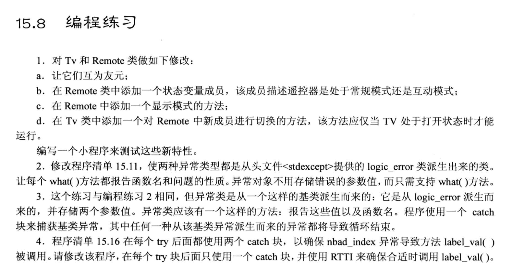

# 題目



# 1.
- 頭文件`tv.h`
    ```cpp
    #ifndef __TV_H__
    #define __TV_H__

    #include <iostream>

    using namespace std;

    class Remote;           // 前置聲明, 為了告訴編譯器, Tv類裡面的Remote是一個類

    class Tv
    {
        private:
            enum {off, on};
            enum {MinVol = 0, MaxVol = 20};
            enum {MinChan = 1, MaxChan = 100};
            enum {TV, DVD};

            int state;      // 表示電視的狀態: 0打開, 1關閉
            int volume;     // 音量
            int channel;    // 頻道
            int input;      // 輸入方式: TV, DVD

        public:
            Tv(int s = off) : state(s), volume(5), channel(2), input(TV){}
            void onoff(){ state = (state == on ? off : on);}       // 切換電視開關
            bool volup();    // 音量增
            bool voldown();  // 音量減  
            void chanup();       // 頻道增
            void chandown();     // 頻道減
            void setInput() {input = (input == TV ? DVD : TV);}     // 修改輸入方式(信號源)
            void showSettings() const;

            void set_remote_mode(Remote &r); 

            friend class Remote;        // 友元類
    };


    // 遙控器類 應該成為 電視機類 的友元類, 因為從邏輯上講, 遙控器和電視機之間沒有繼承關係, 也不應該是包含關係
    class Remote
    {
        private:
            // 練習題新增部分: 
            enum {Normal = 0, InterActive}; // 常規模式, 互動模式
            int remote_mode;            // 遙控器模式

            int mode;
        public:
            Remote(int m = Tv::TV, int rm = Normal) : mode(m), remote_mode(rm){}     // 因為是友元關係, 允許使用另一個類的私有枚舉

            // 操作輸入的Tv類對象(遙控器控制某個電視)
            void onoff(Tv &t) {t.onoff();}; 
            bool volup(Tv &t){ return t.volup();}
            bool voldown(Tv &t){ return t.voldown();}
            void chanup(Tv &t){t.chanup();}
            void chandonw(Tv &t){t.chandown();}
            void setChannel(Tv &t, int c){t.channel = c;}   // 直接訪問了私有成員, 並賦值!
            void setInput(Tv &t) {t.setInput();}

            // 練習題新增部分: 
            int show_remote_mode() const {return remote_mode;} 
            int set_remote_mode() {return remote_mode = (remote_mode == Normal ? InterActive : Normal);}
            friend class Tv;            // 實現互為友元類
    };

    #endif //!__TV_H__
    ```


- 源文件`tv.cpp`
    ```cpp
    #include "tv.h"

    bool Tv::volup()
    {
        if(volume < MaxVol){
            volume ++;
            return true;
        }
        else{
            return false;
        }
    }

    bool Tv::voldown()
    {
        if(volume > MinVol){
            volume ++;
            return true;
        }
        else{
            return false;
        }
    }

    void Tv::chanup()
    {
        if(channel < MaxChan){
            channel++;
        }
        else{
            channel = MinChan;        // 達到最大頻道時, 回到最小頻道即可
        }
    }

    void Tv::chandown()
    {
        if(channel > MinChan){
            channel --;
        }
        else{
            channel = MaxChan;        // 達到最小頻道時, 回到最大頻道即可
        }
    }

    void Tv::showSettings() const
    {
        cout << "TV is " << (state == off ? "off" : "on") << endl;
        if (state == on){
            cout << "Volume = " << volume << endl;
            cout << "Channel = " << channel << endl;
            cout << "Input = " << (input == TV ? "TV" : "DVD") << endl;
        }
    }

    void Tv::set_remote_mode(Remote &r)
    {
        if(state == Tv::on){
            r.set_remote_mode();        // 用 Remote 裡的方法切換遙控器的狀態
        }
    }
    ```

- 測試文件`useTV.cpp`
    ```cpp
    #include <iostream>

    #include "tv.h"

    using namespace std;

    int main(void)
    {
        Tv Panda;
        cout << "Initial Settings for Panda TV: " << endl;
        Panda.showSettings();

        Panda.onoff();
        Panda.showSettings();

        cout << "---------" << endl;
        Panda.volup();
        Panda.chanup();
        Panda.showSettings();

        // 定義遙控器對象(友元類對象), 然後控制電視機
        Remote rt;
        cout << "---------" << endl;
        rt.setChannel(Panda, 88);
        rt.volup(Panda);
        rt.volup(Panda);
        Panda.showSettings();

        // 測試遙控器的狀態
        cout << "-----------\n";
        cout << "Remote Mode = " << rt.show_remote_mode() << endl;
        Panda.set_remote_mode(rt);
        cout << "After Change Mode, Remote Mode = " << rt.show_remote_mode() << endl;

        cout << "---------" << endl;
        rt.onoff(Panda);
        Panda.showSettings();
        return 0;
    }
    ```


# 2. 
```cpp
#include <iostream>
#include <cstdlib>
#include <cmath>

// #include "exc_mean.h"   // 把異常類改成C++提供的異常類
#include <stdexcept>

using namespace std;

class bad_hmean : public logic_error    // 公有派生自 logic_error, 注意logic_error 也是派生類, 它派生自 exception 類
{
    public:
        // 在進行成員初始化時, 調用了基類 logic_error 提供的構造函數, 此時, 這個異常類裡面的 what() 成員函數就有值了
        bad_hmean(const string & what_arg = "hmean, invalid arguments!") : logic_error(what_arg){};
};

class bad_gmean : public logic_error
{
    public:
        bad_gmean(const string & what_arg = "gmean, invalid arguments!") : logic_error(what_arg){};
};

double hmean(double a, double b);
double gmean(double a, double b);

int main(void)
{
    double x, y, z;

    cout << "Enter two numbers: ";
    while(cin >> x >> y )
    {
        // step 3: 使用 try 模塊包住可能有異常的代碼 (throw語句包含在這裡面)
        try{
            // 容易出現異常的代碼通常放在 try 裡的代碼塊
            z = hmean(x,y);
            cout << "Harmonic mean of " << x << " and " << y << " is " << z << endl;
            z = gmean(x,y);
            cout << "Geometric mean of " << x << " and " << y << " is " << z << endl;
        }
        // step 2: 利用處理程序捕獲異常
        // 在 hmean 中已經使用了 throw 引發異常, 這裡接著使用 catch 捕獲這個異常
        catch(const char *s)       // 處理字符串的異常, 此時 s 中存放的是 throw 拋出來的字符串賦值
        {
            cout << s << endl;
            cout << "Enter a new pair of arguments." << endl;
            continue;
        }
        catch(bad_hmean &bh)        // bh 會接收 throw 過來的類的對象
        {
            cout << bh.what() << endl;      // 調用了異常類 logic_error 裡定義的what()函數
            cout << "Enter a new pair of arguments." << endl;
            continue;
        }
        catch(bad_gmean &gh)        // bh 會接收 throw 過來的類的對象
        {
            cout << gh.what() << endl;
            cout << "Sorry, quit now!" << endl;
            break;
        }
        cout << "Enter next set of numbers: ";
    }

    return 0;
}

double hmean(double a, double b)
{
    // 如果 a b 互為相反數就會出問題, 這裡使用 throw 引發異常, 並且是 "字符串類型的異常(const char *)"
    if(a == -b){
        // step 1: 在可能引發異常的代碼中增加 throw 語句以拋出異常
        throw bad_hmean();       // 用構造函數創建了類的對象, 並作為拋出類型
    }
    return 2.0 * a * b / (a + b);
}

double gmean(double a, double b)
{
    if(a < 0 || b < 0){
        throw bad_gmean();       // 用構造函數創建了類的對象, 並作為拋出類型
    }
    return sqrt(a*b);
}
```


# 3. 
```cpp
#include <iostream>
#include <cstdlib>
#include <cmath>

// #include "exc_mean.h"   // 把異常類改成C++提供的異常類
#include <stdexcept>

using namespace std;

class bad_mean : public logic_error
{
    private:
        double v1, v2;
    public:
        bad_mean(double a = 0, double b = 0, const string &what_arg = "mean, Error!") : v1(a), v2(b), logic_error(what_arg){}
        virtual void show() const;
};

// 繼承關係從 logic_error 改成 bad_mean
class bad_hmean : public bad_mean    // 公有派生自 logic_error, 注意logic_error 也是派生類, 它派生自 exception 類
{
    public:
        // 在進行成員初始化時, 調用了基類 logic_error 提供的構造函數, 此時, 這個異常類裡面的 what() 成員函數就有值了
        bad_hmean(double a = 0, double b = 0, const string & what_arg = "hmean, invalid arguments!") : bad_mean(a, b, what_arg){};
        virtual void show() const;
};

class bad_gmean : public bad_mean
{
    public:
        bad_gmean(double a = 0, double b = 0, const string & what_arg = "gmean, invalid arguments!") : bad_mean(a, b, what_arg){};
        virtual void show() const;
};

void bad_mean::show() const
{
    cout << "v1 = " << v1 << ", v2 = " << v2 << endl;
}

void bad_hmean::show() const
{
    cout << what() << endl;
    bad_mean::show();
}

void bad_gmean::show() const
{
    cout << what() << endl;
    bad_mean::show();
}

double hmean(double a, double b);
double gmean(double a, double b);

int main(void)
{
    double x, y, z;

    cout << "Enter two numbers: ";
    while(cin >> x >> y )
    {
        // step 3: 使用 try 模塊包住可能有異常的代碼 (throw語句包含在這裡面)
        try{
            // 容易出現異常的代碼通常放在 try 裡的代碼塊
            z = hmean(x,y);
            cout << "Harmonic mean of " << x << " and " << y << " is " << z << endl;
            z = gmean(x,y);
            cout << "Geometric mean of " << x << " and " << y << " is " << z << endl;
        }
        // step 2: 利用處理程序捕獲異常
        // 在 hmean 中已經使用了 throw 引發異常, 這裡接著使用 catch 捕獲這個異常
        // 練習題中要求這裡只能用一個 catch 塊捕獲上面三種異常類型: 
        catch(bad_mean &b)
        {
            if(typeid(bad_hmean) == typeid(b)){
                b.show();
                break;
            }
            if(typeid(bad_gmean) == typeid(b)){
                b.show();
                break;
            }
        }

        cout << "Enter next set of numbers: ";
    }

    return 0;
}

double hmean(double a, double b)
{
    // 如果 a b 互為相反數就會出問題, 這裡使用 throw 引發異常, 並且是 "字符串類型的異常(const char *)"
    if(a == -b){
        // step 1: 在可能引發異常的代碼中增加 throw 語句以拋出異常
        throw bad_hmean(a, b);       // 用構造函數創建了類的對象, 並作為拋出類型
    }
    return 2.0 * a * b / (a + b);
}

double gmean(double a, double b)
{
    if(a < 0 || b < 0){
        throw bad_gmean(a, b);       // 用構造函數創建了類的對象, 並作為拋出類型
    }
    return sqrt(a*b);
}
```
