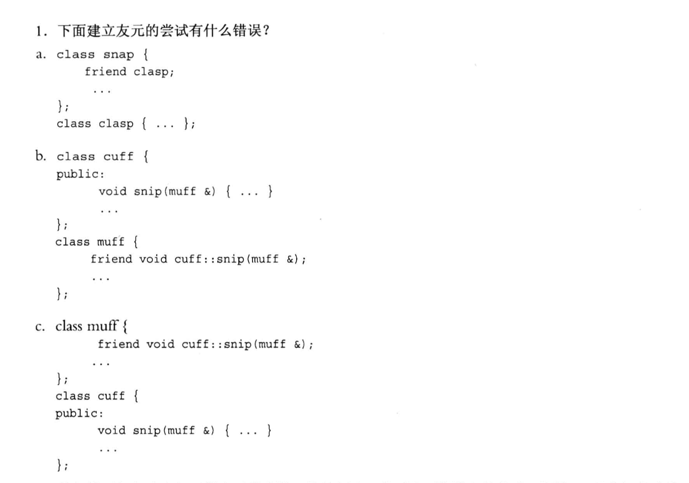
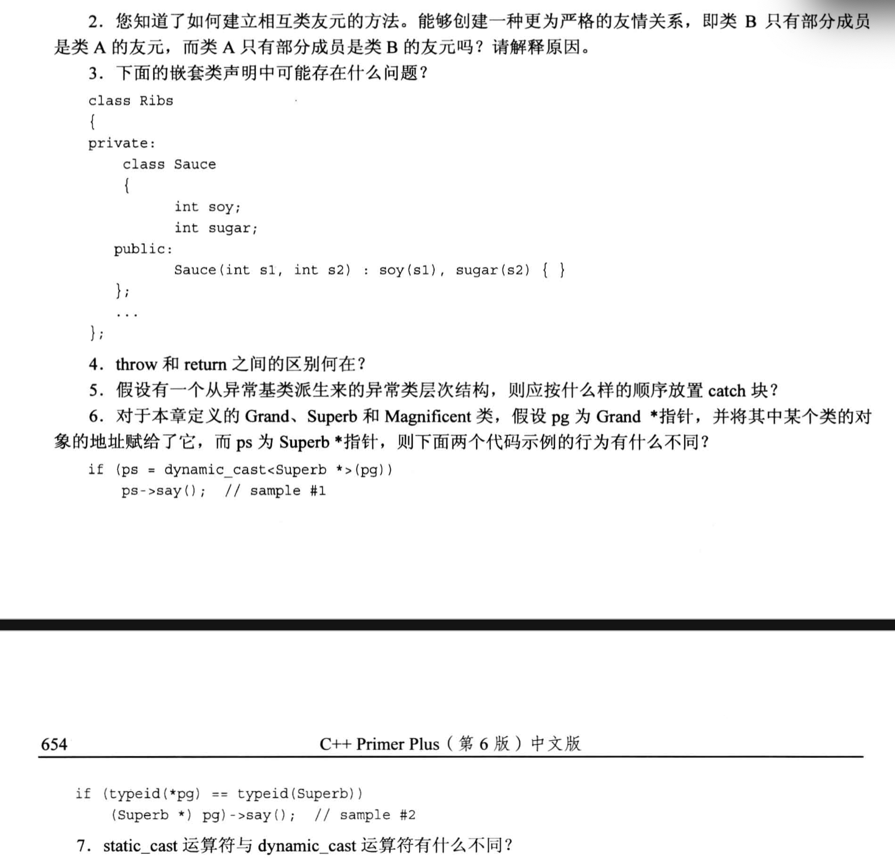

# 題目




# 1. 

```txt
a. friend 後面缺少關鍵詞 class

b. 由於編譯器是從上往下編譯的, 此時 cuff 裡使用 muff 類的話會報錯, 因為muff定義在 cuff 後面.
    解決辦法是在 cuff 定義的前面增加一個聲明: class muff;

c. 與上一個小問相同的那問題, 解決辦法很簡單:
    1. 把 cuff 類的定義整體放到 cuff 前面即可.
    2. 在最前面增加 "class muff;" 的聲明.
```

# 2.
```md
知識點:
1. 兩個類 可以 "互為友元"
2. 兩個類 不可以 "互為部分友元"
    理由可以参考第一题, 如果是部分友元, 那么 "作为友元的类" 一定要写在 "声明为友元的类" 的前面. 就跟函数声明一样, 一定要先出现一次, 后面的代码才可以使用它.
```

# 3.
```txt
1. 编译应该没有问题(语法上没写错)
2. Sauce 里面的 soy 和 sugar 这两个成员变量只有构造函数才能访问, 这里没有定义其他的public接口, 所以这个嵌套的Sauce类感觉是没有意义的, 因为用不了...
    要么新增Sauce的公有接口; 
    要么将 Sauce 里的 soy 和 sugar 改成 public 的.
```

# 4.
return 和 throw 都能调用函数然后返回, 但是:
1. return 是正常返回, 会按照顺序严格地`一级级`返回到 main 函数, 期间**会执行析构函数**.
2. throw 的话, 当出现异常时, 会按照`栈解退`的逻辑进行返回, 此时`并不是一级级返回`, 它存在跳级的操作, 当出错的时候就会马上终止下面代码的执行, 直接往上一级寻找对应的 catch语句进行匹配, 如果找不到就继续往上一级寻找, 直到找到为止. 期间**也会执行析构函数**.


# 5.
如果异常类存在继承关系, 则按照: 
    派生类的catch块在前, 基类的放在最后


# 6.
pg 指针是一个`基类的指针`.
```txt
在示例A中:
1. 使用了 dynamic_cast<> 操作, 这个操作是 "向上转换"(继承结构中往基类的层次方向转换), 此时的 if 语句中, 只有 pg 指向的是下层(派生类)的对象时, 转换才会返回 对应的对象地址(理解为true也行), 否则返回 空指针(理解为false也行).
    此时 pg 只要指向的是 Superb 或者 magnificent 中的一种类型, if 的条件都是 true

在示例 B 中:
type_id 用来判断类的类型的, 在这里的 if 语句中, 当且仅当 pg 指向的是 Superb 对象时才会为 true, 这个限制 dynamic_cast 更严格一些.
```


# 7.
1. dynamic_cast 运算符`只允许`向上转换 (层次结构中**向基类的方向转换**)
2. static_cast 运算符`既可以向上, 也可以向下转换`
   - static_cast 还允许 数值类型 的转换 (double, int这种)


