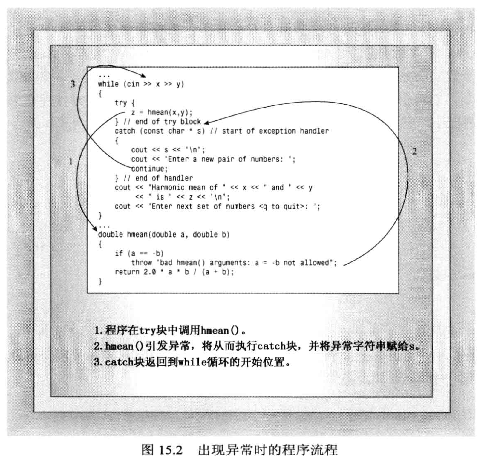
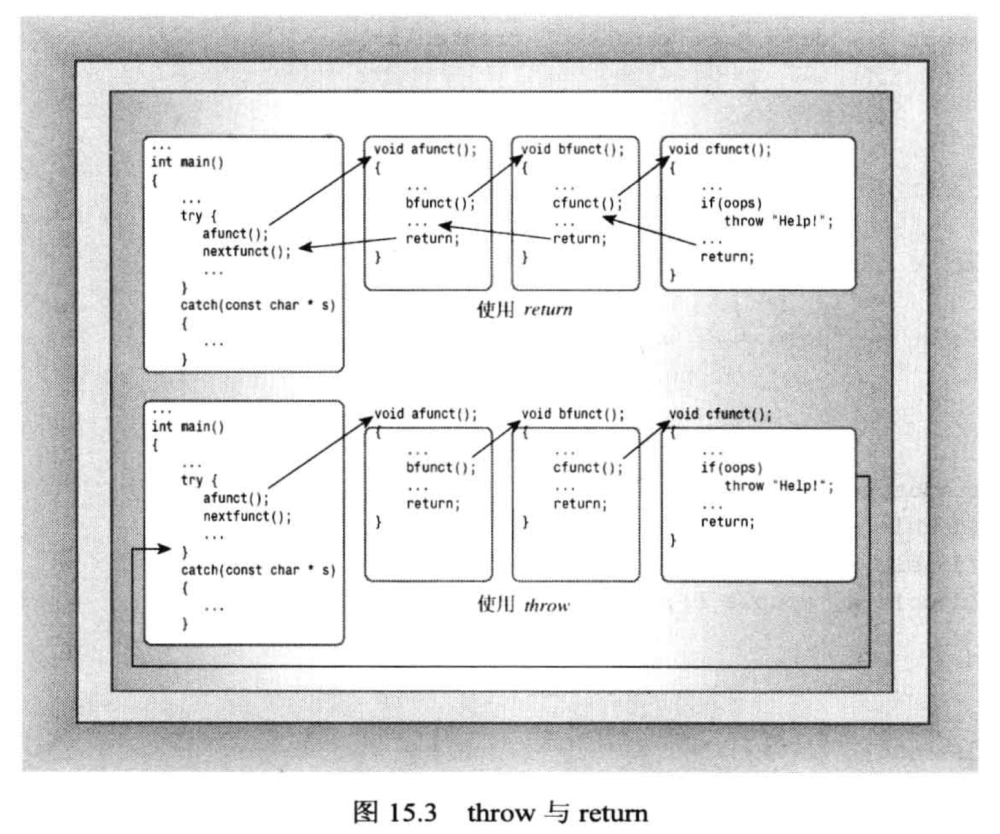
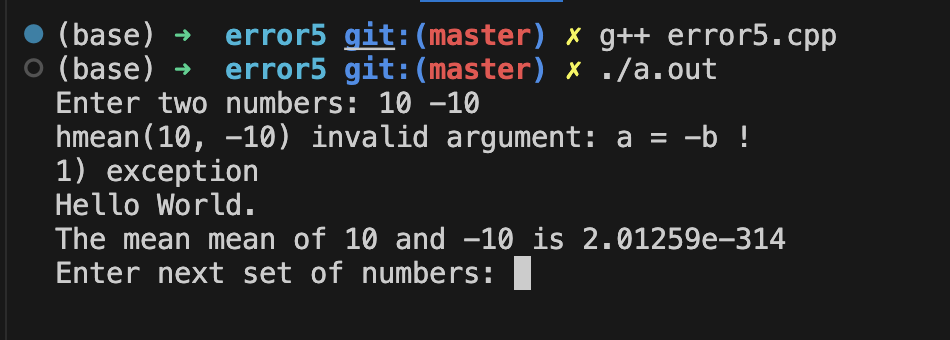
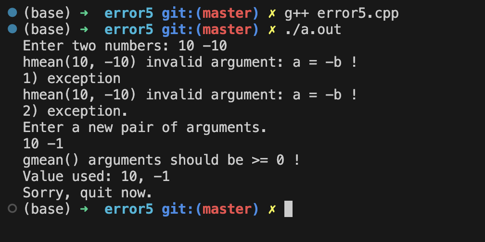
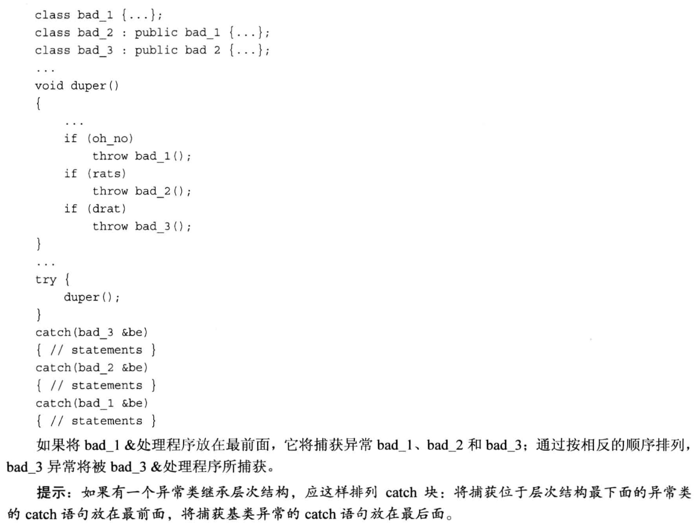

# 友元類
類**並非只能擁有友元函數**, 也能擁有友元類, 對於友元類而言, 友元類的所有方法都`可以訪問原始類的私有成員和保護成員`.
- 友元這個概念本就是**為了訪問私有和保護的成員**, 因此友元類的目的也是一樣的.

- 使用友元類的場景:
  - 兩個類之間`不存在繼承關係`也`不存在包含關係`, 但是**想讓其中一個類訪問另一個類的私有成員或保護成員**, 此時就應該使用友元類的方式. 


代碼例子 -- 電視機和遙控器相互訪問
- `tv.h`
    ```cpp
    #ifndef __TV_H__
    #define __TV_H__

    #include <iostream>

    using namespace std;

    class Tv
    {
        private:
            enum {off, on};
            enum {MinVol = 0, MaxVol = 20};
            enum {MinChan = 1, MaxChan = 100};
            enum {TV, DVD};

            int state;      // 表示電視的狀態: 0打開, 1關閉
            int volume;     // 音量
            int channel;    // 頻道
            int input;      // 輸入方式: TV, DVD

        public:
            Tv(int s = off) : state(s), volume(5), channel(2), input(TV){}
            void onoff(){ state = (state == on ? off : on);}       // 切換電視開關
            bool volup();    // 音量增
            bool voldown();  // 音量減  
            void chanup();       // 頻道增
            void chandown();     // 頻道減
            void setInput() {input = (input == TV ? DVD : TV);}     // 修改輸入方式(信號源)
            void showSettings() const;

            friend class Remote;        // 友元類
    };


    // 遙控器類 應該成為 電視機類 的友元類, 因為從邏輯上講, 遙控器和電視機之間沒有繼承關係, 也不應該是包含關係
    class Remote
    {
        private:
            int mode;
        public:
            Remote(int m = Tv::TV) : mode(m){}     // 因為是友元關係, 允許使用另一個類的私有枚舉

            // 操作輸入的Tv類對象(遙控器控制某個電視)
            void onoff(Tv &t) {t.onoff();}; 
            bool volup(Tv &t){ return t.volup();}
            bool voldown(Tv &t){ return t.voldown();}
            void chanup(Tv &t){t.chanup();}
            void chandonw(Tv &t){t.chandown();}
            void setChannel(Tv &t, int c){t.channel = c;}   // 直接訪問了私有成員, 並賦值!
            void setInput(Tv &t) {t.setInput();}
    };

    #endif //!__TV_H__
    ```

- `tv.cpp`
    ```cpp
    #include "tv.h"

    bool Tv::volup()
    {
        if(volume < MaxVol){
            volume ++;
            return true;
        }
        else{
            return false;
        }
    }

    bool Tv::voldown()
    {
        if(volume > MinVol){
            volume ++;
            return true;
        }
        else{
            return false;
        }
    }

    void Tv::chanup()
    {
        if(channel < MaxChan){
            channel++;
        }
        else{
            channel = MinChan;        // 達到最大頻道時, 回到最小頻道即可
        }
    }

    void Tv::chandown()
    {
        if(channel > MinChan){
            channel --;
        }
        else{
            channel = MaxChan;        // 達到最小頻道時, 回到最大頻道即可
        }
    }

    void Tv::showSettings() const
    {
        cout << "TV is " << (state == off ? "off" : "on") << endl;
        if (state == on){
            cout << "Volume = " << volume << endl;
            cout << "Channel = " << channel << endl;
            cout << "Input = " << (input == TV ? "TV" : "DVD") << endl;
        }
    }
    ```


- `useTV.cpp`
    ```cpp
    #include <iostream>

    #include "tv.h"

    using namespace std;

    int main(void)
    {
        Tv Panda;
        cout << "Initial Settings for Panda TV: " << endl;
        Panda.showSettings();

        Panda.onoff();
        Panda.showSettings();

        cout << "---------" << endl;
        Panda.volup();
        Panda.chanup();
        Panda.showSettings();

        // 定義遙控器對象(友元類對象), 然後控制電視機
        Remote rt;
        cout << "---------" << endl;
        rt.setChannel(Panda, 88);
        rt.volup(Panda);
        rt.volup(Panda);
        Panda.showSettings();

        cout << "---------" << endl;
        rt.onoff(Panda);
        Panda.showSettings();
        return 0;
    }
    ```


## 嵌套類
在一個類中聲明(定義)另一個類就叫嵌套類.
- 類的包含: 在一個類的數據成員中有**另一個類的對象**, 就叫類的包含.
- 類嵌套只寫嵌套類的定義而**不創建這個嵌套類的對象**.

代碼例子 -- 修改隊列這個類
- 頭文件`queue.h`
    ```cpp
    /*
        嵌套類
    */
    #ifndef __QUEUE_H__
    #define __QUEUE_H__

    #include <iostream>
    using namespace std;

    // 一般作為 **容器** 的類型, 都是使用類模板來實現的
    template <class T>
    class Queue
    {
        private:
            enum{Q_SIZE = 10};      // 通过枚举来定义常量, 此时枚举类型是匿名的

            // struct Node{T item; Node *next;};  // 注意next指针是一个结构体指针
            // 現在把結構體換成一個類來實現 (嵌套類)
            class Node
            {
                public:     // 為了讓 Queue能直接訪問Node的數據, 這裡定義為public
                    T item;
                    Node * next;
                    Node(const T &t) : item(t), next(nullptr){}
            };

            Node *front;      // 头结点
            Node *rear;       // 尾结点
            int items;        // 记录队列中有多少个节点
            const int qsize;        // 队列最大长度(不希望被修改)

        public:
            Queue(int qs = Q_SIZE);
            ~Queue();
            bool isEmpty() const;
            bool isFull() const;
            int queueCount() const;
            bool enqueue(const T &item); // 入队列
            bool dequere(T &item);       // 出队列, 出队列的节点要赋值给 item, 所以不加const
    };

    template <class T>
    Queue<T>::Queue(int qs) : qsize(qs)        // 这是 "成员初始化列表" 的赋值方式, 专门用于 const 变量在构造过程中进行初始化
    {
        front = rear = nullptr; // 头,尾结点指针
        items = 0;      // 记录节点个数
    }

    // 当队列使用完之后, 如果仍有元素没有出队, 则需要靠析构函数进行内存释放
    template <class T>
    Queue<T>::~Queue()
    {
        while(front != nullptr){
            Node * temp = front;     // 1. 取出即将释放的节点
            front = front->next;     // 2. 移动链表头到下一个位置, 防止丢失链表
            delete temp;             // 3. 释放节点
        }
    }

    template <class T>
    bool Queue<T>::isEmpty() const
    {
        return items == 0;
    }

    template <class T>
    bool Queue<T>::isFull() const
    {
        return items == qsize; 
    }

    template <class T>
    int Queue<T>::queueCount() const
    {
        return items;
    }

    // 入队操作是在链表尾部增加节点
    template <class T>
    bool Queue<T>::enqueue(const T &item)
    {
        // 入队需要先判断是否为满
        if(isFull())
        {
            return false;
        }

        // 队列没有满的前提下才新增节点
        // Node *add = new Node;
        // add->item = item;       // 新节点的数据赋值
        // add->next = nullptr;    // 新增节点后面应该为空

        // 嵌套類的寫法:
        Node *add = new Node(item);   // 动态开辟新节点,  注意: 由於現在使用了嵌套類來實現, 所以這裡會觸發 Node 類的構造函數創建對象 (中文書 page454, 指針和類對象的小結)
        items++;

        if(front == nullptr){
            front = add;    // 如果一开始链表为空, 则直接把头结点设置为当前新增的节点
        }
        else{                   // 原链表本身不为空链表时, 只需要更新尾结点
            rear->next = add;   // 注意: 把原来链表的尾结点的next指向当前新增的节点, 没进行这个操作之前, rear的next节点是 nullptr
        }
        rear = add;             // 这个操作才是把原来的尾结点移动到新增节点上

        return true;
    }

    template <class T>
    bool Queue<T>::dequere(T &item)
    {
        if(isEmpty())
            return false;
        
        item = front->item;  // 队列是"先入先出", 故取头节点 (此处执行了一次拷贝)

        // 开始删节点, 更新头结点
        items--;             // 1. 更新链表数量
        Node *temp = front;  // 2. 保留原来的头结点, 用于释放内存
        front = front->next; // 3. 把当前的头结点移动到下一个位置
        delete temp;         // 4. 删除原来不要的节点

        // 更新尾结点
        if (items == 0){
            rear = nullptr;
        }

        return true;
    }

    #endif //!__QUEUE_H__
    ```


- 測試文件`nested.cpp`
    ```cpp
    #include <iostream>
    #include <string>
    #include "queue.h"

    using namespace std;

    int main(void)
    {
        Queue<string> cs(5);

        string temp;

        while(!cs.isFull())
        {
            cout << "Please enter client's name, then push to queue: " << endl;
            getline(cin, temp);
            cs.enqueue(temp);
        }

        cout << "The Queue is full, processing begin!" << endl;

        while(!cs.isEmpty())
        {
            cs.dequere(temp);
            cout << "Now processing: " << temp << endl;
        }

        return 0;
    }
    ```


# 異常 (運行時)
C++的異常機制一般分為以下3步:
1. 引發異常
2. 使用處理程序捕獲異常
3. 使用try模塊

- 引發異常的常用方式:
  - `throw` 關鍵字
    - throw 會**終止當前函數, 但是整個程序還不會終止, 它只是跳轉會調用函數的位置**!!
    - throw 後面可以接`字符串`或者`合法的C++類型(包含自定義的類型)`

- 使用處理程序捕獲異常的方法(遇到異常馬上終止程序): 
  - `abort();` 需要使用 `#include <cstdlib>`
    - abort會**直接終止程序**!!
  - 使用`catch`捕獲異常
    - 通常需要搭配`引發異常`來使用, 一般在使用`throw`引發異常後添加catch來捕獲拋出來的異常.
    - 每一種不同的異常就需要寫一個catch捕獲並單獨處理, 也就是說, **一個try後面可以跟多個catch語句塊**.

- 使用try模塊
  - 使用 try 模塊將可能存在異常的代碼塊包起來執行(throw需要包含在這裡面)
  - 注意: **如果存在異常的代碼不在try裡面, 則catch是無法捕捉到的**!!

如果函數引發了異常, 但是`沒有 try 塊` 或者 `沒有匹配的處理程序` 時, **默認情況下編譯器將使用** `abort()` **函數直接終止程序**.
- 但是這種行為也是可以修改的 (後面的筆記討論).


**運行階段**暫時忽略異常的方法:
- 返回一個錯誤狀態/某個代表錯誤的值


## 代碼例子 -- 調和平均數
- 異常情況是 **除靈**.

異常的處理方式1 -- **使用abort()**, 遇到錯誤時直接終止程序
```cpp
#include <iostream>
#include <cstdlib>

using namespace std;

double hmean(double a, double b);

int main(void)
{
    double x, y, z;

    cout << "Enter two numbers: ";
    while(cin >> x >> y )
    {
        z = hmean(x,y);
        cout << "Harmonic mean of " << x << " and " << y << " is " << z << endl;
        cout << "Enter next set of numbers: ";
    }

    return 0;
}

double hmean(double a, double b)
{
    // 如果 a b 互為相反數就會出問題, 這裡採用直接終止程序的方式
    if(a == -b){
        cout << "Invalid arguments to hmean()" << endl;
        abort();        // 加了這個函數之後, 如果運行時進入這個代碼段, 程序就會直接終止
    }
    return 2.0 * a * b / (a + b);
}
```

異常的處理方式2: 不終止程序, 使用**函數返回值**判斷程序運行是否異常
```cpp
#include <iostream>
#include <cstdlib>

using namespace std;

bool hmean(double a, double b, double *ans);

int main(void)
{
    double x, y, z;

    cout << "Enter two numbers: ";
    while(cin >> x >> y )
    {
        if(hmean(x, y, &z)){
            cout << "Harmonic mean of " << x << " and " << y << " is " << z << endl;
        }
        else{
            cout << "One value should not be the negative of the other, try again!" << endl;
        }
        cout << "Enter next set of numbers: ";
    }

    return 0;
}

bool hmean(double a, double b, double *ans)
{
    // 如果 a b 互為相反數就會出問題, 這裡讓函數 返回錯誤碼
    if(a == -b){
        return false;
    }
    else{
        *ans = 2.0 * a * b / (a + b);
        return true;
    }
}
```

代碼例子 -- 走一遍異常機制
1. 使用 **throw 關鍵字引發異常**
2. 使用 **catch 捕獲throw拋出的異常**
3. 使用 **try 模塊**

出現異常時的運行流程:


    ```cpp
    #include <iostream>
    #include <cstdlib>

    using namespace std;

    double hmean(double a, double b);

    int main(void)
    {
        double x, y, z;

        cout << "Enter two numbers: ";
        while(cin >> x >> y )
        {
            // step 3: 使用 try 模塊包住可能有異常的代碼 (throw語句包含在這裡面)
            try{
                // 容易出現異常的代碼通常放在 try 裡的代碼塊
                z = hmean(x,y);
            }
            // step 2: 利用處理程序捕獲異常
            // 在 hmean 中已經使用了 throw 引發異常, 這裡接著使用 catch 捕獲這個異常
            catch(const char *s)       // 處理字符串的異常, 此時 s 中存放的是 throw 拋出來的字符串賦值
            {
                cout << s << endl;
                cout << "Enter a new pair of arguments." << endl;
                continue;
            }

            cout << "Harmonic mean of " << x << " and " << y << " is " << z << endl;
            cout << "Enter next set of numbers: ";
        }

        return 0;
    }

    double hmean(double a, double b)
    {
        // 如果 a b 互為相反數就會出問題, 這裡使用 throw 引發異常, 並且是 "字符串類型的異常(const char *)"
        if(a == -b){
            // step 1: 在可能引發異常的代碼中增加 throw 語句以拋出異常
            throw "Bad hmean() arguments, a=-b is not allowed!";        // throw 後可以加字符串 或者 C++的類型(包括類類型), 它會終止函數的運行(程序還會繼續走)
        }
        return 2.0 * a * b / (a + b);
    }
    ```

代碼例子 -- throw拋出自定義的類對象
- 頭文件`exc_mean.h`
    ```cpp
    #ifndef __EXC_MEAN_H__
    #define __EXC_MEAN_H__

    #include <iostream>

    using namespace std;

    class bad_hmean
    {
        private:
            double v1;
            double v2;
        public:
            bad_hmean(double a = 0, double b = 0) : v1(a), v2(b){}
            void mesg() const;  // 打印錯誤信息
    };

    inline void bad_hmean::mesg() const
    {
        cout << "hmean(" << v1 << ", " << v2 << ") invalid argument: a = -b !" << endl;
    }

    class bad_gmean     // 乘積平方根的異常
    {
        public:
            double v1;
            double v2;
        public:
            bad_gmean(double a = 0, double b = 0) : v1(a), v2(b){}  
            const char * mesg() const;
    };

    inline const char * bad_gmean::mesg() const
    {
        return "gmean() arguments should be >= 0 !";
    }

    #endif //!__EXC_MEAN_H__
    ```


- 測試文件`error4.cpp`
    ```cpp
    #include <iostream>
    #include <cstdlib>
    #include <cmath>

    #include "exc_mean.h"

    using namespace std;

    double hmean(double a, double b);
    double gmean(double a, double b);

    int main(void)
    {
        double x, y, z;

        cout << "Enter two numbers: ";
        while(cin >> x >> y )
        {
            // step 3: 使用 try 模塊包住可能有異常的代碼 (throw語句包含在這裡面)
            try{
                // 容易出現異常的代碼通常放在 try 裡的代碼塊
                z = hmean(x,y);
                cout << "Harmonic mean of " << x << " and " << y << " is " << z << endl;
                z = gmean(x,y);
                cout << "Geometric mean of " << x << " and " << y << " is " << z << endl;
            }
            // step 2: 利用處理程序捕獲異常
            // 在 hmean 中已經使用了 throw 引發異常, 這裡接著使用 catch 捕獲這個異常
            catch(const char *s)       // 處理字符串的異常, 此時 s 中存放的是 throw 拋出來的字符串賦值
            {
                cout << s << endl;
                cout << "Enter a new pair of arguments." << endl;
                continue;
            }
            catch(bad_hmean &bh)        // bh 會接收 throw 過來的類的對象
            {
                bh.mesg();              // 內部帶輸出語句
                cout << "Enter a new pair of arguments." << endl;
                continue;
            }
            catch(bad_gmean &gh)        // bh 會接收 throw 過來的類的對象
            {
                cout << gh.mesg() << endl;      // bad_gmean 裡的 mesg 返回了一個字符串
                cout << "Value used: " << gh.v1 << ", " << gh.v2 << endl;
                cout << "Sorry, quit now." << endl;
                break;
            }
            cout << "Enter next set of numbers: ";
        }

        return 0;
    }

    double hmean(double a, double b)
    {
        // 如果 a b 互為相反數就會出問題, 這裡使用 throw 引發異常, 並且是 "字符串類型的異常(const char *)"
        if(a == -b){
            // step 1: 在可能引發異常的代碼中增加 throw 語句以拋出異常
            // throw "Bad hmean() arguments, a=-b is not allowed!";        // throw 後可以加字符串 或者 C++的類型(包括類類型), 它會終止函數的運行(程序還會繼續走)
            throw bad_hmean(a,b);       // 用構造函數創建了類的對象, 並作為拋出類型
        }
        return 2.0 * a * b / (a + b);
    }

    double gmean(double a, double b)
    {
        if(a < 0 || b < 0){
            throw bad_gmean(a,b);       // 用構造函數創建了類的對象, 並作為拋出類型
        }
        return sqrt(a*b);
    }
    ```

# 棧解退(unwinding the stack)
棧解退指的是: 當前有一個函數, 這個函數內部調用了另一個函數, 如果裡層的函數發生了錯誤, 此時會終止程序的繼續運行, 並開始釋放棧裡的東西, 這種**由於異常的發生而觸發的棧釋放的過程就是所謂的棧解退**.

要理解棧解退, 需要先回顧一下正常的函數調用過程, 如下圖:

- 調用函數過程是: 一層層往右, 當最右側(最裡層)的函數執行結束時, 就一層層往回return
- 棧解退則是: 一層層往右, 當最右側(最裡層)的函數執行結束時, 會**直接返回到 try 代碼塊的部分** (圖片中的箭頭指向)
  - 執行的時候, 先調用 try代碼塊 的 afunc, 在 afunc 中需要調用 bfunc, 執行 bfunc 中又繼續調用了 cfunc, 但是**在 cfunc 調用過程中引發了異常**(進入並執行了 throw 語句), 此時**馬上釋放棧裡面 cfunc的資源**並往回尋找 try代碼塊(**只是馬上終止執行 cfunc, 但整個程序還不會終止**), 發現 bfunc 沒有 try代碼塊, 再釋放 bfunc 的資源並往回, 又發現 afunc 中也沒有 try代碼塊, 再釋放 afunc 資源&往回走, 此時到了 main函數, 發現了 try代碼塊, 這時候就直接去匹配 try代碼塊 後面緊跟著的catch, **看看哪個 catch 能匹配到 throw 拋出的異常類型, 如果找到了, 就執行 catch 裡面的代碼, 如果沒有找到, 會繼續剛剛的過程不斷往前找 try-catch看看有沒有能匹配當前異常的catch語句塊, 但在這裡main已經是最前面的那層了, 故不會再往前走, 此時默認會調用 abort() 終止程序**.
    - 也就是說, 當觸發異常時, 程序會自動從棧裡面往回找, 直到找到`第一個try代碼塊`, 然後去匹配相應的 catch.
      - 如果在完**第一個try-catch**之後沒有重新再拋出一次異常, 此時即使再往前還能遇到 try-catch, 那些catch裡的異常處理代碼也不會被執行了. (注意看下面代碼例子的mean函數和main函數)


## 代碼例子 -- 棧解退
頭文件`exc_mean.h`
    ```cpp
    #ifndef __EXC_MEAN_H__
    #define __EXC_MEAN_H__

    #include <iostream>

    using namespace std;

    class bad_hmean
    {
        private:
            double v1;
            double v2;
        public:
            bad_hmean(double a = 0, double b = 0) : v1(a), v2(b){}
            void mesg() const;  // 打印錯誤信息
    };

    inline void bad_hmean::mesg() const
    {
        cout << "hmean(" << v1 << ", " << v2 << ") invalid argument: a = -b !" << endl;
    }

    class bad_gmean     // 乘積平方根的異常
    {
        public:
            double v1;
            double v2;
        public:
            bad_gmean(double a = 0, double b = 0) : v1(a), v2(b){}  
            const char * mesg() const;
    };

    inline const char * bad_gmean::mesg() const
    {
        return "gmean() arguments should be >= 0 !";
    }

    #endif //!__EXC_MEAN_H__
    ```

- 測試文件`error5.h`
    ```cpp
    /*
        代碼例子: 演示 unwinding the stack (棧解退)
    */
    #include <iostream>
    #include <cstdlib>
    #include <cmath>

    #include "exc_mean.h"

    using namespace std;

    double hmean(double a, double b);
    double gmean(double a, double b);
    double mean(double a, double b);

    int main(void)
    {
        double x, y, z;

        cout << "Enter two numbers: ";
        while(cin >> x >> y )
        {
            // step 3: 使用 try 模塊包住可能有異常的代碼 (throw語句包含在這裡面)
            try{
                // 注意 mean 中也包含了 try代碼塊
                z = mean(x,y);
                cout << "The mean mean of " << x << " and " << y << " is " << z << endl;
            }
            // step 2: 利用處理程序捕獲異常
            // 由於 mean 中存在 try代碼塊 和 catch部分, 如果 mean 中沒有繼續用 throw 再次拋出異常, 則到這裡的 catch 將不會被執行 
            catch(const char *s)
            {
                cout << s << endl;
                cout << "Enter a new pair of arguments." << endl;
                continue;
            }
            catch(bad_hmean &bh)    // 哪怕這裡寫的是對象的引用, 編譯器其實也會複製一份 throw拋出的異常對象, 此時, 這裡的引用指向的是編譯器複製出來的那個臨時拷貝對象.
            {
                bh.mesg();              // 內部帶輸出語句
                cout << "2) exception." << endl;          // 捕抓 mean 再次拋出的異常
                cout << "Enter a new pair of arguments." << endl;
                continue;
            }
            catch(bad_gmean &gh)        // 哪怕這裡寫的是對象的引用, 編譯器其實也會複製一份 throw拋出的異常對象, 此時, 這裡的引用指向的是編譯器複製出來的那個臨時拷貝對象.
            {
                cout << gh.mesg() << endl;      // bad_gmean 裡的 mesg 返回了一個字符串
                cout << "Value used: " << gh.v1 << ", " << gh.v2 << endl;
                cout << "Sorry, quit now." << endl;
                break;
            }
            cout << "Enter next set of numbers: ";
        }

        return 0;
    }

    double hmean(double a, double b)
    {
        // 如果 a b 互為相反數就會出問題, 這裡使用 throw 引發異常, 並且是 "字符串類型的異常(const char *)"
        if(a == -b){
            // step 1: 在可能引發異常的代碼中增加 throw 語句以拋出異常
            throw bad_hmean(a,b);       // 用構造函數創建了類的對象, 並作為拋出類型
        }
        return 2.0 * a * b / (a + b);
    }

    double gmean(double a, double b)
    {
        if(a < 0 || b < 0){
            throw bad_gmean(a,b);       // 用構造函數創建了類的對象, 並作為拋出類型
        }
        return sqrt(a*b);
    }

    // mean函數不包含任何拋出異常的語句, 能引發異常的函數只有 hmean 和 gmean
    double mean(double a, double b)
    {
        double am, hm, gm;      // am 是算術平均數 (a+b)/2
        am = (a + b) / 2.0;

        try
        {
            hm = hmean(a, b);
            gm = gmean(a, b);
        }
        catch(bad_hmean &bh)      // 哪怕這裡寫的是對象的引用, 編譯器其實也會複製一份 throw拋出的異常對象, 此時, 這裡的引用指向的是編譯器複製出來的那個臨時拷貝對象.
        {
            bh.mesg();
            cout << "1) exception" << endl;

            // 為了能讓 main 函數的 try-catch 能捕獲到異常, 這裡再拋一次.
            throw;          // 如果什麼都不寫, 則表示拋出這裡相同類型的異常, 也就是 "bad_hmean &" 類型
        }
        cout << "Hello World." << endl;     // 如果這裡的 try-catch 沒有再次拋出異常的話, 這句 Hello World 將會被執行, 而如果這裡拋出了異常, 則直接跳到 main 函數, 這行代碼不會被執行

        return (am + hm + gm) / 3.0;
    }
    ```

輸出:
- 在`mean()`函數中**沒有**進行二次異常拋出(註釋掉了`throw;`)

  - 可以明顯看到 `mean()` 函數裡在捕獲到 hmean 裡拋出的異常之後, 馬上繼續執行了後續的代碼, 輸出了 `Hello World` 並繼續執行到 `main()` 裡的語句, 輸出`The mean mean of 10 and -10 is 2.01259e-314`.

- 在`mean()`函數中**有**進行二次異常拋出

  - 可以明顯看到 `mean()` 函數裡在捕獲到 hmean 裡拋出的異常之後, 沒有再執行後續的代碼, 而是直接跳到了 `main()` 函數對應 "bad_hmean" 異常的catch語句塊, 輸出了`2) exception.`
    - 還可以注意到, 在二次拋出異常時, 我們只寫了`throw;`而不指定異常的類型, 這表示此時拋出的異常與第一次拋出的異常類型相同, 這時候, 編譯器往回傳遞的異常是**與第一次一模一樣**的! 所以這裡能看到兩句`hmean(10, -10) invalid argument: a = -b !`
      - 從這裡我們還能看出一個知識點**哪怕catch這裡寫的是對象的引用, 編譯器其實也會複製一份 throw拋出的異常對象, 此時, 這裡的引用指向的是編譯器複製出來的那個臨時拷貝對象**, 如果不是拷貝的話, 這個異常對象老早就在向上查找 try-catch 的過程中銷毀掉了.
  - 之後, 我們測試 gmean, 此時輸入的數字有負數, gmean 拋出異常, 這時候, 由於`mean()`函數中雖然有**try-catch**, 但是這裡沒有能匹配 "bad_gmean" 異常的catch語句塊, 此時**mean()函數後續的輸出語句也不會被執行**, 而是再次跳轉到了更上一層(也就是main函數)的 try-catch, 在這裡找到了能匹配 "bad_gmean" 的catch語句塊, 於是輸出了`Sorry, quit now`並正常運行完整個程序. 


## 其他異常特性
- 寫 catch 時, 我們總是寫`類型的引用`的根本原因是: 為了使用`基類的引用可以指向派生類對象`這個特性, 這時候就**可以少寫很多catch語句塊**.

- 寫catch語句塊時, 需要注意順序
  - 將**派生類的catch語句塊放在基類前面**, 這樣才能保證**派生類的catch語句塊能被執行到**(防止基類捕獲了派生類的異常).
    - 可以參考switch語句中的 default 分支, 它主要負責"其他", 是一種萬金油case, 一般放在最下面寫.
    


# execption 類
C++中定義了一個名為 `exception` 的類, 使用時需要引入頭文件`exception.h`或`except.h`.
- 它常`用做基類`, 用來描述各種異常
- exception 類也可以用來引發 exception 異常, 裡面定義了一個名為`what()`的**虛函數**, 它`返回一個字符串`. (由於是虛函數, 也可以在派生類中重寫它)

例如:
```cpp
#include <exception>
class bad_hmean : public std::exception
{
    public:
        const char * what() const {return "bad arguments to hmean()"};      // 重寫了 exception 類的 what() 函數
};

class bad_gmean : public std::exception
{
    public:
        const char * what() const {return "bad arguments to gmean()"};      // 重寫了 exception 類的 what() 函數
};


// 在處理 try-catch 時, 可以利用 "基類可以指向派生類" 這個特性, 來減少 catch 語句塊的數量
try
{
    ...
}
catch (std::exception & e)
{
    cout << " e.what()" << endl;
    ...
}
```

---

## C++ 中定義的基於 exception 的異常類型
### stdexcept  
使用時需要包含頭文件, 即`#include <stdexcept>`
- 這個頭文件中定義了 `logic_error` 和 `runtime_error`
 - 注意, 這兩個類是**公有派生自exception類**的

- 代碼例子 (練習題第二題)
    ```cpp
    #include <iostream>
    #include <cstdlib>
    #include <cmath>

    // #include "exc_mean.h"   // 把異常類改成C++提供的異常類
    #include <stdexcept>

    using namespace std;

    class bad_hmean : public logic_error    // 公有派生自 logic_error, 注意logic_error 也是派生類, 它派生自 exception 類
    {
        public:
            // 在進行成員初始化時, 調用了基類 logic_error 提供的構造函數, 此時, 這個異常類裡面的 what() 成員函數就有值了
            bad_hmean(const string & what_arg = "hmean, invalid arguments!") : logic_error(what_arg){};
    };

    class bad_gmean : public logic_error
    {
        public:
            bad_gmean(const string & what_arg = "gmean, invalid arguments!") : logic_error(what_arg){};
    };

    double hmean(double a, double b);
    double gmean(double a, double b);

    int main(void)
    {
        double x, y, z;

        cout << "Enter two numbers: ";
        while(cin >> x >> y )
        {
            // step 3: 使用 try 模塊包住可能有異常的代碼 (throw語句包含在這裡面)
            try{
                // 容易出現異常的代碼通常放在 try 裡的代碼塊
                z = hmean(x,y);
                cout << "Harmonic mean of " << x << " and " << y << " is " << z << endl;
                z = gmean(x,y);
                cout << "Geometric mean of " << x << " and " << y << " is " << z << endl;
            }
            // step 2: 利用處理程序捕獲異常
            // 在 hmean 中已經使用了 throw 引發異常, 這裡接著使用 catch 捕獲這個異常
            catch(const char *s)       // 處理字符串的異常, 此時 s 中存放的是 throw 拋出來的字符串賦值
            {
                cout << s << endl;
                cout << "Enter a new pair of arguments." << endl;
                continue;
            }
            catch(bad_hmean &bh)        // bh 會接收 throw 過來的類的對象
            {
                cout << bh.what() << endl;      // 調用了異常類 logic_error 裡定義的what()函數
                cout << "Enter a new pair of arguments." << endl;
                continue;
            }
            catch(bad_gmean &gh)        // bh 會接收 throw 過來的類的對象
            {
                cout << gh.what() << endl;
                cout << "Sorry, quit now!" << endl;
                break;
            }
            cout << "Enter next set of numbers: ";
        }

        return 0;
    }

    double hmean(double a, double b)
    {
        // 如果 a b 互為相反數就會出問題, 這裡使用 throw 引發異常, 並且是 "字符串類型的異常(const char *)"
        if(a == -b){
            // step 1: 在可能引發異常的代碼中增加 throw 語句以拋出異常
            throw bad_hmean();       // 用構造函數創建了類的對象, 並作為拋出類型
        }
        return 2.0 * a * b / (a + b);
    }

    double gmean(double a, double b)
    {
        if(a < 0 || b < 0){
            throw bad_gmean();       // 用構造函數創建了類的對象, 並作為拋出類型
        }
        return sqrt(a*b);
    }
    ```


### bad_alloc 異常和 new
使用 new 開闢空間失敗時, 就可以拋出 bad_alloc 異常, 這個異常類也是公有派生自 exception 類的.
- 使用時, 需要`#include <new>`
```cpp
#include <iostream>
#include <new>      // 引入這個頭文件之後才能拋出 bad_alloc 異常, 因為 throw bad_alloc() 這句話裡面的 bad_alloc 是在這個頭文件裡定義的
#include <cstdlib>

using namespace std;

struct Big
{
    double stuff[20000];
};

int main()
{
    Big *pb;
    try{
        cout << "Trying to get a big block of memory:" << endl;
        pb = new Big[10000];        // 開闢 10000 個 Big 對象的空間, 共計 1,600,000,000 Byte
        cout << "Got past the new request:" << endl;
    }
    catch(bad_alloc &ba)            // 在 catch 部分直接捕獲 bad_alloc 類型的對象即可
    {
        cout << "Caught the exception!" << endl;
        cout << ba.what() << endl;
        exit(EXIT_FAILURE);
    }
    cout << "Memory successfully allocated!" << endl;
    pb[0].stuff[0] = 4;
    cout << pb[0].stuff[0] << endl;
    delete [] pb;
    return 0;
}
```

### 空指針 和 new 
有些編譯器提供了一個標記(或叫開關), 讓用戶可以選擇`在new執行失敗時, 到底是拋出異常, 還是返回空指針`, 寫法如下:
```cpp
int *pi = new (std::nothrow) int;           // 不拋出異常, no throw, 出錯時返回 nullptr
int *pa = new (std::nowtrow) int[500];      // 拋出異常, now throw
```
針對返回空指針的寫法:
```cpp
Big *pb;
pb = new (std::nothrow) Big[10000];
if(pb == 0){
    cout << "Could not allocate memory. Bye." << endl;
    exit(EXIT_FAILURE);
}
```

