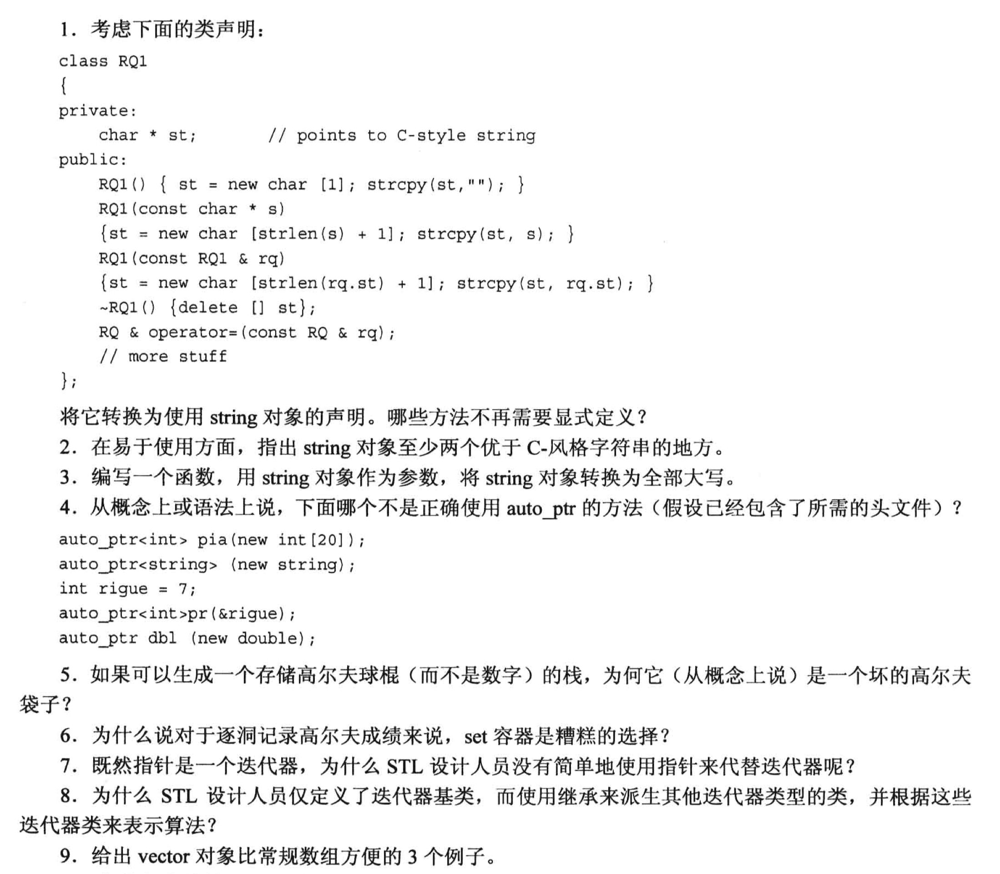
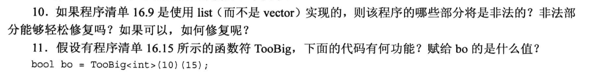

# 题目




# 1.
```cpp
#include <string>
class RQ1
{
    private:
        string st;
    public:
        RQ1() : st(""){}
        RQ1(const char *s) : st(s){}
        // 不需要复制构造
        // 可以不写析构, 因为 string 有析构
        // string 支持对拷, 不需要重载赋值运算符
};

string str1, str2;
str1 = str2;
```

# 2.
```txt
1. string可以直接对拷, C风格字符串不行
2. string 提供了内存管理功能, 不需要担心存储的空间不够, 或者越界问题
```

# 3.
```cpp
#include <strign>
#include <cctype>
void ToUpper(string &s){
    for (int i = 0; i < s.size(); i++){
        s[i] = toupper(s[i]);
    }
}
```

# 4.
```cpp
auto_ptr<int> pia(new int[20]);  // auto_ptr 里面使用的是 delete, 不是 delete[], 所以这里 int[20] 是不行的

auto_ptr<string> (new string);  // 少了名字

int rigue = 7;
auto_ptr<int> pr(&rigue);       // 智能指针只能使用 new 的地址! (new在堆里分配内存!)

auto_ptr dbl (new double);      // auto_ptr 是模板!
```


# 5.
```txt
栈是 "后进先出/先进后出" 的数据结构, 每次只能拿出栈顶的元素, 而高尔夫球棍桶要求能随时取出任何一支球棍, 所以不适合用栈.
```


# 6.
```txt
set 会自动去重, 几分可能存在重复成绩, 所以不合适.
```


# 7. 
```txt
迭代器虽然是"广义的指针", 但是指针并不能直接替代迭代器, 原因是:
    指针是具有特定类型的, 使用的时候必须固定类型, 而迭代器是模板, 可以适用于不同类型的容器(指针无法指向泛型).
```

# 8.
```txt
通过继承, 我们可以扩展更多的功能给自己的定义的迭代器, 使它的功能更强大(通用性更好, 可扩展性更强).
```

# 9.
```txt
数组不支持对拷, 因为数组名是一个地址;
vector模板可以自己管理内存(自动变更容量, 而且不用担心越界), 而且里面有很多方便的算法, 如 sort 等;
```

# 10.
```cpp
/* 
    vector 支持随机访问(直接给一个index然后获取元素), 但是list是一个双向链表, 不支持随机访问.  
        ==> random_shuffle 不可用 
           ==> 解决办法可以是: 先把 list 的内容拷贝给 vector 用完random_shuffle 再拷贝回来哈哈哈哈~
*/
```

# 11.
```cpp
/*
    TooBig 是一个模板类, 里面定义了一个 "一元谓词"
*/

template <class T>
class TooBig
{
    private:
        T cutoff;

    public:
        TooBig(const T &t) : cutoff(t){}
        bool operator()(const T &v){ return v > cutoff; }       // 一个函数符, 返回bool且只有1个参数, 故也是一元谓词
};


bool bo = TooBig<int> (10) (15);
/*
    TooBig<int> (10): 实例化了模板, 得到 TooBig<int> 类型, 然后调用构造函数创建了一个匿名对象;
    
    (15): 调用了匿名对象的 () 运算符, 传入了参数 15, 与 cutoff 比较之后, 返回 true;

    bo = true;
*/
```

