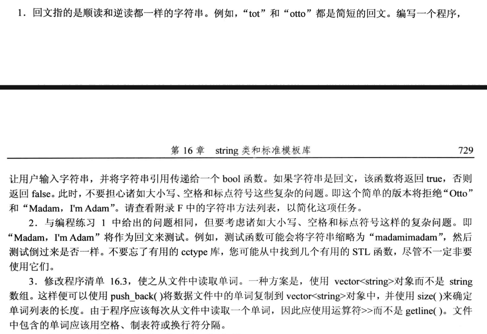
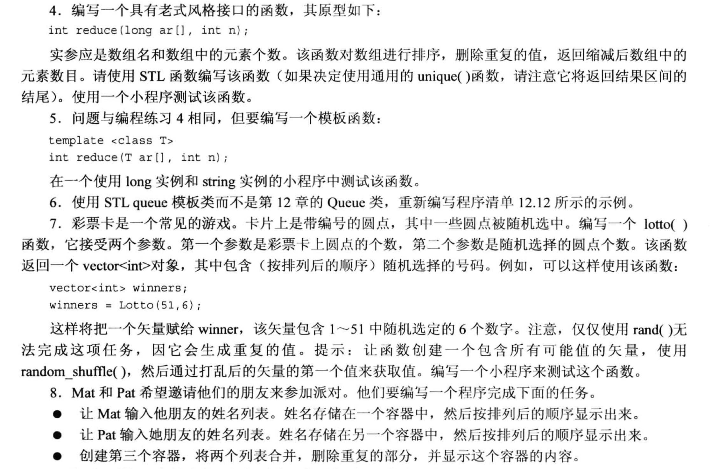
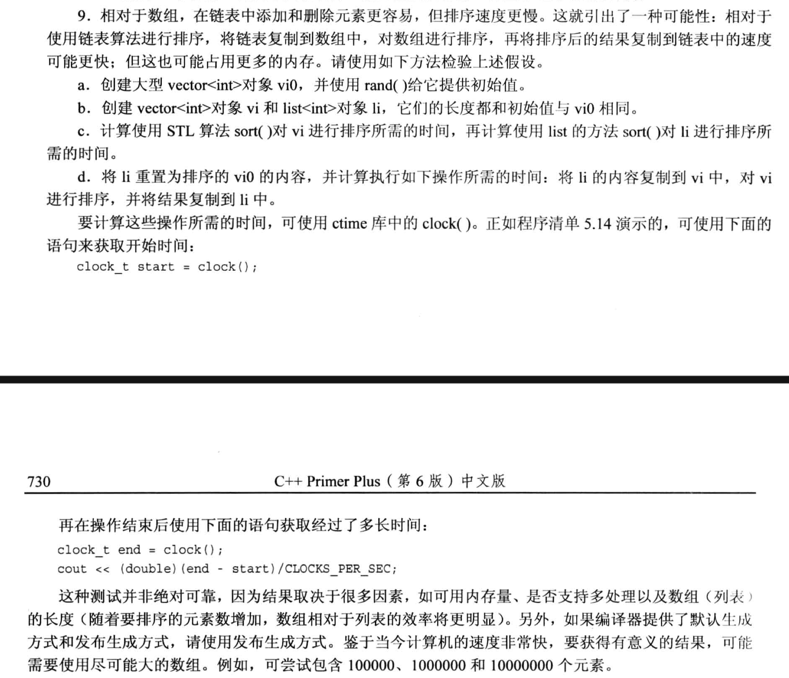
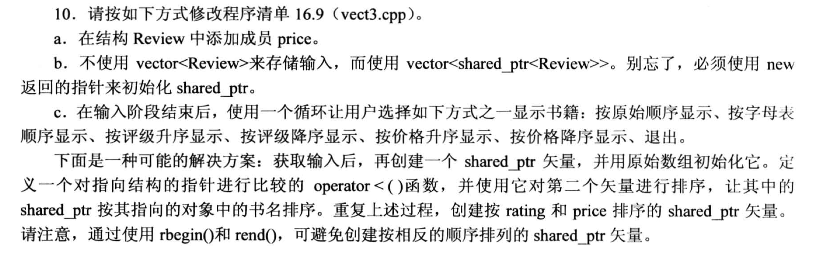

# 题目






# 1. 
判断回文串, 不判断大小写和空格.
```cpp
#include <iostream>
#include <string>
#include <algorithm>

using namespace std;

bool same_after_reverse(const string &s);

int main(void)
{
    string str;

    cout << "Please enter a string: ";
    cin >> str;

    if(same_after_reverse(str)){
        cout << "Palindromic" << endl;
    }
    else{
        cout << "Not Palindromic." << endl;
    }
    return 0;
}

bool same_after_reverse(const string &s)
{
    string temp;
    temp = s;
    reverse(temp.begin(), temp.end());      // 用到 reverse 函数
    return temp == s;
}
```

# 2.
```cpp
#include <iostream>
#include <string>
#include <algorithm>
#include <cctype>       // tolower, isalpha

using namespace std;

bool same_after_reverse(const string &s);

int main(void)
{
    string str;

    cout << "Please enter a string: ";
    getline(cin, str);

    if(same_after_reverse(str)){
        cout << "Palindromic" << endl;
    }
    else{
        cout << "Not Palindromic." << endl;
    }
    return 0;
}

bool same_after_reverse(const string &s)
{
    string temp;
    for(int i = 0; i < s.size(); i++){
        if(isalpha(s[i])){
            temp += tolower(s[i]);      // 直接追加到 temp 末尾
        }
    }
    string temp1 = temp;
    reverse(temp1.begin(), temp1.end());
    return temp1 == temp;
}
```

# 3.
```cpp
#include <iostream>
#include <string>
#include <cctype>   // 用到 tolower 就要引入
#include <ctime>    
#include <cstdlib>
#include <fstream>
#include <vector>

using namespace std;

const int NUM = 26;
// const string wordlist[NUM] = {
// 	"apiary", "beetle", "cereal", "danger", "ensign", "florid",
// 	"health", "insult", "jackal", "keeper", "loaner", "manage",
// 	"nonce",  "onset",  "plaid",  "quilt",  "remote", "stolid",
// 	"train",  "useful", "valid",  "whence", "xenon",  "yearn",
// 	"zippy"
// };

int main(void)
{

    // 从文件中读取字符串
    ifstream fin;
    fin.open("wordlist.txt");

    if(fin.is_open() == false){
        cerr  << "Can't open flie. Bye. ";   // cerr 只能輸出到標準輸出設備上(cout則還可以輸出到比如文本等其他位置上)
        exit(EXIT_FAILURE);
    }

    string item;
    vector<string> wordlist;
    while(fin){
        getline(fin, item, ','); 
        wordlist.push_back(item);
    }
    fin.close();

    // 处理字符串
    char play;
    srand(time(0));     // 設置隨機數種子

    cout << "Will you play a word game? <y/n> ";
    cin >> play;
    tolower(play);  // 為了方便判斷, 全部轉小寫

    while(play == 'y'){
        string target = wordlist[rand() % NUM];     // 0~25 中隨機選一個數
        int length = target.length();
        string attempt(length, '-');
        string badchars;    // 歷史猜錯的字符
        int guess = 6;      // 最多允許猜 6 次
        cout << "Guess my secret word, it has " << length << " length, and you guess one character at a time. You get " << guess << " wrong guesses." << endl;

        cout << attempt << endl;
        while(guess > 0 && attempt != target){
            char letter;
            cout << "Guess a letter: ";
            cin >> letter;

            // 檢查是否猜過
            if(badchars.find(letter) != string::npos || attempt.find(letter) != string::npos){      // 如果輸入的字符有出現在輸錯的記錄中, 或者 正確字符中曾經出現過
                cout << "You have already guessed that, try again!" << endl;
                continue;
            }

            // 沒出現過:
            int loc = target.find(letter);
            if(loc == string::npos){        // 當前猜的字符在target中找到末尾也沒有找到 ==> 猜錯了
                cout << "Oh, Bad Guess!" << endl;
                guess --;
                badchars += letter;
            }
            else{                           // 猜對的情況
                cout << "Good Guess!" << endl;
                attempt[loc] = letter;      // 這裡只替換了一個字符
                while(loc != string::npos){
                    attempt[loc] = letter;
                    loc = target.find(letter, loc +1);
                };
                
            }
            // 猜完一輪, 輸出當前猜測狀態
            cout << "Your word: " << attempt << endl;
            if(attempt != target){
                if(badchars.length() > 0){
                    cout << "Bad choices: " << badchars << endl;
                }
                cout << guess << " bad guess left!" << endl;
            }
        }
        // 判斷猜完之後是否正確
        if( guess > 0 || attempt == target){
            cout << "That's right!" << endl;
        }
        else{
            cout << "Sorry, the word is: " << target <<  endl;
        }

        cout << "Will you play another time? <y/n>" << endl;
        cin >> play;
        tolower(play);  // 為了方便判斷, 全部轉小寫
    }

    return 0;
}
```

# 4.
```cpp
#include <iostream>
#include <algorithm>

using namespace std;

int reduce(long arr[], int n);

int main(void)
{
    long arr[5] = {200, 100, 300, 100, 200};

    int size = reduce(arr, 5);
    for(int i = 0; i < size; i++){
        cout << arr[i] << " ";
    }
    cout << endl;
    return 0;
}

int reduce(long arr[], int n)
{
    sort(arr, arr + n);     // 排序
    long *pt = unique(arr, arr + n);       // 去重, 返回超尾指针
    return pt - arr;
}
```

# 5.
```cpp
#include <iostream>
#include <algorithm>
#include <list>

using namespace std;

template <class T>
int reduce(T arr[], int n);

int main(void)
{
    long arr[5] = {200, 100, 300, 100, 200};

    int size = reduce(arr, 5);
    for(int i = 0; i < size; i++){
        cout << arr[i] << " ";
    }
    cout << endl;

    string str[5] = {"hello", "world", "good", "morning", "world"};
    size = reduce(str, 5);
    for(int i = 0; i < size; i++){
        cout << str[i] << " ";
    }
    cout << endl;
    return 0;
}

template <class T>
int reduce(T arr[], int n)
{
    list <T> ls;
    for (int i = 0; i < n; i++){
        ls.push_back(arr[i]);           // 元素放入链表
    }

    ls.sort();
    ls.unique();

    auto pt = ls.begin();               // 取出迭代器, 类型交给编译器判断
    for(int i = 0; i < ls.size(); i++, pt++){
        arr[i] = *pt;                   // 获取元素, 重新填充到 arr 中(覆盖写)
    }

    return ls.size();
}
```


# 6.
```cpp
#include <iostream>
#include <queue>
#include <cstdlib>

using namespace std;

class Customer
{
    private:
        long arrive;            // 开始操作ATM的时间(单位:秒)
        int processtime;        // 操作ATM机的总时间

    public:
        Customer(){arrive = processtime = 0; }
        void set(long when);                    // 设置开始操作ATM的时间
        long when() const {return arrive;}      // 用来查询开始操作ATM的时间
        int ptime() const{return processtime;}  // 用来查询操作ATM的总时间
};

typedef Customer Item;     // 用来统一改变链表节点的数据类型, 这里用自定义的类型作为链表节点数据类型

void Customer::set(long when)
{
    arrive = when;
    processtime = rand() % 3 + 1;       // 这里只是模拟, 所以真正的操作时间是个随机值(限制在3分钟以内).
}

int main(void)
{
    int qs;
    Item temp;      // 对应为 Customer 类的对象
    long i = 0;
    int customers = 0;

    cout << "Enter maximum size of queue: ";
    cin >> qs;

    // Queue line(qs);     // 初始化一个队列
    queue<Item> line;

    // 往队列填充内容
    while(line.size() != qs)  // while(!line.isFull())
    {
        temp.set(i++);        // 先使用i, 再对i增加
        line.push(temp);      // line.enqueue(temp);
        customers++;
    }
    cout << "Customers: " << customers << endl;

    // 出队列
    while(!line.empty())       // while(!line.isEmpty())
    {
        temp = line.front();   // 这里的front只是取元素, 没有删除, 所以还需要pop一下
        line.pop(); 
        customers--;
    }
    cout << "Now Customers: " << customers << endl;

    return 0;
}
```

# 7.
```cpp
#include <vector>
#include <iostream>
#include <cctype>

using namespace std;

vector<int> lotto(int ndot, int rdot );

int main(void)
{
    vector<int> winners;
    winners = lotto(51, 6);
    vector<int>::iterator pd;
    for (pd = winners.begin(); pd != winners.end(); pd++){
        cout << *pd << " ";
    }
    cout << endl;
    return 0;
}

vector<int> lotto(int ndot, int rdot )
{
    vector<int> temp;
    srand(time(0));     // 设置随机种子
    for (int i = 0; i < rdot; i++){
        temp.push_back(rand() % ndot);
    }
    return temp;
}
```

# 8.
```cpp
#include <iostream>
#include <set>
#include <string>

using namespace std;

int main(void)
{
    set<string> Mat, Pat, Guest;

    cout << "Enter Mat's friends name (quit to quit): " << endl;
    string name;
    while(getline(cin, name) && name != "quit"){
        Mat.insert(name);
    }

    cout << "Enter Pat's friends name (quit to quit): " << endl;
    while(getline(cin, name) && name != "quit"){
        Pat.insert(name);
    }

    // 合并: 由于 set 本身就排序 & 去重, 所以直接丢进去就好了
    Guest.insert(Mat.begin(), Mat.end());
    Guest.insert(Pat.begin(), Pat.end());
    set<string>::iterator pd;
    cout << "Guest: ";
    for(pd = Guest.begin(); pd != Guest.end(); pd++){
        cout << *pd << " ";
    }
    cout << endl;

    return 0;
}
```

# 9.
```cpp
#include <iostream>
#include <vector>
#include <list>
#include <cstdlib>
#include <cctype>
#include <algorithm>
#include <ctime>

using namespace std;

const int limit = 1000000;

int main(void)
{
    srand(time(0));

    // a 问
    vector<int> vi0;
    for (int i = 0; i < limit; i++){
        vi0.push_back( (rand() % 1000)) ;       // 想要随机数小于哪个数, 就取模即可
    }

    // b 问
    vector<int> vi(vi0);        // 复制构造函数
    list<int> li(vi0.begin(), vi0.end());

    // c 问
    clock_t start = clock();
    sort(vi.begin(), vi.end());         // 对 Vector 进行排序
    clock_t end = clock();
    cout << "vector: " << (double) (end - start) / CLOCKS_PER_SEC << endl;

    start = clock();
    li.sort();
    end = clock();
    cout << "list: " << (double) (end - start) / CLOCKS_PER_SEC << endl;

    // d 问
    copy(vi0.begin(), vi0.end(), li.begin());       // 重置 li 的值
    start = clock();
    copy(li.begin(), li.end(), vi.begin());         // 拷到vector
    sort(vi.begin(), vi.end());                     // 对 vector 排序
    copy(vi.begin(), vi.end(), li.begin());         // 拷回list
    end = clock();
    cout << "new method: " << (double) (end - start) / CLOCKS_PER_SEC << endl;

    return 0;
}
```

# 10.
```cpp
#include <iostream>
#include <string>
#include <vector>
#include <memory>
#include <algorithm>        // 要使用 for_eatch 就需要引入這個頭文件

using namespace std;

struct Review
{
    string title;
    int rating;
    int price;
};

bool FillReview(Review &r);
void ShowReview(const shared_ptr<Review> &pt);
bool operator<(const Review r1, const Review r2);
bool worserThan(const shared_ptr<Review> &pt1, const shared_ptr<Review> &pt2);
bool cheaperThan(const shared_ptr<Review> &pt1, const shared_ptr<Review> &pt2);

int main(void)
{
    vector<shared_ptr<Review> > book;       //改成用智能指针
    Review temp;

    while(FillReview(temp)){
        shared_ptr<Review> pd(new Review(temp));    // 切记: 智能指针一定要用 new 出来的空间进行初始化
        book.push_back(pd);                         // 放入智能指针
    }

    int num = book.size();

    if(num > 0){
        cout << "Choose the way you want to sort the book: " << endl;
        cout << "1: original order \t 2: alphabet order " << endl;
        cout << "3: rating up order \t 4: rating down order " << endl;
        cout << "5: price up order \t 5: price down order " << endl;
        cout << "7: quit " << endl;
        
        int choice;
        while(cin >> choice){
            switch (choice)
            {
            case 1:
                for_each(book.begin(), book.end(), ShowReview);
                break;
            case 2:
                sort(book.begin(), book.end());
                for_each(book.begin(), book.end(), ShowReview);
                break;
            case 3:
                sort(book.begin(), book.end(), worserThan);
                for_each(book.begin(), book.end(), ShowReview);
                break;
            case 4:
                sort(book.begin(), book.end(), worserThan);
                reverse(book.begin(), book.end());
                for_each(book.begin(), book.end(), ShowReview);
                break;
            case 5:
                sort(book.begin(), book.end(), cheaperThan);
                for_each(book.begin(), book.end(), ShowReview);
                break;
            case 6:
                sort(book.begin(), book.end(), cheaperThan);
                reverse(book.begin(), book.end());
                for_each(book.begin(), book.end(), ShowReview);
                break;
            case 7:
                cout << "Done. (enter q to quit)" << endl;
                break;
            }
        }
    }
    else{
        cout << "Done." << endl;
    }

    return 0;
}

bool FillReview(Review &r)
{
    cout << "Please enter bool title (enter 'quit' to quit): ";
    getline(cin, r.title);
    if(r.title == "quit"){
        return false;
    }

    cout << "Enter book rating: " << endl;
    cin >> r.rating;

    cout << "Enter book price: " << endl;
    cin >> r.price;

    if(!cin){                       // 输入异常的时候就会直接return
        return false;
    }
    while(cin.get() != '\n');       // 只要进行过 数字 和 字符 的输入, 就要考虑消除缓冲区的回车

    return true;
}
void ShowReview(const shared_ptr<Review> &pt)
{
    cout << pt->rating << "\t" << pt->title << "\t" << pt->price << endl;
}


// 这里返回的 true 表示 r1 小于 r2
bool operator<(const shared_ptr<Review> pt1, const shared_ptr<Review> pt2)
{
    // 这里排序的方式是: 优先按照title(字符串)顺序进行排序
    if(pt1->title < pt2->title)
        return true;
    else if(pt1->title == pt2->title && pt1->rating < pt2->rating )
        return true;
    else
        return false;
}

bool worserThan(const shared_ptr<Review> &pt1, const shared_ptr<Review> &pt2)
{
    // 这里排序的方式是: 优先按照rating顺序进行排序
    if(pt1->rating < pt2->rating)
        return true;
    else{
        return false;
    }
}
bool cheaperThan(const shared_ptr<Review> &pt1, const shared_ptr<Review> &pt2)
{
    // 这里排序的方式是: 优先按照price顺序进行排序
    if(pt1->price < pt2->price)
        return true;
    else{
        return false;
    }
}
```


