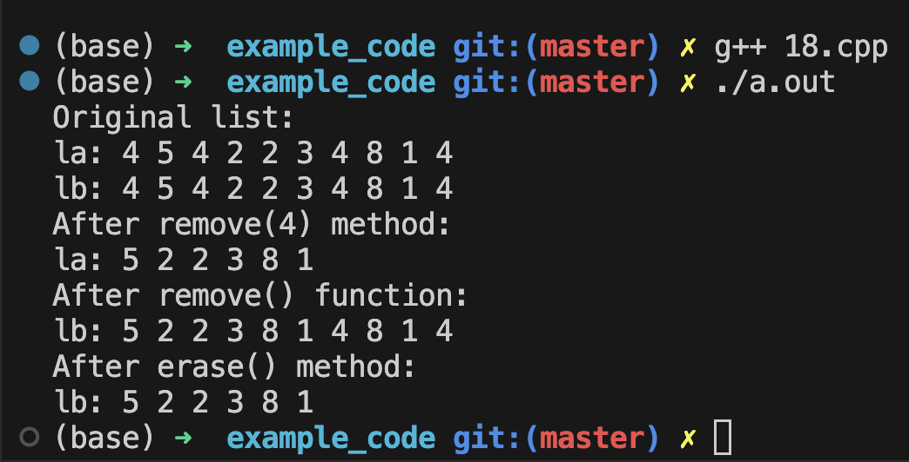

# string 類
C++11之前, stirng類就擁有下面前7個構造函數, 然後在C++11之後繼續引入了兩個, `一共9個`構造函數:


代碼示例:
```cpp
#include <iostream>
#include <string>
using namespace std;

int main(void)
{
    string one("Lottery Winner.");      // 使用構造函數1: string(const char *s)
    cout << one << endl;

    string two(20, '$');                // 使用構造函數2: string(size_type n, char c)
    cout << two << endl;

    string three(one);
    cout << three << endl;              // 使用構造函數3: string(const string &str)

    one += " Oops!";                    // 加法運算符重載
    cout << one << endl;                // 調用 "<<" 重載函數, 在末尾追加字符串

    two = "Sorry, That was ";           // 調用賦值運算符, 重新賦值
    three[0] = 'P';                     // 替換第一個字符

    string four = two + three;          // 調用了構造函數4: string()
    cout << four << endl;

    char alla[] = "All's well that ends well.";
    string five(alla, 20);              // 調用了構造函數5: string(const char *s, size_type n).  注意: 數組名就是指針
    cout << five << endl;

    string six(alla + 6, alla + 10);    // 調用了構造函數6: template<class Iter> string (Iter begin, Iter end).   注意: 索引區間是 "左閉右開" 的
    cout << six << ", ";

    string seven(&five[6], &five[10]);  // 還是使用第六個構造函數, 本質上來說, 這個構造函數填入的參數都是地址
    cout << seven << "..." << endl;

    // 從 four 字符串的第7個字符開始, 往後面取16個字符出來, 賦值給 eight
    string eight(four, 7, 16);          // 構造函數7: string(const string &str, string size_type pos = 0, size_type n = npos)
    cout << eight << endl;

    // C++ 11新增的構造函數
    // 新增1: 移動構造函數 string(string && str) noexcept, 這個構造函數的效果類似於拷貝構造, 但是它的入參不是 const, 意味著輸入的參數 str 是可以修改的(這裡會把str幹掉)
        // 在 18章 再詳細討論

    // 新增2: string(initializer_list<char> il)
    // string piano_man = {'L', 'i', 's', 'z', 't'};   // 其實就是允許一個個字符拼一起來初始化一個字符串

    return 0;
}
```


## string 類輸入
1. cin >> string 對象
2. getline(cin, string 對象)

這裡的區別是:
- 在第一種方法中, cin 是對象, 使用的是cin裡的成員函數, 而getline 中, cin 是作為參數

string 對象能**自動根據輸入的字符數量調整大小**, 但它是有存儲上限的:
- 其上限由 `string::npos` 指定.
- string 存儲的上限也跟內存大小有關

代碼例子 -- 從文件中輸入字符串:
```cpp
#include <iostream>
#include <fstream>      // 在第十七章詳細講解
#include <string>
#include <cstdlib>      // 用到了 EXIT_FAILURE

using namespace std;

int main(void)
{
    ifstream fin;

    fin.open("abc.txt");

    if(fin.is_open() == false){
        cerr  << "Can't open flie. Bye. ";   // cerr 只能輸出到標準輸出設備上(cout則還可以輸出到比如文本等其他位置上)
        exit(EXIT_FAILURE);
    }

    string item;
    int count = 0;
    getline(fin, item, ':');        // 從fin中讀取內容, 讀取的內容放到 item 中, 但遇到指定的 ':' 字符時停止讀取(不包含指定的字符)
    while(fin){
        ++count;
        cout << count << ": " << item << endl;
        getline(fin, item, ':'); 
    }

    fin.close();
    return 0;
}
```


## string 類的常用成員函數
在書本的`覆綠F`中有關於 stirng 類的詳細描述, 可以用到的時候去查表. (中文版書的page 862頁)

### find 方法
代碼例子 -- 猜字遊戲
- 最多有6次猜錯的機會
- 猜錯有提示還有幾次機會, 猜對的字符顯示出對應的位置

```cpp
#include <iostream>
#include <string>
#include <cctype>   // 用到 tolower 就要引入
#include <ctime>    // 用來設置隨機數種子
#include <cstdlib>  // 用到 rand() 就要引入

using namespace std;

const int NUM = 26;
const string wordlist[NUM] = {
	"apiary", "beetle", "cereal", "danger", "ensign", "florid",
	"health", "insult", "jackal", "keeper", "loaner", "manage",
	"nonce",  "onset",  "plaid",  "quilt",  "remote", "stolid",
	"train",  "useful", "valid",  "whence", "xenon",  "yearn",
	"zippy"
};

int main(void)
{
    char play;

    srand(time(0));     // 設置隨機數種子

    cout << "Will you play a word game? <y/n> ";
    cin >> play;
    tolower(play);  // 為了方便判斷, 全部轉小寫

    while(play == 'y'){
        string target = wordlist[rand() % NUM];     // 0~25 中隨機選一個數
        int length = target.length();
        string attempt(length, '-');
        string badchars;    // 歷史猜錯的字符
        int guess = 6;      // 最多允許猜 6 次
        cout << "Guess my secret word, it has " << length << " length, and you guess one character at a time. You get " << guess << " wrong guesses." << endl;

        cout << attempt << endl;
        while(guess > 0 && attempt != target){
            char letter;
            cout << "Guess a letter: ";
            cin >> letter;

            // 檢查是否猜過
            if(badchars.find(letter) != string::npos || attempt.find(letter) != string::npos){      // 如果輸入的字符有出現在輸錯的記錄中, 或者 正確字符中曾經出現過
                cout << "You have already guessed that, try again!" << endl;
                continue;
            }

            // 沒出現過:
            int loc = target.find(letter);
            if(loc == string::npos){        // 當前猜的字符在target中找到末尾也沒有找到 ==> 猜錯了
                cout << "Oh, Bad Guess!" << endl;
                guess --;
                badchars += letter;
            }
            else{                           // 猜對的情況
                cout << "Good Guess!" << endl;
                attempt[loc] = letter;      // 這裡只替換了一個字符
                while(loc != string::npos){
                    attempt[loc] = letter;
                    loc = target.find(letter, loc +1);
                };
                
            }
            // 猜完一輪, 輸出當前猜測狀態
            cout << "Your word: " << attempt << endl;
            if(attempt != target){
                if(badchars.length() > 0){
                    cout << "Bad choices: " << badchars << endl;
                }
                cout << guess << " bad guess left!" << endl;
            }
        }
        // 判斷猜完之後是否正確
        if( guess > 0 || attempt == target){
            cout << "That's right!" << endl;
        }
        else{
            cout << "Sorry, the word is: " << target <<  endl;
        }

        cout << "Will you play another time? <y/n>" << endl;
        cin >> play;
        tolower(play);  // 為了方便判斷, 全部轉小寫
    }
    return 0;
}
```

### reserve方法 和 capacity方法
在拼接字符串時, 我們知道 string 會自動調整存儲的大小, 以便放入新的的內容, 但如果大量執行這樣的操作將非常耗時
- 不能僅僅將已有字符串加大, 因為相鄰的內存空間可能已經被使用過了, 此時多半要重新找一塊內存才能完成這個過程.
  - 為此, C++一般在第一次分配空間的時候會**分配一個比指定字符串更大一些的空間**, 但是當字符串繼續增大並超過第一次分配的空間時, 此時**重新分配空間的時候會直接分配原來字符空間兩倍大小的內存塊**, 以此減少分配次數.

- capacity 方法: `返回當前分配`的內存塊大小
- reserve 方法: 用來`指定`分配的內存塊大小

代碼例子 -- 測試 capacity 和 reserve 方法
```cpp
#include <iostream>
#include <string>

using namespace std;

int main(void)
{
    string empty;
    string small = "bit";
    string larger = "Elephants are a girl's best friends.";

    cout << "Sizes: " << endl;
    cout << "\t Empty: " << empty.size() << endl;
    cout << "\t Small: " << small.size() << endl;
    cout << "\t Larger: " << larger.size() << endl;

    cout << "Capacities: " << endl;
    cout << "\t Empty: " << empty.capacity() << endl;
    cout << "\t Small: " << small.capacity() << endl;
    cout << "\t Larger: " << larger.capacity() << endl;

    empty.reserve(50);
    cout << "Capacity after empty.reserve(50): " << empty.capacity() << endl;
    return 0;
}
```
輸出:


# 智能指针模板类
背景:
- 在使用 new 运算符开辟内存时, 总是可能存在忘记写 delete 的情况, 这将给程序带来内存泄露的风险.

为了解决这个问题, 我们通常希望有一个类似于指针的类, 但是这个类在析构的时候能够自动调用 delete, 从而避免内存泄露的问题. --> **使用智能指针就可以不写 delete**.

C++ 中提供了4种智能指针模板类:
1. auto_ptr
   - 来自 C++98 标准, 在当前的 C++ 标准中大部分是弃用它的, 但是有些编译器仍然支持.
2. unique_ptr
3. shared_ptr
4. weak_ptr  (本书不讨论这种智能指针)


## 使用智能指针模板类
auto_ptr, unique_ptr 和 shared_ptr 都是定义了类似指针的`对象`, 这种对象可以`将new获得的地址`通过**直接或者间接的方式被赋值**.


demo例子:
```cpp
#include <memory>  // 使用智能指针一定要包含这个头文件
void demo()
{
    shared_ptr<double> ap(new double);     // ap 是一个 shared_ptr 对象, 它指向一个 double 类型的对象
    *ap = 25.5;                             // 通过 *ap 可以访问这个对象
    return;
}

/*
    解析:
        在执行 shared_ptr<double> ap(new double); 时, 会调用 shared_ptr 的构造函数, 该构造函数的参数是一个指针, 该指针指向一个 double 类型的对象. (自动捕获了 new 的返回的地址)

        在执行 *ap = 25.5; 时, 会调用 shared_ptr 的重载的 * 运算符, 该运算符返回的是一个 double 类型的引用, 然后将 25.5 赋值给这个引用. (等同于变量赋值)

        在执行 return 时, 会调用 shared_ptr 的析构函数, 该析构函数会释放 new 出来的内存.(这就是我们不需要关心 delete 的原因)
*/
```

模板`auto_ptr`的中包含下面的构造函数:
```cpp
template <class X>
class auto_ptr
{
    public:
        explicit auto_ptr(X *p = 0) throw();        
            
            /*
                explicit 防止隐式转换, 通过 throw() 来承接**内层函数**可能抛出来的异常;

                但这么写的 throw 也意味着这个构造函数是不会抛出异常的
                
                所以在新的C++标准中, 智能指针模板摒弃掉了这种写法, 当然 auto_ptr 这个类在大部分新版本编译器中也摒弃掉了.
            */
};
```

代码例子 -- `p5.cpp`
```cpp
#include <iostream>
#include <string>
#include <memory>

using namespace std;

class Report
{
    private:
        string str;
    public:
        Report(string s) : str(s){ cout << "Object created\n";}
        ~Report(){cout << "Object deleted\n";}    // 如果打印了这句话, 则证明智能指针自动调用了析构函数
        void comment(){cout << str << endl;}
};

int main(void)
{
    // 为了防止重定义...这里用花括号限定了变量的作用域...
    {
        // mac使用的g++编译器已经不支持auto_ptr了
        shared_ptr<Report> ps(new Report("Using shared_ptr")); 
        ps->comment();
    }

    {
        unique_ptr<Report> ps(new Report("Using unique_ptr"));
        ps->comment();
    }
    return 0;
}
```
输出:


### 智能指针注意事项
- 所有智能指针都拥有一个`explicit`构造函数, 避免自動轉換.
```cpp
shared_ptr<double> pd;
double *p_reg = new double;
pd = p_reg;                             // 由于 explicit 关键字, 这里不允许这么写
shared_ptr<double> pshared = p_reg;     // 由于 explicit 关键字, 这里不允许这么写  
pd = shared_ptr<double>(p_reg);         // 正确的写法
```

- 只能指针一定要用new来初始化, 不能用其他方式初始化.
```cpp
string vacation("I wandered lonely as a cloud.");
shared_ptr<string> pvac(&vacation);     // 由于只能指针的特性, 这里不允许这么写
```
  - 由于 new 运算符开辟的空间实际上位于`堆内存`, 同样地, delete 释放的也是`堆内存`空间, 而常规变量的地址位于`非堆内存`中, 所以这里不能用常规变量的地址来初始化智能指针.


#### 为什么 auto_ptr 被弃用
先看下面的代码:
```cpp
auto_ptr <string> ps(new string("I reigned lonely as a cloud."));
auto_ptr <string> vocation;
vocation = ps;
```
- 从代码中可以看到, vocation 和 ps 本质上指向的都是同一个内存地址(因为最后用了赋值运算符), 此时:
  - 当程序执行结束时, 系统首先析构 ps, 此时这个内存地址就被释放掉了, 紧接着, 系统又析构 vocation, 但是此时这个内存地址已经被释放掉了, 所以这里就会出现错误.

解决这种问题的办法:
1. 重定义`赋值运算符`, 规定在进行赋值的时候进行一次深拷贝(重新开辟一段空间, 并将内容拷贝进去), 这样就不会出现同一个内存地址释放两次的问题.
2. 建立`所有权(ownership)的概念`, 规定针对某个对象, 只能有一个智能指针拥有它, 这样只允许拥有所有权的智能指针可以释放该指针指向的内存地址; 然后, **定义赋值操作的行为变成转让所有权**.
   - 这实际上就是用于 `auto_ptr` 和 `unique_ptr` 的策略, 但是**unique_ptr 的策略更严格**
   - 对于 auto_ptr 来说, 当一个智能指针交出所有权之后, 这个**指针将无法再访问这个对象**(此时如果误操作, 进行了读取的话, 就会出现 **segmentation fault**!), 但是对于 unique_ptr 来说, 交出所有权之后, 这个指针仍然可以访问这个对象, 只是不能再释放这个对象了.
3. 创建智能更高的指针(其实就是一个计数器), 用于跟踪引用特定对象的智能指针数, 这称之为`引用计数(reference counting)`
   - 在赋值时, 计数加1, 指针过期时, 计数减1, 仅当最后一个指针过期时, 才触发它的析构函数进行delete.
   - **这实际上就是 shared_ptr 的策略**.


代码例子: 
```cpp
#include <memory>
#include <iostream>
#include <string>

using namespace std;

int main(void)
{
    auto_ptr<string> films[5] = 
    {
        auto_ptr<string>(new string ("ABC")),
        auto_ptr<string>(new string ("DEF")),
        auto_ptr<string>(new string ("GHI")),
        auto_ptr<string>(new string ("JKL")),
        auto_ptr<string>(new string ("XYZ")),
    };

    auto_ptr<string> pwin;
    pwin = films[2];            // 此时 films[2] 指针将没有了访问权限, 权限转交给 pwin 了; 此时的 films[2] 等同于一个空指针
    for(int i = 0; i < 5; i++){
        cout << *films[i] << endl;      // 到这里会触发 segmentation fault (core dump) 错误
    }

    cout << "The winner is " << pwin << endl;       // 这行代码是没问题的

    return 0;
}
```
- 转交权限之后, 原来的`auto_ptr`无法再次访问原来指向的对象, 这正是 auto_ptr 被弃用的根本原因.


#### auto_ptr 与 shared_ptr 的对比
上面例子改成用 shared_ptr 的话, 将不会有问题:
```cpp
#include <memory>
#include <iostream>
#include <string>

using namespace std;

// int main(void)
// {
//     auto_ptr<string> films[5] = 
//     {
//         auto_ptr<string>(new string ("ABC")),
//         auto_ptr<string>(new string ("DEF")),
//         auto_ptr<string>(new string ("GHI")),
//         auto_ptr<string>(new string ("JKL")),
//         auto_ptr<string>(new string ("XYZ")),
//     };

//     auto_ptr<string> pwin;
//     pwin = films[2];            // 此时 films[2] 指针将没有了访问权限, 权限转交给 pwin 了
//     for(int i = 0; i < 5; i++){
//         cout << *films[i] << endl;      // 到这里会触发 segmentation fault (core dump) 错误
//     }

//     cout << "The winner is " << pwin << endl;       // 这行代码是没问题的
//     return 0;
// }

int main(void)
{
    shared_ptr<string> films[5] = 
    {
        shared_ptr<string>(new string ("ABC")),
        shared_ptr<string>(new string ("DEF")),
        shared_ptr<string>(new string ("GHI")),
        shared_ptr<string>(new string ("JKL")),
        shared_ptr<string>(new string ("XYZ")),
    };

    shared_ptr<string> pwin;
    pwin = films[2];            // 此时 films[2] 指针 与 pwin 都指向同一个对象, 引用计数+1
    for(int i = 0; i < 5; i++){
        cout << *films[i] << endl;      // 到这里会触发 segmentation fault (core dump) 错误
    }

    cout << "The winner is " << *pwin << endl;       // 这行代码是没问题的
    return 0;
}
```
- 此时, pwin 和 films[2] 指向同一个对象, 而引用计数从1增加到2.
- 在程序末尾, 后声明的 pwin 首先调用它的析构函数(栈的特性, 后进先出), 析构函数会将引用计数从2减到1; 之后, 轮到 shared_ptr 数组进行析构, 对films[2]析构时, 引用计数减到0, 此时才会真正释放内存(真正调用 delete).


#### auto_ptr 与 unique_ptr 对比
对于 auto_ptr :
```cpp
// auto_ptr 部分
auto_ptr<string> p1(new string("auto_ptr"));
auto_ptr<string> p2;
p2 = p1;        // 此时 p1 将失去访问权限, 权限转交给 p2 了
```
- 在`p2 = p1;` 执行完后, p1 的所有权被剥夺, 这时候确实能解决多次释放同一个内存空间的问题, 但是如果后面我们不小心访问 p1 里面的东西的, 由于 p1 已经相当于空指针, 它将触发 **segmentation fault** 错误.

对于 unique_ptr :
```cpp
// unique_ptr 部分
unique_ptr<string> p1(new string("unique_ptr"));
unique_ptr<string> p2;
p2 = p1;        // 此时编译器会报错, 避免了 p1 不再指向有效数据的问题, 更安全
```

**编译的时候报错比运行的时候报错要好**, 所以 unique_ptr 比 auto_ptr 更安全.

一个 unique_ptr 赋值给另一个 unique_ptr 被允许的情况是:
- 将一个 unique_ptr 赋值给另一个 unique_ptr, 但是这个 unique_ptr 必须是一个`临时对象`(源指针必须是**临时右值**), 注意是临时, 很快就被销毁那种才可以!
    ```cpp
    // case1: 使用构造函数的返回值
    uniuqe_ptr<string> p3;
    p3 = unique_ptr<string> (new string("unique_ptr")); // 构造函数返回的是一个临时右值, 所以这里是允许的

    // case2: 使用 std::move() 函数
    uniuqe_ptr<string> p4;
    p4 = std::move(p3);         // 此时的 p3 会变成一个临时右值
    ```


相比于 auto_ptr, unique_ptr 还有一个优点是 它拥有用于数组的变体:
```cpp
std::unique_ptr<double[]> p1(new double[5]);        // 析构的时候会调用 delete[]

// auto_ptr 仅支持 new 和 delete, 并不支持 new[] 和 delete[]
```

## 如何选择智能指针
- 如果需要将多个指针指向同一个对象, 则使用 shared_ptr
- 不需要多个指针指向同一个对象, 则使用 unique_ptr


# 标准模板库(STL)
STL是C++的标准库的一种.

## 模板类vector
它是一种`容器`, 只要能装多个东西的我们都可以称为容器, 比如数组.

所有的STL容器都提供了一些基本方法:
```txt
size()  --> 返回容器中元素的个数
swap()  --> 交换两个容器的内容
begin() --> 返回一个指向容器中第一个元素的迭代器
end()   --> 返回一个指向容器中最后一个元素的下一个位置的迭代器 (超过容器尾的迭代器)
            对于字符串来说, end() 返回的其实就是 '\0' 的地址(本质上来说它并不是有效的元素)
```
- 迭代器(**iterator**)是一个`广义指针`
  - 迭代器对应的**类型**是一个`名为 iterator 的 typedef`, 它的**作用域是整个类**.
  - 事实上, 它可以是一个指针, 也可以对其执行类似指针的操作(如 使用*号解引用 和 使用++进行递增)
    - **平时怎么使用指针, 就怎么使用迭代器**
  - 通过迭代器, 让STL能为各种不同的容器类(包括简单指针无法处理的类)提供统一的接口
    - **所有的容器类都使用同一种东西进行管理**, 这就是迭代器的作用.


代码例子 -- `8.cpp`
```cpp
#include <iostream>
#include <string>
#include <vector>

using namespace std;

struct Review
{
    string title;
    int rating;
};

bool FillReview(Review &r);
void ShowReview(const Review &r);

int main(void)
{
    vector<Review> book;           // 用vector容器装结构体类型的对象, 近似于一个数组
    Review temp;

    while(FillReview(temp)){
        book.push_back(temp);       // 把temp放入容器的末尾, pushback()方法可以自动调整空间大小
    }

    int num = book.size();

    if(num > 0){
        cout << "You entered the following: " << endl;
        for (int i = 0; i < num; i++){
            ShowReview(book[i]);
        }

        cout << "Reprising: "  << endl;
        // 使用迭代器的方式访问元素
        vector<Review>::iterator pr;        // 拿到一个迭代器 pr
        for (pr = book.begin(); pr != book.end(); pr++){
            ShowReview(*pr);                // 对迭代器进行解引用, 拿到对象
        }

        vector<Review> oldlist(book);       // 使用复制构造函数
        if(num > 3){
            book.erase(book.begin()+1, book.begin()+3);  // 注意区间是 "左闭右开", 它不会操作 book.begin()+3 对应的元素
            cout << "After erasing: " << endl;
            // 使用迭代器的方式访问元素
            vector<Review>::iterator pr;        // 拿到一个迭代器 pr
            for (pr = book.begin(); pr != book.end(); pr++){
                ShowReview(*pr);                // 对迭代器进行解引用, 拿到对象
            }

            book.insert(book.begin(), oldlist.begin(), oldlist.begin()+2);      // insert(插入位置, 插入內容的起始地址, 插入内容的末尾地址), 这个地址范围也是 "左闭右开" 
            cout << "After inserting: " << endl;
            // 使用迭代器的方式访问元素
            for (pr = book.begin(); pr != book.end(); pr++){
                ShowReview(*pr);                // 对迭代器进行解引用, 拿到对象
            }
        }

        book.swap(oldlist); 
        cout << "After swapping: " << endl;
        // 使用迭代器的方式访问元素
        for (pr = book.begin(); pr != book.end(); pr++){
            ShowReview(*pr);                // 对迭代器进行解引用, 拿到对象
        }
    }
    else{
        cout << "Done." << endl;
    }

    return 0;
}

bool FillReview(Review &r)
{
    cout << "Please enter bool title (enter 'quit' to quit): ";
    getline(cin, r.title);
    if(r.title == "quit"){
        return false;
    }

    cout << "Enter book rating: " << endl;
    cin >> r.rating;
    if(!cin){                       // 输入异常的时候就会直接return
        return false;
    }
    while(cin.get() != '\n');       // 只要进行过 数字 和 字符 的输入, 就要考虑消除缓冲区的回车

    return true;
}
void ShowReview(const Review &r)
{
    cout << r.rating << "\t" << r.title << endl;
}
```

### vector 的其他可执行操作
STL的设计理念是: 从广泛的角度定义`非成员(non-menber)`函数来完成诸如 find() 和 sort() 等操作, 而不是定义成员函数.
- 如果定义为成员函数, 那么每个类里面都要写一次这个功能的函数, 非常麻烦(因为没有继承关系, 所以只能手写...) 

比较具有代表性的 STL 函数有:
- for_each()
- random_shuffle()
- sort()

---

对于 for_each(), 它的语法是:
```cpp
#include <algrithm>     // 需要引入算法这个头文件
for_each(容器的起始位置, 容器的终止位置, 针对容器里的元素执行的函数);
```

代码例子`9.cpp`:
```cpp
#include <iostream>
#include <string>
#include <vector>
#include <algorithm>        // 要使用 for_each 就需要引入這個頭文件

using namespace std;

struct Review
{
    string title;
    int rating;
};

bool FillReview(Review &r);
void ShowReview(const Review &r);

int main(void)
{
    vector<Review> book;           // 用vector容器装结构体类型的对象, 近似于一个数组
    Review temp;

    while(FillReview(temp)){
        book.push_back(temp);       // 把temp放入容器的末尾, pushback()方法可以自动调整空间大小
    }

    int num = book.size();

    if(num > 0){
        cout << "You entered the following: " << endl;
        // for (int i = 0; i < num; i++){
        //    ShowReview(book[i]);
        // }
        for_each(book.begin(), book.end(), ShowReview);


        cout << "Reprising: "  << endl;
        // 使用迭代器的方式访问元素
        vector<Review>::iterator pr;        // 拿到一个迭代器 pr
        // for (pr = book.begin(); pr != book.end(); pr++){
        //     ShowReview(*pr);                // 对迭代器进行解引用, 拿到对象
        // }
        for_each(book.begin(), book.end(), ShowReview);


        vector<Review> oldlist(book);       // 使用复制构造函数
        if(num > 3){
            book.erase(book.begin()+1, book.begin()+3);  // 注意区间是 "左闭右开", 它不会操作 book.begin()+3 对应的元素
            cout << "After erasing: " << endl;
            // 使用迭代器的方式访问元素
            vector<Review>::iterator pr;        // 拿到一个迭代器 pr
            // for (pr = book.begin(); pr != book.end(); pr++){
            //     ShowReview(*pr);                // 对迭代器进行解引用, 拿到对象
            // }
            for_each(book.begin(), book.end(), ShowReview);


            book.insert(book.begin(), oldlist.begin(), oldlist.begin()+2);      // insert(插入位置, 插入內容的起始地址, 插入内容的末尾地址), 这个地址范围也是 "左闭右开" 
            cout << "After inserting: " << endl;
            // 使用迭代器的方式访问元素
            // for (pr = book.begin(); pr != book.end(); pr++){
            //     ShowReview(*pr);                // 对迭代器进行解引用, 拿到对象
            // }
            for_each(book.begin(), book.end(), ShowReview);

        }

        book.swap(oldlist); 
        cout << "After swapping: " << endl;
        // 使用迭代器的方式访问元素
        // for (pr = book.begin(); pr != book.end(); pr++){
        //     ShowReview(*pr);                // 对迭代器进行解引用, 拿到对象
        // }
        for_each(book.begin(), book.end(), ShowReview);
    }
    else{
        cout << "Done." << endl;
    }

    return 0;
}

bool FillReview(Review &r)
{
    cout << "Please enter bool title (enter 'quit' to quit): ";
    getline(cin, r.title);
    if(r.title == "quit"){
        return false;
    }

    cout << "Enter book rating: " << endl;
    cin >> r.rating;
    if(!cin){                       // 输入异常的时候就会直接return
        return false;
    }
    while(cin.get() != '\n');       // 只要进行过 数字 和 字符 的输入, 就要考虑消除缓冲区的回车

    return true;
}
void ShowReview(const Review &r)
{
    cout << r.rating << "\t" << r.title << endl;
}
```


对于 random_shuffle(), 它的语法是:
```cpp
#include <algorithm>
random_shuffle(需要排序的容器起始地址, 需要排序的容器终止地址);           // 将容器里的指定范围里的元素随机排列(洗牌)

// 用上面的例子, 使用起来就是:
#include <algorithm>
random_shuffle(book.begin(), book.end());
```

对于 sort(), 它的语法是:
```cpp
#include <algorithm>
// 写法1: 默认的排序(从小到大)
sort(需要排序的容器起始地址, 需要排序的容器终止地址);

// 写法2: 通过定义一个函数来指定排序的方式
sort(需要排序的容器起始地址, 需要排序的容器终止地址, 指定排序方式的函数);

/*
    1. sort() 默认是 "从小到大" (升序) 排序 
    2. 由于有些变量(比如字符串)是不能直接比较大小的, 我们需要重载"小于号"
*/
```

代码例子 -- `9.cpp`
```cpp
#include <iostream>
#include <string>
#include <vector>
#include <algorithm>        // 要使用 for_each 就需要引入這個頭文件

using namespace std;

struct Review
{
    string title;
    int rating;
};

bool FillReview(Review &r);
void ShowReview(const Review &r);
bool operator<(const Review r1, const Review r2);
bool worserThan(const Review r1, const Review r2);

int main(void)
{
    vector<Review> book;           // 用vector容器装结构体类型的对象, 近似于一个数组
    Review temp;

    while(FillReview(temp)){
        book.push_back(temp);       // 把temp放入容器的末尾, pushback()方法可以自动调整空间大小
    }

    int num = book.size();

    if(num > 0){
        cout << "You entered the following: " << endl;
        // for (int i = 0; i < num; i++){
        //    ShowReview(book[i]);
        // }
        for_each(book.begin(), book.end(), ShowReview);


        cout << "Reprising: "  << endl;
        // 使用迭代器的方式访问元素
        vector<Review>::iterator pr;        // 拿到一个迭代器 pr
        // for (pr = book.begin(); pr != book.end(); pr++){
        //     ShowReview(*pr);                // 对迭代器进行解引用, 拿到对象
        // }
        for_each(book.begin(), book.end(), ShowReview);


        vector<Review> oldlist(book);       // 使用复制构造函数
        if(num > 3){
            book.erase(book.begin()+1, book.begin()+3);  // 注意区间是 "左闭右开", 它不会操作 book.begin()+3 对应的元素
            cout << "After erasing: " << endl;
            // 使用迭代器的方式访问元素
            vector<Review>::iterator pr;        // 拿到一个迭代器 pr
            // for (pr = book.begin(); pr != book.end(); pr++){
            //     ShowReview(*pr);                // 对迭代器进行解引用, 拿到对象
            // }
            for_each(book.begin(), book.end(), ShowReview);


            book.insert(book.begin(), oldlist.begin(), oldlist.begin()+2);      // insert(插入位置, 插入內容的起始地址, 插入内容的末尾地址), 这个地址范围也是 "左闭右开" 
            cout << "After inserting: " << endl;
            // 使用迭代器的方式访问元素
            // for (pr = book.begin(); pr != book.end(); pr++){
            //     ShowReview(*pr);                // 对迭代器进行解引用, 拿到对象
            // }
            for_each(book.begin(), book.end(), ShowReview);

        }

        book.swap(oldlist); 
        cout << "After swapping: " << endl;
        // 使用迭代器的方式访问元素
        // for (pr = book.begin(); pr != book.end(); pr++){
        //     ShowReview(*pr);                // 对迭代器进行解引用, 拿到对象
        // }
        for_each(book.begin(), book.end(), ShowReview);

        // ------- 测试 random_shuffle() -----
        cout << "After random shuffle: " << endl;
        random_shuffle(book.begin(), book.end());
        for_each(book.begin(), book.end(), ShowReview);

        // ------- 测试 sort() -----
        // case1: 测试默认情况下的 sort, 从小到大排序
        cout << "After sorting:" << endl;
        sort(book.begin(), book.end());         // 内部会调用 运算符< 来比较, 由于这里实际上是Review对象进行大小比较, 并且Review里面存在字符串, 所以我们需要重载一下这个运算符
        for_each(book.begin(), book.end(), ShowReview);

        cout << "After sorting2:" << endl;
        sort(book.begin(), book.end(), worserThan);         // 内部会调用 运算符< 来比较, 由于这里实际上是Review对象进行大小比较, 并且Review里面存在字符串, 所以我们需要重载一下这个运算符
        for_each(book.begin(), book.end(), ShowReview);
    }
    else{
        cout << "Done." << endl;
    }

    return 0;
}

bool FillReview(Review &r)
{
    cout << "Please enter bool title (enter 'quit' to quit): ";
    getline(cin, r.title);
    if(r.title == "quit"){
        return false;
    }

    cout << "Enter book rating: " << endl;
    cin >> r.rating;
    if(!cin){                       // 输入异常的时候就会直接return
        return false;
    }
    while(cin.get() != '\n');       // 只要进行过 数字 和 字符 的输入, 就要考虑消除缓冲区的回车

    return true;
}
void ShowReview(const Review &r)
{
    cout << r.rating << "\t" << r.title << endl;
}


// 这里返回的 true 表示 r1 小于 r2
bool operator<(const Review r1, const Review r2)
{
    // 这里排序的方式是: 优先按照title(字符串)顺序进行排序
    if(r1.title < r2.title)
        return true;
    else if(r1.title == r2.title && r1.rating < r2.rating )
        return true;
    else
        return false;
}

bool worserThan(const Review r1, const Review r2)
{
    // 这里排序的方式是: 优先按照rating顺序进行排序
    if(r1.rating < r2.rating)
        return true;
    else{
        return false;
    }
}
```

--- 

## 基于范围的for循环
代码例子:
```cpp
double prices[5] = {4.99, 10.99, 6.87, 7.99, 8.49};
for(double x : prices){     // 直接把数组里面的元素赋值给 x
    cout << x << endl;
}
```


# 泛型编程
面向对象编程关注的是`数据方面`, 比如关注数据的保护, 使用 private/protected 来限制数据的访问权限.
- 比如`模板`, 是针对不同数据类型进行
泛型编程关注的是`算法方面`, 比如关注算法的复用, 使用模板来实现算法的复用.
- 泛型不仅可以处理队列, 还能处理容器
- 泛型的实现需要依靠`迭代器(iterator)`

泛型编程的核心思想:
- 利用迭代器, 使得不同容器在调用同一个算法函数的时候不需要进行修改(只需要设置合适的迭代器即可), 从而实现算法的复用.

## 迭代器类型
背景:
- 对于 find 算法, 不难察觉出它只是需要查看数据, 而不需要修改数据; 同时, 为了能让迭代器遍历所有元素, 需要使用到 ++运算符.
- 对于 sort 算法, 它要求迭代器能实现随机访问(如`iter+10`的操作), 为了完成排序, 它还要求能读写元素
因此, **不同的算法对迭代器是有要求的**, 故出现了不同类型的迭代器.

STL中提供了5种迭代器:
1. 输入迭代器
2. 输出迭代器
3. 正向迭代器
4. 双向迭代器
5. 随机访问迭代器

这里不展开讲解, 用到的时候查表...

## 迭代器的层次结构

`正向迭代器`具有`输入迭代器 和 输出迭代器`的**全部功能**, 同时还有自己的功能.
`双向迭代器`具有`正向迭代器`的**全部功能**, 同时还有自己的功能.
`随机访问迭代器`具有`正向迭代器`的**全部功能**, 同时还有自己的功能.


由于这些迭代器具有层次关系, 因此我们**在编写算法的时候, 应该尽可能使用要求最低的迭代器**, 以实现对复杂迭代器的兼容性.

代码例子`10.cpp` -- 使用 copy,reverse_iterator 
```cpp
#include <iostream>
#include <iterator>
#include <vector>

using namespace std;

int main(void)
{
    int casts[10] = {1, 2, 3, 4, 5, 6, 7, 8, 9, 10};
    vector<int> dice(10);
    
    // 将数组的内容拷贝到容器中
    copy(casts, casts+10, dice.begin());        // copy(源变量开始地址, 源变量结束地址, 目标容器存放数据的起始地址)

    ostream_iterator<int, char> out_iter(cout, " "); // STL提供的输出迭代器的模板: ostream_iterator<原来的类型, 用于输出的类型> 变量名(输出流对象, 内容分隔字符)
    copy(dice.begin(), dice.end(), out_iter);   // 用copy拷贝数据过到输出迭代器 out_iter, 前面已经将out_iter与cout关联起来, 故能完成输出
    cout << endl;
    cout << "----------" << endl;

    // 用倒序输出
    copy(dice.rbegin(), dice.rend(), out_iter);   // rbegin: 倒数的开始; rend: 倒数的结束
    cout << endl;
    cout << "----------" << endl;

    // 注意: rbegin 和 rend 返回的是 reverse_iterator 类型
    vector<int>::reverse_iterator ri;   // 因为 dice 是vector<int>类型, 所以这里从 vector<int> 中获取 反向迭代器 
    for(ri = dice.rbegin(); ri != dice.rend(); ri++){
        cout << *ri << " ";
    }
    cout << endl;
    return 0;
}
```
这里使用到的知识点:
```cpp
// copy 函数
copy(casts, casts+10, dice.begin());        // copy(源变量开始地址, 源变量结束地址, 目标容器存放数据的起始地址)
copy(dice.begin(), dice.end(), out_iter);   // 用copy函数可以直接将内容拷贝到输出迭代器中, 直接完成输出过程.

// 定义了一个 ostream_iterator 类型的变量 out_iter, 它是一个输出迭代器
ostream_iterator<int, char> out_iter(cout, " "); // STL提供的输出迭代器的模板: ostream_iterator<原来的类型, 用于输出的类型> 变量名(输出流对象, 内容分隔字符)
```


代码例子`11.cpp` -- 使用 back_insert_iterator, insert_iterator
```cpp
#include <iostream>
#include <vector>
#include <algorithm>
#include <string>
#include <iterator>

using namespace std;

void output(string &s)
{
    cout << s << " ";
}

int main(void)
{
    string s1[4] = {"abc", "def", "ghi", "jkl"};
    string s2[2] = {"Hello", "world"};
    string s3[2] = {"good", "morning"};

    vector<string> words(4);
    copy(s1, s1+4, words.begin());
    for_each(words.begin(), words.end(), output);
    cout << endl;

    // ---- 测试 back_insert_iterator<类型名> (容器对象) 的使用 ------
    copy(s2, s2+2, back_insert_iterator<vector<string> >(words));   // 对 words 对象创建迭代器, 然后拷贝数据到words中.
    /*
        1. 使用 back_insert_iterator<vector<string> >(words) 创建了一个匿名的 迭代器
        2. 这个迭代器相当于 words 的指针, 所以可以直接填入 copy 中, 作为 目标对象的地址
    */
    for_each(words.begin(), words.end(), output);
    cout << endl;

    // ---- 测试 insert_iterator<类型名> (容器对象, 容器的某个元素位置的地址) 的使用
    copy(s3, s3+2, insert_iterator<vector<string> > (words, words.begin()));   // 对 words 对象创建迭代器(这里指定在起始位置插入内容), 然后拷贝数据到words中.
    /*
        1. 使用 insert_iterator<vector<string> >(words, words.begin()) 创建了一个匿名的 迭代器, 同时指定了插入内容的位置
        2. 这个迭代器相当于 words 的指针, 所以可以直接填入 copy 中, 作为 目标对象的地址
    */
    for_each(words.begin(), words.end(), output);
    cout << endl;

    return 0;
}
```

## 容器的种类
容器: 能组织数据存储的东西, 都称为容器.
太多了... 用的时候去查表... --> 中文书的`附录G.3开始`

### 一些库函数的使用例子
一些库函数的使用例子 -- `12.cpp`
```cpp
#include <iostream>
#include <list>
#include <iterator>
#include <algorithm>

using namespace std;

void outint(int n)
{
    cout << n << " ";
}

int main(void)
{
    list<int> one(5, 2);        // 列表中一共5个元素, 每个元素初始化为2

    cout << "list one\t: ";
    for_each(one.begin(), one.end(), outint);
    cout << endl;

    int stuff[5] = {1, 2, 4, 8, 6};
    list<int> two;
    two.insert(two.begin(), stuff, stuff+5);   // two.insert(插入的起始位置, 待写入数据的起始位置, 待写入数据的结束位置)   
    cout << "list two\t: ";
    for_each(two.begin(), two.end(), outint);
    cout << endl;

    int more[6] = {6, 4, 2, 4, 6, 5};
    list<int> three(two);       // 拷贝构造
    three.insert(three.end(), more, more+6);    // 把more的内容插到 three.end() 之前
    cout << "list three\t: ";
    for_each(three.begin(), three.end(), outint);
    cout << endl;

    // 在three中删掉所的4
    cout << "List three minus 4s: ";
    three.remove(4);                // 删除元素4
    for_each(three.begin(), three.end(), outint);
    cout << endl;

    // 拼接 --> splice
    cout << "List three after splice: ";
    three.splice(three.begin(), one);       // 把 one 的内容添加到 three 的开头, 此时 one 的元素都还在
    for_each(three.begin(), three.end(), outint);
    cout << endl;

    // 删除 "连续的相同元素" 中 除第一个元素之外 的所有元素.
    cout << "List three after unique: ";
    three.unique();     // 效果举例: 33132 --> 3132  (针对连续元素去重)
    for_each(three.begin(), three.end(), outint);
    cout << endl;

    // 升序排序 + 连续元素去重
    cout << "List three after sort & unique: ";
    three.sort();
    three.unique();
    for_each(three.begin(), three.end(), outint);
    cout << endl;

    // 合并 --> merge
    cout << "Sorted two merged into three: ";
    two.sort();      
    three.merge(two); // merge之后, two就被清空
    for_each(three.begin(), three.end(), outint);
    cout << endl;

    cout << "After merge, two's size: " << two.size() << endl;      // 输出 0
    return 0;
}
```

# 关联容器 (associative container)
关联容器是一种`键值对`的容器, 对比python语言的话, 就是python的字典.
- 使用`键(key)`来查找`值(value)`

关联容器的特点:
- 能够快速访问元素
- 允许插入元素, 但是不能指定元素的位置.

关联容器通常是使用某种树形结构实现的, 而树是一种数据结构(这里不展开讲解).

STL一共提供了4种关联容器:
- set
- multiset
- map
- multimap
set 和 multiset 在使用时需要包含头文件, 即`#include <set>`; map 和 multimap 在使用时需要包含头文件, 即`#include <map>`


## set 与 multiset
- set 的键与值是**同一个东西**, 且键是唯一的, 即**set中没有重复的元素**.
- multiset 与 set 类似, 只不过multiset中**允许有重复的元素**.

set的使用例子 -- `13.cpp`
```cpp
/*
    演示set的一些基本用法
*/
#include <iostream>
#include <string>
#include <set>
#include <iterator>
#include <algorithm>

using namespace std;

const int N = 6;

int main(void)
{
    string s1[N] = {"buffoon", "thinkers", "for", "heavy", "can", "for"};
    string s2[N] = {"metal", "any", "food", "elegant", "deliver", "for"};

    // set 是一个模板类!
    set<string> A(s1, s1 + N);      // 构造函数里填写的其实是 "迭代器", 本质上就是一个广义指针, 就是地址而已
    set<string> B(s2, s2 + N);

    ostream_iterator<string, char> out(cout, " ");     // 创建输出流迭代器, 迭代器把string转成char类型, 构造函数中传入 cout 表示需要将内容输出到标准输出设备, 输出的每一个元素用空格隔开
    cout << "Set A: ";
    copy(A.begin(), A.end(), out);   // 打印出来可以发现元素去重了, 而且根据字母顺序排序过的
    cout << endl;
    cout << "Set B:";
    copy(B.begin(), B.end(), out);
    cout << endl;

    // 两个集合进行合并 & 排序 & 去重
    cout << "Union of A and B: " << endl;
    set_union(A.begin(), A.end(), B.begin(), B.end(), out);
    cout << endl;

    // 求交集 & 排序 & 去重
    cout << "Intersectino of A and B: ";
    set_intersection(A.begin(), A.end(), B.begin(), B.end(), out);
    cout << endl;

    // 求A中元素不在B中出现的部分 & 排序 & 去重
    cout << "Difference of A and B: ";
    set_difference(A.begin(), A.end(), B.begin(), B.end(), out);  // 输出 在A中 但 不在B中 的元素.
    cout << endl;

    // 
    set<string> c;
    cout << "Set C: " << endl;
    set_union(A.begin(), A.end(), B.begin(), B.end(), insert_iterator<set<string> >(c, c.begin()));  
    /*
        要注意: 
            xx.begin() 返回的是一个常量迭代器, 如果这里直接使用 begin() 方法, 这将导致无法写入数据到C中!
            使用 insert_iterator<> 模板时, 需要注意模板的类型参数填写的是 实例化的容器类型, 这里写的是 set<string> 
    */
    copy(c.begin(), c.end(), out);
    cout << endl;

    string s3("grunngy");
    c.insert(s3);
    cout << "Set c after insertion: " << endl;
    copy(c.begin(), c.end(), out);
    cout << endl;

    cout<< "Showing a range: " << endl;
    copy(c.lower_bound("ghost"), c.upper_bound("spook"), out);
    /*
        lower_bound: 将 键(key) 作为参数, 返回一个迭代器, 这个迭代器指向 "第一个不小于该键参数的成员" 
        upper_bound: 同样将 key 作为参数, 返回的也是一个迭代器, 它指向 "第一个大于该键参数的成员"
    */
    cout << endl;

    return 0;
}
```

---

## map 与 multimap
map 与 multimap 的区别是: 
- map不允许相同key值存在，multimap则允许相同的key值存在

multimap 与 set 相似, 它也是`可反转的`, `经过排序`的关联容器, 但**它的键和值的类型不同**, 并且**同一个键可以对应多个值**.
声明语法:
```cpp
multimap<key类型, value类型> 变量名;
map<key类型, value类型> 变量名;

// 如:
multimap<string, int> codes;        // key 为 string 类型, value 为 int 类型
map<string, int> map1;
```

代码例子 -- multimap 的使用 -- `14.cpp`:
```cpp
#include <iostream>
#include <string>
#include <map>
#include <iterator>
#include <algorithm>

using namespace std;

typedef int KeyType;
typedef multimap<KeyType, string> MapCode;
typedef pair<KeyType,string> Pair;

int main(void)
{
    MapCode codes;                      // key 为 int, value 为 string
    codes.insert(Pair(10, "Beijing"));      // 由于insert只能接受 一个 参数, 所以这里为了传入 key-value, 就使用了 pair<int,string> 数据类型
    codes.insert(Pair(21, "Shanghai")); 
    codes.insert(Pair(22, "Tianjin")); 
    codes.insert(Pair(23, "Chongqing")); 
    codes.insert(Pair(24, "Shenyang")); 
    codes.insert(Pair(22, "Nanjing")); 

    cout << "Number of cities with area code 22: " << codes.count(22) << endl;

    MapCode::iterator it;
    cout << "Area code \t city" << endl;
    for(it = codes.begin(); it != codes.end(); it++ ){
        cout << (*it).first << " \t\t " << (*it).second << endl;   // first 对应键, second 对应值
    }

    cout << "Cities with area code 22: " << endl;
    pair<MapCode::iterator, MapCode::iterator> range =  codes.equal_range(22);            // pair 可以把两种类型的值放到一个对象中
    /*
        equal_range()方法返回两个迭代器(两个指针), 第一个是 "匹配到指定key的第一个元素的位置", 第二个是 "匹配到指定key的最后一个元素的位置的下一个位置(超尾)"
    */

    for(it = range.first; it != range.second; it++){        // range里的 second 指的是 MapCode::iterator
        cout << (*it).second << endl;       // it 的 second 指的是 MapCode (其实是multimap) 里的 value
    }
    return 0;
}
```


## 无序关联容器(C++11新增的特性)
无序关联容器也是将 key 与 value 关联起来, 并使用 key 来查找value.

有序与无序关联容器的区别在于:
- 无序关联容器是`基于哈希表`实现的, 旨在**提高添加和删除元素的速度**.
- 而有序关联容器是`基于树`实现的. 

无序关联容器一共有4种:
1. unordered_set
2. unordered_multiset
3. unordered_map
4. unordered_multimap

这里不进行详细介绍, 在中文版书的`附录G`中可以查. (后面看数据结构的时候再写相关的笔记...)


# 函数对象
函数对象也叫`函数符(functor)`或`仿函数`.
- 函数符本质上就是一个`类的对象`, 只不过它是`与圆括号一起使用的对象`.
- 这种类, 在成员函数中**重载了圆括号**`operator()(参数)`

例子:
```cpp
class Linear
{
    private:
        double slop;
        double y0;
    public:
        Linear(double s1_ = 1, double y_ = 0) : slop(s1_), y0(y_) {}
        double opearator()(double x) const {return slop * x + y0;}          // 重载了()运算符
};

// 使用这个类时:
Linear f1;
Linear f2(2.5, 10.0);
double y1 = f1(2.5);            // f1 是 Linear 的一个对象, 由于重载了()运算符, 所以这里看起来像是调用函数
double y2 = f2(0.4);
```

对于前面用过的`for_each()`函数, 我们可以注意到它一共有三个参数:
```cpp
for_each(起始迭代器, 终止迭代器, 函数/函数符);
/*
    注意第三个参数: 它既可以传入一个函数名, 也可以传入一个函数符.
        对于传入函数的情况, 我们不能直接把它声明为一个 "函数指针", 因为函数指针 需要规定参数 的形式, 而STL需要兼容任意类型. 
        于是, 解决办法就是使用模板.
*/

// for_each()函数的声明:
template<class InputIterator, class Function>       // 用模板来实现兼容任意类型
Function for_each(InputIterator first, InputIterator last, Function f);
```
在前面的例子中, 我们传入过 `ShowReview` 这个函数名, 它对应的类型是`void (*)(const Review &r);`, 这也是给 for_each 传参时 `class Function` 中 Function 被赋予的类型; 对于不同的函数调用, Function 参数就可以表示`具有重载的()运算符`的**类类型**, 这使得 for_each 的第三个参数可以在使用时拥有 f() 的形式. 
- 对于传入函数的名的情况, f() 中的 f 指向了一个函数指针
- 对于传入函数对象(函数符)的情况, f 指向了一个类的对象, 这个类的内部必须包含重载 operator() 的代码.


## 函数符概念
- 生成器(generator): 没有参数的函数符
- 一元函数(unary function): 有一个参数的函数符
- 二元函数(binary function): 有两个参数的函数符
- 谓词(Predicate): **返回 bool值**, 并且只有一个参数的函数符 (返回bool值的一元函数)
- 二元谓词(binary predicate): **返回 bool值**, 并且有两个参数的函数符 (返回bool值的二元函数)

代码例子 -- `15.cpp`:
```cpp
#include <iostream>
#include <list>
#include <algorithm>
#include <iterator>

using namespace std;

void outint(int n);

template <class T>
class TooBig
{
    private:
        T cutoff;
    public:
        TooBig(const T &t) : cutoff(t) {}
        bool operator()(const T &v){ return v > cutoff;};       // 一元谓词
};

int main(void)
{
    TooBig<int> f100(100);
    int val[10] = {50, 100, 90, 180, 60, 210, 415, 28, 188, 201};
    list<int> yadayada(val, val + 10);      // 传入迭代器
    list<int> etcetera(val, val + 10);

    cout << "Original list: " << endl;
    for_each(yadayada.begin(), yadayada.end(), outint);
    cout << endl;

    for_each(etcetera.begin(), etcetera.end(), outint);
    cout << endl;

    cout << "Trimmed lists: " << endl;
    // 删掉 yadayada中 大于 f100.cutoff 的元素
    yadayada.remove_if(f100);     // remove_if 的参数是一个"谓词", 是一个函数符, 也就是一个类的对象(该对象有能被称为"谓词"的成员函数)
    for_each(yadayada.begin(), yadayada.end(), outint);
    cout << endl;

    // 将 etcetera 里的每一个元素与 200 比较, 然后删掉大于 200 的元素
    etcetera.remove_if(TooBig<int>(200));
    for_each(etcetera.begin(), etcetera.end(), outint);
    cout << endl;
    return 0;
}

void outint(int n)
{
    cout << n << " ";
}
```

---

# STL 中的算法函数
STL的算法库分为4种:
- 非修改式序列操作
- 修改式序列操作
- 排序和相关操作
- 通用数字运算
前三种包含在 `<algorithm>` 头文件中, 最后一种包含在 `<numeric>` 头文件中.

代码例子1 -- 字符串的排列组合 `17.cpp`
```cpp
/*
    主要使用 next_permutation()
*/
#include <iostream>
#include <algorithm>
#include <string>

using namespace std;

int main(void)
{
    string letters;
    cout << "Enter the letter group (enter quit to quit): ";
    while(cin >> letters && letters != "quit"){
        cout << "Permutetation: " << endl;
        // 为了能输出所有排列组合, 先进行一次sort排序
        sort(letters.begin(), letters.end());
        while(next_permutation(letters.begin(), letters.end())){     // 使用 STL 算法进行排列组合: 它是按照字母递增的顺序判断是否还能进行排序的, 只要还能进行重新排序, 就会返回 true; 当字母已经按照倒序排序时, 将不会进行排列组合.
            cout << letters << endl;
        }
        cout << "Enter the next letter group (enter quit to quit): ";
    }
    return 0;
}
```

代码例子2 -- 
```cpp
/*
    测试 remove() 
*/
#include <iostream>
#include <algorithm>
#include <list>

using namespace std;

const int LIM = 10;

void Show(int n);

int main(void)
{
    int ar[LIM] = {4, 5, 4, 2, 2, 3, 4, 8, 1, 4};

    list<int> la(ar, ar + 10);
    list<int> lb(ar, ar + 10);

    cout << "Original list: " << endl;
    cout << "la: ";
    for_each(la.begin(), la.end(), Show);
    cout << endl;
    cout << "lb: ";
    for_each(lb.begin(), lb.end(), Show);
    cout << endl;

    // 通过对象使用 remove: 不仅删除元素, 还对列表的大小做了改变
    la.remove(4);       // 删除所有为4的元素
    cout << "After remove(4) method: " << endl;
    cout << "la: ";
    for_each(la.begin(), la.end(), Show);
    cout << endl;

    // 使用 STL 的 remove(): 只删除对应元素, 但是不改变原来列表的大小, 由于删除而多出来的几个位置将填入无法确定的数值(这段内存地址本来存了什么值就直接拿出来塞进去了)
    list<int>::iterator last;                       //存储 remove 返回的超尾迭代器
    last = remove(lb.begin(), lb.end(), 4);         // remove会返回一个 "超尾" 迭代器
    cout << "After remove() function: " << endl;
    cout << "lb: ";
    for_each(lb.begin(), lb.end(), Show);           // 从输出结果可以看到, remove() 输出还是10个元素, 虽然已经删除了4, 但是输出结果的时候, 它不仅输出了删除4之后的结果, 为了保持原来的列表长度会多输出几个数, 但多出来的元素的值就不确定了
    cout << endl;

    // 为了保证使用 remove() 之后能改变容器的大小, 应该配合使用 .erase() 方法
    lb.erase(last, lb.end());
    cout << "After erase() method: " << endl;
    cout << "lb: ";
    for_each(lb.begin(), lb.end(), Show);           // 此时就把多余的元素清掉了
    cout << endl;

    return 0;
}

void Show(int n)
{
    cout << n << " ";
}
```

输出:



