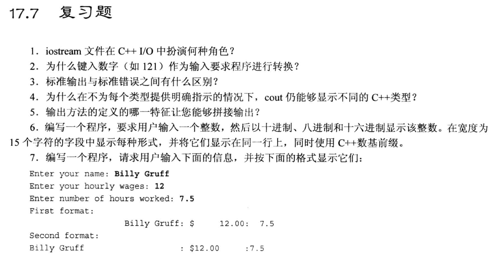
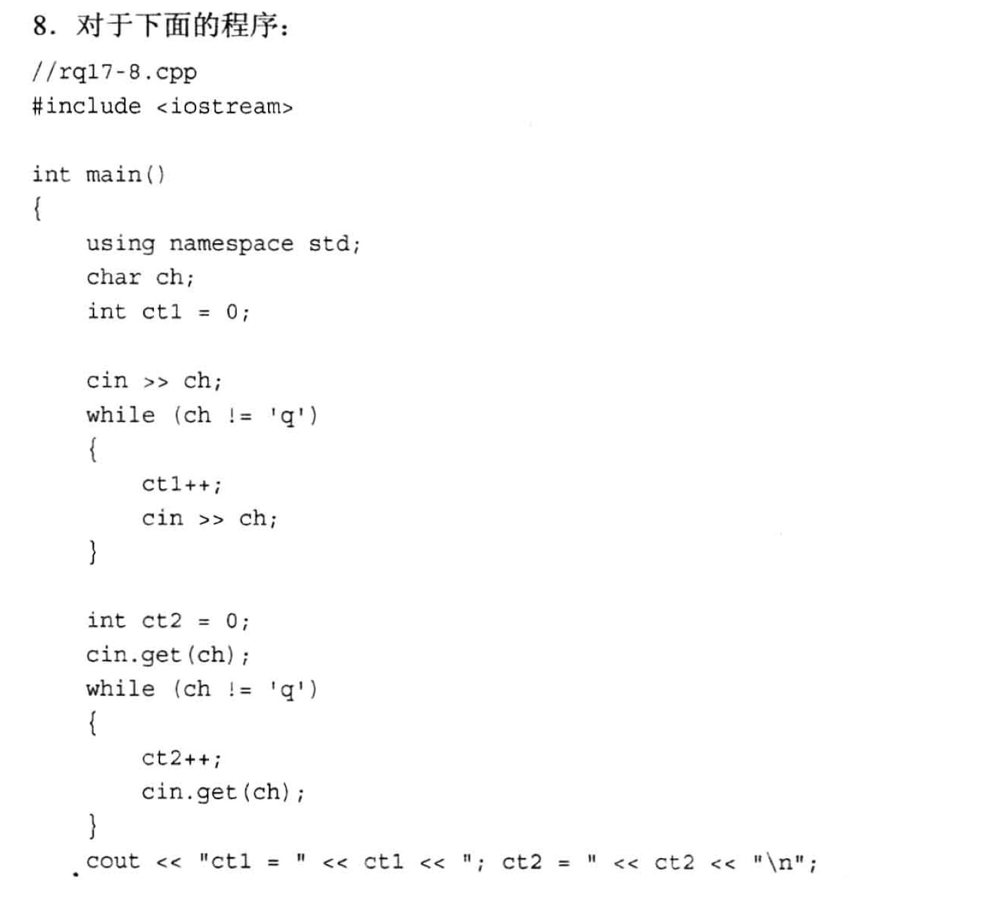
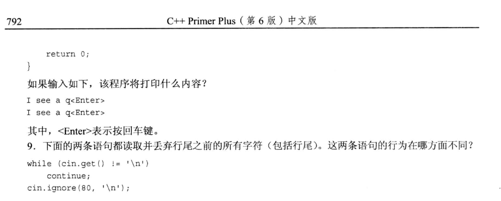

# 题目





# 1.
```txt
定义了管理(标准)输入输出的类.
这些类不仅可以输出到屏幕, 也可以输出到文件.
```


# 2.
```txt
键盘输入时, 存入缓冲区的其实是字符 (char 类型), 因此当我们需要存入某个变量时, 是需要进行类型转换的(由运算符 >> 来完成).
    转换后, 存储在变量对象的内存地址中的其实是二进制表示(无论它是 long, double, float 还是 int)
```

# 3.
```txt
标准输出与标准错误, 默认都是输出到显示器上.
    标准输出如果后面紧跟着一个 "重定向( > 运算符)", 则不会输出到屏幕上, 而是输出到指定的位置(如文件)
    标准错误是一定要显示到显示器上的.
```

# 4. 
```txt
中文书 page 737.
    对于每一种数据类型, ostream 类都提供了 operator<<() 的函数定义(重载函数), 因此, 在使用 "cout << " 时, 就会自动调用相应的重载函数进行输出.
```

# 5.
```txt
拼接输出: 
    cout << 内容1 << 内容2 << ... << << endl;     // 将多段内容拼接输出

能拼接输出的理由是 operator<<() 返回了 "ostream &", 所以可以继续调用对象的 operator<<() 函数.
```

# 6.
```cpp
#include <iostream>
#include <iomanip>  // 为了设置显示宽度必须引入

using namespace std;

int main(void)
{
    int n;
    cout << "Enter a integer: ";
    cin >> n;

    // 宽度15
    cout << showbase;       // 设置输出数字时加上进制的前缀
    cout << setw(15) << n                   // 到这里显示的是宽度15的十进制数
        << hex << setw(15) << n             // 到这里显示的是宽度15的十六进制数
        << setw(15) << oct << n << endl;    // 到这里显示的是宽度15的八进制数
    return 0;
}
```

# 7.


