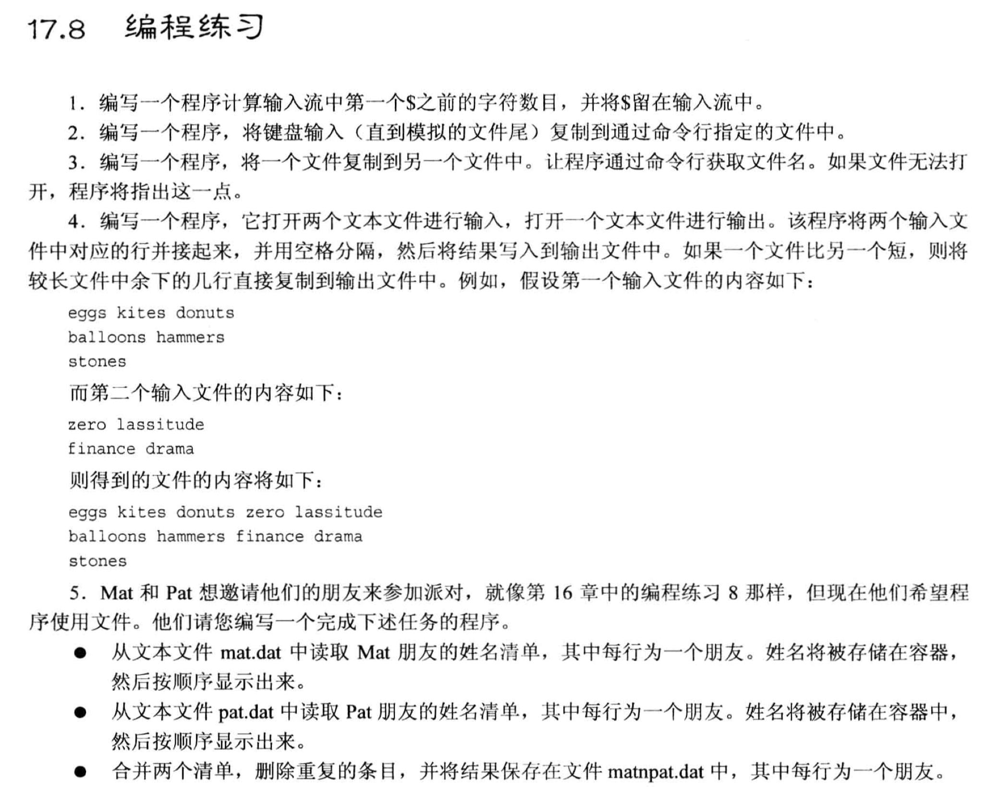
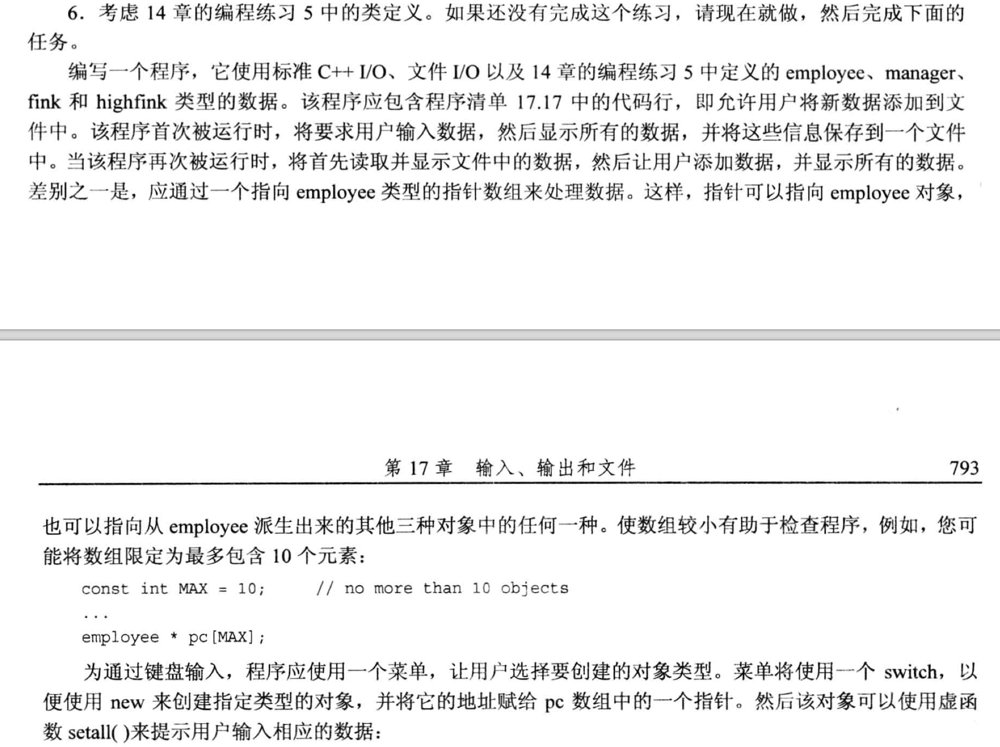
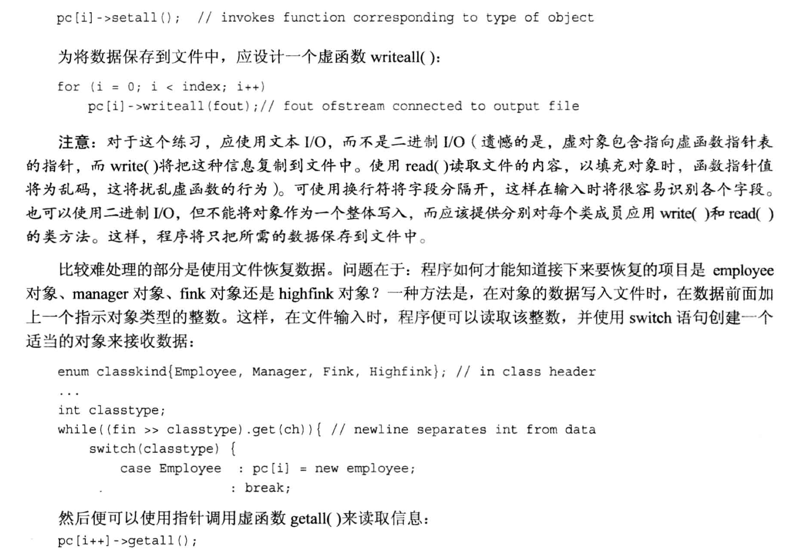
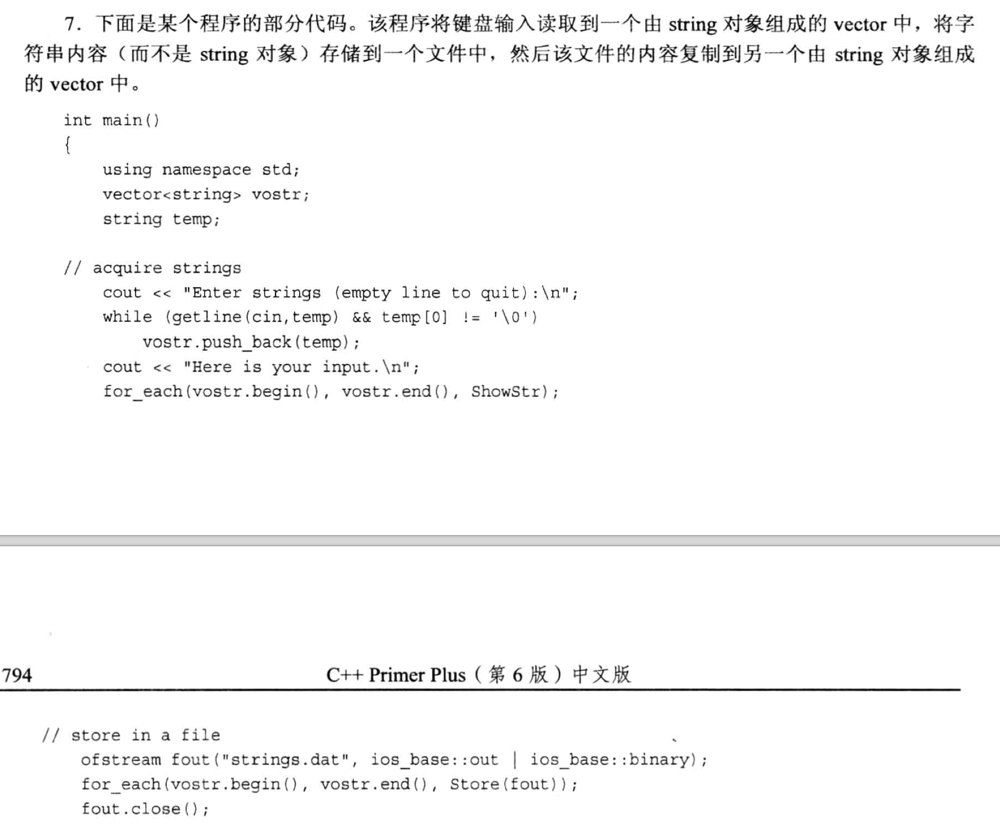
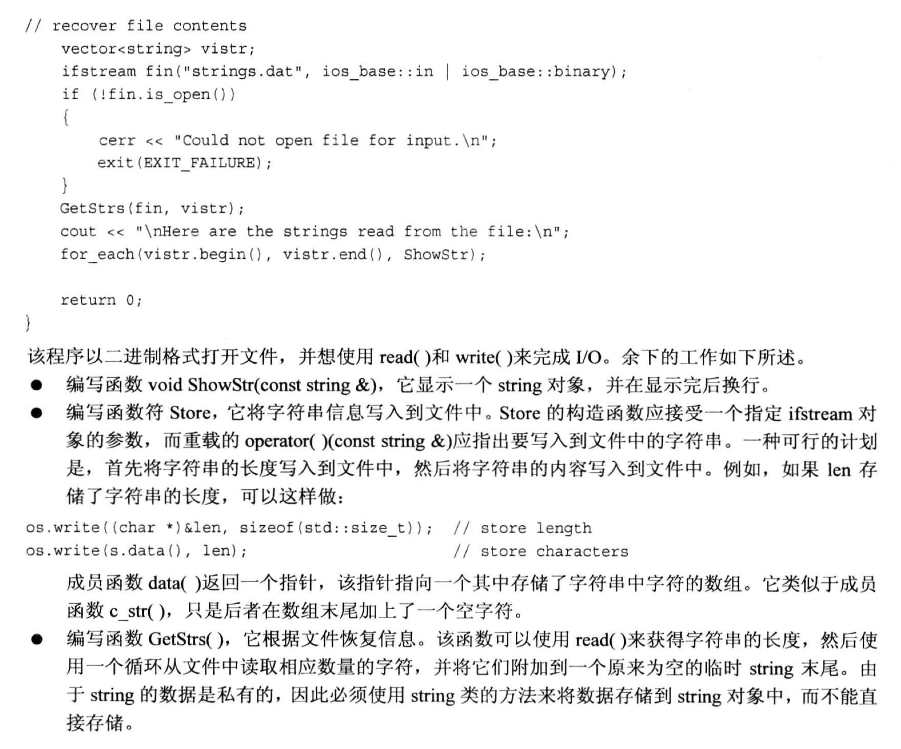

# 题目







# 1.
涉及输入流, 一般会使用 `cin.peek()`.
- peek()方法不会直接从输入缓冲区中取走数据, 它仅仅做一个`检查`的操作, 数据仍保留在缓冲区中.

```cpp
#include <iostream>

using namespace std;

int main(void)
{
    int cnt = 0;
    char ch;

    cout << "Enter a string: ";
    while(cin.peek() != '$')            // 检查字符, 不是 $ 就继续从输入缓冲区中读取
    {
        cin.get(ch);
        cnt++;
    }
    cout << "count = " << cnt << endl;

    return 0;
}
```

# 2.
```cpp
#include <iostream>
#include <fstream>
#include <cstdlib>      // 使用 EOF

using namespace std;

int main(int argc, char * argv[])       // 为了接收终端参数, 第二个参数得是指针数组
{
    char ch;
    ofstream fout;      // 要写入文件, 需要用 ofstream 对象

    if(argc < 2){
        cout << "Usage: filename val1 val2" << endl;
        exit(0);
    }

    fout.open(argv[1]);
    if (fout.is_open()){
        cout << "Please enter the data: ";
        while (cin.get(ch) && ch != EOF )
        {
            fout << ch;     // 将输入的内容写入文件
        }
    }
    else{
        cout << "Cannot open/create the file " << argv[1] << endl; 
    }
    return 0;
}
```
- 注意: 键盘输入的时候, `EOF` 可以用组合键 `Ctrl + d`来模拟.


# 3.
```cpp
#include <iostream>
#include <fstream>
#include <cstdlib>

using namespace std;

int main(int argc, char * argv[])
{
    if (argc != 3){
        cout << "Wrong argument number! Please check your input!" << endl;
        exit(0);
    }

    ifstream fin;
    ofstream fout;
    char ch;

    fin.open(argv[1]);
    fout.open(argv[2]);

    if (fin.is_open() && fout.is_open())
    {
        while(fin.get(ch)){
            fout << ch;
        }
    }

    fin.close();
    fout.close();
    return 0;
}
```


# 4.
```cpp
#include <iostream>
#include <fstream>
#include <string>

using namespace std;

int main(void)
{
    ifstream fin1;
    ifstream fin2;
    ofstream fout;

    fin1.open("t1.dat");
    fin2.open("t2.dat");
    fout.open("t3.dat");

    string str;
    while(!fin1.eof() || !fin2.eof()){
        // 拷贝第一个文件
        if (getline(fin1, str) && str.size() > 0){
            fout << str;
        }

        // 拷贝第二个文件
        fout << " ";
        if (getline(fin2, str) && str.size() > 0){
            fout << str;
        }
        fout << endl;
    }
    fin1.close();
    fin2.close();
    fout.close();
    return 0;
}
```

# 5
```cpp
#include <iostream>
#include <set>
#include <string>
#include <fstream>

using namespace std;

int main(void)
{
    set<string> Mat, Pat, Guest;
    string name;
    ifstream fin1;
    ifstream fin2;
    fin1.open("mat.dat");
    fin2.open("pat.dat");

    while(getline(fin1, name) && name.size() > 0){
        Mat.insert(name);
    }
    while(getline(fin2, name) && name.size() > 0){
        Pat.insert(name);
    }

    // 合并: 由于 set 本身就排序 & 去重, 所以直接丢进去就好了
    Guest.insert(Mat.begin(), Mat.end());
    Guest.insert(Pat.begin(), Pat.end());

    ofstream fout;
    fout.open("matnpat.dat");

    set<string>::iterator pd;
    for(pd = Guest.begin(); pd != Guest.end(); pd++){
        fout << *pd << endl;
    }

    fin1.close();
    fin2.close();
    fout.close();
    return 0;
}
```


