# 输入, 输出 和 文件
文件操作是这章的重点.

## 使用cout输出
C++把所有的信息都当做"字节流"进行处理, 比如输入流, 输出流.
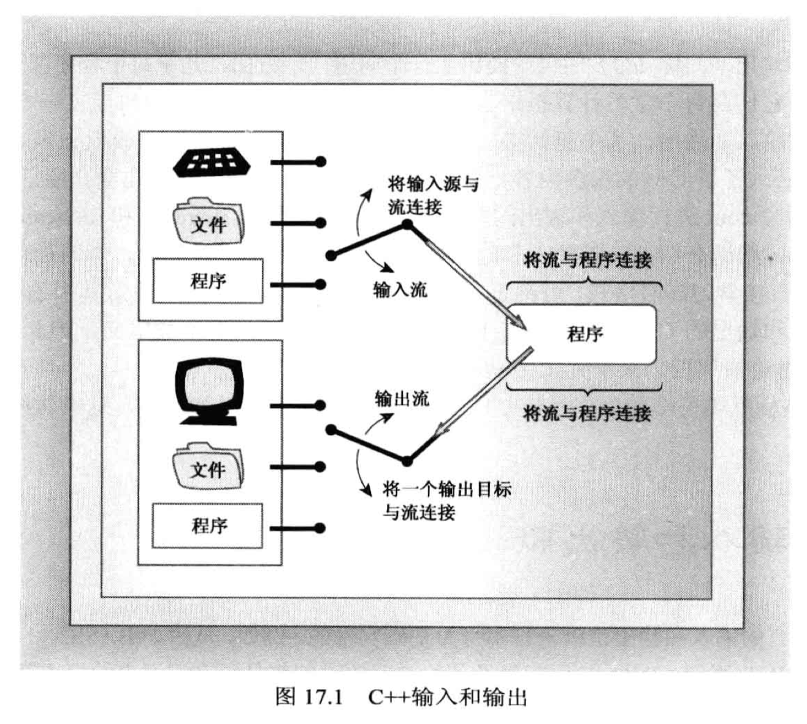

在输入和输出时, 都需要经过一次 内存的缓冲区.


### 重定向
有时候我们并不希望将流直接输出到屏幕或者文件中, 而是输出到某些用户想指定的位置, 此时就需要借助**重定向**功能来实现.
- 输入重定向 (<)
- 输出重定向 (>)

输出重定向演示:
```cpp
#include <iostream>
using namespace std;

int main(void)
{
    cout << "Hello World." << endl;     // 默认会直接输出到屏幕上
    return 0;
}
```
- 这是一段简单的 hello world 程序, 直接编译运行时, 屏幕会输出 `Hello World.`
- 如果我们在运行代码的时候使用 输出重定向`>` 的话, 就可以将这个输出信息写入指定的位置(比如文件)
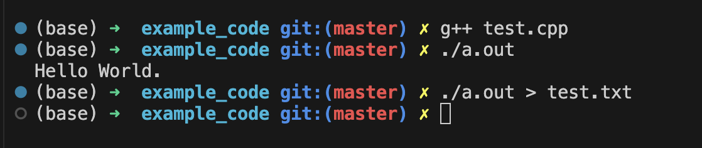
  - 此时, test.txt 文件中原来的内容会被删除, 并写入 `Hello World.`

### 回顾 cout 的一些功能
- 连续输出
```cpp
// 由于 cout 内部对插入运算符 (<<) 进行了重载, 所以当我们使用"cout <<" 的时候, 实现的功能是输出
// 而由于cout进行重载时使用的是下面的声明, 所以才能进行连续输出
ostream & operator<<(类型);   // 由于返回的是 ostream &, 所以可以继续识别 <<, 从而实现连续输出

/*
    注: cout 对所有基本数据类型都有进行上述的重载操作.
        在输出字符串的时候, 双引号"" 字符串本身是一个 const char * 类型的地址
*/
```

cout 的其他輸出方法:
- cout.put(): 显式单个字符 
- cout.write(): 可以控制显式多少个字符

### 刷新缓冲区
背景:
```txt
1. 缓冲区的大小为 512字节 或者 512字节的整数倍
2. 对于输出缓冲区来说, 如果缓冲区没有填满的话, 是不会输出到设备(如屏幕)上的, 但有时候我们就是填不满缓冲区, 并且希望内容能正常输出, 此时就需要刷新缓冲区来正常输出(刷新的时候就把里面所有的内容输出出去了)

另:
缓冲区存在的意义是: 
    假如目前用户在输入密码, 如果输入错误, 此时用户会使用 backspace 删除之前输入的某些字符, 这时候就需要用到缓冲区, 否则用户就没有修改当前输入的机会.
```

刷新缓冲区的方式有以下两种:
- 用 `flush` 刷新缓冲区
- 用 `endl` 刷新缓冲区

endl 与 flush 的区别:
- flush只是将缓冲区的内容输出(不管缓冲区满没满都输出), endl不仅进行输出, **还多一个换行**的操作

### 格式化显示
同一段代码, 在不同C++编译器(不同平台, 不同版本)编译后执行出来的效果可能不一样.
具体的功能在使用的时候再上网去搜吧...太tm多了, 没必要背.

### 调整字段宽度
使用 `width()`:
```cpp
// width() 函数的声明有以下两种
int width();        // 不带参数时, 执行效果是 "返回当前设置" 
int width(int i);   // 带int参数时, 执行效果是 "使用当前输出的值作为宽度, 并返回**之前**设置的宽度"
```
- width() 只影响接下来显式的项目, 但不会一直生效下去
  - 比如当前有3行输出语句, width 只会对第一行输出语句生效, 而不会对后面剩下的两行输出语句生效.

代码示例:
```cpp
#include <iostream>

using namespace std;

int main(void)
{
    int w = cout.width(30);     // w 是默认的宽度(为0), 执行玩这行语句之后, 下一次输出时, 字段宽度将设置为30
    cout <<  "default field width = " << w << "\n";     // 输出时, 字段宽度采用30, w 则输出0, 因为0是默认字段宽度
    // 注: 这里字段宽度一共设置为30, 但是这行语句并没有达到30个字符, 此时输出是 **按右对齐** 的方式输出, 我们会看到这行输出靠右侧(没有字符的位置用空格填充)

    cout.width(5);
    cout << "N" << ":";
    cout.width(8);
    cout << "N * N" << ":\n";

    for(long i = 1; i <= 100; i *= 10){
        cout.width(5);
        cout << "i" << ":";
        cout.width(8);
        cout << i*i << ":\n";
    }

    return 0;
}
```
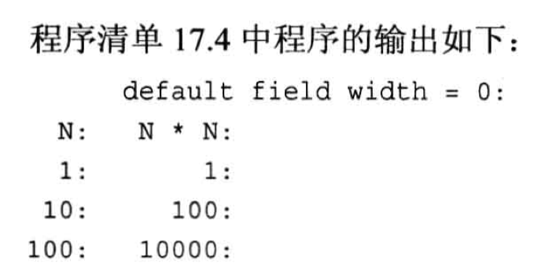

代码例子中可以看到, 如果需要输出的字符没有达到设置的字段宽度数值, 则默认使用`空格`进行填充; 我们也可以使用 `cout.fill()` 来指定填充的内容.


### 设置浮点数显示精度
默认显示的精度为`六位有效数字`(包括了整数和小数).
- 用`cout.precision()`可以修改显示的有效数字位数.

### 小数数字末尾加0
使用`cout.setf(ios_base::showopint)`.
setf功能还挺多的, 可以用到的时候去网上搜一搜例子. 主要用到 `ios_base` 命名空间的内容.

## 使用cin进行输入
cin的输入方式总会涉及到**类型转换**, 因为从键盘或者其他位置进行输入时, 缓冲区中其实存放的是**字符**类型 (哪怕输入的是数字), 当我们给目标变量赋值时, cin会根据目标变量的类型进行一次转换.
```cpp
// cin 使用的 >>运算符重载为
istream & operator>>(类型);         // 由于返回的是 istream 对象, 因此可以连续输入 
```

来看一个代码例子:
```cpp
#include <iostream>

using namespace std;

int main(void)
{
    cout << "Enter Numbers: " << endl;
    int sum = 0;
    int input;
    while(cin >> input){
        sum += input;
    }
    cout << "Last value entered: " << input << endl;
    cout << "Sum = " << sum << endl;
    return 0;
}
```
分析:
```txt
针对 cin, 如果如果我们输入下面的内容:
    10 -50 -123Z 60    (输入完60按回车)

此时这些内容会全部存入输入缓冲区, 然后cin开始从缓冲区起始位置开始读取数据, 直到遇到 "空白字符" 时停止读取, 并把读取到的内容传递给程序.  
    空白字符指的是 "空格", "换行", "制表符"

针对这行输入, 读取10没问题, 读取-50也没问题, 读取到-123Z的时候将有如下过程:
    cin 是按照 "一个个字节" 进行读取的, 所以会先读 -号, 然后1, 到2, 再到3, 再到Z;
        读完-123, cin此时遇到Z, Z不是数字, 于是先把 -123 发送给程序(Z留在缓冲区), 然后执行 while 里面的 sum+= input.
        此时cin再去缓冲区中捞数据, 看到一个Z, 这时候发现不满足input的类型要求, while 直接结跳出循环执行后面的语句. 
```
执行代码后的输出:
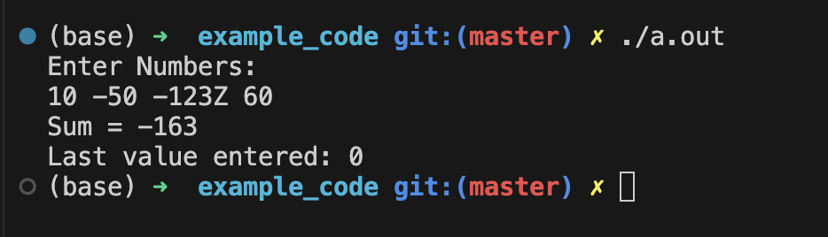
- 可以看到, 程序结束的时候sum的值输出是-163, 刚好为`10-50-123`的结果.


### 其他 istream 的用法

#### get, getline 和 ignore 方法
- `get(char &)` 和 `get(void)` 可以捕获**单个字符**
  - get() **不会跳过空白字符**, 而是捕获每一个字符.
- `getline()` 捕获**一行字符**
  - getline() 会跳过除指定分隔符(默认是回车`\n`)之外的空白字符, 也就是默认会捕获一行字符串, 字符串中间的空格是可以顺利捕获的
  ```cpp
  cin.getline(存放字符串的变量, 最大捕获的字符数量);        // 第一种使用方法
  cin.getline(存放字符串的变量, 最大捕获的字符数量, 指定分隔符);    // 第二种使用方法

  // 注意: 
  //      getline 会丢弃输入字符串中的分隔符(默认是 '\n' ), 但是 get 不会丢弃, 而是捕获到这个分隔符.
  ```
- 直接使用 cin 读取时, 会跳过空白字符, 直接捕获有效字符.

- ignore() 方法
```txt
cin.ignore() 是一个istream库函数，用于忽略输入流中的一些字符。
    它的基本语法如下： 
        cin.ignore (n, delim);
            其中， n 表示要忽略的字符数， delim 表示可选的分隔符。 
            如果省略 delim 参数，则默认忽略换行符和空格。
使用 cin.ignore () 可以清除输入流中的残留字符，避免对后续输入的干扰，也可以跳过不需要的输入。
```

代码例子:
```cpp
// t1.cpp
#include <iostream>

using namespace std;

int main(void)
{
    char ch;
    int ct = 0;

    cin.get(ch);   // 捕获的内容直接存入ch
    while(ch != '\n'){
        cout << ch;
        ct++;
        cin.get(ch); 
    }
    cout << endl;
    cout << "ct = " << ct << endl;
    return 0;
}

// -----------------------------
// t2.cpp
#include <iostream>

using namespace std;

int main(void)
{
    char ch;
    int ct = 0;

    cin >> ch;   // 捕获的内容直接存入ch
    while(ch != '\n'){
        cout << ch;
        ct++;
        cin >> ch; 
    }
    cout << endl;
    cout << "ct = " << ct << endl;
    return 0;
}
```
输出:
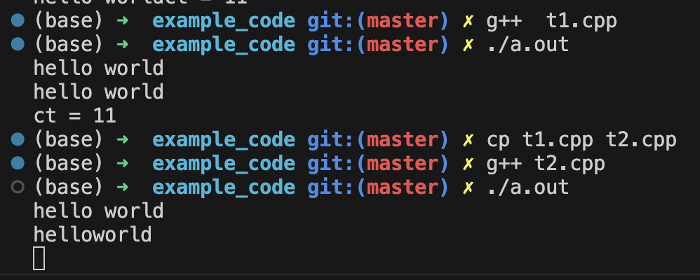
- 可以看到, 使用 `cin.get(ch)` 时, 不会跳过空白字符(空格, 回车, 制表符)
- 使用`cin >> ch`时, 会跳过空白字符


代码例子 -- `get_gun.cpp`
```cpp
#include <iostream>

using namespace std;

const int Limit = 255;

int main(void)
{
    char input[Limit];
    cout << "Enter a string for getline() processing: " << endl;
    // cin.getline(input, Limit);      // 两个参数的版本: 遇到'\n' 或者读取 Limit 个字符之后结束读取
    cin.getline(input, Limit, '#');     // 三个参数版本: 第三个参数是指定结束读取的字符
    cout << "Here is your input: " << endl;
    cout << input << endl;

    cout << " ------- " << endl;

    char ch;
    cin.get(ch);        // 此时的效果是: 跳过指定的分隔符('#'), 读取下一个字符并放进ch中
    cout << "The next input character is: " << ch << endl;

    // 用 ignore 清除缓冲区的残留元素
    cin.ignore(Limit, '\n');    // 忽略掉当前缓冲区中 Limit 个字符, 或者 忽略掉从当前缓冲区起始位置到第一个'\n'的字符

    cout << " ------- " << endl;
    cout << "Enter a string for get() processing: " << endl;
    cin.get(input, Limit, '#');         // 三个参数的版本. 对比输出可以确认: get方法是不会丢弃分割符的
    cout << "Here is your input: " << input << endl;

    cin.get(ch);
    cout << "The next input character is: " << ch << endl;  // 捕获到前面指定的分割符 '#'

    return 0;
}
```
输出:
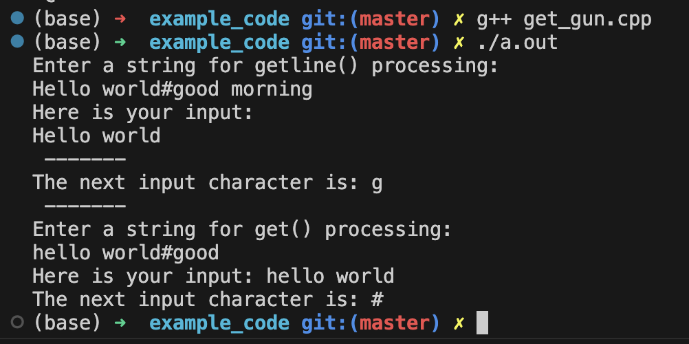
- 可以从输出中观察到: getline 会丢弃输入字符串中的分隔符(默认是'\n', 这里设置为 '#'), 但是 get 不会丢弃, 而是捕获到这个分隔符.

#### peek, putback  

代码例子 -- `peeker.cpp`
```cpp
/*
    本例子将测试 cin.peek() 和 cin.putback() 方法.
    任务: 将用户输入的#号前的内容打印出来.
*/
#include <iostream>

using namespace std;

int main(void)
{
    char ch;
    // 实现 #号 前的内容全部打印出来
    while(cin.get(ch))              // 当遇到 "文件尾" 的时候, cin会停止捕获, 也就是while条件为 false
    {
        // 注: linux 和 UNIX 模仿"文件尾"的方式是使用键盘组合键: ctrl+d
        if(ch != '#'){
            cout << ch;
        }
        else{
            cin.putback(ch);        // 将 '#' 放回输入缓冲区中
            break;
        }
    }
    cout << endl;
    /*
        这个while循环退出有两种可能:
        1. cin 遇到 "文件尾", 也就是用户使用了 ctrl+d 组合键
        2. 用户输入的时候输入了 #号 (此时用户其实还没有停止输入) 
    */

    if(!cin.eof()){     // 并非遇到 "文件尾" 退出读取的情况, 也就是 用户输入 '#' 的情况
        cin.get(ch);    // 此时捕获到 putback 放回来的 #
        cout << ch << " is your next input character." << endl;
    }
    else{
        cout << "End of input reached." << endl;
        exit(0);
    }

    while(cin.peek() != '#'){          // peek 只是查看缓冲区里的 "下一个元素是什么, 但是没有读取出来, 东西还在缓冲区里"
        cin.get(ch);        // peek没有读取, 这里的cin.get()才是真正读走了缓冲区的内容
        cout << ch;
    }  
    cout << endl;

    // 判断退出情况
    if(!cin.eof()){     // 并非遇到 "文件尾" 退出读取的情况, 也就是 用户输入 '#' 的情况
        cin.get(ch);    // 此时捕获到 putback 放回来的 #
        cout << ch << " is your next input character." << endl;
    }
    else{
        cout << "End of input reached." << endl;
        exit(0);
    }
    return 0;
}
```

测试代码输出情况:
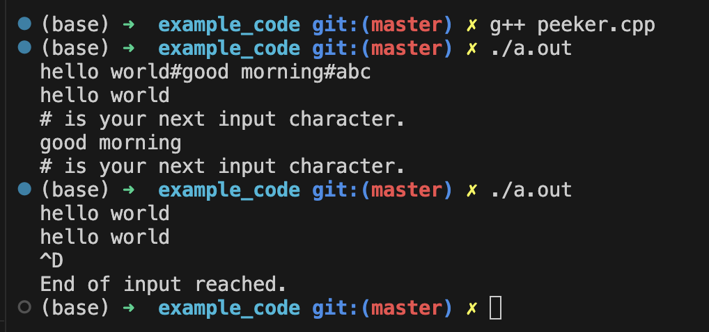


代码例子 -- `truncate.cpp`
```cpp
#include <iostream>

using namespace std;

const int SLEN = 10;
int main(void)
{
    char name[SLEN];
    char title[SLEN];
    cout << "Enter your name: ";
    cin.get(name, SLEN);        // 注意: 如果 cin.get() 读取整行, 它将保留 '\n' 在缓冲区中!
    if(cin.peek() != '\n' ){    // 进入这个if的条件是: 输入内容过长, name没有足够的空间读完一整行
        cout << "Sorry, we don't have enough room for " << name << endl;
    }
    cin.ignore(SLEN, '\n');         // 清空缓冲区方式1
    // while (cin.get() != '\n'){};    // 情况缓冲区方式2


    cout << "Dear " << name << ", enter your title: ";
    cin.get(title, SLEN);
    if(cin.peek() != '\n'){
        cout << "We were forced to truncate your title." << endl;
    }
    while (cin.get() != '\n'){};    // 情况缓冲区方式2

    cout << "Name: " << name << endl;
    cout << "Title: " << title << endl;
    return 0;
}
```

输出:
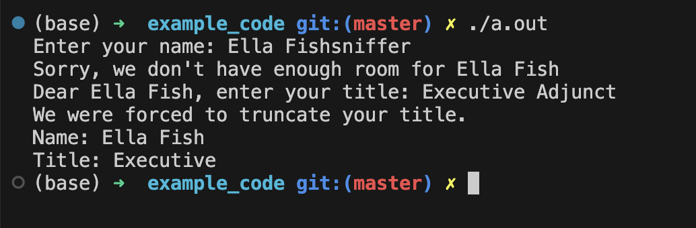


## 简单的文件IO

例子1 -- 使用默认方式读写文件 `fileio.cpp`
```cpp
#include <iostream>
#include <fstream>      // 有些系统/编译器 在  fstream 中会包含 iostream
#include <string>

using namespace std;

int main(void)
{
    string filename;
    cout << "Enter name for new file: ";
    cin >> filename;

    ofstream fout;                          // ostream 对应 cout
    fout.open(filename);                    // 如果没有这个文件, 就创建&打开
    /*
        用默认的方式 open 时, 如果文件已经存在, 则会清空文件中原有内容
    */
    fout << "For your eyes only!" << endl;  // 往文件中写入内容
    cout << "Enter your secret number: " << endl;
    float secret;
    cin >> secret;
    fout << "Your secret number is: " << secret << endl;
    fout.close();

    ifstream fin;
    fin.open(filename);
    cout << "Here are the contents of " << filename << ": " << endl;
    char ch;
    while(fin.get(ch)){
        cout << ch;
    }
    cout << endl;
    fin.close();

    return 0;
}
```

### 检查文件是否打开成功
检查文件是否打开成功有两种方式:
- 使用 `is_open()` 方法
  - 这个方法比较新, 推荐就只使用这个方式.
- 使用 `!` 运算符

```cpp
ifstream fin;
if(!fin)
{
}

// 或者
if(!fin.is_open())
{
}
```


### 打开多个文件
分为两种情况:
- 同时需要打开多个文件:
  - 如果需要同时打开多个文件, 则需要根据实际打开的数量使用`ifstream` 和 `ofstream` 分别对每一个文件创建对象的流对象.
- 一次只打开单个文件:
  - 如果只需要打开一个文件, 则根据实际的读写情况(只需要写文件时, 创建一个 ofstream 对象就行; 读对象则是 ifstream), 一般只需要创建一个对象, 但是要记得在使用完毕后用`clear()`方法解除文件关联并使用`close()`方法关闭当前文件, 这样才能将流对象顺利关联到其他文件.

代码例子 -- `count.cpp`
```cpp
#include <iostream>
#include <fstream>
#include <cstdlib>

using namespace std;

int main(int argc, char *argv[])      // 如果在终端中需要输入参数, 则这里需要给main函数添加参数列表
/*
    main函数的参数列表:
        int argc: 表示有多少个参数
        *argcv[]: 字符串指针数组
                    在执行时, argv 的第一个参数一般是当前程序的文件名

*/
{
    if(argc == 1)       // 此时运行程序时没有给任何参数, 终端中只输入的程序名称, 如: ./a.out
    {
        cout << "Usage: " << argv[0] << " filenames(s)" << endl;
        exit(0);
    }

    long count = 0;
    long total = 0;
    char ch;

    ifstream fin;
    for (int i = 1; i < argc; i++){  // i = 1时, argv[i] 对应的字符串才是参数
        fin.open(argv[i]);
        if(!fin.is_open()){
            cout << "Cannot open " << argv[i] << endl;
            fin.clear();
            continue;
        }
        count = 0;
        while(fin.get(ch)){
            count++;
        }
        cout << count << " characters in " << argv[i] << endl;
        total += count;
        fin.clear();
        fin.close();
    }

    cout << total << " characters in all files." << endl;

    return 0;
}
```

程序输出:
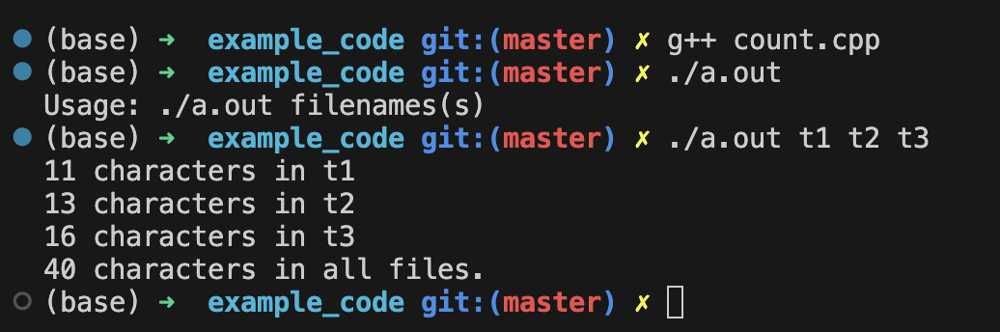

- 这个程序使用到了 UNIX 终端命令行参数的方式来指定打开文件. 具体知识点参考下面的补充笔记

#### 补充: main函数接受命令行参数
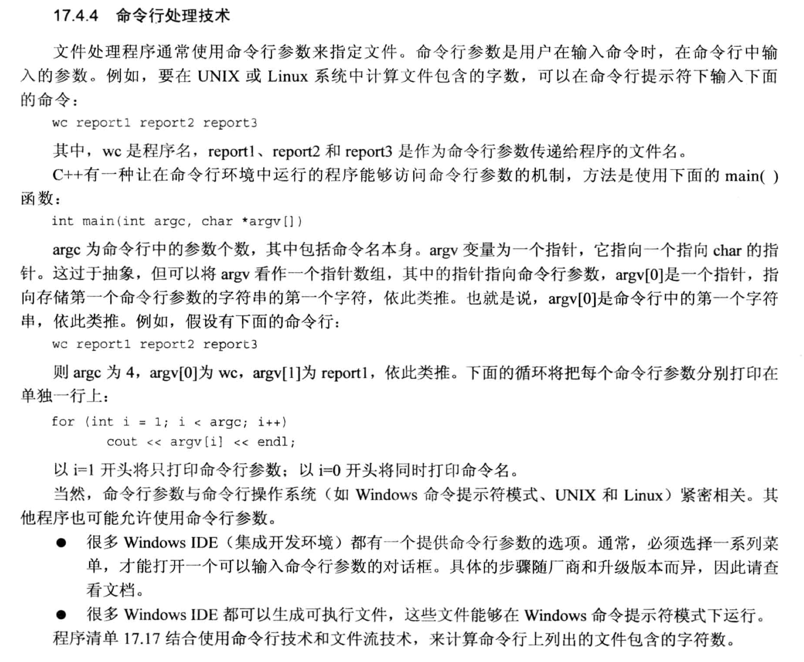


### 文件模式(读/写)
在使用`open()`方法打开文件时, 我们可以根据需要, 使用下图的参数规定打开文件的模式:
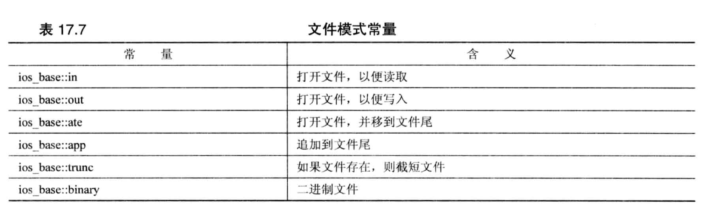
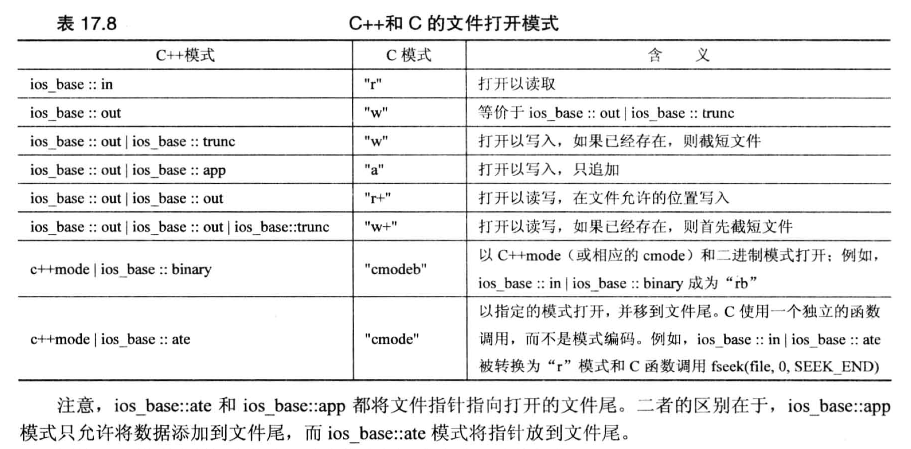
- app: append, 追加模式 
- ate: at end, 打开文件后立即定位到文件末尾(把指针移动过去)

ifstream 和 ofstream 的构造函数都是两个参数, 第一个是文件名, 第二个是文件模式(文件打开方式).
- `ifstream`默认的打开方式是`ios_base::in`(打开文件进行读取)作为默认参数
- `ofstream`默认的打开方式是`ios_base::out|ios_base:trunc`(打开文件并截短文件)作为默认参数
  - 所以**默认**情况下, 每次打开文件并写入内容时, 都会`把文件中原有的内容清空`, 然后再写入新的内容.

代码例子 -- **文件追加写**模式`append.cpp`
```cpp
#include <iostream>
#include <fstream>
#include <string>
#include <cstdlib>

using namespace std;

int main(void)
{
    const char *file = "mysecret";
    char ch;

    ifstream fin;
    fin.open(file);
    if (fin.is_open()){
        cout << "Here are the contents of " << file << ": " << endl;
        while (fin.get(ch))
            cout << ch;
        fin.close();
    }

    ofstream fout;
    fout.open(file, ios_base::out | ios_base::app);
    if (!fout.is_open()){
        cout << "Cannot open " << file << endl;
        exit(0);
    }

    cout << "Enter new string append to the file: " << endl;
    string str;
    while(getline(cin, str) && str.size() > 0){
        fout << str << endl;
    }
    fout.close();

    fin.clear();        // 同一个流对象在第二次使用时, 一定记得先clear一次!
    fin.open(file);
    if (fin.is_open()){
        cout << "Here are the contents of " << file << ": " << endl;
        while (fin.get(ch))
            cout << ch;
        fin.close();
    }
    return 0;
}
```


