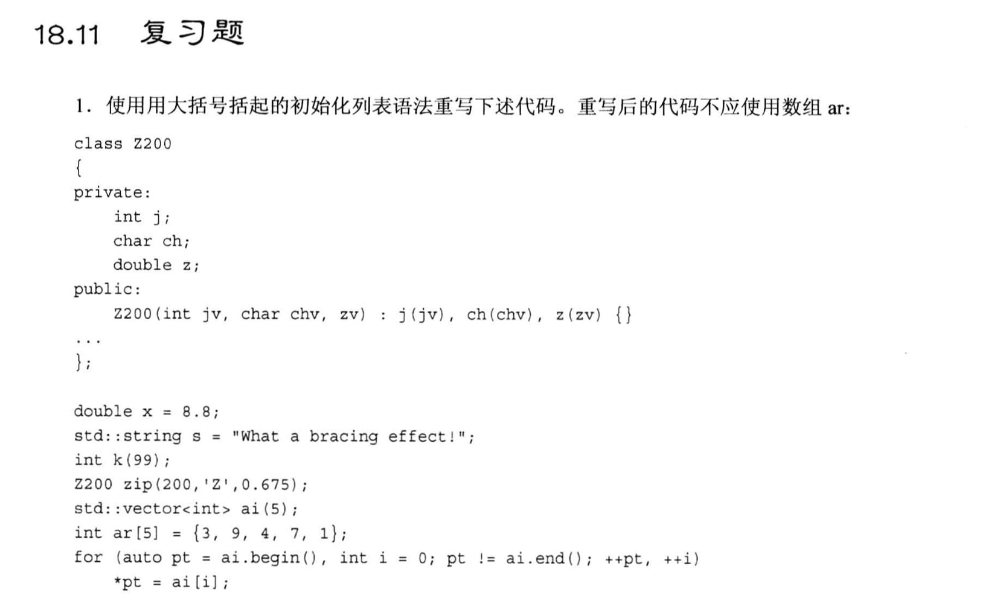
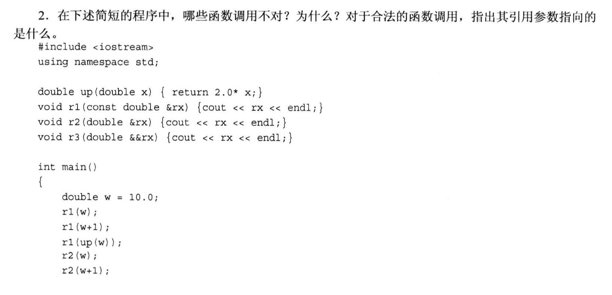
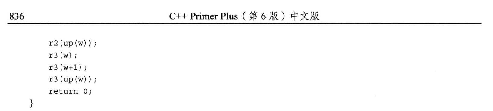
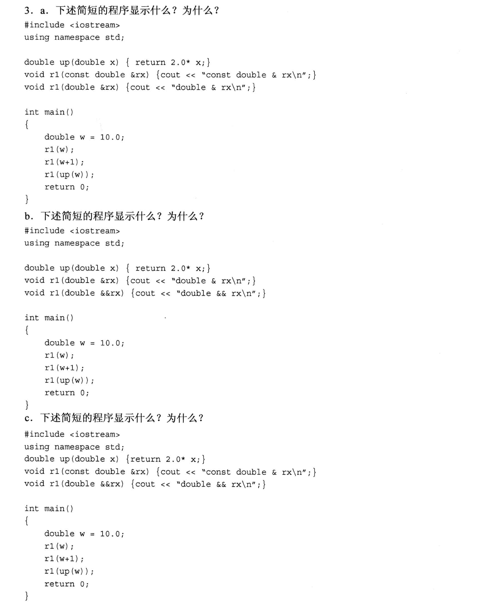
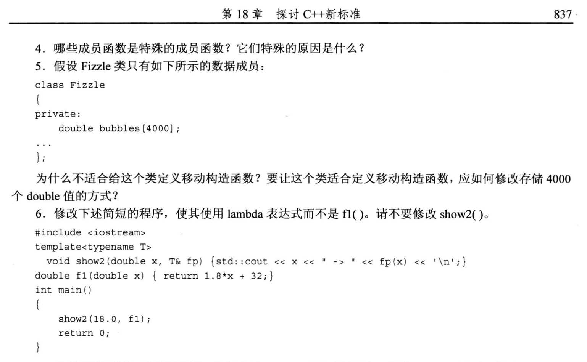
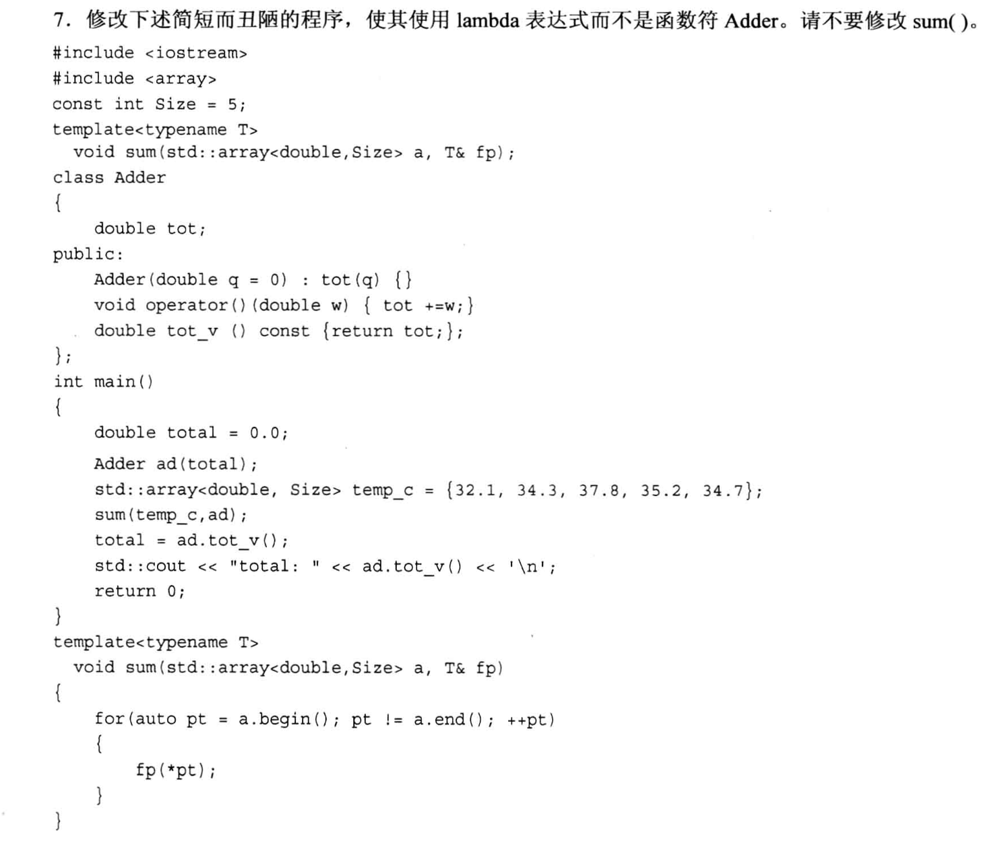

# 题目








# 1. 
```cpp
double x{8,8};      // double x = {8,8}

string s{"What a brancing effect."};

int k{99};          // int k = {99}

Z200 zip{200, 'z', 0.675};

vector<int> ai{3, 9, 4, 7, 1};
```

# 2.
```txt
// 可行
r1(w)  ==>  const double &rx 指向 w

// 可行
r1(w+1)  ==> const double &rx 指向 w+1, 注意 w+1 是右值, 此时 const double &rx 指向的是 w+1 的 "临时副本"

// 可行
r1(up(w)) ==> const double &rx 指向 up(w) 的返回值, up(w) 返回的是一个 "double类型的临时对象", 临时对象是右值, 由于加了const 所以此时 const double &rx 指向的是 "double类型的临时对象的副本", 这里编译器也是生成了一个临时副本.

// 可行
r2(w) ==> double &rx 指向变量 w

// 不可行
r2(w+1) ==> double &rx 是左值引用, 而(w+1)是右值, 由于r2的参数没有加const, 所以编译器不会生成临时副本, 于是直接报错了

// 不可行
r2(up(w)) ==> up(w) 返回值是右值, double &rx 是左值引用, 没有加const, 所以编译器不会生成临时副本, 直接报错

// 不可行
r3(w) ==> w 本身是左值, 但是 r3() 的参数 double &&rx 是右值引用, 所以不可行

// 可行
r3(w+1)  ==> w+1 是右值, r3()参数是右值引用, 匹配, 所以可行

// 可行
r3(up(w)) ==> up(w) 返回值是右值, r3()参数是右值引用, 匹配, 所以可行
```

# 3.
a. 
```txt
double & rx             // r(w) 的输出
const double & rx       // r(w+1) 的输出
const double & rx       // r(up(w)) 的输出
```

b. 
```txt
double & rx             // r(w) 的输出
double && rx            // r(w+1) 的输出
double && rx            // r(up(w)) 的输出
```

c.
```txt
const double & rx       // r(w) 的输出
double && rx            // r(w+1) 的输出
double && rx            // r(up(w)) 的输出
```

# 4.
```txt
特殊成员函数有6个 (中文书 page 813页):
- 默认构造函数
- 拷贝构造函数
- 移动构造函数
- 析构函数
- 拷贝赋值运算符
- 移动赋值运算符

特殊原因: 用户不自定义时, 编译器会自动生成一份.
```

# 5.
```txt
使用移动构造的目的是:
    实现临时数据的转移和再利用, 避免空间浪费.
        如 b = a; c = b;
            本质上我们就是希望 c 能直接获得 a 的数据, b在这个情况下是临时数据, 为了节省空间, 我们希望 b 的数据是直接从 a 中获得所有权(只转移数据所有权, 不开辟空间), 此时才适合使用移动构造.

在本题中, Fizzle类内部只有一个数据成员 double bubbles[4000], 但是:
    标准数组没有 **数据转让权**, 移动语义是针对"临时数据"的(一般是没有"归属"的数据), 但是数组本身就是有"归属"的, 所以移动语义不适用于数组.
        加上数组名就是一个内存地址, 移动语义一般是把保存数据的内存地址进行转移, 所以数组没得移动了.

如果硬要用移动语义, 那就把 bubbles 定义为指针, 并且使用 new 开辟空间的方式给这个指针赋值, 此时 bubbles 就是一个"临时数据", 就可以将存储数据的地址转交给其他变量了.
```

# 6.
```cpp
#include <iostream>

template <typename T>
void show2(double x, T &fp) {std::cout << x << "-> " << fp(x) << '\n';}

int main(void)
{
    auto f1 = [](double x) {return 1.8*x + 32;};        // lambda表达式
    show2(18.0, f1);
    /*
        或者写成:
            show2(18.0, [](double x) {return 1.8*x + 32;});
    */
    return 0;
}
```

# 7.
```cpp
template <class T>
void sum(std::array<double, Size>a, T& fp)
{
    for (auto pt = a.begin(); pt != a.end(); ++pt)
        fp(*pt);
}

const int Size = 5;

int mian(void)
{
    double total{0.0};
    std::array<double, Size> temp_c {32.1, 34.2, 35.3, 36.4, 37.5};
    sum(temp_c, [&total](double w) {return total+=w;});
    cout << "total = " << total << endl;
}
```

