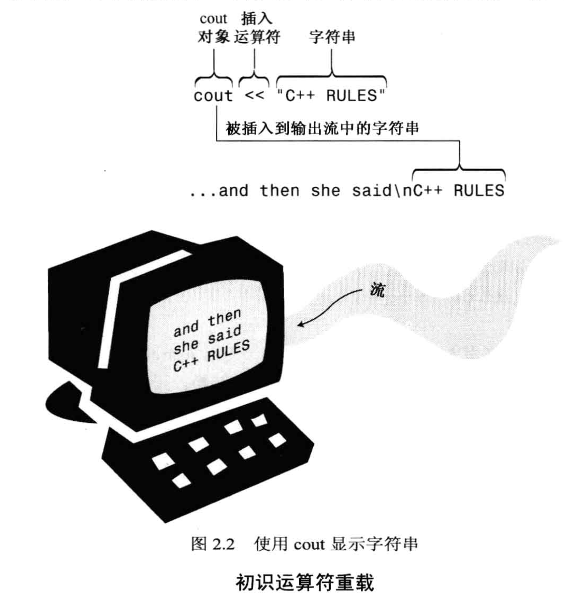
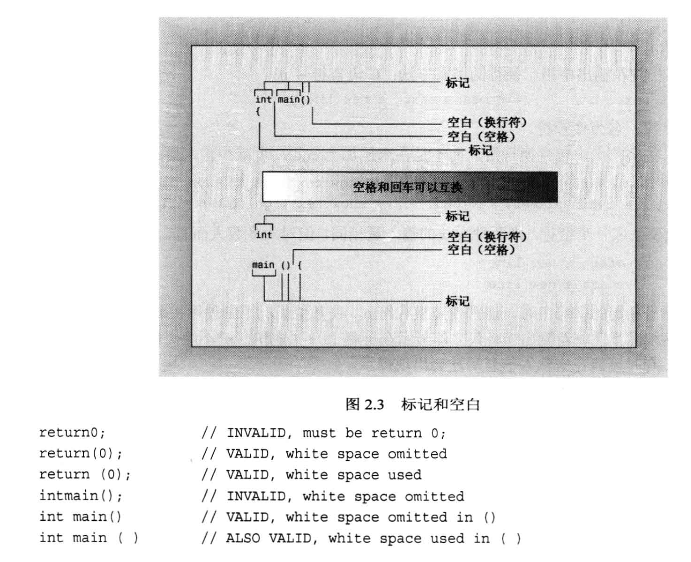
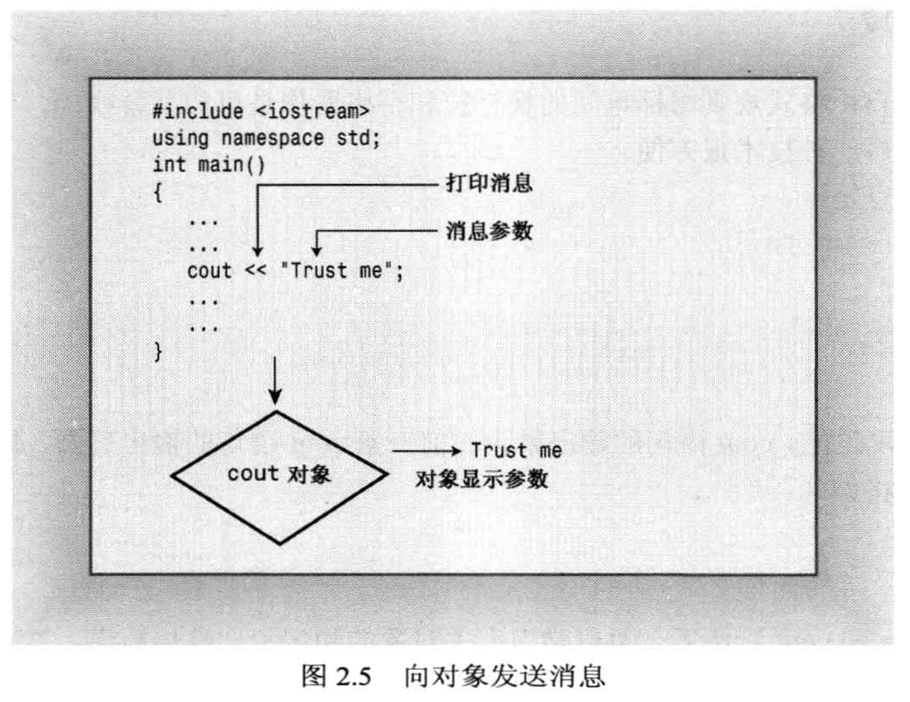
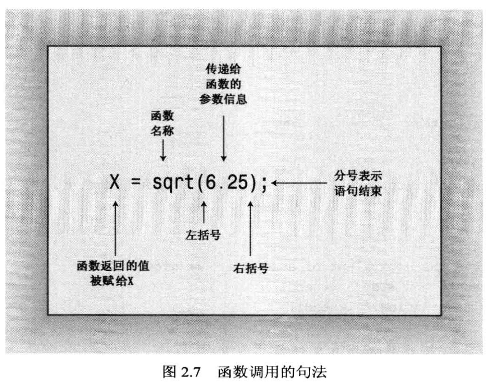
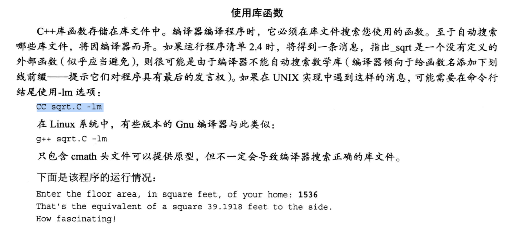
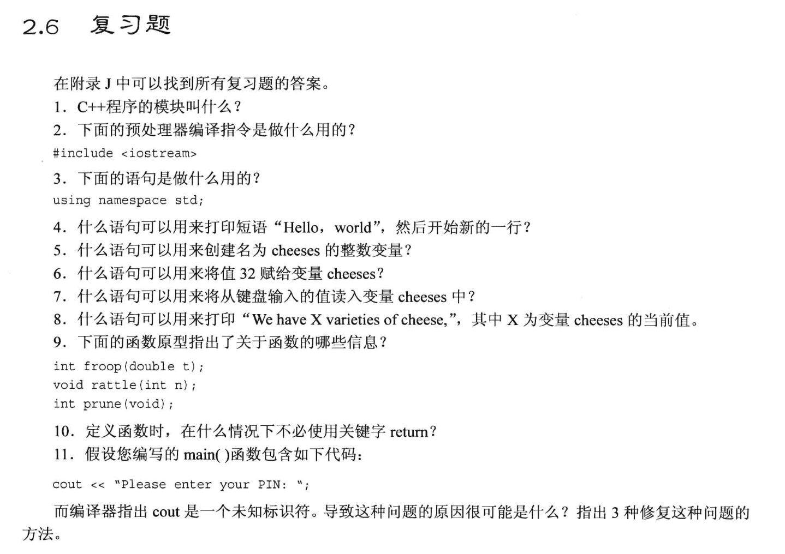

# 系统学习 C++ 之前的预备知识 

## 先看一个例子
* 首先需要把源码写好, 下面是一个最基础的C++程序代码, 保存为1.cpp
```cpp
//  一个简单的C++程序, 包含两个部分: 函数头 和 函数体
int main(void)     //函数头 (不包含花括号的部分)
{                  //函数体 (花括号的部分)
    return 0;       // C++语句, 以分号作为一条语句的结尾
                    // return 0; 表示函数的末尾
}
```
* 有了源码文件, 需要编译, 直接用g++进行编译
    * 代码是在 Ubuntu 下运行的, 没有安装的话, 就用 `apt install g++`进行安装, 然后运行`g++ 1.cpp`.
    * 运行之后如果没有任何提示, 就表明当前代码没有语法错误, 编译通过.
    * 运行上述编译指令之后, 会生成一个 `a.out` 的可执行文件, 运行 `./a.out` 就可以执行这个可运行代码.
* 上述代码中:
    * `int` 表示函数返回的类型, 这里的 int 是与 `return 0;` 的那个`0` 相关的.
    * `main` 是函数名, 也就是程序的入口, 也就是程序从这里开始执行.
        * `main` 函数是整个代码的入口, 整个代码一定会从 main 函数开始执行, 这是C++标准在制定的时候一致决定的事情. 
        * 如果没有 main 函数, 整个代码就没法运行 ===> 编译器报错.
        ```plain text
        main 函数是操作系统主动去寻找的, 如果找不到这个函数名字, 操作系统就会丢一个error.

        一些没有 main 函数的情况:
        1. 如果该程序文件不需要独立运行, 它只是作为一个 "函数库" 的话, 就不需要 main 函数.
        2. 单片机程序可以没有 main 函数, 因为单片机没有操作系统, 它是按照函数地址去执行的, 只要函数地址写对了就行, 函数名叫什么无所谓.
        ```
    * `void` 表示函数的参数, 这里的 `void` 表示没有参数.
    * `return 0;` 表示函数的返回值, 这里的 `0` 表示函数的返回值是 `0`.
    * `main()` 函数在运行时, 是被 **启动代码** 调用的, 而启动代码是`由编译器自动添加到程序中`, 是一个不可见的代码, 返回值在这里也是返回给启动代码. 
        * 生成的 `a.out` 可执行文件中, 包含了`启动代码` 和 `我们写的代码`
        * return的时候, return 0 表示程序执行成功, return "非零值" 表示程序执行异常.
        * 事实上, main() 函数头描述的是`main()和操作系统之间的接口`


## 代码的注释写法
注释是用来解释代码的, 有助于代码的阅读和理解, 也有助于代码的维护. 注释不会被编译器编译, 也不会被操作系统执行, 它只是一段文字, 用来解释代码的(给人类看的东西).

```cpp
// 单行注释, 用双斜线开头, 一直到行尾都是注释

/*
    多行注释, 用斜线和星号开头, 用星号和斜线结尾, 中间的内容都是注释
*/

```

## 进一步完善上述代码例子 --> 增加头文件部分
```cpp

# include <iostream>    // 如果 C++ 程序中需要使用输入输出语句, 则一定要包含 #include <iostream> 和 using namespace std; 
                        // # 号 代表 这句话调用了 "预处理器", 预处理会 **在编译之前** 把 iostream 文件的内容添加到当前程序中.

// using namespace std;  //如果要使得所有的函数都采用这个命名空间, 就把语句放在这里, 不然就放在对应的函数中


//  一个简单的C++程序, 包含两个部分: 函数头 和 函数体
int main(void)     //函数头 (不包含花括号的部分)
{                  //函数体 (花括号的部分)

    using namespace std;    // 这条语句是 搭配 iostream 头文件使用的, 用于指定程序中使用的命名空间
    return 0;               // C++语句, 以分号作为一条语句的结尾
                            // return 0; 表示函数的末尾
}

```
* 关于头文件
    * 在C语言中, 头文件是 xxx.h, 代码里面需要用到 xxx.h 中的函数, 就需要在代码中包含这个头文件, 用 `#include <xxx.h>` 这样的语句来包含头文件.
    * 在C++中, 对老式的C语言头文件做了保留, C++ 中仍可以使用 xxx.h 的头文件 
        * 在C++中如果要使用 C语言的头文件, 则需要去掉后缀 .h, 并在前面加上前缀 c, 比如 `#include <math.h>` 变成 `#include <cmath>`
        * 对于C++中与C语言同名的函数库, 有时候不仅仅是文件名称的变化, 它里面的函数有可能也进行更改, 比如没有 h 的头文件也可以包含命名空间.

* 关于命名空间(详细讲解在第九章, 这里简单介绍)
    - 命名空间的出现由来: 在我们需要使用第三方编写好的类库中的函数时, 可能会出现 A 库里有一个 wanda函数, B库里也有一个 wanda函数, 这时候就会出现冲突, 也就是说, 两个库中的函数名字相同, 但是功能不同, 为了避免调用的时候发生混淆, 这时候就需要用到命名空间. 
        - 命名空间的直接使用方式是:
        `Microsoft::wanda(); // 调用微软的wanda函数`
        `Piscine::wanda();   // 调用Piscine的wanda函数`
        - 为了方便使用, C++中提供了一个关键字 `using`, 可以用来简化命名空间的使用, 比如:
        ```cpp
        using namespace std;  // 指定使用命名空间 std
        //此时就可以将 
        std::cout << "abc" << std::endl; 
        //简化为 
        cout << "abc" << endl;

        // 但是在大型程序中, 直接 using namespace std; 会导致命名空间的污染, 所以一般不建议这么做. 
        // 建议的写法是指定库里面的几个函数, 其他的函数还是需要使用 std::xxx 的方式来调用
        using std::cout;
        using std::endl;
        using std::cin;
        ```
    * `using` 是编译指令
    * `::` 表示调用这个命名空间中的函数


## 进一步完善上述代码例子 --> 增加输入输出语句
```cpp
# include <iostream>    // 如果 C++ 程序中需要使用输入输出语句, 则一定要包含 #include <iostream> 和 using namespace std; 
                        // # 号 代表 这句话调用了 "预处理器", 预处理会 **在编译之前** 把 iostream 文件的内容添加到当前程序中.

// using namespace std;  //如果要使得所有的函数都采用这个命名空间, 就把语句放在这里, 不然就放在对应的函数中


//  一个简单的C++程序, 包含两个部分: 函数头 和 函数体
int main(void)     //函数头 (不包含花括号的部分)
{                  //函数体 (花括号的部分)

    using namespace std;    // 这条语句是 搭配 iostream 头文件使用的, 用于指定程序中使用的命名空间
    
    cout << "Come up and C++ me some time.";    // C++语句, 以分号作为一条语句的结尾
    cout << endl;                               // endl 是一个特殊的C++符号, 代表"重起一行", 在流输出中将导致光标移到下一行的开头位置.
    cout << "You won't regret it !" << endl;    
    
    return 0;               // C++语句, 以分号作为一条语句的结尾
                            // return 0; 表示函数的末尾
}
```

- 输出语句 `cout` 的说明:
    - cout 的作用是将双引号括起来的字符(称为字符串)打印到屏幕或者终端上.
    - `<<` 符号是一个 **插入运算符**, 它表示该语句将把这个字符串发送给 cout, 这个符号指明了 **信息流动路径**.
    - cout 是可以自动识别流的类型的, 也就是说, cout 可以自动识别出你要输出的是什么类型的数据, 然后自动将其转换为字符串输出.
      - 如: 输出一个整型变量, 值为25, 存储的时候, 25是用二进制存储的, 但是在调用 cout 输出时, 它会自动转成十进制数25, 并转换为字符串进行输出.



- 控制运算符 `endl`
  - `endl` 是一个控制运算符(manipulator), 用来控制输出的格式, 使得输出的内容换行(流输出中, 它的效果是使得光标移动到下一行的开头).
  - 它和`cout`一样, 都是属于 `std` 命名空间的.
  - 通常 C++ 里常用 `endl` 来换行, 但是在 C++11 之后, 有了更好的换行方式, 就是 `"\n"` , 也就是说, `endl` 的功能可以用 `"\n"` 来代替, 但是 `endl` 的效率更高, 因为 `endl` 会刷新缓冲区, 而 `"\n"` 不会刷新缓冲区.   ==> 一般无脑用 `endl` 就行了.


## 变量的定义

```cpp
#include <iostream>

int main(void)
{
    using namespace std;

    int carrots;        // 显示地声明变量, 没有声明这个变量的话, 下面的赋值语句会报错.  ==> 代码规范是写在程序开头, 但不强制要求
                        // 需要声明变量的优势是可以防止变量名字打错, 导致系统重新创建一个变量(python里就会出这种问题)

    carrots = 25;       // 变量赋值/初始化, 变量值在存储的时候是二进制存储的, 但是在输出的时候是十进制输出的.

    cout << "I have ";  
    cout << carrots;    // 输出变量
    cout << " carrots." << endl;

    carrots = carrots -1;
    cout << "Crunch, crunch. Now I have " << carrots << " carrots." << endl;    // 注意看拼接字符串的输出写法

    return 0;

}
```
- 例子的要点:
  - 在输出的时候, 中间穿插变量.


## 代码示例 ---> 捕获用户输入值
需要注意的知识点都在代码注释中了.
```cpp
#include <iostream>

int main(void)
{
    using namespace std;
    
    int carrots;

    cout << "How many carrots do you have?" << endl;
    cin >> carrots;             // 用 cin 捕获用户的输入, 注意控制符的方向: 将cin捕获的值流到carrots
    cout << "Here are two more. ";
    carrots = carrots + 2;
    cout << "Now you have " << carrots << " carrots." << endl;


    //另一种写法 -- cout 语句分成多行写
    // 这是由于 cout 的自由格式规则将标记间的换行符和空格符看做是可互换的.
    cout << "Now you have "
         << carrots
         << " carrots."
         << endl;

    return 0;
}

```
- 关于 分行写 cout 的说明:



# 2.3.3 类简介 (对应到 C++ primer plus 的2.3.3 )
- 类是用户定义的类型
  - cin 和 cout 都是 类的实例化(即对象), 它分别是 istream 类 和 ostream 类的实例化.
- ostream类 和 istream类 是来自于**类库**的, 它们并不是被内置到C++中, 而是语言标准指定的类, 它们**没有被内置到编译器中**. 
- 要给 **对象** 传递信息/数据, 除了调用对象的方法之外, 还可以使用 **运算符重载** 的方式. (cin, cout 使用的 << 和 >>就是这种方式)


# 2.4 函数 (简介)
- 调用函数时:
  - 函数的参数是 "发送给函数的信息", 函数的返回值是 "从函数中发送回去的信息".


- 函数调用时的代码写法解释:


- `函数头`, `函数声明/函数原型(prototype)` 之间的区别 ==> 函数的名字之后是否带分号`";"`
  - 编译器是根据函数名字的后面是否带分号来区分函数头和函数声明的.
  - 函数头例子:
  - ```cpp
    double square(double x)     // 函数头
    {
        return x * x;
    }
    ```
  - 函数声明的例子:
  - ```cpp
    double square(double x);    // 函数声明/函数原型(prototype), 后面带分号, 只是声明, 还没有写函数的具体定义
    ```
  - 函数的原型/函数的声明 有两种方式:
    1. 直接写函数声明语句.
       - 习惯上, 函数声明要写在 main 函数的前面.
    2. 通过 include 头文件的方式, 间接地声明函数, 此时头文件中需要包含函数声明语句.  
   
  - [**debug**] 如果我们使用 include 的方式包含了函数声明, 但是`在某些系统环境下编译出错, 提示找不到函数时`, 需要在编译时指定函数的路径, 如:
    - `g++ 5.c -lm`
      - `-lm` 表示链接数学库, l表示library, m表示以m开头的类库.
    - ubuntu 系统不会出这种问题, 但是其他的unix系统环境可能存在这个问题.
    - 书中的原图:
    

- 代码实例:
```cpp 
#include <iostream>
#include <cmath>

int main(void)
{
    using namespace std;

    double area;

    cout << "Enter the floor area, in square feet, of your home: ";
    cin >> area;

    double side;
    side = sqrt(area);
    cout << "That's the equavalent of a square " << side
         << " feet to the side." 
         << endl;

    return 0;
}
```

  - 这个文件名称为 `5.c`, 写完之后, 直接用 `g++` 去编译是能通过的, 证明 `.c` 是可以被C++编译器识别的(此时虽然用了.c文件扩展名, 但是里面的代码是C++风格的), 但是会报如下 warning:
  - 
  - 尽可能还是使用标准的 `.cpp` 后缀去写C++代码.
  

- 代码示例 --> 自己定一个一个完整的函数(无返回值)
```cpp
#include <iostream>

/*
由于编译器是 "从上往下编译" 的, 因此, 如果我们如果有自己定义的函数, 
就必须把函数声明放在 main 函数之前, 不然编译的时候, 会在main里报错, 说找不到函数
*/
void simon(int n);      // 函数声明

int main(void)
{
    using namespace std;
    simon(3);           // 调用函数

    cout << "Pick an integer: ";   // 没有使用 endl, 不会换行

    int count; 
    cin >> count;
    simon(count);
    
    cout << "done." << endl;

    return 0;    // 返回0给操作系统, 表示程序跑到这里的时候, 告诉系统程序是正常结束的.
}

void simon(int n)           // 函数头 (函数定义的一部分)
{                           // 函数体 (函数定义的一部分)    
    using namespace std;
    cout << "Simon says touch your toes "
         << n
         << " times."
         << endl;
}
```

- 代码示例 --> 自己定一个一个完整的函数(有返回值)
```cpp
#include <iostream>

int stonetolb(int sts);  // 函数声明

int main(void)
{
    using namespace std;

    int stone;
    cout << "Enter the weight in stones: ";
    cin >> stone;

    int pounts = stonetolb(stone);
    
    cout << stone << " stones = "
         << pounts
         << endl;
    
    return 0;
}

int stonetolb(int sts)          // 函数头
{                               // 函数体

    // 写法一:
    // int pounts;
    // pounts = 14 * sts;
    // return pounts;              // 有返回值

    // 写法二:
    return 14 * sts;
}
```

- 代码示例 --> 把 `using namespace std` 作用域调整到整个文件
```cpp
#include <iostream>
using namespace std;    // 作用域在整个文件中

void simon(int n);      // 函数声明

int main(void)
{
    // using namespace std;   //(作用域只在这个函数体里)注释掉
    simon(3);           // 调用函数

    cout << "Pick an integer: ";   // 没有使用 endl, 不会换行

    int count; 
    cin >> count;
    simon(count);
    
    cout << "done." << endl;

    return 0;   // 返回0给操作系统, 表示程序跑到这里的时候, 告诉系统程序是正常结束的.
}

void simon(int n)           // 函数头 (函数定义的一部分)
{                           // 函数体 (函数定义的一部分)    
    // using namespace std;     // (作用域只在这个函数体里)注释掉
    cout << "Simon says touch your toes "
         << n
         << " times."
         << endl;
}
```


# 第二章的复习题

1. C++中的模块就是函数, 将功能定义成函数之后, 可以重复调用
2. 包含 iostream 头文件, 将头文件的内容添加到源代码中, 编译的时候会将头文件的内容和源码文件内容一起编译
3. `using namespace std;` 使用 std 命名空间, `using` 是预编译器指令, 在编写大型程序情况下, 用来防止命名冲突
4. `cout << "HelloWorld" << endl;`
5. `int cheeses;`
6. `cheese = 32;   // 右侧的值赋值给左侧的变量`
7. `cin >> cheeses;`
8. `cout << "We have " << cheeses << " varieties of cheeses," << endl;`
9. 
```cpp
 int froop(double t);  // 函数名为 froop, 参数名为t, 是double 类型, 返回一个整形值
 void rattle(int n);   // 函数名叫 rattle, 参数是n, 是int类型, 该函数无返回值
 int prune(void);      // 函数名为 prune, 不带参数, 返回一个整型值
 ```
10. 当函数没有返回值时, 可以不使用`return`, 如 `void prune(int n);`
11. 修改方法:
    1.   using namespace std;
    2.   using std::cout;
    3.   std::cout

# 第二章编程题


1. 
```cpp
#include <iostream>
using namespace std;

int main(void)
{
    cout << "My name is Neil. \n"
         << "My address is aaa bbb ccc."
         << endl;
    return 0;
}
```

2. 
```cpp
#include <iostream>
using namespace std;

int main(void)
{
    int x;
    cout << "Enter a length in long:";
    cin >> x;

    cout << "The length in mail is " << 220 * x << endl;
}
```

3. 
```cpp
#include <iostream>
using namespace std;

void my_func_1(void);
void my_func_2(void);

int main(void)
{
    my_func_1();
    my_func_1();
    my_func_2();
    my_func_2();

    return 0;
}

void my_func_1(void)
{
    cout << "Three blind mice" << endl;
}

void my_func_2(void)
{
    cout << "See how they run" << endl;
}
```

4. 
```cpp
#include <iostream>
using namespace std;

int main(void)
{
    int age;
    cout << "Enter you age: ";
    
    cin >> age;

    cout << "Your age in months is " << age * 12 << "." << endl;

    return 0;
}
```

5. 
```cpp
#include <iostream>
using namespace std;

int main(void)
{
    cout << "Please input a number of degree celcius: ";
    int d_celcius;
    cin >> d_celcius;
    cout << d_celcius
         << " degrees celcius is "
         << d_celcius * 1.8 + 32.0
         << " degrees fahrenheit."
         << endl;

    return 0;
}
```

6. 
```cpp
#include <iostream>
using namespace std;

double convert_distance(double light_years);

int main(void)
{
    double light_years;
    cout << "Enter the number of light years: ";
    cin >> light_years;

    double distance = convert_distance(light_years);


    cout << light_years
         << " light years = "
         << distance
         << " astronomical units."
         << endl;
    return 0;
}

double convert_distance(double light_years)
{
    return light_years * 63240;
}
```

7. 
```cpp
#include <iostream>
using namespace std;

int main(void)
{
    int hours;
    int minutes;
    cout << "Enter the number of hours: ";
    cin >> hours;
    cout << "Enter the number of minutes: ";
    cin >> minutes;

    cout << "Time: " << hours << ":" << minutes << endl;
    return 0;
}
```