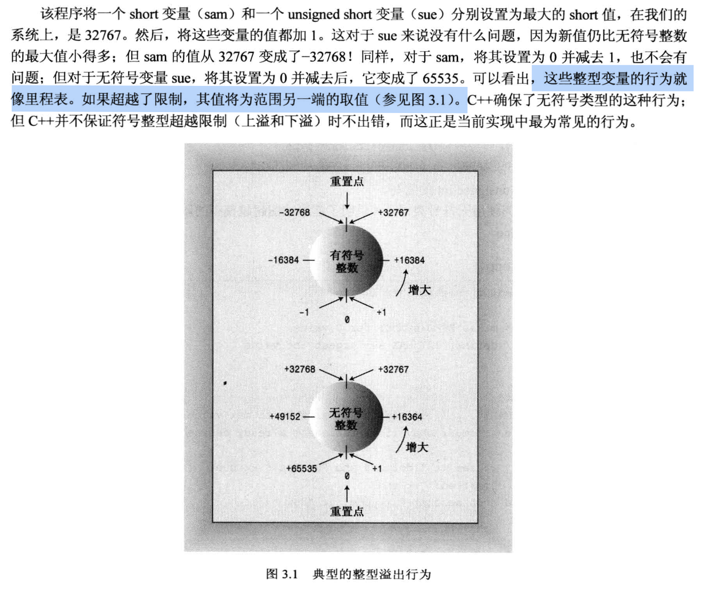

# 第三章: 处理数据
 - 面向对象的本质是 设计 & 扩展 自己的数据类型. 
   - 类包含`数据`和`操作数据的方法`, 是一种抽象的概念;
   - 对象是类的实例化, 是抽象的具象化, 把抽象的东西变成可操作的具体东西.
   - 让自己设计的数据类型与数据匹配, 这就是`面向对象编程`. 

## 3.1 简单的变量
- 变量名命名规则:
  - 只包含`字母`, `数字`, `下划线`的字符串;
  - 不能用关键字作为名字
  - 第一个字符不能是数字
  - 以 `两个下划线` 或 `下划线和大写字母` 开头的名称是 `编译器保留的名称`, **不建议**用作`普通变量名`.
    - 这种方式其实是`合法的`, 但是可能会导致行为的不确定性
      - 因为行业里约定 `下划线开头的变量一般是全局变量`, 如 `_time_stop`.
      - `两个下划线开头的变量` 通常是编译器里的变量, 一般用来调度资源等, 虽然写法合法, 但是存在风险.
  - 变量名称的长度没有限制
    - C 语言中, 限制变量名长度为 `63` 个字符, 超过 63 的字符没有意义.
    - 有些 C++ 平台可能会对变量名的长度做限制

### 整型
- 包含 char, short, int, long, long long 类型
  - 每种类型都有`有符号`和`无符号`的区分, 所以细分之下, 一共有10种.
  - char 在 C++ 里是分配到整型的类别中.
- 不同类型之间占用的空间(根据编译器的不同而不同):
  - short `至少16位`
  - int `至少与short一样长`
  - long `至少32位, 且至少与int一样长`
  - long long `至少64位, 且至少与long一样长`

- 查看变量的长度 --> 使用 `sizeof`
  - sizeof 可以查看 `类型` 的长度, 也可以查看 `变量` 的长度
  - 返回的单位是 `字节`
  - sizeof `不是函数`, 而是 `运算符`
    - 查看变量类型大小的写法: `sizeof(int); // 要加括号`
    - 查看变量长度的写法: `sizeof a; 可加括号也可以不加//`

- 关于初始化
  - 使用赋值符号 `=`, 推荐这种方式, 因为有些编译器对其他的赋值方式支持可能不是很好.
  - 使用圆括号`()`
  - 使用花括号`{}`
    -  使用花括号的时候, 如果是C++11以上的版本, 此时可以省略等号`=`.
    -  使用花括号的好处是: `可以统一赋值的方式, 不同类型可以用相同的方式进行赋值`, 例如 数组 的赋值.
  - 如果`局部变量`没有进行`初始化`, 它的取值是`不确定的` 
    - `不存在默认值`的说法, 会取什么值完全看当前的内存状态, 内存块里可能是以前被使用过的垃圾值, 总之就是不确定.

代码示例 --> 整型变量的定义和初始化
```cpp
#include <iostream>
#include <climits>  // 这个库来自C语言

using namespace std;

int main(void)
{
    int n_int = INT_MAX;  // 从 climits 库中获取的常量变量
    int n_short = SHRT_MAX;
    long n_long = LONG_MAX;
    long long n_llong = LLONG_MAX;

    
    // sizeof 只是一个运算符, 查看变量的时候可以不加括号, 但是查看类型的时候 **必须** 加括号
    cout << "int is " << sizeof(int) << " bytes." << endl;       // 在mac系统和Ubuntu系统的编译器中, int 都占据 4 各个byte
    cout << "short is " << sizeof n_short << " bytes." << endl;  // 在 mac 系统里, short 占用 4个byte, Ubuntu里是2个byte
    cout << "long is " << sizeof n_long << " bytes." << endl;    // 在 mac 系统里, long 占用 8个byte (32位), 和 Ubuntu一样, 符合规定
    cout << "long long is " << sizeof n_llong << " bytes." << endl; // 在 mac 系统里, long long 占用 8个byte (32位, 至少和long一致), 和 Ubuntu一样, 符合规定
    


    cout << "Maximun value of int: "
        << n_int        // 2147483647
        << endl;
    cout << "Maximun value of short: " 
        << n_short      // 32767
        << endl;
    cout << "Maximun value of long:"
        << n_long       // 9223372036854775807
        << endl;
    cout << "Maximum value of long long: "
        << n_llong      // 9223372036854775807
        << endl;


    // 测试赋值方法
    int n (3);           // 使用圆括号进行初始化
    cout << "n is: "
        << n
        << endl;
    
    int a = {3};         // 在 C++11 中, 可以使用花括号进行初始化, 
    // int b {4};           // mac上可能装的C++版本不够高, 忽略等号(=)的时候报错了.
    cout << "a is: "
        << a
        << endl;

    return 0;
}
```

- 定义无符号整型变量
  - 使用`unsigned`关键字, 例如: `unsigned int a;`

代码示例 -- > 数据访问越界的情况
```cpp
#include <iostream>
#include <climits>

int main(void)
{
    using namespace std;

    short sam = SHRT_MAX;       // 有符号整型变量
    unsigned short sue = sam;   // 无符号整型变量

    cout << "Sam has " << sam << " dollors and Sue has " << sue << " dollors deposited." << endl;
    cout << "Add $1 to each account. " << endl;
    
    // 测试向上溢出
    sam = sam + 1;     // 有符号数, 原来已经是最大值, 此时会发生越界
    sue = sue + 1;      // 无符号数, 范围是 0-65535, 不会越界

    cout << "Now Sam has " << sam << " dollors and Sue has " << sue << " dollors deposited." << endl;

    // 测试向下溢出
    sam = 0;
    sue = 0;

    sam = sam - 1;
    sue = sue - 1;
    
    cout << "Now Sam has " << sam << " dollors and Sue has " << sue << " dollors deposited." << endl;

    return 0;
}
```
- 关于`向上/下溢出`的图示说明 (图的解读方式是逆时针旋转去解读)
  - 

- 关于变量类型的选取:
  - 没有特殊指明的前提下, 无脑用 `int`
  - 原则上, 遵循`能省则省`的原则去选择数据类型, 占用空间越小越好.
  
- 整型的字面含义
  - 如果数字第一位是`0-9`, 则系统默认以`十进制`解读这个数字
  - 如果数字的第一位是`0`, 第二位是`1-7`, 则系统默认以`八进制`解读这个数字
  - 数字的开头为 `0x` 或 `0X` 的时候, 都是以`十六进制`解读这个数字
  - cout 打印数字的时候, 默认都是`十进制`
    - 如果要用不同进制, 则需要增加一些控制字符, 例如:
      -  `cout << dec; // 使用十进制`
      - `cout << hex; // 使用十六进制`
      - `cout << oct; // 使用八进制`

代码示例 --> 不同进制的数字
```cpp
#include <iostream>

int main(void)
{
    using namespace std;

    int cheat = 42;
    int waist = 0x42;
    int inseam = 042;

    // cout 默认 以 十进制 打印数字
    cout << "cheat = " << cheat << " (42 in dec)." << endl;
    cout << "waist = " << waist << " (0x42 in hex)." << endl;
    cout << "inseam = " << inseam << " (042 in oct)." << endl;
    cout << endl;

    // 都用 十六进制 打印数字
    cout << hex;
    cout << "cheat = " << cheat << " (42 in dec)." << endl;
    cout << "waist = " << waist << " (0x42 in hex)." << endl;
    cout << "inseam = " << inseam << " (042 in oct)." << endl;
    cout << endl;


    // 都用 八进制 打印数字
    cout << oct;
    cout << "cheat = " << cheat << " (42 in dec)." << endl;
    cout << "waist = " << waist << " (0x42 in hex)." << endl;
    cout << "inseam = " << inseam << " (042 in oct)." << endl;
    cout << endl;

    // 分别使用不同的进制打印
    cout << dec;
    cout << "cheat = " << cheat << " (in dec)." << endl;
    cout << hex;
    cout << "waist = " << waist << " (in hex)." << endl;
    cout << oct;
    cout << "inseam = " << inseam << " (in oct)." << endl;


    return 0;
}
```