# 第三章: 处理数据
 - 面向对象的本质是 设计 & 扩展 自己的数据类型. 
   - 类包含`数据`和`操作数据的方法`, 是一种抽象的概念;
   - 对象是类的实例化, 是抽象的具象化, 把抽象的东西变成可操作的具体东西.
   - 让自己设计的数据类型与数据匹配, 这就是`面向对象编程`. 

## 3.1 简单的变量 (细讲整型, 浮点型在3.3)
- 变量名命名规则:
  - 只包含`字母`, `数字`, `下划线`的字符串;
  - 不能用关键字作为名字
  - 第一个字符不能是数字
  - 以 `两个下划线` 或 `下划线和大写字母` 开头的名称是 `编译器保留的名称`, **不建议**用作`普通变量名`.
    - 这种方式其实是`合法的`, 但是可能会导致行为的不确定性
      - 因为行业里约定 `下划线开头的变量一般是全局变量`, 如 `_time_stop`.
      - `两个下划线开头的变量` 通常是编译器里的变量, 一般用来调度资源等, 虽然写法合法, 但是存在风险.
  - 变量名称的长度没有限制
    - C 语言中, 限制变量名长度为 `63` 个字符, 超过 63 的字符没有意义.
    - 有些 C++ 平台可能会对变量名的长度做限制

### 整型
- 包含 char, short, int, long, long long 类型
  - 每种类型都有`有符号`和`无符号`的区分, 所以细分之下, 一共有10种.
  - char 在 C++ 里是分配到整型的类别中.
- 不同类型之间占用的空间(根据编译器的不同而不同):
  - short `至少16位`
  - int `至少与short一样长`
  - long `至少32位, 且至少与int一样长`
  - long long `至少64位, 且至少与long一样长`

- 查看变量的长度 --> 使用 `sizeof`
  - sizeof 可以查看 `类型` 的长度, 也可以查看 `变量` 的长度
  - 返回的单位是 `字节`
  - sizeof `不是函数`, 而是 `运算符`
    - 查看变量类型大小的写法: `sizeof(int); // 要加括号`
    - 查看变量长度的写法: `sizeof a; 可加括号也可以不加//`

- 关于初始化
  - 使用赋值符号 `=`, 推荐这种方式, 因为有些编译器对其他的赋值方式支持可能不是很好.
  - 使用圆括号`()`
  - 使用花括号`{}`
    -  使用花括号的时候, 如果是C++11以上的版本, 此时可以省略等号`=`.
    -  使用花括号的好处是: `可以统一赋值的方式, 不同类型可以用相同的方式进行赋值`, 例如 数组 的赋值.
  - 如果`局部变量`没有进行`初始化`, 它的取值是`不确定的` 
    - `不存在默认值`的说法, 会取什么值完全看当前的内存状态, 内存块里可能是以前被使用过的垃圾值, 总之就是不确定.

代码示例 --> 整型变量的定义和初始化
```cpp
#include <iostream>
#include <climits>  // 这个库来自C语言

using namespace std;

int main(void)
{
    int n_int = INT_MAX;  // 从 climits 库中获取的常量变量
    int n_short = SHRT_MAX;
    long n_long = LONG_MAX;
    long long n_llong = LLONG_MAX;

    
    // sizeof 只是一个运算符, 查看变量的时候可以不加括号, 但是查看类型的时候 **必须** 加括号
    cout << "int is " << sizeof(int) << " bytes." << endl;       // 在mac系统和Ubuntu系统的编译器中, int 都占据 4 各个byte
    cout << "short is " << sizeof n_short << " bytes." << endl;  // 在 mac 系统里, short 占用 4个byte, Ubuntu里是2个byte
    cout << "long is " << sizeof n_long << " bytes." << endl;    // 在 mac 系统里, long 占用 8个byte (32位), 和 Ubuntu一样, 符合规定
    cout << "long long is " << sizeof n_llong << " bytes." << endl; // 在 mac 系统里, long long 占用 8个byte (32位, 至少和long一致), 和 Ubuntu一样, 符合规定
    


    cout << "Maximun value of int: "
        << n_int        // 2147483647
        << endl;
    cout << "Maximun value of short: " 
        << n_short      // 32767
        << endl;
    cout << "Maximun value of long:"
        << n_long       // 9223372036854775807
        << endl;
    cout << "Maximum value of long long: "
        << n_llong      // 9223372036854775807
        << endl;


    // 测试赋值方法
    int n (3);           // 使用圆括号进行初始化
    cout << "n is: "
        << n
        << endl;
    
    int a = {3};         // 在 C++11 中, 可以使用花括号进行初始化, 
    // int b {4};           // mac上可能装的C++版本不够高, 忽略等号(=)的时候报错了.
    cout << "a is: "
        << a
        << endl;

    return 0;
}
```

- 定义无符号整型变量
  - 使用`unsigned`关键字, 例如: `unsigned int a;`

代码示例 -- > 数据访问越界的情况
```cpp
#include <iostream>
#include <climits>

int main(void)
{
    using namespace std;

    short sam = SHRT_MAX;       // 有符号整型变量
    unsigned short sue = sam;   // 无符号整型变量

    cout << "Sam has " << sam << " dollors and Sue has " << sue << " dollors deposited." << endl;
    cout << "Add $1 to each account. " << endl;
    
    // 测试向上溢出
    sam = sam + 1;     // 有符号数, 原来已经是最大值, 此时会发生越界
    sue = sue + 1;      // 无符号数, 范围是 0-65535, 不会越界

    cout << "Now Sam has " << sam << " dollors and Sue has " << sue << " dollors deposited." << endl;

    // 测试向下溢出
    sam = 0;
    sue = 0;

    sam = sam - 1;
    sue = sue - 1;
    
    cout << "Now Sam has " << sam << " dollors and Sue has " << sue << " dollors deposited." << endl;

    return 0;
}
```
- 关于`向上/下溢出`的图示说明 (图的解读方式是逆时针旋转去解读)
  - 

- 关于变量类型的选取:
  - 没有特殊指明的前提下, 无脑用 `int`
  - 数字后加`l或L`, 会被识别为 `long` 类型
    - `ll或LL`, 会被识别为 `long long` 类型
  - 数字后加`u或U`, 会被识别为 `unsigned` 类型
    - 如 `2023LU` 和 `2023UL` 都被认为是`unsigned long`类型
  - 原则上, 遵循`能省则省`的原则去选择数据类型, 占用空间越小越好.
  
- 整型的字面含义
  - 如果数字第一位是`0-9`, 则系统默认以`十进制`解读这个数字
  - 如果数字的第一位是`0`, 第二位是`1-7`, 则系统默认以`八进制`解读这个数字
  - 数字的开头为 `0x` 或 `0X` 的时候, 都是以`十六进制`解读这个数字
  - cout 打印数字的时候, 默认都是`十进制`
    - 如果要用不同进制, 则需要增加一些控制字符, 例如:
      -  `cout << dec; // 使用十进制`
      - `cout << hex; // 使用十六进制`
      - `cout << oct; // 使用八进制`

- 书本中描述的 C++ 识别常量的规则
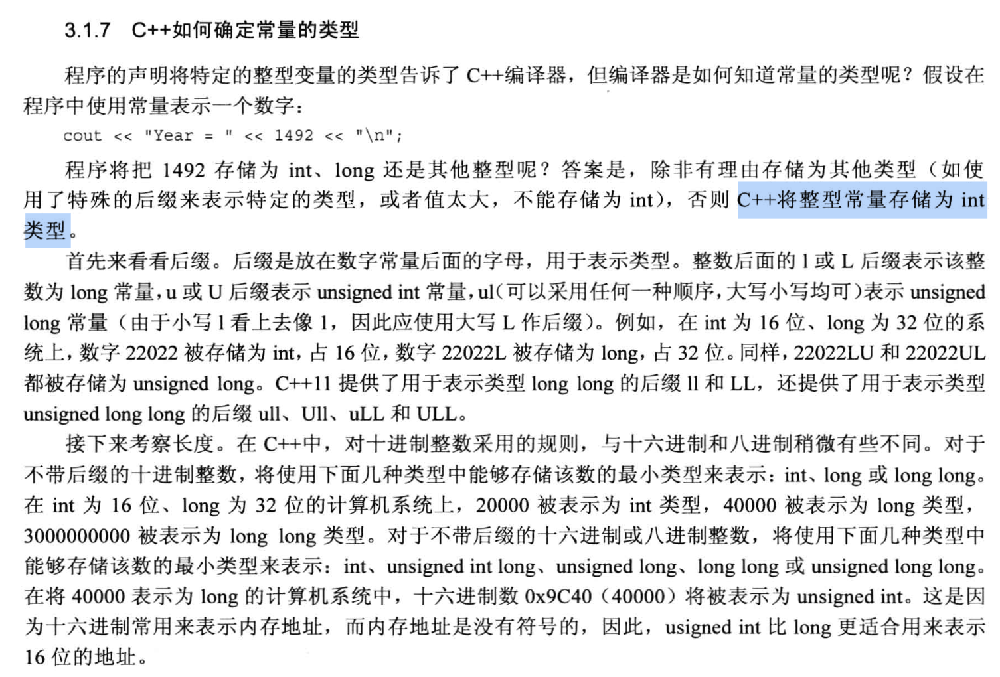


代码示例 --> 不同进制的数字
```cpp
#include <iostream>

int main(void)
{
    using namespace std;

    int cheat = 42;
    int waist = 0x42;
    int inseam = 042;

    // cout 默认 以 十进制 打印数字
    cout << "cheat = " << cheat << " (42 in dec)." << endl;
    cout << "waist = " << waist << " (0x42 in hex)." << endl;
    cout << "inseam = " << inseam << " (042 in oct)." << endl;
    cout << endl;

    // 都用 十六进制 打印数字
    cout << hex;
    cout << "cheat = " << cheat << " (42 in dec)." << endl;
    cout << "waist = " << waist << " (0x42 in hex)." << endl;
    cout << "inseam = " << inseam << " (042 in oct)." << endl;
    cout << endl;


    // 都用 八进制 打印数字
    cout << oct;
    cout << "cheat = " << cheat << " (42 in dec)." << endl;
    cout << "waist = " << waist << " (0x42 in hex)." << endl;
    cout << "inseam = " << inseam << " (042 in oct)." << endl;
    cout << endl;

    // 分别使用不同的进制打印
    cout << dec;
    cout << "cheat = " << cheat << " (in dec)." << endl;
    cout << hex;
    cout << "waist = " << waist << " (in hex)." << endl;
    cout << oct;
    cout << "inseam = " << inseam << " (in oct)." << endl;


    return 0;
}
```

### char 类型 (整型中的一种)
- 字符的存储是以对应的`字符编码值进行存储`的, 所以是整型.
  - 存储的是 `ASCII 编码`.
    - 例如: `A` 的编码值是 `65`, `a` 的编码值是 `97`
  - 由于很多系统支持的字符都不超过128个, 而一个字节(8 bit)可以表示 256 个数, 因此, 一个字节就可以表示一个字符.

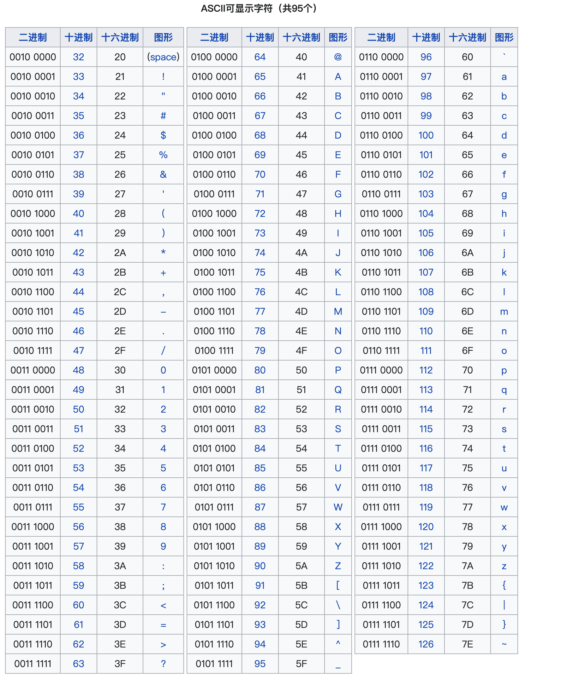
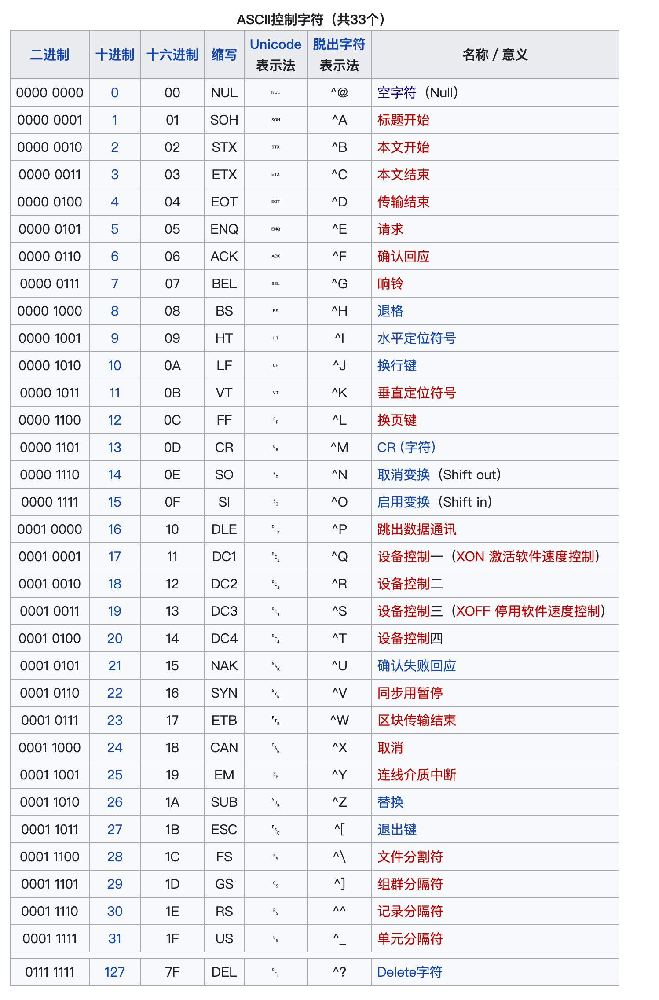
Ref: https://www.runoob.com/w3cnote/ascii.html

代码示例1:
```cpp
#include <iostream>
using namespace std;

int main(void)
{
    char ch;
    cout << "Enter a character: ";
    cin >> ch;   //cin将字符型变量转换成对应的ASCII码 (根据变量类型来识别是否转ASCII码并完成转换), 内存中存储的是ASCII码

    // cout 根据变量类型, 将ASCII码转换成对应的字符进行输出
    cout << "Hello, thank you for entering the character " << ch << endl;
    
    return 0;
}
```

代码示例2:
```cpp
#include <iostream>
using namespace std;

int main(void)
{
    char ch = 'M';   //注意, 字符型变量一定要用单引号, 双引号表示字符串, 不能赋值给char类型
    int i = ch;      //char类型赋值给int类型, 把char类型存放在内存中的值取出来了
    
    // 从下面的语句可以看到, ch 是char类型, cout 自动把它转成了对应的ASCII码, i 是整型, 啥都不干, 直接当做十进制数输出.
    cout << "The ASCII code for " << ch << " is " << i << endl;

    cout << "Add one to the character code." << endl;
    ch = ch + 1;
    i = ch;
    cout << "The ASCII code for " << ch << " is " << i << endl;

    // 使用cout.put()函数输出字符
    cout << "Displaying char ch using cout.put(ch): ";
    cout.put(ch);           // 点 . 运算符是"成员运算符", 用来调用对象的方法.
    cout.put('!');
    cout << endl << "Done" << endl;

    return 0;
}
```

- C++中常用的`转义序列/转义字符`, 注意, 它们都是`一个字符`.
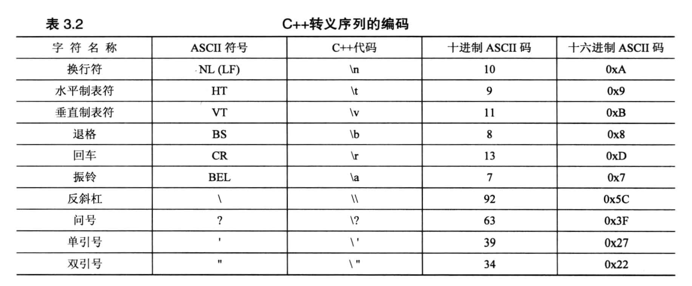
-  书本建议: 只输出`字符串`时, 使用`\n`代码量更少, 更推荐, 输出`变量`时, 使用`endl`更好.

使用示例:
```cpp
#include <iostream>
using namespace std;

int main(void)
{
    cout << "Hello World!" << endl;
    cout << "Good Morning! \n";
    cout << "What is your name?" << '\n';  // 用字符去写转义字符
    cout << "What is your name?" << "\n";  // 用字符串去写转义字符
    
    return 0;
}
```

- char 类型的扩充类型(用的不多, 不详细记录了):
  - signed char 和 unsigned char
  - wcha_t, wcha16_t, wchar32_t


### boolean 类型 (布尔类型)
- 只有两种取值: True 和 False
  - `非零值都可以作为True`, `0 作为 False`
  - 如 `bool is_ready = true;`
- 布尔类型在初始化时, 如果不以 true 或 false 赋值, 会发生自动的类型转换.
  - 例如:
```cpp 
  bool ans = true; 
  int i = ans;          // i = 1
  int promise = false;  // promise = 0

  bool start = -100;    // start = true
  bool stop = 0;        // stop = false
```

## 3.2 const 限定符
- const 修饰的变量表示`该变量是一个常量`, 不能被修改.
  - 强行去修改的话, 编译会报错.
  - 约定俗成的规矩: `常量通常首字母都大写, 全大写的定义方式一般用在 define 宏定义中`
  - 使用示例:
```cpp
#include <iostream>
using namespace std;

int main(void)
{
    // const int toes;  // 没有进行初始化, 但是这块内存里其实本身已经有(垃圾)值, 后面不允许再更改的了, 
    //                 //这种写法等于是定义了一个垃圾变量, 编译也会报错的.
    // toes = 10;       // 上一句代码已经定义了toes为常量(值被自动初始化为内存块里的垃圾值了), 这里再赋值就是错误的了.
    
    const int toes = 10;  // 这样就是正确的写法了
    
    return 0;
}
```

- define 与 const 的比较:
  - const 比 define 更好: 
    - const 可以更清楚地描述当前变量是否为常量
    - const 可以起到`限制作用域`的效果, define 是全局的, 会影响到其他作用域.
    - const 可以用于更加复杂的类型(数组和结构体 --> 第四章)

## 3.3 浮点数
- 有小数的数值.
 - 小数的表达方式:
   - 直接用小数点表达: `3.14`
   - 使用科学计数法 (e或E表示以10为底数): 
     - `+`号表示小数点往右移; `-`号表示小数点往左移
     - `2.52e+8` 表示2.52乘以10的8次方
     - `8.33e-4` 表示8.33乘以10的-4次方

- 浮点数的精度:
  - float 类型: 通常占用 `4 个字节(32位)`, 精度为6位有效数字;
  - double 类型: 至少和6个字节(48位) 通常为 `8个字节(64位)` 且 不少于 float;
  - long double 类型: 至少和 double 一样多, 通常占用 `10个字节(80位), 12个字节(96位), 16个字节(128位)` 且 不少于 double;

代码例子:
  - 为了体现精度, 下面代码中使用了 ostream 中的方法`setf`, 它可以迫使实处使用定点表示法, 防止使用科学计数法. 
  - cout 默认只会打印小数点后6位
  - cout 不会打印类似`3.250000`这种数字, 而是打印`3.25`.
```cpp
#include <iostream>
using namespace std;

int main(void)
{
    cout.setf(ios_base::fixed, ios_base::floatfield); // iostream 的常量, 后面章节会讲, 这里直接用, 先不管
    
    // 测试 float 类型的精度
    float tub = 10.0/3.0;
    const float million = 1.0E6;

    cout << "tub = " << tub <<endl;                                 // 默认只输出小数点后六位
    cout << "A million tubs = " << million * tub << endl;           // 打印的数字是 3333333.250000, 小数点部分是错的 
    cout << "Ten million tubs = " << 10 * million * tub << endl;    // 数字部分是 33333332.000000, 这个除法结果是错的, 原因是float精度达不到要求

    // 测试 double 类型的精度
    double mint = 10.0/3.0;
    cout << "mint = " << mint << endl;
    cout << "A million mints = " << million * mint << endl;        // 3333333.333333, 结果正确
    cout << "Ten million mints = " << 10 * million * mint << endl; // 3333333.333333, 结果正确

    return 0;
}
```

- 浮点数的优缺点:
  - 优点:
    - 可以表示小数
    - 数字表示范围更大
  - 缺点:
    - `做运算时`, 运算速度比整数`慢`, 且`精度降低`.

代码例子:
```cpp
#include <iostream>
using namespace std;

int main(void)
{
    float a = 2.34E+22;
    float b = a + 1.0;

    cout << "a = " << a << endl;

    // 运算过程中, 精度降低的例子
    cout << "b - a = " << b - a << endl; // 正常情况下, 差值是1, 但是程序输出是0.

    return 0;
}
```

 - 原因:
   - 2.34E+22 是一个小数点左侧有23位的数字, 加上1之后, 就是第23位 +1, 但是float类型只能表示数字中的 `前6位或7位`, 因此修改第23位对这个值不会产生任何影响. 
   - 对于float类型来说, 从右侧的最高位向左侧的低位方向看过去, 超过6或7位的那些数字它直接当做0来处理, 也可以理解为它把那些数字忽略了.


### 关于浮点数的额外补充 ==> 关于精度问题的深入理解
1. 浮点数在内存中如何存储?
   - `float` 是一个`单精度浮点型`, 在内存中占用`32 bit`
   - `double` 是一个`双精度浮点型`, 在内存中占用`64 bit`
   - 计算机存储数值都是以`二进制`数进行存储的
   - 存储需要遵循 IEEE 标准: 用`二进制的科学计数法`进行存储
     - 对于例子 `float a = 8.25;`, 计算机首先将它转为二进制数:
       - 整数部分变为: `1000`
       - 小数部分为: `01`
       - 整体也就是: `1000.01`
       - 转成二进制的科学计数法: `1.00001 x 2^3`
     - 对于例子 `float 50.25`
       - 对应的二进制为: `110010.01`
       - 二进制科学计数法: `1.1001001 x 2^5`

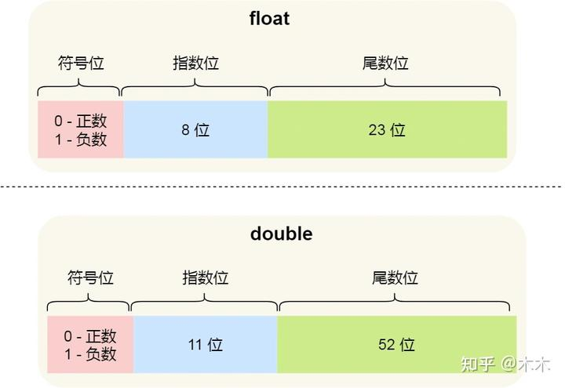
- 从上图可以看出, `float 类型一共有32个bit的有效位`, `double 类型一共有64个bit的有效位` (这是书本中提到的).
- 对于 float 类型, 它的`尾数位一共23位, 加上一个隐藏的整数位, 一共是24位`, 由于`一个十进制数占用4个bit`, 因此, float 类型一共只能表示 `24/4 = 6个十进制数`, 这就是书本中提到的 `精度为6位` 的原因, 书中没有说明是十进制的6位数字.
- 同理, 对于 double 类型, 它的`尾数位一共52位, 加上一个隐藏的整数位, 一共是53位`, 大概能表示 `13个十进制数`, 因此, double 类型的十进制数精度是13位, 超过13位的数字, double 类型也是不准的.
   - 存放的时候, 二进制的整数部分一定是1, 所以直接忽略掉了, 只记录`尾数位`, 而忽略掉`整数部分`;
   - `指数位`是有正负区分的, 因此, 这里的8 bit被分成`"0~126, 代表负次幂"` 和 `"127~255, 代表正次幂"`
     - 所以, 如果是2的3次方, 次数存储的`指数位是十进制的 127+3 = 130`, 对应的二进制数值是 `1000 0010`

2. (知道了存储中的存储方式之后) 如何理解浮点型在运算的时候精度会降低?
   - 十进制的小数在转换为二进制之后, 由于存储空间的限制, 它的小数部分转换会丢失精度
     - 如 `11.17`, 小数部分在转换成二进制之后, 会变成 `0.001001001...`, 对于 float 类型来说, 超过23位的小数部分就被丢弃了, 对于 double 类型来说, 超过52位的小数部分就被丢弃了, 我们很难保证十进制转二进制的时候不丢失小数部分的精度.


## 3.4 C++中的算数运算符
 - 算数运算符: `+ - * / %`
 - `%` 表示取模, 取余数

代码例子:
```cpp
#include <iostream>

int main(void)
{
    using namespace std;

    float hats, heads;

    cout.setf(ios_base::fixed, ios_base::floatfield); // fixed-point
    cout << "Enter a number: ";
    cin >> hats;                        // 输入 50.25
    cout << "Enter another number: ";
    cin >> heads;                       // 输入 11.17

    cout << "hats = " << hats << ", heads = " << heads << endl;

    // 注: 如果不适用setf固定显示精度的话, cout 能输出一个四舍五入的结果, 比较接近手算的结果
    cout << "hats + heads = " << hats + heads << endl;  // 得到 61.4199981689453125, 手算是61.42, 但是二进制没办法精确表示(内存限制, float小数只能表示23位二进制数), 发生精度丢失
    // 减法
    cout << "hats - heads = " << hats - heads << endl;  // 得到 39.0800018310546875, 手算是39.08, 但是二进制没办法精确表示(内存限制, float小数只能表示23位二进制数), 发生精度丢失
    // 乘法
    cout << "hats * heads = " << hats * heads << endl;  // 得到 560.29248046875, 手算是560.2925, 但是二进制没办法精确表示(内存限制, float小数只能表示23位二进制数), 发生精度丢失
    // 除法
    cout << "hats / heads = " << hats / heads << endl;  // 得到 4.501345157623291, 手算是4.501345, 但是二进制没办法精确表示(内存限制, float小数只能表示23位二进制数), 发生精度丢失

    return 0;
}
```

- 运算优先级
  - `* / %` 的优先级高于 `+ -`
  
- 对于除法来说, 如果两个操作数都是整数, 那么结果也是整数, 会丢失小数部分的精度
    - 如 `5 / 2 = 2`, 直接丢弃小数, 不进行四舍五入
    - 如 `5.0 / 2 = 2.5`, 5被转换为精度更高的浮点数
    代码例子:
```cpp
#include <iostream>

int main(void)
{
    using namespace std;

    cout.setf(ios_base::fixed, ios_base::floatfield);

    cout << "Integer division: 9/5 = " << 9 / 5 << endl;  // 输出1, 丢弃了小数部分
    cout << "Floating-point division: 9.0/5.0 = " << 9.0/5.0 << endl;        // 输出1.800000 
    cout << "Mixed division: 9.0/5 = " << 9.0/5 << endl;    // 输出1.800000
    cout << "double constants: 1e7/9.0 = " << 1e7/9.0 << endl;     // 输出1111111.111111, 数字后啥都不加, 默认处理为 double
    cout << "float constants: 1e7f/9.0f = " << 1e7f/9.0f << endl;  // 输出1111111.125000, 数字后面加 f 或 F, 标记为 float

    return 0;
}
```

- 运算符重载(简介)
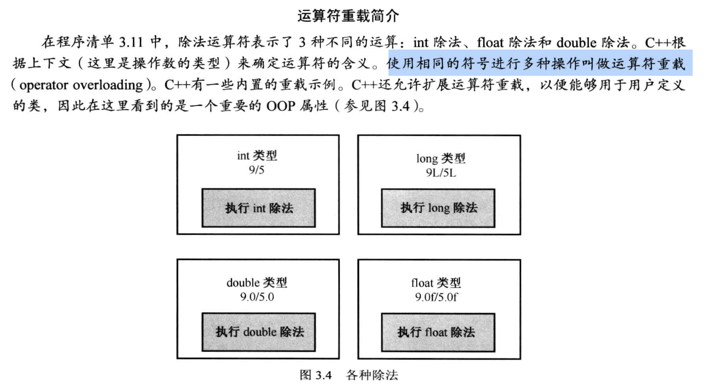

- 求模运算 `%`
  - 求余数, 余数的符号和被除数的符号相同

代码例子:
```cpp
#include <iostream>

int main(void)
{
    using namespace std;

    const int Lbs_per_stn = 14; // 一英石等于十四磅

    int lbs;

    cout << "Enter your weight in pounds: ";
    cin >> lbs;
    int stone = lbs / Lbs_per_stn;   // 多少英石
    int pounds = lbs % Lbs_per_stn;  // 剩余多少磅

    cout << lbs << " pounds = " << stone << " stone " << pounds << " pounds." << endl;
    return 0;
}
```

## 类型转换
### 1. 初始化和赋值的转换
- 将一个值赋值给取值`范围更大的类型`是合法的, C++会自动完成类型转换
  - 如: `so_long = thirty;`, 
    - so_long 是 long 类, thirty 是short类型, 此时, thirty 里面的`值会被拷贝出来`, 转换成 long 类型, 然后赋值给 so_long
    - thirty 本身不会发生任何改变.

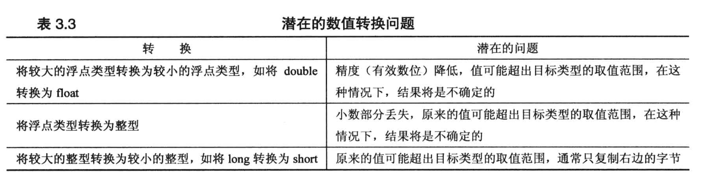

代码示例:
```cpp
#include <iostream>

int main(void)
{
    using namespace std;

    cout.setf(ios_base::fixed, ios_base::floatfield);
    float tree = 3;     // double -> float
    
    //以下两行在编译时会有warning, 但没有error
    int guess(3.9832);  // double -> int, 没越界, 小数部分丢弃
    int debt = 7.2E12;  // double -> int, 已经超出int范围(越界), 得到的结果是不可预计的

    cout << "tree = " << tree << endl;   // mac 下打印出来是3.000000
    cout << "guess = " << guess << endl; // mac 下打印出来是3
    cout << "debt = " << debt << endl;   // mac 下打印出来是1

    return 0;
}
```

### 2. 利用 {} 方式进行初始化时的转换 --> 严格限制类型转换
```cpp
const int code = 66;
int x = 66;
char c1 {31325};    // error: 越界, 不允许
char c2 {66};       // ok
char c3 {code};     // ok, code 是常量66, 不会越界
char c4 {x};        // error: x 取值不确定, 存在越界风险, 不允许
x = 31325;
char c5 = x;        // 没有使用 {} 的方式初始化, 编译器允许, = 的初始化没那么严格 
```

### 3. 表达式中的转换
```cpp
short chikens = 20;     // int -> short
short ducks = 35;       // int -> short
short fowl = chikens + ducks;  // 两个short相加, 结果也是short
```

- 计算过程中的类型提升 --> 就高不就低
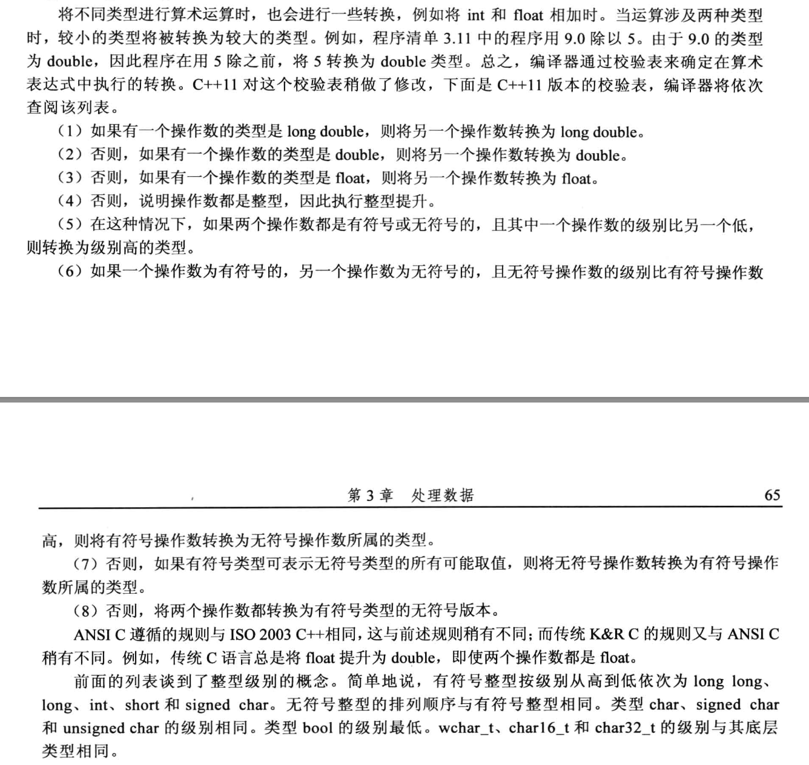

### 4. 函数传参时的类型转换
允许在函数声明时取消对参数传递的控制, 但是这样做并不明智.
- 如果取消对对参数传递的控制, 此时:
  - C++ 会对 `char` 和 `short 类型` `(包含signed 和 unsigned)` 使用`整型`进行类型提升
  - 为了保持与 C语言 中大量代码的兼容性, 如果取消传参时的参数传递控制, 那么C++会将 `float 转换为 double`.
- 正常情况下, 函数参数还是保持 严格对应类型 去传参的习惯比较好.


### 5. 强制类型转换
- 格式:
  - (typeName) value;   --> 用的更多一些, Java也是这种风格.
    - 如: `(long) thorn;`
  - typeName (value);   --> 这种风格是为了让强制类型转换长得像函数调用
    - 如: `long (thorn);` 

第十五章会讲4种强制类型转换的运算符, 转换更严格:
- static_cast<typeName> (value)
  - 如: `static_cast<long> (thorn)`

代码例子:
```cpp
#include <iostream>
using namespace std;

int main(void)
{
    int auks, bats, coots;

    auks = 19.99 + 11.99;               // 小数被舍弃
    bats = (int) 19.99 + (int)11.99;    // 先强制类型转换
    coots = int(19.99) + int(11.99);    // 先强制类型转换

    cout << "auks = " << auks << endl;  // 输出31
    cout << "bats = " << bats << endl;  // 输出30 
    cout << "coots = " << coots << endl; // 输出30

    char ch = 'Z';
    cout << "The code for " << ch << " is " << int(ch) << endl;
    
    cout << "The code for " << ch << " is " 
         << static_cast<int>(ch) << endl;     // 使用高级点的

    return 0;
}
```

## C++ 中的 auto 声明 (很少用) -- 第九章会细讲
简单的代码示例:
```cpp
auto n= 100;      // n is int
auto x=1.5;       // x is double
auto y = 1.3e12L; // y is long double

//若想将下面的x,y,z都制定为double类型:
auto x=0.0;     // ok, x is double because 0.0 is double
double y = 0;   // ok, 0 automatically converted to 0.0
auto z= 0;      // oops, z is int because 0 is int
```


## 3.6 复习题
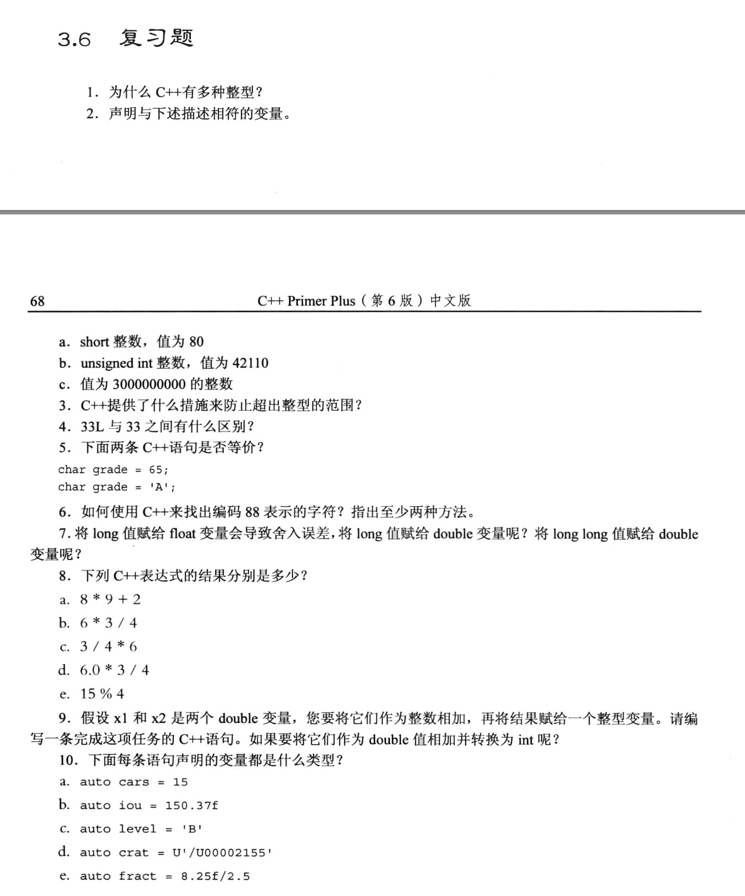

1. 为什么C++这么多整型:
- short, long, long long, char (这些都有 signed 和 unsigned 版本)
  - 有这么多, 是因为要根据数据运算的需要, 选择合适的数据类型进行应用和匹配.

2. 
```cpp
short a = 80;

unsigned int b = 42110;

unsigned int c = 3000000000;  // int 不行, unsigned int 是可以的
long c = 3000000000; 
```

3. C++ 语言没有提供自动防止超出整数类型范围的功能, 需要人为预估数据大小, 并选择合适的数据类型, 每一种数据类型的宽度, C++没有做严格规定, 具体是由开发平台和编译器来决定的!

4. 默认 C++ 整数在不超出int类型范围的情况下, 默认优先使用int类型. 
   - 33: 默认为 int 类型
   - 33L: 因为存在后缀 "L", 故要用 long 类型存储

5. 在基于 ASCII 码的平台下, 它们是等价的.
- char grade = 65; 是先将65转成int, 然后再转为 char 存在grade 里.

6.  
```cpp
//method 1
chat ch = 88;
cout << ch << endl;


//method 2:
cout << (char) 88 << endl;
```

7. 首先, 不同平台和编译器对应的 long 和 long long类型大小是不同的, 若 long 长度为4字节, 则存放在 double 类型中不会出现精度丢失问题(舍入误差), 如果 long long 类型为8字节, 则会发生舍入误差.

8. 
```cpp
8*9+2 = 74;
6*3/4 = 4;
3/4*6 = 0;
6.0*3/4 = 4.5;
15%4= 3;
```

9. 
```cpp
int sum = (int)x1 + (int)x2;
int sum = (int)(x1 + x2);
```

10. 
```txt
int;
float;
char;    
char32_t;   // 书本有例子, 这种类型不常用
double;
```


## 3.7 编程练习
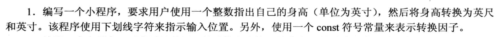
```cpp
#include <iostream>

int main(void)
{
    using namespace std;

    const int convert = 12;
    int height;

    cout << "Please enter you height in inches: _\b";   // \b 用来表征退格符, 把光标移动到对应的下划线上面
    cin >> height;
    cout << "Your height is " << height / convert << " feet and " << height % convert << " inches." << endl;

    return 0;
}
```


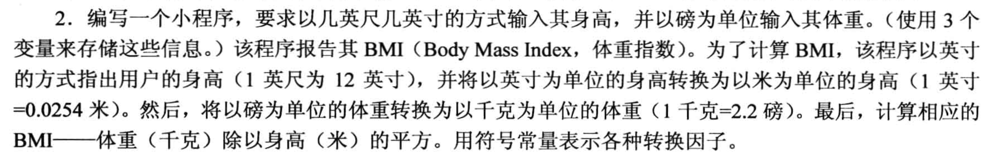 
```cpp
#include <iostream>

int main(void)
{
    using namespace std;
    const double to_inch = 12;
    const double to_meter = 0.0254;
    const double to_kg = 2.2;

    double h_inch;
    double h_feet;
    double w_pounds;

    cout << "Please enter your height in feet and inches: ";
    cin >> h_inch >> h_feet;      // cin不换行接收多个变量的数据, 输入数据时, 中间用空格隔开, 空格会被识别为结束符.

    cout << "Please enter your weight in pounds: _\b";
    cin >> w_pounds;

    double h_meter = (h_feet * to_inch + h_inch) * to_meter;
    double w_kg = w_pounds / to_kg;
    // cout << "h_meter = " << h_meter << ", w_kg = " << w_kg << endl;
    cout << "Your BMI is " << w_kg / (h_meter * h_meter) << endl;

    return 0;
}
```


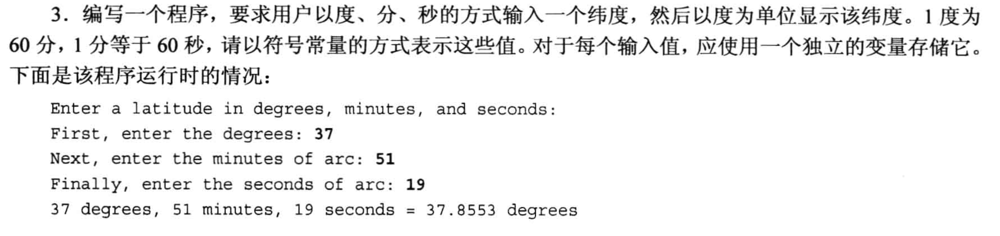
```cpp
#include <iostream>

int main(void)
{
    using namespace std;

    double degree, minute, second;
    const double to_degree = 60, to_minute = 60;

    cout << "Enter a latitude in degrees, minutes, and seconds:" << endl;
    cout << "First, enter the degrees: ";
    cin >> degree;
    cout << "Next, enter the minutes of arc: ";
    cin >> minute;
    cout << "Finally, enter the seconds of arc: ";
    cin >> second;

    cout << degree << " degrees, " << minute << " minutes, " << second << " seconds = " << degree + minute / to_degree + second / (to_minute * to_degree) << " degrees" << endl;

    return 0;
}
```

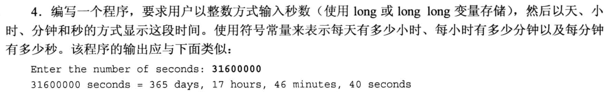
```cpp
#include <iostream>

int main(void)
{
    using namespace std;
    const int to_hour = 60*60, to_minute = 60, to_day = 60*60*24;
    long long second;
    
    cout << "Enter the number of seconds: ";
    cin >> second;
    // 计算这么多秒等于多少天, 多少小时, 多少分钟, 多少秒
    cout << second << " seconds = " << second / to_day << " days, " 
        << second % to_day / to_hour << " hours, " 
        << second % to_day % to_hour / to_minute << " minutes, " 
        << second % to_day % to_hour % to_minute << " seconds" 
        << endl;

    return 0;
}
```


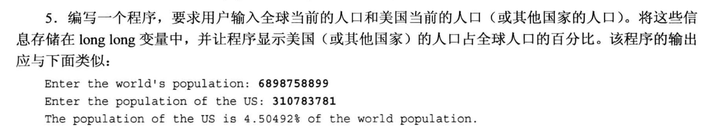
```cpp
#include <iostream>

int main(void)
{
    using namespace std;
    long w;
    long us;

    cout << "Enter the world's population: ";
    cin >> w;
    cout << "Enter the population of the US: ";
    cin >> us;

    cout << "The population of the US is "<< (double) us / w * 100 << "% of the world population." << endl;
    // cout << "The population of the US is " << double(us) / w * 100 << "% of the world population." << endl;

    return 0;
}
```


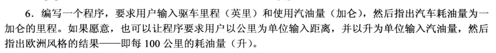
```cpp
#include <iostream>

int main(void)
{
    using namespace std;

    double mile, fuel;
    cout << "Enter the distance in mile: ";
    cin >> mile; 
    cout << "Enter the fuel consumption in gallon: ";
    cin >> fuel;
    cout << "The fuel consumption is " << mile / fuel << " gallon per mile." << endl;

    double liter, kilometer;
    cout << "Enter the distance in kilometer: ";
    cin >> kilometer;
    cout << "Enter the fuel consumption in liter: ";
    cin >> liter;
    cout << "The fuel consumption is " << liter / kilometer * 100 << " liter per 100 kilometer." << endl;
    
    return 0;
}
```


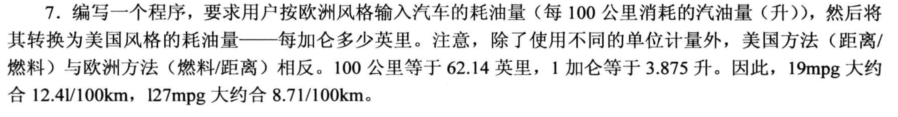
