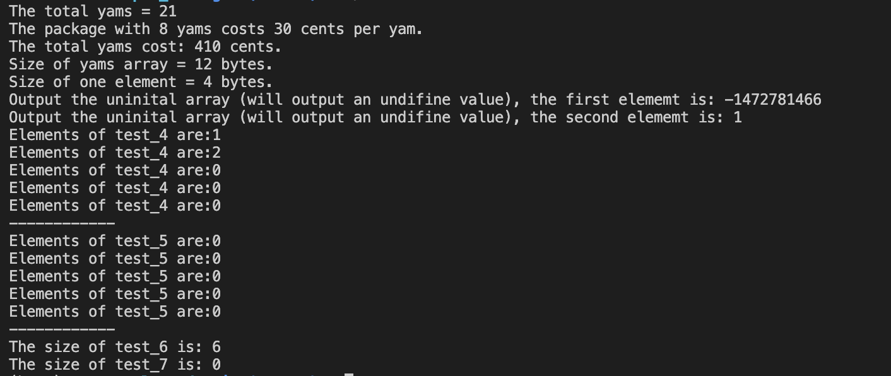
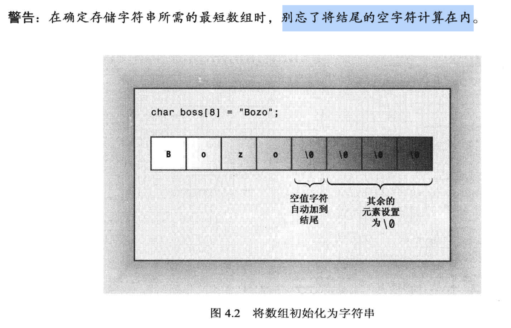
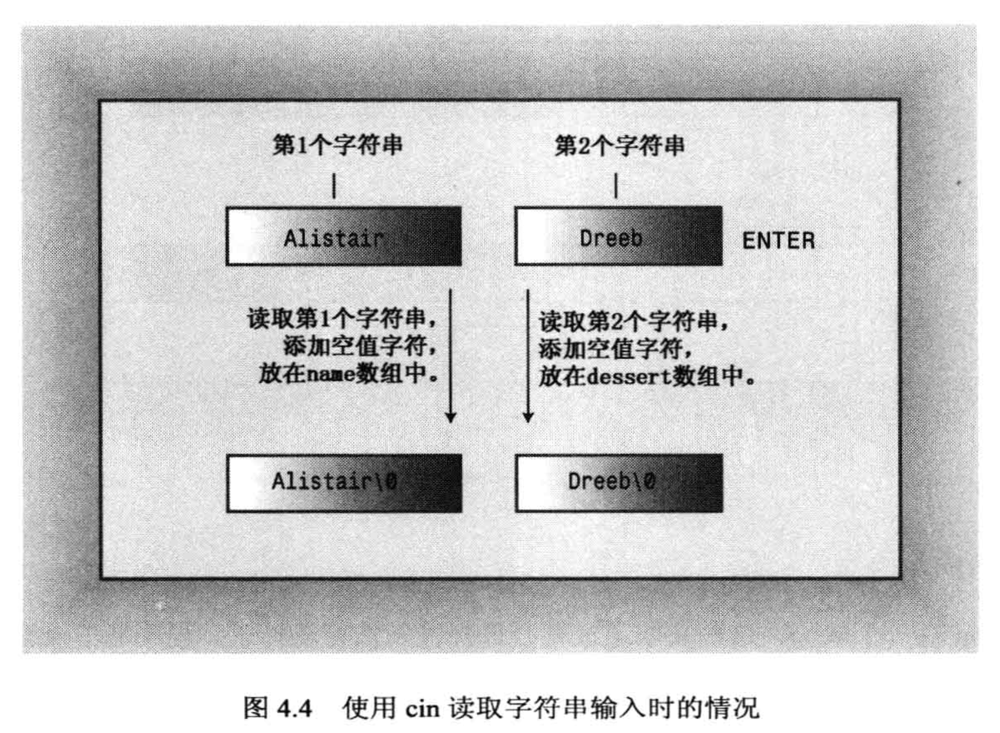
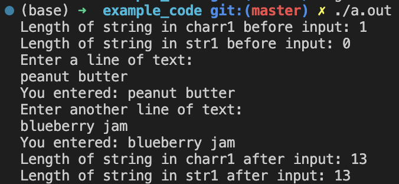

# 复合类型

## 4.1 数组
- 数组里存放的值(元素)都必须是相同类型
- C++的每一个数组元素在内存中是**连续存放的**
- 数组声明规则:
  1. 指定存储在每一个元素中的`值的类型`
  2. 数组名
  3. 数组中的`元素个数(说明数组的大小)`
- 数组声明的代码格式:
  - ` typeName arrayName [ arraySize ]`
    - arraySize 必须是`常量值/const值/常量表达式`, 如 `12`, `8*sizeof(int)`
    - 总的来说, 只要arraySize是不可变的就行
     - 如 `short monthes[12]`
  
- 数组的特点:
  1. 从 0 开始计数
  2. 用索引的方式指定数组元素, 如 `months[0]` 表示 第一个元素.
      - 编译器`不会检查索引是否合法`, 如 `months[100000] = 0;`, 在编译的时候是不会出错的, 但是程序运行的时候可能就崩了. 
      - 这种逻辑问题需要人工检查, 如果索引值大于数组的大小, 则会读取内存块之后的数据(都是垃圾值)
  3. 如果数组只声明, 但没有初始化的话, 数组的元素值是不确定的, 有可能是垃圾值(这块内存以前存放过的值), 也有可能是0.
  4. 对于批量初始化的数组(使用`花括号`进行初始化), 如果初始化的元素个数小于数组的大小, 则`剩下的元素会被初始化为0`.
      - 如果花括号内为`空`, 则所有`数组元素都初始化为0.`
       - 当`花括号内初始化的元素就是数组全部元素时`, 变量声明中可以`不写数组长度`.
       - C++ 11中, 使用花括号赋值可以省略 `=`, 但是要说明数组大小.
       - 不指定数组大小, 同时花括号为空时, 定义的是一个空数组.
        - 如 `int test_array[] = {};`, 数组长度是0.
      - 花括号进行赋值的时候, 要严格按照数组的数据类型进行赋值, `不支持隐式类型转换`.
  - 不可以直接将一个数组赋值给另一个数组.

数组代码例子:
```cpp
#include <iostream>

int main(void)
{
    using namespace std;

    int yams[3];   // 声明一个数组

    yams[0] = 7;
    yams[1] = 8;
    yams[2] = 6;

    int yamscost[3] = {20, 30, 5}; // 大花括号进行批量赋值, 之后就不可能再进行批量赋值了.

    cout << "The total yams = " << yams[0] + yams[1] + yams[2] << endl;

    cout << "The package with " << yams[1] << " yams costs " << yamscost[1] << " cents per yam.\n";

    cout << "The total yams cost: " << yams[0]*yamscost[0] + yams[1]*yamscost[1] + yams[2]*yamscost[2] << " cents." << endl;

    // 查看数组大小
    cout << "Size of yams array = " << sizeof(yams) << " bytes."<< endl;
    cout << "Size of one element = " << sizeof(yams[0]) << " bytes."<< endl;
    
    // 测试数组不赋值的打印
    int test[2];
    cout << "Output the uninital array (will output an undifine value), the first elememt is: " << test[0] << endl;
    cout << "Output the uninital array (will output an undifine value), the second elememt is: " << test[1] << endl;

    // 测试数组赋值给另一个数组
    int test_2[2] = {1, 2};
    int test_3[2];
    // test_3 = test_2;    // 编译就报错了, 不能直接赋值给另一个数组
    // cout << "测试数组给数组赋值, 赋值成功的话, test_3 的值为:" << test_3 << endl;

    // 数组部分赋值
    int test_4[5] = {1, 2};   // 只赋值前两个, 后面没赋值的都默认初始化为0
    int test_5[5] = {};       // 花括号内为空, 所有元素都初始化为0
    int i;
    for (i=0; i < 5; i++) {
        cout << "Elements of test_4 are:" << test_4[i] << "\n";
    }
    cout << "------------\n";

    for (i=0; i < 5; i++) {
        cout << "Elements of test_5 are:" << test_5[i] << "\n";
    }
    cout << "------------\n";

    // 当花括号内初始化的元素就是数组全部元素时, 变量声明中可以不写数组长度
    int test_6[] = {1, 2, 3, 4, 5, 6};
    int test_7[] = {};                      // 测试不指定数组大小, 同时花括号内为空, 此时数组长度为0
    // int test_7[6] {1, 2, 3, 4, 5, 6};    // 省略等号也可以, 但是只在 C++ 11 中支持, (mac上安装的版本不支持这个特性, 所以没测试)
    cout << "The size of test_6 is: " << sizeof(test_6)/sizeof(int) << endl;
    cout << "The size of test_7 is: " << sizeof(test_7)/sizeof(int) << endl;  // 空数组长度为0

    return 0;
}
```
代码输出:



## 4.2 字符串
字符串在内存中是连续存储的, 因此我们可以使用`char 数组`存储字符串.

处理字符串的方式一共有2种: 
* C语言风格的字符串
* C++风格的字符串, 使用 string 类库里的方法

### 4.2.1 C语言风格的字符串
  * C语言风格的字符串, 一定要以`空字符(null character) \0`作为结尾, 如:
    * `char dog[8] = {'b', 'e', 'a', 'u', 'x', ' ', 'I'};`, 不是一个字符串.
      * cout 打印的时候, 打印到 `I`之后不会停止打印, cout会沿着内存地址继续往下打印, 直到碰到内存中的第一个`\0`为止 (我们无法预测这个位置在哪里, 但是由于空字符很常见, 所以很快就能停下来).
    * `char cat[8] = {'f', 'a', 't', 'e', 's', 's', 'a', '\0'};`, 最后是一个空字符`\0`, 所以是一个字符串.
      * cout 只会打印到 a, 后面的`\0` 表明是字符串结束位置, cout会停止打印
  * 使用char数组去定义字符串需要使用大量的单引号, 非常不方便, 而且要人工加上一个`\0`, 我们可以直接用双引号`""`括起来, 如:
    * `char bird[11] = "Mr. Cheeps."`
    * `char fish[] = "Bubbles.";` , 编译器会自动在末尾补一个 `\0`.
    * 需要注意, `空字符\0也会占用一个数组元素位置`.



* 注意单引号和双引号的区别:
  * `单引号`描述的是`字符, char`
  * `双引号`描述的是`字符串, string`
    * **字符串和字符`常量`不是一回事!!!**
    * [特别注意!!!] 在赋值的时候, 变量存储的是`字符串的首地址`, 它不是char类型, 具体要到`指针`的章节才能讲清楚.
        * `char shirt_size = "S";` 是不合法的, 字符串在赋值的时候提供的是`字符串的首地址`数值, 它不是char类型. 

* 字符串在`拼接`的时候, 会自动忽略第一个字符串末尾的空字符, 直接进行拼接.

代码例子1   --> 注意 strlen 和 sizeof 的区别:
* strlen 统计字符串中`可见字符`的长度, 不包含空字符`\0`.
* sizeof 统计的是整个字符数组的长度, 如果有空字符也会被统计.
```cpp
#include <iostream>
#include <cstring>

int main(void)
{
    using namespace std;

    const int SIZE = 15;

    char name1[SIZE];
    char name2[SIZE] = "C++owboy";

    cout << "Howdy! I'm " << name2 << ". What is your name? \n";
    cin >> name1;   // basicman
    cout << "Well, " << name1 << " your name has " << strlen(name1) << " letters and is stored\n"; // 打印 8, strlen 计算的是字符串的长度, 而且是**可见字符**的长度, 空字符不会被统计
    cout << "Your name is stored in an array, which is " << sizeof(name1) << " bytes long.\n";     // 打印 15, 这是整个数组的大小, byte为单位 

    return 0;
}
```

代码例子2   --> cin 读取的输入存在的问题:
* 注意使用 cin 接收字符串时的bug:
  * 如果输入的字符串的时候, 存在`空格, 回车, tab键`等空白字符, 此时 cin 会根据空白字符对键入的内容进行截断 

```cpp
#include <iostream>

int main(void)
{
    using namespace std;
    const int ArSize = 20;

    char name[ArSize];
    char dessert[ArSize];
  
    //观察程序的bug 
    cout << "Enter you name: \n";

    /* 下面的 cin 会触发 bug: 当键盘输入的文字包含 "空格, 回车" 等空白字符时, 就认为第一个字符串结束了, 
        剩下的输入会保存到系统的缓冲区中, 当下一次调用cin的时候, cin 不会马上接收键盘输入, 而是先检查系统缓冲区, 
        如果缓冲区还有内容, 就会直接读取缓冲区的数据给到当前的cin. */
    cin >> name;              // 输入 Alistair Dreeb, 此时Alistair 直接被赋值给name, 剩下的 Dreeb 会直接在下面的cin语句赋值给dessert


    cout << "Enter your favorite dessert: \n";
    cin >> dessert;           // 当触发上述bug时, 这里不会给我们输入字符的机会, 直接跑到下面的cout

    cout << "I have some delicious dessert " << dessert << " for you, " << name << ".\n";

    return 0;
}
```



代码例子3 ---> getline()读取整行
- getline() 以`回车`作为结束标志, 读取整行, 包括空格, tab键等空白字符, 但是`不会把回车符保存到字符串`中.
-  这里先讲它的两个参数, 还有一个参数留到19章再讲
   -  参数1: 存储输入的字符串的变量
   -  参数2: 最大输入的字符数, 通常指的是字符数组的长度, 包括一个空字符的位置. 如果设置为20, 则最多存储19个字符.
```cpp
#include <iostream>

int main(void)
{
    using namespace std;
    const int ArSize = 20;

    char name[ArSize];
    char dessert[ArSize];

    //观察程序的bug 
    cout << "Enter you name: \n";

    /* 为了解决 cin 读取字符的问题, 下面改用cin的成员函数 getline()  */
    cin.getline(name, ArSize);              // 输入 Alistair Dreeb, 此时是整行进行读取, 要么识别到回车键停止捕获, 
                                            // 要么是输入达到最大字符数量进行截断, 这里是 ArSize-1, 
                                            // 超过ArSize-1的部分仍然会保存在系统缓存里, 不会让我们输入字符给 dessert, 但是dessert也不会去读取缓存里的内容

    cout << "Enter your favorite dessert: \n";
    cin.getline(dessert, ArSize);           // 当触发上述bug时, 这里不会给我们输入字符的机会, 直接跑到下面的cout

    cout << "I have some delicious dessert " << dessert << " for you, " << name << ".\n";

    return 0;
}
```


代码例子4 ---> cin.get()读取整行
- get() 函数和 getline() 函数很像, 但是get() 函数`不会丢弃换行符`
  - get() 函数的带参数使用方式和 getline()一样: cin.get(变量, 最大读取字符数)
  - 如果此时输入的内容大于最大读取字符数, 它也会发生 getline() 一样的bug: 
    - 由于输入长度比指定的长度更长, 导致换行符被保留在缓冲区中, 在下一次调用 cin 的时候无法顺利读取键盘输入的内容
    - 一种不太机灵的解决办法是
      - 使用 `cin.get();` 读取单个字符, 如果刚好清空了缓冲区, 下一次调用 cin 就可以顺利读取键盘输入的内容了
        - 注意, `cin.get();` 只能读取缓冲区中的`1个字符`.
      - 由于 cin.get() 返回的是一个 cin 对象, 它也有 get() 成员函数, 所以也可以更简洁地写为 `cin.get(VariableName, ArSize).get();`
```cpp
#include <iostream>

int main(void)
{
    using namespace std;
    const int ArSize = 20;

    char name[ArSize];
    char dessert[ArSize];

    //观察程序的bug 
    cout << "Enter you name: \n";

    /* 为了解决 cin 读取字符的问题, 下面改用cin的成员函数 get()  */
    cin.get(name, ArSize);              // 输入 Alistair Dreeb, 此时是整行进行读取, 要么识别到回车键停止捕获, 
                                            // 要么是输入达到最大字符数量进行截断, 这里是 ArSize-1, 
                                            // 超过ArSize-1的部分仍然会保存在系统缓存里, 不会让我们输入字符给 dessert, 但是dessert也不会去读取缓存里的内容

    // 解决办法: 用get(), 注意是不带参数的get(). 用它去清空缓冲区中的 "一个元素", 如果读取的刚好是"换行符", 那么下一次cin读取的时候就可以重新读取键入的内容 
    // get() 如果读取字符后(注意只会读取1个字符), 缓冲区中仍然存在字符, 那么这个bug依然会存在, 此时下面的 dessert 也是不会让用户输入的 
    cin.get();                          // 也可以把它拼接到上面的cin语句中, 直接写为 cin.get(name, ArSize).get();

    // cout << "我直接输出cin.get(), 读出来的是: " << cin.get();   // 用来测试 get() 到底读取了多少个字符, 答案是1个字符

    cout << "Enter your favorite dessert: \n";
    cin.get(dessert, ArSize);           // 当触发上述bug时, 这里不会给我们输入字符的机会, 直接跑到下面的cout

    cout << "I have some delicious dessert " << dessert << " for you, " << name << ".\n";

    return 0;
}
```

这里调用 `cin.get()` 的时候, 是用了两种不同的方式, 这是C++的一个很重要的特性 -- `函数重载`, 只要参数的列表不同, C++ 就认为定义了不同的函数, 此时, 函数名称相同是允许的.
  - 函数重载在 第8章讲解.


代码例子5 ---> 输入的内容既有字母也有数字 (混合输入)

```cpp
#include <iostream>

int main(void)
{
    using namespace std;
    
    int year;
    char address[80];

    cout << "What year was your house built?\n";
    // cin >> year;                // cin 不会读取换行符(回车), 换行符仍然保留在系统缓冲区, 此时会触发一个bug, 下面的address会直接读取这个换行符, 导致用户无法输入address
    // cin.get();                  // 用 get() 干掉一个字符
    // 或者写成 (cin >> year).get()
    (cin >> year).get();

    cout << "What is its street address?\n";
    cin.getline(address, 80);

    cout << "Year built: " << year << endl;
    cout << "Address: " << address << endl;

    return 0;
}
```

### 4.3.1 C++风格的字符串  --> 像简单的变量一样使用字符串
C++98之后可以使用string的类库.
- 要使用 string 类, 需要包含 string `类库`: `#include <string>` 
  - string 类也是包含在std命名空间中的, 所以需要使用 `using namespace std;` 或者 `using std::string;` 来使用 string 类.
  - string类存储的字符串:
    - 可以用cin捕获的字符串进行初始化
      - 没赋值的string对象, 会被初始化为空字符串, 长度为0
      - string 对象初始化后, string对象会自动统计字符串的长度 (字符数组的话需要预先定义数组的大小, 比较麻烦)
      - string 对象的初始化也可以使用花括号 `{}` 的形式进行初始化, 但是用得不多.
    - 可以使用数组下标的方式访问字符串中的某个元素

代码例子:
```cpp
#include <iostream>
#include <string>   // 使用string类需要包含 string 类库

int main(void)
{
    using namespace std;

    char charr1[20];
    char charr2[20] = "jaguar";

    string str1;                // 把string当做类型, 创建string对象 str1
    string str2 = "panther";    // 把string当做类型, 创建string对象 str2

    cout << "Enter a kind of feline: ";
    cin >> charr1;

    cout << "Enter another of feline: ";
    cin >> str1;                // 可以用 cin 来初始化string对象

    cout << "Here are some felines:\n";
    cout << charr1 << " " << charr2 << " " << str1 << " " << str2 << endl;

    // 访问字符串内的某一个字符
    cout << "The third letter in " << charr2 << " is " << charr2[2] << endl;  // 访问字符数组, 注意数组从0开始计数
    cout << "The third letter in " << str2 << " is " << str2[2] << endl;      // 访问string对象, 下标同样是从0开始计数

    return 0;
}
```

### 4.3.2 string 类的一些操作 (相比字符数组的优势)
- 赋值
  - 字符数组 `不可以` 给另一个字符数组赋值, 但是`string对象可以赋值给另一个string对象`
- 拼接
  - string类简化了拼接操作, 可以使用`+`号直接拼接.
    - 如 `string str3 = str1 + str2;`, 或者 `str1 += str2;`.
- 附加/追加
  - 直接用 `+` 就可以直接在原来string对象的末尾追加字符串
    - 如 `str1 += " paste";`


代码例子 --> 赋值, 拼接, 附加
```cpp
#include <iostream>
#include <string>

int main(void)
{
    using namespace std;

    string str1 = "penguin";
    string str2;

    cout << "You can assign one string object to another: str2 = str1\n";
    str2 = str1; 
    cout << "str1 = " << str1 << ", str2 = " << str2 << endl;

    cout << "You can assign a C-style string to a string object.\n";
    str2 = "buzzard";               // 用C语言中, 字符串的方式进行重新赋值
    cout << "str2 = " << str2 << endl;

    cout << "You can concatenate strings: str3 = str1 + str2\n";
    string str3;
    str3 = str1 + str2;             // 拼接
    cout << "str3 = " << str3 << endl;                       // "penguinbuzzard"

    cout << "You can append strings.\n";  
    str1 += str2;                   // 追加
    cout << "str1 += str2 yields str1 = " << str1 << endl;   //"penguinbuzzard"

    str2 += " for a day";           // 追加 字符串常量
    cout << "str2 += \" for a day\" yields str2 = " << str2 << endl;  //"buzzard for a day"


    return 0;
}
```


### 4.3.3 使用 string 类的其他操作 (string 类的函数)
- 对于 C语言 风格的字符串, 要使用字符串相关的操作函数的话, 需要包含 `string.h` 头文件, 相应地, 在 C++中操作 C语言风格的字符串就需要包含`cstring`头文件了.
- 其中常见函数看下面的代码例子

代码例子 --> 对比C语言风格的字符串操作与C++中string类的操作
```cpp
#include <iostream>
#include <string>
#include <cstring>

int main(void)
{
    using namespace std;

    char charr1[20];
    char charr2[20] = "jaguar";

    string str1;                // 把string当做类型, 创建string对象 str1
    string str2 = "panther";    // 把string当做类型, 创建string对象 str2

    // 赋值
    str1 = str2;
    strcpy(charr1, charr2);      // 调用 cstring 中的 strcp 函数, 把 charr2 的内容复制到 charr1 中

    // 拼接
    str1 += " paste";           // 追加 字符串常量
    strcat(charr1, " juice");   // 调用 cstring 中的 strcat 函数, 把 " juice" 追加到 charr1 中

    // 计算长度
    int len1 = str1.size();     // 调用 string 中的 size 函数, 计算 str1 的长度
    int len2 = strlen(charr1);  // 调用 cstring 中的 strlen 函数, 计算 charr1 的长度, 注意charr1是一个字符数组

    cout << "The string " << str1 << " contains " << len1 << " characters.\n";   // 13 characters
    cout << "The string " << charr1 << " contains " << len2 << " characters.\n"; // 12 characters

    return 0;
}

```

### 4.3.4 string 类的输入输出
代码例子:
```cpp
#include <iostream>
#include <string>
#include <cstring>

int main(void)
{
    using namespace std;

    char charr1[20];     // 声明的时候, 向系统申请了 20 个字符大小的内存空间
    string str;

    cout << "Length of string in charr1 before input: " << strlen(charr1) << endl; // 由于前面只进行了声明, 没有初始化, 
                                                                                   // 这里统计的长度是不确定的, strlen() 会从数组的起始地址开始统计, 直到遇到一个空字符 \0 为止.
                                                                                   // 也就是说, 统计出来的值是不确定的, 可能是 0, 也可能是一个很大的值(超过申请的数组空间).

    cout << "Length of string in str1 before input: " << str.size() << endl;      // string 类在没有初始化的情况下, size() 会自动设置为0

    cout << "Enter a line of text:\n";
    cin.getline(charr1, 20);
    cout << "You entered: " << charr1 << endl;

    cout << "Enter another line of text:\n";
    getline(cin, str);  // cin 是一个对象, cin.getline() 是一个函数, getline() 是一个函数, 但是 cin.getline() 来自于 istream 类, getline() 来自于 string 类
    cout << "You entered: " << str << endl;

    cout << "Length of string in charr1 after input: " << strlen(charr1) << endl; 
    cout << "Length of string in str1 after input: " << str.size() << endl;      

    return 0;
}
```




