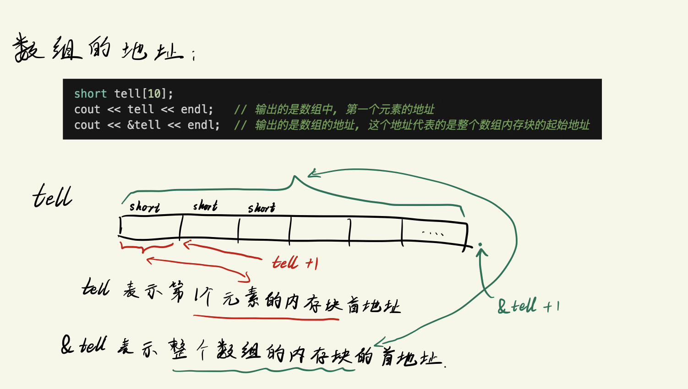
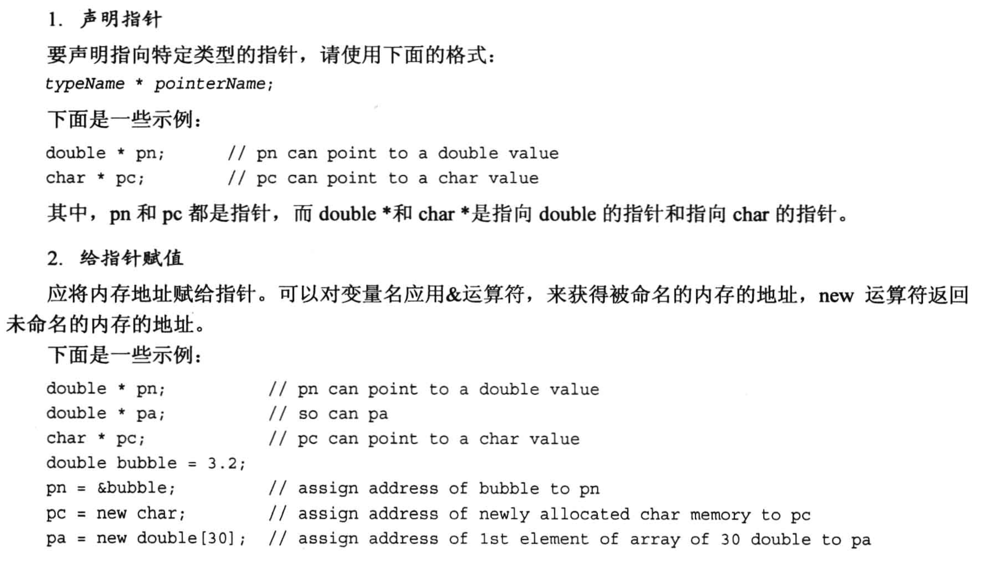
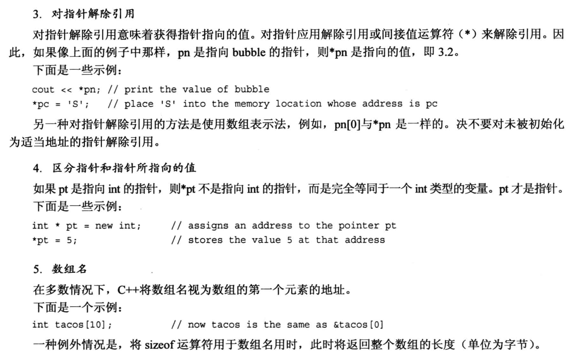
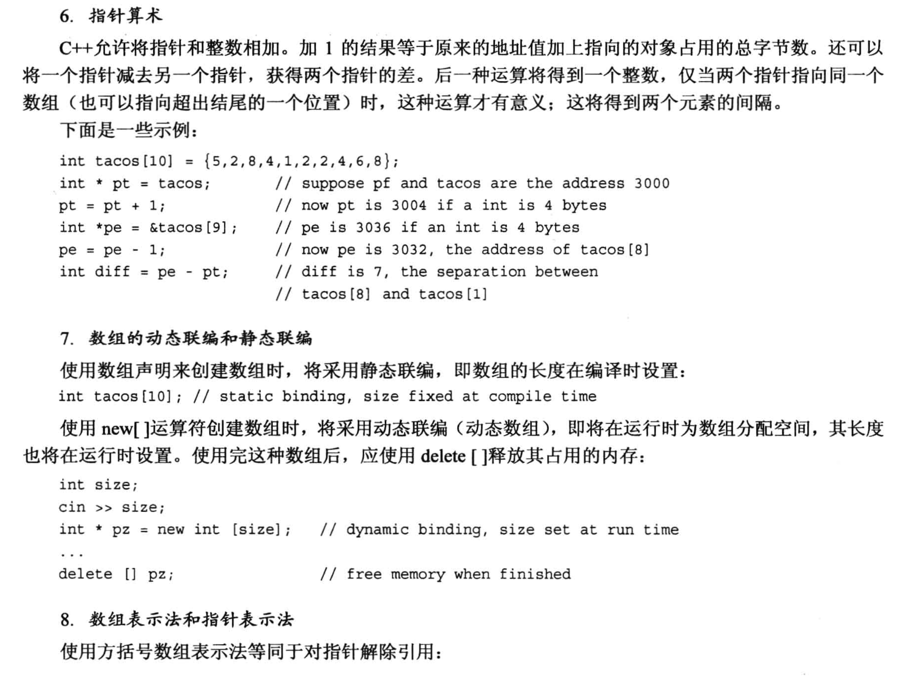
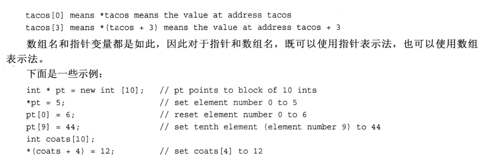

# 4.7 指针 和 自由空间
指针指的是一个`内存地址`.

## 取址运算符 "&"
代码示例:
```cpp
#include <iostream>

int main(void)
{
    using namespace std;

    int donuts = 6;
    double cups = 4.5;

    // 内存地址的最小单位是 1 字节, 地址数值每增加1, 所指向的内存单元就增加1字节 (注意不要理解为指针的算术运算, 指针的算术运算下面再讲)
    cout << "donuts value = " << donuts << " and its address = " << &donuts << endl;    // & 取地址
    cout << "Cups value = " << cups << " and its address = " << &cups << endl;          // & 取地址
    /*
    上面语句的一个输出结果:
        donuts value = 6 and its address = 0x16dbbaec8
        Cups value = 4.5 and its address = 0x16dbbaec0
    两个地址之间相差了8, 说明两个变量之间相差了8个字节, 说明在当前的机器上, int 类型占用了8个字节 (int至少占用4个, 8个也是可以的), double 类型占用了8个字节
    */

    return 0;
}
```
## 取值运算符/间接值(indirect value)运算符/解引用(dereference)运算符 "*"
代码例子:
```cpp
#include <iostream>

int main(void)
{
    using namespace std;

    int updates = 6;
    int *p_updates;         // 创建指针, 只要 * 号前面有类型名，就是声明指针
    p_updates = &updates;   // 为指针赋值，& 取地址符, 此时, =号左右两侧都是地址

    cout << "Values: updates = " << updates << endl;        // 打印值

    cout << "p_updates = " << p_updates << endl;            // 打印地址
    cout << "Addresses: &updates = " << &updates << endl;   // 打印 update 的地址


    cout << "*p_updates = " << *p_updates << endl;          // 打印地址对应的值

    // 修改指针里的内容
    *p_updates = *p_updates + 1;                            // 修改地址对应的值: 先把地址对应的值取出来，加1，再赋值回去
    cout << "Now updates = " << updates << endl;            // 打印修改后的值

    return 0;
}
```


## 4.7.1 声明和初始化指针 
直接看代码例子(以整型指针变量为例):
```cpp
// 1. 声明指针变量的时候, * 和类型之间的空格是可选的, 编译器不做区分
int * pt;  // * 两侧都有空格
int *pt;   // 空格在 int 和 * 之间
int* pt;   // 空格在 * 和 指针变量之间
int*pt;    // * 两侧均无空格

// 2. 同时声明多个指针变量
int *pt1, *pt2;  // pt1 和 pt2 都是指针变量
int *pt1, pt2;   // pt1 是指针变量, pt2 是 int 类型变量

```
注意:
- 不同类型的指针变量是不一样的, int类型的指针变量不能用其他类型的地址去赋值
  - 比如 d 是double类型的变量, 此时`int *p = &d;` 是非法的
- 指针变量占用空间都是相同的, 但是指针的内容是不一定相同的
  - 简单理解: 房子A和房子B的门牌号都是4个数字, 但是房子A面积是200平, 房子B面积是50平, 门牌号指向的地方大小是不相同的.


## 4.7.2 指针的**危险性**
在对指针的内容进行任何修改之前, 都应该检查一下当前指针变量存放的地址是合法的, 可用的!!!!

下面的例子就是一个错误使用指针的例子:
- 这样操作指针的后果是不可预测的, 可能是:
  - 指针变量指向了一个只读的地址, 此时想修改地址的内容就会报错.
  - 指针变量指向了一个随机的地址, 这个地址可能是其他程序的地址, 此时修改这个地址的内容, 就会导致其他程序出错.
  - 指针变量指向了一块不够大的内存块, 修改内存块的内容, 也会报错.
```cpp
int *fellow;    // 声明了整型的指针变量, 但是没有给指针进行初始化 
*fellow = 1;    // 直接怼指针变量的内容进行操作, 此时fellow指向的内存块是无法预知的.
```

## 4.7.3 指针和数字
* 指针不是整型数字, 对它进行加减乘除在很多时候是没有意义的.
* 对指针进行操作时, 尽可能限制在 `取地址对应的内容` 上.

```cpp
int *p;
p = 0x1234567;   // 报错, 类型不匹配, 编译器认为 0x1234567 是一个整型数字, 不能赋值给指针变量

p = (int*) 0x1234567; // 可行, 通过强制类型转换, 类型是匹配的, 但这个人为指定的地址可能没有意义. 
```

## 4.7.4 使用new运算符来分配内存
* 也可以使用`C语言中的 malloc() 函数`来分配内存, 但是C++中的new运算符更加灵活, 更加强大.

new 运算符的功能是:
- 在内存中分配一块指定大小(根据指定的数据类型来指定大小)的内存块, 并返回这块内存块的`首地址`.
- new 运算符是可以针对`任何数据类型`分配内存的, 包括: `int`, `char`, `long`, `结构体`, `类`, `数组`等等.
  - 使用格式: `TypeName * pointer_name = new TypeName`;
  - 如: `int *p = new int;`, `*p`存放了分配的内存块的首地址.

代码例子:
```cpp
#include <iostream>

int main(void)
{
    using namespace std;

    int nights = 1001;
    int *pt = new int;

    *pt = 1001;

    cout << "nights value = " << nights << ": location: " << &nights << endl;
    cout << "int value = " << *pt << ": location: " << pt << endl;

    double *pd = new double;
    *pd = 1000001.0;

    cout << "double value = " << *pd << ": location: " << pd << endl;

    // 查看指针变量的地址
    cout << "location of pointer pd: " << &pd << endl;

    // 查看指针变量占用内存的大小
    cout << "Size of pt = " << sizeof(pt) << endl;    // pt是一个指针变量，所以占用8个字节
    cout << "Size of *pt = " << sizeof(*pt) << endl;  // *pt是一个 int 类型的变量，所以占用4个字节
    cout << "Size of pd = " << sizeof(pd) << endl;    // pd是一个指针变量，所以占用8个字节 (和pt指针相同)
    cout << "Size of *pd = " << sizeof(*pd) << endl;  // *pd是一个 double 类型的变量，所以占用8个字节

    return 0;
}
```

注意:
* new 分配的内存块与常规变量声明分配的内存块`是不同的`, new 分配的内存块是在`堆`上分配的, 常规变量声明分配的内存块是在`栈`上分配的.
  * 在第九章进行详细讨论


## 4.7.5 使用delete运算符来释放内存
可以使用C语言中的 `free` 来释放内存, 也可以使用 C++ 中的 `delete` 来释放内存.

使用方法:
- `delete pointer_name;`
  - 如: `delete pt;`, `delete pd;`, 
- `delete 只是释放了内存`, 但是指针变量 pt 和 pd 仍然存在, 但是指针变量 pt 和 pd 指向的内存块已经被释放了, 我们可以继续将 pt 和 pd 指向新的内存块.
  
使用 delete 需要注意:
- delete 释放的内存不要再次使用, 因为释放掉的内存可能被其他程序使用了, 你再次使用容易出现不可预测的结果.
- delete `不能`用来释放`声明变量所获得的内存`.
- delete 和 new `一定要成对使用`, 避免发生内存泄露的情况.

```cpp
int *ps = new int;  // 使用new分配内存
delete ps;          // 使用delete释放内存
delete ps;          // 不允许, 前面已经释放过这个内存块
int jugs = 5;       // 允许
int *pi = &jugs;    // 允许
delete pi;          // 不允许, pi 不是用 new 来分配的内存
```

注意:
* 通常情况下, 尽可能不要让两个指针指向同一个内存地址, 这样会增加`使用两次 delete 释放同一个内存地址的风险`


## 4.7.6 使用 new 来创建动态数组
- 对于`小型`数据的存放, 我们通常直接使用简单的声明变量的方式就可以了.
- 对于`大型`数据的存放, 如果我们直接声明一个较大的数组, 比如 `int n[1000];`, 如果我们当前存放的数据不足1000个, 系统仍然会开辟能够存放1000个元素的数组空间, 这种在编译时给数组分配内存被称为`静态联编(static binding)`, 这会造成空间的浪费, 因此, 我们需要使用 new 来创建动态数组.
  - 此时, 数组的空间是程序运行的时候才创建的, 而不是编译的时候预先创建, 这种内存分配方式称为`动态联编(dynamic binding)`, 这种数组也叫`动态数组(dynamic array)`. 

写法:
- `TypeName *PointName = new TypeName [ArrSize];`
  - 如: `int *psome = new int [10];`, 用 new 创建了一个大小为 10 个元素的动态数组, 然后返回第一个数组元素的地址, 赋值给 `*psome`.
- `delete [] PointName;`, 不要漏掉 `方括号`
  - 如: `delete [] psome;`

对于动态数组来说, 访问`非第一个元素`的方式是:
- `*ArrName[1]`
  - 直接把`动态数组指针变量`当做`数组名`来用就行, 别忘了前面的`*`号.
    - 这是因为 C 和 C++ 中基本都是用地址去处理数组的.

代码例子:
```cpp
#include <iostream>

int main(void)
{
    using namespace std;

    double *p3 = new double [3];
    p3[0] = 0.2;
    p3[1] = 0.5;
    p3[2] = 0.8;

    cout << "p3[1] is " << p3[1] << endl;  // 动态数组元素的访问

    // 动态数组的指针算术运算
    p3 = p3 + 1;  // 指针向后移动一个元素
    cout << "Now p3[0] is " << p3[0] << " and "
         << "p3[1] is " << p3[1] << endl;   // p3[0] 指向了原来的 p3[1] 的位置，p3[1] 指向了原来的 p3[2] 的位置

    p3 = p3 - 1;  // 指针向前移动一个元素

    delete [] p3; // 释放动态数组的内存
    return 0;
}
```
这个例子中需要注意:
1. 数组名不能像指针变量那样做运算, 因为`数组名是第一个元素的地址`, 地址是常量, 常量不能修改, 因此不能对数组名称做运算.
2. 指针变量是变量, 所以可以做运算.


## 使用 new 和 delete 的规则小结:
1. 不要使用 delete 来释放不是 new 分配的内存
2. 不要使用 delete 释放同一个内存块两次
3. 如果使用 `new []` 为数组分配内存, 则应该使用 `delete []` 来释放
4. 如果使用 new 来为一个实体分配内存, 则应该使用 delete (**没方括号**) 来释放
5. 对空指针应该delete是安全的


# 4.8 指针、数组和指针算术
指针和数组基本等价的原因是: 
- 指针算术 和 C++内部处理数组的方式是一样的, 都是用地址来处理的.
- 指针算术的规则:
  - 指针做 `+1` 操作时, 指针的值会增加 `sizeof(指针类型)` 个字节.
    - 如: `int *pt = new int;`, 如果int类型占用8个字节, 那么 `pt + 1` 的数值是 `pt + 8(十进制)`.
    - 同理, 如果是 `double *pt = new double;`, double占用16个字节的话, 那么 `pt + 1` 的数值是 `pt + 16(十进制)`.

代码例子:
```cpp
# include <iostream>

int main(void)
{
    using namespace std;

    double wages[3] = {10000.0, 20000.0, 30000.0};   // double 类型的数组, 此时 wages 是数组名, 也是第一个数组元素的地址
    short stacks[3] = {3, 2, 1};     // short 类型的数组, 此时 stack 是数组名, 也是第一个数组元素的地址

    // 用两种方法获取数组的地址
    double * pw = wages;        // double 类型的指针, 直接把数组的第一个元素的地址赋给这个指针, **不需要使用 & 来取地址** 
    short * ps = &stacks[0];    // short 类型的指针, 需要使用 & 来取数组第一个元素的地址

    // 利用指针加法访问数组的下一个元素
    cout << "pw = " << pw << ", *pw = " << *pw << endl;   // pw 是指针, *pw 是指针指向的值
    pw = pw + 1;    // 指针加 1, 指向数组的下一个元素, 注意看指针变量的数值增加了多少
    cout << "add 1 to the pw pointer: \n" << "pw = " << pw << ", *pw = " << *pw << endl;

    cout << "ps = " << ps << ", *ps = " << *ps << endl;   // ps 是指针, *ps 是指针指向的值
    ps = ps + 1;    // 指针加 1, 指向数组的下一个元素, 注意看指针变量的数值增加了多少
    cout << "add 1 to the ps pointer: \n" << "ps = " << ps << ", *ps = " << *(ps) << endl;   // ps + 1 是指针, *(ps + 1) 是指针指向的值

    // 两种方式访问数组中的元素
    cout << "access two elements with array notation\n";
    cout << "stacks[0] = " << stacks[0] << ", stacks[1] = " << stacks[1] << endl;       // 用下标访问数组元素
    cout << "access two elements with pointer notation\n";
    cout << "*stacks = " << *stacks << ", *(stacks + 1) = " << *(stacks + 1) << endl;   // 数组名直接当成指针使用!!

    // 使用sizeof运算符来确定数组的长度(数组名不会被解释为第一个元素的地址)
    cout << "Size of wages array = " << sizeof(wages) << endl;   // sizeof(wages) 返回数组的长度, 单位是字节; 这里打印的东西表明, C++中这个数组在使用sizeof的时候没有作为指针变量处理
            // 输出8, double 占用8个字节, 数组一共有3个元素, 所以是24

    cout << "Size of pw pointer = " << sizeof(pw) << endl;       // sizeof(pw) 返回指针变量的长度, 单位是字节
            // 输出8, double * 类型的指针变量占用8个字节
    return 0;
}
``` 

代码例子中需要注意的:
1. arrayName 和 &arrayName[0] 是等价的, 都是数组第一个元素的地址
2. arrayName[i] 等价于 *(arrayName + i), 也就是说, 数组名可以当成指针来使用, 但是`数组名不是指针变量`, 所以`不能对数组名做指针运算`.

## 数组地址需要注意
### 注意点1: 
```cpp
short tell[10];
cout << tell << endl;   // 输出的是数组中, 第一个元素的地址
cout << &tell << endl;  // 输出的是数组的地址, 这个地址代表的是整个数组内存块的起始地址

/*
这里的两个 cout 打印的地址数值是相同的, 但是它们代表的实际含义是不同的:
- 第一个 cout 打印的是数组中第一个元素的地址, 由于是 short 类型, 这个地址表示的内存块是 2个字节
- 第二个 cout 打印的是数组的地址, 这个地址代表的是整个数组内存块的起始地址, 由于是 short 类型, 这个地址表示的内存块是 **20个字节**
*/
```



测试代码例子:
```cpp
#include <iostream>

int main(void)
{
    using namespace std;
    short tell[10];
    cout << tell << endl;   // 输出的是数组中, 第一个元素的地址
    cout << &tell << endl;  // 整个数组的首地址

    cout << " tell+1 : " << tell +1 << endl;   // 增加一个short类型的长度, 也就是2个字节
    cout << " &tell+1 : " << &tell +1 << endl; // 增加一个short类型数组的长度, 也就是20个字节
    return 0;
}
```

### 注意点2 (根据优先级结合性注意区分代码含义)

```cpp
// 一个 包含10个指向short类型的指针 的数组 
// --> 定义10个数组, 每个数组里的元素都是short指针
short *pas[10];     // 等价于 short pas[10];

// 一个 指向包含10个short类型的数组 的指针 
// --> 定义10个指针, 每个指针代表一个数组 
short (*pas)[10];   // 优先(*pas), pas是指针, 它们都指向一个数组, 每个数组有10个元素, 每个元素是short类型的

```


## 4.8.2指针小结




