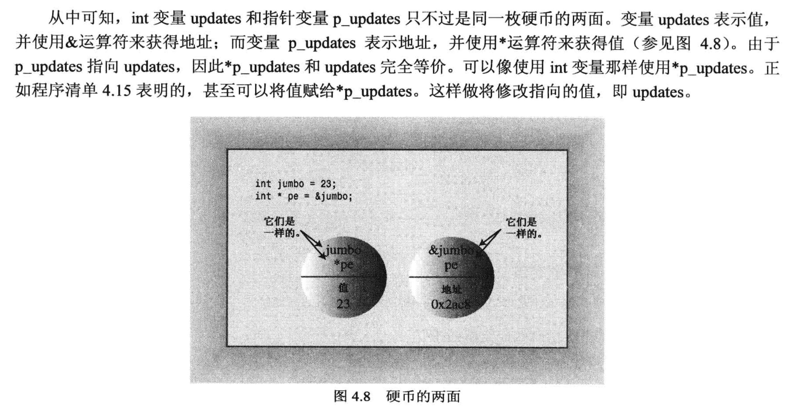

# 4.7 指针 和 自由空间
指针指的是一个`内存地址`.

## 取址运算符 "&"
代码示例:
```cpp
#include <iostream>

int main(void)
{
    using namespace std;

    int donuts = 6;
    double cups = 4.5;

    // 内存地址的单位是 1 字节, 地址每增加1, 指向的内存单元就增加1字节
    cout << "donuts value = " << donuts << " and its address = " << &donuts << endl;    // & 取地址
    cout << "Cups value = " << cups << " and its address = " << &cups << endl;          // & 取地址
    /*
    上面语句的一个输出结果:
        donuts value = 6 and its address = 0x16dbbaec8
        Cups value = 4.5 and its address = 0x16dbbaec0
    两个地址之间相差了8, 说明两个变量之间相差了8个字节, 说明在当前的机器上, int 类型占用了8个字节 (int至少占用4个, 8个也是可以的), double 类型占用了8个字节
    */

    return 0;
}
```
## 取值运算符/间接值(indirect value)运算符/解引用(dereference)运算符 "*"
代码例子:
```cpp
#include <iostream>

int main(void)
{
    using namespace std;

    int updates = 6;
    int *p_updates;         // 创建指针, 只要 * 号前面有类型名，就是声明指针
    p_updates = &updates;   // 为指针赋值，& 取地址符, 此时, =号左右两侧都是地址

    cout << "Values: updates = " << updates << endl;        // 打印值

    cout << "p_updates = " << p_updates << endl;            // 打印地址
    cout << "Addresses: &updates = " << &updates << endl;   // 打印 update 的地址


    cout << "*p_updates = " << *p_updates << endl;          // 打印地址对应的值

    // 修改指针里的内容
    *p_updates = *p_updates + 1;                            // 修改地址对应的值: 先把地址对应的值取出来，加1，再赋值回去
    cout << "Now updates = " << updates << endl;            // 打印修改后的值

    return 0;
}
```



## 4.7.1 声明和初始化指针 
直接看代码例子(以整型指针变量为例):
```cpp
// 1. 声明指针变量的时候, * 和类型之间的空格是可选的, 编译器不做区分
int * pt;  // * 两侧都有空格
int *pt;   // 空格在 int 和 * 之间
int* pt;   // 空格在 * 和 指针变量之间
int*pt;    // * 两侧均无空格

// 2. 同时声明多个指针变量
int *pt1, *pt2;  // pt1 和 pt2 都是指针变量
int *pt1, pt2;   // pt1 是指针变量, pt2 是 int 类型变量

```
注意:
- 不同类型的指针变量是不一样的, int类型的指针变量不能用其他类型的地址去赋值
  - 比如 d 是double类型的变量, 此时`int *p = &d;` 是非法的
- 指针变量占用空间都是相同的, 但是指针的内容是不一定相同的
  - 简单理解: 房子A和房子B的门牌号都是4个数字, 但是房子A面积是200平, 房子B面积是50平, 门牌号指向的地方大小是不相同的.


## 4.7.2 指针的**危险性**
在对指针的内容进行任何修改之前, 都应该检查一下当前指针变量存放的地址是合法的, 可用的!!!!

下面的例子就是一个错误使用指针的例子:
- 这样操作指针的后果是不可预测的, 可能是:
  - 指针变量指向了一个只读的地址, 此时想修改地址的内容就会报错.
  - 指针变量指向了一个随机的地址, 这个地址可能是其他程序的地址, 此时修改这个地址的内容, 就会导致其他程序出错.
  - 指针变量指向了一块不够大的内存块, 修改内存块的内容, 也会报错.
```cpp
int *fellow;    // 声明了整型的指针变量, 但是没有给指针进行初始化 
*fellow = 1;    // 直接怼指针变量的内容进行操作, 此时fellow指向的内存块是无法预知的.
```

## 4.7.3 指针和数字
* 指针不是整型数字, 对它进行加减乘除在很多时候是没有意义的.
* 对指针进行操作时, 尽可能限制在 `取地址对应的内容` 上.

```cpp
int *p;
p = 0x1234567;   // 报错, 类型不匹配, 编译器认为 0x1234567 是一个整型数字, 不能赋值给指针变量

p = (int*) 0x1234567; // 可行, 通过强制类型转换, 类型是匹配的, 但这个人为指定的地址可能没有意义. 
```

