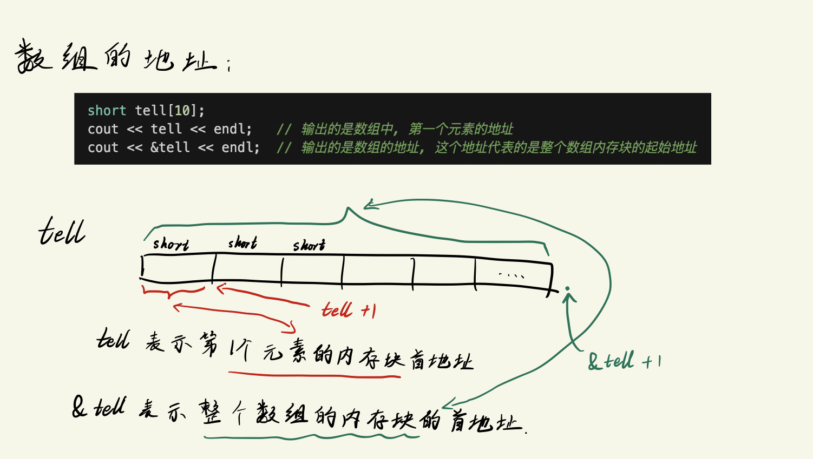
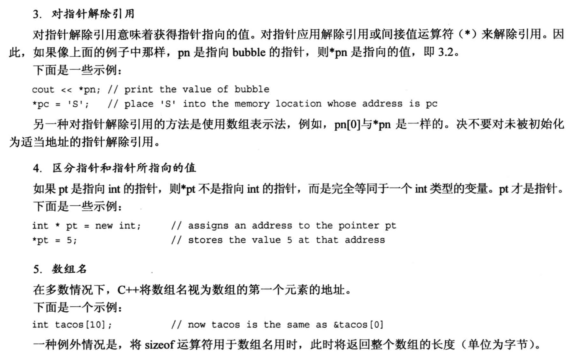
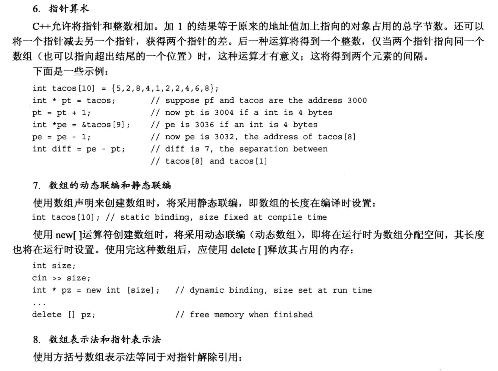
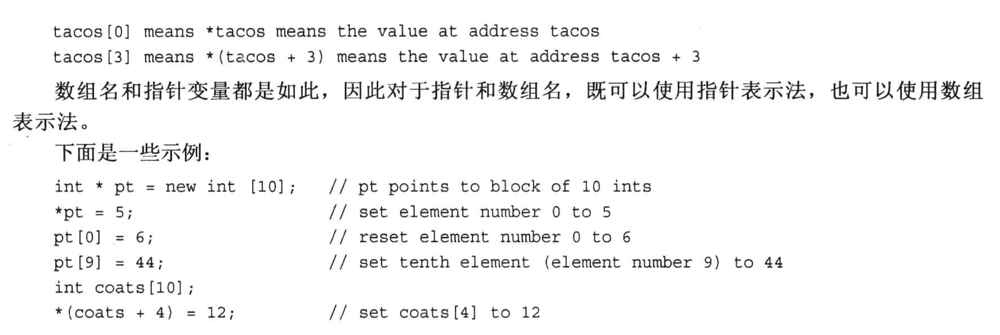

# 4.7 指针 和 自由空间
指针指的是一个`内存地址`.

## 取址运算符 "&"
代码示例:
```cpp
#include <iostream>

int main(void)
{
    using namespace std;

    int donuts = 6;
    double cups = 4.5;

    // 内存地址的最小单位是 1 字节, 地址数值每增加1, 所指向的内存单元就增加1字节 (注意不要理解为指针的算术运算, 指针的算术运算下面再讲)
    cout << "donuts value = " << donuts << " and its address = " << &donuts << endl;    // & 取地址
    cout << "Cups value = " << cups << " and its address = " << &cups << endl;          // & 取地址
    /*
    上面语句的一个输出结果:
        donuts value = 6 and its address = 0x16dbbaec8
        Cups value = 4.5 and its address = 0x16dbbaec0
    两个地址之间相差了8, 说明两个变量之间相差了8个字节, 说明在当前的机器上, int 类型占用了8个字节 (int至少占用4个, 8个也是可以的), double 类型占用了8个字节
    */

    return 0;
}
```
## 取值运算符/间接值(indirect value)运算符/解引用(dereference)运算符 "*"
代码例子:
```cpp
#include <iostream>

int main(void)
{
    using namespace std;

    int updates = 6;
    int *p_updates;         // 创建指针, 只要 * 号前面有类型名，就是声明指针
    p_updates = &updates;   // 为指针赋值，& 取地址符, 此时, =号左右两侧都是地址

    cout << "Values: updates = " << updates << endl;        // 打印值

    cout << "p_updates = " << p_updates << endl;            // 打印地址
    cout << "Addresses: &updates = " << &updates << endl;   // 打印 update 的地址


    cout << "*p_updates = " << *p_updates << endl;          // 打印地址对应的值

    // 修改指针里的内容
    *p_updates = *p_updates + 1;                            // 修改地址对应的值: 先把地址对应的值取出来，加1，再赋值回去
    cout << "Now updates = " << updates << endl;            // 打印修改后的值

    return 0;
}
```


## 4.7.1 声明和初始化指针 
直接看代码例子(以整型指针变量为例):
```cpp
// 1. 声明指针变量的时候, * 和类型之间的空格是可选的, 编译器不做区分
int * pt;  // * 两侧都有空格
int *pt;   // 空格在 int 和 * 之间
int* pt;   // 空格在 * 和 指针变量之间
int*pt;    // * 两侧均无空格

// 2. 同时声明多个指针变量
int *pt1, *pt2;  // pt1 和 pt2 都是指针变量
int *pt1, pt2;   // pt1 是指针变量, pt2 是 int 类型变量

```
注意:
- 不同类型的指针变量是不一样的, int类型的指针变量不能用其他类型的地址去赋值
  - 比如 d 是double类型的变量, 此时`int *p = &d;` 是非法的
- 指针变量占用空间都是相同的, 但是指针的内容是不一定相同的
  - 简单理解: 房子A和房子B的门牌号都是4个数字, 但是房子A面积是200平, 房子B面积是50平, 门牌号指向的地方大小是不相同的.


## 4.7.2 **指针的危险性**
在对指针的内容进行任何修改之前, 都应该检查一下当前指针变量存放的地址是合法的, 可用的!!!!

下面的例子就是一个错误使用指针的例子:
- 这样操作指针的后果是不可预测的, 可能是:
  - 指针变量指向了一个只读的地址, 此时想修改地址的内容就会报错.
  - 指针变量指向了一个随机的地址, 这个地址可能是其他程序的地址, 此时修改这个地址的内容, 就会导致其他程序出错.
  - 指针变量指向了一块不够大的内存块, 修改内存块的内容, 也会报错.
```cpp
int *fellow;    // 声明了整型的指针变量, 但是没有给指针进行初始化 
*fellow = 1;    // 直接怼指针变量的内容进行操作, 此时fellow指向的内存块是无法预知的.
```

## 4.7.3 指针和数字
* 指针不是整型数字, 对它进行加减乘除在很多时候是没有意义的.
* 对指针进行操作时, 尽可能限制在 `取地址对应的内容` 上.

```cpp
int *p;
p = 0x1234567;   // 报错, 类型不匹配, 编译器认为 0x1234567 是一个整型数字, 不能赋值给指针变量

p = (int*) 0x1234567; // 可行, 通过强制类型转换, 类型是匹配的, 但这个人为指定的地址可能没有意义. 
```

## 4.7.4 使用new运算符来分配内存
* 也可以使用`C语言中的 malloc() 函数`来分配内存, 但是C++中的new运算符更加灵活, 更加强大.

new 运算符的功能是:
- 在内存中分配一块指定大小(根据指定的数据类型来指定大小)的内存块, 并返回这块内存块的`首地址`.
- new 运算符是可以针对`任何数据类型`分配内存的, 包括: `int`, `char`, `long`, `结构体`, `类`, `数组`等等.
  - 使用格式: `TypeName * pointer_name = new TypeName`;
  - 如: `int *p = new int;`, `*p`存放了分配的内存块的首地址.

代码例子:
```cpp
#include <iostream>

int main(void)
{
    using namespace std;

    int nights = 1001;
    int *pt = new int;

    *pt = 1001;

    cout << "nights value = " << nights << ": location: " << &nights << endl;
    cout << "int value = " << *pt << ": location: " << pt << endl;

    double *pd = new double;
    *pd = 1000001.0;

    cout << "double value = " << *pd << ": location: " << pd << endl;

    // 查看指针变量的地址
    cout << "location of pointer pd: " << &pd << endl;

    // 查看指针变量占用内存的大小
    cout << "Size of pt = " << sizeof(pt) << endl;    // pt是一个指针变量，所以占用8个字节
    cout << "Size of *pt = " << sizeof(*pt) << endl;  // *pt是一个 int 类型的变量，所以占用4个字节
    cout << "Size of pd = " << sizeof(pd) << endl;    // pd是一个指针变量，所以占用8个字节 (和pt指针相同)
    cout << "Size of *pd = " << sizeof(*pd) << endl;  // *pd是一个 double 类型的变量，所以占用8个字节

    return 0;
}
```

注意:
* new 分配的内存块与常规变量声明分配的内存块`是不同的`, new 分配的内存块是在`堆`上分配的, 常规变量声明分配的内存块是在`栈`上分配的.
  * 在第九章进行详细讨论


## 4.7.5 使用delete运算符来释放内存
可以使用C语言中的 `free` 来释放内存, 也可以使用 C++ 中的 `delete` 来释放内存.

使用方法:
- `delete pointer_name;`
  - 如: `delete pt;`, `delete pd;`, 
- `delete 只是释放了内存`, 但是指针变量 pt 和 pd 仍然存在, 但是指针变量 pt 和 pd 指向的内存块已经被释放了, 我们可以继续将 pt 和 pd 指向新的内存块.
  
使用 delete 需要注意:
- delete 释放的内存不要再次使用, 因为释放掉的内存可能被其他程序使用了, 你再次使用容易出现不可预测的结果.
- delete `不能`用来释放`声明变量所获得的内存`.
- delete 和 new `一定要成对使用`, 避免发生内存泄露的情况.

```cpp
int *ps = new int;  // 使用new分配内存
delete ps;          // 使用delete释放内存
delete ps;          // 不允许, 前面已经释放过这个内存块
int jugs = 5;       // 允许
int *pi = &jugs;    // 允许
delete pi;          // 不允许, pi 不是用 new 来分配的内存
```

注意:
* 通常情况下, 尽可能不要让两个指针指向同一个内存地址, 这样会增加`使用两次 delete 释放同一个内存地址的风险`


## 4.7.6 使用 new 来创建动态数组
- 对于`小型`数据的存放, 我们通常直接使用简单的声明变量的方式就可以了.
- 对于`大型`数据的存放, 如果我们直接声明一个较大的数组, 比如 `int n[1000];`, 如果我们当前存放的数据不足1000个, 系统仍然会开辟能够存放1000个元素的数组空间, 这种在编译时给数组分配内存被称为`静态联编(static binding)`, 这会造成空间的浪费, 因此, 我们需要使用 new 来创建动态数组.
  - 此时, 数组的空间是程序运行的时候才创建的, 而不是编译的时候预先创建, 这种内存分配方式称为`动态联编(dynamic binding)`, 这种数组也叫`动态数组(dynamic array)`. 

写法:
- `TypeName *PointName = new TypeName [ArrSize];`
  - 如: `int *psome = new int [10];`, 用 new 创建了一个大小为 10 个元素的动态数组, 然后返回第一个数组元素的地址, 赋值给 `*psome`.
- `delete [] PointName;`, 不要漏掉 `方括号`
  - 如: `delete [] psome;`

对于动态数组来说, 访问`非第一个元素`的方式是:
- `*ArrName[1]`
  - 直接把`动态数组指针变量`当做`数组名`来用就行, 别忘了前面的`*`号.
    - 这是因为 C 和 C++ 中基本都是用地址去处理数组的.

代码例子:
```cpp
#include <iostream>

int main(void)
{
    using namespace std;

    double *p3 = new double [3];
    p3[0] = 0.2;
    p3[1] = 0.5;
    p3[2] = 0.8;

    cout << "p3[1] is " << p3[1] << endl;  // 动态数组元素的访问

    // 动态数组的指针算术运算
    p3 = p3 + 1;  // 指针向后移动一个元素
    cout << "Now p3[0] is " << p3[0] << " and "
         << "p3[1] is " << p3[1] << endl;   // p3[0] 指向了原来的 p3[1] 的位置，p3[1] 指向了原来的 p3[2] 的位置

    p3 = p3 - 1;  // 指针向前移动一个元素

    delete [] p3; // 释放动态数组的内存
    return 0;
}
```
这个例子中需要注意:
1. 数组名不能像指针变量那样做运算, 因为`数组名是第一个元素的地址`, 地址是常量, 常量不能修改, 因此不能对数组名称做运算.
2. 指针变量是变量, 所以可以做运算.


## 使用 new 和 delete 的规则小结:
1. 不要使用 delete 来释放不是 new 分配的内存
2. 不要使用 delete 释放同一个内存块两次
3. 如果使用 `new []` 为数组分配内存, 则应该使用 `delete []` 来释放
4. 如果使用 new 来为一个实体分配内存, 则应该使用 delete (**没方括号**) 来释放
5. 对空指针应该delete是安全的


# 4.8 指针、数组和指针算术
指针和数组基本等价的原因是: 
- 指针算术 和 C++内部处理数组的方式是一样的, 都是用地址来处理的.
- 指针算术的规则:
  - 指针做 `+1` 操作时, 指针的值会增加 `sizeof(指针类型)` 个字节.
    - 如: `int *pt = new int;`, 如果int类型占用8个字节, 那么 `pt + 1` 的数值是 `pt + 8(十进制)`.
    - 同理, 如果是 `double *pt = new double;`, double占用16个字节的话, 那么 `pt + 1` 的数值是 `pt + 16(十进制)`.

代码例子:
```cpp
# include <iostream>

int main(void)
{
    using namespace std;

    double wages[3] = {10000.0, 20000.0, 30000.0};   // double 类型的数组, 此时 wages 是数组名, 也是第一个数组元素的地址
    short stacks[3] = {3, 2, 1};     // short 类型的数组, 此时 stack 是数组名, 也是第一个数组元素的地址

    // 用两种方法获取数组的地址
    double * pw = wages;        // double 类型的指针, 直接把数组的第一个元素的地址赋给这个指针, **不需要使用 & 来取地址** 
    short * ps = &stacks[0];    // short 类型的指针, 需要使用 & 来取数组第一个元素的地址

    // 利用指针加法访问数组的下一个元素
    cout << "pw = " << pw << ", *pw = " << *pw << endl;   // pw 是指针, *pw 是指针指向的值
    pw = pw + 1;    // 指针加 1, 指向数组的下一个元素, 注意看指针变量的数值增加了多少
    cout << "add 1 to the pw pointer: \n" << "pw = " << pw << ", *pw = " << *pw << endl;

    cout << "ps = " << ps << ", *ps = " << *ps << endl;   // ps 是指针, *ps 是指针指向的值
    ps = ps + 1;    // 指针加 1, 指向数组的下一个元素, 注意看指针变量的数值增加了多少
    cout << "add 1 to the ps pointer: \n" << "ps = " << ps << ", *ps = " << *(ps) << endl;   // ps + 1 是指针, *(ps + 1) 是指针指向的值

    // 两种方式访问数组中的元素
    cout << "access two elements with array notation\n";
    cout << "stacks[0] = " << stacks[0] << ", stacks[1] = " << stacks[1] << endl;       // 用下标访问数组元素
    cout << "access two elements with pointer notation\n";
    cout << "*stacks = " << *stacks << ", *(stacks + 1) = " << *(stacks + 1) << endl;   // 数组名直接当成指针使用!!

    // 使用sizeof运算符来确定数组的长度(数组名不会被解释为第一个元素的地址)
    cout << "Size of wages array = " << sizeof(wages) << endl;   // sizeof(wages) 返回数组的长度, 单位是字节; 这里打印的东西表明, C++中这个数组在使用sizeof的时候没有作为指针变量处理
            // 输出8, double 占用8个字节, 数组一共有3个元素, 所以是24

    cout << "Size of pw pointer = " << sizeof(pw) << endl;       // sizeof(pw) 返回指针变量的长度, 单位是字节
            // 输出8, double * 类型的指针变量占用8个字节
    return 0;
}
``` 

代码例子中需要注意的:
1. arrayName 和 &arrayName[0] 是等价的, 都是数组第一个元素的地址
2. arrayName[i] 等价于 *(arrayName + i), 也就是说, 数组名可以当成指针来使用, 但是`数组名不是指针变量`, 所以`不能对数组名做指针运算`.

## 数组地址需要注意
### 注意点1: 
```cpp
short tell[10];
cout << tell << endl;   // 输出的是数组中, 第一个元素的地址
cout << &tell << endl;  // 输出的是数组的地址, 这个地址代表的是整个数组内存块的起始地址

/*
这里的两个 cout 打印的地址数值是相同的, 但是它们代表的实际含义是不同的:
- 第一个 cout 打印的是数组中第一个元素的地址, 由于是 short 类型, 这个地址表示的内存块是 2个字节
- 第二个 cout 打印的是数组的地址, 这个地址代表的是整个数组内存块的起始地址, 由于是 short 类型, 这个地址表示的内存块是 **20个字节**
*/
```



测试代码例子:
```cpp
#include <iostream>

int main(void)
{
    using namespace std;
    short tell[10];
    cout << tell << endl;   // 输出的是数组中, 第一个元素的地址
    cout << &tell << endl;  // 整个数组的首地址

    cout << " tell+1 : " << tell +1 << endl;   // 增加一个short类型的长度, 也就是2个字节
    cout << " &tell+1 : " << &tell +1 << endl; // 增加一个short类型数组的长度, 也就是20个字节
    return 0;
}
```

### 注意点2 (根据优先级结合性注意区分代码含义)

```cpp
// 一个 包含10个指向short类型的指针 的数组 
// --> 定义10个数组, 每个数组里的元素都是short指针
short *pas[10];     // 等价于 short pas[10];

// 一个 指向包含10个short类型的数组 的指针 
// --> 定义10个指针, 每个指针代表一个数组 
short (*pas)[10];   // 优先(*pas), pas是指针, 它们都指向一个数组, 每个数组有10个元素, 每个元素是short类型的

```


## 4.8.2指针小结






## 4.8.3 指针和字符串(字符型数组)
先上代码, 再分析:
```cpp
char flower[10] = "rose";
cout << flower << "s are red "<< endl;     // 输出字符串
```
这段代码需要关注的点:
1. 上面已经分析过, 数组名可以当做指针来用, 它代表的是数组的第一个元素的地址, 那么, 在使用 cout 的时候, 就会发生如下判断过程:
   - cout 首先判断一下, flower 是不是指针, 如果是指针, 那么
     - 如果不是`char类型指针`就输出指针变量存放的`内存地址的值(如0x12345678)`, 也就是数组第一个元素的地址
     - 如果是`char类型指针`就输出指针指向的`内存地址里的内容`, 也就是数组第一个元素`r`, 然后继续往后输出, 直到遇到`\0`为止.

2. cout 在输出`s are red`的时候, 其实也是把这个字符串当做一个字符数组处理(把这个字符串占用的内存块作为整体对待, 也就是看做一个字符数组啦), cout 会接收这个字符数组的第一个元素的地址(也就是`s`的地址), 然后开始输出, 直到遇到`\0`为止.

代码示例:
```cpp
#include <iostream>
#include <cstring>  // 下面用到了strlen()函数, strcpy(), 所以要包含这个头文件

int main(void)
{
    using namespace std;
    char animal[20] = "bear";
    const char * bird = "wren";   // 加了 const 修饰之后, 不能通过指针修改"指针指向的内存块里面的值" 
                                  // bird 这个指针可以指向任何地址, 但是不能利用 bird 去修改对应内存块里的值

    char * ps;
    cout << animal << " and " << bird << endl;

    // 一种错误的打印指针的方式: 没有初始化, 直接cout打印
    // cout << ps << endl;         // char类型的指针没有进行初始化, 直接用cout打印
    //                             // 打印结果是不确定的, 有些机器可能什么都不打印, 有些机器可以直接会触发错误, 然后把这个进程杀死了

    cout << "Enter a kind of animal: ";
    // cin >> animal;                // 正常捕获输入
    // cout << animal << endl;

    // 下面是错误使用指针, 没有给指针预先指定一个可用的内存块, 然后直接赋值过去, 会发生 segmentation fault
    // cin >> ps;                      // 编译不会报错, 运行会报错.
    // cout << ps << endl;             

    // 下面也是错误的指针用法:
    // 错误1: "wren" 是一个字符串常量, 常量不允许被修改. 
    // 错误2: const 修饰了指针, 不能修改指针指向的内存块里面的值, 哪怕 bird 指向的是一个变量, 这个变量也不允许通过 bird 去修改
    // cin >> bird;                    // 编译就会报错
    
    // 正确用法: 先给 指针 指定一个可操作的地址
    ps = animal;                    // 指针指向了一个可操作的地址
    cin >> ps;
    cout << ps << endl;             // 正常打印, 由于 animal 是一个字符数组, 这个名字可以当做一个指针使用, 所以这里打印的是 animal 的值
    cout << animal << " at " << animal << endl; // 由于 animal 的第一个元素的地址是一个 char 类型地址, 所以输出 animal 的时候会自动输出 animal 的值
    cout << animal << " at " << (int *) animal << endl; // 使用强制类型转换, 把 animal 第一个元素的地址换成 int * 类型, 此时可以打印出 animal 的地址
    cout << ps << " at " << (int *) ps << endl; // 由于 ps 指针 直接指向 animal 的第一个元素, 所以 ps 和 animal 的地址是一样的
    
    // 把 ps 指针改掉
    ps = new char[strlen(animal) + 1]; // 重新分配了一块内存, 用来存放输入的字符串, +1 是为了存放 '\0' 字符
    strcpy(ps, animal);                // 把 animal 的值拷贝到 ps 指向的内存块里面
                                       // 注意, 数组只有在初始化的时候才可以用 = 号把数组的值赋值到另一个数组, 所以这里需要用 strcpy() 函数
                                       //  这里也是有风险的, 因为 如果 ps 指向的内存块可能不够大, 会导致内存块后面的其他位置的值被覆盖掉! 更安全的方式是 nstrcpy(), 注意多一个n
    
    strncpy(ps, animal, 19);           // 更安全的方式, 限制了拷贝的长度, 防止内存块后面的其他位置的值被覆盖掉! 可能会导致不可预计的后果!
    
                    // 提醒: 如果使用string 类的话, 就不用担心数组越界问题了

    cout << "After using strcpy(): " << endl;
    cout << animal << " at " << (int *) animal << endl;
    cout << ps << " at " << (int *) ps << endl;     // 可以看到 ps 的地址和 animal 的地址不一样了
    delete [] ps;       // 记得释放内存

    return 0;
}
```

上面这段代码需要注意:
1. `const`可以用于修饰指针, 被修饰的指针可以指向任意对象, 但是`被修饰的指针所指向的内存块的内容`不可修改.
   - 例如上面代码例子中的 `bird` 指针, 它所指向的`内存块的值`是不可修改的.
2. 指针如果没有经过初始化(赋于一个合法的内存地址), 直接进行`打印, 修改内存块的值`等操作的话在编译的时候是可以通过的, 但是程序在运行时会发生`segmentation fault`错误
3. 使用 new 定义一个`动态的字符数组`可以起到**节省内存**的作用, 如果需要把另一个数组的值赋值过去, 一定要使用`cstring`函数库中的`strcpy() 或 strncpy()`函数
     - 另外, `strcpy()` 是不安全的, 如果拷贝的`源对象`比`目标对象`大的话, 会发生`数组越界问题`, 容易引发严重错误, 使用`strncpy()`对拷贝的长度进行限制会安全一些.
     - 提醒: 使用 `string 类` 就不用担心数组越界问题了.


## 4.8.4 用 new 创建动态结构 
### 指针与动态结构体 (动态结构体的方法也适用于动态类)
为了节省内存, 在创建数组时会比较推荐创建动态数组(使用new来分配数组空间), 同样的, 我们也可以使用`new 创建动态结构体`, 目的也是为了节省内存空间.
- 将 new 用于动态结构体需要注意两个部分:
  - 如何创建结构?
  - 如何访问结构体的成员?

创建动态结构部分
- 假设已经定义好了一个叫 `inflatable` 的结构体, 那么创建动态结构体**匿名对象**的方法是 (**非匿名结构体对象**的话只需要把*ps改成正常的名字即可):
  - `inflatable *ps = new inflatable;`
    - 用 new 申请了一块足以存放 inflatable 结构的内存空间, 并将这块内存的地址返回并赋给 ps 指针变量. 
    - 这种写法与 `int, float` 等常见内置类型是一模一样的.
  
访问动态结构部分 (对指针变量的操作):
  - 如果访问的是**静态的结构体对象**, 我们一般使用成员运算符`.` 来访问它的成员
  - 对于动态结构体对象, 它的成员需要用`箭头成员运算符 ->`才能访问, 可用于`指向结构的指针`
  - 例如上面提到的 inflatable 指针ps: `ps -> price;` 表示用ps指针访问它指向的结构体成员 price. 图示如下:
    

- 值得注意的是, 如果`ps`是一个指向结构体对象的指针, 那么:
  - `*ps` 就是结构体本身, 而不再是一个内存地址, 此时应该用 `.` 来访问结构体成员

代码示例:
```cpp
#include <iostream>

struct inflatable 
{
    char name[20];
    float volume;
    double price;
};


int main(void)
{
    using namespace std;

    inflatable *ps = new inflatable;

    cout << "Please enter Name of inflatable item: ";
    cin.get(ps -> name, 20);   // 调用cin中的get方法捕获输入的值, 存放到结构体的成员 name 中
    cout << "Enter Volume in cubic feet: ";
    cin >> (*ps).volume;       // 取出指针里的结构体, 直接使用成员运算符"."来访问结构体的成员
    cout << "Enter price $: ";
    cin >> ps -> price;       // 用对结构体指针使用箭头运算符访问price成员, 并将捕获的输入赋值给成员 price

    cout << "Name: " << (*ps).name << endl;
    cout << "Volume: " << ps -> volume << endl;
    cout << "Price: $" << (*ps).price << endl;

    // 由于前面用了new, 别忘了释放内存
    delete ps;              // 没有手动释放内存的话, 编译不会报错, 但是会留下安全隐患 

    return 0;
}

```


## 4.8.5 自动存储, 静态存储 和 动态存储
### 自动存储
看来看一个动态数组的代码练习 (关注 new 和 delete 使用的位置):
* 写一个函数, 它可以捕获输入的字符串, 并动态地创建恰好能存储这些字符的**临时**动态数组(最大程度节省内存空间), 然后返回这个临时数组的首地址.
```cpp
#include <iostream>
#include <cstring>

using namespace std;

char *getname(void);        // 定义函数的话, 别忘了声明这个函数


int main(void)
{
    char *name;
    name = getname();
    cout << name << " at " << (int *)name << endl;   // 由于 name 是char类型的指针, 所以直接cout会输出对应内存块的字符串, 打印地址需要强制类型转换

    // getname 里使用了 new, 所以不要忘了 delete
    delete [] name;   // 由于 name 指针变量指向的是 char类型数组, 所以也不要忘了 "[]"

    // delete 只会释放申请的内存, 不会删除这个变量, 所以我们可以接着继续用这个变量名, 但是需要重新赋值一个地址
    name = getname();
    cout << name << " at " << (int *)name << endl;   // 由于 name 是char类型的指针, 所以直接cout会输出对应内存块的字符串, 打印地址需要强制类型转换
    delete [] name;

    return 0;
}

char *getname(void)
{
    char tmp[80];                          // 题目说最长输入80个字符, 所以这里的临时数组最长是80, 每次调用完getname函数, tmp就会被系统自动销毁. 
    
    // 注意, new 创建的动态数组 在调用完getname函数之后不会被销毁, 它被return出去了
    char *pn = new char [strlen(tmp) +1];  // 一定要注意 +1, 预留一个位置给 空字符\0

    cout << "Enter your last name: ";
    cin >> tmp;         // 由于last name 这种字符串是不包含空格的, 所以使用cin就可以了

    // 由于数组之间不能直接赋值, 因此需要使用函数 strcpy 或者 strncpy
    strcpy(pn, tmp);    // 参数 strcpy(目标, 源)

    return pn;
}
```
从代码中可以看到:
  1. new 和 delete 可以位于不同函数中, 虽然不推荐这么做(非常容易忘记 delete), 但是这么做是可以的
  2. 使用 动态数组 可以节省内存空间, 注意代码中的使用场景和方法.

上述代码例子中, tmp 数组是位于`getname()`函数中的, 每次函数调用的时候, 系统就会自动分配一个能存储80个 char元素 的数组空间, 并在函数调用结束时自动释放掉 tmp 占用的内存, 这种方式叫做`自动存储`, 这种函数中常规使用的变量也叫`自动变量(automatic variable)` 或 `局部变量 (local variable)`.
- 自动变量是局部变量的一种.
- 自动变量只在函数的代码块 (函数花括号内部) 起作用
  - 如果 getname() 函数返回的是 *tmp*, 那么 在函数调用结束时, **tmp 的内存块会很快被系统自动释放掉**!!! 这也是我们需要使用 new 来创建用来 return 的数组空间的原因!!
- 自动变量通常被存储在`栈(stack)`中, 栈是一种`后进先出(Last In Fist Out)`的数据结构, 在程序执行时, 栈会随着函数的调用不断的增大和缩小. 
  
### 静态存储 (第9章细讲)
静态存储和自动存储的主要区别是变量的寿命不同, 自动存储在函数调用结束之后就会自动销毁, 到但是静态存储可以在程序的整个生命周期内都存在.

静态存储的方式有两种:
- 使用关键字 `static`来声明的变量
- 在函数外定义的变量, 也叫`全局变量(global variable)`


### 动态存储
动态存储指的是使用 new 和 delete 的方式进行管理的内存池(也叫`堆(heap)`), 它位于程序的另一块内存区域. 

* "动态存储" 与 "静态存储", "自动存储" 之间的最大区别是: 
  * 动态存储可以使数据的生命周期不完全受程序的石村时间控制, 只有使用动态存储声明的变量才可以实现`在函数A中声明, 然后在函数B中释放`的功能.

* 动态存储由程序员来管理, 也就是说, 你可以在程序的任何地方使用 new 和 delete 来管理内存, 但是这种方式需要程序员自己来管理, 一旦忘记 delete, 就会造成内存泄漏.


* 最好养成一种习惯: 
  * `写一个 new 就同时 写一个delete`, 确保它们一定是成对出现的!!!
  * 第十六章有 C++ 智能指针可以帮助我们自动完成这个任务, 这里不展开讲.