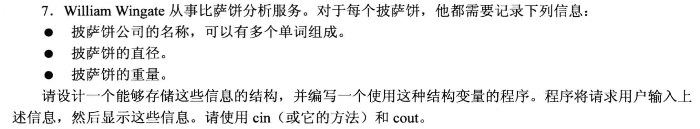

# 4.11 本章小结


# 4.12 复习题


1. 第一题
```cpp
    char actor[30];

    short betsie[100];

    float chuck[13];

    long double dipsea[64];
```


2. 第二题
```cpp
#include <array>

array<char, 30> actor;

array<short, 100> betsie;

array<float, 13> chuck;

array<long double, 64> dipsea;
```


3. 第三题
```cpp
int int_arr[5] = {1, 3, 5, 7, 9};
```

4. 第四题
```cpp
int int_arr[5] = {1, 3, 5, 7, 9};
int even = int_arr[0] + int_arr[4];
```

5. 第五题
```cpp
#include <iostream>
using namespace std;
float ideas[10] = {0};
cout << ideas[1] << endl; 
```

6. 第六题
```cpp
char str_arr[13] = "cheeseburger";   // 注意要多留一个位置给 空字符 \0

// 也可以让编译器自己计算
char str_arr[] = "cheeseburger";
```

7. 第七题
```cpp
#include <string>
string myStr = "WaldorfSalad";
```

8. 第八题
```cpp
#include <string>
struct fish 
{
    string fish_type;    // 或者直接使用字符数组 char kind[30];
    int weight;
    double length;
};
```

9.  第九题
```cpp
struct fish 
{
    char kind[30];
    int weight;
    double length;
};

fish ffffff = {"BigFish", 4, 15.55};
```

10.  第十题
```cpp
enum Response  {No, Yes, Maybe};     // 定义枚举类型, 注意枚举量要对应上

//或者在定义枚举量的时候指定
enum Response {No=0, Yes=1, Maybe=2};
```


11. 第11题
```cpp
#include <iostream>
using namespace std;

double ted = 123.0;
double *pt = &ted;          // "取地址"用&, *只有在前面为类型标识符时才是定义指针, 否则为"取值运算符"
cout << *pt << endl;        // * 此时为 取值运算符
```

12. 第12题
```cpp
float treacle[10] = {0};
float *pt = &treacle[0];        // 或者 float *pt = treacle;
cout << "The Fist element is: " << pt[0] << endl;
cout << "The Last element is: " << pt[9]  endl;
```

13. 第十三题
```cpp
#include <vector>

int size;
cout << "Please Enter an int number: ";

cin >> size;
// 用 new
int *pt = new int[size];
delete [] *pt;

// 用 vector
vector<int> arr(size) ;        // 注意书写格式: vector<TypeName> VariableName(n_element), 用的圆括号!
```

14. 第十四题
```cpp
cout << (int *) "Home of the jolly bytes";
/*
  这句代码有效.
  分析:
    1. 如果没有 (int *), 此时cout会将 "Home of the jolly bytes" 这个字符串的首地址作为参数接收, 然后自动从该地址开始打印这个字符串, 直到遇见 \0 为止
    2. 增加了 (int *) 之后, 字符串 "Home of the jolly bytes" 的首地址被强制转换为 int 类型, cout 会直接把这串地址打印出来.
*/
```


```cpp
// 问题8中的结构体定义为:
struct fish 
{
    char kind[30];
    int weight;
    double length;
};

fish *pt = new fish;
cout << pt -> kind << ", " << pt -> weight << ", " << *pt.length << endl;
```


```txt
cin.getline() 的作用是 "读取一行输入, 当遇到换行符的时候才停止读取", 也就是以 "换行符" 作为本次读取的结束标志, 而不会受到其他空字符的影响 ====> 只有遇到换行符才会停止读取, 遇到空格不会停止读取

cin 默认以任意 "空字符" 作为结束读取的标志, 即: "空格符", "换行符", "制表符tab" 都会被认为是结束本次读取的标志
```


```cpp
#include <vector>
#include <array>
#include <string>

const int size = 10;                  // 用 const 定义要包含的 string 对象数
std::vector<std::string> vec(size);   // 注意 vector 和 string 都需要加上 std::     vector在指定大小的时候要使用圆括号
st::array<std::string, size> arr;     // 注意 array 和 string 都需要加上 std::     array 指定大小写在尖括号里

```


# 4.13 编程练习


```cpp
#include <iostream>
#include <vector>
#include <string>

using namespace std;
const int SIZE = 20;

struct student 
{
    // 使用 char 数组进行存放
    char f_name[SIZE];          
    char l_name[SIZE];      
    char L_grade;  // leter grade

    int age;

};

int main(void)
{
    student s1;
    cout << "What is your first name? ";
    cin.getline(s1.f_name, SIZE);
    cout << "What is your last name? ";
    cin.getline(s1.l_name, SIZE);
    cout << "What letter grade do you deserve? ";
    cin >> s1.L_grade;
    cout << "What is you age? ";
    cin >> s1.age;

    cout << "Name: " << s1.l_name << ", " << s1.f_name << endl;  
    cout << "Grade: " <<  char (s1.L_grade + 1) << endl;
    cout << "Age: " << s1.age << endl; 

    return 0;
}
```


```cpp
#include <iostream>
#include <string>

int main(void)
{
    using namespace std;
    // const int ArSize = 20;

    // char name[ArSize];
    // char dessert[ArSize];

    string name;
    string dessert;

    cout << "Enter you name: \n";
    // cin.getline(name, ArSize);      // 针对字符数组, 使用 cin.getline()
    getline(cin, name);                // 针对string类, 它不需要指定大小, 所以直接用getline()就可以了, 注意, 数据来源写 cin

    cout << "Enter your favorite dessert: \n";
    // cin.getline(dessert, ArSize);   // 针对字符数组, 使用 cin.getline()
    getline(cin, dessert);             // 注意, 数据来源写 cin

    cout << "I have some delicious dessert " << dessert << " for you, " << name << ".\n";

    return 0;
}
```
- 如果使用了string类:
  - 别忘了 `#include <string>`
  - 捕获输入的时候使用 getline(), 捕获来源写 cin, 即: `getline(cin, StrArr);`
    - string 类不需要手动指定字符串大小


```cpp
#include <iostream>
#include <cstring>        // 字符串的操作函数

int main(void)
{
    using namespace std;

    const int SIZE = 20;
    char first_name[SIZE];
    char last_name[SIZE];
    char full_name[SIZE * 2];

    cout << "Enter your first name: ";
    cin.getline(first_name, SIZE);
    cout << "Enter your last name: ";
    cin.getline(last_name, SIZE);

    strcpy(full_name, last_name);   // strcpy(目标参数, 源参数)

    //字符串追加函数 strcat()
    strcat(full_name, ", ");        // 追加一个逗号和空格
    strcat(full_name, first_name);
    cout << "Here's the information in a single string: " << full_name << ".\n";

    return 0;
}
```
- 字符数组常用函数:
  - 拷贝字符数组的元素: `strcpy(目标, 源)`
  - 字符数组追加元素(追加赋值): `strcat(目标, 源)` 


```cpp
#include <iostream>
#include <string>        // string 类

int main(void)
{
    using namespace std;

    // const int SIZE = 20;
    // char first_name[SIZE];
    // char last_name[SIZE];
    // char full_name[SIZE * 2];

    string first_name, last_name, full_name;

    cout << "Enter your first name: ";
    getline(cin, first_name);
    cout << "Enter your last name: ";
    getline(cin, last_name);

    // 字符串拼接
    // strcpy(full_name, last_name);   // strcpy(目标参数, 源参数)
    // //字符串追加函数 strcat()
    // strcat(full_name, ", ");        // 追加一个逗号和空格
    // strcat(full_name, first_name);
    full_name = last_name + ", " + first_name;          // 直接用 + 号 就可以实现字符串拼接

    cout << "Here's the information in a single string: " << full_name << ".\n";

    return 0;
}
```
- string 类的对象操作字符串:
  - 拼接字符串直接用`+`号即可.


```cpp
#include <iostream>
#include <string>

using namespace std;
struct CandyBar
{
    string brand;
    double weight;
    unsigned int cal;   // 因为卡路里一般是正数, 所以这里用了 unsigned
};

int main(void)
{
    
    CandyBar snack = {"Mocha Munch", 2.3, 350};

    cout << "Brand: " << snack.brand << ", Weight: " << snack.weight << ", Calorie: " << snack.cal << endl;

    return 0;
}
```


```cpp
#include <iostream>
#include <string>

using namespace std;
struct CandyBar
{
    string brand;
    double weight;
    unsigned int cal;
};

int main(void)
{
    
    CandyBar snack[3] = {{"test1", 1.11, 111},{"test2", 2.22, 222}, {"test3", 3.33, 333}};

    cout << "Brand: " << snack[0].brand << ", Weight: " << snack[0].weight << ", Calorie: " << snack[0].cal << endl;
    cout << "Brand: " << snack[1].brand << ", Weight: " << snack[1].weight << ", Calorie: " << snack[1].cal << endl;
    cout << "Brand: " << snack[2].brand << ", Weight: " << snack[2].weight << ", Calorie: " << snack[2].cal << endl;

    return 0;
}

```



```cpp

#include <iostream>
#include <string>

using namespace std;

struct pizza
{
    string ent_name;
    double diameter;
    double weight;
};

int main(void)
{
    pizza p1;
    
    cout << "Enter the company name: ";
    getline(cin, p1.ent_name);                  // string 类接收输入使用的是 getline()
    cout << "Enter the diameter of the pizza: ";
    cin >> p1.diameter;
    cout << "Enter the weight of the pizza: ";
    cin >> p1.weight;
    
    cout << "company name: " << p1.ent_name << ", pizza diameter: " << p1.diameter << ", pizza weight: " << p1.weight << endl;

    return 0;
}
```


```cpp
#include <iostream>
#include <string>

using namespace std;

struct pizza
{
    string ent_name;
    double diameter;
    double weight;
};

int main(void)
{
    pizza *pt = new pizza;


    cout << "Enter the weight of the pizza: ";
    cin >> (*pt).weight;
    cin.get();              // 清掉缓冲区里的换行符

    cout << "Enter the company name: ";
    getline(cin, pt->ent_name);
    cout << "Enter the diameter of the pizza: ";
    cin >> (*pt).diameter;

    cout << "company name: " << pt->ent_name << ", pizza diameter: " << pt->diameter << ", pizza weight: " << pt->weight << endl;


    delete pt;
    return 0;
}
```


```cpp
#include <iostream>
#include <string>

using namespace std;
struct CandyBar
{
    string brand;
    double weight;
    int cal;
};

int main(void)
{
    
    // CandyBar snack[3] = {{"test1", 1.11, 111},{"test2", 2.22, 222}, {"test3", 3.33, 333}};
    CandyBar *pt = new CandyBar [3];        // new 了一个动态数组, 然后把地址赋给 pt 指针.
 
    pt[0].brand = "test1";      // 指针和数组名等价,所以这里使用的是 "." 运算符
    pt[1].brand = "test2";
    pt[2].brand = "test3"; // 其他成员没有赋值, 数值成员默认为0, 字符成员默认为空字符 

    // 使用指针的话, 就这么写:
    // pt->brand = "test1";     // 用指针的算术运算来实现不同元素的访问
    // (pt+1)->brand = "test2";
    // (pt+2)->brand = "test3";
    
    cout << "Brand: " << pt[0].brand << ", Weight: " << pt[0].weight << ", Calorie: " << pt[0].cal << endl;
    cout << "Brand: " << pt[1].brand << ", Weight: " << pt[1].weight << ", Calorie: " << pt[1].cal << endl;
    cout << "Brand: " << pt[2].brand << ", Weight: " << pt[2].weight << ", Calorie: " << pt[2].cal << endl;

    delete [] pt;   // 千万别忘记释放内存!!!

    return 0;
}
```


```cpp
#include <iostream>
#include <array>

using namespace std;

int main(void)
{
    const int N = 3;

    array<double,N> grade1;         // 用array 模板创建一个数组

    cout << "please enter your 1st grade of 40 yards: ";
    cin >> grade1[0];

    cout << "please enter your 2nd grade of 40 yards: ";
    cin >> grade1[1];

    cout << "please enter your 3rd grade of 40 yards: ";
    cin >> grade1[2];


    cout << "You had run "<< N << " times. The average grade is: " << (grade1[0] + grade1[1] + grade1[2]) / N << endl;
    return 0;
}

```
