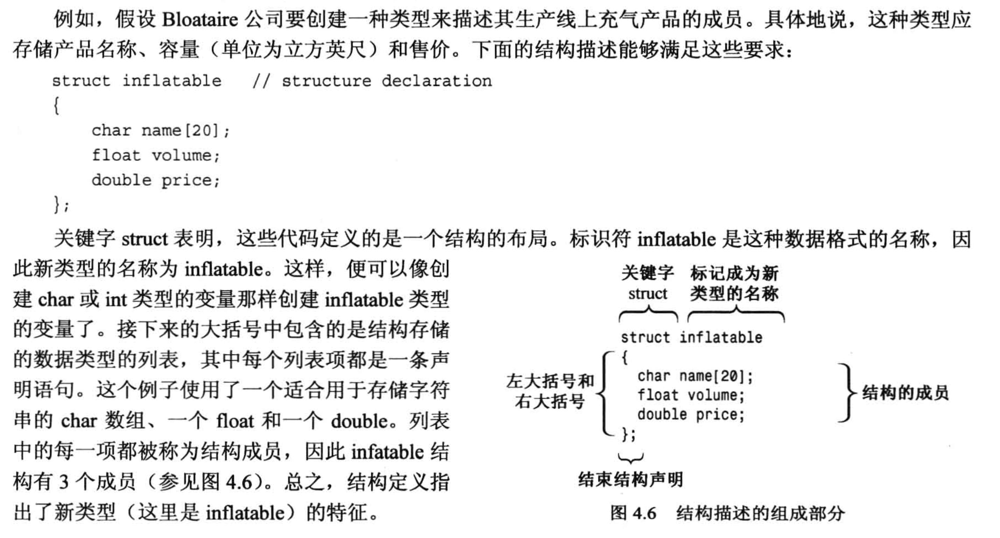
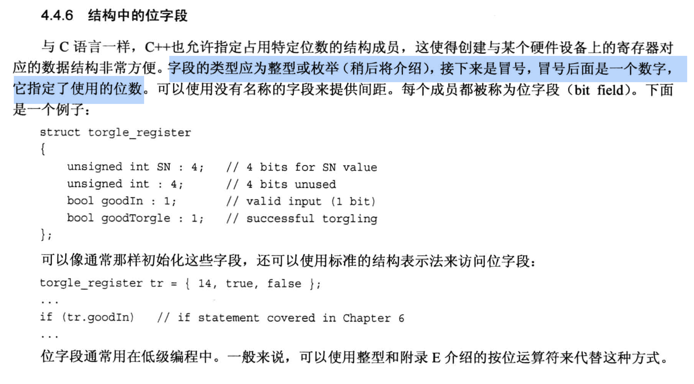

# 4.4 结构体  (python中的 class 对应到C++中的 struct)
## 结构体的使用场景: 
- 需要一种数据结构, 可以同时将多种不同类型的数据组合在一起
  - 数组不能完成这个任务, 虽然数组能存储多个元素, 但是数组中只能存储`同一类型`的数据
- 结构体是一种`用户自定义的数据类型`, 定义好之后, 我们直接把它当做 `int` 那样使用就好了, 很方便.

## 书中结构体的定义例子:
- 结构体花括号`内部`的每一行都是一条`语句`, 语句的结尾记得使用分号`;`.
- 结构体花括号`外面`也不要漏掉分号`;`.


## C语言的结构体与C++结构体在使用时的区别:
- C语言的结构体在使用时, 需要在结构体名字前面加上`struct`关键字, 但是C++中不需要.
  - 如: `struct Student stu; // C语言写法` 与 `Student stu; // C++ 写法` 效果是一样的.

## 访问结构体的成员, 使用成员运算符 `.` (点号)
- 如: `stu.age = 20;`

代码例子1 --> 使用结构体
```C++
#include <iostream>

// 结构体定义, 通常写在 main 函数外面(称为外部声明), 好处是整个文件都能使用这个结构体
struct inflatable
{
    char name[20];  // 这是一个语句, 别忘了分号
    float volume;
    double price;

};                  // 这是一个语句, 别忘了分号

int main(void)
{
    using namespace std;

    //使用定义好的结构体
    struct inflatable guest =                   // 使用C语言的写法, 前面加上 struct
    {
        "Glorious Gloria",  // 给结构体成员赋值的时候, 不再是一条条语句, 所以这里用的是逗号 `,`
        1.88,
        29.99               // 最后已经没有值了, 所以最后的分号可以省略 (把这个想象成花括号赋值的语法)
    };              // 这是一个语句, 别忘了分号

    inflatable pal =                            // 使用 C++ 的写法, 省略struct
    {
        "Audacious Arthur",
        3.12, 
        32.99
    };              // 这是一个语句, 别忘了分号

    cout << "Expand your guest list with " << guest.name << " and " << pal.name << "!\n";
    cout << "You can have both for $" << guest.price + pal.price << "!\n";

    return 0;
}
```

代码例子2  --> 结构体中包含string类的成员(注意 std 命名空间语句)

```C++
#include <iostream>
#include <string>

using namespace std;     // 命名空间如果写在这里, 之后的代码都能使用这个命名空间, 结构体中也就可以省略 std:: 这部分


// 结构体定义, 通常写在 main 函数外面(称为外部声明), 好处是整个文件都能使用这个结构体
struct inflatable
{
    // char name[20];  // 别忘了分号
    // std::string name;   // 使用 string 类型, 需要包含头文件 <string>, 如果std命名空间没有写在结构体定义之前, 就需要加上 std:: 这部分
    string name;
    float volume;
    double price;

};                  // 别忘了分号

int main(void)
{
    // using namespace std;

    //使用定义好的结构体
    struct inflatable guest =                   // 使用C语言的写法, 前面加上 struct
    {
        "Glorious Gloria",  // 给结构体成员赋值的时候, 不再是一条条语句, 所以这里用的是逗号 `,`
        1.88,
        29.99               // 最后已经没有值了, 所以最后的分号可以省略 (把这个想象成花括号赋值的语法)
    };              // 别忘了分号

    inflatable pal =                            // 使用 C++ 的写法, 省略struct
    {
        "Audacious Arthur",
        3.12, 
        32.99
    };              // 别忘了分号

    cout << "Expand your guest list with " << guest.name << " and " << pal.name << "!\n";
    cout << "You can have both for $" << guest.price + pal.price << "!\n";

    return 0;
}
```

代码例子3  --> 结构体对象之间的直接赋值
- 结构体中虽然包含了字符串数组, 但是结构体对象之间支持直接赋值, 赋值之后, `结构体里的字符串数组也会被赋值`.

```C++
#include <iostream>
#include <string>

using namespace std;     

struct inflatable
{
    char name[20];    // 注意这里是字符串数组, 数组不能直接给数组赋值
    float volume;
    double price;

};                  

int main(void)
{
    inflatable bouquet =              
    {
        "sunflowers",  
        0.20,
        12.49             
    };              

    inflatable choice;     // 只进行了声明, 没有进行初始化

    cout << "bouquet: " << bouquet.name << " for $" << bouquet.price << endl;

    // 当结构体一样时, 可以直接将结构体赋值给结构体. (结构体对象之间支持直接赋值)
    choice = bouquet;    // 将 bouquet 的值直接赋值给 choice,  注意, 结构体内包含了字符串数组, 但是此时也可以直接进行赋值
    cout << "choice: " << choice.name << " for $" << choice.price << endl;

    return 0;
}
```


代码例子4 --> 结构体定义与结构体对象的声明可以直接写到一起
```cpp
#include <iostream>
int main(void)
{
  struct perks
  {
    int key_number;
    char car[12];
  } mr_smith, ms_jones;  // 结构体定义与结构体对象的声明可以直接写到一起
  
  return 0;
}
```
甚至可以把结构体的定义, 结构体对象的声明, 结构体对象的初始化都写到一起  (很丑...不推荐)
```cpp
#include <iostream>
int main(void)
{
  struct perks
  {
    int key_number;
    char car[12];
  } mr_glitz = {7, "Packard"};  // 结构体定义, 结构体对象的声明 以及该对象的初始化 可以直接写到一起
}
```

代码例子5 --> 结构体声明时, 可以`省略结构体名`, 直接声明结构体对象
- 此时, 结构体对象可以正常使用, 但是我们`再也无法创建相同的结构体对象`了, 因为没有结构体名
```cpp
#include <iostream>
int main(void)
{
  struct 
  {
    int key_number;
    char car[12];
  } mr_glitz = {7, "Packard"};  // 结构体声明时, 可以省略结构体名, 直接声明结构体对象
}
```

### 4.4.5 结构体数组
- 结构体数组是一个数组, `每个元素都是一个结构体对象`
  - 如: `inflatable guests[2];`  --> `guests 是一个数组`, 包含2个元素, 数组中的每个元素都是一个结构体对象
- 结构体数组的初始化
  - 数组的赋值需要使用一个花括号, 把数组的的元素值给括起来
    - 由于结构体数组的每一个元素都是结构体对象, 所以每个元素的初始化也需要使用一个花括号, 把结构体对象的成员值给括起来
    - 如: `inflatable guests[2] = {{"Bambi", 0.5, 21.99}, {"Godzilla", 2000, 565.99}};`

代码例子1 --> 结构体数组的简单操作
- 如果结构体数组中有元素没有初始化的话, 里面的`数值成员会变成0`, 字符串的话会变成`空字符串`.
```cpp
#include <iostream>

using namespace std;
struct inflatable
{
    char name[20];
    float volume;
    double price;
};

int main(void)
{
    inflatable guest[3] =
    {
        {"Glorious Gloria", 1.88, 29.99},
        {"Godzilla", 2000, 565.99}           // 实验结果表明, 如果结构体数组中有元素没有初始化的话, 里面的数值成员会变成0, 字符串的话, 会变成"空字符串" 
    };
    cout << "The guests " << guest[0].name << " and " << guest[1].name << " have a combined volume of " 
        << guest[0].volume + guest[1].volume << " cubic feet.\n\n";

    // 下面测试一下结构体数组中没有初始化的元素的值
    cout << "The elements of the Third guest are: \n"
        << "Name: " << guest[2].name << "\n"
        << "volume: " << guest[2].volume << "\n"
        << "price: " << guest[2].price << ".\n";

    return 0;
}
```

### 4.4.6 结构体的`位字段` (用在低级编程中)

`位字段`通常在与某些硬件设备上的`寄存器`对应的数据结构上, 用于表示寄存器中的各个位的含义.
- 通常用冒号`:`来表示位字段的长度




