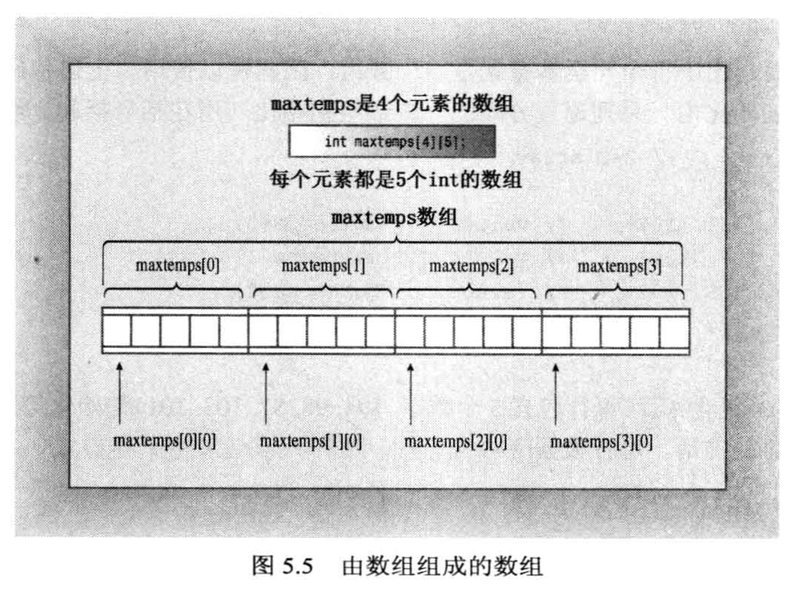
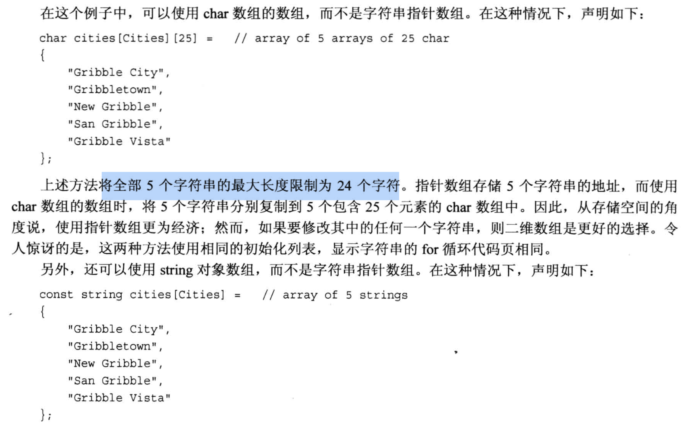

# 5.6 二维数组
二维数组可以看做是一个表格, `第一个下标表示行, 第二个下标表示列`, 例如:
```c
int a[3][4] =            // 这数组有3个元素, 每个元素都是一个一维数组, 它们都有4个元素
{
    {1, 2, 3, 4},       // 第一个元素
    {5, 6, 7, 8},
    {9, 10, 11, 12}
};
```

利用嵌套循环打印数组的元素, 外层循环表示行, 内层循环表示列, 例如:
```cpp
for (int i = 0; i < 3; i++) {
    for (int j = 0; j < 4; j++) {
        cout << a[i][j] << " ";
    }
    cout << endl;
}
```

一个使用了 `字符串数组/字符指针数组` 的例子:
```cpp
#include <iostream>

const int Cities = 5;
const int Years = 4;


int main(void){

    using namespace std;

    // 定义一个"字符串数组" 或 "字符指针数组"
    // 注意, 由于字符串是"常量", 所以这种数组通常是不更改里面的元素的, 前面要加一个 const 修饰
    const char * cities[Cities] = {   // 注意这是一个字符指针数组, 数组的每一个元素都是指针, 数组名的c是小写的
        "Gribble City",
        "Gribbletown",
        "New Gribble",
        "San Gribble",
        "Gribble Vista"
    };

    int maxtemps[Years][Cities] = {
        {96, 100, 87, 101, 105},
        {96, 98, 91, 107, 104},
        {97, 101, 93, 108, 107},
        {98, 103, 95, 109, 108}
    };

    cout << "City: Maximum temperature (F) for 2008 - 2011 \n";

    // 遍历二维数组, 我们希望先显示城市(第一列), 然后再显示不同年份的温度数据
    // 因此, 我们打印的时候是按列来打印(外层循环是列, 内层循环是行)
    for ( int city = 0; city < Cities; city ++){
        cout << cities[city] << ":\t";              // 注意, cities 数组可以看成只有1列, 但是有5行, 用 \t 制表符让输出格式对齐
        
        // 内层循环, 按行打印温度
        for (int year = 0; year < Years; year ++){
            cout << maxtemps[year][city] << "\t";   // 行变化, 列不变(由外层循环控制); 这里用了制表符 \t, 让输出数字对齐 
        }
        cout << endl;
    }
    return 0;
}
```
注意二维数组的存储样式, 因为是数组, 所以它的内存块是连续的!


上面代码例子中的字符串数组也可以用二维数组的样式去理解(内层是一个一维的字符数组), 只不过需要注意每个一维字符数组需要预留一个位置给`空白字符 \0`.


- 使用指针字符数组更好, 因为指针数组更节省空间(内层数组的大小可以根据字符串的长度来确定, 而不是固定的)

如果要使用 string 类, 可以这么写:
```cpp
#include <string>
using namespace std;

// 省略掉 mian 那些不写了..

const string cities[Cities] = {   // 只需要把 char * 改成 string 类型就行了
    "Gribble City",
    "Gribbletown",
    "New Gribble",
    "San Gribble",
    "Gribble Vista"
};
```
- string 类的数组也和字符指针数组一样, 内层数组的大小可以根据字符串的长度来确定, 而不是固定的. 

