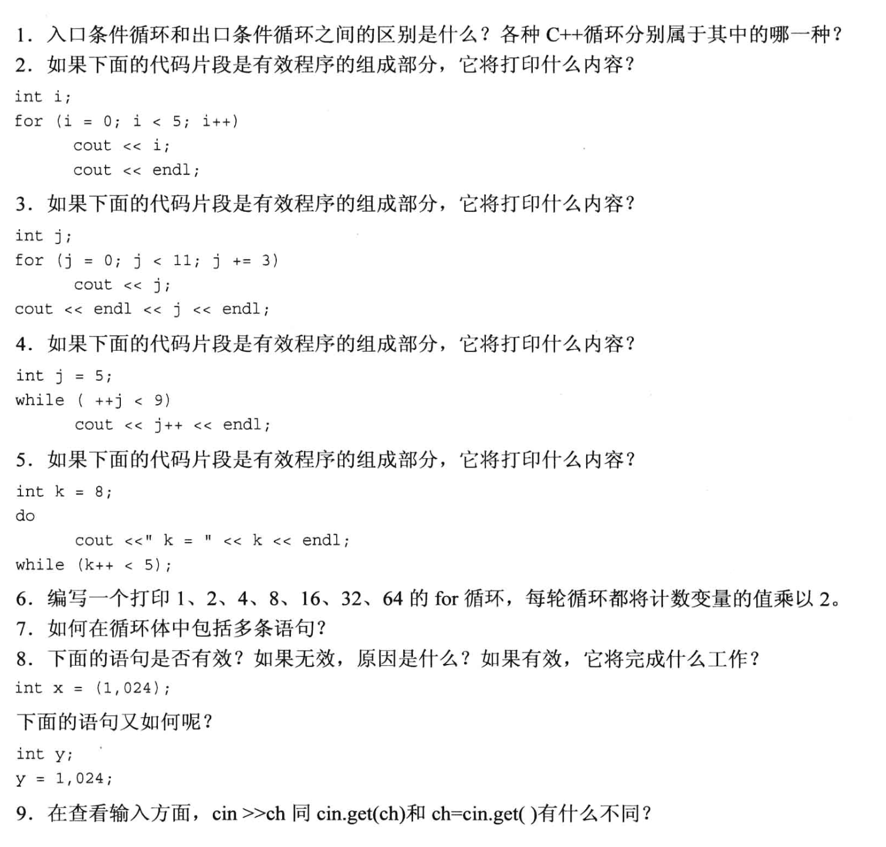
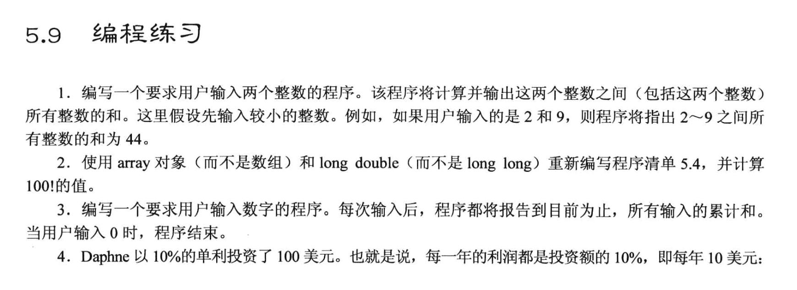
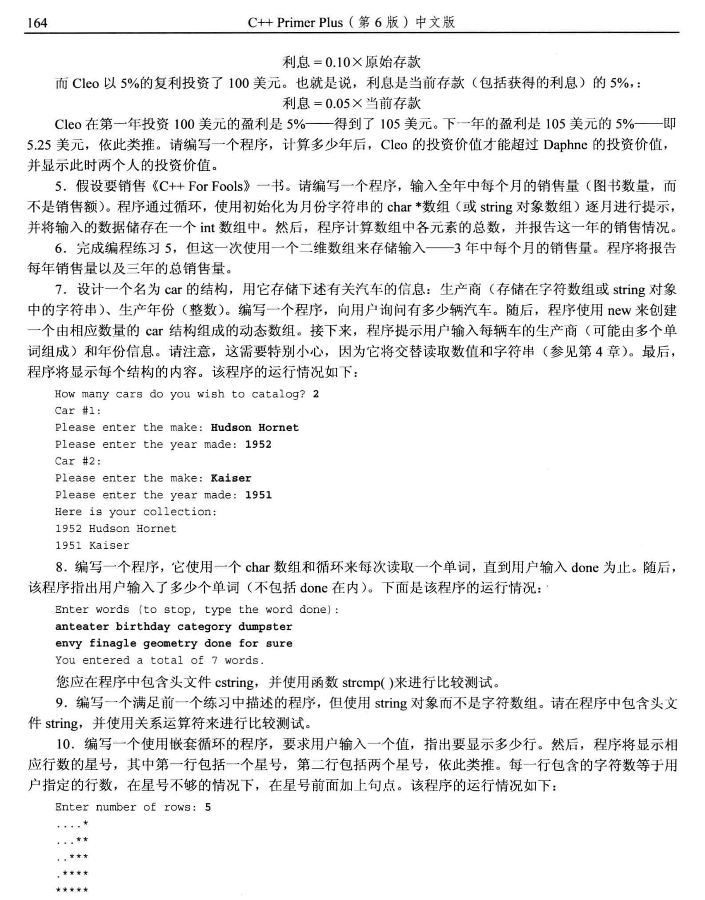

# 复习题
题目:

## 1.
入口循环指的是: 当满足条件的时候才 "进入循环", 即: 先判断, 再循环
出口循环: 先执行一次循环体, 之后马上进入判断阶段, 当满足条件的时候 "才执行第二次循环"
- 入口循环: while, for
- 出口循环: do-while

## 2.
循环体语句只有 `cout i;`, 所以最后打印了 01234, 然后换行.

## 3. 
打印 0369, 换行后再输出12, 最后再换行一次

## 4.
```txt
// ++j 是先将j自增, 然后才进行本行语句中关于j的其他操作
第一轮: 打印6  // 此时由于j++, j变成了7, 然后换行
第二轮: 打印8  // ++j 把j从7变成了8, 判断 j<9 成立, 打印8, 然后 j++ 把j从8变成了9, 然后换行
```

## 5.
```txt
k = 8    // do 
// 由于是 k++, k先和5比较, k<5 此时结果为 false, 不再执行循环体, 但是k最后自增到9, 程序结束
```

## 6. 
```cpp
for (int i = 1; i < 65; i *= 2){
    cout << i << "、"; 
}
```

## 7.
使用 {} 即可在循环中添加多条语句


## 8.
```cpp
int = (1,1024);   // 语句合法. 分析: 用括号括起来的部分先执行, 也就是先执行 "1,024", 这个语句返回 024, 以0开头, 表示8进制数, int默认使用十进制数表示, 所以最后 int 存放的是十进制的20. 


int y;
y = 1,024;      // 语句是合法有效的. 分析: 这个语句与上面语句的区别是没有括号, 此时, y=1优先执行, y被赋值, 然后, 024被执行, 整条语句最后的结果是024, 但是这个语句没有任何意义.
```

## 9.
```cpp
cin >> ch;   // 输入的时候会忽略所有的空白字符(空格, 制表符, enter)

cin.get(char);  
// 和 
ch = cin.get();   
// 上面这辆个语句的效果是相同的, 它们都读取所有字符, 并转换成ASCII码字符存放到ch中, 包括空格, 制表符, enter
```


## 编程题部分



第一题
```cpp
# include <iostream>

int main(void) {
	using std::cout;
	using std::endl;
	using std::cin;

	int min,max,sum=0;
	cout << "enter the min number:";
	cin >> min;
	cout << "enter the max number:";
	cin >> max;
	
	for (int i = min; i <= max; i++) {
		sum += i;
	}
	cout << "sum = " << sum << endl;

	return 0;
}
```


第二题：
```cpp
#include <iostream>
#include <array>

const int ArrSize = 16;

int main(void){
    using namespace std;
    // long long factorials[ArrSize];   // 原来的代码
    array<long long, ArrSize> factorials;

    factorials[0] = factorials[1] = 1LL;  // long long 类型

    for (int i=2; i<ArrSize; i++){
        factorials[i] = i * factorials[i-1];
    }

    for (int i =0; i < ArrSize; i ++)
        std::cout << i << "! = " << factorials[i] << std::endl;
    return 0;
}
```

第三题：
```cpp
#include <iostream>

int main(void){
    using namespace std;

    
    double num = 0, sum = 0;

    do {
        cout << "Please enter a number: ";
        cin >> num;
        sum += num;
        
    }
    while (num != 0);       // while 后面别忘了加分号！！
    
    cout << "The sum of previous num is: " << sum << endl;
    return 0;
}
```

第四题
```cpp
#include <iostream>

const int DEPOSIT_BASE = 100;  // 初始存款是一样的

int main(void){
    
    using namespace std;

    double daphne_deposit = DEPOSIT_BASE;
    double Cleo_deposit = DEPOSIT_BASE;

    int year = 0;

    while (daphne_deposit >= Cleo_deposit){
        daphne_deposit += 10;
        Cleo_deposit += Cleo_deposit * 0.05;
        year++; 
    }

    cout << "After " << year << " years, Cleo's has more money than daphne.\n";

    cout << "Daphne has " << daphne_deposit << " dollars deposit.\n";
    cout << "Cleo has " << Cleo_deposit << " dollars deposit.\n";
    return 0;
}
```

第五题
```cpp
#include <iostream>
#include <string>

int main(void){
    using namespace std;

    // const string months[] = {"1","2","3","4","5","6","7","8","9","10","11","12"}; // 数组别忘了 [s]
    const string Month [] = {"January","February","March","April","May","June","July","August","September","October","November","December"};

    int sale_num[12], sum = 0;

    for (int i = 0; i < 12; i++)
    {
        cout << "Enter the sale number of " << Month[i] << ": ";
        cin >> sale_num[i];
    }

    cout << "Input done.";


    for (int i = 0; i < 12; i++){
        sum += sale_num[i];
    }
    cout << "The total sale number is " << sum << endl;
    return 0;
}
```

第六题
```cpp
#include <iostream>
#include <string>

int main(void){

    using namespace std;

    const string Month [] = {"January","February","March","April","May","June","July","August","September","October","November","December"};
    int sale_num[3][12], sum = 0;

    for (int i = 0; i < 3; i++){

        cout << "Starting " << i+1 << " year's data" << endl;
        for (int j = 0; j < 12; j++){
            cout << "Enter the sale number of " << Month[j] << ": ";
            cin >> sale_num[i][j];
        }
    }
    cout << "Input Done! \n";

    for (int i = 0; i < 3; i ++){
        for (int j = 0; j < 12; j++){
            sum += sale_num[i][j];
        }
    }
    cout << "Total number of sale books for 3 years is " << sum << endl; 

    return 0;
}
```


第七题(考察结构体)
- 由于数字和字符串交替输入, 此时, 数字后的回车会在输入缓冲区中, 我们需要使用 `cin.get()` 清空这个回车, 再读取字符串
- 使用了 new 创建数组, 一定记得释放内存!!!
```cpp
#include <iostream>
#include <string>
using namespace std;

struct car {
    string manufacture;   // 生产生
    int date;             // 生产日期

};          // 别忘记分号!!!


int main(void){

    int car_number;
    cout << "How many cars do you wish to catalog? ";
    (cin >> car_number).get();   // 记得用 get() 吃掉回车

    car * pcar = new car[car_number]; 

    for (int i = 0; i < car_number; i++){
        cout << "Car #" << i+1 << ": \n";
        cout << "Please enter the maker: ";
        getline(cin, (pcar+i)->manufacture);   // 指针名字在一定程度上可以和数组名互换使用
        cout << "Please enter the year made: ";
        (cin >> pcar[i].date).get();            // 记得吃掉数字后的回车
    }

    cout << "Here is your collection: \n";
    for (int i = 0; i < car_number; i++){
        cout << (pcar+i)->date << " " << (pcar+i)->manufacture << endl;
    }

    delete [] pcar;

    return 0;
}
```


第八题
```cpp
#include <iostream>
#include <cstring>

using namespace std;

const char DONE[] = "done";

int main(void){
    char word[20];   // 可接收19个英文字母+1个空白字符
    int count = 0;

    cout << "Enter words (to stop, type done ): \n";

    do {
        cin >> word;
        cin.get();     // 干掉回车
        count++;       // 在这里count++的时候, 第一次输入就是done也会变成1, 所以最后输出的时候要-1

    }while (strcmp(word, DONE)) ;

    cout << "You enter a total of " << count-1 << " words.\n";   // 这里要-1, 因为最后一次输入的是"done", 也被算进去了
    return 0;
}
```


第九题
```cpp
#include <iostream>
#include <string>

using namespace std;

const string DONE = "done";

int main(void){
    string word;   // 可接收19个英文字母+1个空白字符
    int count = 0;

    cout << "Enter words (to stop, type done ): \n";

    do {
        cin >>  word;
        cin.get();     // 干掉回车
        count++;       // 在这里count++的时候, 第一次输入就是done也会变成1, 所以最后输出的时候要-1

    }while (word !=  DONE);

    cout << "You enter a total of " << count-1 << " words.\n";   // 这里要-1, 因为最后一次输入的是"done", 也被算进去了
    return 0;
}
```


第十题
- 思路:
  - 嵌套循环里 有两个 for, 一个打印 . 另一个打印 * 
```cpp
#include <iostream>
using namespace std;

int main(void){
    int row;
    cout << "Please enter the number of rows: ";
    cin >> row;

    // 按行打印
    for (int i = 0; i < row; i++){
        // 打印点
        for(int j = 0; j < row - i -1; j++){
            cout << ". ";
        }
        for (int j = 0; j <= i; j++){
            cout << "* ";
        }
        cout << endl;
    }
    return 0;
}
```


