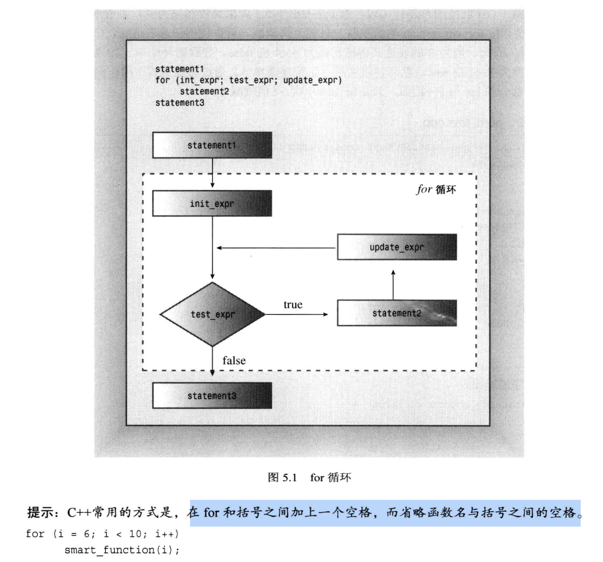
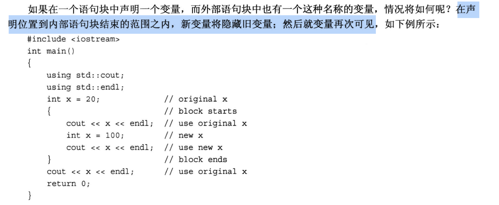
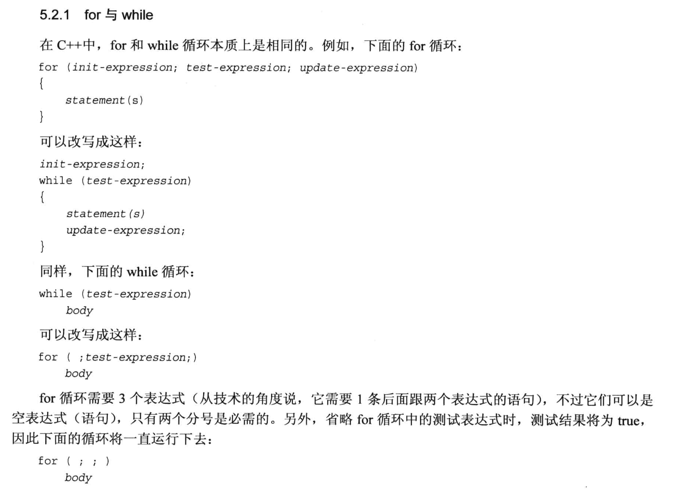
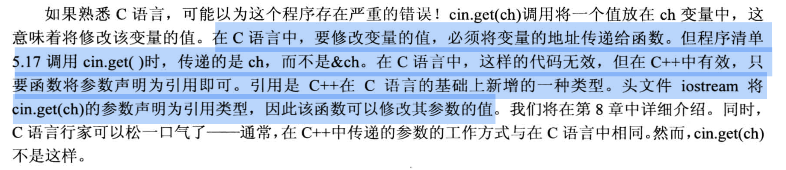
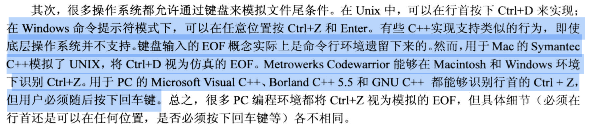

# 第五章 循环和关系表达式
## 5.1.1 for循环的组成:
1. 设置初始值
2. 执行测试,看看循环是否硬蛋继续进行
3. 执行循环操作
4. 更新用于(第2步)测试的值

for循环的书写格式:
```cpp
for (initialization; test-expression; update-expression)
{
    body;
}

/* 执行顺序:
    1. 执行initialization 部分
    2. 执行 test-expression
    3. 执行 body 部分
    4. 执行 update-expression 

    重复 2-4, 直到不满足 test-expression, 自动结束循环
*/
```
- 花括号`{}`内包含的语句称为循环体, 
  - 花括号内的语句不管是否进行了缩进, 它都是循环体中的一部分 (C++不按照缩进来识别, python是按照缩进来识别循环体的)
  - 如果循环体中`只有一条语句`, 则可以省略花括号.
  - for后面的几个表达式都要使用分号`;`来隔开

简单的for循环例子:
```cpp

#include <iostream>

int main(void)
{
    using namespace std;

    int i;
    for( i = 0; i<5; i++)
    {
        cout << "C++ knows loop" << endl;
    }

    cout << "C++ knows when to stop." << endl;
    return 0;
}
```

在C++中, `test-expression 可以是任意表达式`, 但是C++会把表达式的计算结果自动转为 `bool类型`

例如:
```cpp
#include <iostream>

int main(void)
{
    using namespace std;

    cout << "Enter the starting countdown value: ";
    int limit ;
    cin >> limit;

    int i;
    for(i=limit; i; i--)
        cout << "i = " << i << endl;

    cout << "Done, now that i = " << i << endl;  // 最后打印一下 i, i此时肯定是0, 因为0对应的 bool类型是 false

    return 0;
}
```
for循环执行顺序图解:



## 5.1.2 表达式和语句

在C++中, `任何值`或`任何有效的值和运算符的组合`都是表达式.
- 对于`赋值表达式`, 整个表达式的值等于 `赋值运算符右侧的值`
  - 如: `i=10;`, 这个表达式的`值就是20`.

代码例子:
```cpp
#include <iostream>

int main(void)
{
    using namespace std;

    int x;
    cout << "The expression x =100 has the value ";
    
    // cout << x = 100 << endl;  // 报错, 编译的时候, 编译器会因为运算符优先级问题而无法识别 "x左右两侧的运算符" 的含义
    //                             // 由于 "<<" 的优先级比"=" 高, 
    //                             // 因此编译器优先执行 "cout << x", 把x直接输出.
    //                             // 然后编译器开始解读 " = 100 << endl;", 解析不了, 就报错了
    
    cout << (x = 100) << endl;   // value 打印出来是100

    cout << "now x = " << x << endl;

    cout << (x < 3) << endl;   // value 打印出来是0, 表示 false
    
    cout << (x > 3) << endl;   // value 打印出来是1, 表示 true

    cout.setf(ios_base::boolalpha);     // 把 true false原样显示, 而不是打印数字
    cout << (x < 3) << endl;   // value 打印出来是 false
    cout << (x > 3) << endl;   // value 打印出来是 true

    return 0;
}
```


所有的`表达式`只要后面接上分号`;`, 它就是一条`语句`, 但不一定有编程意义, 例如:
- "`i`" 是一个`表达式`
- "`i;`" 是一条`语句`, 但是它没有编程意义  


### for循环的另一种写法 (把变量 i 的声明直接写在 for 循环表达式里)
此时, 变量 i `只在for循环体中有效`, 执行完for循环之后, 后面的语句是没办法访问这个变量i的.
```cpp
#include <iostream>

int main(void)
{
    using namespace std;

    // int i;     // 如果在这里声明 i, 则执行完for语句之后, i 仍然可用
    for( int i = 0; i<5; i++)
    {
        cout << "C++ knows loop" << endl;
    }

    // cout << "i = " << i << endl;   // 编译不通过, 此时的 i 已经不可见了, 执行完for之后i就被回收

    cout << "C++ knows when to stop." << endl;
    
    return 0;
}
```

### for循环使用示例
计算并打印 0~15 的阶乘:
```cpp
#include <iostream>

const int ArrSize = 16;

int main(void){
    long long factorials[ArrSize];

    factorials[0] = factorials[1] = 1LL;  // long long 类型

    for (int i=2; i<ArrSize; i++){
        factorials[i] = i * factorials[i-1];
    }

    for (int i =0; i < ArrSize; i ++)
        std::cout << i << "! = " << factorials[i] << std::endl;
    return 0;
}
```

指定for循环的步长:
```cpp
#include <iostream>

int main(void){
    using std::cout;
    using std::endl;
    using std::cin;

    cout << "Enter an integer: ";
    int by;
    cin >> by;

    cout << "Counting by " << by << "\n";

    for (int i = 0; i < 100; i = i + by){
        cout << i << endl;
    }
}
```

使用for循环访问字符串 (反向输出字符串):
- string 类里面有一个 size() 方法, 可以返回字符串的长度.
```cpp
#include <iostream>
#include <string>

int main(void){
    using namespace std;

    cout << "Enter an word: ";

    string word;
    cin >> word;

    for(int i = word.size() -1; i>=0 ;i--){
        cout << word[i] ;
    }
    cout << endl;

    return 0;
}
```

## For循环语句块中的变量作用域:
- for循环中, 如果没有使用花括号 `{}` 的话, 它只会把 `for循环表达式` 后面的第一条语句当做 `for循环体` 的内容.
- 使用`{}` 之后, 花括号里的所有语句都被视为一个整体, 因此, 在 `for(int i = 0; i <= 5; i++)` 中, i++ 要等到花括号里的所有语句执行完毕之后, 才会执行.
- 循环体`{}`中定义的变量, 只在循环体中有效, *循环体外的语句无法访问这些变量*.
- 如果循环体里声明了一个与循环体外同名的变量, 则`从声明位置到循环体结束`这个范围里, 新声明的变量将隐藏循环体外面定义的变量, 等循环体运行结束之后, 循环体外的变量才会重新起作用.

代码例子:
```cpp

#include <iostream>

int main(void)
{
    using std::cout;
    using std::endl;

    int x = 20;

    for (int i = 0; i < 3; i++)
    {
        cout << "In For-loop(before init x): x = " << x << endl;    // 此时打印的是 for 外面的 x, 20
        
        int x = 100;                                                // 声明了一个 for 外面的同名变量

        cout << "In For-loop: x = " << x << endl;                   // 打印 100
        
        int y = 200;        // 在循环体里定义一个变量, 循环体外侧无法访问
    }
    cout << "After For-loop end, x = " << x << endl;                // 此时打印的是 for 外面的 x, 20

    // cout << "y = " << y << endl;                                    // 此时 y 不存在, 编译就报错了
    return 0;
}
```

不仅是 for 循环的循环体, 只要是花括号的语句块都有这个特性, 例如:



骚操作 -- 在 for 的初始化表达式中使用cin
```cpp
#include <iostream>

int main(void){
    using namespace std;
    int x;
    for (cin >> x; x > 0; cin >> x)   // 不断进行输入和打印, 直到输入的数小于0为止
        cout << "x = " << x << endl;

    return 0;
}
```

在for循环的判断语句中, 错误使用 `==` 和 `=` 造成的错误例子:
```cpp
#include <iostream>

int main(void){
    using namespace std;

    int arr[10] = {20, 20, 20, 20, 20, 19, 20, 18, 20, 20};

    cout << "Doing it right: " << endl;
    int i;
    for (i = 0; arr[i] == 20; i++)
        cout << "arr[" << i << "] = " << arr[i] << endl;
    
    // 死循环
    cout << "Doing it dangerously wrong: " << endl;
    for (i = 0; arr[i] = 20; i++)           // 判断语句写成了赋值语句, 这条赋值表达式的返回值是 =号 的左值, 也就是20, 所以这条语句永远为真, 
                                            // 又由于 C/C++ 不去判断数组越界问题, 所以就死循环了
                                            // 程序运行到最后会停止, 愿意是使用的这块内存空间刚好跑到了不允许访问的区域, 然后就报错, 停止运行
        cout << "arr[" << i << "] = " << arr[i] << endl;
    
    return 0;
}
```

for 循环常用在`确定循环次数`的场景.


## 5.2 while 循环 
while 循环常用于不确定循环次数的场景.
while循环格式:
```txt
while (test-condition)
    body
```
代码例子:
```cpp
#include <iostream>

const int ArrSize = 20;

using namespace std;

int main(void)
{
    char name[ArrSize];

    cout << "Your first name, please: ";
    cin >> name;

    int i = 0;
    cout << "Here is your name, verticalized and ASCIIized: \n";
    while (name[i] != '\0')     // 字符串结束符是 '\0', 这是默认加入的字符
    // while (name[i])            // 上面的 while 还可以写成 while (name[i]), 因为空字符 \0 在判断语句中的返回值是0
    {
        cout << name[i] << ": " << int(name[i]) << endl;    // int(name[i]) 将字符转换为对应的 ASCII 码
        i++;
    }
    return 0;
}
```

注意由`;`号引起的死循环:
```cpp
int i = 0;
while (name[i] != '\0');    // 加了一个分号! while 的循环体语句直接认为是默认值true, 于是死循环, 下面花括号的语句将永远不会被执行
{
    cout << name[i] << endl;
    i++;
}
```


## for 与 while 的对比

- for 循环中的空表达式默认返回值是 `true`, 分号`;`不能省略!
- while 循环的 test-expression 中不能写控制变量i的初始化语句!

## 5.2.2 使用while循环编写延时
下面是一个简单的例子, 但是它的延时效果与CPU的执行速度有关.
```cpp
long wait = 0;
while(wait < 1000000000L)
    wait++;
```

更好的办法是: 使用C/C++中自带的始终 `clock()` 来完成
- clock() 返回的`单位不一定是秒`!! 它返回的是`当前系统执行的时间节拍数`, 只是一个计数而已, 表示的是当前计算机每秒能计多少个数, 所以叫`"时钟节拍"`.
- C语言中需要包含头文件 `<time.h>`, C++ 中需要包含`<ctime>`
  - 这个头文件中有一个常量 `CLOCKS_PER_SEC`, 表示每秒钟有多少个时钟节拍, `用系统时间除以这个常量, 就能得到秒数`.
- 使用`clock()`时, 它的返回类型是`clock_t`(也叫"类型别名", 主要为了方便代码移植), 在不同机器上运行的时候, 编译器会自动把这个类型转换成合适的类型, 例如`long`或`unsigned int`.

代码例子:
```cpp
#include <iostream>
#include <ctime>

int main(void){
    using namespace std;

    cout << "Enter the delay time, in seconds: ";

    float secs;
    cin >> secs;

    clock_t delay = secs * CLOCKS_PER_SEC;  // 记录一秒要计数多少次. 注意这里使用的是 clock_t (本质上还是整型)

    clock_t start = clock();                // 这个语句记录了 "当前时间" 对应的统计次数, start 作为起始时间标记
    
    while (clock() - start < delay);        // 因为是延时循环, 所以这里搞了一个空循环语句, 后面加了分号
    
    cout << "done.\n";

    return 0;
}
```


## 类型别名 (type alias)
上面的例子中, clock_t 就是整型的类型别名, 常见的使用场景是`方便代码移植`, 同时还起到了一定的`注释作用`, 比如这里的 clock_t 就在暗示我们这个变量是一个时间.
- 通用的类型别名定义方式:
  - `typedef type new_name;`
    - 如: `typedef char C;`, 如果在程序中使用了 `C`, 那么编译器会自动把它转换成 `char`
    - 写法和定义变量是很像, 只需要在前面加一个 `typedef` 就可以了

在C语言中, 类型别名是通过下面的方式实现的, 这种方式在 C++ 中也可以使用:
- `#define new_name type`
  - 如: `#define C char`, 把 C 定义为 char 的别名.
  - 这种方式的缺点是:
    - 在定义多个变量的时候很容易出现"逻辑错误", 比如下面的代码:
    ```cpp
    #define FLOAT_POINTER float*

    FLOAT_POINTER pa, pb;  
    /*
    在系统预处理阶段, FLOAT_POINTER 会被替换成 float*, 于是上面的代码就变成了:
        float* pa, pb;
    
    这里本意是希望定义两个指针, 但是 float* 会首先和 pa 结合, 变成 float *pa, 而 pb 则被单独解析为 float pb, 这是在定义一个 float 类型的变量, 不是指针!
    */
    

    // 正确的写法是:
    typedef float* FLOAT_POINTER;
    FLOAT_POINTER pa, pb;           // 这样就能正确定义两个指针了
    ```


## 5.3 do while 循环

do while 循环的格式:
```txt
do                  
    body                    // 上来先执行循环体
while (test-expression);    // 再判断条件, 千万别忘了分号!!!!!
```
- while后面千万别忘记了分号`;`!!!!

使用场景:
- 用户输入验证
  - 比如输入密码

代码例子:
```cpp
#include <iostream>

int main(void)
{
    using namespace std;

    int n;
    // cout << "Enter numbers in range 1-10 to find my favorite number: " << endl;

    // 不用do, cin 写了两次
    // cin >> n;

    // while (n != 7)
    // {
    //     cout << "Enter numbers in range 1-10 to find my favorite number: " << endl;
    //     cin >> n;
    // }


    // 使用 do-while, cin 只写了一次
    do {
        cout << "Enter numbers in range 1-10 to find my favorite number: " << endl;
        cin >> n;
        cout << "You entered " << n << endl;        // 假如输入的是非数字, 那么 n 的值就是 0
    } while (n != 7);       // 别忘了最后的分号!!

    return 0;
}
```
- 这个循环有个致命bug:
    - 输入的数据不是int时, 会陷入死循环, 因为 cin 会把输入的数据转换成 int, `如果输入的不是 int, 那么 cin 会把输入的数据转换成 0`, 于是 n != 7 就永远成立了, 陷入死循环.

## 5.4 (C++11中的新特性) 基于范围的for循环
因为涉及到很多新的知识(需要学完后续章节才能完全解读), 因此这里只是一个大概的介绍, 有个了解而已.

代码例子 -- 打印数组/vector 等容器内的元素:
```cpp
#include <iostream>
using namespace std;
double prices[5] = {4.99, 10.99, 6.87, 7.99, 8.49};
for (double x : prices)
    cout << x << endl;
```


上述例子只能访问/读取数组中的元素, 不能更改, 如果想要更改, 就需要使用`引用运算符 &`(这是被重载过的运算符, 不是指针里面的取地址, 具体在第八章讲解), 代码如下:
```cpp
#include <iostream>

int main(void){
    using namespace stdl;
    double prices[5] = {4.99, 10.99, 6.87, 7.99, 8.49};
    for (double &x : prices){
        x = x * 0.8;        // 修改了数组中的元素
        cout << x << endl;
    } 
}
```

上面两个例子是先定义并初始化了数组, 然后才在for循环中使用, 也可以`直接在for循环中定义并初始化数组`, 代码如下:
```cpp
for (int x : {3,5,2,8,6}){
    cout << x << endl;
}
cout << "\n";
```
这种for循环常用于第十六章的各种模板容器类.

## 5.5 循环文本输入
### 5.5.1 用cin读取键盘的输入
- 读取一行用 `cin.getline()`
  - 对于string类, 我们用的是 `getline(cin, strVal)`
- 一个个字符读取的话, 用 `cin.get()`
  - 这时候, 我们需要知道读到哪个字符就停止, 这种字符称为`哨兵字符 (sentinel character)`, 并将其作为停止标记.
  代码例子 -- 遇到井号`#`停止接收输入:
```cpp
#include <iostream>

int main(void)
{   
    using namespace std;

    char ch;
    int count = 0;

    cout << "Enter characters; enter # to quit:\n";  
    cin >> ch;
    while (ch != '#')
    {
        cout << ch;
        ++count;
        cin >> ch;
    }
    cout << endl;
    cout << count << " characters read\n";

    return 0;
}
```
这个代码例子的输入出:
```txt
Enter characters; enter # to quit:
see ken run#fds      // 这是我输入的内容      
seekenrun
9 characters read
```
代码的分析:
- 可以看到, cin在捕获输入的时候, 遇到空白字符会自动停止, 不会捕获这个空白字符.
  - 统计输入字符的时候, 空白字没有统计进去.
- 由于我们是用了循环, 所以哪怕cin忽略了空格, 还是能继续接收后面的字符.

### 5.5.2 用cin.get(char)把空白字符也读进来

将上面的例子进行修改, 用cin.get(char)来接收输入, 代码如下:
```cpp
#include <iostream>

int main(void)
{   
    using namespace std;

    char ch;
    int count = 0;

    cout << "Enter characters; enter # to quit:\n";  
    // cin >> ch;
    cin.get(ch);   // 为了捕获空字符, 使用cin.get()代替cin >> ch

    while (ch != '#')
    {
        cout << ch;
        ++count;
        // cin >> ch;
        cin.get(ch);   // 为了捕获空字符, 使用cin.get()代替cin >> ch

    }
    cout << endl;
    cout << count << " characters read\n";

    return 0;
}
```
代码输出:
```txt
Enter characters; enter # to quit:
see ken run#fdas        
see ken run             // 空格被捕获
11 characters read
```
这个代码的写法在C语言和C++中的重要区别:
- `C语言中`, 如果给函数`直接传递参数`并进行修改, 此时被修改的其实是参数的`拷贝`, 等函数运行结束之后, 我们会发现这个参数的`值并没有被修改`, 如果需要进行修改, 则需要传递参数的`地址`或者`指针`.
- `在 C++ 中`, 如果给函数传递的参数是`引用`, 那么函数内部对参数的修改, 就是对原来的参数的修改, 而不是参数的拷贝.
  - 上述例子里的 cin.get() 函数中, 传入的参数被声明为引用, 因此这个代码可以有效地执行, 这在C语言中是运行时, ch是捕获不到任何东西的.



小结:
- 到目前为止, cin.get() 函数我们一共是用了两种方式:
  - cin.get() 读取一个字符
    - 在第四章中, 我们用它来处理缓冲区中的换行符.
  - cin.get(ArrName, ArrSize) 读取一行字符并赋值给一个`字符数组`.
- 这两个cin.get()函数表现出C++的`函数重载`特性: 
  - 不同版本的重载函数使用相同的函数名
  - 通过指定不同的参数(参数的个人, 参数的类型, 参数的顺序)来区分不同的函数版本.
  - 在使用函数时, 编译器将根据参数的类型来选择合适的函数版本.


### 5.5.4 文件尾条件
使用检测`文件尾 EOF (End Of File)`技术来表示文件已经结束.
- 在 Windows 中, 默认 `按下 Ctrl+Z 和 enter` 表示模拟`文件尾`
- Mac 的 symantec C++ 模拟了 UNIX, 将`Ctrl+D`作为文件尾.
- 不同的系统处理的方式不太一致:
  

在键盘中模拟 EOF时, cin 的操作是:
- cin将两位(`eofbit`和`failbit`)都设置为1
- 可以通过 `cin.eof()` 和 `cin.fail()` 来查看这两个标志位
  - `cin.eof()` 和 `cin.fail()` 都是观察 `eofbit`和`failbit`, 如果其中一个为1, 就返回true, 否则为false
  - 注意, 这辆个函数都应该在cin.get()**之后**使用.
- 注意, 当`cin.eof()` 和 `cin.fail()` 设置为1之后, 在不进行其他处理的情况下, 我们是不能再次使用 cin 去捕获键盘输入的. `可能的解决办法`是:
  - 用`cin.clear()`将`eofbit`和`failbit`都设置为0.
  - 有些系统中, 使用 ctrl+z 实际上将结束输入和输出, 此时 cin.clear() 是无法恢复输出和输入的.
  
代码例子:
```cpp
#include <iostream>

int main(void)
{   
    using namespace std;

    char ch;
    int count = 0;

    cout << "Enter characters; enter # to quit:\n";  
    // cin >> ch;
    cin.get(ch);   // 为了捕获空字符, 使用cin.get()代替cin >> ch

    // while (ch != '#')
    while (cin.fail() == false)   // 没到文件尾时, cin.fail()返回false
    {
        cout << ch;
        ++count;
        // cin >> ch;
        cin.get(ch);   // 为了捕获空字符, 使用cin.get()代替cin >> ch

    }
    cout << endl;
    cout << count << " characters read\n";

    return 0;
}
```
代码输出:
```txt
Enter characters; enter # to quit:
the green bird sings in the winter.   // 第一次输入  
the green bird sings in the winter.
Yes, the crow files in the dawn.    // 第二次输入
Yes, the crow files in the dawn.
^Z       // 按下了 ctrl+z
[1]  + 21356 suspended  ./a.out      // 在mac环境下 按下了 ctrl+z, 此时程序被挂起, 证明 mac 这些 "类UNIX" 系统中, ctrl 并不是文件尾的标志.


Enter characters; enter # to quit:
the green bird sing in the winter.   // 第一次输入
the green bird sing in the winter.
the green bird sing in the winter.      // 第二次输入
the green bird sing in the winter.
^D          // 按下 ctrl+d, 被识别为 EOF
70 characters read

```

针对上面例子的while循环判断语句, 还可以这么写:
```cpp
while (!cin.fail())

// 或者写成
while (cin)   // 如果成功读取就执行 while 循环, 否则跳出循环

// 最终建议写成:
while (cin.get(ch))   // 如果成功读取就执行 while 循环, 否则跳出循环
```
- `while(cin)`的写法比调用 cin.fail() 和 cin.eof() 更好, 因为它不仅可以检测 EOF, 还能检测到其他失败的原因, 比如`磁盘故障`等.

