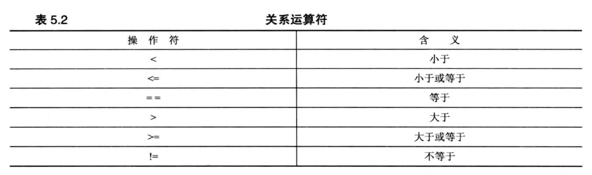
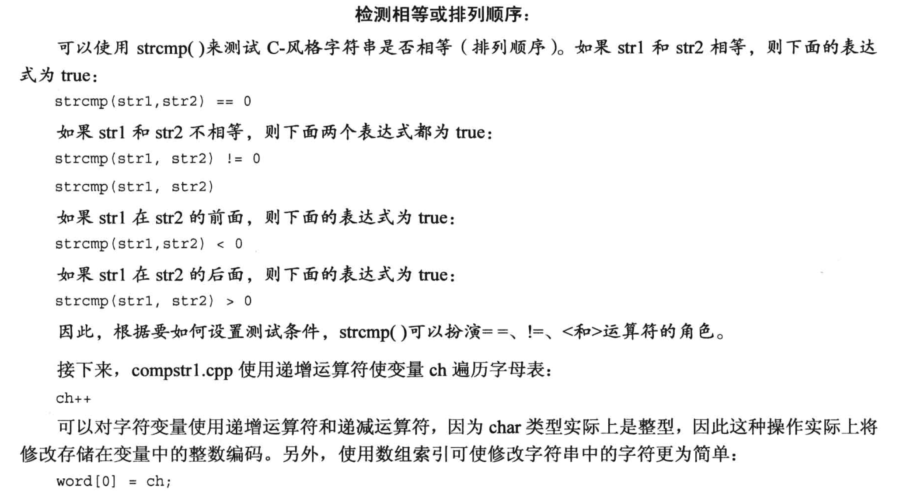

## 逗号运算符 `,`
逗号运算符可以将多个表达式放在`C++中只允许放一个表达式的位置`.
- 使用逗号运算符时, 表达式是`从左到右`执行的, 且整个表达式的值等于`最右侧子表达的值`.
  - 如: `i = 20, j = 2*i;` 
    - 先给i赋值, 再计算j的值.
    - 最终, 整个表达式的值等于j的值 (赋值表达式的值以 **=号** 左侧的值为准).

- 逗号运算符的优先级是最低的
  - 如 `cata = 17,240;` 中, cata 会先被赋值(cata先与等号结合), 然后才执行右侧的子表达式`240`.
  - 再如: `cata = (17,240);`
    - 括号运算符的优先级最高, 所以先执行括号里的表达式 `17,240`, 这个表达式的值是240, 然后赋值到cata中, 所以最后cata的值是240.


并不是所有的逗号都是逗号运算符, 例如:
```cpp
i++, j--;  // 逗号运算符, 逗号前后的表达式都会被执行
int i,j;   // 这里的逗号不是逗号运算符, 而是用来分隔变量声明的
```


代码例子:
```cpp
#include <iostream>
#include <string>

int main(void)
{
    using namespace std;

    cout << "Please enter a word: " ;
    string word;    
    cin >> word;

    int i,j;   // 逗号是分隔符     int i=0, j=100; 这种, 逗号也只是分隔符,不是运算符
    char temp;
    for (j = 0, i = word.size()-1; j<i; j++, i--)   // 逗号是逗号运算符
    {
        temp = word[i];
        word[i] = word[j];
        word[j] = temp;
    }
    cout << word << "\nDone\n";

    return 0;
}
```


## 关系运算符



- 关系运算符的优先级比算术运算符低, 但是比赋值运算符高.
  - `x+3 > y-2;` 等同于 `(x+3) > (y-2);`
- 关系运算符得到的结果: `要么是1 (true), 要么是0 (false)`.  


## "C语言风格"的字符串的比较
- 传统的`C语言字符串不能直接比较(得不到我们预期的结果)`, C++中的 `string 类型可以直接比较`.
    - 例如: 在传统C字符串中, 字符串是字符数组, 假如这个字符串是word, 那么`word == "mate";`永远返回`false`.
      - word 是字符数组, 它代表的是第一个元素的地址, 右侧的字符串常量也是一个它对应的第一个字符的地址, 这两个地址肯定是不相等的, 不管里面存放了什么, 它们的地址都不相等. 

- 比较传统的 C 风格字符串, 我们通常使用 `strcmp()` 函数.
  - `strcmp()` 函数可以接受 `指针, 字符串量 或者 字符数组名` 作为输入.
  - `strcmp()` 函数的返回值是一个`整数`, 如果两个字符串相等, 返回值是0, 如果第一个字符串大于第二个字符串, 返回值是一个正数, 如果第一个字符串小于第二个字符串, 返回值是一个负数.
    - 比较的时候其实是使用 `ASCII码` 值进行比较的, 所以有正有负.
    - 例如: `strcmp(word, "mate") == 0;` 

值得注意的例子:
- C风格的字符串是以 `空字符\0` 标记结束的, 而不是按照字符数组的长度来标记, 因此, 在比较C风格字符串时, 即使字符数组长度不相同, 在 `strcmp()` 中它们仍然可能相等
```cpp
char big[80] = "Daffy";
char little[] = "Daffy";

strcmp(big, little);  // 返回0, 两个字符串相等
```
传统C字符串的比较例子:
```cpp
#include <iostream>
#include <cstring>

int main(void)
{
    using namespace std;

    char word[5] = "?ate";
    for (char ch = 'a'; strcmp(word, "mate"); ch++)
    {
        cout << word << endl;
        word[0] = ch;
    }
    cout << "After loop ends, word is " << word << endl;

    return 0;
}
```

使用 strcmp() 来判断相等或者排列顺序



## string 类的字符串比较
能比较的原因是重载了运算符.
代码例子:
- 这个例子还有一个特点: 我们无法一眼看出循环会执行多少次
```cpp
#include <iostream>
#include <string>

int main(void){
    using namespace std;

    string word = "?ate";

    for(char ch = 'a'; word != "mate"; ch++)   // 直接使用 != 运算符, 无需使用 strcmp 函数
    {
        cout << word << endl;
        word[0] = ch;
    }
    cout << "After loop, word = " << word << endl;
    return 0;
}
```


