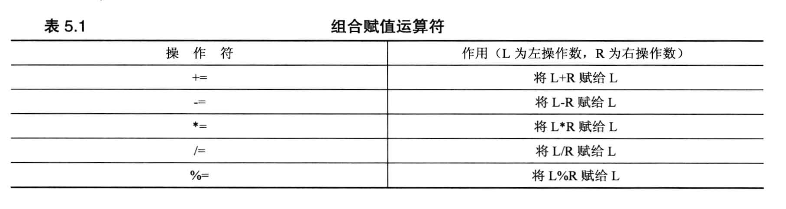

# 5.1.3 递增, 递减运算符 (++ 和 --)
- 在使用这两个运算符的时候, 变量在左侧和在右侧的计算顺序是不一样的:
  - `++i`: 先把i加1, 然后使用增加之后的i
  - `i++`, 先使用i, 然后再把i加1
  - `--` 操作也有相同的规则


代码例子:
```cpp
#include <iostream>
using namespace std;

int main(void){

    int a = 20;
    int b = 20;

    cout << "a = " << a << ", b = "<< b << endl;

     // 变量在右侧时, 先做自增; 变量在左侧时, 先做完别的事情, 再自增
    cout << "a++ = " << a++ << ", ++b = "<< ++b << endl;   // 输出 a++ = 20, ++b = 21
    cout << "a = " << a << ", b = "<< b << endl;            // 输出 a = 21, b = 21

    return 0;
}
```

## 警告⚠️: 不要在同一条语句中对同一个变量进行多次递增/递减
- 在`同一条语句`中, `不要对同一个变量多次进行递增/递减`, 因为在不同的系统中, 最终运行的结果可能是不相同的!!!
  - 如: `x = 2 * x++ * (3 - ++x);`, 在这条语句中, 对x这个变量进行了2次自增操作
    - 这么写编译器不会报错, 但是会存在逻辑问题!!

代码例子解析:
```cpp
    y = (4 + x++) + (6 + x++);
```
- 子表达式`(4 + x++)` 和 `(6 + x++)` 都不是一个完整表达式, 因此 C++ 不保证x的值在计算这个子表达式之后会立马+1, C++只能保证执行完 `;`左侧的整个语句之后会被递增两次.
- C++ **没有规定**是在每一个子表达式之后将x递增, 还是在整个表达式计算结束之后才将x递增, 因此, 我们需要避免这种不确定的情况, 不要这么写.


## 前缀版本(++i/--i) 和 后缀版本(i++/i--)的区别
- 对于 `for 循环`语句 `for(int i =0; i<5; i++)`来说:
  - i++ 和 ++i 没有区别
    - i++ 位于 update-expression 位置, 这条语句在执行完之后语句的返回值并没有被使用, 随后 i 就被增加1了, 同样的, ++i 作为一条完整语句放在这个位置时, 语句执行后的值也没有被使用, 随后 i 被增加1. 所以前缀写法和后缀写法在这里的效果是一样的.
- 前缀和后缀写法通常在程序的行为来说是没有什么影响的, 但是它们在执行速度上会有一些差别:
  - 对于`内置的数据类型(int, float, double等) 和 用户自定义类型` 来说, 前后缀写法执行速度的差异在于:
    - 前缀写法 `++i` 是直接将 i 的值加1, 然后直接返回结果
    - 后缀写法 `i++` 是**先将变量复制一份**, 将复制的值加1, 然后将复制的版本返回
      - 后缀写法因为存在复制的操作, 对于内置的类型来说不太看得出区别, 但是在自定义类型中, 执行效率很容易就能看出差别.
  - 总的来说:  `++i` 效率更高一些. 


# 5.1.4 指针与递增递减运算符
主要需要注意以下4种用法的区别:
1) *++pt 
2) ++*pt
3) (*pt)++
4) *pt++

代码例子:
```cpp
/*
举例说明一下几种情况的区别:
    1) *++pt 
    2) ++*pt
    3) (*pt)++
    4) *pt++
*/

#include <iostream>

using namespace std;


int main(void)
{
    double arr[5] = {21.1, 32.8, 43.5, 54.2, 65.9};
    double *pt = arr;

    // cout << "*pt = " << *pt << endl;       // 打印第一元素

    cout << "*++pt = " << *++pt << endl;   // 打印第二元素
    /*
    分析(运算符优先级):
        1) * 和 ++ 优先级都比 << 高
        2) "* 运算符" 和 "++ 运算符" 的优先级是"相同"的, 
        3) 优先级相同时, 按照 '从右到左'的顺序运行
    
    因此, *++pt 的运算顺序是:
        1) ++pt, pt 指向第二个元素
        2) *pt, 打印第二个元素
        此时, pt 指针已经指向第二个元素了哦!!
    */


    cout << "++*pt = " << ++*pt << endl;  // 打印: 第二个元素+1
    /*
    执行顺序:
        1) *pt, 取出第二个元素
        2) ++*pt, 是前缀写法, 此时先执行执行 ++ 运算, 然后再执行 cout 的流输出, 
    
    因此, 这条语句会打印第二个元素+1, 
        此时, 第二个元素已经变成了 33.8
    */
    
    cout << "(*pt)++ = " << (*pt)++ << endl; // 打印: 第二个元素+1
    /*
    执行顺序:
        1) 括号优先级最高, 先执行*pt, 取出第二个元素
        2) (*pt)++, 是后缀写法, 此时先执行 cout 的流输出, 然后再执行 ++ 运算,
    
    因此, 这条语句会打印第二个元素(显示33.8是因为上面的cout语句已经把第二个元素+1了), 然后再将第二个元素+1, 
        这时候, 第二元素变成了 34.8
    */

    // 注意: 前面的 *++pt 的语句把 pt 指向了第二个元素
    cout << "*pt = " << *pt << endl;     // 打印: 34.8


    cout << "*pt++ = " << *pt++ << endl; // 打印: 34.8
    /*
    执行顺序:
        1) 此时 pt 左右两侧都有运算符, 并且这两种运算符的优先级相同, 因此, 按照 '从右到左'的顺序运行
        2) 先执行 pt++, 但由于是 "后缀写法", 所以 pt 指针的地址会先被取出来(这个地址指向第二个元素), 做完表达式其他的运算之后, pt 指针才会+1
        3) 现在 pt 指针中取出来的地址是 "指向第二个元素的", 这时候, 这个地址与 * 运算符结合, 取出了第二个元素
        4) 打印第二个元素
        5) pt 指针变量进行 +1 运算, 执行之后, pt 指向了第三个元素

    因此, 我们运行这个语句之后的效果是:
        1) 打印数组第二个元素的值
        2) pt 指向 第三个元素
    */

    // 验证一下当前 pt 是不是指向了第三个元素
    cout << "*pt = " << *pt << endl;     // 打印: 43.5
    
    return 0;
}
```


# 5.1.9 组合赋值运算符
一些例子:
- `x += 1` 等价于 `x = x +1;`
- 若 pa 是一个数组, 那么 `*(pa + 4) += 7;` 表示把数组的 pa[4] 的值加7



代码例子:
```cpp
#include <iostream>

int main(void)
{
    using namespace std;

    double num, sum = 0.0;

    cout << "Calculate five numers sum and average." << endl;
    cout << "Please input five numbers: " << endl;

    // 花括号表示循环体, 循环体里的语句是被视为一个整体的语句块(整个循环体被当做一条语句, 所以 ++i 是在循环体执行完才自增)
    for (int i =1; i <=5; ++i){
        cout << "Value " << i << ": ";
        cin >> num;
        sum += num;
    }

    cout << "Sum = " << sum << endl;
    cout << "Average = " << sum / 5.0 << endl;

    return 0;
}
```


