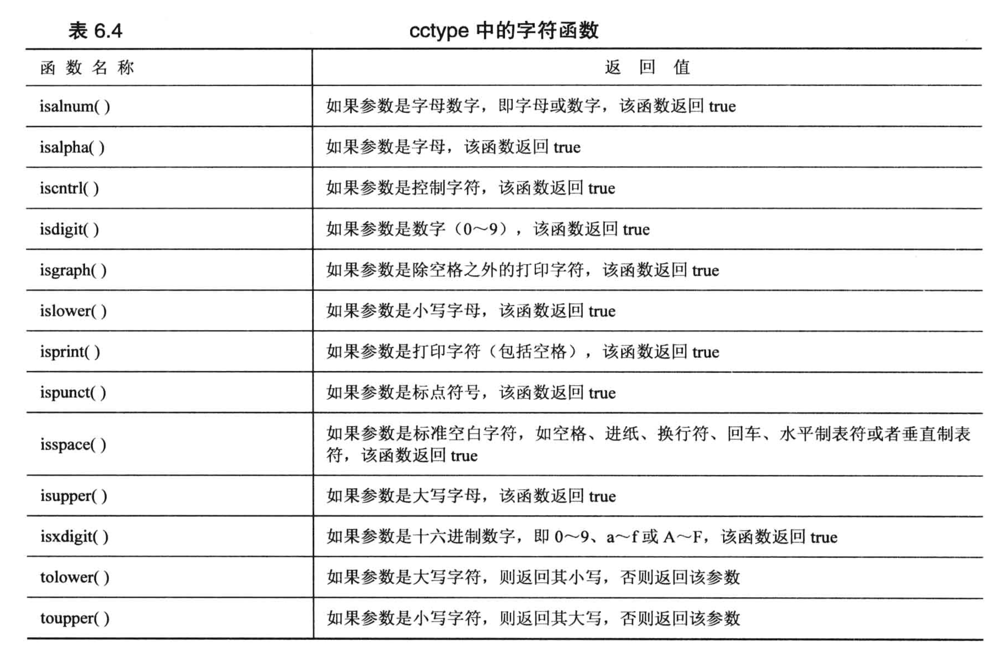

# IF 语句

只有单个 if 分支:
```cpp
#include <iostream>

int main(void)
{
    using namespace std;
    int space = 0;
    int total = 0;
    char ch;

    cin.get(ch);        // 捕获输入
    while (ch != '.')   // 如果输入 . 则停止捕获; 注意是单引号
    {
        if (ch == ' ')
        {
            ++space;    // 这里的 ++space 和 space++ 没有区别 
        }
        ++total;        // 只要加1就行, 无论是 ++total 还是 total++
        cin.get(ch);
    }    

    cout << "Spcace = " << space << endl;
    cout << "Total characters = " <<  total << endl;

    return 0;
}
```

if-else 分支:
```cpp
#include <iostream>
using namespace std;

int main(void)
{
    char ch;
    cin.get(ch);
    while( ch != '.')
    {
        if (ch == '\n')     // 当输入的是回车时, 直接输出回车
            cout << ch;
        else
            cout << ++ch;   // 其他情况下, 输出下一个字符 (++ch是先把字符的ASCII码加1, 然后输出)
            // cout << ch + 1;    // 用这种方法+1的话, 会首先把字符转成ASCII码, 然后+1, 此时char型会变成整型(数据类型提升), 然后输出数字
        cin.get(ch);
    }

    cout << "\nPlease excuse the slight confusion.\n";   // 书本的语句

    return 0;
}
```

如果 if 或 if-else 的语句块有**多条语句**, 则需要使用 `花括号{}` 把语句块括起来, 它不会根据缩进来判断语句块的范围.

if-elif-else 分支:
```cpp
#include <iostream>
using namespace std;
const int Fave = 27;

int main(void)
{
    int n;

    cout << "Enter a number in the range 1-100 to find your favorite number: ";
    
    do 
    {
        cin >> n;
        if ( n < Fave)
            cout << "Too low -- guess again: ";
        else if (n > Fave)
            cout << "Too high -- guess again: ";
        else
            cout << n << " is right!\n";
    } while ( n != Fave);           // 别忘了分号!

    return 0;
}
```

## 一种写判断语句的 Trick
- 如果我们需要判断一个变量是否等于一个常量, 建议把 `常量写在左侧`. 
  - 如 `if (myNumber == 3)`, 为了防止出现 `=` 和 `==` 的混淆, 可以把常量写在前面, 如 `if (3 == myNumber)`, 这样如果写成 `if (3 = myNumber)`, 编译器会报错, 因为常量不能被赋值.


# 逻辑表达式

## 逻辑或 ||
如果两个表达式中有一个为真, 则整个表达式为真, 否则为假.
- 如果或运算 左侧的表达式为真, 那么右侧的表达式将直接跳过, 不会去执行!
  - 如: `5 > 3 || 5 > 10`, 此时 5 > 3 为真, 整个表达式为真, **不会去执行 5 > 10**.

代码示例:
```cpp
#include <iostream>

using namespace std;

int main(void)
{
    cout << "This program may reformat your hard disk, and distory all your data.\n";
    cout << "Do you wish to continue? <y/n>" << endl;

    char ch;
    cin.get(ch);

    if ( 'y' == ch || 'Y' == ch )
        cout << "You were warned!" << endl;
    else if ( 'n' == ch || 'N' == ch )
        cout << "A wise choise ..." << endl;
    else
        cout << "That is wasn't a y or n, so I guess I'll trash your disk anyway.\n";

    return 0;
}
```

## 逻辑与 && 
如果表达式左侧为**假**, 则右侧表达式不会执行. 

代码例子:
```cpp
#include <iostream>
using namespace std;
const int ArrSize = 6;

int main(void)
{
    float value[ArrSize], temp;
    int i = 0;          // 统计输入次数

    cout << "Enter 6 numbers and compare with your level. \n";
    cout << "Terminate condition, when you make 6 number or enter a negative number. \n";

    cout << "Enter the 1st value: ";
    cin >> temp;

    while (0  <= temp && i < ArrSize)
    {
        value[i] = temp;
        ++i;
        if (i < ArrSize)
        {
            cout << "Next value: ";
            cin >> temp;
        }
    }

    if (0 == i)
        cout << "No data -- bye!\n";
    else                                // 数组中存放了有效的数字, 开始统计
    {
        cout << "Enter your level: ";
        float level;
        cin >> level;
        int count = 0;
        for (int j = 0; j < i; ++j)
        {
            if(value[j] > level)
                count +=1;
        }
        cout << count << " of your scores are higher than your level.\n";
    }

    return 0;
}
```

代码例子 -- 用与运算判断成绩:
```cpp
#include <iostream>
using namespace std;
const char * qualify[] = {      // 字符串数组, 用指针作为数组名
    "perfect",
    "great",
    "good",
    "just so so",
    "failed"
};

int main(void)
{
    int score, index;

    cout << "Enter your scores: ";
    cin >> score;

    if (score >= 90 && score <= 100)        // 90 <= score <= 100 这种写法在 cpp 中是不会报错的, 而且这条语句的表达式永远为真!!!
        index = 0;
    else if (score >= 80 && score <= 89)
        index = 1;
    else if (score >= 70 && score <= 79)
        index = 2;
    else if (score >= 60 && score <= 69)
        index = 3;
    else
        index = 4;
    
    cout << "Your level is " << qualify[index] << "\n";
    return 0;
}
```
- **注意**: 
  - c++ 不支持 `90 <= score <= 100` 这种写法, 这条语句在 c++ 中永远为真, 但是在 python 中是支持的.
    - 这条语句会被解释为: `(90 <= score) <= 100`, 无论 `(90 < score) 是否为真, 返回值也就是 0 或 1, 它们都小于100`, 所以最后整个表达式就是永远为真.


## 逻辑非 !

代码例子:
```cpp
// 这个代码是用来测试 非运算符的
#include <iostream>
#include <climits>    // c 中的 limit.h 头文件, 里面有各种数据类型的取值范围

using namespace std;

bool is_int(double x);  // 自定义了一个函数, 记得声明!

int main(void)
{
    double number;    // 由于 cin 会自动把超出 int 范围的数值截断, 所以我们先用double类型存储输入值

    cout << "Enter an integer number: ";
    cin >> number;

    while (! is_int(number))
    {
        cout << "Out of range, please enter again: ";
        cin >> number;
    }
    int value = (int) number;   // 为了保证是 int 输出, 这里进行强制类型转换
    cout << "You've enter the integer: " << value << endl; 

    return 0;
}

bool is_int(double x)
{
    if (x <= INT_MAX && x >= INT_MIN)
        return true;
    else 
        return false;

}
```

注意:
- 逻辑非运算, 它的**优先级高于**所有`关系运算符`和`算术运算符`!
- 强烈建议对子表达使用括号!! 增强可读性, 避免出错!


# 6.3 字符库函数 cctype
在C语言中, 它是 `ctype.h`, 它是用于判断数据类型的. 
- 在python中, 常用的 `isdigit()`, `isalpha()` 等函数, 在c++中就是在cctype 函数库中提供的.


代码例子 -- 判断输入的字符串中, 有多少个空格,数字,字符,标点符号:
```cpp
#include <iostream>
#include <cctype>

using namespace std;

int main(void)
{
    int whitespace = 0;
    int digit = 0;
    int chars = 0;
    int punct = 0;
    int others = 0;

    char ch;
    cout << "Enter text for analysis, and type @ to terminate the input progress. \n";
    cin.get(ch);
    while (ch != '@')
    {
        if (isalpha(ch))
            chars++;
        else if (isspace(ch))
            whitespace++;
        else if (ispunct(ch))
            punct++;
        else if (isdigit(ch))
            digit++;
        else
            others++;
        
        cin.get(ch);
    }

    cout << "You've enter: " << chars << " letters, " << whitespace <<" whitespaces, " 
        << punct << " punctuations, " << digit << " digits, and " << others << " others.\n";
    return 0;
}
```


