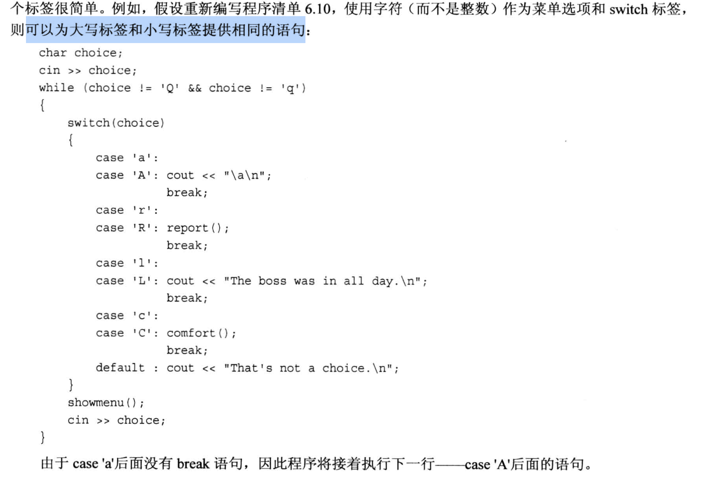
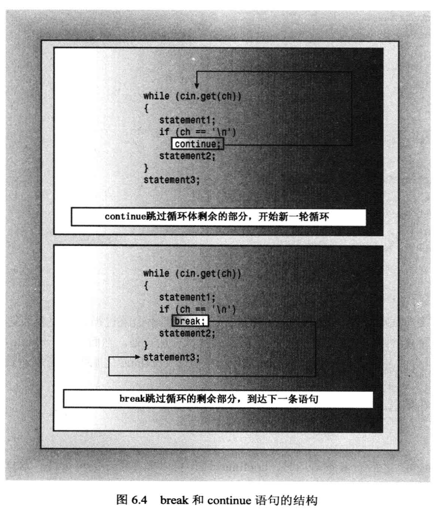

# 6.1 if 语句

只有单个 if 分支:
```cpp
#include <iostream>

int main(void)
{
    using namespace std;
    int space = 0;
    int total = 0;
    char ch;

    cin.get(ch);        // 捕获输入
    while (ch != '.')   // 如果输入 . 则停止捕获; 注意是单引号
    {
        if (ch == ' ')
        {
            ++space;    // 这里的 ++space 和 space++ 没有区别 
        }
        ++total;        // 只要加1就行, 无论是 ++total 还是 total++
        cin.get(ch);
    }    

    cout << "Spcace = " << space << endl;
    cout << "Total characters = " <<  total << endl;

    return 0;
}
```

if-else 分支:
```cpp
#include <iostream>
using namespace std;

int main(void)
{
    char ch;
    cin.get(ch);
    while( ch != '.')
    {
        if (ch == '\n')     // 当输入的是回车时, 直接输出回车
            cout << ch;
        else
            cout << ++ch;   // 其他情况下, 输出下一个字符 (++ch是先把字符的ASCII码加1, 然后输出)
            // cout << ch + 1;    // 用这种方法+1的话, 会首先把字符转成ASCII码, 然后+1, 此时char型会变成整型(数据类型提升), 然后输出数字
        cin.get(ch);
    }

    cout << "\nPlease excuse the slight confusion.\n";   // 书本的语句

    return 0;
}
```

如果 if 或 if-else 的语句块有**多条语句**, 则需要使用 `花括号{}` 把语句块括起来, 它不会根据缩进来判断语句块的范围.

if-elif-else 分支:
```cpp
#include <iostream>
using namespace std;
const int Fave = 27;

int main(void)
{
    int n;

    cout << "Enter a number in the range 1-100 to find your favorite number: ";
    
    do 
    {
        cin >> n;
        if ( n < Fave)
            cout << "Too low -- guess again: ";
        else if (n > Fave)
            cout << "Too high -- guess again: ";
        else
            cout << n << " is right!\n";
    } while ( n != Fave);           // 别忘了分号!

    return 0;
}
```

## 一种写判断语句的 Trick
- 如果我们需要判断一个变量是否等于一个常量, 建议把 `常量写在左侧`. 
  - 如 `if (myNumber == 3)`, 为了防止出现 `=` 和 `==` 的混淆, 可以把常量写在前面, 如 `if (3 == myNumber)`, 这样如果写成 `if (3 = myNumber)`, 编译器会报错, 因为常量不能被赋值.


# 6.2 逻辑表达式

## 逻辑或 ||
如果两个表达式中有一个为真, 则整个表达式为真, 否则为假.
- 如果或运算 左侧的表达式为真, 那么右侧的表达式将直接跳过, 不会去执行!
  - 如: `5 > 3 || 5 > 10`, 此时 5 > 3 为真, 整个表达式为真, **不会去执行 5 > 10**.

代码示例:
```cpp
#include <iostream>

using namespace std;

int main(void)
{
    cout << "This program may reformat your hard disk, and distory all your data.\n";
    cout << "Do you wish to continue? <y/n>" << endl;

    char ch;
    cin.get(ch);

    if ( 'y' == ch || 'Y' == ch )
        cout << "You were warned!" << endl;
    else if ( 'n' == ch || 'N' == ch )
        cout << "A wise choise ..." << endl;
    else
        cout << "That is wasn't a y or n, so I guess I'll trash your disk anyway.\n";

    return 0;
}
```

## 逻辑与 && 
如果表达式左侧为**假**, 则右侧表达式不会执行. 

代码例子:
```cpp
#include <iostream>
using namespace std;
const int ArrSize = 6;

int main(void)
{
    float value[ArrSize], temp;
    int i = 0;          // 统计输入次数

    cout << "Enter 6 numbers and compare with your level. \n";
    cout << "Terminate condition, when you make 6 number or enter a negative number. \n";

    cout << "Enter the 1st value: ";
    cin >> temp;

    while (0  <= temp && i < ArrSize)
    {
        value[i] = temp;
        ++i;
        if (i < ArrSize)
        {
            cout << "Next value: ";
            cin >> temp;
        }
    }

    if (0 == i)
        cout << "No data -- bye!\n";
    else                                // 数组中存放了有效的数字, 开始统计
    {
        cout << "Enter your level: ";
        float level;
        cin >> level;
        int count = 0;
        for (int j = 0; j < i; ++j)
        {
            if(value[j] > level)
                count +=1;
        }
        cout << count << " of your scores are higher than your level.\n";
    }

    return 0;
}
```

代码例子 -- 用与运算判断成绩:
```cpp
#include <iostream>
using namespace std;
const char * qualify[] = {      // 字符串数组, 用指针作为数组名
    "perfect",
    "great",
    "good",
    "just so so",
    "failed"
};

int main(void)
{
    int score, index;

    cout << "Enter your scores: ";
    cin >> score;

    if (score >= 90 && score <= 100)        // 90 <= score <= 100 这种写法在 cpp 中是不会报错的, 而且这条语句的表达式永远为真!!!
        index = 0;
    else if (score >= 80 && score <= 89)
        index = 1;
    else if (score >= 70 && score <= 79)
        index = 2;
    else if (score >= 60 && score <= 69)
        index = 3;
    else
        index = 4;
    
    cout << "Your level is " << qualify[index] << "\n";
    return 0;
}
```
- **注意**: 
  - c++ 不支持 `90 <= score <= 100` 这种写法, 这条语句在 c++ 中永远为真, 但是在 python 中是支持的.
    - 这条语句会被解释为: `(90 <= score) <= 100`, 无论 `(90 < score) 是否为真, 返回值也就是 0 或 1, 它们都小于100`, 所以最后整个表达式就是永远为真.


## 逻辑非 !

代码例子:
```cpp
// 这个代码是用来测试 非运算符的
#include <iostream>
#include <climits>    // c 中的 limit.h 头文件, 里面有各种数据类型的取值范围

using namespace std;

bool is_int(double x);  // 自定义了一个函数, 记得声明!

int main(void)
{
    double number;    // 由于 cin 会自动把超出 int 范围的数值截断, 所以我们先用double类型存储输入值

    cout << "Enter an integer number: ";
    cin >> number;

    while (! is_int(number))
    {
        cout << "Out of range, please enter again: ";
        cin >> number;
    }
    int value = (int) number;   // 为了保证是 int 输出, 这里进行强制类型转换
    cout << "You've enter the integer: " << value << endl; 

    return 0;
}

bool is_int(double x)
{
    if (x <= INT_MAX && x >= INT_MIN)
        return true;
    else 
        return false;

}
```

注意:
- 逻辑非运算, 它的**优先级高于**所有`关系运算符`和`算术运算符`!
- 强烈建议对子表达使用括号!! 增强可读性, 避免出错!


# 6.3 字符库函数 cctype
在C语言中, 它是 `ctype.h`, 它是用于判断数据类型的. 
- 在python中, 常用的 `isdigit()`, `isalpha()` 等函数, 在c++中就是在cctype 函数库中提供的.


代码例子 -- 判断输入的字符串中, 有多少个空格,数字,字符,标点符号:
```cpp
#include <iostream>
#include <cctype>

using namespace std;

int main(void)
{
    int whitespace = 0;
    int digit = 0;
    int chars = 0;
    int punct = 0;
    int others = 0;

    char ch;
    cout << "Enter text for analysis, and type @ to terminate the input progress. \n";
    cin.get(ch);
    while (ch != '@')
    {
        if (isalpha(ch))
            chars++;
        else if (isspace(ch))
            whitespace++;
        else if (ispunct(ch))
            punct++;
        else if (isdigit(ch))
            digit++;
        else
            others++;
        
        cin.get(ch);
    }

    cout << "You've enter: " << chars << " letters, " << whitespace <<" whitespaces, " 
        << punct << " punctuations, " << digit << " digits, and " << others << " others.\n";
    return 0;
}
```


# 6.4 条件运算符 ?:
这个运算符需要 3个子表达式, 使用格式为:
```txt
expression1 ? expression2 : expression3
```
- 先计算 expression1, 如果为真, 则计算 expression2 然后返回该结果作为整个表达式的值; 否则计算 expression3.
  - 如: `5 > 3 ? 10 : 2`, 如果5大于3, 则返回10, 否则返回2

代码例子:
```cpp
#include <iostream>

using namespace std;

int main(void)
{
    int a,b;
    int c;

    cout << "enter two integers: ";
    cin >> a >> b;   // 连续读取, 并放入对应的变量中

    c = a > b ? a : b;  // 如果 a>b, 返回a; 否则返回b

    /*
    等效为:
    if (a > b)
        c = a;
    else
        c = b
    */

    cout << "The larger of "<< a << " and " << b << " is " << c << endl;
    return 0;
}
```

使用建议:
- 如果条件比较简单, 建议使用条件表达式 `?:`
- 如果条件比较复杂, 建议使用 if-else 语句

# 6.5 switch 语句 (多选一的情况)
swtich 适合在`大型列表`中进行选择, 用 if-else 会显得很麻烦.

使用格式:
```cpp
swtich (integer-expression)    // integer-expression 是整数表达式, 里面可以填写整型常量, 整型变量(char也算是整型哦), 整型表达式 
{
    case label1 : statment(s)
    case label2 : statment(s)
    ...
    default : statment(s)
}
```
说明:
- switch 根据整型表达式的数值, 去下面的case种寻找对应的lebel, 如果找到了, 则执行该 label 后面的 expression 语句, 并且**执行完毕后, 会继续执行接下来的 case** !!! 直到遇见 `break`, 或者 Switch语句块中没有其他待执行的 case.
  - 如果没有匹配到任何 case label, 那么将会执行 default 的 expression.
  - 如果想要执行完一个 case 马上跳出 Switch, 那么就需要在这个 case 的表达式后增加一个 break.
- 注意:
  -  `char` 也可以认为是属于`整型`!!
  -  default 分支不是强制需要写的, 可以省略不写, 但如果不写, 此时 整形表达式又没有能匹配到的 case label, 此时就会直接跳出 Switch 语句, 继续跑下面的其他代码.


代码例子:
```cpp
#include <iostream>
using namespace std;

void showmenu(void);
void report(void);
void comfort(void);

int main(void)
{
    showmenu();
    int choice;
    cin >> choice;

    while ( choice != 5)
    {
        switch (choice)
        {
        case 1 : cout << "Warning !!!\n";
            break;
        
        case 2 : report();     // 表达式可以是一个函数
            break;

        case 3 : cout << "The boss was in all day.\n";
            break;
        
        case 4 : comfort();
            break;

        default : cout << "That's not a choice!\n";
            break;
        }
        showmenu();       // 再打印一次菜单
        cin >> choice;    // 别忘记更新跳出循环体的条件
    }

    return 0;
}

void showmenu(void)
{
    cout << "Please enter 1, 2, 3, 4, 5 as your choice: \n";
    cout << "1) alarm \t 2) report" << endl;
    cout << "3) alibi \t 4) comfort" << endl;
    cout << "5) quit \n";
}

void report(void)
{
    cout << "Sales are up 120%. expenses are down 25%.\n";
}

void comfort(void)
{
    cout << "You are the best CEO!\n";
}
```

利用 switch 语句中有无 break 的特性, 可以很方便的实现等价菜单的选择功能:


代码例子 -- 使用**枚举量**作为整型表达式
```cpp
// 使用枚举量作为 Switch 的整型表达式
#include <iostream>

using namespace std;

enum {red, orange, yellow, green, blue, violet, indigo};

int main(void)
{
    int code;
    cout << "Enter color code (0~6): ";
    cin >> code;

    while (code >= red && code <= indigo)
    {   
        switch (code)
        {
            case red : cout << "You choose red! \n"; break;
            case orange : cout << "You choose orange! \n"; break;
            case yellow : cout << "You choose yellow! \n"; break;
            case green : cout << "You choose grenn! \n"; break;
            case blue : cout << "You choose blue! \n"; break;
            case violet : cout << "You choose violet! \n"; break;
            case indigo : cout << "You choose indigo! \n"; break;
        }

        cout << "Enter color code (0~6): ";
        cin >> code;
    }

    cout << "Bye!" << endl;

    return 0;
}
```

使用建议:
- 如果**条件比较简单**, 建议使用条件表达式 `?:`.
- 如果选项**涉及取值范围, 浮点测试 或者 两个变量的比较**, 则应使用 `if-else`语句.
- 如果**选项超过2个**, 建议使用 `switch`语句, 此时效率更高.
- 如果**既可以使用 if-else, 也可以使用 switch, 则当选项不少于3个时**, 应使用 `switch` 语句


# 6.6 break 和 continue 语句
break:
- 结束所有循环, 并跳出循环体
- 在 switch 中, 跳出swtich语句块, 不执行余下的 case 语句, 直接执行 switch 语句之后的代码

continue:
- 结束当前执行的循环, 开始执行下一次循环

break 和 continue 语句在循环体中的结构图示:


代码例子:
```cpp
#include <iostream>
#include <string>
#include <cctype>       // 调用判断空格的函数

using namespace std;

int main(void)
{
    string line;
    int spaces = 0;

    cout << "Enter a line of text: ";
    getline(cin, line);
    cout << "Complete line: " << line << endl;

    for (int i = 0; line[i] != '\0'; i++ )   // 注意这里的 i 的条件
    {
        cout << line[i];
        if (line[i] == '.')         // 遇到句号就不再回显后面的字符
            break;
        
        // 写法1:
        // if (isspace(line[i]))
        //     spaces += 1;
        // else
        //     continue;

        // 写法2:
        if (line[i] != ' ')
            continue;           // 如果执行 continue, 将跳到 for 的 i++ 位置, 然后走到 "line[i] != '\0'", 之后回到循环体中.
        spaces += 1;
    }
    cout << endl;
    cout << "Spaces = " << spaces << endl;
    return 0;
}
```

针对 continue 表达式, 它在 for 和 while 中需要注意`更新表达式是否被执行`:
- for 循环的结构是 `for (计数变量; 判断表达式; 更新表达式)`; 而while 结构中, 计数变量通常定义在循环体外, 更新表达式通常是放在**循环体末尾**, 判断表达式紧跟着 while 关键字. 
- continue 是跳过循环体中余下的语句, 直接回到`更新表达式`位置, 之后又执行到`判断表达式`, 如果判断为true, 则再次进入循环体. 此时可能出现如下问题:
  - 对于 for 来说, 更新表达式在开头, 跳过循环体余下语句不会有任何影响
  - 对于 while 来说, **如果更新表达式位于循环体末尾, 那么由于 continue 的效果, 可能会导致更新表达式少更新一次**!

## C/C++中不要用 goto 语句 !! (非常不安全!)


# 6.7 读取数字的循环
如果我们在循环地将一系列数字读入数组中, 并且允许用户在数组填满之前结束输入, 一般会用cin:
```cpp
int n;
cin >> n;
```
但是, 如果用户输入的不是数字, 而是字母, 那么将会出现如下 `4种` 可能:
```txt
1. n 的值 保持不变;
2. 不匹配的输入将 被保留在输入队列 中;
3. cin 对象中的一个错误标记被设置;
4. 对 cin 方法的调用将返回 false (如果被转换成 bool 类型的话)
```

代码例子:
```cpp
#include <iostream>

using namespace std;

int main(void)
{
    int num1, num2;

    cout << "First number: ";
    cin >> num1;

    /* debug case: 
    用一个死循环来验证输入不匹配 num1 的类型时, cin是否还能工作
    while (cin.get() != '\n'); 
        
    验证结果是: 
        输入xyz之后, 再怎么输入, 程序都不会有任何反应
    解释: 
        输入的 xyz 不是 int 类型, 导致 cin 对象直接设置了一个错误标记位, 此时cin不再工作, 程序将一直停在 while 语句这里.
    */


    /*
    解决上面 debug case 的问题:
        cin.clear()                   // 重置 cin对象的 错误标志位
        while (cin.get() != '\n');    
    
    解释:
        1) 输入 xyz, 按下回车之后, 读进来的 xyz 触发类型不匹配, 导致cin停用;
        2) cin.clear() 语句直接把 cin 功能复位了;
        3) 由于使用的是 cin >> num1, 此时输入缓冲区 还有个 \n, 这个回车被 while 里面的 cin.get() 读出来了, 并且 判断条件返回一个 false, 直接跳出 while 循环;
        4) 接下来就可以正常输入 num2 了.
    */
    

    cout << "Last number: ";
    cin >> num2; 

    cout << "num1 = " << num1 << ", num2 = " << num2 << endl;
    
    return 0;
}

/*
代码运行效果: 

1) 输入正确数字:
    First number: 5 
    Last number: 9
    num1 = 5, num2 = 9

2) 输入字母xyz:
    First number: xyz
    Last number: num1 = 0, num2 = 1          

说明:
    输入xyz后, 发生类型不匹配, cin 返回了 false, 同时cin对象中有个错误标记被设置, 
    cin 功能将停止运行, 所以 num2 将不允许输入. 
*/
```


所以, 总结下来, 解决`单次输入不匹配问题`的方法是:
```cpp
//在错误的输入之后增加语句:
cin.clear();            // 重置 cin对象的 错误标志位
while(cin.get() != '\n');   // 读取输入缓冲区的回车, 并且丢弃它
```

代码例子 -- 只接收并处理错误输入**之前**的部分: 
```cpp
#include <iostream>

using namespace std;
const int Max = 5;      // 设置最多5条鱼

int main(void)
{
    double fish[Max];
    int i = 0;

    cout << "Please enter the weight of your fish. \n";
    cout << "You may enter up to " << Max << " fish <q> to terminate." << endl;

    cout << "Fish #1: ";
    // 正确的输入有两个条件: 1. 输入的数据满足 double 能兼容的类型; 2. 输入的数据不超过 Max 条.
    while (i < Max && cin >> fish[i])  // cin 方法是有返回值的, 正确捕获的时候会返回 true, 如果发生类型不匹配, 将不会进入循环
    {
        if (++i < Max)   // i 先自增, 再与 Max 比较
            cout << "fish #" << i+1 << ": ";
    }

    double total = 0.0;
    for (int j = 0; j < i; j++)
    {
        total += fish[j];   // 如果这里不小心把 fish[j] 写成 fish[i], 由于此时的 i=5, 会发生数组越界!
    }

    cout << "total = " << total << endl;

    // 说明一下有没有捕到鱼
    if (0 == i)
        cout << "No fish! \n";
    else
        cout << "Avg weight of " << i << " fishes: " << total / i << endl;

    return 0;
}
```
执行结果:
```
(base) ➜  example_code git:(master) ✗ ./a.out 
Please enter the weight of your fish. 
You may enter up to 5 fish <q> to terminate.
Fish #1: 4
fish #2: 6
fish #3: 8
fish #4: 9
fish #5: 2
total = 29
Avg weight of 5 fishes: 5.8

(base) ➜  example_code git:(master) ✗ ./a.out 
Please enter the weight of your fish. 
You may enter up to 5 fish <q> to terminate.
Fish #1: 8
fish #2: 3
fish #3: 2
fish #4: xyz
total = 13
Avg weight of 3 fishes: 4.33333
```

代码例子 -- 如果输入错误, 清除错误, 并重新提醒用户重新输入
```cpp
#include <iostream>

using namespace std;
const int Max = 5;

int main(void)
{
    int golf[Max];

    cout << "Please input your golf scores.\n";
    cout << "Your must enter " << Max << " rounds' scores.\n";

    int i;
    for (i = 0; i < Max; i++)
    {
        cout << "Round #" << i+1 << ": "; 
        // 判断输入的类型是否匹配
        while ( !(cin >> golf[i]) ) // 如果输入成功, golf 直接被赋值, cin返回 true, 否则cin 返回false, golf[i] 没有被赋值
        {
            cin.clear();
            while (cin.get() != '\n');   // 不断把输入缓存的东西读取出来, 直到读取到 换行, 也就是清空掉所有输入
            
            cout << "You should enter number! Please enter again: ";
        }
    }

    double total = 0.0;
    for (int j = 0; j < Max; j++)
    {
        total += golf[j];
    }

    cout << "total score = " << total << endl;
    cout << "Avg score = " << total / Max << endl;
    return 0;
}
```


