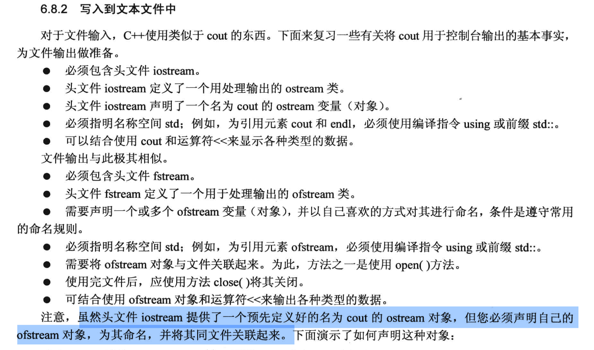
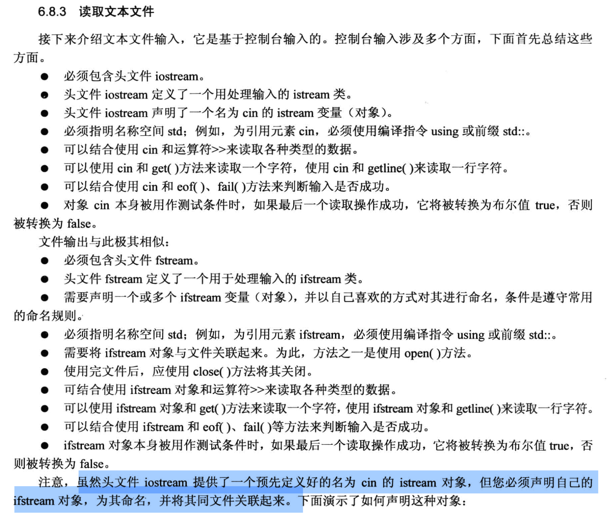

# 6.8 简单文件输入/输出 (这里的方法仅适用于文本文件)
本章讨论的文件I/O相当于控制台I/O, **因此仅适用于文本文件**.

## 回顾前几章用到的直接从键盘读取输入的方法
cin 读取不同类型的数据:
1. 用 cin 读取并存放到 char 类型:
```cpp
char ch;
cin >> ch; // 键盘输入 "38.5 19.2", 注意两个数字中间有个空格 
```
- 此时, cin 的操作是: 先读取 `字符3`对应的ASCII码, 并把这个ASCII码存储在ch中, 然后再把`字符8` 对应的`ASCII码 存储在ch中`, 以此重复.
  - 注意, 我们在键盘输入的时候也是一个个字符输入的, 所以 cin 也是一个个字符进行处理(注意是**字符**类型, 不是**数值**类型)

2. 用 cin 读取并存放到 int 类型
```cpp
int n;
cin >> n; // 键盘输入 "38.5 19.2"
```
- cin 的操作过程是:
  - cin 开始`按照一个个字符的速度`不断读取缓冲区的内容, 由于此时读取的是 `int 类型`, cin 会不断读取直到遇到 `非数字字符`时暂停读取缓冲区的字符, 并进行相应的内部计算.
    - 例如: 这里输入的 38.5, cin 先读取了字符3, 然后读取字符8, 之后会遇到一个句点`.`, 此时 cin 会暂停读取并进行计算, 计算后得知这两个字符对应着`数字38`, 因此它直接将38的 `二进制编码` 复制到变量n中.
      - 此时, 输入缓冲区里剩下的内容是: 句点, 5, 空格, 1, 9, 点, 2

3. 用 cin 读取并存放到 double 类型
```cpp
double x;
cin >> x;  // 键盘输入 "38.5 19.2"
```
- 对于 double 类型的读取, cin 会`按照一个个字符的速度读取`, 直到遇到`第一个不属于浮点数的字符`.
  -  如: cin 读取 3, 8, 句点和5, 后面遇到一个空格, 此时 cin 将停止读取字符, 并进行计算, 计算后得到 38.5, 将其`二进制编码(浮点格式)`复制到变量x中.
     - 这时候, 输入缓冲区里剩下的内容是: 空格 和 19.2

4. 用 cin 读取并存放到 char 数组
```cpp
char word[50];
cin >> word;  // 键盘输入 "38.5 19.2"
```
- 此时, cin `按照一个个字符的速度读取`, 直到遇到`空白字符`(空格, tab, 回车都是空白字符). 
  - 如: cin 读了 3, 8, 句点, 5, 后面发现是空格, 不读了, 由于读取的是 char 类型的数组, 它直接把 `这几个字符的 ASCII码` 存储到数组中.


5. 用 cin.getline() 读取并存放到 char 数组
```cpp
char word[50];
cin.getline(word, 50);  // 键盘输入 "38.5 19.2"
```
- cin `按照一个个字符的速度读取`, 直到遇到`换行符 \n` (假定输入的时候是按照规则, 少于50个字符), 此时所有字符都会被直接存放到 char 数组中, 并自动在输入的字符末尾增加一个 `空字符 \0` (注意区分空白字符和空字符).
  - 使用 cin.getline() 函数读取时, 输入的`换行符会从缓冲区中读取出来`, 但**不会存储**到 char 数组中, 而是直接被**丢弃**, 此时, 下一次从缓冲区读到的数据将是另外输入的数据.


## 6.8.2 写文本文件
C++ 能处理的文件不仅仅是文本文件, 还包括二进制文件, 但是我们先从文本文件开始学习.

代码例子:
```cpp
#include <iostream>
#include <fstream>   // 文件IO一定要包含的库文件, 里面有操作文件时需要的"对象的定义"


using namespace std;

int main(void)
{
    char automobile[50];
    int year;
    double a_price, d_price;

    // ostream 里已经定义好了 cout; istream 里定义好了 cin, 所以可以直接使用, 不需要自己定义.
    // fstream 中 只有 ofstream 和 ifstream, "还没有给我们弄好对象", 所以进行文件IO的第一步是创建对象.

    ofstream outFile;                   // 1. 用 ofstream 类, 创建一个输出文件流对象 outFile
    outFile.open("carInfo.txt");        // 2. 将对象与文件关联起来 (此时这个文件可以还没有创建, 这个对象会自动创建文件)


    cout << "Enter the make and the model of automobile: ";
    cin.getline(automobile, 50);

    cout << "Enter the model year: ";
    cin >> year;

    cout << "Enter the original asking price: ";
    cin >> a_price;
    d_price = a_price * 0.913;

    // 将信息输出到 屏幕 上
    cout << fixed;                  // 用小数点表示数字
    cout.precision(2);              // 显示时, 保留小数点后两位的精度
    cout.setf(ios_base::showpoint); // 设置一定要显示小数点和小数部分 
    cout << "Make and model: " << automobile << endl;
    cout << "Year: " << year << endl;
    cout << "asking price: " << a_price << endl;
    cout << "now price: " << d_price << endl;

    // 将信息输出到 文件 中 (覆盖写!!)
    // trick: cout 怎么用, outFile 就怎么用
    outFile << fixed;                  // 用小数点表示数字
    outFile.precision(2);              // 显示时, 保留小数点后两位的精度
    outFile.setf(ios_base::showpoint); // 设置一定要显示小数点和小数部分 
    outFile << "Make and model: " << automobile << endl;
    outFile << "Year: " << year << endl;
    outFile << "asking price: " << a_price << endl;
    outFile << "now price: " << d_price << endl;

    outFile.close();

    /*
    注意:
        如果多次运行这个程序, 不难发现它执行的是 覆盖写, 已有文本中的内容被丢弃了.
        原因:
            outFile.open() 这个 open 方法会直接丢弃文本内原有的内容!!!
    */

    return 0;
}
```
此代码例子中值得注意的是:

- 想要实现写文件, 需要包含以下操作:

```cpp
#include <fstream>              // 需要包含文件IO的库文件
ofstream outFile;               // 需要我们手动创建对象
outFile.open("carInfo.txt");    // 需要手动将对象关联到一个文件(名)上
outFile << "要写入文件的内容" << endl;
outFile.close();                // 别忘记关闭文件
``` 
- 如果使用 outFile.open() 方法, 会直接覆盖写, 丢弃原有内容.
- outFile 的用法和 cout 的用法相同, 但是 cout 是系统自动创建的对象, 而 outFile 是我们手动创建的对象.
  - 如果需要对写入的数值进行格式化, 常见的一般是指定小数位数:
```cpp    
    outFile << fixed;                  // 用小数点表示数字
    outFile.precision(2);              // 显示时, 保留小数点后两位的精度
    outFile.setf(ios_base::showpoint); // 设置一定要显示小数点和小数部分
```


## 6.8.3 读取文本

代码例子:
```cpp
#include <iostream>
#include <fstream>      // 文本IO库
#include <cstdlib>      // exit() 函数库, 这是c语言的库 <stdlib.h>, 所以前面加了c

using namespace std;

const int SIZE = 60;

int main(void) 
{  
    char filename[SIZE];
    cout << "Enter name of data file: ";
    cin.getline(filename, SIZE);

    //打开文件
    ifstream inFile;            // 新建对象, 因为是要读文件, 这里要使用 ifstream, 写文件的话, 要使用 ofstream
    inFile.open(filename);      // 将对象与文件关联起来

    // 注意: 一定要判断一下文件已经打开成功
    if ( !( inFile.is_open() ) )    // 用 is_open() 方法判断是否成功打开文件
    {
        cout << "Could not open the file " << filename << endl;
        cout << "Program terminating!" << endl;
        
        exit(EXIT_FAILURE);         // 如果程序异常退出, 一般用exit(EXIT_FAILURE)
    }
    cout << "Open the txt file successfully!\n" ;

    // 下面是读取成功后, 对读取的数据进行操作
    double value;
    double sum = 0.0;
    int count = 0;

    inFile >> value;                // inFile 对象的用法和 cin 是一样的 (所有的cin方法, 在ifstream类中都有定义!)
    cout << "Data (read from file): " << value << " ";
    // 联想 cin 中捕获的数据不匹配的情况, 这里的 inFile 同样可能发生
    while (inFile.good())          // 用 good() 方法判断文件数据是否读取顺利(包括读取之后的数据类型匹配问题)
    {
        count += 1;
        sum += value;
        inFile >> value;            // inFile 每次只读取一个数据 (value是double类型, 每次会自动读取一个浮点类型数据)
        cout << value << " ";
    }
    cout << endl;

    // 判断文件读取的退出情况: 1. 正常读完文件; 2. 遇到数据类型不匹配, 导致读取停止; 3. 未知原因导致停止.
    if (inFile.eof())               // 用 eof() 方法判断是否读到文件末尾
    {
        cout << "End of file reached! \n";
    }   
    else if (inFile.fail())         // 用 inFile.fail() 判断读取的数据类型是否与 value 不匹配, 如果不匹配, 就返回true 
    {
        cout << "Input terminated by data miss-matched! \n";
    }
    else
    {
        cout << "Input terminated by unkown reason...\n";
    }

    // 对读取的数据进行操作
    if (0 == count)
    {
        cout << "No data processed!\n";
    }
    else
    {
        cout << "Items read: " << count << endl;
        cout << "Sum: " << sum << endl;
        cout << "Avg: " << sum/count << endl;
    }

    inFile.close();  // 别忘记关闭文档

    return 0;
}
```
本例子中值得注意的:
- 如果程序需要异常退出, 一般使用 `exit(EXIT_FAILURE)` 函数, exit() 函数需要包含库 `#include <cstdlib>`.
  - EXIT_FAILURE 是 exit() 函数的参数.
- 使用 `.is_open()` 方法来判断文件是否成功打开.
  - is_open() 是较新的方法, 有些编译器可能不支持, 不支持的话, 一般就用老方法 good() 来判断. 但是 good() 在检查可能存在问题的方面不如 is_open() 用的多.
- 使用`.good()` 方法来判断文件是否读取顺利.
  - 在不发生任何错误的情况下, good() 方法返回 true.
- 使用`.eof()` 方法来判断是否读取到文件末尾.
- 使用`.fail()` 方法来判断读取的数据类型是否与 value 不匹配, 如果不匹配, 就返回true.


