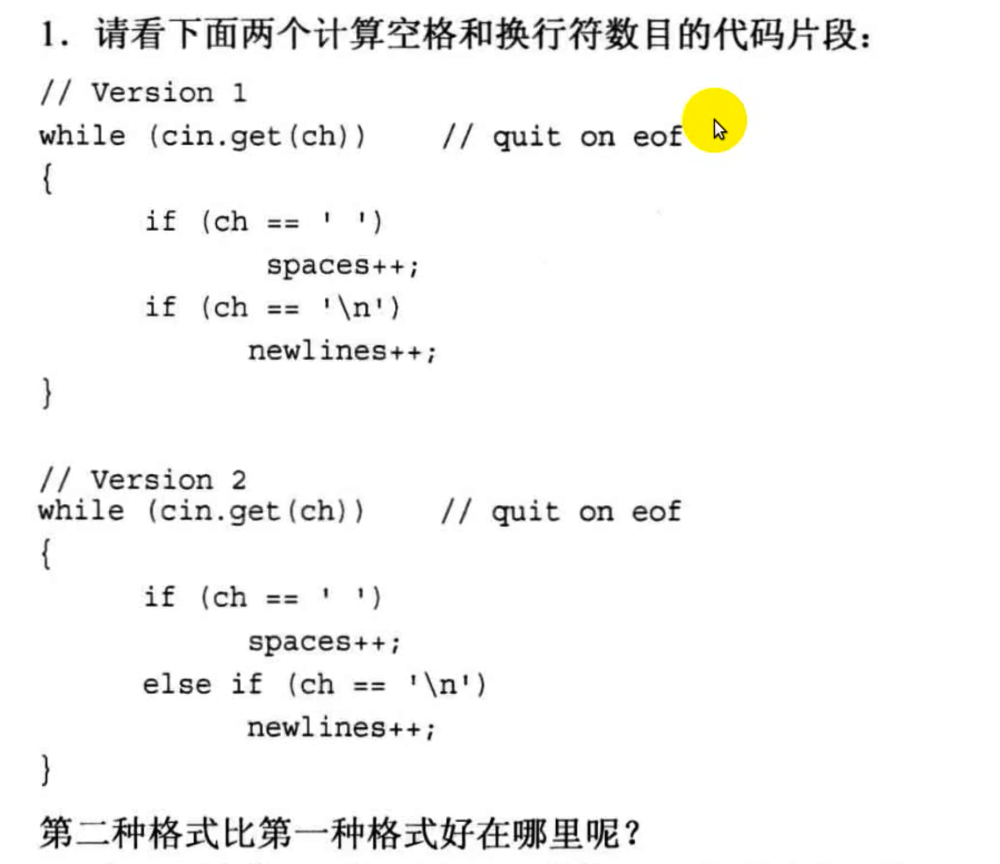
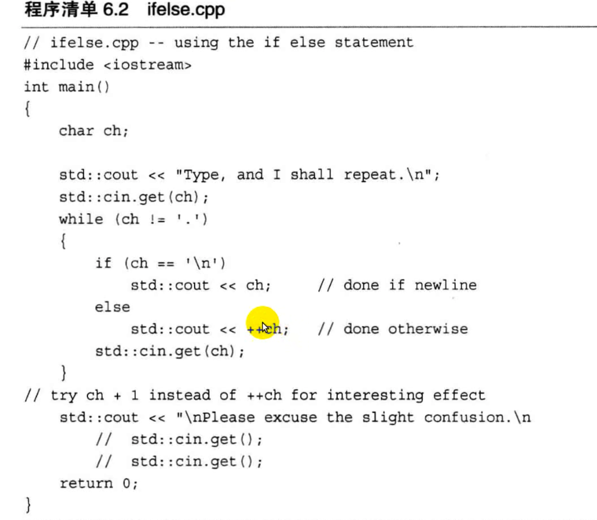
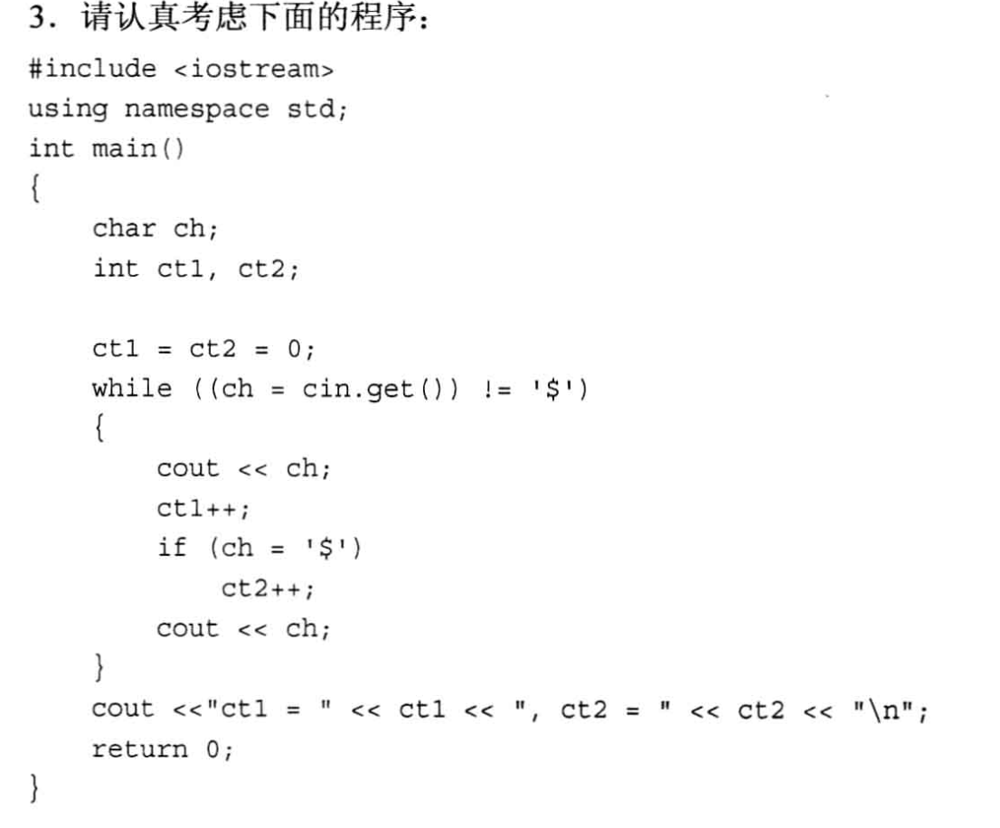
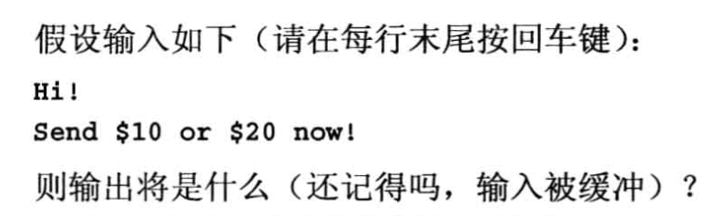
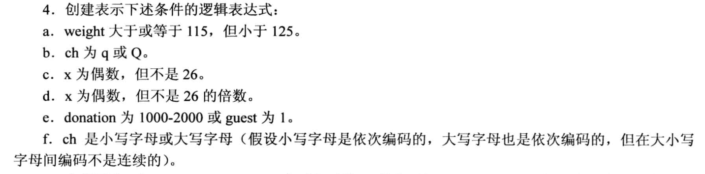
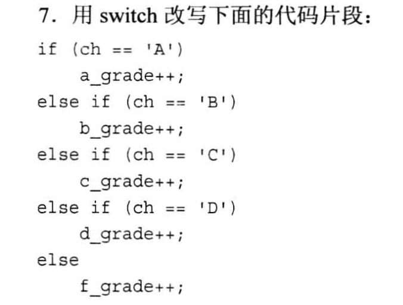
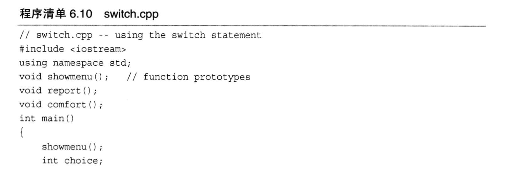
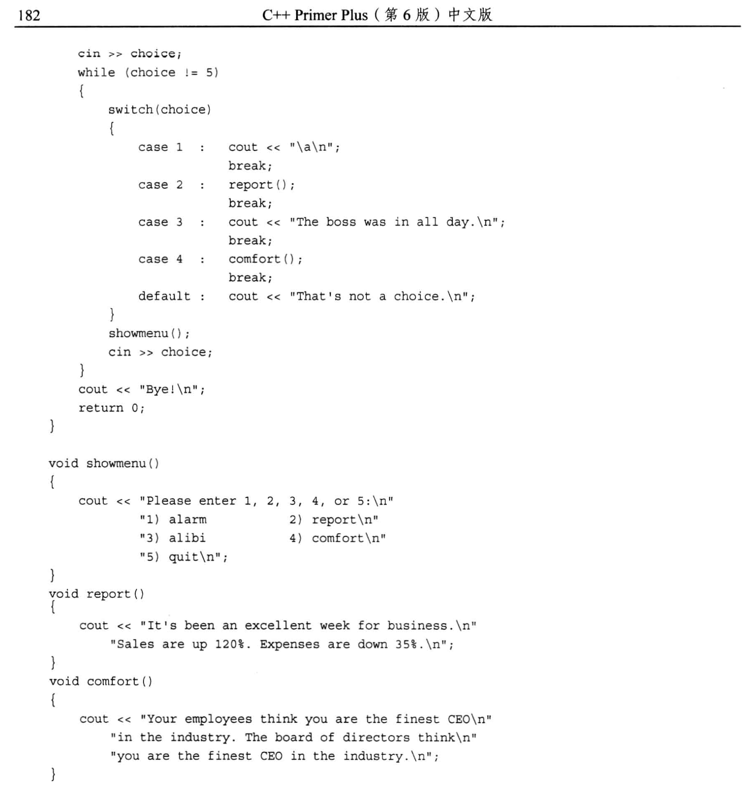
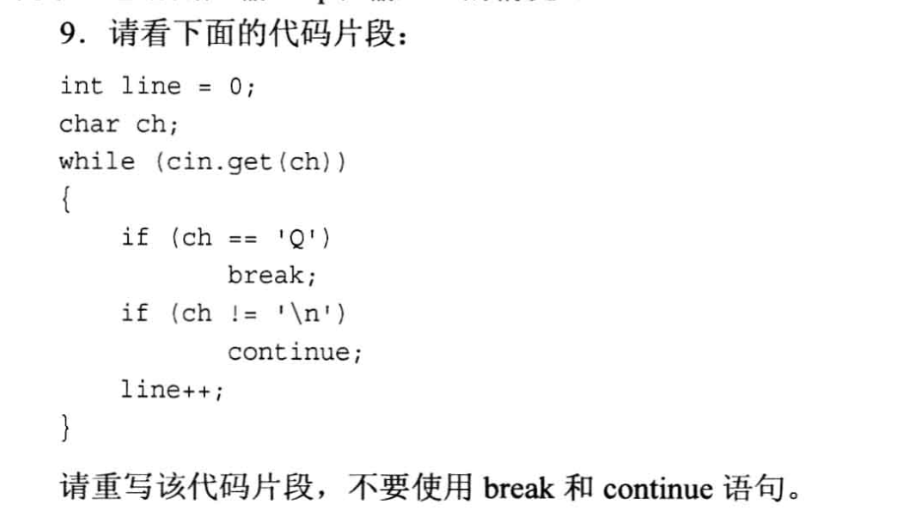

# 6.10 复习题
- 第一题:

```txt
版本2执行效率更高, 第一种方式中, 两个if 的条件判断都会跑一遍, 而第二种方式中, 如果满足了第一个if条件, else if 的条件将不会执行, 效率更高.
```

- 第二题
在程序清单6.2中，用cht1替换++ch 将发生什么情况呢?
  - 程序清单6.2
    

```
ch 是 char 类型, 1 是默认是 int类型, 如果 ch+1 的话, 由于类型提升, 最后会返回一个 int 类型, 以至于 cout 输出的是十进制数字.

而 ++ch 则是 把ch对应的ASCII码加1, 类型还是 char型, 最后 cout 输出的是这个ASCII码对应的字符.
```

- 第三题


```txt
输出:
    H$i$!$
    $S$e$n$d$ $ct1=9, ct2=9                

注意第二行的开头, 开头的$是因为输入 Hi! 后面敲了一个回车, 在while的循环体里, if(ch = '$') 是一个赋值语句, 这个语句一定返回 true, 所以ct2++, 然后 cout 输出一个 $, 所以第二行的开头是一个 $.
```

- 第四题

```txt
a. weight >=115 && weight < 125
b. (ch == 'q) || (ch == 'Q')
c. (x%2 == 0) && (x != 26)
d. (x%2 == 0) || (x%26 != 0)
e. (donation >= 1000 && donation <= 2000 ) || (1 == guest)
f. (ch >= 'a' && ch <= 'z') || (ch >= 'A' && ch <= 'Z')
```

- 第五题
  - 在英语中，“I will not not speak (我不会不说)”的意思与“I will speak(我要说)” 相同。在C+ 中，!!x 是否与 x 相同呢?
```
如果 x 是 bool 类型的话没什么问题, 但如果x不是, 就不会相同了, 最后得到的结果不是 x 原来的类型而是 bool类型.
```

- 第六题
  - 创建一个`条件表达式`，其值为变量的绝对值。也是说，如果变量×为正，则表达式的值为 x; 但如果×为负，则表达式的值为 -x ( 这是一个正值)。

```cpp
// 对应的 if-else 语句
if (x >= 0)
    x = x;
else
    x = -x;

// 用条件表达式则是:
(x >= 0) ? x : -x;
```


- 第七题

```cpp
switch (ch)
{
    case 'A' : a_grade++; break;
    case 'B' : b_grade++; break;
    case 'C' : c_grade++; break;
    case 'D' : d_grade++; break;
    default : f_grade++;
}
```

- 第八题
  - 对于程序清单6-10，与使用数字相比，使用宇符(如 a 和 c)表示菜单选项和case标签有何优点呢? (提示:想想用户输入 q 和输入 5 的情况。)
  - 程序清单6-10:
    
    
```txt
如果使用数字类型的变量作为 case, 那么我们在输入字符的时候, cin 的捕获机制就会出类型不匹配导致 cin 功能禁用的问题, 而 while 又在不断循环, 整个程序就死循环了.

而如果使用的是 字符 类型变量作为 case, 无论输入的是数字还是字母, 在cin 捕获的时候就不会出问题.
```


- 第九题


```cpp
int line = 0;
char ch;
while (cin.get(ch) && ch != 'Q')      // cin.get(ch) 确保输入成功, 然后再把 break 的条件增加到这里
{
    if(ch == '\n')
        line++;
}
```


# 编程题 