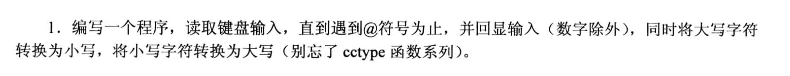
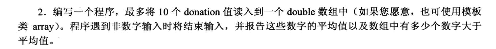
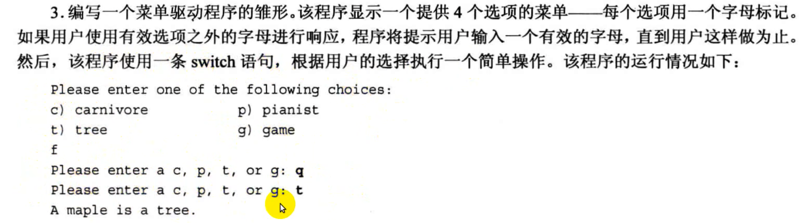
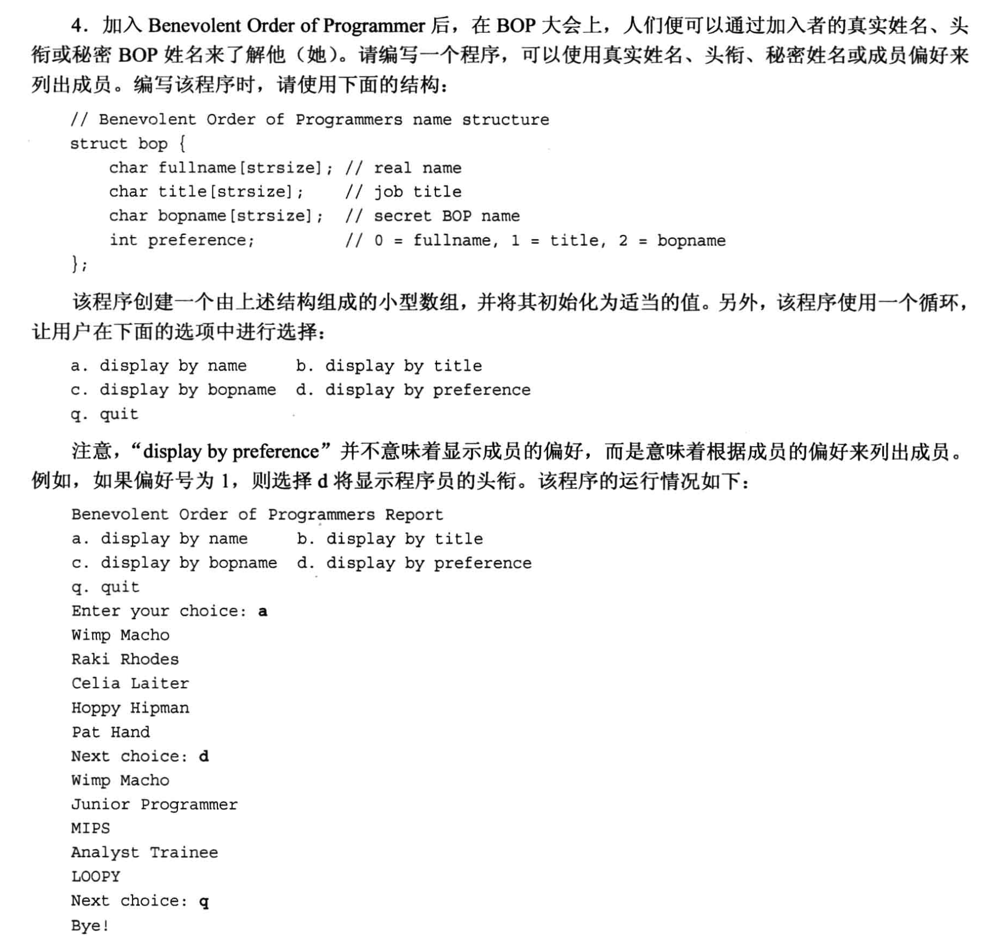
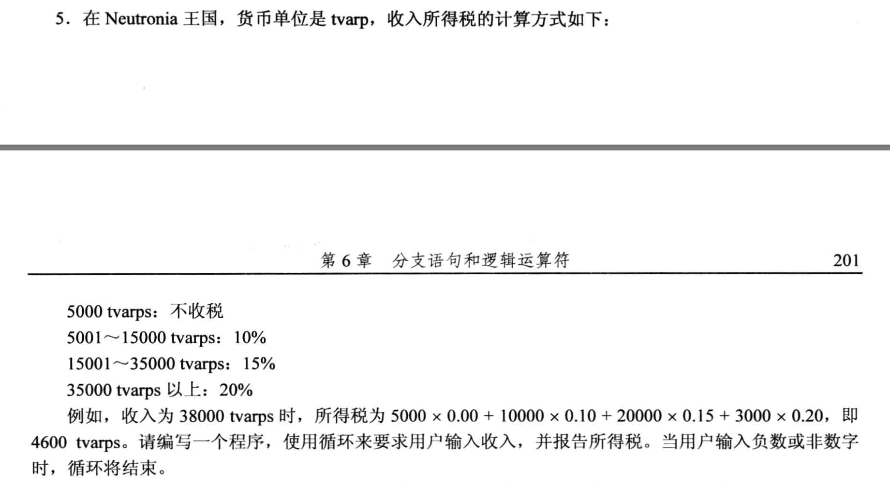
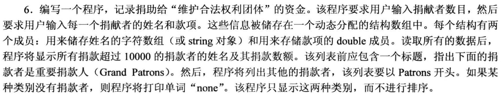

# 6.10 复习题
- 第一题:

```txt
版本2执行效率更高, 第一种方式中, 两个if 的条件判断都会跑一遍, 而第二种方式中, 如果满足了第一个if条件, else if 的条件将不会执行, 效率更高.
```

- 第二题
在程序清单6.2中，用cht1替换++ch 将发生什么情况呢?
  - 程序清单6.2
    

```
ch 是 char 类型, 1 是默认是 int类型, 如果 ch+1 的话, 由于类型提升, 最后会返回一个 int 类型, 以至于 cout 输出的是十进制数字.

而 ++ch 则是 把ch对应的ASCII码加1, 类型还是 char型, 最后 cout 输出的是这个ASCII码对应的字符.
```

- 第三题


```txt
输出:
    H$i$!$
    $S$e$n$d$ $ct1=9, ct2=9                

注意第二行的开头, 开头的$是因为输入 Hi! 后面敲了一个回车, 在while的循环体里, if(ch = '$') 是一个赋值语句, 这个语句一定返回 true, 所以ct2++, 然后 cout 输出一个 $, 所以第二行的开头是一个 $.
```

- 第四题

```txt
a. weight >=115 && weight < 125
b. (ch == 'q) || (ch == 'Q')
c. (x%2 == 0) && (x != 26)
d. (x%2 == 0) || (x%26 != 0)
e. (donation >= 1000 && donation <= 2000 ) || (1 == guest)
f. (ch >= 'a' && ch <= 'z') || (ch >= 'A' && ch <= 'Z')
```

- 第五题
  - 在英语中，“I will not not speak (我不会不说)”的意思与“I will speak(我要说)” 相同。在C+ 中，!!x 是否与 x 相同呢?
```
如果 x 是 bool 类型的话没什么问题, 但如果x不是, 就不会相同了, 最后得到的结果不是 x 原来的类型而是 bool类型.
```

- 第六题
  - 创建一个`条件表达式`，其值为变量的绝对值。也是说，如果变量×为正，则表达式的值为 x; 但如果×为负，则表达式的值为 -x ( 这是一个正值)。

```cpp
// 对应的 if-else 语句
if (x >= 0)
    x = x;
else
    x = -x;

// 用条件表达式则是:
(x >= 0) ? x : -x;
```


- 第七题

```cpp
switch (ch)
{
    case 'A' : a_grade++; break;
    case 'B' : b_grade++; break;
    case 'C' : c_grade++; break;
    case 'D' : d_grade++; break;
    default : f_grade++;
}
```

- 第八题
  - 对于程序清单6-10，与使用数字相比，使用宇符(如 a 和 c)表示菜单选项和case标签有何优点呢? (提示:想想用户输入 q 和输入 5 的情况。)
  - 程序清单6-10:
    
    
```txt
如果使用数字类型的变量作为 case, 那么我们在输入字符的时候, cin 的捕获机制就会出类型不匹配导致 cin 功能禁用的问题, 而 while 又在不断循环, 整个程序就死循环了.

而如果使用的是 字符 类型变量作为 case, 无论输入的是数字还是字母, 在cin 捕获的时候就不会出问题.
```


- 第九题


```cpp
int line = 0;
char ch;
while (cin.get(ch) && ch != 'Q')      // cin.get(ch) 确保输入成功, 然后再把 break 的条件增加到这里
{
    if(ch == '\n')
        line++;
}
```


# 编程题 
- 第一题

```cpp
#include <iostream>
#include <cctype>

using namespace std;

int main(void)
{
    char ch;

    cout << "Please enter some characters (enter '@' to terminate): \n";
    
    while( cin.get(ch) && ch != '@')
    {
        if (!(isdigit(ch)))  // 排除数字
        {
            if (ch >= 'A' && ch <= 'Z')
                cout << (char) tolower(ch) << endl;
            else if(ch >= 'a' && ch <= 'z')
                cout << (char) toupper(ch) << endl;
        }
        cin.get(ch);
    }

    cout << "Done! \n";
    return 0;
}
```


- 第二题

```cpp
#include <iostream>
#include <array>

using namespace std;

const int Max = 10;

int main(void)
{  
    array<double, Max> donation;
    double input;
    int count = 0;
    double sum = 0.0;
    double average = 0;

    cout << "Please enter the double numerial: ";
    
    while ( (cin >> input) && (count < 10) )   // 用 input 存放输入的数字, cin 判断是否读入正确
    {
        donation[count++] += input;             // count++ 将在赋值完成后自增1
        cout << "Please enter the double numerial: ";
    }
    for (int i = 0; i < count; i++)
        sum += donation[i];
    
    average = sum / count;
    
    int bigger = 0;
    for (int i = 0; i < count; i++)
    {
        if (donation[i] > bigger)
            bigger++;
    }

    cout << "Avg = " << average << ", " << bigger << " bigger numbers are biggder than average.\n"; 

    return 0;
}
```


- 第三题

```cpp
#include <iostream>

using namespace std;
// enum {c, p, t, g};

int main(void)
{
    char ch;

    cout << "Please enter one of the following choices: " << endl;
    cout << "c) carnivore \t p) pianist \n";
    cout << "t) tree \t g) game \n";

    do 
    {cout << "Please enter a c, p, t, or g: ";
    cin.get(ch).get();  // 干掉回车
    }
    while (ch != 'c' && ch != 'p' && ch!= 't' && ch != 'g');
    
    switch (ch)
    {
        case 'c' : cout << "A maple is a tree.\n"; break;
        case 'p' : cout << "A maple is a tree.\n"; break;
        case 't' : cout << "A maple is a tree.\n"; break;
        case 'g' : cout << "A maple is a tree.\n"; break;
        // default : cout << "Please enter a c, p, t, or g: " << endl; 
    }

    return 0;
}
```

- 第四题
 

```cpp
#include <iostream>

using namespace std;

const int strsize = 40;
const int usersize = 4;

void showmenu(void);
void print_by_fullname();
void print_by_title();
void print_by_bopname();
void print_by_pref();


struct bop
{
    char fullname[strsize];
    char title[strsize];
    char bopname[strsize];
    int preference;
};

bop user[usersize] = 
    {
        {"Rick", "Level_A", "RR", 0},
        {"Jack", "Level_B", "JJ", 1},
        {"Michael", "Level_C", "MM", 2},
        {"Ning", "Level_S", "GG", 2}
    };

int main(void)
{
    showmenu();
    
    char choice;
    cin.get(choice).get(); // 每次输入都有一个回车, 消耗这个回车

    while (choice != 'q')
    {
        switch (choice)
        {
            case 'a' : print_by_fullname(); break;
            case 'b' : print_by_title(); break;
            case 'c' : print_by_bopname(); break;
            case 'd' : print_by_pref(); break;
            default : cout << "Please enter character a, b, c, d, q: \n"; 
        }
        cout << "Next input: ";
        cin.get(choice).get();
    }

    cout << "bye!" << endl;

    return 0;
}

void showmenu(void)
{
    cout << "Benevolent Order of Programmers Report\n";
    cout << "a. display by name \t b. display by title\n";
    cout << "c. display by bopname \t d. display by preferece\n";
    cout << "q. quit\n";
    cout << "Enter your choice: ";
}


void print_by_fullname(void)
{
    for (int i = 0; i < usersize; i++ )
        cout << user[i].fullname << endl; 
}

void print_by_title(void)
{
    for (int i = 0; i < usersize; i++ )
        cout << user[i].title << endl; 
}

void print_by_bopname(void)
{
    for (int i = 0; i < usersize; i++ )
        cout << user[i].bopname << endl; 
}

void print_by_pref(void)
{
    for (int i = 0; i < usersize; i++ )
    {
        switch (user[i].preference)
        {
            case 0 : cout << user[i].fullname << endl; break;
            case 1 : cout << user[i].title << endl; break;
            case 2 : cout << user[i].bopname << endl; break;
        }
    }
}
```


- 第五题
 

```cpp
#include <iostream>

using namespace std;

int main(void)
{
    double income;
    double tax;

    cout << "Please enter your income: ";

    while ((cin >> income) && (income >= 0) )
    {
        if (income <= 5000)
            tax = 0.0;
        else if (income <= 15000)
            tax = 0.1 * (income - 5000);
        else if (income <= 35000)
            tax = 10000*0.1 + 0.15 * (income - 15000);
        else
            tax = 10000*0.1 + 0.15 * 20000 + (income - 35000) * 0.2;
        
        cout << "Your tax = " << tax << endl;
        cout << "Please enter your income." << endl;
    }

    return 0;
}
```


- 第六题


```cpp
#include <iostream>
#include <string>

using namespace std;

struct patrons
{
    string name;
    double donation;
};


int main(void)
{
    int numbers;
    bool emp_flag = true;

    patrons* ppatrons = new patrons [numbers];  // 动态结构体数组

    cout << "Enter the number of donors: ";
    cin >> numbers;


    for (int i = 0; i < numbers; i++)
    {
        cout << "donor #" << i+1 << ": \n";
        cout << "Enter the name of donor: ";
        cin >> ppatrons[i].name;                // string 类型可以直接 cin >>

        cout << "Enter the donation amount: ";
        cin >> ppatrons[i].donation;
    }

    cout << "\n----- Grand Patrons -----\n";
    for (int i = 0; i < numbers; i++)
    {
        if (ppatrons[i].donation >= 10000)
        {
            emp_flag = false;       // 数组中有记录, 非空
            cout << ppatrons[i].name << ": " << ppatrons[i].donation << endl;
        }
    }
    if (emp_flag)
        cout << "None" << endl;   // 如果没有这类人, 就直接打印 none

    emp_flag = true;   // re-init
    cout << "\n----- Patrons -----\n";
    for (int i = 0; i < numbers; i++)
    {
        if (ppatrons[i].donation < 10000)
        {
            emp_flag = false; 
            cout << ppatrons[i].name << ": " << ppatrons[i].donation << endl;
        }
    }

    if (emp_flag)
        cout << "None" << endl;   // 如果没有这类人, 就直接打印 none

    return 0;
}
```
