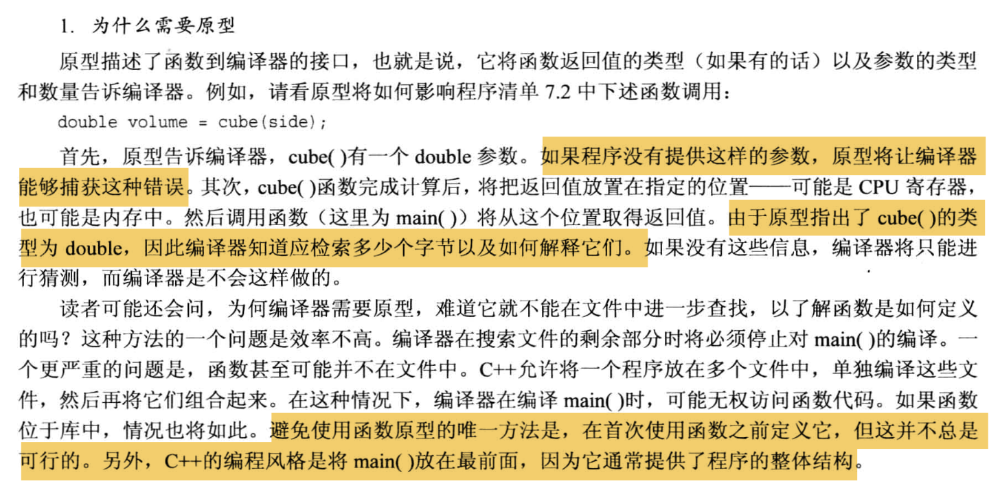
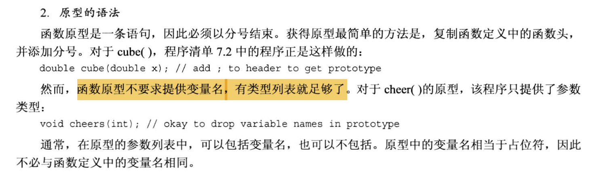

# 知识大纲
1. 函数基本知识
2. 函数原型
3. 按值传递函数参数
4. 设计处理数组的函数
5. 使用const指针参数
6. 设计处理本文字符串的函数
7. 设计处理结构的函数
8. 设计处理string对象函数
9. 调用自身的函数(递归)
10. 指向函数的指针


# 函数的基本知识
定义一个函数包含以下3点:
```cpp
1. 函数的定义
2. 函数的原型
3. 调用函数
```
库函数在 `.h` 头文件中已经完成了`函数的定义`和`函数的原型声明`, 我们使用时只需要`#include`这个头文件, 然后直接调用就行.

代码示例:
```cpp
//函数定义模板
typeName functionName(parameterList)        // typeName是返回类型, parameterList是参数列表
{
    statements;
    return value;           // 要与函数的返回类型匹配; 如果函数返回类型是void, 则可以不写return语句
}
```
- 注意:
  - C++中, 函数的返回值类型一定`不能是数组类型`, 但可以是其他任何类型 (`整数`,`浮点数`,`指针` 甚至是`结构`和`对象`!)
    - 不能是数组的原因是: C++中, `数组不能直接赋值给数组`(模板类里面定义了相关的函数进行对应元素的赋值, 是个例外情况, 默认情况下是没有定义处理数组元素赋值的函数的)

  - 关于函数返回类型匹配的简单比喻:
    - 如果函数中实际 return 了一个`西瓜`, 那么, 由于函数在声明的时候 typeName 就应该写成`西瓜`而不能是`土豆`, 否则其他人在调用这个函数的时候就会把函数的返回值存到一个`土豆`类型的变量里, 这显然是会报错的.

  - 函数体中`可以包含多条return语句`, 但是在执行时, 只要执行到其中的任何一条 return, 就会结束函数的调用, 并按照当前执行的 return 语句进行值的返回.

  - 如果把函数的定义直接写在代码文件的开头, 那么其实可以`省略不写函数的原型/声明`
    - 但是不建议这么做, 函数的原型/声明 是写给`编译器`看的, 这是在告诉编译器这个函数的"外观长什么样", 如果没有写函数的原型, 那么在其他文件中如果调用这个函数, 并且函数的定义可能不是位于代码文件的顶部位置, 此时就会报错, 总而言之, 这是一个潜在的引发编译错误的写法, 不建议使用.


为什么需要函数的原型?


函数原型的语法



