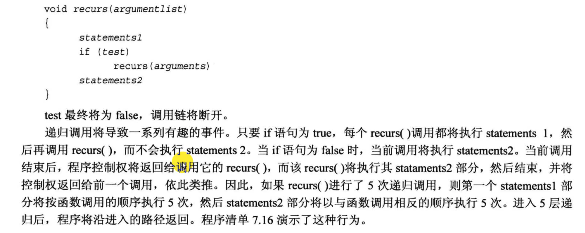
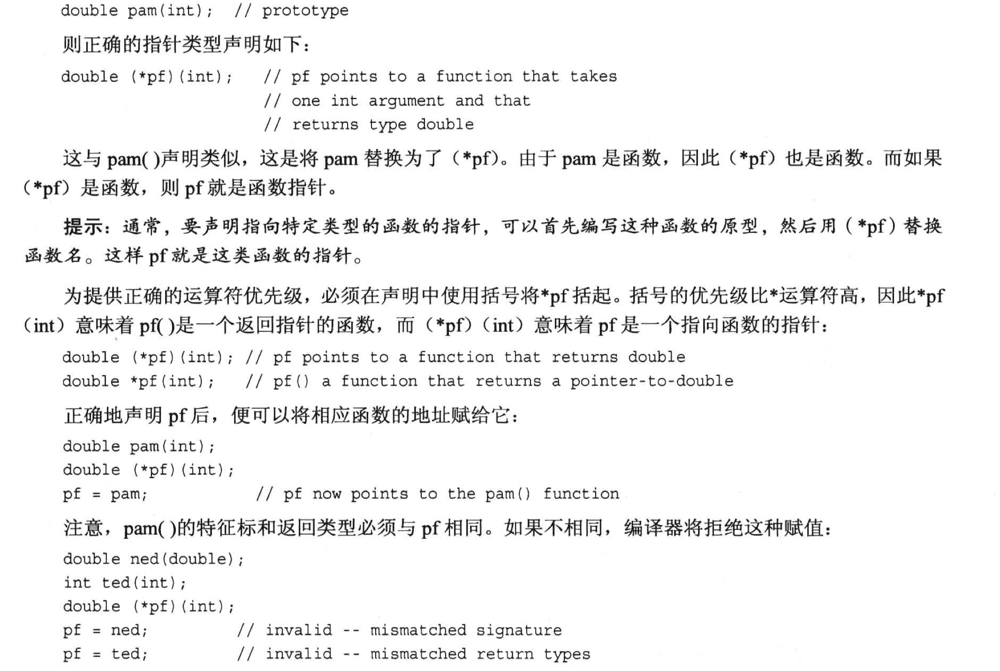

# 知识大纲
1. 函数基本知识
2. 函数原型
3. 按值传递函数参数
4. 设计处理数组的函数
5. 使用const指针参数
6. 设计处理本文字符串的函数
7. 设计处理结构的函数
8. 设计处理string对象函数
9. 调用自身的函数(递归)
10. 指向函数的指针


# 7.1 函数的基本知识
定义一个函数包含以下3点:
```cpp
1. 函数的定义
2. 函数的原型
3. 调用函数
```
库函数在 `.h` 头文件中已经完成了`函数的定义`和`函数的原型声明`, 我们使用时只需要`#include`这个头文件, 然后直接调用就行.

代码示例:
```cpp
//函数定义模板
typeName functionName(parameterList)        // typeName是返回类型, parameterList是参数列表
{
    statements;
    return value;           // 要与函数的返回类型匹配; 如果函数返回类型是void, 则可以不写return语句
}
```
- 注意:
  - C++中, 函数的返回值类型一定`不能是数组类型`, 但可以是其他任何类型 (`整数`,`浮点数`,`指针` 甚至是`结构`和`对象`!)
    - 不能是数组的原因是: C++中, `数组不能直接赋值给数组`(模板类里面定义了相关的函数进行对应元素的赋值, 是个例外情况, 默认情况下是没有定义处理数组元素赋值的函数的)

  - 关于函数返回类型匹配的简单比喻:
    - 如果函数中实际 return 了一个`西瓜`, 那么, 由于函数在声明的时候 typeName 就应该写成`西瓜`而不能是`土豆`, 否则其他人在调用这个函数的时候就会把函数的返回值存到一个`土豆`类型的变量里, 这显然是会报错的.

  - 函数体中`可以包含多条return语句`, 但是在执行时, 只要执行到其中的任何一条 return, 就会结束函数的调用, 并按照当前执行的 return 语句进行值的返回.

  - 如果把函数的定义直接写在代码文件的开头, 那么其实可以`省略不写函数的原型/声明`
    - 但是不建议这么做, 函数的原型/声明 是写给`编译器`看的, 这是在告诉编译器这个函数的"外观长什么样", 如果没有写函数的原型, 那么在其他文件中如果调用这个函数, 并且函数的定义可能不是位于代码文件的顶部位置, 此时就会报错, 总而言之, 这是一个潜在的引发编译错误的写法, 不建议使用.


为什么需要函数的原型?


函数原型的语法


# 7.2 函数参数和按值传递

例子:
```cpp
//函数的声明
double cube (double x);
//函数的调用
double volume = cube (side);

```
- 在调用函数时, 编译器其实是把 side 赋值给了x, 在cube中我们处理的其实是 `side 的拷贝`, 而不是side本身, 这就是`按值传递`的含义.
  - 在这个例子中, x 被称为`形参`, side 被称为`实参`, 也就是说, `形参`是`实参`的一份拷贝.

- 按值传递的图示:
  

- 函数内部定义的变量叫做局部变量, 在函数调用结束时, 它们就会被销毁.
  - 局部变量的图示:
    

代码例子 (看 3.cpp, 4.cpp)


## 7.3 函数和数组
注意:
- 数组名相当于数组第一个元素在内存中的地址, 如果对数组名使用 `sizeof()`, 得到的将是整个数组的长度(以字节为单位)
  - 对指针使用 sizeof, 获得的是指针指向的内存块的大小
  - 使用 & 对数组名取地址, 得到的是数组的地址 (仍然是数组第一个元素的地址)

在`函数原型/函数声明`中, 使用数组表示法和普通指针来传递一个数组:


牢记数组的两个恒等式:
```cpp
arr[i] == * (arr + i);  // * 用来取值
&arr[i] == arr + i;     // arr + i 表示指针偏移
```

传递常规变量时, 传递的是`该变量的副本/拷贝`, 如果传数组时, 传的是指针, 相当于是直接把原来的数组传进去了.
- 为了解决原始数组容易被修改的问题, 可以使用`const`关键字, 使得传入的数组在函数内部不能被修改.
  - 后面会讲解这个知识点


为什么传递数组的时候还顺便把数组里的元素个数也传进去?
- 看6.cpp代码例子
  - 在函数中如果用 sizeof 去计算数组的大小, 得到的是**指针的大小**, 而不是数组的大小. (说明给函数传数组时, 传进去的只是一个指针)
    - 此时我们只知道数组的开头, 并不知道数组的结尾在哪里, 所以无法计算数组的大小.
  - 6_cpp运行结果:
  

传递数组和它的大小时, 注意要分成两个参数去传:
  


代码例子 -- 用区间的方式访问数组元素:
```cpp
/*
讲解知识点:
    用区间范围来实现数组的访问.
    使用STL中"超尾"的概念: 数组的 end指针 指向数组[最后一个元素]的下一个元素, 即合法的访问区间是一个"左闭右开"的区间 (和python访问list是一样的逻辑)
*/
#include <iostream>

using namespace std;

const int ArSize = 8;

int sum_arr(const int *begin, const int *end); // 正规写法是 int sum_arr (int * arr, int n)

int main(void)
{
    int cookies[ArSize] = {1, 2, 4, 8, 16, 32, 64, 128};

    int sum = sum_arr(cookies, cookies+ ArSize); // 传递一个数组给函数, 同时还传了个数

    cout << "Total cookies eaten: " << sum << endl;

    sum = sum_arr(cookies, cookies+3);
    cout << "First three eater are: " << sum << endl;

    sum = sum_arr(cookies+4, cookies+8);  // 计算后4个人一共吃多少
    cout << "Last four eater ate: " << sum << endl;

    return 0;
}

int sum_arr(const int *begin, const int *end)
{
    int total = 0;
    const int *pt;   // 用来匹配传入参数

    for ( pt = begin; pt < end; pt++)
    {
        total += *pt;       // 通过指针直接获得数组元素值
    }

    return total;
}
```


### 7.3.3 更多数组函数示例 (const 搭配数组指针做保护)

代码例子:
```cpp
/*
    数组指针用const做保护的例子
*/

#include <iostream>
const int Max = 5;

int fill_array(double arr[], int limit);
void show_array(const double arr[], int n);
void revaluate(double r, double arr[], int n);


using namespace std;

int main(void){

    double properties[Max];

    int size = fill_array(properties, Max);  // 录入
    
    show_array(properties, size);       // 回显

    if(size > 0){
        cout << "Enter revaluation factor: ";
        double factor;
        while(!(cin >> factor)){    // 检查cin是不是停止工作
            cin.clear();            // 清除cin的标志位
            while(cin.get() != '\n'){  // 清掉cin的缓冲区
                continue;
            }
            cout << "Bad input; Please enter a number: ";
        }
        revaluate(factor, properties, size); // 重新评估(重新写入数据)
        show_array(properties, size);       // 回显
    }


    return 0;
}


int fill_array(double arr[], int limit){
    double temp;
    int i = 0;
    for(; i < limit; i++){
        cout << "Enter value #" << (i + 1) << ": ";
        cin >> temp;
        if (!cin){  // 检查cin是不是停止工作
            cin.clear();  // 清楚cin的标志位
            while (cin.get() != '\n'){
                continue;
            }
            cout << "Bad input; input process terminated.\n";
            break;
        } else if( temp < 0 ){
            break;
        } else {
            arr[i] = temp;
        }
    }
    return i; // 返回成功录入的个数
}

void show_array(const double arr[], int n ){   // const 保护数组指针指向的内容
    for(int i = 0; i < n; i++){
        cout << "Property #" << (i + 1) << ": $";
        cout << arr[i] << endl;
    }
}
void revaluate(double r, double arr[], int n){

    for(int i = 0; i < n; i++){
        arr[i] *= r;
    }
}
```

const 的常见用法:
```cpp
const int *pt;  // pt指向的内容不能被修改, 但是pt本身可以修改         (*的左侧有 const)
int * const pt;  // pt指向的内容可以被修改, 但是pt本身不能修改        (*的右侧有 const)
const int * const pt;  // pt指向的内容不能被修改, pt本身也不能修改    (*的左右两侧都有 const)
```

代码例子1 -- const修饰的指针可以修改指针本身(修改指针指向的变量)但是不能通过这个指针修改内存块的值:
```cpp
/*
// pt指向的内容不能被修改, 但是pt本身可以修改
const int *pt;  <===> 等价于  int const *pt;   // const 在 * 的左侧
*/

#include <iostream>

using namespace std;

int main(void){

    int n = 10;
    int m = 100;
    // int *pt = &n;
    const int *pt = &n;     // 使用const之后, 下面的 *pt = 20 会报错
    cout << "1) n = " << n << endl;

    // *pt = 20;
    n = 100;  // 直接修改n的值是可以的, 但是不能通过 const 修饰过的指针进行修改
    cout << "2) n = " << n << endl;

    pt = &m;  // const 修饰过的 pt指针 本身可以修改, 但是不能通过这个指针去修改内存块里的东西
    cout << "*pt = " << *pt << endl;  // 此时 *pt = 100, 虽然有 const 修饰, 但是它已经指向别的内存块了
    cout << "m = " << m << endl;

    return 0;
}
```

代码例子2: 
```cpp
/*
int * const pt;  // pt指向的内容可以被修改, 但是pt本身不能修改
*/

#include <iostream>

using namespace std;

int main(void){

    int n = 10;
    int m = 100;
    int *const pt = &n;     // 注意: 此时const位于 * 的右侧, 此时指针变量不许修改

    cout << "1) n = " << n << endl;
    *pt = 20;               // 此时可以修改pt指针的内容
    cout << "2) n = " << n << endl;

    // pt = &m;                // 报错, 因为 pt 被 const 修饰, pt 是只读的, pt不能指向其它内存地址了 

    return 0;
}
```

注意:
- C++中, **禁止**将 `const 的内存地址(变量被const修饰)` 赋值给 `非const指针`!!!!
```cpp
const float g_earth = 9.80;
const float *pe = &g_earth;  // valid

const float g_moon = 1.63;
float * pm = &g_moon;     // invalid
```
 - 在第十五章中, 会介绍一种方法突破这个限制 --> 利用强制类型转换


二级指针中使用 const 的例子:
```cpp
int age = 39;  // age++ is a valid operation
int * pd = &age;  // *pd = 41 is a valid operation
const int * pt = &age;  // *pt = 41 is an invalid operation   ==> const 在*号的左侧, 表示指针不能用于修改内存块的内容
``` 
- 上面的代码例子是 `一级间接关系`, 这时候还算安全; 如果换成`二级间接关系`的话, 非const指针**也是无法赋值**给const指针的, 因为这个操作不安全, 例子如下:
```cpp
const int ** pp2;  // pp2本身是一个地址, 这个地址在内存块中存放的是一个指针(也是一个地址)
int *p1;
const int n = 13;
pp2 = &p1;  // invalid, 因为这个操作不安全, 二级间接关系里不能将非const指针赋值给const指针 
*pp2 = &n;   // valid, 因为这个操作是安全的, 将 const修饰的内存块地址 赋值给 const指针
*p1 = 10;    // valid, 因为这个操作是安全的, p1 指针没有任何修饰, 它指向的内存块可以被修改
```
 - 这个例子里为什么 `pp2 = &p1` 不合法呢? 
   - 首先, const 在*号**左侧**, 表示这个指针**不能**用于修改内存块的内容
   - 然后, 由于`*pp2 = &n;`绝对是合法的, 这是两个const指针互相赋值, 它们都只**限制了内存块的内容不可修改**, 指针变量存放的地址是可以改的.
   - 随后, 又看到`p1指针对应的内存块`没有做任何限制(因为 *p1 = 10 是合法的), 那么这个**p1指针里的地址**对应的**内存块是可以被修改**的
   - 此时, 如果`pp2 = &p1`合法的话, 就会出现逻辑冲突, p1指针对应的内存块是能改还是不能改?? 

小结:
  - 一级指针(一级间接关系) 不能将 `const变量的地址` 赋值给 `非const指针`
  - 二级指针(二级间接关系) **不可以** 进行`const指针`与`非const指针`之间的赋值. 

建议:
- **如果当前使用的指针不用于修改内存块的内容**, 则`一律给指针加上const`, 加了const之后, 它不仅可以处理 const修饰的变量的地址, 也能处理 非const修饰的变量的地址. 同时, 还保护了这个变量, 防止误改.


## 7.4 函数和二维数组

直接看例子:
```cpp
// 例子1:
int sum(int (*ar2)[4], int size);   

/* 
  1. (*ar2) 是一个指针, 它指向了一个 由4个int元素组成的数组, 因此, ar2就变成了一个二维数组的指针.
  2. *ar2 的括号是不能漏掉的!! 因为从**运算优先级**来看, 方括号[]的优先级要比 * 高, 如果不加括号, 那么就变成了一个指向 4个int元素的数组 的指针了.
  3. size 代表行数, 因为二维数组中, 我们是把每一行元素当做一个一维数组来处理的
*/


// 例子2:
int sum(int ar2[][4], int size);  // 与例子1等价, 但可读性更高

/*
  ar2 仍然是一个指针!
*/
```

访问二维数组的元素:
- 先遍历行, 再遍历列.   (因为我们传参的时候一般都是传入数组的行数)

```cpp
int sum(int ar2[][4], int size)
{
  int total = 0;
  for(int r = 0; r < size; r++)   // 先遍历行
    for(int c = 0; c < 4; c++)    // 再遍历列
      total += ar2[r][c];
      // 另一种较难看的取元素值的写法:  *(*(ar2 + r) + c)
}
```
关于用指针取二维数组值的说明:
```cpp
ar2        // 这里是一个二维数组的指针, 数组名同时还是"数组中第一行元素的首地址"
ar2 + r    // 这里也是一个指针, 它指向了二维数组中的 [第r行]
*(ar2 + r) // 这里是一个一维数组的指针, 它指向了二维数组中的 [第r行] 的首地址; 等同于 ar2[r]

*(ar2 + r) + c    // 这里是一个指针, 它指向了二维数组中的 [第r行] 的 [第c列]
*(*(ar2 + r) + c) // 这里是一个int类型的值, 它就是二维数组中的 [第r行] 的 [第c列] 的值; 等同于 ar2[r][c]
```

代码示例 -- 9.cpp:
```cpp
/*
    写一个函数, 返回一个字符串中出现了多少个指定的字符.
*/
#include <iostream>

using namespace std;

unsigned int c_in_str(const char *str, char ch);

int main(void)
{
    char mmm[15] = "minimum";
    // char *wail = "ululate"; //  这样写会报错的, 因为"ululate"此时是 const 类型, 如果允许的话, 就会存在 wail 指针修改了常量的风险
    const char *wail = "ululate";   // 还可以写成强制类型转换 char *wail = (char *) "ululate";  但是不太推荐

    unsigned int ms = c_in_str(mmm, 'm');
    unsigned int us = c_in_str(wail, 'u');   

    cout << ms << " m characters in " << mmm << endl;
    cout << us << " u characters in " << wail << endl;


    return 0;
}

unsigned int c_in_str(const char *str, char ch)  // 因为我们不希望数组在这个函数中被不慎修改, 这里加一个cosnt做保护
{
    unsigned sum = 0;

    while(*str)   // 这样写表示: 一直遍历数组元素, 没有到最后一个元素就继续循环
    {
        if(*str == ch)
            sum++;
        str++;    // 移动到下一个元素, 遍历到最后一个元素时, 它的内容是一个空白字符 '\0'
    }

    return sum;
}
```


# 7.6 函数和结构(体)

- 结构体支持对拷, 所以可以直接把一个结构体赋值给另一个结构体(注意数组不可以对拷), 因此, 结构体传入数组时, `传入的是结构体的拷贝`.
  - 如果结构体比较大, 那么在拷贝时就需要消耗不少性能.

- 函数也可以直接返回结构体.

- 结构体名字不代表它的地址(数组的名字同时表示数组第一个元素的地址), 要获取结构体的地址, 需要使用 "取址运算符 &" 


代码例子 -- 传递和返回结构体:
```cpp
#include <iostream>

using namespace std;

const int MIN_PER_HOUR = 60;

struct travel_time
{
    int hours;
    int mins;
};                  // 别忘了分号!

travel_time sum(travel_time, travel_time);
void show_time(travel_time t);

int main(void)
{
    travel_time day1 = {5, 45};
    travel_time day2 = {4, 55};

    travel_time trip = sum(day1, day2);

    cout << "Two days total: ";
    show_time(trip);

    travel_time day3 = {4, 32};

    cout << "Three days total: ";
    show_time(sum(trip, day3));

    return 0;
}

travel_time sum(travel_time t1, travel_time t2)
{
    travel_time total;

    total.mins = (t1.mins + t2.mins) % MIN_PER_HOUR;
    total.hours = t1.hours + t2.hours + (t1.mins + t2.mins) / 60;   // 进位
    return total;
}

void show_time(travel_time t)
{
    cout << t.hours << " Hours, " << t.mins << " Minutes." << endl;
}
```

代码示例2 
```cpp
/*
    输入 xy 坐标, 输出极坐标
*/

#include <iostream>
#include <cmath>

using namespace std;

struct polar   // 极坐标
{
    double distance;
    double angle;
};


struct rect     // 笛卡尔坐标
{
    double x;
    double y;
};


polar rect_to_polar(rect xypos);
void show_polar(polar dapos);

int main(void)
{
    rect rplace;
    polar pplace;
    cout << "Please the x and y values: ";

    while(cin >> rplace.x  >> rplace.y)  // 连续输入
    {
        pplace = rect_to_polar(rplace);
        show_polar(pplace);

        cout << "Next two nums (q to quit): ";
    }

    return 0;
}

polar rect_to_polar(rect xypos)  // x,y position
{
    polar answer;

    answer.distance = sqrt(xypos.x * xypos.x  + xypos.y * xypos.y);
    answer.angle = atan2(xypos.y, xypos.x);    // atan2调库计算角度(弧度制), 本质上是一个反正切函数

    return answer;
}

void show_polar(polar dapos)   // distance angle position
{
    const double Rad_to_deg = 57.29577951;   // 单位转换
    cout << "Distance = " << dapos.distance << endl;
    cout << "Angle = " << dapos.angle * Rad_to_deg << " degrees." << endl;

}
```

代码例子 -- 传结构体换成传结构体指针 (效率更高)
```cpp
/*
    输入 xy 坐标, 输出极坐标
*/

#include <iostream>
#include <cmath>

using namespace std;

struct polar   // 极坐标
{
    double distance;
    double angle;
};


struct rect     // 笛卡尔坐标
{
    double x;
    double y;
};


void rect_to_polar(const rect *pxy, polar *pda);
void show_polar(const polar* dapos) ;

int main(void)
{
    rect rplace;
    polar pplace;
    cout << "Please the x and y values: ";

    while(cin >> rplace.x  >> rplace.y)  // 连续输入
    {
        rect_to_polar(&rplace, &pplace);
        show_polar(&pplace);

        cout << "Next two nums (q to quit): ";
    }

    return 0;
}

void rect_to_polar(const rect *pxy, polar *pda)  // 不希望 pxy 被修改, 加const保护
{

    pda -> distance = sqrt(pxy->x * pxy->x  + pxy->x * pxy->y);
    pda->angle = atan2(pxy->y, pxy->x);    // atan2调库计算角度(弧度制), 本质上是一个反正切函数

}

void show_polar(const polar* dapos)   // distance angle position, 加 const 保护
{
    const double Rad_to_deg = 57.29577951;   // 单位转换
    cout << "Distance = " << dapos->distance << endl;
    cout << "Angle = " << dapos->angle * Rad_to_deg << " degrees." << endl;
}
```


# 7.7 函数和 string 数组
代码例子1 -- 传入 string 数组
```cpp
#include <iostream>
#include <string>

using namespace std;
const int SIZE = 5;

void display(const string *sa, int n);  // 用 const 保护数组

int main(void)
{
    string list[SIZE];  // 用 list 来存放数组
    cout << "Enter " << SIZE << " favorite foods:" << endl;

    for(int i = 0; i < SIZE; i++ ){
        cout << i + 1 << ": ";
        getline(cin, list[i]);      // 用 getline 函数捕获整行
    }

    cout << "Your list:" << endl;
    display(list, SIZE);

    return 0;
}

void display(const string *sa, int n)
{
    for(int i = 0; i < n; i++)
        cout << i + 1 << ": " << sa[i] << endl;  // 遍历并打印整个string对象
}
```


--- 

# 7.8 函数与 array 对象

代码例子 -- 用 array 存储一年四季的开支
```cpp
#include <iostream>
#include <array>
#include <string>

using namespace std;
const int SEASONS = 4;

void fill(array<double, SEASONS> *pa);
void show(array<double, SEASONS> da);

const array<string, SEASONS> Snames = {"Spring", "Summer", "Fall", "Winter"};  // 初始化四个季节的名字

int main(void)
{
    array<double, SEASONS> expenses;  // expenses 用来存放四个季节的开销
    fill(&expenses);                  // 防止拷贝, 传指针
    show(expenses);

    return 0;
}

void fill(array<double, SEASONS> *pa)           // 要修改数组, 所以不加 const 做保护
{
    for(int i = 0; i < SEASONS; i++){
        cout << "Enter " << Snames[i] << " expenses: ";
        cin >> (*pa)[i];                        // (*pa) 先将指针转换为 array 对象, 只有 array 对象可以像数组一样操作, 但是array指针是不可以直接像指针一样的操作的, 因为array指针"并不表示第数组的第一个元素的地址"!
    }
}

void show(array<double, SEASONS> da)
{
    double total = 0.0;
    cout << "EXPENSES: " << endl;
    for (int i = 0; i < SEASONS; i++){
        cout << Snames[i] << "\t: $" << da[i] << endl;
        total += da[i];
    }
    cout << "Total: " << total << endl;
}
```
注意:
- array "对象" 可以像数组一样操作, 但是, array "指针" 并**不能**像数组一样使用!!!!


# 7.9 递归
通常递归调用的终止都是用 if 语句来写的. 
递归的常见写法: 


代码例子:
```cpp
#include <iostream>

using namespace std;

void countdown(int n);

int main(void)
{
    countdown(4);
    return 0;
}

void countdown(int n)
{
    // statement 1
    cout << "Counting down... | " << n << " (n at address: " << &n << ")" << endl;

    // 执行递归的条件
    if(n > 0){  
        countdown(n-1);
    } 

    // statement 2
    cout << n << ": kadoom" << "| (n at address: " << &n << ")" << endl;

}


/*
输出:
    Counting down... | 4 (n at address: 0x16f30addc)
    Counting down... | 3 (n at address: 0x16f30adac)
    Counting down... | 2 (n at address: 0x16f30ad7c)
    Counting down... | 1 (n at address: 0x16f30ad4c)
    Counting down... | 0 (n at address: 0x16f30ad1c)
    0: kadoom| (n at address: 0x16f30ad1c)
    1: kadoom| (n at address: 0x16f30ad4c)
    2: kadoom| (n at address: 0x16f30ad7c)
    3: kadoom| (n at address: 0x16f30adac)
    4: kadoom| (n at address: 0x16f30addc)
*/
```

## 7.9.2 包含多个递归调用的递归

在需要将一项工作不断分成较小的, 类似的工作时, 可以考虑使用递归.
- 二分法 或者叫 分而治之(divide-and-conquer strategy) 的思想就是包含了多个递归调用.

代码例子:
```cpp
#include <iostream>

using namespace std;

const int Len = 66;
const int Divs = 6;     // 最多循环6次

void subdivide(char arr[], int low, int high, int levels);

int main(void)
{
    char ruler[Len];                  // 存放竖线

    // 清空数组
    for (int i=0; i < Len; i++){
        ruler [i] = ' ';
    }

    // 给数组的前后两个位置填写一个 竖线 |
    int min = 0;
    int max = Len - 2;
    ruler[min] = ruler[max] = '|';
    ruler[Len - 1] = '\0';            // 用于结束打印
    
    cout << ruler << endl;            // 先输出一行

    for(int i = 1; i <= Divs; i++){
        subdivide(ruler, min, max, i);
        cout << ruler << endl;
    }

    return 0;
}

void subdivide(char arr[], int low, int high, int levels)
{
    if(levels == 0)
        return;

    int mid = (low + high) >> 1;
    arr[mid] = '|';

    // 左半部分
    subdivide(arr, low, mid, levels -1);

    // 右半部分
    subdivide(arr, mid, high, levels -1);
}

/*
输出:

|                                                               |
|                               |                               |
|               |               |               |               |
|       |       |       |       |       |       |       |       |
|   |   |   |   |   |   |   |   |   |   |   |   |   |   |   |   |
| | | | | | | | | | | | | | | | | | | | | | | | | | | | | | | | |
|||||||||||||||||||||||||||||||||||||||||||||||||||||||||||||||||

*/

```
- 该函数一共调用了6个 level, 每一个 level 会使得函数调用次数翻倍(每次都分为左和右两个部分), 所以一共调用了 2^6 = 64 次.

- 这个代码例子说明: 如果递归层次很多, 则会导致函数调用次数很多, 从而导致程序运行缓慢, 甚至崩溃.
  - 只有递归层次较少时, 递归才是一个好的选择.


# 7.10 函数指针
使用场景: 将`一个函数`作为`另一个函数的参数`传入.

## 7.10.1 函数指针的基础知识
- 函数名就是一个地址, 直接`把函数名作为参数`传递给另一个函数即可.
  - 注意区分传递的是函数的地址, 还是函数的返回值.
    ```cpp
    // 假定已经有一个函数叫做 think();
    process(think);         // 传递函数 think 的地址 (函数指针)
    process(think());       // 传递函数 think 的返回值
    ```

- 声明函数指针
  - 函数指针的声明: 
    
    ```cpp
    double pam(int);    // 函数原型/函数声明
    
    double (*pf)(int);  // 声明一个函数指针 pf, 它指向一个以 int 为参数, 返回值为 double 的函数.

     double * pf(int);   // 声明一个函数 pf, 它返回一个 double 指针. (此时 double * 是一个整体)
    ```

  - 小例子: 声明一个estimate函数, 假定这个函数是用来估算一个算法的执行时间 和 统计代码行数.
    ```cpp
    // 传递进来的算法函数必须是 "指接受一个 int 类型的参数, 返回值为 double 类型" 的.
    void estimate(int lines, double (*pf)(int));
    ```

- 使用函数指针
  - 由于函数指针扮演的角色与函数名相同, 此时直接将函数指针当做函数名字即可.
    ```cpp
    double pam(int);
    double (*pf)(int);
    pf = pam;               // 将函数 pam 的地址赋值给函数指针 pf
    double x = pam(4);      // 直接调用函数 pam
    double y = (*pf)(5);    // 通过函数指针调用函数 pam
    ```
    - `double y = (*pf)(5);`写法可以直接提醒程序员, 当前正在使用函数指针.

代码例子:
```cpp
#include <iostream>

using namespace std;

double Rick(int lines);
double Jack(int lines);
void estimate(int lines, double (*pf)(int));

int main(void)
{
    int code;

    cout << "How many lines of codes do you need? ";
    cin >> code;

    cout << "Here is Rick's estimate: " << endl;
    estimate(code, Rick);   // Rick 是一个函数名

    cout << "Here is Jack's estimate: " << endl;
    estimate(code, Jack);   // Jack 是一个函数名

    return 0;
}

double Rick(int lines)
{
    return lines * 0.05;
}

double Jack(int lines)
{
    return lines * 0.03 + 0.0004 * lines * lines;
}

void estimate(int lines, double (*pf)(int))
{
    cout << lines << " lines code will task " << (*pf)(lines) << " hours to complete." << endl;
}
```


## 7.10.2 函数指针高级用法 (函数指针数组)

具体看下面的代码例子注释:
```cpp

```

- 注意区分`(*pa)[2](av, 3);` 和 `*pa[2](av, 3);`的区别:
    ```cpp
        // (*pa)[2](av,3) 和 *pa[2](av,3) 是 [不等价] 的!!!!!!
        
        (*pa)[2](av, 3);  
        /* 
            这句代码表示: 返回数组 av 第3个元素的 "地址".
        解析:
            1. 由于括号的优先级, 有 (*pa)表示 数组的首地址, 然后(*pa)[2] 表示数组的第3个元素的地址, 也就是指向 f3 的 函数指针.
            2. 然后 (*pa)[2](av, 3) 表示调用 f3 函数, 传入参数 av 和 3.
            3. 函数 f3 返回的是 av数组的第三个元素的地址, 所以最终得到的是 一个地址.
        */

        *pa[2](av, 3);
        /*
            这句代码表示: 返回数组 av 第3个元素的 "值".
        解析:
            1. 由于*的优先级比 括号 和 中括号 都低, 所以先处理 pa[2](av, 3); 
            2. 此时又会先处理中括号, 所以处理的是 pa[2], 表示先索引到pa数组的第二个元素, 得到 f3 函数的函数指针.
            3. 然后 pa[2](av, 3) 表示调用 f3 函数, 传入参数 av 和 3, 得到一个 const double * 类型的 指针, 也就是av数组第三个元素的地址; 到这里就获得了(*pa)[2](av, 3)的执行结果了.
            4. 得到av数组的第三个元素地址之后, 这个地址与 * 运算符结合, 取出了地址里的内容, 最终得到了  数组 av 第3个元素的 "值".
        */
        
    ```
- 注意`数组名的含义`以及`对数组名使用&操作符的含义`:
  - pa 表示数组 pa 的第一个元素的地址, 等同于 `&pa[0]`.
  - &pa 表示`取整个数组在内存中的地址`
  - 如果直接打印这两个地址, 我们看到的结果是一模一样的
  - `pa+1` 表示数组 pa 的第二个元素的地址, 等同于 `&pa[1]`.
  - `&pa+1`表示跨国整个pa数组的内存, 直接跳到了 pa 数组最后一个元素的后面, 给出这个元素的下一个内存块的地址(这个内存块与pa数组一样大).  

## 7.10.3 typedef 简化函数指针的声明
作用是 "给类型设置一个别名".
- 使用诀窍: 定义变量怎么写, typedef 定义的别名怎么使用.
```cpp
double real;   // real 是一个变量, 并且是double类型
typedef double real;   // real 不是一个变量, real 是 double 的别名

// 举例:
real r1;   // r1 是一个变量, 并且是double类型, 因为 real 已经是 double 的别名
```

- 例子: 使用 typedef 简化函数指针
```cpp
typedef const double *(*p_fun)(const double *, int);   
// p_fun 是一个函数指针类型, 它指向的函数接受两个参数, 一个是 const double *, 一个是 int, 返回值是 const double * 类型.

p_fun p1 = f1;  // p1 是一个函数指针, 指向 f1 函数.
p_fun pa[3] = {f1, f2, f3};   // pa 是一个函数指针数组, 数组里面的元素都是 p_fun 类型的函数指针.

p_fun (*pd)[3] = &pa;   // pd 是一个与 pa 相同类型的 函数指针数组.
```


