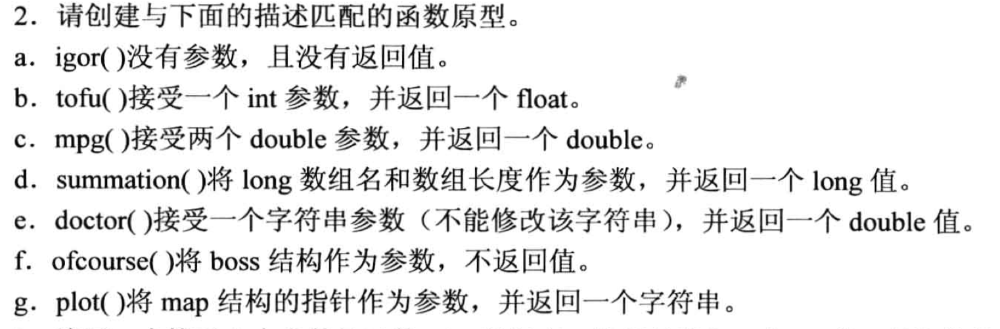
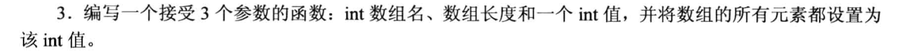
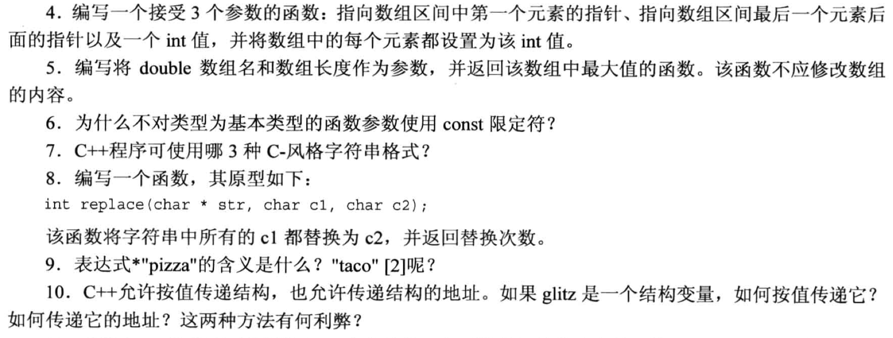
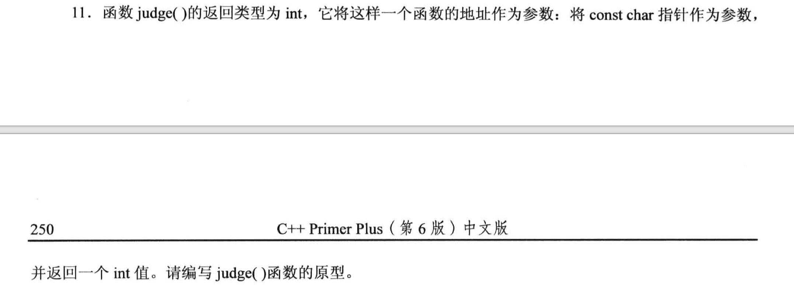
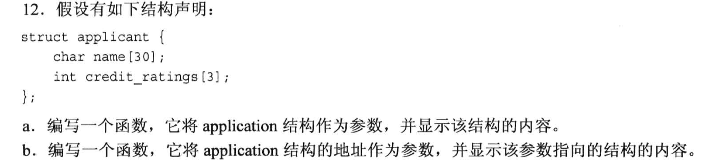
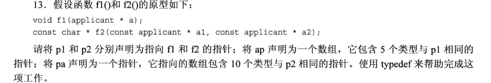

# 7.12 复习题

## 1. 使用函数的3个步骤
 - 定义函数
 - 调用函数
 - 声明函数/函数原型 

## 2. 


```cpp
// a
void igor(void);

// b
float tofu(int);

// c
double ,pg(double, double);

// d
long summation(long[], int);

// e
double doctor(const char *str);

// f
struct boss {};
void ofcourse(boss);

// g
struct map {};
char* plot(map *pt ); // map结构体的指针作为参数
```

## 3.

```cpp
int tempFunc(int arr[], int size, int n)
{
    for (int i = 0; i < size; i++){
        arr[i] = n;
    }
}
```

## 题目4-10


### 4.
```cpp
void set_arr(int *begin, int *end, int value)
{
    for (int *pt = begin; pt != end; pt++){
        (*pt) = value;
    }
}
```

### 5. 
```cpp
double findMax(const double *arr, int size)
{
    double max_val = -100000;
    for (int i = 0; i < size; i++){
        if (*(arr+i) > max_val){
            max_val = *(arr+i);
        }
    }

    return max_val;
}
```

### 6.
因为基本数据类型在函数调用的时候是`按值传递`的, 此时`函数里使用的是参数的副本`, 因此`加不加const都不会影响`原来的参数, 所以就可以不使用const关键字.

### 7.
- C++ 中, `C风格的字符串`可以是:
  - char 字符数组 `char str[] = "Hello World"`, 
  - 直接使用双引号表示字符串: `"Hello World"`.
  - 首字符的指针: `char *pt = "Hello World"`


### 8. 
```cpp
int replace(char * str, char c1, char c2)
{
    int count = 0;
    char *pt = str;

    while ( *pt != '\0'){           // 遍历到最后一个元素为止
        if ( *pt == c1){
            *pt = c2;
            count++;
        }
        pt++;                       // 别忘记移动指针
    }

    return count;
}
```

### 9.
- `*"Pizza"`: "Pizza" 是一个字符串, 它本身也代表着**第一个元素** "P" 的地址, 所以*"Pizza" 表达式会返回字符 'P'.
- `"taco"[2]`: 同理, "taco" 是一个字符串, 它本身也是这个字符串首字符的地址, 后面索引[2] 表示的是第三个元素, 所以这个表达式会返回字符 'c'.


### 10.
- 传递结构的值:
    ```cpp
    struct glitz{};                  // 假设有一个结构体 glitz
    void tempFunc(glitz temp);       // 按值传递
    tempFunc(glitz);                 // 调用函数的时候, 传递结构体的值
    ```

- 按地址传递:
    ```cpp
    struct glitz{};                  // 假设有一个结构体 glitz
    void tempFunc(glitz *temp);      // 按地址传递
    tempFunc(&glitz);                // 调用函数的时候, 传递结构体的地址
    ```

它们的差异是:
- 按值传递的话, 在函数内部对结构体的修改`不会影响到原来的结构体`, 
  - 但是会执行一次`拷贝`的过程, 如果结构体的值占用较大的内存空间, 比如图片等数据, 此时就会`产生较大的资源开销`.
- 传地址不会产生拷贝, 但是有可能会修改原来的结构体, 所以需要注意是否需要使用`const`关键字做保护.


## 11. 

- 将函数地址作为参数, 说明judge传入的是一个`函数指针`.
```cpp
int judge(int (*pt)(const char *pt));       // 函数指针是 pt
```

## 12.


```cpp
// 写一下结构体
struct applicant{
    char name[30];
    int credit_ratings[3];
}

// a. 结构体作为参数传入函数中
void func_a(application temp);      // 函数原型
void func_a(application temp)
{
    using namespace std;
    cout << temp.name << endl;
    cout << temp.credit_ratings[0] << endl;
    cout << temp.credit_ratings[1] << endl;
    cout << temp.credit_ratings[2] << endl;
}

// b. 结构体的地址作为参数传入函数中
void func_b(application *temp);     // 函数原型
void func_b(application *temp)
{
    using namespace std;
    cout << temp->name << endl;
    cout << temp->credit_ratings[0] << endl;
    cout << temp->credit_ratings[1] << endl;
    cout << temp->credit_ratings[2] << endl;
}
```

## 13.

```cpp
void f1(applicant * a);
const char * f2(const applicant *a1, const applicant *a2);

// part 1: p1 和 p2 都是函数指针
// 借助 typedef 写一个函数指针类型的别名
typedef  void (*type_1)(applicant a);      
typedef const char *(*type_2) (const applicant *a1, const applicant *a2);
tpye_1 p1 = f1;     // 得到 f1 的函数指针 p1
type_2 p2 = f2;     // 得到 f2 的函数指针 p2

// part 2: 声明函数指针数组
tpye_1 ap[5];      // 5 个函数指针的数组
tpye_2 (*pa)[10];    // 10 个函数指针的数组 的指针, 千万别漏了括号!!!!
```
