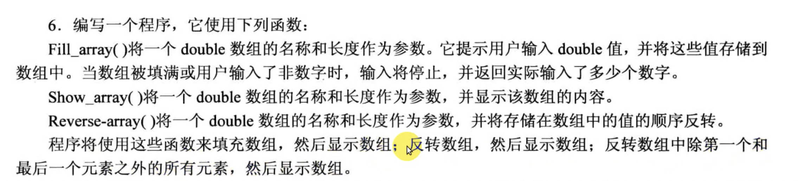
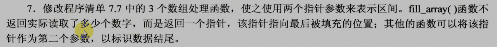
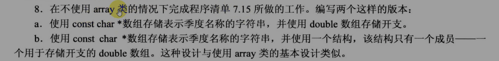
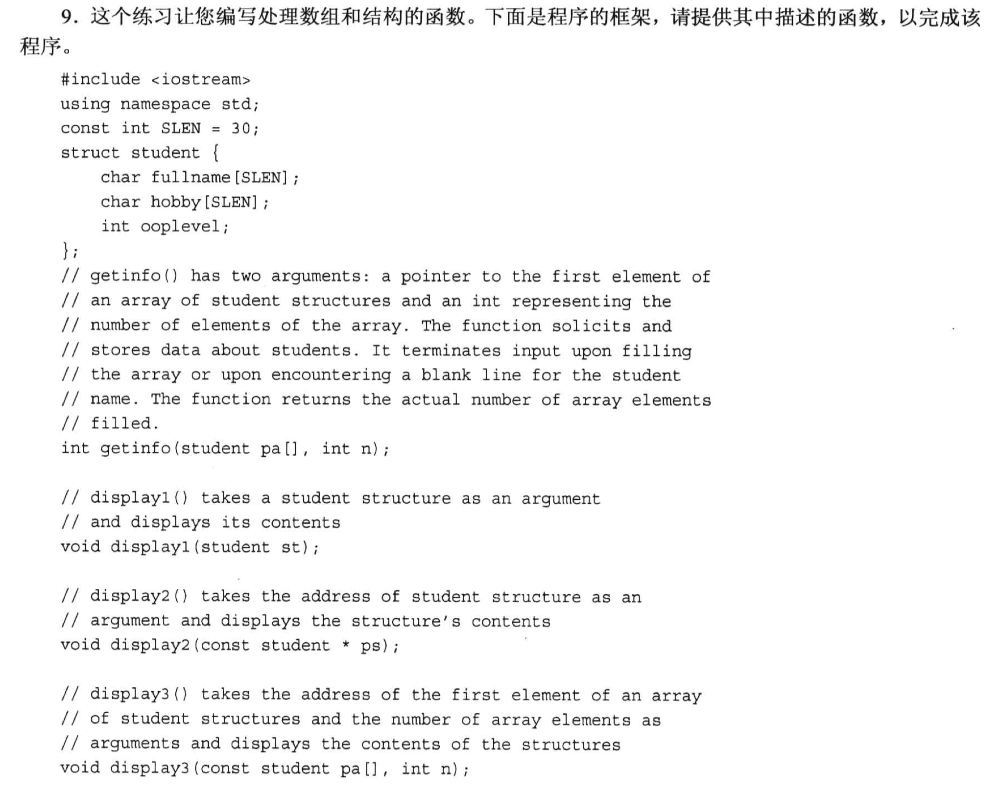
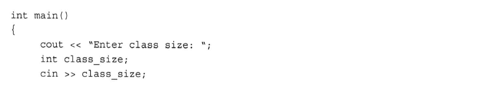
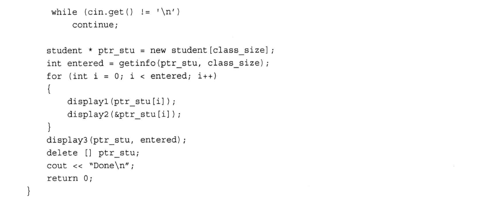
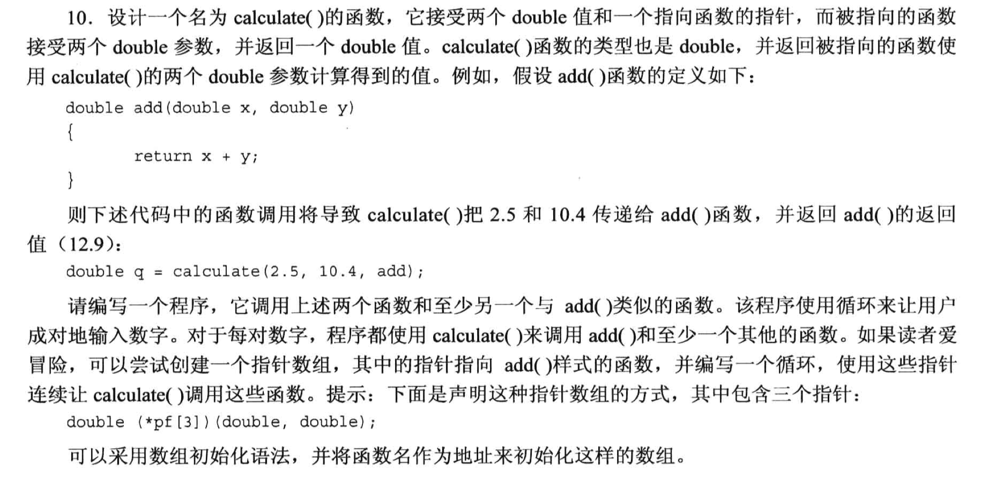

# 7.13 编程题 (example_code 有独立的代码文件)

## 题目 1-5


### 1.
```cpp
#include <iostream>

using namespace std;
double harmonicMean(double x, double y);

int main(void)
{
    double n1, n2, result;
    cout << "Please enter two numbers, until one of them is zero: ";
    cin >> n1 >> n2;

    while ((0 != n1) && (0 != n2)){
        result = harmonicMean(n1, n2);
        cout << "The harmonic means is: " << result << endl;

        cout << "Please enter two numbers, until one of them is zero: ";
        cin >> n1 >> n2;
    }
    return 0;
}

double harmonicMean(double x, double y)
{
    return 2.0 * x * y / (x+y);
}
```


### 2.
```cpp
#include <iostream>

using namespace std;
const int MAX = 10;

int fill_golf(double arr[], int n);
void show_golf(double arr[], int n);
double avg_golf(double arr[], int n);


int main(void)
{
    double golf[MAX];

    // 函数1: 记录高尔夫成绩, 返回一共录入了多少个成绩
    int size = fill_golf(golf, MAX);

    if(size > 0){

        // 函数2: 在一行中显示
        show_golf(golf, size);
        // 函数3: 计算平均值
        double result = avg_golf(golf, size);
        cout << "Average score: " << result << endl; 
    }
    else{
        cout << "There is No valid scores entered." << endl;
    }

    return 0;
}

int fill_golf(double arr[], int n)
{
    int i = 0;
    for (; i < MAX; i++){
        cout << "Please enter the score #" << i+1 << ": ";
        
        // 检查输入是否有效
        double temp;
        cin >> temp;
        if (!cin){
            cin.clear();          // 如果输入的不是数字, 需要重置cin
            // 清空缓冲区(以回车作为结束标志)
            while(cin.get() != '\n'){
                continue;
            }
            cout << "Bad input, terminated!" << endl;
            break;
        }
        else if(temp < 0){      // 分数不可能是负数
            cout << "Bad input (negative score!), terminated!" << endl;
            break;
        }
        else{
            arr[i] = temp;
        }
    }

    return i;
}

void show_golf(double arr[], int n)
{
    cout << "You have entered scores: ";
    for (int i = 0; i < n; i++){
        cout << arr[i] << " ";
    }
    cout << endl;
}

double avg_golf(double arr[], int n)
{
    double sum = 0;
    for (int i = 0; i < n; i++){
        sum += arr[i];
    }

    return sum / n;
}
```

### 3.
```cpp
#include <iostream>

using namespace std;

struct box{
    char maker[40];
    float height;
    float width;
    float length;
    float volume;
};

void setBox(box *pb);
void showBox(box a);

int main(void)
{
    box b = {"cube", 3, 4, 5};      // 没有填入volume

    setBox(&b);     // 传地址

    showBox(b);     // 传值

    return 0;
}

void setBox(box *pb)
{
    pb->volume = pb->height*pb->length*pb->width;
}

void showBox(box a)
{
    cout << "Maker: " << a.maker << endl;
    cout << "Height: " << a.height << endl;
    cout << "Width: " << a.width << endl;
    cout << "Length: " << a.length << endl;
    cout << "Volume: " << a.volume << endl;
}
```

### 4. 
- 改一下题目, 懒得选数了, 直接计算 47个数字中猜中5个的概率, 以及21个中1个的概率
```cpp
#include <iostream>

using namespace std;

long double probability(unsigned int numbers, unsigned int picks);

int main(void)
{
    unsigned int total, choices;

    long double filed = probability(47,5);  // 47 个数字中选 5 个
    long double spectial = probability(27,1);   // 27 个数字中选 1 个
    long double result = filed * spectial;
    cout << "result: " << result << endl;

    // cout << "Enter the total number of choices on the game card and the number of picks allowed:";
    // while (cin >> total >> choices)  // 连续输入两个数, 并同时分别按输入顺序赋值
    // {
    //     cout << "You have one chance in ";  // 中间的概率
    //     cout << probability(total, choices);
    //     cout << " of winning.\n";
    //     cout << "Next two numbers (q to quit): ";
    // }
    // cout << "Bye.\n";
    return 0;
}

long double probability(unsigned int numbers, unsigned int picks)
{
    double n , p;
    long double result = 1.0;

    for (n = numbers, p = picks ; p > 0; n--, p--)
    {
        result = result * (n/p);
    }
    return result;
}
```

### 5.
```cpp
#include <iostream>

using namespace std;

long long factorial(unsigned int n);

int main(void)
{
    int number;
    cout << "Enter a number for factorial: ";
    while(cin >> number){
        long long result;
        result = factorial(number);
        cout << number << "! = " << result << endl;
        cout << "Enter a number for factorial: ";
    }

    return 0;
}

long long factorial(unsigned int n)
{
    if (n == 0){
        return 1;
    }
    else{
        return n * factorial(n-1);
    }
}
```

### 6.


```cpp
#include <iostream>

using namespace std;

const int MAX = 40;

int fillArray(double arr[], int size);

void showArray(double arr[], int n);

void reverseArray(double arr[], int n);

int main(void)
{
    double array[MAX];

    int size = fillArray(array, MAX);           // 填数据
    showArray(array, size);                     // 显示当前数据

    // 第一次反转
    reverseArray(array, size);
    showArray(array, size);

    // 第二次反转
    reverseArray(array+1, size-2);      // 反转从第二个元素开始, 到倒数第二个元素结束
    // reverseArray(&array[1], size-2); // 与上一行等价
    showArray(array, size);             // 显示结果

    return 0;
}

int fillArray(double arr[], int size)
{
    int i = 0;  // 统计实际输入了几个

    for (; i < size; i++){
        int tmp;
        cout << "Please enter the #" << i+1 << " number (q to terminate): ";
        cin  >> tmp;
        
        if (!cin){  // 触发非法输入时, 清空缓冲区
            cin.clear();
            // 也可以省略掉continue, 写成: while(cin.get() != '\n');
            while(cin.get() != '\n'){
                continue;
            }
            break;
        }
        else{
            arr[i] = tmp;
        }
    }

    return i;
}

void showArray(double arr[], int size)
{
    cout << "Array content: ";
    for (int i = 0; i < size; i++)
        cout << arr[i] << " ";
    cout << endl;
}

void reverseArray(double arr[], int size)
{
    double tmp;
    for (int i = 0; i < size/2; i++){  // 注意除二取整的操作
        tmp = arr[i];
        arr[i] = arr[size - i - 1];     // 别忘了减去 i 和 1
        arr[size - i - 1] = tmp;
    } 
}
```

### 7.


```cpp
/*
    编程题第七题
*/

#include <iostream>
const int Max = 5;

double* fill_array(double* begin, double* end);
void show_array(double* begin, double* end);
void revaluate(double r, double* begin, double* end);


using namespace std;

int main(void){

    double properties[Max];

    double* pa = fill_array(properties, properties + Max);  // 录入
    
    show_array(properties, pa);       // 回显

    int size = (pa - properties);
    if( size > 0){
        cout << "Enter revaluation factor: ";
        double factor;
        while(!(cin >> factor)){    // 检查cin是不是停止工作
            cin.clear();            // 清除cin的标志位
            while(cin.get() != '\n'){  // 清掉cin的缓冲区
                continue;
            }
            cout << "Bad input; Please enter a number: ";
        }
        revaluate(factor, properties, pa); // 重新评估(重新写入数据)

        show_array(properties, properties + size);       // 回显
        // show_array(properties, pa);       // 等价于上一行
    }


    return 0;
}

/// @brief 填充数组, 返回数组末尾指针
/// @param begin 数组起始指针
/// @param end  数组末尾指针的下一个位置 (为了确保数组最后一个元素能访问到)
/// @return 数组末尾指针
double* fill_array(double* begin, double* end){

    double* pt;
    double temp;

    for(pt = begin; pt != end; pt++){         // 注意end是数组最后一个元素的下一个地址
        // 换算数组下标: (pt - begin) + 1
        cout << "Enter value #" << (pt - begin) + 1 << ": ";
        cin >> temp;
        if (!cin){
            cin.clear();
            while(cin.get() != '\n');
            cout << "Bad input; input process terminated.\n";
            break;
        }
        else if (temp < 0){         // 负数视为非法值
            break;
        }
        else{
            *pt = temp;
        }
    }

    return pt;          // 返回尾指针
}

/// @brief 回显数组
/// @param begin 数组起始位置
/// @param end 数组最后元素的下一个位置
void show_array(double* begin, double* end ){   // const 保护数组指针指向的内容
    for(double * pt = begin; pt != end; pt++){
        cout << "Property #" << (pt-begin) + 1 << ": $";
        cout << *pt << endl;
    }
}

void revaluate(double r, double* begin, double* end){

    for(double* pt = begin; pt != end; pt++){
       *pt *= r;
    }
}
```
- 注意一个知识点;
  - `相同数据类型`的指针`作差`时, 得到的是两个指针之间的`元素个数`, 而不是地址数值的差值, 因此, 在代码中计算 begin 和 end 之间的元素个数时, 不需要除以 `sizeof(double)`.

### 8.


- a
```cpp
#include <iostream>
#include <string>

using namespace std;
const int SEASONS = 4;

void fill(double arr[], int size);
void show(const double arr[], int size);

const char* Snames[] = {"Spring", "Summer", "Fall", "Winter"};  // 初始化四个季节的名字

int main(void)
{
    double expenses[SEASONS];  // expenses 用来存放四个季节的开销
    fill(expenses, SEASONS);
    show(expenses, SEASONS);

    return 0;
}

void fill(double arr[], int size)           // 要修改数组, 所以不加 const 做保护
{
    for(int i = 0; i < size; i++){
        cout << "Enter " << Snames[i] << " expenses: ";
        cin >> arr[i];
    }
}

void show(const double arr[], int size)
{
    double total = 0.0;
    cout << "EXPENSES: " << endl;
    for (int i = 0; i < size; i++){
        cout << Snames[i] << "\t: $" << arr[i] << endl;
        total += arr[i];
    }
    cout << "Total: " << total << endl;
}
```


- b

```cpp
#include <iostream>
#include <string>

using namespace std;
const int SEASONS = 4;

void fill(double arr[], int size);
void show(const double arr[], int size);

const char* Snames[] = {"Spring", "Summer", "Fall", "Winter"};  // 初始化四个季节的名字

struct Spend            // 用结构体把原来的 expenses 包起来, 让它像array模板类
{
    double money[SEASONS];
};

int main(void)
{
    Spend expenses;
    // double expenses[SEASONS];  // expenses 用来存放四个季节的开销
    fill(expenses.money, SEASONS);
    show(expenses.money, SEASONS);

    return 0;
}

void fill(double arr[], int size)           // 要修改数组, 所以不加 const 做保护
{
    for(int i = 0; i < size; i++){
        cout << "Enter " << Snames[i] << " expenses: ";
        cin >> arr[i];
    }
}

void show(const double arr[], int size)
{
    double total = 0.0;
    cout << "EXPENSES: " << endl;
    for (int i = 0; i < size; i++){
        cout << Snames[i] << "\t: $" << arr[i] << endl;
        total += arr[i];
    }
    cout << "Total: " << total << endl;
}
```

### 9.




```cpp
#include <iostream>

using namespace std;

const int SLEN = 30;
struct student{
    char fullname[SLEN];
    char hobby[SLEN];
    int ooplevel;
};

// getinfo() 从标准输入中读取 n 个学生的信息, 并保存到结构数组中
// 返回值是实际读取的学生个数
int getinfo(student pa[], int n);

// display1() 显示一个学生的信息
void display1(student st);

// display2() 显示结构数组中的所有学生信息
void display2(const student pa[], int n);

// display3() 显示结构数组中的所有学生信息
// 但是使用指向结构的指针
void display3(const student* ps, int n);

int main()
{
    cout << "Enter class size: ";
    int class_size;
    cin >> class_size;
    while (cin.get() != '\n'){
        continue;
    }

    student* ptr_stu = new student[class_size];
    int entered = getinfo(ptr_stu, class_size);
    for (int i = 0; i < entered; i++){
        display1(ptr_stu[i]);
        display2(&ptr_stu[i], 1);
    }

    display3(ptr_stu, entered);
    delete [] ptr_stu;
    cout << "Done\n";
    return 0;
}


int getinfo(student pa[], int n)
{
    int i;
    for (i = 0; i < n; i++){
        cout << "Enter the name of student #" << i+1 << ": ";
        cin >> pa[i].fullname;

        cout << "Enter the hoby of student #" << i+1 << ": ";
        cin >> pa[i].hobby;

        cout << "Enter the level of student #" << i+1 << ": ";
        cin >> pa[i].ooplevel;
        
        if (!cin){
            cin.clear();
            while(cin.get() != '\n');
            break;
        }
    }
    return i;
}

void display1(student st)
{
    // 结构体支持直接对拷(注意 数组不支持对拷)
    cout << "Name: " << st.fullname << endl;
    cout << "Hoby: " << st.hobby << endl;
    cout << "Level: " << st.ooplevel << endl;
    cout << endl;
}

void display2(const student pa[], int n)
{
    for (int i = 0; i < n; i++){
        cout << "Student #" << i+1 << endl;
        cout << "Name: " << pa[i].fullname << endl;
        cout << "Hoby: " << pa[i].hobby << endl;
        cout << "Level: " << pa[i].ooplevel << endl;
        cout << endl;
    }
}

void display3(const student* ps, int n)
{
    for (int i = 0; i < n; i++){
        cout << "Student #" << i+1 << endl;
        cout << "Name: " << ps[i].fullname << endl;
        cout << "Hoby: " << ps[i].hobby << endl;
        cout << "Level: " << ps[i].ooplevel << endl;
        cout << endl;
    }
}
```


### 10.


```cpp
#include <iostream>
using namespace std;

double add(double x, double y);
double subtract (double x, double y);
double calculate(double x, double y, double (*pt) (double x, double y));

int main(void)
{
    double result = calculate(2.5, 10.4, add);
    cout << "The result of add is: " << result << endl;

    result = calculate(10.4, 2.5, subtract);
    cout << "The result of subtract is: " << result << endl;
    return 0;
}

double add(double x, double y)
{
    return x + y;
}

double subtract (double x, double y)
{
    return x - y;
}

double calculate(double x, double y, double (*pt) (double x, double y))
{
    return pt(x, y);
}
```

