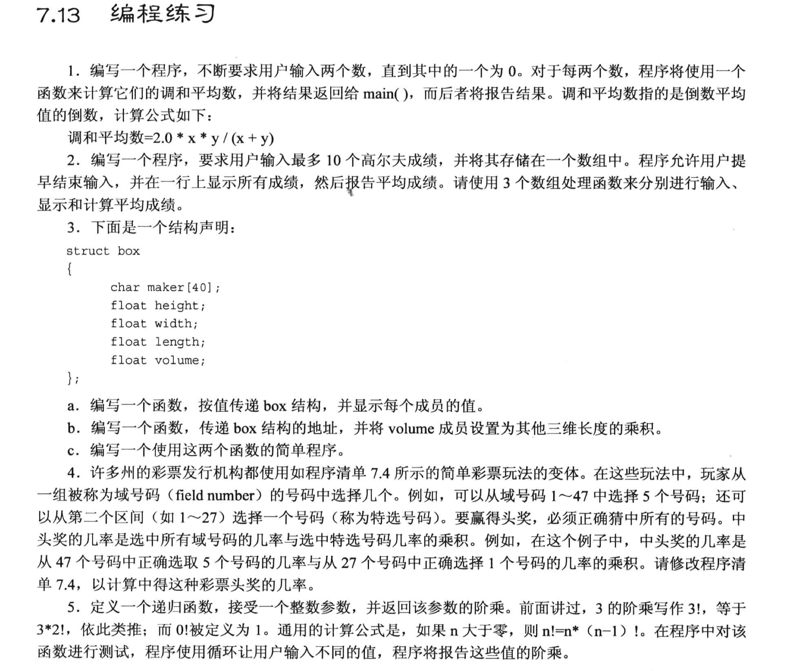

# 7.13 编程题 (example_code 有独立的代码文件)

## 题目 1-5


### 1.
```cpp
#include <iostream>

using namespace std;
double harmonicMean(double x, double y);

int main(void)
{
    double n1, n2, result;
    cout << "Please enter two numbers, until one of them is zero: ";
    cin >> n1 >> n2;

    while ((0 != n1) && (0 != n2)){
        result = harmonicMean(n1, n2);
        cout << "The harmonic means is: " << result << endl;

        cout << "Please enter two numbers, until one of them is zero: ";
        cin >> n1 >> n2;
    }
    return 0;
}

double harmonicMean(double x, double y)
{
    return 2.0 * x * y / (x+y);
}
```


### 2.
```cpp
#include <iostream>

using namespace std;
const int MAX = 10;

int fill_golf(double arr[], int n);
void show_golf(double arr[], int n);
double avg_golf(double arr[], int n);


int main(void)
{
    double golf[MAX];

    // 函数1: 记录高尔夫成绩, 返回一共录入了多少个成绩
    int size = fill_golf(golf, MAX);

    if(size > 0){

        // 函数2: 在一行中显示
        show_golf(golf, size);
        // 函数3: 计算平均值
        double result = avg_golf(golf, size);
        cout << "Average score: " << result << endl; 
    }
    else{
        cout << "There is No valid scores entered." << endl;
    }

    return 0;
}

int fill_golf(double arr[], int n)
{
    int i = 0;
    for (; i < MAX; i++){
        cout << "Please enter the score #" << i+1 << ": ";
        
        // 检查输入是否有效
        double temp;
        cin >> temp;
        if (!cin){
            cin.clear();          // 如果输入的不是数字, 需要重置cin
            // 清空缓冲区(以回车作为结束标志)
            while(cin.get() != '\n'){
                continue;
            }
            cout << "Bad input, terminated!" << endl;
            break;
        }
        else if(temp < 0){      // 分数不可能是负数
            cout << "Bad input (negative score!), terminated!" << endl;
            break;
        }
        else{
            arr[i] = temp;
        }
    }

    return i;
}

void show_golf(double arr[], int n)
{
    cout << "You have entered scores: ";
    for (int i = 0; i < n; i++){
        cout << arr[i] << " ";
    }
    cout << endl;
}

double avg_golf(double arr[], int n)
{
    double sum = 0;
    for (int i = 0; i < n; i++){
        sum += arr[i];
    }

    return sum / n;
}
```

### 3.
```cpp
#include <iostream>

using namespace std;

struct box{
    char maker[40];
    float height;
    float width;
    float length;
    float volume;
};

void setBox(box *pb);
void showBox(box a);

int main(void)
{
    box b = {"cube", 3, 4, 5};      // 没有填入volume

    setBox(&b);     // 传地址

    showBox(b);     // 传值

    return 0;
}

void setBox(box *pb)
{
    pb->volume = pb->height*pb->length*pb->width;
}

void showBox(box a)
{
    cout << "Maker: " << a.maker << endl;
    cout << "Height: " << a.height << endl;
    cout << "Width: " << a.width << endl;
    cout << "Length: " << a.length << endl;
    cout << "Volume: " << a.volume << endl;
}
```

### 4. 
- 改一下题目, 懒得选数了, 直接计算 47个数字中猜中5个的概率, 以及21个中1个的概率
```cpp
#include <iostream>

using namespace std;

long double probability(unsigned int numbers, unsigned int picks);

int main(void)
{
    unsigned int total, choices;

    long double filed = probability(47,5);  // 47 个数字中选 5 个
    long double spectial = probability(27,1);   // 27 个数字中选 1 个
    long double result = filed * spectial;
    cout << "result: " << result << endl;

    // cout << "Enter the total number of choices on the game card and the number of picks allowed:";
    // while (cin >> total >> choices)  // 连续输入两个数, 并同时分别按输入顺序赋值
    // {
    //     cout << "You have one chance in ";  // 中间的概率
    //     cout << probability(total, choices);
    //     cout << " of winning.\n";
    //     cout << "Next two numbers (q to quit): ";
    // }
    // cout << "Bye.\n";
    return 0;
}

long double probability(unsigned int numbers, unsigned int picks)
{
    double n , p;
    long double result = 1.0;

    for (n = numbers, p = picks ; p > 0; n--, p--)
    {
        result = result * (n/p);
    }
    return result;
}
```


